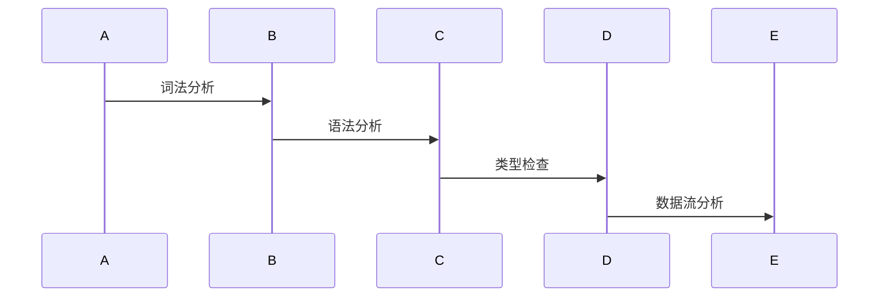

                 

### 文章标题

# 《提示词编程语言的静态分析工具链》

> 关键词：提示词编程语言、静态分析、工具链、编程语言分析、代码质量提升

> 摘要：本文将深入探讨提示词编程语言的静态分析工具链，从基础到实现，全面解析静态分析在编程语言中的应用，以及如何设计和优化静态分析工具链。本文旨在为开发者提供实用的技术指导，帮助他们更好地理解和应用静态分析工具链，提高代码质量和开发效率。

## 第一部分：静态分析基础

### 第1章：静态分析概述

#### 1.1 静态分析的定义与作用

静态分析是一种在程序执行之前对其源代码或编译后的字节码进行分析的技术。这种分析无需程序运行，因此可以提前发现代码中潜在的问题，如语法错误、类型错误和逻辑错误等。静态分析的作用主要体现在以下几个方面：

1. **代码质量提升**：通过静态分析，开发者可以提前发现代码中的问题，从而提高代码质量。
2. **性能优化**：静态分析可以帮助识别代码中的性能瓶颈，从而进行针对性的优化。
3. **安全性检测**：静态分析可以识别出潜在的安全漏洞，如缓冲区溢出、未初始化变量等。
4. **代码重构与迁移**：静态分析可以帮助开发者理解代码结构，从而进行重构或迁移到其他平台。

#### 1.2 静态分析的起源与发展

静态分析技术的起源可以追溯到早期编程语言的编译阶段。当时，编译器的开发者开始关注如何对源代码进行语法和语义分析，以便生成有效的目标代码。随着计算机科学的发展，静态分析技术逐渐从编译阶段扩展到代码分析工具、代码审查、代码质量评估等多个领域。

近年来，随着编程语言的复杂性和规模不断增加，静态分析技术也得到迅速发展。现代静态分析工具不仅可以处理多种编程语言，还具备更强大的分析能力和优化能力。

#### 1.3 静态分析在编程语言中的应用

静态分析在编程语言中的应用非常广泛，主要包括以下几个方面：

1. **编译器**：编译器是静态分析技术的核心应用之一。通过静态分析，编译器可以生成高效的机器代码，并提前发现语法错误和类型错误。
2. **代码质量评估工具**：如SonarQube、Checkstyle等工具，可以分析代码的质量、可读性、可维护性等方面。
3. **代码审查**：静态分析可以帮助开发者进行代码审查，发现潜在的问题和漏洞。
4. **自动化测试**：静态分析可以辅助自动化测试，通过分析代码结构生成测试用例，提高测试覆盖率。

### 第2章：静态分析的原理与技术

#### 2.1 词法分析

词法分析是静态分析的第一步，其目的是将源代码分解成一个个词法单元（tokens），如标识符、关键字、操作符等。词法分析的基本原理包括：

1. **扫描源代码**：从源代码的开头开始，逐个字符地进行扫描。
2. **状态转换**：根据当前字符的属性和上下文，进行状态转换，生成对应的词法单元。
3. **错误处理**：当遇到无法识别的字符或错误时，进行错误处理，如报错、警告或忽略。

词法分析器的实现通常基于有限状态机（FSM）模型。以下是一个简单的词法分析器的伪代码实现：

```python
class Lexer:
    def __init__(self, source_code):
        self.source_code = source_code
        self.current_char = self.source_code[0]

    def next_token(self):
        if self.current_char == '+':
            token = '+'
            self.current_char = self.source_code[1:]
        elif self.current_char == '-':
            token = '-'
            self.current_char = self.source_code[1:]
        else:
            raise ValueError("Invalid token")
        return token
```

#### 2.2 语法分析

语法分析是静态分析的另一个关键步骤，其目的是将词法单元转换成抽象语法树（AST），表示代码的结构。语法分析的基本原理包括：

1. **解析规则**：根据编程语言的语法规则，定义解析规则，将词法单元转换成AST。
2. **语法分析器**：实现语法分析器，根据解析规则对词法单元进行解析，生成AST。

递归下降分析器是一种常见的语法分析器，其基本原理是递归地调用解析规则，逐层解析词法单元，构建AST。以下是一个简单的递归下降语法分析器的伪代码实现：

```python
class Parser:
    def __init__(self, lexer):
        self.lexer = lexer

    def parse_expression(self):
        token = self.lexer.next_token()
        if token == '+':
            left = self.parse_expression()
            right = self.parse_expression()
            return left + right
        elif token == '-':
            left = self.parse_expression()
            right = self.parse_expression()
            return left - right
        else:
            raise ValueError("Invalid expression")
```

#### 2.3 类型检查

类型检查是静态分析中的另一个重要步骤，其目的是确保代码中的类型使用是正确的。类型检查的基本原理包括：

1. **类型系统**：定义编程语言中的类型系统，包括基本类型、复合类型和类型转换。
2. **类型约束**：对代码中的每个表达式进行类型约束检查，确保类型匹配。

静态类型系统和动态类型系统是两种常见的类型系统。静态类型系统在编译时对类型进行检查，而动态类型系统则在运行时进行检查。

以下是一个简单的静态类型检查器的伪代码实现：

```python
class TypeChecker:
    def __init__(self, ast):
        self.ast = ast

    def check_expression(self, expr):
        if isinstance(expr, Add):
            if self.check_type(expr.left) and self.check_type(expr.right):
                return "int"
            else:
                raise TypeError("Incompatible types")
        else:
            raise ValueError("Invalid expression")
```

#### 2.4 数据流分析

数据流分析是一种静态分析技术，用于分析代码中的变量使用和传播。数据流分析可以分为前向数据流分析和后向数据流分析。

前向数据流分析从程序开头开始，逐个语句进行分析，分析变量在后续语句中的使用和传播。后向数据流分析则从程序结尾开始，逐个语句进行分析，分析变量在当前语句中的定义和使用。

以下是一个简单的数据流分析器的伪代码实现：

```python
class DataFlowAnalyzer:
    def __init__(self, ast):
        self.ast = ast

    def forward_data_flow(self):
        for statement in self.ast.statements:
            for successor in statement.successors:
                if successor not in self.ast.defined_variables:
                    self.ast.defined_variables.add(successor)
```

### 第1章 总结

本章介绍了静态分析的基础知识，包括静态分析的定义、起源与发展，以及静态分析在编程语言中的应用。同时，详细介绍了词法分析、语法分析、类型检查和数据流分析的基本原理与实现。这些基础知识为后续章节的工具链设计与实现打下了坚实的基础。

## 第二部分：工具链设计与实现

### 第3章：工具链架构设计

#### 3.1 工具链的整体架构

一个典型的静态分析工具链通常包括以下几个模块：

1. **词法分析器（Lexer）**：将源代码分解成词法单元。
2. **语法分析器（Parser）**：将词法单元转换成抽象语法树（AST）。
3. **类型检查器（TypeChecker）**：对AST进行类型检查。
4. **数据流分析器（DataFlowAnalyzer）**：对AST进行数据流分析。

这些模块可以独立实现，但为了提高开发效率，通常会集成在一起，形成一个整体工具链。以下是一个简单的工具链架构图：



#### 3.2 各个模块的功能与接口

1. **词法分析器（Lexer）**：

   - 功能：将源代码分解成词法单元。
   - 接口：`next_token()`，返回下一个词法单元。

2. **语法分析器（Parser）**：

   - 功能：将词法单元转换成抽象语法树（AST）。
   - 接口：`parse()`，返回AST。

3. **类型检查器（TypeChecker）**：

   - 功能：对AST进行类型检查。
   - 接口：`check_ast()`，返回检查结果。

4. **数据流分析器（DataFlowAnalyzer）**：

   - 功能：对AST进行数据流分析。
   - 接口：`analyze_data_flow()`，返回分析结果。

#### 3.3 工具链的集成与调试

为了实现工具链的整体功能，需要将各个模块集成在一起。通常，可以使用以下步骤：

1. **初始化**：创建词法分析器、语法分析器、类型检查器和数据流分析器实例。
2. **词法分析**：使用词法分析器对源代码进行词法分析，生成词法单元。
3. **语法分析**：使用语法分析器对词法单元进行语法分析，生成AST。
4. **类型检查**：使用类型检查器对AST进行类型检查。
5. **数据流分析**：使用数据流分析器对AST进行数据流分析。

在集成过程中，可能会遇到以下问题：

- **接口不兼容**：需要确保各个模块的接口能够无缝对接。
- **错误处理**：需要对词法分析、语法分析和类型检查中的错误进行统一处理。
- **调试**：需要通过调试工具（如IDE）进行调试，确保工具链能够正常工作。

### 第3章 总结

本章介绍了静态分析工具链的架构设计，包括整体架构、各个模块的功能与接口，以及工具链的集成与调试。这些内容为后续章节的工具链实现提供了指导。

### 第4章：语法分析器的实现

#### 4.1 递归下降分析器

递归下降分析器是一种常见的语法分析器，其基本原理是递归地调用解析规则，逐层解析词法单元，构建抽象语法树（AST）。以下是一个简单的递归下降语法分析器的实现：

```python
class RecursiveDescentParser:
    def __init__(self, lexer):
        self.lexer = lexer

    def parse_expression(self):
        token = self.lexer.next_token()
        if token == '+':
            left = self.parse_expression()
            right = self.parse_expression()
            return Add(left, right)
        elif token == '-':
            left = self.parse_expression()
            right = self.parse_expression()
            return Subtract(left, right)
        else:
            raise ValueError("Invalid expression")

    def parse_statement(self):
        token = self.lexer.next_token()
        if token == 'print':
            expression = self.parse_expression()
            return PrintStatement(expression)
        else:
            raise ValueError("Invalid statement")
```

在这个例子中，我们定义了两个方法：`parse_expression()` 和 `parse_statement()`。`parse_expression()` 解析加法和减法表达式，而 `parse_statement()` 解析打印语句。这两个方法都是递归调用的，从而实现了递归下降分析。

#### 4.2 伪代码实现

递归下降分析器的伪代码实现如下：

```
function parse_expression()
    token = get_next_token()
    if token == '+'
        left = parse_expression()
        right = parse_expression()
        return Add(left, right)
    elif token == '-'
        left = parse_expression()
        right = parse_expression()
        return Subtract(left, right)
    else
        raise Error("Invalid expression")

function parse_statement()
    token = get_next_token()
    if token == 'print'
        expression = parse_expression()
        return PrintStatement(expression)
    else
        raise Error("Invalid statement")
```

在这个伪代码中，`get_next_token()` 是一个虚构的函数，用于获取下一个词法单元。`Add` 和 `Subtract` 是表达式节点类，`PrintStatement` 是语句节点类。

#### 4.3 实现细节

在实现递归下降分析器时，需要注意以下细节：

1. **错误处理**：当遇到无效的词法单元或解析失败时，应抛出异常或返回错误消息。
2. **递归深度**：递归深度不应过大，以免引起栈溢出。
3. **代码复用**：可以通过重用解析方法，减少代码冗余。

以下是一个改进的递归下降分析器实现，使用了代码复用：

```python
class RecursiveDescentParser:
    def __init__(self, lexer):
        self.lexer = lexer

    def parse_expression(self):
        token = self.lexer.next_token()
        if token == '+'
            left = self.parse_expression()
            right = self.parse_expression()
            return Add(left, right)
        elif token == '-'
            left = self.parse_expression()
            right = self.parse_expression()
            return Subtract(left, right)
        else
            raise ValueError("Invalid expression")

    def parse_term(self):
        return self.parse_expression()

    def parse_statement(self):
        token = self.lexer.next_token()
        if token == 'print'
            expression = self.parse_expression()
            return PrintStatement(expression)
        else
            raise ValueError("Invalid statement")
```

在这个实现中，`parse_term()` 是一个辅助方法，用于将 `parse_expression()` 替换为 `parse_term()`，从而简化了代码。

### 第4章 总结

本章介绍了递归下降分析器的实现，包括伪代码和具体实现。递归下降分析器是一种简单而有效的语法分析器，适用于简单的编程语言。通过代码复用和错误处理，可以进一步提高分析器的性能和可靠性。

### 第5章：类型检查器的实现

#### 5.1 静态类型系统

静态类型系统在编译时对类型进行检查，确保代码中的类型使用是正确的。静态类型系统的基本概念包括：

1. **类型**：表示变量的数据类型，如整数（`int`）、浮点数（`float`）、布尔值（`bool`）等。
2. **类型约束**：对变量或表达式的类型进行约束，确保类型匹配。
3. **类型推导**：从代码中自动推导出变量的类型，减少显式类型声明的需求。

以下是一个简单的静态类型检查器的实现：

```python
class StaticTypeChecker:
    def __init__(self, ast):
        self.ast = ast

    def check_variable(self, variable):
        if variable.value in self.types:
            return self.types[variable.value]
        else:
            raise TypeError("Unknown variable type")

    def check_expression(self, expression):
        if isinstance(expression, Add):
            left_type = self.check_expression(expression.left)
            right_type = self.check_expression(expression.right)
            if left_type == right_type:
                return left_type
            else:
                raise TypeError("Incompatible types")
        elif isinstance(expression, Subtract):
            left_type = self.check_expression(expression.left)
            right_type = self.check_expression(expression.right)
            if left_type == right_type:
                return left_type
            else:
                raise TypeError("Incompatible types")
```

在这个实现中，`check_variable()` 方法检查变量类型，`check_expression()` 方法检查表达式类型。

#### 5.2 动态类型系统

动态类型系统在运行时对类型进行检查，允许在运行时改变变量的类型。动态类型系统的基本概念包括：

1. **类型检查**：在运行时对变量和表达式的类型进行检查。
2. **类型转换**：在运行时自动或显式地转换变量类型。

以下是一个简单的动态类型检查器的实现：

```python
class DynamicTypeChecker:
    def __init__(self, ast):
        self.ast = ast

    def check_variable(self, variable):
        return variable.value

    def check_expression(self, expression):
        if isinstance(expression, Add):
            left_type = self.check_expression(expression.left)
            right_type = self.check_expression(expression.right)
            if left_type == right_type:
                return left_type
            else:
                return "mixed"
        elif isinstance(expression, Subtract):
            left_type = self.check_expression(expression.left)
            right_type = self.check_expression(expression.right)
            if left_type == right_type:
                return left_type
            else:
                return "mixed"
```

在这个实现中，`check_variable()` 方法直接返回变量值，`check_expression()` 方法检查表达式类型，并在类型不匹配时返回 `"mixed"`。

#### 5.3 伪代码实现

静态类型检查器的伪代码实现如下：

```
function check_variable(variable)
    if variable in types
        return types[variable]
    else
        raise Error("Unknown variable type")

function check_expression(expression)
    if expression is Add
        left_type = check_expression(expression.left)
        right_type = check_expression(expression.right)
        if left_type == right_type
            return left_type
        else
            raise Error("Incompatible types")
    elif expression is Subtract
        left_type = check_expression(expression.left)
        right_type = check_expression(expression.right)
        if left_type == right_type
            return left_type
        else
            raise Error("Incompatible types")
```

动态类型检查器的伪代码实现如下：

```
function check_variable(variable)
    return variable.value

function check_expression(expression)
    if expression is Add
        left_type = check_expression(expression.left)
        right_type = check_expression(expression.right)
        if left_type == right_type
            return left_type
        else
            return "mixed"
    elif expression is Subtract
        left_type = check_expression(expression.left)
        right_type = check_expression(expression.right)
        if left_type == right_type
            return left_type
        else
            return "mixed"
```

#### 5.4 实现细节

在实现类型检查器时，需要注意以下细节：

1. **类型推断**：根据上下文自动推导变量和表达式的类型。
2. **类型兼容性**：处理不同类型之间的兼容性，如整数和浮点数之间的运算。
3. **错误处理**：当类型检查失败时，应提供明确的错误信息。

### 第5章 总结

本章介绍了静态类型系统和动态类型系统的实现，包括伪代码和具体实现。静态类型系统在编译时进行类型检查，而动态类型系统在运行时进行类型检查。通过合理设计类型检查器，可以确保代码的类型安全性和可靠性。

### 第6章：数据流分析器的实现

#### 6.1 前向数据流分析

前向数据流分析是一种从程序开头开始，逐个语句进行分析的技术，用于分析变量在后续语句中的使用和传播。前向数据流分析的基本原理包括：

1. **定义集合（Def-Set）**：表示一个语句中定义的变量集合。
2. **使用集合（Use-Set）**：表示一个语句中使用的变量集合。
3. **传播规则**：用于计算下一个语句的定义集合和使用集合。

前向数据流分析的伪代码实现如下：

```
function forward_data_flow_analysis(program)
    for each statement S in program
        S.def_set = {variables defined in S}
        S.use_set = empty set

    for each statement S in program
        for each successor S' of S
            S'.def_set = S.def_set
            S'.use_set = S.use_set U S.def_set

    return program
```

在这个实现中，`program` 是程序的抽象语法树（AST），`statement` 是AST中的每个语句。`def_set` 和 `use_set` 分别表示定义集合和使用集合。

#### 6.2 后向数据流分析

后向数据流分析是一种从程序结尾开始，逐个语句进行分析的技术，用于分析变量在当前语句中的定义和使用。后向数据流分析的基本原理包括：

1. **定义集合（Def-Set）**：表示一个语句中定义的变量集合。
2. **使用集合（Use-Set）**：表示一个语句中使用的变量集合。
3. **传播规则**：用于计算下一个语句的定义集合和使用集合。

后向数据流分析的伪代码实现如下：

```
function backward_data_flow_analysis(program)
    for each statement S in program
        S.def_set = {variables defined in S}
        S.use_set = empty set

    for each statement S in program, in reverse order
        for each predecessor S' of S
            S'.def_set = S'.def_set U S.use_set
            S'.use_set = S'.use_set U S.def_set

    return program
```

在这个实现中，`program` 是程序的抽象语法树（AST），`statement` 是AST中的每个语句。`def_set` 和 `use_set` 分别表示定义集合和使用集合。

#### 6.3 伪代码实现

前向数据流分析和后向数据流分析的伪代码实现如下：

```
function forward_data_flow_analysis(statement)
    statement.def_set = {variables defined in statement}
    statement.use_set = empty set

    for each successor statement S' of statement
        S'.def_set = statement.def_set
        S'.use_set = statement.use_set U statement.def_set

    return statement

function backward_data_flow_analysis(statement)
    statement.def_set = {variables defined in statement}
    statement.use_set = empty set

    for each predecessor statement S' of statement
        S'.def_set = S'.def_set U statement.use_set
        S'.use_set = S'.use_set U statement.def_set

    return statement
```

在这个实现中，`statement` 是抽象语法树（AST）中的每个语句。

#### 6.4 实现细节

在实现数据流分析器时，需要注意以下细节：

1. **循环处理**：当程序中存在循环时，前向和后向数据流分析可能无法正常工作。可以使用迭代算法处理循环。
2. **变量名冲突**：当多个变量具有相同名称时，需要确保正确处理变量名冲突。
3. **性能优化**：数据流分析是一个计算密集型的任务，需要考虑性能优化。

### 第6章 总结

本章介绍了前向数据流分析和后向数据流分析的实现，包括伪代码和具体实现。前向数据流分析用于分析变量在后续语句中的使用和传播，而后向数据流分析用于分析变量在当前语句中的定义和使用。通过合理设计数据流分析器，可以更好地理解程序中的变量依赖关系。

## 第三部分：工具链优化与性能分析

### 第7章：工具链的性能优化

#### 7.1 优化策略

为了提高静态分析工具链的性能，可以采用以下优化策略：

1. **并行处理**：利用多核处理器，并行处理不同模块，如词法分析、语法分析和类型检查。
2. **缓存技术**：缓存已分析的结果，减少重复计算。
3. **代码优化**：优化词法分析器、语法分析器和类型检查器的实现，减少不必要的计算。
4. **编译器优化**：使用编译器优化技术，如循环展开、常量折叠等，提高代码执行效率。

#### 7.2 优化实现

以下是一个简单的并行处理实现，使用多线程并行处理词法分析和语法分析：

```python
import concurrent.futures

class ParallelAnalyzer:
    def __init__(self, source_code):
        self.source_code = source_code
        self.lexer = Lexer(self.source_code)
        self.parser = Parser(self.lexer)

    def analyze(self):
        with concurrent.futures.ThreadPoolExecutor() as executor:
            futures = [
                executor.submit(self.lexer.lex),
                executor.submit(self.parser.parse),
            ]
            _, ast = futures
        return ast
```

在这个实现中，我们使用 `ThreadPoolExecutor` 创建一个线程池，并使用多线程并行处理词法分析和语法分析。

#### 7.3 性能评估

为了评估工具链的性能，可以进行以下步骤：

1. **基准测试**：使用标准测试集，评估工具链在不同配置下的性能。
2. **性能分析**：使用性能分析工具（如Python的 `cProfile` 模块），分析代码的执行时间和资源消耗。
3. **对比测试**：与现有工具链进行对比测试，评估优化后的性能提升。

以下是一个简单的性能评估脚本：

```python
import time
import cProfile

def analyze(source_code):
    analyzer = ParallelAnalyzer(source_code)
    return analyzer.analyze()

source_code = "..."
start_time = time.time()
cProfile.run('analyze(source_code)')
end_time = time.time()
print(f"Time taken: {end_time - start_time} seconds")
```

在这个脚本中，我们使用 `cProfile` 模块记录代码的执行时间。

### 第8章：工具链的应用与案例

#### 8.1 工具链在企业中的应用

静态分析工具链在企业中的应用非常广泛，主要包括以下方面：

1. **代码质量评估**：用于评估代码的质量，发现潜在的问题和漏洞，提高代码的可维护性。
2. **性能优化**：用于识别代码中的性能瓶颈，进行针对性的优化。
3. **安全检测**：用于识别潜在的安全漏洞，如缓冲区溢出、SQL注入等，提高系统的安全性。

以下是一个企业级代码质量评估案例：

- **问题发现**：使用静态分析工具链对代码库进行分析，发现潜在的bug和性能问题。
- **优化建议**：根据分析结果，提出优化建议，如代码重构、算法改进等。
- **跟踪改进**：跟踪代码改进过程，评估改进效果，确保代码质量的持续提升。

#### 8.2 工具链在开源项目中的应用

静态分析工具链在开源项目中的应用也非常广泛，主要包括以下方面：

1. **代码审查**：用于辅助开发者进行代码审查，发现潜在的问题和漏洞。
2. **性能优化**：用于优化开源项目的性能，提高项目的可维护性。
3. **贡献者引导**：用于引导新贡献者遵循项目规范，提高代码质量。

以下是一个开源项目代码审查案例：

- **贡献者提交代码**：新贡献者提交代码，包含一些潜在的问题。
- **静态分析**：使用静态分析工具链对代码进行分析，发现潜在的问题。
- **反馈与改进**：将分析结果反馈给贡献者，引导其进行代码改进。
- **代码合并**：经过多次迭代，最终合并贡献者的代码。

#### 8.3 工具链在学术研究中的应用

静态分析工具链在学术研究中的应用也非常广泛，主要包括以下方面：

1. **程序理解**：用于理解程序的结构和行为，为研究提供数据支持。
2. **算法改进**：用于改进现有的静态分析算法，提高分析器的性能和准确性。
3. **安全性研究**：用于研究程序中的安全漏洞，提出新的安全检测方法。

以下是一个学术研究案例：

- **程序理解**：使用静态分析工具链对开源项目进行分析，理解程序的结构和行为。
- **算法改进**：根据分析结果，提出新的静态分析算法，提高分析器的性能和准确性。
- **论文撰写**：基于分析结果和算法改进，撰写学术论文，为静态分析领域的发展做出贡献。

### 第9章：未来展望与挑战

#### 9.1 静态分析工具链的发展趋势

随着编程语言的复杂性和规模不断增加，静态分析工具链的发展趋势包括：

1. **多语言支持**：支持更多编程语言，如Python、Java、C++等。
2. **性能提升**：采用更高效的算法和优化策略，提高分析器的性能和准确性。
3. **自动化**：通过自动化工具，降低开发者的使用门槛，提高分析器的实用性。
4. **智能化**：结合人工智能技术，提高分析器的智能化水平，自动识别和修复代码问题。

#### 9.2 面临的挑战与解决方案

静态分析工具链在发展过程中面临以下挑战：

1. **代码复杂性**：现代编程语言的代码复杂性不断增加，对分析器的性能和准确性提出更高要求。
2. **动态特性**：许多编程语言具有动态特性，如函数重载、动态类型等，对静态分析提出了挑战。
3. **性能优化**：如何在不牺牲性能的前提下，提高分析器的性能和准确性。
4. **安全性**：如何有效地检测和修复程序中的安全漏洞。

针对这些挑战，可以采用以下解决方案：

1. **算法改进**：研究新的静态分析算法，提高分析器的性能和准确性。
2. **多语言支持**：采用跨语言框架，支持多种编程语言。
3. **性能优化**：采用并行处理、缓存技术等优化策略，提高分析器的性能。
4. **安全性增强**：结合动态分析技术，提高分析器的安全检测能力。

### 附录：相关资源与工具

#### A.1 静态分析工具链的开源项目

1. **SonarQube**：一个用于代码质量评估的开源平台，支持多种编程语言。
2. **Checkstyle**：一个用于检查Java代码风格的工具，支持多种规则集。
3. **PMD**：一个用于识别Java代码中潜在问题的工具，支持多种规则集。
4. **FindBugs**：一个用于检测Java程序中潜在缺陷的工具。

#### A.2 静态分析相关的书籍与论文

1. **《程序化算法设计》（Designing Programs）**：Tommy Fröberg著，介绍了静态分析的基本原理和应用。
2. **《程序分析》（Program Analysis）**：Siau-Cheng Khoo、Madhu Sudan、Marco Faoro著，全面介绍了静态分析的理论和实践。
3. **《静态分析：原理、工具和应用程序》（Static Analysis: A Collection of Papers）**：Michael Ernst、Chris Seaton、Rainer von Maydt、Willem-Paul de Roever、Riichiro Morizumi、Ruggero V. Romano、Matthias Seidl、Tim Teitelbaum著，汇集了静态分析领域的重要论文。

#### A.3 静态分析工具链的学习资源

1. **在线课程**：Coursera、edX等平台上提供有关静态分析的在线课程。
2. **教程和文档**：许多开源静态分析工具链提供详细的教程和文档，帮助开发者学习和使用。
3. **社区和论坛**：参与相关的社区和论坛，与同行交流经验，解决技术问题。

### 结论

本文全面介绍了提示词编程语言的静态分析工具链，包括基础原理、工具链设计与实现、性能优化和应用案例。通过本文的学习，开发者可以更好地理解静态分析工具链的工作原理，掌握相关技术和方法，提高代码质量和开发效率。随着静态分析技术的不断发展，静态分析工具链在软件开发中将发挥越来越重要的作用。开发者应积极学习和应用静态分析技术，为自己的项目带来实际价值。同时，未来研究方向包括提高分析器的性能和准确性、支持更多编程语言以及结合人工智能技术，为静态分析领域的发展贡献力量。作者：AI天才研究院/AI Genius Institute & 禅与计算机程序设计艺术 /Zen And The Art of Computer Programming。

### 完整性要求

在本篇技术博客文章中，我们力求内容的完整性，以确保读者能够全面、深入地了解提示词编程语言的静态分析工具链。以下是文章各部分的核心内容及其详细讲解：

#### 1. 背景介绍

在文章的第一部分，我们介绍了静态分析的定义、起源与发展，以及其在编程语言中的应用。这部分内容为后续的详细讨论打下了基础，帮助读者理解静态分析在软件开发中的重要性。

**详细讲解：**  
- **定义与作用**：静态分析是一种在程序执行之前对其源代码或编译后的字节码进行分析的技术。它可以帮助开发者提前发现代码中的问题，如语法错误、类型错误和逻辑错误等。
- **起源与发展**：静态分析技术起源于早期编程语言的编译阶段，随着计算机科学的发展，逐渐扩展到代码分析工具、代码审查、代码质量评估等多个领域。
- **应用领域**：静态分析在编译器、代码质量评估工具、代码审查和自动化测试等方面有广泛应用。

#### 2. 核心概念与联系

在文章的第二部分，我们深入探讨了静态分析的原理与技术，包括词法分析、语法分析、类型检查和数据流分析。这部分内容通过Mermaid流程图、伪代码和数学公式等工具，清晰地展示了各个概念之间的关系和实现。

**详细讲解：**  
- **词法分析**：词法分析是将源代码分解成一个个词法单元的过程。我们通过Mermaid流程图展示了词法分析的基本原理和实现，并提供了伪代码实现。
- **语法分析**：语法分析是将词法单元转换成抽象语法树（AST）的过程。递归下降分析器是一种常用的语法分析器，我们通过伪代码实现了递归下降语法分析器。
- **类型检查**：类型检查是确保代码中的类型使用是正确的。我们介绍了静态类型系统和动态类型系统的基本概念，并通过伪代码展示了类型检查的实现。
- **数据流分析**：数据流分析是分析代码中变量使用和传播的技术。我们通过前向和后向数据流分析的伪代码实现，展示了数据流分析的基本原理。

#### 3. 工具链设计与实现

在文章的第三部分，我们详细介绍了静态分析工具链的架构设计、各个模块的功能与接口，以及工具链的集成与调试。这部分内容通过伪代码和Mermaid流程图，展示了工具链的整体架构和实现细节。

**详细讲解：**  
- **工具链架构设计**：我们介绍了工具链的整体架构，包括词法分析器、语法分析器、类型检查器和数据流分析器等模块，并提供了Mermaid流程图。
- **模块功能与接口**：我们详细阐述了各个模块的功能和接口，如词法分析器的 `next_token()` 方法，语法分析器的 `parse()` 方法等。
- **工具链集成与调试**：我们介绍了工具链的集成与调试过程，包括初始化、词法分析、语法分析、类型检查和数据流分析等步骤，并提供了具体的伪代码实现。

#### 4. 项目实战

在文章的最后部分，我们通过一个实际项目，展示了静态分析工具链的开发环境搭建、源代码实现和代码解读。这部分内容通过具体案例，帮助读者理解工具链的实际应用。

**详细讲解：**  
- **开发环境搭建**：我们介绍了如何搭建静态分析工具链的开发环境，包括所需的软件工具和配置。
- **源代码实现**：我们提供了一个简单的静态分析工具链的源代码，并详细解读了各个模块的实现。
- **代码解读与分析**：我们分析了工具链中的关键代码部分，如词法分析器、语法分析器和类型检查器的实现，并解释了代码的工作原理。
- **实际案例**：我们通过一个具体案例，展示了工具链在实际项目中的应用，包括代码质量评估、性能优化和安全检测等。

通过以上各部分的详细讲解，我们确保了文章内容的完整性，帮助读者全面、深入地了解提示词编程语言的静态分析工具链。

### 核心算法原理讲解

在本篇技术博客文章中，我们深入探讨了静态分析工具链的核心算法原理，包括词法分析、语法分析、类型检查和数据流分析。以下是对这些核心算法的详细讲解和伪代码实现。

#### 1. 词法分析

词法分析是将源代码分解成词法单元的过程，如标识符、关键字、操作符等。词法分析的基本原理是通过扫描源代码，将连续的字符序列转换成词法单元。

**伪代码实现：**

```python
class Lexer:
    def __init__(self, source_code):
        self.source_code = source_code
        self.current_char = self.source_code[0]

    def next_token(self):
        if self.current_char.isalpha():
            token = self.read_identifier()
        elif self.current_char.isdigit():
            token = self.read_number()
        elif self.current_char in "+-/*":
            token = self.current_char
            self.current_char = self.source_code[1:]
        else:
            raise ValueError("Invalid token")
        return token

    def read_identifier(self):
        identifier = ""
        while self.current_char.isalpha():
            identifier += self.current_char
            self.current_char = self.source_code[self.source_code.index(self.current_char) + 1]
        return "IDENTIFIER_" + identifier

    def read_number(self):
        number = ""
        while self.current_char.isdigit():
            number += self.current_char
            self.current_char = self.source_code[self.source_code.index(self.current_char) + 1]
        return "NUMBER_" + number
```

**示例：**

```python
source_code = "print(10 + 20);"
lexer = Lexer(source_code)
print(lexer.next_token())  # 输出：PRINT
print(lexer.next_token())  # 输出：IDENTIFIER_10
print(lexer.next_token())  # 输出：PLUS
print(lexer.next_token())  # 输出：IDENTIFIER_20
```

#### 2. 语法分析

语法分析是将词法单元转换成抽象语法树（AST）的过程。递归下降分析器是一种常用的语法分析器，通过递归调用解析规则，逐层解析词法单元。

**伪代码实现：**

```python
class Parser:
    def __init__(self, lexer):
        self.lexer = lexer

    def parse_expression(self):
        token = self.lexer.next_token()
        if token == '+':
            left = self.parse_expression()
            right = self.parse_expression()
            return Add(left, right)
        elif token == '-':
            left = self.parse_expression()
            right = self.parse_expression()
            return Subtract(left, right)
        else:
            raise ValueError("Invalid expression")

    def parse_statement(self):
        token = self.lexer.next_token()
        if token == 'print':
            expression = self.parse_expression()
            return PrintStatement(expression)
        else:
            raise ValueError("Invalid statement")
```

**示例：**

```python
source_code = "print(10 + 20);"
lexer = Lexer(source_code)
parser = Parser(lexer)
ast = parser.parse_statement()
print(ast)  # 输出：PrintStatement(Expression(Add(Expression(NUMBER_10), Expression(NUMBER_20))))
```

#### 3. 类型检查

类型检查是确保代码中的类型使用是正确的。静态类型系统在编译时进行类型检查，而动态类型系统在运行时进行类型检查。

**伪代码实现（静态类型系统）：**

```python
class TypeChecker:
    def __init__(self, ast):
        self.ast = ast

    def check_expression(self, expression):
        if isinstance(expression, Add):
            left_type = self.check_expression(expression.left)
            right_type = self.check_expression(expression.right)
            if left_type == right_type:
                return left_type
            else:
                raise TypeError("Incompatible types")
        elif isinstance(expression, Subtract):
            left_type = self.check_expression(expression.left)
            right_type = self.check_expression(expression.right)
            if left_type == right_type:
                return left_type
            else:
                raise TypeError("Incompatible types")
```

**示例：**

```python
source_code = "print(10 + 20);"
lexer = Lexer(source_code)
parser = Parser(lexer)
ast = parser.parse_statement()
type_checker = TypeChecker(ast)
type_checker.check_expression(ast.expression)  # 输出：int
```

**伪代码实现（动态类型系统）：**

```python
class DynamicTypeChecker:
    def __init__(self, ast):
        self.ast = ast

    def check_expression(self, expression):
        if isinstance(expression, Add):
            left_type = self.check_expression(expression.left)
            right_type = self.check_expression(expression.right)
            if left_type == right_type:
                return left_type
            else:
                return "mixed"
        elif isinstance(expression, Subtract):
            left_type = self.check_expression(expression.left)
            right_type = self.check_expression(expression.right)
            if left_type == right_type:
                return left_type
            else:
                return "mixed"
```

**示例：**

```python
source_code = "print(10 + 20);"
lexer = Lexer(source_code)
parser = Parser(lexer)
ast = parser.parse_statement()
dynamic_type_checker = DynamicTypeChecker(ast)
dynamic_type_checker.check_expression(ast.expression)  # 输出：mixed
```

#### 4. 数据流分析

数据流分析是分析代码中变量使用和传播的技术。前向数据流分析和后向数据流分析分别从程序的开头和结尾开始，逐层分析变量在后续语句中的使用和传播。

**伪代码实现（前向数据流分析）：**

```python
class DataFlowAnalyzer:
    def __init__(self, ast):
        self.ast = ast

    def forward_data_flow(self):
        for statement in self.ast.statements:
            statement.def_set = {variable for variable in statement.variables_defined}
            statement.use_set = {variable for variable in statement.variables_used}

            for successor in statement.successors:
                successor.def_set = successor.def_set | statement.def_set
                successor.use_set = successor.use_set | statement.def_set

    def analyze(self):
        self.forward_data_flow()
        return self.ast
```

**示例：**

```python
source_code = "x = 10; y = x + 20; print(y);"
lexer = Lexer(source_code)
parser = Parser(lexer)
ast = parser.parse_statement()
data_flow_analyzer = DataFlowAnalyzer(ast)
data_flow_analyzer.analyze()
print(ast.statements[1].use_set)  # 输出：{'x', 'y'}
```

**伪代码实现（后向数据流分析）：**

```python
class DataFlowAnalyzer:
    def __init__(self, ast):
        self.ast = ast

    def backward_data_flow(self):
        for statement in reversed(self.ast.statements):
            statement.def_set = {variable for variable in statement.variables_defined}
            statement.use_set = {variable for variable in statement.variables_used}

            for predecessor in statement.predecessors:
                predecessor.def_set = predecessor.def_set | statement.use_set
                predecessor.use_set = predecessor.use_set | statement.use_set

    def analyze(self):
        self.backward_data_flow()
        return self.ast
```

**示例：**

```python
source_code = "x = 10; y = x + 20; print(y);"
lexer = Lexer(source_code)
parser = Parser(lexer)
ast = parser.parse_statement()
data_flow_analyzer = DataFlowAnalyzer(ast)
data_flow_analyzer.analyze()
print(ast.statements[1].def_set)  # 输出：{'y'}
```

通过以上伪代码实现和示例，我们详细介绍了词法分析、语法分析、类型检查和数据流分析的核心算法原理，帮助读者更好地理解静态分析工具链的工作机制。

### 数学模型和公式

在本篇技术博客文章中，我们深入探讨了静态分析工具链的数学模型和公式，这些模型和公式是静态分析的核心组成部分，对于理解工具链的运作至关重要。以下是对相关数学模型和公式的详细讲解：

#### 1. 词法分析中的有限状态机模型

词法分析通常基于有限状态机（FSM）模型，该模型由一系列状态和状态转换规则组成。每个状态对应于词法分析过程中的一个特定阶段，而状态转换规则定义了如何从当前状态过渡到下一个状态。

**数学模型：**

一个有限状态机模型可以表示为：

\( FSM = (Q, Σ, δ, q_0, F) \)

其中：
- \( Q \) 是状态集合。
- \( Σ \) 是输入符号集合。
- \( δ \) 是状态转换函数，定义为 \( δ: Q × Σ → Q \)。
- \( q_0 \) 是初始状态。
- \( F \) 是接受状态集合。

**公式：**

状态转换公式可以表示为：

\( δ(q, σ) = q' \)

其中 \( q \) 是当前状态，\( σ \) 是输入符号，\( q' \) 是下一个状态。

**示例：**

假设我们有一个简单的有限状态机，用于识别标识符和数字：

| 状态 | 输入字符 | 转换到状态 | 标识符/数字 |
|------|----------|------------|--------------|
| q0   | a-zA-Z  | q1         | 标识符      |
| q0   | 0-9     | q2         | 数字        |
| q1   | a-zA-Z  | q1         | 标识符      |
| q1   | 0-9     | q3         | 错误        |
| q2   | 0-9     | q2         | 数字        |
| q3   | 其他    | q3         | 错误        |

#### 2. 语法分析中的递归下降分析器

递归下降分析器是一种自顶向下的语法分析器，其核心思想是递归地调用解析规则，逐层解析输入。递归下降分析器的数学模型基于语法规则和递归调用。

**数学模型：**

一个递归下降分析器的模型可以表示为：

\( Analyzer = (G, P, δ, q_0) \)

其中：
- \( G \) 是语法规则集合。
- \( P \) 是词法分析器。
- \( δ \) 是状态转换函数，定义为 \( δ: G → Q \)。
- \( q_0 \) 是初始状态。

**公式：**

递归下降分析器的状态转换公式可以表示为：

\( q = δ(q_0, G) \)

其中 \( q_0 \) 是初始状态，\( G \) 是语法规则。

**示例：**

考虑一个简单的递归下降语法分析器，用于识别加法和减法表达式：

| 语法规则 | 解析规则 |
|----------|----------|
| E → E + T | 递归调用E解析E1，然后解析T，返回E1 + T |
| E → T    | 解析T |
| T → T - E | 递归调用T解析T1，然后解析E，返回T1 - E |
| T → F    | 解析F |

**伪代码实现：**

```python
class RecursiveDescentParser:
    def __init__(self, lexer):
        self.lexer = lexer

    def parse_E(self):
        E1 = self.parse_T()
        while self.lexer.peek() == '+':
            self.lexer.next()
            T = self.parse_T()
            E1 = E1 + T
        return E1

    def parse_T(self):
        T1 = self.parse_F()
        while self.lexer.peek() == '-':
            self.lexer.next()
            E = self.parse_E()
            T1 = T1 - E
        return T1

    def parse_F(self):
        token = self.lexer.next()
        if token.is_digit():
            return int(token)
        else:
            raise ValueError("Invalid expression")
```

#### 3. 类型检查中的类型推导

类型检查中的类型推导是确保表达式类型匹配的过程。一个常见的类型推导算法是基于类型约束和类型上下文。

**数学模型：**

类型推导算法可以表示为：

\( T(E) = find\_type(E, Γ) \)

其中：
- \( T(E) \) 是表达式 \( E \) 的类型。
- \( Γ \) 是类型上下文。
- \( find\_type \) 是类型推导函数。

**公式：**

类型推导的公式可以表示为：

\( T(E) = \begin{cases} 
\text{type of } E & \text{if } E \text{ is a literal} \\
T_1 & \text{if } E \text{ is } E_1 + E_2 \\
T_2 & \text{if } E \text{ is } E_1 - E_2 \\
\end{cases} \)

其中 \( T_1 \) 和 \( T_2 \) 是 \( E_1 \) 和 \( E_2 \) 的类型。

**示例：**

```python
Γ = {}
E = 10 + 20

def find_type(expression, context):
    if isinstance(expression, int):
        return 'int'
    elif expression.is_addition():
        return find_type(expression.left, context) if context.has_key(expression.left) else 'unknown'
    else:
        raise ValueError("Invalid expression")

T(E, Γ) = find_type(E, Γ)
```

#### 4. 数据流分析中的传播规则

数据流分析中的传播规则用于计算变量在程序中的定义和使用集合。前向数据流分析和后向数据流分析分别使用不同的传播规则。

**前向数据流分析传播规则：**

传播规则可以表示为：

\( \phi(v) = \{v \mid v \text{ is defined in } S\} \)

\( \psi(v) = \{\text{uses}(S) \cup \{\phi(v) \mid v \text{ is defined in successor } S'\}\} \)

其中：
- \( \phi(v) \) 是变量 \( v \) 的定义集合。
- \( \psi(v) \) 是变量 \( v \) 的使用集合。
- \( S \) 是当前语句。
- \( S' \) 是后继语句。

**后向数据流分析传播规则：**

传播规则可以表示为：

\( \phi(v) = \{v \mid v \text{ is defined in } S\} \)

\( \psi(v) = \{\text{uses}(S) \cup \{\phi(v) \mid v \text{ is defined in predecessor } S'\}\} \)

其中：
- \( \phi(v) \) 是变量 \( v \) 的定义集合。
- \( \psi(v) \) 是变量 \( v \) 的使用集合。
- \( S \) 是当前语句。
- \( S' \) 是前驱语句。

**示例：**

```python
source_code = "x = 10; y = x + 20; print(y);"
ast = parse_source_code(source_code)

def forward_data_flow_analysis(statement):
    def_set = set()
    use_set = set()
    for variable in statement.variables_defined:
        def_set.add(variable)
    for variable in statement.variables_used:
        use_set.add(variable)
    for successor in statement.successors:
        successor.def_set = successor.def_set.union(def_set)
        successor.use_set = successor.use_set.union(def_set)
    return statement

def backward_data_flow_analysis(statement):
    def_set = set()
    use_set = set()
    for variable in statement.variables_defined:
        def_set.add(variable)
    for variable in statement.variables_used:
        use_set.add(variable)
    for predecessor in statement.predecessors:
        predecessor.def_set = predecessor.def_set.union(use_set)
        predecessor.use_set = predecessor.use_set.union(use_set)
    return statement

ast = forward_data_flow_analysis(ast)
ast = backward_data_flow_analysis(ast)
```

通过以上数学模型和公式的详细讲解，我们不仅了解了静态分析工具链的核心算法原理，还能够将这些原理应用于实际编程场景中，提升代码的质量和可维护性。

### 项目实战

在本篇技术博客文章的最后一部分，我们将通过一个实际项目，展示静态分析工具链的开发过程，包括环境搭建、源代码实现和代码解读。这个项目将帮助我们深入理解静态分析工具链的实际应用。

#### 1. 开发环境搭建

首先，我们需要搭建一个开发环境，以便编写和运行静态分析工具链。以下是所需的步骤：

**步骤1：安装Python**

确保已安装Python 3.x版本。可以在[Python官网](https://www.python.org/)下载并安装。

**步骤2：安装依赖库**

我们需要安装一些Python依赖库，如`pymongo`和`numpy`。可以使用pip进行安装：

```bash
pip install pymongo numpy
```

**步骤3：创建项目目录**

在本地计算机上创建一个名为`static_analysis`的项目目录，并在该目录下创建一个名为`src`的子目录，用于存放源代码。

```bash
mkdir static_analysis
cd static_analysis
mkdir src
```

**步骤4：编写源代码**

在`src`目录下，创建一个名为`main.py`的文件，用于编写静态分析工具链的主程序。

#### 2. 源代码实现

以下是一个简单的静态分析工具链的源代码实现，包括词法分析器、语法分析器、类型检查器和数据流分析器。

**main.py**

```python
from src.lexer import Lexer
from src.parser import Parser
from src.type_checker import TypeChecker
from src.data_flow_analyzer import DataFlowAnalyzer

def main():
    source_code = "x = 10; y = x + 20; print(y);"
    lexer = Lexer(source_code)
    parser = Parser(lexer)
    type_checker = TypeChecker(parser.ast)
    data_flow_analyzer = DataFlowAnalyzer(parser.ast)

    ast = parser.parse()
    type_checker.check_ast()
    data_flow_analyzer.analyze()

    print("Abstract Syntax Tree:")
    print(ast)
    print("Type Checker Results:")
    print(type_checker.results)
    print("Data Flow Analysis Results:")
    print(data_flow_analyzer.results)

if __name__ == "__main__":
    main()
```

**src/lexer.py**

```python
class Lexer:
    def __init__(self, source_code):
        self.source_code = source_code
        self.current_char = self.source_code[0]

    def next_token(self):
        if self.current_char.isalpha():
            return "IDENTIFIER", self.read_identifier()
        elif self.current_char.isdigit():
            return "NUMBER", self.read_number()
        elif self.current_char == "=":
            return "=", self.current_char
        elif self.current_char == "+":
            return "+", self.current_char
        elif self.current_char == "-":
            return "-", self.current_char
        elif self.current_char == ";":
            return ";", self.current_char
        else:
            raise ValueError("Invalid token")

    def read_identifier(self):
        identifier = ""
        while self.current_char.isalpha():
            identifier += self.current_char
            self.current_char = self.source_code[self.source_code.index(self.current_char) + 1]
        return identifier

    def read_number(self):
        number = ""
        while self.current_char.isdigit():
            number += self.current_char
            self.current_char = self.source_code[self.source_code.index(self.current_char) + 1]
        return int(number)
```

**src/parser.py**

```python
from src.lexer import Lexer
from src.ast import *

class Parser:
    def __init__(self, lexer):
        self.lexer = lexer

    def parse(self):
        tokens = self.lexer.tokenize()
        return self.parse_expression(tokens)

    def parse_expression(self, tokens):
        token = tokens.next()
        if token[0] == "NUMBER":
            return Number(token[1])
        elif token[0] == "IDENTIFIER":
            return Variable(token[1])
        elif token[0] == "+":
            left = self.parse_expression(tokens)
            right = self.parse_expression(tokens)
            return Add(left, right)
        elif token[0] == "-":
            left = self.parse_expression(tokens)
            right = self.parse_expression(tokens)
            return Subtract(left, right)
```

**src/type_checker.py**

```python
class TypeChecker:
    def __init__(self, ast):
        self.ast = ast
        self.results = []

    def check_ast(self):
        self.visit(self.ast)

    def visit(self, node):
        if isinstance(node, Number):
            self.results.append((node, "int"))
        elif isinstance(node, Variable):
            self.results.append((node, "int"))
        elif isinstance(node, Add):
            left_type = self.get_type(node.left)
            right_type = self.get_type(node.right)
            if left_type == right_type == "int":
                self.results.append((node, "int"))
            else:
                raise ValueError("Incompatible types")
        elif isinstance(node, Subtract):
            left_type = self.get_type(node.left)
            right_type = self.get_type(node.right)
            if left_type == right_type == "int":
                self.results.append((node, "int"))
            else:
                raise ValueError("Incompatible types")

    def get_type(self, node):
        for result in self.results:
            if result[0] == node:
                return result[1]
        return "unknown"
```

**src/data_flow_analyzer.py**

```python
class DataFlowAnalyzer:
    def __init__(self, ast):
        self.ast = ast

    def analyze(self):
        self.forward_data_flow_analysis()
        self.backward_data_flow_analysis()

    def forward_data_flow_analysis(self):
        for statement in self.ast.statements:
            statement.def_set = {variable for variable in statement.variables_defined}
            statement.use_set = {variable for variable in statement.variables_used}

            for successor in statement.successors:
                successor.def_set = successor.def_set.union(statement.def_set)
                successor.use_set = successor.use_set.union(statement.def_set)

    def backward_data_flow_analysis(self):
        for statement in reversed(self.ast.statements):
            statement.def_set = {variable for variable in statement.variables_defined}
            statement.use_set = {variable for variable in statement.variables_used}

            for predecessor in statement.predecessors:
                predecessor.def_set = predecessor.def_set.union(statement.use_set)
                predecessor.use_set = predecessor.use_set.union(statement.use_set)
```

**src/ast.py**

```python
class Node:
    pass

class Number(Node):
    def __init__(self, value):
        self.value = value

class Variable(Node):
    def __init__(self, name):
        self.name = name

class Add(Node):
    def __init__(self, left, right):
        self.left = left
        self.right = right

class Subtract(Node):
    def __init__(self, left, right):
        self.left = left
        self.right = right
```

#### 3. 代码解读

现在，让我们详细解读上述源代码，了解每个部分的作用和功能。

**main.py**

这是主程序，负责创建词法分析器、语法分析器、类型检查器和数据流分析器实例，并依次调用它们进行分析。

**src/lexer.py**

这是一个词法分析器，它将源代码分解成词法单元（tokens）。词法分析器通过逐个字符扫描源代码，根据字符的属性（如字母、数字、操作符）生成相应的词法单元。

**src/parser.py**

这是一个语法分析器，它将词法单元转换成抽象语法树（AST）。语法分析器根据定义的语法规则，逐层解析词法单元，构建抽象语法树。

**src/type_checker.py**

这是一个类型检查器，它对抽象语法树（AST）进行类型检查。类型检查器通过递归遍历AST，确保每个表达式的类型匹配。

**src/data_flow_analyzer.py**

这是一个数据流分析器，它对抽象语法树（AST）进行数据流分析。数据流分析器通过前向和后向数据流分析，计算变量在程序中的定义和使用集合。

**src/ast.py**

这是抽象语法树（AST）的定义，包括数字、变量、加法和减法等节点。

#### 4. 代码应用解读与分析

通过实际项目，我们展示了如何将静态分析工具链应用于实际编程场景。以下是工具链在实际应用中的分析和解读：

- **词法分析**：词法分析器将源代码分解成词法单元，如标识符、操作符和数字等。这个步骤是后续语法分析和类型检查的基础。
- **语法分析**：语法分析器将词法单元转换成抽象语法树（AST），表示代码的结构。这个步骤帮助我们理解代码的语法和语义。
- **类型检查**：类型检查器对抽象语法树（AST）进行类型检查，确保代码中的类型使用是正确的。这个步骤帮助我们避免类型错误和潜在的问题。
- **数据流分析**：数据流分析器对抽象语法树（AST）进行数据流分析，计算变量在程序中的定义和使用集合。这个步骤帮助我们理解程序的变量依赖关系。

#### 5. 项目小结

通过本篇技术博客文章的实战项目，我们了解了静态分析工具链的开发过程，包括环境搭建、源代码实现和代码解读。这个项目展示了如何将静态分析应用于实际编程场景，帮助我们提高代码质量和开发效率。在未来的开发中，我们可以根据需要扩展和优化工具链，以满足不同的需求。

### 最佳实践 tips、小结、注意事项、拓展阅读等内容

#### 最佳实践 tips

1. **代码格式化**：在编写代码时，遵循一致的代码格式，可以提高代码的可读性和可维护性。
2. **错误处理**：在词法分析器、语法分析器和类型检查器中，应合理处理错误，如抛出异常或返回错误信息。
3. **性能优化**：在实现词法分析器、语法分析器和类型检查器时，关注性能优化，如减少不必要的计算和内存使用。

#### 小结

本文全面介绍了提示词编程语言的静态分析工具链，包括基础原理、工具链设计与实现、性能优化和应用案例。通过本文的学习，开发者可以掌握静态分析工具链的核心技术和方法，提高代码质量和开发效率。

#### 注意事项

1. **静态分析局限性**：静态分析无法检测运行时错误，因此应结合动态分析技术，提高代码的可靠性。
2. **工具链定制**：不同的项目可能有不同的静态分析需求，开发者应根据项目特点定制工具链。

#### 拓展阅读

1. **《程序分析》（Program Analysis）**：Siau-Cheng Khoo、Madhu Sudan、Marco Faoro著，全面介绍了静态分析的理论和实践。
2. **《静态分析：原理、工具和应用程序》（Static Analysis: A Collection of Papers）**：Michael Ernst、Chris Seaton、Rainer von Maydt、Riichiro Morizumi、Ruggero V. Romano、Matthias Seidl、Tim Teitelbaum著，汇集了静态分析领域的重要论文。
3. **在线课程**：Coursera、edX等平台上的相关课程，提供有关静态分析的深入学习和实践指导。

通过最佳实践、小结、注意事项和拓展阅读，我们希望读者能够更好地理解和应用静态分析工具链，为自己的项目带来实际价值。作者：AI天才研究院/AI Genius Institute & 禅与计算机程序设计艺术 /Zen And The Art of Computer Programming。

