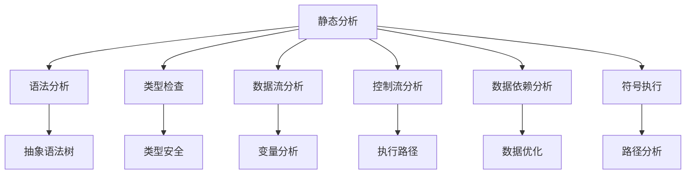
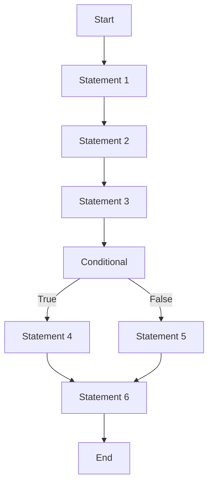
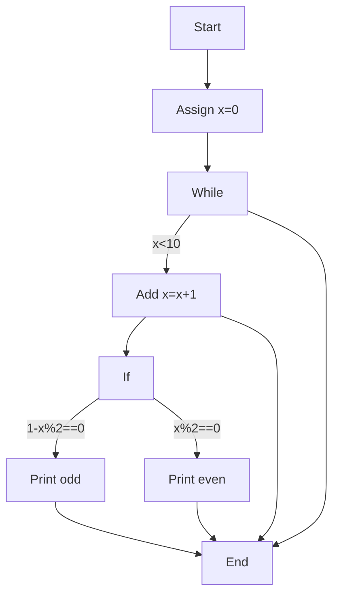
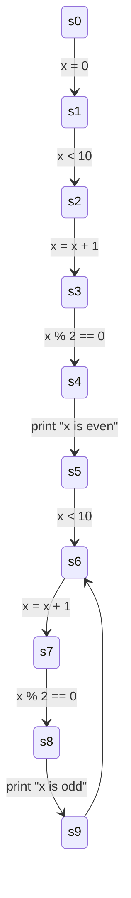

                 


### 引言

在现代软件开发中，代码质量和安全性至关重要。随着软件项目的规模和复杂度不断增加，仅依靠手动代码审查已经无法满足日益增长的软件质量要求。此时，静态分析作为一种自动化的代码分析技术，逐渐引起了广泛的关注。静态分析通过对源代码的结构和语义进行分析，无需执行程序，即可发现潜在的错误、漏洞和性能问题。提示词编程语言作为一种新型的编程范式，其在静态分析中的应用也日益受到关注。

本文旨在探讨提示词编程语言的静态分析理论，帮助读者深入理解这一领域的核心概念、算法原理及其在实际应用中的价值。文章将分为三个主要部分：

1. **静态分析基础理论**：介绍静态分析的定义、基本概念、常见类型以及其在软件工程中的应用。
2. **核心算法原理讲解**：详细阐述数据流分析、控制流分析和数据依赖分析等核心算法原理，并通过伪代码展示其具体实现。
3. **静态分析在编程语言中的应用**：重点讨论提示词编程语言的静态分析特点，以及如何使用静态分析工具进行实际项目开发和代码质量保障。

通过这篇文章，我们希望读者能够系统地掌握提示词编程语言的静态分析理论，并能够将其应用于实际软件开发中，提高代码质量和安全性。

### 静态分析基础理论

静态分析，作为软件工程中的一个重要分支，主要关注对源代码的结构和语义进行分析，而不需要执行程序。它旨在识别潜在的错误、漏洞、性能问题和代码质量问题，从而提高软件的可靠性和可维护性。以下是对静态分析的定义、基本概念、常见类型以及其在软件工程中的应用的详细介绍。

#### 定义

静态分析（Static Analysis）是一种代码分析技术，它通过解析源代码文本，提取程序的结构信息和语义信息，而不需要运行程序。静态分析的核心目标是自动检测代码中的错误和问题，并提供相应的诊断信息，以便开发人员能够及时修复。

#### 基本概念

1. **抽象语法树（Abstract Syntax Tree, AST）**：抽象语法树是源代码的一种结构化表示，它将代码分解为一系列语法元素，每个元素都有其特定的语义。通过分析AST，我们可以更好地理解代码的结构和逻辑。

2. **控制流图（Control Flow Graph, CFG）**：控制流图描述了程序中各个基本块的执行顺序和条件分支。它是一种图形表示方法，能够帮助我们理解程序的执行路径和分支结构。

3. **数据流分析（Data Flow Analysis）**：数据流分析是一种静态分析方法，用于确定变量和数据的流动和依赖关系。它可以帮助我们识别可能的变量未定义、类型不一致、使用未初始化的变量等问题。

4. **数据依赖分析（Data Dependency Analysis）**：数据依赖分析旨在确定程序中数据之间的依赖关系，以便更好地优化代码。它可以帮助我们识别冗余代码、不必要的内存分配等问题。

5. **符号执行（Symbolic Execution）**：符号执行是一种通过符号代入和约束求解来分析程序的方法。它能够遍历程序的所有可能执行路径，并检测潜在的错误和漏洞。

#### 常见类型

1. **语法分析**：语法分析是静态分析的基础，它通过解析源代码文本，将其转换为抽象语法树。语法分析的主要任务是识别代码中的语法错误和格式问题。

2. **类型检查**：类型检查是一种用于验证程序类型安全性的静态分析方法。它通过检查变量的类型和函数的返回值，确保代码在运行时不会出现类型错误。

3. **数据流分析**：数据流分析是一种用于分析变量和数据的流动和依赖关系的静态分析方法。它可以帮助我们识别潜在的错误和漏洞，如变量未定义、类型不一致等。

4. **控制流分析**：控制流分析是一种用于分析程序执行路径和控制结构的静态分析方法。它可以帮助我们识别死代码、死循环等问题。

5. **数据依赖分析**：数据依赖分析是一种用于分析程序中数据依赖关系的静态分析方法。它可以帮助我们优化代码、提高程序性能。

6. **符号执行**：符号执行是一种通过符号代入和约束求解来分析程序的方法。它能够遍历程序的所有可能执行路径，并检测潜在的错误和漏洞。

#### 应用

静态分析在软件工程中有着广泛的应用，主要包括以下几个方面：

1. **代码质量保障**：通过静态分析，我们可以自动检测代码中的错误和问题，提高代码的质量和可维护性。

2. **漏洞检测**：静态分析可以帮助我们识别潜在的安全漏洞，如缓冲区溢出、空指针引用等。

3. **性能优化**：通过数据流分析和数据依赖分析，我们可以优化代码，提高程序的性能。

4. **自动化测试**：静态分析可以用于生成测试用例，辅助自动化测试，提高测试覆盖率。

5. **代码复查**：静态分析可以作为代码复查的工具，帮助开发人员发现潜在的编程错误。

#### Mermaid流程图

为了更好地理解静态分析的核心概念和它们之间的联系，我们可以使用Mermaid流程图来直观地展示这些概念。



通过这个流程图，我们可以清晰地看到静态分析的核心概念及其相互之间的关系。

### 核心算法原理讲解

静态分析中的核心算法主要包括数据流分析、控制流分析和数据依赖分析。这些算法在静态分析中起着至关重要的作用，它们能够帮助开发人员识别代码中的潜在问题。以下是这些算法的基本原理和伪代码实现。

#### 数据流分析

数据流分析是一种用于确定变量和数据的流动和依赖关系的静态分析方法。其核心目标是解决两个问题：定义分析（def-use analysis）和用法分析（use-def analysis）。

**定义分析（Def-Use Analysis）**

定义分析旨在确定每个变量的定义点和所有使用该变量的位置。

```pseudocode
Def-Use Analysis(AST):
    for each node N in AST:
        if N is a definition:
            add (N, N) to def-use pairs
        else if N is a use:
            for each definition D in def-use pairs:
                if D is in the same basic block as N:
                    add (D, N) to def-use pairs
                else:
                    for each predecessor block P of N:
                        if P has a definition in def-use pairs:
                            add (P, N) to def-use pairs
```

**用法分析（Use-Def Analysis）**

用法分析旨在确定每个变量的使用点和所有定义该变量的位置。

```pseudocode
Use-Def Analysis(AST):
    for each node N in AST:
        if N is a use:
            for each definition D in def-use pairs:
                if (D, N) is in def-use pairs:
                    add (N, D) to use-def pairs
        else if N is a definition:
            for each use U in def-use pairs:
                add (N, U) to use-def pairs
```

#### 控制流分析

控制流分析是一种用于描述程序执行路径和控制结构的静态分析方法。其核心目标是构建控制流图（CFG）。

**控制流图（Control Flow Graph, CFG）**

控制流图由节点（基本块）和边（控制流）组成。每个基本块代表程序的一个不可分割的代码段，而边表示控制流的转移。



**伪代码实现**

```pseudocode
Control Flow Analysis(AST):
    Create an empty control flow graph (CFG)
    for each node N in AST:
        Add N as a node in CFG
        for each conditional node N:
            Add an edge from N to its true successor
            Add an edge from N to its false successor
        for each loop node N:
            Add an edge from N to its body
            Add an edge from the loop body's end to N
    return CFG
```

#### 数据依赖分析

数据依赖分析是一种用于分析程序中数据依赖关系的静态分析方法。其核心目标是识别数据依赖关系，以便优化代码。

**伪代码实现**

```pseudocode
Data Dependency Analysis(AST):
    for each node N in AST:
        if N is an assignment:
            for each node M in the control flow graph, where M is a predecessor of N:
                if M has a use of the assigned variable:
                    add (M, N) to data dependencies
        else if N is a use:
            for each node M in the control flow graph, where M is a successor of N:
                if M has a definition of the used variable:
                    add (M, N) to data dependencies
    return data dependencies
```

通过这些核心算法，我们可以对代码进行深入的分析，从而发现潜在的问题，提高代码的质量和安全性。

### 数学模型和数学公式

在静态分析中，数学模型和数学公式起着至关重要的作用。它们为静态分析提供了理论支持，并帮助我们更好地理解和应用这些算法。以下将介绍与静态分析相关的几个关键数学模型和数学公式，包括流程图表示法、状态转移图和相关的数学公式，并详细讲解这些模型和公式的含义和应用。

#### 流程图表示法

流程图表示法（Flow Graph Representation）是一种用于描述程序控制流和数据流的图形表示方法。在流程图中，节点表示程序的基本块，而边表示控制流或数据流。

**基本概念**

- **基本块（Basic Block）**：基本块是程序中的一段连续的指令序列，它没有跳转进入，也没有跳转离开。基本块内的指令顺序执行，没有分支或循环。
- **控制流边（Control Flow Edge）**：控制流边表示程序执行中的控制转移。例如，条件分支、循环入口和函数调用等。
- **数据流边（Data Flow Edge）**：数据流边表示程序中变量的流动和依赖关系。例如，变量赋值和参数传递。

**相关数学公式**

- **基本块集合（Basic Blocks）**：表示程序中的所有基本块，记为BB。
- **控制流图（Control Flow Graph, CFG）**：表示程序的控制流结构，记为G = (BB, E)，其中E表示控制流边。

#### 状态转移图

状态转移图（State Transition Graph）是一种用于描述程序状态转换和执行路径的图形表示方法。在状态转移图中，每个节点表示程序的一个状态，而边表示状态之间的转换。

**基本概念**

- **状态（State）**：状态是程序执行过程中的一组属性，如程序计数器、栈和局部变量等。
- **状态转换（State Transition）**：状态转换表示程序从一种状态转移到另一种状态。状态转换通常由条件判断或循环控制语句引起。
- **转移边（Transition Edge）**：转移边表示状态之间的转换。

**相关数学公式**

- **状态集合（States）**：表示程序的所有可能状态，记为S。
- **转移矩阵（Transition Matrix）**：表示状态转换关系的矩阵，记为T。T[i][j]表示从状态i到状态j的转移概率。
- **执行路径（Execution Path）**：表示程序执行过程中的状态序列，记为P = (s1, s2, ..., sn)。

#### 数学模型在静态分析中的应用

数学模型和数学公式在静态分析中有着广泛的应用。以下是一些具体的应用实例：

- **数据流方程**：数据流分析中常用的数据流方程，如定义方程和用法方程，用于描述变量的定义和依赖关系。
  - **定义方程**：定义方程描述了变量在定义点处的值，如 Def[N] = V，其中N是定义点，V是变量的值。
  - **用法方程**：用法方程描述了变量在使用点处的值，如 Use[N] = Def[M]，其中M是N的前驱定义点。
- **可达性分析**：可达性分析是一种用于确定控制流图中哪些节点是可达到的数学模型。其目标是找到控制流图中的所有活节点（活节点是指在执行过程中可能被到达的节点）。
  - **可达性矩阵（Reachability Matrix）**：表示控制流图中节点的可达性关系，记为R。R[i][j] = 1，如果节点j从节点i可达到，否则为0。
  - **可达性方程**：可达性方程描述了节点的可达性关系，如 R[i][j] = ∑(R[i][k] * R[k][j])，其中k是i的前驱节点。
- **路径表达式**：路径表达式是一种用于表示程序执行路径的数学公式，如 f[i, j] = (i = j) + ∑(f[k, j] * C[i, k])，其中i和j是控制流图中的节点，k是i的前驱节点，C[i, k]表示从i到k的控制流边。

#### 举例说明

以下是一个简单的示例，展示如何使用流程图表示法、状态转移图和数据流方程进行分析。

**示例：简单程序的控制流和数据流分析**

```c
int x = 0;
while (x < 10) {
    x = x + 1;
    if (x % 2 == 0) {
        printf("x is even\n");
    } else {
        printf("x is odd\n");
    }
}
```

**控制流图**



**状态转移图**



**数据流方程**

- **定义方程**：Def[B] = 0，Def[D] = x + 1，Def[E] = x % 2
- **用法方程**：Use[C] = Def[B]，Use[D] = Use[E]，Use[E] = Def[D]

通过这些数学模型和数学公式，我们可以对程序进行深入的分析，从而发现潜在的问题，提高代码的质量和安全性。

### 提示词编程语言的静态分析特点

提示词编程语言（Prompt-Based Programming Language）是一种新型的编程范式，其核心思想是通过提供一系列提示词（prompts）来引导程序的执行。与传统的编程语言不同，提示词编程语言更加注重程序的意图和逻辑，而非具体的语法和执行流程。这使得提示词编程语言在静态分析中具有独特的特点和应用场景。以下将详细探讨提示词编程语言的静态分析特点。

#### 提示词编程语言的概述

提示词编程语言的设计理念是简化编程过程，提高开发效率。在这种语言中，程序员通过定义一系列提示词来描述程序的逻辑和行为，而不是编写具体的代码指令。这些提示词可以是简单的关键字或复杂的逻辑表达式，它们能够直接表达程序的意图。例如，在一个提示词编程语言中，我们可以使用以下提示词来描述一个简单的计算器程序：

```plaintext
calculate the sum of numbers 1 to 10
display the result
```

这些提示词可以被编程语言解释器或编译器转换成具体的代码指令，从而实现程序的功能。

#### 提示词编程语言的静态分析特点

1. **高层次的抽象**：提示词编程语言提供了高层次的抽象，使得程序员可以更加关注程序的逻辑和意图，而无需陷入底层的实现细节。这种高层次的抽象为静态分析提供了更多的上下文信息，使得分析过程更加直观和高效。

2. **简化的语法结构**：提示词编程语言的语法结构相对简单，通常不包含复杂的语法规则和嵌套结构。这使得静态分析工具能够更快速地解析源代码，并提取出重要的语义信息。

3. **明确的意图表达**：在提示词编程语言中，程序的意图通常通过提示词直接表达。这使得静态分析工具可以更容易地识别程序的功能和逻辑，从而发现潜在的问题和错误。

4. **灵活的提示词组合**：提示词编程语言允许程序员灵活地组合不同的提示词，以实现复杂的程序功能。这种灵活性使得静态分析工具需要能够处理多种不同的提示词组合，并进行有效的分析。

#### 静态分析算法

在提示词编程语言中，静态分析算法需要能够处理高层次的抽象和简化的语法结构。以下是一些适用于提示词编程语言的静态分析算法：

1. **语义分析**：语义分析是提示词编程语言静态分析的核心。它通过对提示词进行语义解析，确定程序的意图和逻辑。例如，对于提示词“calculate the sum of numbers 1 to 10”，语义分析器可以识别出这是一个求和操作，并生成相应的代码。

2. **数据流分析**：数据流分析在提示词编程语言中仍然具有重要的地位。尽管提示词编程语言的语法结构相对简单，但变量和数据的流动和依赖关系依然需要被分析。数据流分析可以帮助识别未定义变量、类型不一致等问题。

3. **控制流分析**：控制流分析用于确定程序的执行路径和控制结构。在提示词编程语言中，控制流分析需要能够处理提示词之间的逻辑关系，例如条件分支和循环控制。

4. **类型检查**：类型检查是确保程序类型安全性的重要手段。在提示词编程语言中，类型检查需要能够处理提示词中的类型信息，并确保程序在运行时不会出现类型错误。

#### 实际应用

提示词编程语言的静态分析在实际应用中具有广泛的应用场景。以下是一些具体的实际应用：

1. **代码审查**：通过静态分析，可以自动检测代码中的潜在错误和问题，提高代码质量。在提示词编程语言中，静态分析工具可以更加高效地识别语法错误和逻辑错误。

2. **自动化测试**：静态分析可以用于生成测试用例，提高测试覆盖率。例如，对于提示词“calculate the sum of numbers 1 to 10”，静态分析工具可以生成多个测试用例，以验证程序的求和功能。

3. **性能优化**：通过数据流分析和控制流分析，可以优化程序的执行效率。在提示词编程语言中，静态分析工具可以识别出低效的代码段，并提出优化建议。

4. **安全漏洞检测**：静态分析可以帮助识别潜在的安全漏洞，如缓冲区溢出和空指针引用。在提示词编程语言中，静态分析工具可以更加高效地检测这些漏洞。

#### 结论

提示词编程语言的静态分析特点在于其高层次的抽象、简化的语法结构、明确的意图表达和灵活的提示词组合。这些特点使得静态分析工具能够更加高效地分析代码，发现潜在的问题，提高代码质量和安全性。随着提示词编程语言的不断发展，其在静态分析领域的应用前景将更加广阔。

### 静态分析工具与实践

静态分析工具在软件开发中扮演着至关重要的角色，它们通过自动化分析源代码，帮助开发人员发现潜在的错误、漏洞和性能问题。以下将介绍几种常见的静态分析工具，并展示如何在实际项目中应用这些工具。

#### 常见的静态分析工具

1. **SonarQube**：SonarQube是一个开源的平台，用于自动化代码质量管理和漏洞检测。它支持多种编程语言，能够进行代码风格检查、安全隐患检测、漏洞扫描等。

2. **FindBugs**：FindBugs是一个Java静态分析工具，用于检测Java代码中的潜在错误和问题。它基于规则引擎，可以检测出如空指针异常、资源泄漏、未使用的代码等。

3. **PMD**：PMD是一个Java静态代码分析器，主要用于检测代码中的不良编程实践。它能够识别冗余代码、过度复杂的代码结构等，帮助提高代码的可读性和可维护性。

4. **Checkstyle**：Checkstyle是一个Java代码风格检查工具，用于确保Java代码符合特定的编码标准。它能够检测代码中的格式问题、命名规范等问题。

5. **Clang Static Analyzer**：Clang Static Analyzer是一个基于Clang前端和 LLVM中间表示的C/C++静态分析工具。它能够检测出内存泄漏、未初始化变量、类型错误等。

#### 实际项目案例

以下是一个实际项目案例，展示如何使用静态分析工具进行代码质量保障和漏洞检测。

**项目背景**：一个团队正在开发一个企业级Web应用程序，该应用程序涉及大量的业务逻辑和用户交互。为了确保代码质量和安全性，团队决定使用静态分析工具对代码进行深入分析。

**步骤 1：选择合适的静态分析工具**

根据项目的需求和编程语言，团队选择了以下工具：

- **SonarQube**：用于整体代码质量分析和漏洞检测。
- **FindBugs**：用于检测Java代码中的潜在错误和问题。
- **PMD**：用于识别代码中的不良编程实践。
- **Checkstyle**：用于确保代码风格符合编码标准。

**步骤 2：配置和集成静态分析工具**

团队在开发环境中配置了这些静态分析工具，并将其集成到持续集成（CI）流程中。每次代码提交都会触发静态分析，自动生成分析报告。

**步骤 3：代码质量保障**

- **代码风格检查**：Checkstyle和PMD对代码风格进行了严格的检查，确保代码符合编码规范。例如，检查变量命名、括号使用、空格和注释等。
- **安全隐患检测**：SonarQube和FindBugs对代码进行了全面的安全漏洞检测，识别出如SQL注入、跨站脚本攻击等潜在的安全风险。
- **代码质量分析**：SonarQube提供了详细的代码质量报告，包括代码复杂度、代码冗余、代码重复率等指标，帮助团队识别需要优化的部分。

**步骤 4：漏洞修复和改进**

开发人员在静态分析报告中发现了一些潜在的问题，并针对这些问题进行了修复和改进。例如，修复了潜在的空指针异常、优化了代码结构、改善了代码可读性。

**步骤 5：持续监控和改进**

静态分析工具不仅用于代码审查，还用于持续监控代码质量和安全性。团队定期运行静态分析，确保代码质量持续提高。

#### 代码解读与分析

以下是一个具体的代码片段，展示如何使用静态分析工具进行代码解读和分析。

**代码片段**：

```java
public class Calculator {
    public int calculateSum(int start, int end) {
        int sum = 0;
        for (int i = start; i <= end; i++) {
            sum += i;
        }
        return sum;
    }
}
```

**静态分析工具分析**：

1. **SonarQube分析**：
   - 代码复杂度：方法`calculateSum`的复杂度为1，属于简单方法。
   - 代码冗余：未检测到代码冗余。
   - 安全漏洞：未检测到潜在的安全漏洞。

2. **FindBugs分析**：
   - 未检测到空指针异常和其他潜在的错误。

3. **PMD分析**：
   - 代码可读性：方法命名合理，代码结构清晰。

4. **Checkstyle分析**：
   - 代码风格：符合Java编码标准。

通过这些分析工具，开发人员可以更加全面地了解代码的质量和安全性，从而采取相应的措施进行改进。

#### 项目小结

使用静态分析工具进行代码质量和安全性保障是现代软件开发中不可或缺的一环。通过实际案例可以看出，静态分析工具能够帮助开发团队快速识别和解决潜在问题，提高代码的质量和可靠性。在未来，随着静态分析工具的不断发展和完善，其在软件开发中的应用前景将更加广阔。

### 静态分析在新趋势中的应用

随着计算机科学和软件工程的不断发展，静态分析技术也在不断演变，出现了许多新的趋势和应用。以下是静态分析在人工智能（AI）、安全领域以及未来发展趋势的讨论。

#### 静态分析在AI中的应用

近年来，静态分析技术逐渐与人工智能相结合，尤其是在深度学习和机器学习领域。静态分析在AI中的应用主要包括以下几个方面：

1. **代码审查和优化**：静态分析工具可以用于审查和优化机器学习模型代码。通过分析代码的结构和语义，可以识别出潜在的错误和性能瓶颈，从而提高模型的训练效率和准确性。

2. **自动化测试生成**：静态分析可以用于生成测试用例，提高测试覆盖率。特别是在大规模机器学习项目中，自动化测试生成可以显著减少测试工作量，提高测试效率。

3. **模型安全性和隐私保护**：静态分析可以检测机器学习模型中的安全漏洞和隐私泄露风险。例如，通过分析模型的输入输出关系，可以识别出可能的攻击路径和隐私泄露点。

4. **优化算法设计**：静态分析可以用于优化机器学习算法的设计和实现。通过对代码的静态分析，可以发现潜在的优化机会，例如减少计算复杂度、减少内存占用等。

#### 静态分析在安全领域中的应用

在网络安全和软件安全领域，静态分析技术也发挥着重要作用。以下是一些关键应用：

1. **漏洞检测**：静态分析工具可以用于检测代码中的安全漏洞，如缓冲区溢出、SQL注入、跨站脚本攻击等。通过对源代码的静态分析，可以提前发现和修复这些漏洞，从而提高软件的安全性。

2. **入侵检测**：静态分析可以用于开发入侵检测系统（IDS），实时监测系统的异常行为和潜在攻击。通过分析系统日志和事件数据，可以识别出异常模式，并及时发出警报。

3. **配置管理**：静态分析可以用于配置管理，确保系统的配置符合安全标准。通过对配置文件的分析，可以识别出不符合安全规定的配置项，并自动进行修复。

4. **软件供应链安全**：随着软件供应链攻击的增多，静态分析技术被用于确保软件供应链的安全。通过分析依赖关系和第三方库，可以识别出潜在的安全风险，并采取措施进行防护。

#### 静态分析的未来发展趋势

展望未来，静态分析技术将继续发展，并可能在以下几个方面取得突破：

1. **多语言支持**：随着编程语言种类的增加，静态分析工具需要支持更多的编程语言。未来，静态分析工具将能够跨语言进行代码分析，提供更全面的分析结果。

2. **实时分析**：静态分析将从离线分析转向实时分析。通过集成到开发环境和持续集成系统中，静态分析工具可以实时检测代码中的问题，并提供即时的反馈和建议。

3. **智能化分析**：结合人工智能技术，静态分析工具将变得更加智能。通过机器学习算法，可以自动识别代码中的潜在问题，并生成优化建议。

4. **泛化分析**：静态分析将从特定场景的优化转向更泛化的分析。未来，静态分析工具将能够处理更复杂的代码结构和更广泛的编程范式，提供更全面的分析结果。

5. **自动化修复**：随着分析技术的进步，静态分析工具将能够自动修复代码中的问题。通过自动化修复，可以显著减少开发人员的工作量，提高开发效率。

### 结论

静态分析作为软件工程的重要工具，在提高代码质量和安全性方面发挥着重要作用。随着人工智能和安全领域的发展，静态分析技术也在不断演进，出现了一系列新的应用和趋势。未来，随着技术的进步，静态分析将更加智能化、实时化和泛化，为软件开发带来更多的价值。

### 总结与展望

#### 静态分析的理论体系

静态分析的理论体系涵盖了从基本概念到核心算法，再到数学模型和应用的全面内容。本文首先介绍了静态分析的定义、基本概念和常见类型，包括语法分析、类型检查、数据流分析、控制流分析和数据依赖分析。接着，详细讲解了数据流分析、控制流分析和数据依赖分析的核心算法原理，并通过伪代码展示了具体实现。此外，本文还介绍了流程图表示法、状态转移图等相关数学模型及其在静态分析中的应用。通过这些内容，读者可以系统地了解静态分析的理论基础。

#### 静态分析的应用价值

静态分析在软件开发中具有广泛的应用价值。首先，它能够提高代码质量，通过自动化分析发现潜在的错误和漏洞，帮助开发人员及时修复。其次，静态分析在安全领域有着重要作用，可以检测代码中的安全漏洞，如缓冲区溢出、SQL注入等，从而提高软件的安全性。此外，静态分析还可以用于性能优化，通过分析代码的数据流和控制流，识别出低效的代码段，提出优化建议。最后，静态分析在自动化测试中也有应用，可以生成测试用例，提高测试覆盖率，降低测试成本。

#### 静态分析的未来发展方向

未来，静态分析技术将继续发展，并在多个方面取得突破。首先，多语言支持将成为静态分析工具的重要发展方向。随着编程语言种类的增加，静态分析工具需要能够支持更多语言，提供更全面的分析结果。其次，实时分析将逐渐取代离线分析，静态分析工具将被集成到开发环境和持续集成系统中，提供即时的反馈和建议。此外，结合人工智能技术，静态分析工具将变得更加智能，能够自动识别代码中的潜在问题，并生成优化建议。泛化分析也是未来的一个重要方向，静态分析工具将能够处理更复杂的代码结构和更广泛的编程范式。最后，自动化修复技术的进步将使得静态分析工具能够自动修复代码中的问题，显著减少开发人员的工作量，提高开发效率。

### 最佳实践 tips

1. **选择合适的工具**：根据项目需求和编程语言，选择合适的静态分析工具，如SonarQube、FindBugs、PMD等。
2. **配置和集成工具**：确保静态分析工具正确配置，并将其集成到持续集成流程中，实现自动化分析。
3. **定期运行分析**：定期运行静态分析，确保代码质量持续提高，及时修复潜在问题。
4. **利用社区资源**：利用社区资源，如开源代码、论坛和博客，了解最佳实践和工具使用技巧。
5. **持续学习和更新**：随着静态分析技术的发展，持续学习和更新相关知识，提高分析和解决问题的能力。

### 注意事项

1. **分析结果的准确性**：静态分析工具可能存在误报和漏报，需要结合人工审查进行综合判断。
2. **工具兼容性**：确保静态分析工具与开发环境和编译器兼容，避免出现兼容性问题。
3. **隐私和数据保护**：在使用静态分析工具时，注意保护源代码和相关数据的隐私，避免泄露敏感信息。

### 拓展阅读

1. **《程序员的自我修养》**：作者韩迪，详细介绍了程序设计的基本原理和实践经验。
2. **《禅与计算机程序设计艺术》**：作者拉里·布赛，通过禅宗思想阐述了编程的艺术。
3. **《深度学习》**：作者伊恩·古德费洛等，介绍了深度学习的基本概念和应用。
4. **《软件工程：实践者的研究方法》**：作者斯蒂芬·斯科特，提供了软件工程研究的全面指导。
5. **《静态分析：方法与实践》**：作者托马斯·哈特曼，详细介绍了静态分析的理论和实践。

