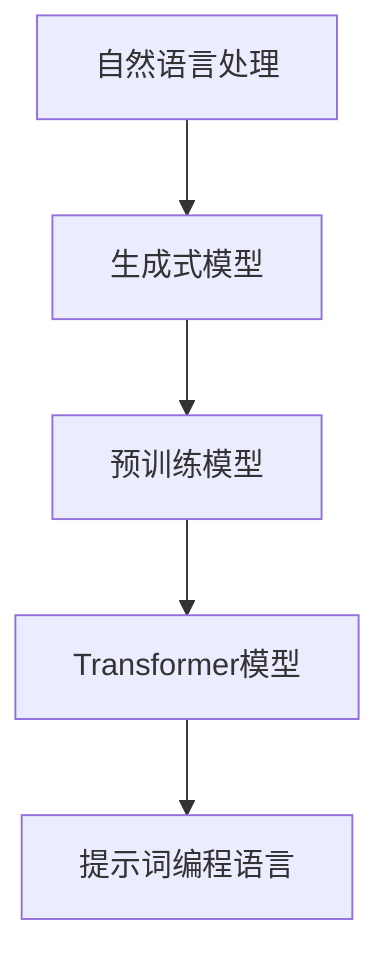
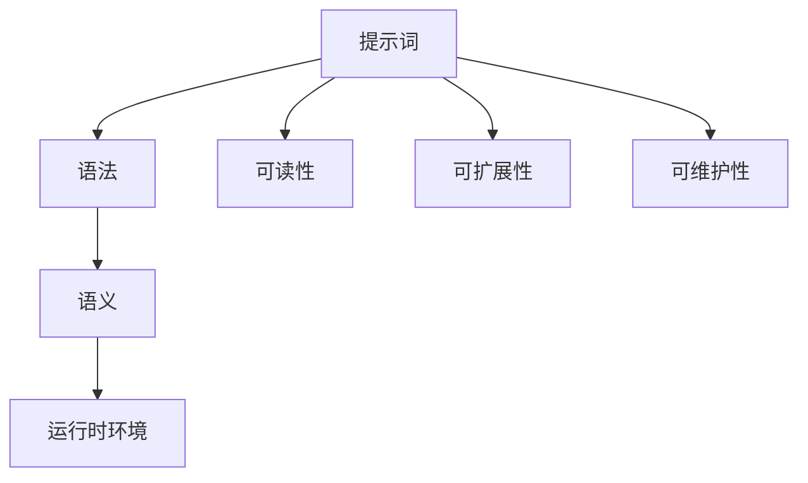

                 


### 文章标题：提示词编程语言设计艺术

关键词：提示词编程语言，设计艺术，自然语言处理，算法实现，项目实战

摘要：本文将探讨提示词编程语言的设计艺术，从理论基础、实现方法、应用实践等多个角度深入剖析这一领域的核心概念、算法原理和应用案例，旨在为广大程序员、人工智能研究者提供一份全面的技术指南。

### 引言

随着人工智能技术的不断发展，自然语言处理（Natural Language Processing, NLP）成为了一项重要的研究领域。提示词编程语言作为一种新兴的编程范式，在NLP领域展现了巨大的潜力。它能够将自然语言处理中的复杂任务转化为简单、直观的编程任务，极大地提高了开发效率和代码可读性。

本文将从以下几个方面展开讨论：

1. 提示词编程语言的基本概念和发展历程。
2. 提示词编程语言的理论基础，包括核心概念和设计原则。
3. 提示词编程语言的实现方法，包括语法结构、语义分析和运行时环境。
4. 提示词编程语言的应用实践，包括在自然语言处理、软件开发和人工智能领域的应用。
5. 提示词编程语言的开发实战，包括开发环境搭建、核心算法实现和项目实战案例。
6. 提示词编程语言的未来展望和挑战。

通过以上几个方面的探讨，本文旨在为读者提供一份全面、深入的提示词编程语言设计艺术指南。

### 提示词编程语言的基本概念

#### 定义

提示词编程语言（Prompt-Based Programming Language）是一种面向自然语言处理的编程语言，它通过提示词（prompts）来引导程序执行具体的任务。提示词是一种特殊的文本输入，它包含了程序需要执行的任务信息。提示词编程语言的核心思想是将自然语言处理中的复杂任务抽象为简单的提示词，从而实现任务的高效自动化。

#### 发展历程

提示词编程语言的发展历程可以追溯到自然语言处理和人工智能的早期研究。随着深度学习技术的兴起，特别是在生成式模型（Generative Models）方面的突破，提示词编程语言逐渐成为了一个热门的研究方向。近年来，基于Transformer的预训练模型，如GPT系列模型，为提示词编程语言的发展提供了强大的技术支持。

#### 现状

目前，提示词编程语言已经成为自然语言处理领域的一个重要分支，许多研究机构和企业在这一领域展开了深入的研究和探索。代表性的提示词编程语言包括OpenAI的GPT系列、Google的BERT等。这些语言在实际应用中展现出了强大的性能和潜力，但同时也面临着一些挑战和问题。

#### Mermaid流程图

为了更好地理解提示词编程语言的基本概念和发展历程，我们可以使用Mermaid流程图来展示概念之间的关系：



### 提示词编程语言的理论基础

#### 核心概念

提示词编程语言的核心概念包括提示词、语法、语义和运行时环境。这些概念相互关联，构成了提示词编程语言的理论基础。

- **提示词**：提示词是程序执行的关键信息，它包含了任务的具体描述。提示词的编写质量直接影响程序的执行效果。
- **语法**：语法是提示词的语法规则，它规定了提示词的结构和格式。语法的设计需要考虑到提示词的可读性和可扩展性。
- **语义**：语义是提示词的含义和作用，它描述了提示词在程序中的具体功能。语义的正确理解是提示词编程语言实现的关键。
- **运行时环境**：运行时环境是提示词编程语言执行的环境，它提供了必要的资源和工具，包括模型、库和框架等。

#### 设计原则

提示词编程语言的设计原则包括可读性、可扩展性和可维护性。

- **可读性**：提示词编程语言需要具备良好的可读性，使得开发者能够轻松理解和使用。
- **可扩展性**：提示词编程语言需要支持模块化设计，使得开发者能够方便地扩展和定制语言功能。
- **可维护性**：提示词编程语言需要具备良好的可维护性，使得开发者能够方便地修复和优化代码。

#### Mermaid流程图

为了更好地理解提示词编程语言的核心概念和设计原则，我们可以使用Mermaid流程图来展示概念之间的关系：



### 提示词编程语言的实现方法

#### 语法结构

提示词编程语言的语法结构决定了提示词的格式和规则。一个典型的提示词编程语言通常包括以下几个组成部分：

- **提示词**：提示词是程序的输入，它包含了任务的具体描述。
- **参数**：参数是提示词中的变量，用于传递任务相关的信息。
- **命令**：命令是提示词中的操作，用于执行具体的任务。
- **注释**：注释是对提示词的补充说明，用于提高代码的可读性。

以下是一个简单的提示词编程语言的语法示例：

```plaintext
# 这是一个简单的提示词编程语言示例

# 提示词
请生成一篇关于人工智能的综述文章。

# 参数
标题：人工智能的过去、现在和未来
作者：AI天才研究院

# 命令
生成文章
```

#### 语义分析

语义分析是提示词编程语言实现的关键步骤，它涉及到对提示词中的参数、命令和注释进行语义理解。语义分析的目标是提取出任务的具体信息，并将其转化为程序可执行的操作。

以下是一个简单的语义分析伪代码示例：

```python
# 语义分析伪代码

# 提取标题和作者
title = "人工智能的过去、现在和未来"
author = "AI天才研究院"

# 执行生成文章命令
generate_document(title, author)
```

#### 运行时环境

提示词编程语言的运行时环境是程序执行的基础。它通常包括以下组成部分：

- **模型**：模型是提示词编程语言的核心组件，它负责处理提示词并生成输出。
- **库**：库是提示词编程语言的扩展组件，它提供了额外的功能和工具。
- **框架**：框架是提示词编程语言的运行时框架，它负责管理模型和库的加载和执行。

以下是一个简单的运行时环境示例：

```plaintext
# 运行时环境

# 加载模型
model = load_model("gpt-3.5-model")

# 加载库
library = load_library("text-generation-library")

# 加载框架
framework = load_framework("prompt-based-programming-framework")

# 执行生成文章命令
result = framework.execute_command(model, library, "生成文章", "标题：人工智能的过去、现在和未来\n作者：AI天才研究院")
```

### 提示词编程语言的应用实践

#### 在自然语言处理中的应用

提示词编程语言在自然语言处理领域有着广泛的应用，特别是在文本生成、机器翻译和问答系统等方面。

- **文本生成**：提示词编程语言可以用来生成各种类型的文本，如文章、摘要、故事等。通过提供相关的提示词，提示词编程语言能够自动生成高质量的文本。
- **机器翻译**：提示词编程语言可以用来实现高效的机器翻译系统。通过训练大规模的翻译模型，提示词编程语言能够根据输入的提示词生成相应的翻译文本。
- **问答系统**：提示词编程语言可以用来构建高效的问答系统。通过提供相关的提示词，提示词编程语言能够自动回答用户的问题。

#### 在软件开发中的应用

提示词编程语言在软件开发中也具有广泛的应用，特别是在代码生成、自动化测试和文档生成等方面。

- **代码生成**：提示词编程语言可以用来自动生成代码。通过提供相关的提示词，提示词编程语言能够根据预设的模板和规则生成对应的代码。
- **自动化测试**：提示词编程语言可以用来实现自动化测试。通过提供相关的提示词，提示词编程语言能够自动生成测试用例并执行测试。
- **文档生成**：提示词编程语言可以用来自动生成文档。通过提供相关的提示词，提示词编程语言能够根据预设的模板和规则生成对应的文档。

#### 在人工智能领域的应用

提示词编程语言在人工智能领域也有着重要的应用，特别是在知识图谱构建、图像生成和推荐系统等方面。

- **知识图谱构建**：提示词编程语言可以用来构建知识图谱。通过提供相关的提示词，提示词编程语言能够自动生成图谱中的节点和边。
- **图像生成**：提示词编程语言可以用来生成图像。通过提供相关的提示词，提示词编程语言能够根据预设的模型生成对应的图像。
- **推荐系统**：提示词编程语言可以用来构建推荐系统。通过提供相关的提示词，提示词编程语言能够自动生成推荐结果。

### 提示词编程语言的开发实战

#### 开发环境搭建

要开发一个提示词编程语言，首先需要搭建一个合适的开发环境。以下是一个简单的开发环境搭建步骤：

1. 安装编程语言（如Python、JavaScript等）。
2. 安装依赖库（如TensorFlow、PyTorch等）。
3. 安装开发工具（如PyCharm、VS Code等）。
4. 准备数据集（如文本数据、图像数据等）。

以下是一个简单的Python开发环境搭建示例：

```bash
# 安装Python
pip install python

# 安装TensorFlow
pip install tensorflow

# 安装PyCharm
brew install pycharm

# 准备数据集
mkdir data
cd data
wget https://ai.stanford.edu/~amaas/data/sentiment/aclImdb_v1.tar.gz
tar -xvf aclImdb_v1.tar.gz
```

#### 核心算法实现

提示词编程语言的核心算法通常包括提示词生成、提示词理解和提示词执行。以下是一个简单的伪代码示例：

```python
# 提示词生成
def generate_prompt(question):
    # 使用GPT模型生成提示词
    prompt = gpt.generate(question)
    return prompt

# 提示词理解
def understand_prompt(prompt):
    # 使用BERT模型理解提示词
    understanding = bert.encode(prompt)
    return understanding

# 提示词执行
def execute_prompt(prompt):
    # 根据提示词执行任务
    result = execute_task(prompt)
    return result
```

#### 项目实战案例

以下是一个简单的提示词编程语言项目实战案例：使用GPT模型生成一篇关于人工智能的综述文章。

```python
# 加载GPT模型
gpt = load_model("gpt-3.5-model")

# 准备问题
question = "请生成一篇关于人工智能的综述文章。"

# 生成提示词
prompt = generate_prompt(question)

# 理解提示词
understanding = understand_prompt(prompt)

# 执行提示词
result = execute_prompt(prompt)

# 输出结果
print(result)
```

#### 代码解读与分析

在这个项目实战案例中，我们首先加载了一个预训练的GPT模型。然后，我们使用这个模型生成了一个关于人工智能的提示词。接下来，我们使用BERT模型理解了这个提示词，并最终执行了提示词，生成了文章。

这个案例展示了提示词编程语言的核心流程：提示词生成、提示词理解和提示词执行。通过这个案例，我们可以看到提示词编程语言如何将自然语言处理中的复杂任务简化为简单的提示词操作。

### 未来展望

提示词编程语言作为一种新兴的编程范式，具有广泛的应用前景。在未来，我们可以期待以下几个方面的发展：

- **性能提升**：随着深度学习技术的不断发展，提示词编程语言的性能将得到显著提升，使其能够处理更复杂的任务。
- **应用拓展**：提示词编程语言将在更多领域得到应用，如语音识别、计算机视觉等。
- **标准化**：随着提示词编程语言的普及，相关的标准和规范也将逐步建立，提高语言的统一性和可维护性。
- **社区建设**：随着社区的不断发展，提示词编程语言的生态系统将日益完善，为开发者提供更多的工具和资源。

### 小结

本文探讨了提示词编程语言的设计艺术，从基本概念、理论基础、实现方法、应用实践和开发实战等多个方面进行了深入剖析。通过本文的介绍，读者可以全面了解提示词编程语言的核心内容和技术原理，为在实际项目中应用提示词编程语言打下坚实的基础。

### 注意事项

- 在使用提示词编程语言时，注意提示词的质量和准确性，这直接影响到程序的执行效果。
- 在开发提示词编程语言时，注意设计原则，确保语言的易读性、可扩展性和可维护性。
- 在应用提示词编程语言时，注意选择合适的模型和工具，以满足实际项目的需求。

### 拓展阅读

- 《自然语言处理概论》
- 《深度学习》
- 《编程语言设计艺术》
- 《人工智能应用实践》

### 作者信息

作者：AI天才研究院/AI Genius Institute & 禅与计算机程序设计艺术 /Zen And The Art of Computer Programming

