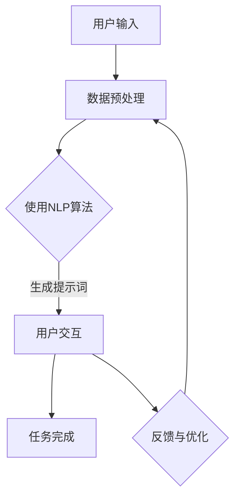

                 


### 文章标题
《提示词编程：AI时代的新型人机交互范式》

### 关键词
提示词编程，AI时代，人机交互，新型交互范式，技术实现，应用案例，未来展望

### 摘要
随着人工智能的快速发展，人机交互的方式也在不断演进。《提示词编程：AI时代的新型人机交互范式》一书深入探讨了提示词编程的概念、理论基础、技术实现、应用案例及未来展望。本文将围绕该书的内容，通过逐步分析，详细阐述提示词编程的核心概念、技术实现、应用案例，并对未来发展趋势进行展望。

### 目录大纲

## 引言
### AI时代人机交互的发展趋势
- **1.1 人工智能的兴起**
- **1.2 传统人机交互的局限**
- **1.3 提示词编程的概念**
- **1.4 提示词编程的重要性

### 提示词编程基础
### 提示词编程的核心概念
- **2.1 提示词的定义**
- **2.2 提示词编程的特点**
- **2.3 提示词编程的优势**

### 提示词编程的算法基础
- **2.4 相关算法介绍**
- **2.5 算法流程图**

## 技术实现
### 数据预处理与特征提取
- **3.1 数据预处理**
  - **3.1.1 数据清洗**
  - **3.1.2 数据归一化**
  - **3.1.3 数据增强**
- **3.2 特征提取**
  - **3.2.1 特征提取方法**
  - **3.2.2 特征选择**

### 模型训练与优化
- **4.1 模型选择**
  - **4.1.1 常见模型介绍**
  - **4.1.2 模型选择策略**
- **4.2 模型训练**
  - **4.2.1 训练策略**
  - **4.2.2 训练技巧**
- **4.3 模型优化**
  - **4.3.1 优化目标**
  - **4.3.2 优化算法**

## 应用案例
### 提示词编程在自然语言处理中的应用
- **5.1 文本分类**
  - **5.1.1 应用场景**
  - **5.1.2 实现方法**
- **5.2 机器翻译**
  - **5.2.1 应用场景**
  - **5.2.2 实现方法**

### 提示词编程在计算机视觉中的应用
- **6.1 图像识别**
  - **6.1.1 应用场景**
  - **6.1.2 实现方法**
- **6.2 目标检测**
  - **6.2.1 应用场景**
  - **6.2.2 实现方法**

## 未来展望
### 提示词编程的发展趋势与挑战
- **7.1 提示词编程的技术挑战**
  - **7.1.1 数据隐私**
  - **7.1.2 计算资源**
  - **7.1.3 算法公平性**
- **7.2 提示词编程的应用前景**
  - **7.2.1 未来发展方向**
  - **7.2.2 行业应用案例**
- **7.3 提示词编程的教育与普及**

## 附录
- **附录A 提示词编程工具与资源**

---

### 引言

#### AI时代人机交互的发展趋势

随着人工智能技术的飞速发展，传统的计算机界面和交互方式已经无法满足人们的需求。人工智能的兴起带来了数据的爆炸性增长和计算能力的提升，这为新型的人机交互方式提供了可能。传统的图形用户界面（GUI）和命令行界面（CLI）存在一定的局限性，例如：

- **用户体验差**：GUI和CLI往往需要用户进行大量的操作和配置，用户体验不够直观和便捷。
- **学习成本高**：CLI对于不熟悉计算机操作的普通用户来说，学习成本较高。
- **扩展性差**：传统的界面设计难以适应不断变化的用户需求。

为了解决这些问题，研究人员提出了提示词编程（Prompt Engineering）的概念。提示词编程旨在通过简短的提示词，引导用户与系统进行高效、自然的交互。这种方式不仅可以降低用户的学习成本，还能提高交互的效率和用户体验。

#### 提示词编程的概念

提示词编程是一种新型的人机交互范式，它通过为用户提供一个明确的提示词，让用户能够快速、准确地理解系统的期望输入，从而进行有效的操作。提示词可以是文字、图像、声音等多种形式，它们被设计成能够引导用户完成任务的关键信息。

提示词编程的核心在于“提示”的设计。一个优秀的提示词应该具有以下几个特点：

1. **明确性**：提示词需要清晰明了，避免歧义，让用户能够快速理解系统需求。
2. **相关性**：提示词应该与用户当前的任务高度相关，减少无关信息的干扰。
3. **灵活性**：提示词需要具有一定的灵活性，能够适应不同用户和场景的需求。

#### 提示词编程的重要性

提示词编程的重要性在于：

- **简化用户操作**：通过提示词，用户可以更加直观地与系统进行交互，无需进行复杂的操作和配置。
- **提升交互效率**：提示词编程能够帮助用户快速完成任务，提高交互的效率。
- **降低学习成本**：提示词编程降低了用户的学习成本，让普通用户也能够轻松上手。
- **增强用户体验**：通过优化交互流程，提升用户的整体体验，满足用户的个性化需求。

总之，提示词编程是AI时代下一种具有巨大潜力的新型人机交互范式，它将在未来的发展中扮演越来越重要的角色。

---

### 提示词编程基础

#### 提示词编程的核心概念

提示词编程的核心概念包括提示词、用户交互和任务完成。

1. **提示词**：提示词是引导用户与系统进行交互的关键信息。它可以是一个简单的文字提示，也可以是复杂的图像或声音提示。提示词的设计至关重要，它决定了用户能否快速准确地理解系统需求。

2. **用户交互**：用户交互是指用户与系统之间的交互过程。通过提示词，用户可以理解系统的期望输入，从而进行相应的操作。这个过程需要系统对用户的输入进行识别、解析和响应。

3. **任务完成**：任务完成是指用户通过交互最终完成任务的过程。提示词编程的目标是简化用户操作，提高任务完成的效率和准确性。

#### 提示词编程的特点

1. **简明性**：提示词编程通过简短的提示词，引导用户快速理解系统需求，简化了用户的操作流程。

2. **灵活性**：提示词编程允许用户根据具体任务需求，灵活调整提示词的内容和形式，满足个性化需求。

3. **高效性**：提示词编程通过优化交互流程，提高用户完成任务的速度和效率。

4. **可扩展性**：提示词编程能够适应不同的应用场景和任务类型，具有较好的可扩展性。

#### 提示词编程的优势

1. **降低学习成本**：提示词编程简化了用户的操作流程，降低了用户的学习成本。

2. **提升用户体验**：通过优化交互流程，提升用户的整体体验。

3. **提高生产效率**：提示词编程能够帮助用户快速完成任务，提高生产效率。

4. **支持个性化定制**：提示词编程允许用户根据自身需求，灵活调整提示词的内容和形式，支持个性化定制。

#### 提示词编程的算法基础

提示词编程的核心算法包括自然语言处理（NLP）算法、机器学习（ML）算法和深度学习（DL）算法。

1. **自然语言处理（NLP）算法**：NLP算法用于对提示词进行解析和生成。常见的NLP算法有词性标注、命名实体识别、句法分析等。

2. **机器学习（ML）算法**：ML算法用于从数据中学习规律，生成提示词。常见的ML算法有决策树、支持向量机（SVM）、神经网络等。

3. **深度学习（DL）算法**：DL算法基于多层神经网络，能够自动提取特征，生成提示词。常见的DL算法有卷积神经网络（CNN）、循环神经网络（RNN）等。

通过这些算法，系统可以自动生成符合用户需求的提示词，实现高效的提示词编程。

### 提示词编程的算法流程图



在提示词编程的算法流程中，用户输入首先经过数据预处理，然后使用NLP算法生成提示词。用户与系统进行交互，完成任务后，系统根据用户的反馈进行优化，以便生成更符合用户需求的提示词。

---

### 技术实现

#### 数据预处理与特征提取

提示词编程的第一步是对数据进行预处理和特征提取。这一步骤至关重要，因为它直接影响到后续模型的训练效果和性能。

##### 数据预处理

数据预处理包括以下几个步骤：

1. **数据清洗**：清洗数据是为了去除噪声和无关信息，确保数据的质量。常见的清洗方法有去重、去除停用词、填补缺失值等。

2. **数据归一化**：数据归一化是为了将不同特征的范围统一，以便模型更好地处理数据。常见的归一化方法有最小-最大归一化和零-均值归一化。

3. **数据增强**：数据增强是为了增加数据的多样性，提高模型的泛化能力。常见的数据增强方法有随机翻转、裁剪、旋转等。

##### 特征提取

特征提取是将原始数据转换成模型能够处理的形式。在提示词编程中，特征提取通常涉及以下方法：

1. **词袋模型（Bag of Words, BoW）**：词袋模型将文本表示为一个词频向量。这种方法简单直观，但忽略了词的顺序信息。

2. **TF-IDF（Term Frequency-Inverse Document Frequency）**：TF-IDF是一种加权词袋模型，它通过计算词在文档中的频率和其在整个文档集合中的逆文档频率来表示文本。这种方法能够更好地反映词的重要性。

3. **词嵌入（Word Embedding）**：词嵌入是将词映射到高维空间中，使具有相似语义的词在空间中靠近。常见的词嵌入方法有Word2Vec、GloVe等。

#### 模型训练与优化

在数据预处理和特征提取完成后，接下来是对模型进行训练和优化。

##### 模型选择

在提示词编程中，常用的模型有：

1. **朴素贝叶斯（Naive Bayes）**：朴素贝叶斯是一种基于概率论的分类模型，它假设特征之间相互独立。

2. **支持向量机（Support Vector Machine, SVM）**：SVM是一种监督学习模型，通过找到最佳超平面来分类数据。

3. **决策树（Decision Tree）**：决策树是一种基于规则的分类模型，通过一系列条件判断来划分数据。

4. **神经网络（Neural Network）**：神经网络是一种基于模拟人脑神经元连接方式的模型，具有强大的学习和泛化能力。

##### 模型训练

模型训练是通过已有数据进行模型参数的优化，使其能够对新的数据进行预测。训练过程通常包括以下几个步骤：

1. **数据划分**：将数据集划分为训练集和测试集，训练集用于训练模型，测试集用于评估模型性能。

2. **损失函数**：损失函数用于衡量模型预测结果与真实结果之间的差距。常见的损失函数有均方误差（MSE）、交叉熵损失（Cross-Entropy Loss）等。

3. **优化算法**：优化算法用于调整模型参数，使其最小化损失函数。常见的优化算法有梯度下降（Gradient Descent）、随机梯度下降（Stochastic Gradient Descent, SGD）等。

##### 模型优化

模型优化是在模型训练完成后，对模型进行进一步的调整，以提高其性能。优化方法包括：

1. **超参数调优**：通过调整模型的超参数，如学习率、隐藏层大小等，来提高模型性能。

2. **正则化**：正则化是一种防止模型过拟合的方法，常见的正则化方法有L1正则化、L2正则化等。

3. **交叉验证**：交叉验证是一种评估模型性能的方法，通过多次训练和测试，确保模型在不同数据集上的表现稳定。

#### 伪代码

以下是一个简单的神经网络模型的训练伪代码：

```python
# 初始化模型参数
W = initialize_weights()
b = initialize_biases()

# 定义损失函数
loss_function = MSE

# 定义优化算法
optimizer = GradientDescent()

# 训练模型
for epoch in range(num_epochs):
    for data, label in train_data:
        # 前向传播
        output = forward_pass(data, W, b)
        
        # 计算损失
        loss = loss_function(output, label)
        
        # 反向传播
        dW, db = backward_pass(output, label)
        
        # 更新模型参数
        optimizer.update_params(W, b, dW, db)

# 评估模型
test_loss = evaluate_model(test_data, W, b)
```

通过以上技术实现，提示词编程能够有效地处理数据、训练模型，并生成高质量的提示词，实现高效的人机交互。

---

### 应用案例

#### 提示词编程在自然语言处理中的应用

提示词编程在自然语言处理（NLP）领域有着广泛的应用，尤其在文本分类和机器翻译等任务中，提示词编程能够显著提升任务的效果和效率。

##### 文本分类

文本分类是一种将文本数据按照预定义的类别进行分类的任务。在文本分类中，提示词编程可以通过设计有效的提示词，引导模型对文本进行分类。

1. **应用场景**：文本分类广泛应用于垃圾邮件过滤、情感分析、新闻分类等领域。例如，在垃圾邮件过滤中，通过提示词编程，可以设计出能够识别垃圾邮件的特征词，从而提高过滤的准确性。

2. **实现方法**：
   - **数据预处理**：对文本数据进行清洗、归一化等预处理操作，提取关键特征。
   - **特征提取**：使用词袋模型、TF-IDF或词嵌入等方法提取文本特征。
   - **模型训练**：使用朴素贝叶斯、SVM或神经网络等分类模型进行训练。
   - **提示词设计**：设计能够引导模型正确分类的提示词，如“请对以下文本进行情感分类：正/负”。

##### 机器翻译

机器翻译是将一种语言的文本翻译成另一种语言的任务。提示词编程在机器翻译中，可以通过设计有效的提示词，引导模型进行更准确、自然的翻译。

1. **应用场景**：机器翻译广泛应用于跨语言沟通、国际化网站、多语言文档等场景。例如，在跨语言沟通中，通过提示词编程，可以设计出能够引导模型准确翻译关键词的提示词。

2. **实现方法**：
   - **数据预处理**：对源语言和目标语言文本进行清洗、归一化等预处理操作，提取关键特征。
   - **特征提取**：使用词嵌入等方法提取源语言和目标语言文本特征。
   - **模型训练**：使用序列到序列（Seq2Seq）模型、注意力机制模型等进行训练。
   - **提示词设计**：设计能够引导模型准确翻译的提示词，如“请将以下英文翻译成中文：”。

#### 提示词编程在计算机视觉中的应用

提示词编程在计算机视觉（CV）领域也有着重要的应用，尤其在图像识别和目标检测等任务中，提示词编程能够帮助模型更准确地识别和定位目标。

##### 图像识别

图像识别是一种对图像内容进行分类的任务。在图像识别中，提示词编程可以通过设计有效的提示词，引导模型对图像进行分类。

1. **应用场景**：图像识别广泛应用于人脸识别、图像分类、物体检测等领域。例如，在人脸识别中，通过提示词编程，可以设计出能够引导模型正确识别人脸的提示词。

2. **实现方法**：
   - **数据预处理**：对图像数据进行清洗、归一化等预处理操作，提取关键特征。
   - **特征提取**：使用卷积神经网络（CNN）等方法提取图像特征。
   - **模型训练**：使用CNN模型等进行训练。
   - **提示词设计**：设计能够引导模型正确分类的提示词，如“请对以下图像进行分类：动物/植物”。

##### 目标检测

目标检测是一种在图像中识别并定位多个对象的任务。在目标检测中，提示词编程可以通过设计有效的提示词，引导模型更准确地识别和定位目标。

1. **应用场景**：目标检测广泛应用于自动驾驶、安防监控、图像识别等领域。例如，在自动驾驶中，通过提示词编程，可以设计出能够引导模型准确识别和定位道路上的行人和车辆的提示词。

2. **实现方法**：
   - **数据预处理**：对图像数据进行清洗、归一化等预处理操作，提取关键特征。
   - **特征提取**：使用卷积神经网络（CNN）等方法提取图像特征。
   - **模型训练**：使用基于CNN的目标检测模型，如YOLO、SSD等进行训练。
   - **提示词设计**：设计能够引导模型准确识别和定位目标的提示词，如“请对以下图像进行目标检测：行人/车辆”。

通过以上应用案例，可以看出提示词编程在自然语言处理和计算机视觉领域的重要作用。它不仅能够提升任务的准确性和效率，还能够降低用户的操作成本，提高用户体验。

---

### 未来展望

随着人工智能技术的不断进步，提示词编程有望在更多领域得到应用，并面临新的挑战和机遇。

#### 技术挑战

1. **数据隐私**：提示词编程需要处理大量的用户数据，如何保护用户隐私成为一大挑战。需要研究隐私保护机制，如差分隐私、联邦学习等，以确保用户数据的安全。

2. **计算资源**：提示词编程涉及到大量的数据处理和模型训练，对计算资源的需求较高。需要优化算法，提高计算效率，降低计算成本。

3. **算法公平性**：提示词编程的算法需要保证公平性，避免偏见和歧视。需要研究算法透明性和可解释性，提高算法的公正性。

#### 应用前景

1. **智能家居**：提示词编程可以用于智能家居系统，通过简短的提示词，用户可以轻松控制家居设备，提高生活便利性。

2. **智能客服**：提示词编程可以用于智能客服系统，通过设计有效的提示词，提高客服系统的响应速度和服务质量。

3. **教育领域**：提示词编程可以用于教育领域，帮助学生更高效地学习，提高学习效果。

4. **医疗健康**：提示词编程可以用于医疗健康领域，通过提示词编程，医生可以更准确地诊断病情，提高医疗效率。

#### 发展趋势

1. **多模态交互**：未来的提示词编程将不仅仅局限于文本，还将结合图像、声音等多种模态，实现更加丰富和自然的人机交互。

2. **个性化服务**：随着大数据和人工智能技术的发展，提示词编程将能够更好地理解用户需求，提供个性化的服务。

3. **跨领域应用**：提示词编程将在更多领域得到应用，如金融、法律、制造业等，推动各行业的技术创新和发展。

#### 教育与普及

1. **课程设置**：高校和研究机构应设置相关课程，培养具备提示词编程能力的人才。

2. **开源社区**：鼓励开源社区开发和分享提示词编程的工具和资源，推动技术的普及和应用。

3. **培训与认证**：开展培训活动，提供提示词编程的认证，提高从业者的专业水平。

总之，提示词编程作为AI时代的新型人机交互范式，具有广阔的应用前景和巨大的发展潜力。通过不断的技术创新和应用推广，提示词编程将在未来发挥越来越重要的作用。

---

### 附录

#### 提示词编程工具与资源

1. **开源框架与库**
   - **NLTK**：Python的自然语言处理库，提供丰富的文本处理工具和算法。
   - **spaCy**：Python的快速自然语言处理库，支持多种语言和预训练模型。
   - **TensorFlow**：Google的开源机器学习框架，支持深度学习和提示词编程。
   - **PyTorch**：Facebook的开源深度学习框架，支持动态计算图和提示词编程。

2. **数据集与资源链接**
   - **斯坦福情感分析数据集（SST-2）**：用于情感分析的文本数据集。
   - **Google Books Ngrams 数据集**：用于自然语言处理的语料库。
   - **ImageNet**：用于图像识别的大型图像数据集。

3. **学习资料与推荐**
   - **《自然语言处理入门》**：吴恩达的在线课程，介绍自然语言处理的基础知识。
   - **《深度学习》**：Goodfellow、Bengio和Courville合著，介绍深度学习的基础理论。
   - **《机器学习实战》**：Holmes和King合著，介绍机器学习在自然语言处理中的应用。

通过以上工具和资源的支持，读者可以更深入地学习和实践提示词编程，探索其在各个领域的应用。

