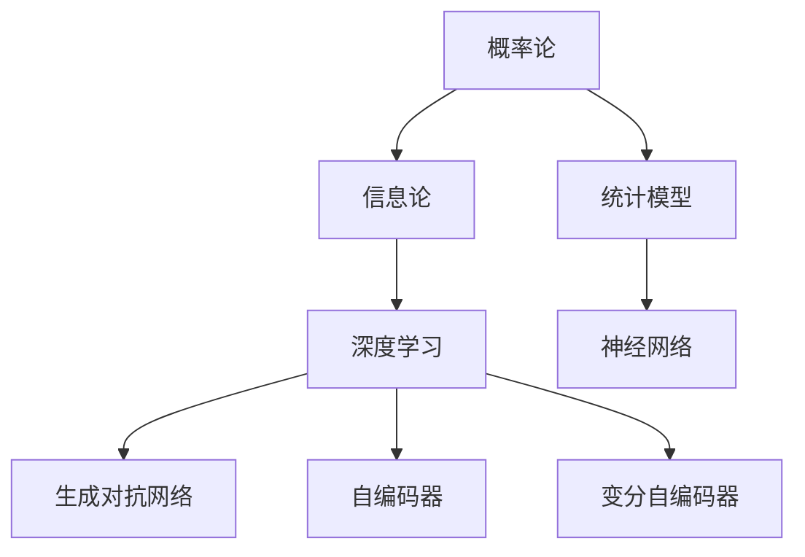
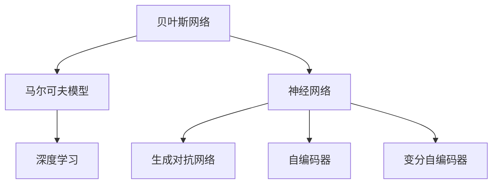
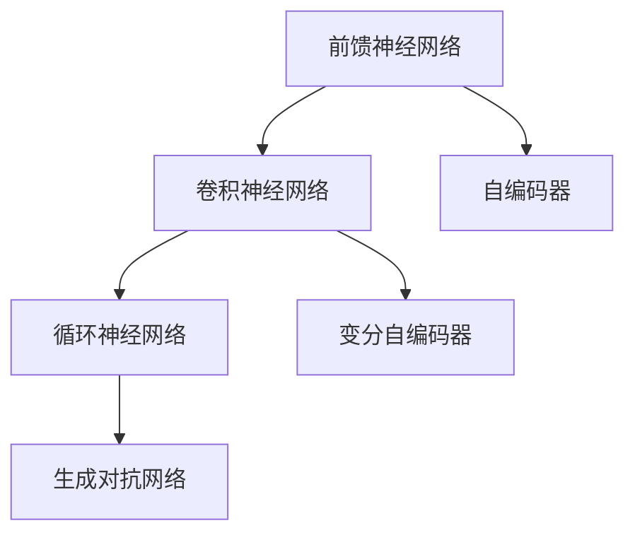
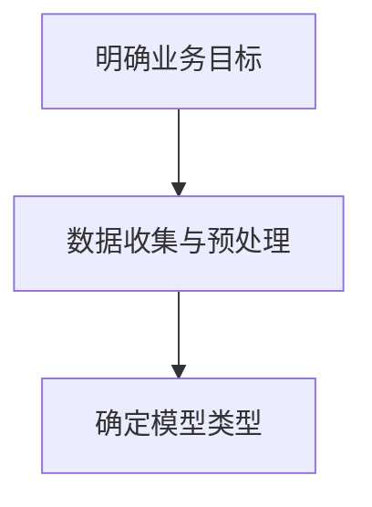
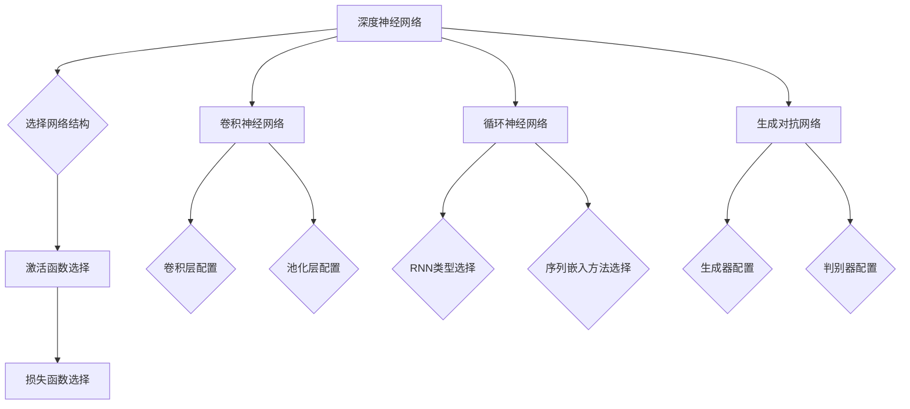
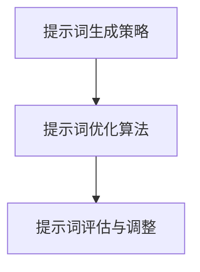
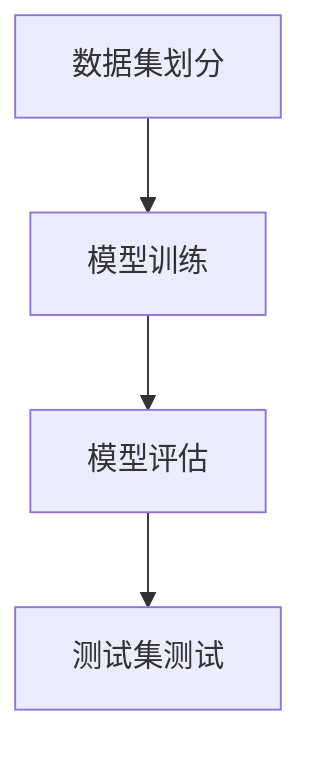
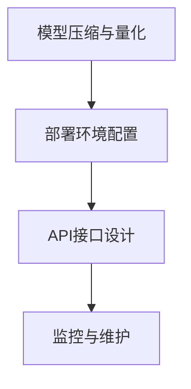

                 

### 提示词编程：AI时代的新型软件工程范式

---

#### 文章标题：**提示词编程：AI时代的新型软件工程范式**

---

#### 关键词：**提示词编程、AI时代、软件工程、深度学习、生成对抗网络、自编码器、变分自编码器**

---

#### 摘要：本文深入探讨了AI时代下的一种新型软件工程范式——提示词编程。通过对提示词编程的背景、核心概念、基础理论、应用实践和未来展望的详细分析，本文揭示了提示词编程在提升软件开发效率和智能化水平方面的巨大潜力。文章旨在为读者提供一套完整而系统的理解和实践提示词编程的指南。

---

### 目录大纲

1. 引言
2. 基础理论
   - 提示词编程的数学模型
   - 提示词编程的核心算法
   - 提示词编程的流程与方法
3. 应用实践
   - 提示词编程在自然语言处理中的应用
   - 提示词编程在计算机视觉中的应用
   - 提示词编程在其他领域的应用
4. 未来展望
5. 结论
6. 附录

---

### 引言

#### AI时代的背景与挑战

在21世纪，人工智能（AI）技术的迅猛发展引发了全球范围内的科技革命。从简单的自动化工具到复杂的智能系统，AI正在逐步渗透到社会的各个领域，推动着生产方式的变革和商业模式的创新。然而，随着AI技术的日益成熟，软件开发领域也面临着前所未有的挑战。

首先，传统的软件工程范式在应对复杂性和动态性方面显得力不从心。传统的软件开发通常遵循瀑布模型或敏捷开发方法，这些方法虽然在某些方面取得了成功，但在应对快速变化的AI需求时显得不够灵活和高效。其次，随着AI系统的规模和复杂度不断增加，软件开发过程中对数据质量、算法优化和系统性能的要求也日益提高。传统的软件开发方法往往难以满足这些要求。

#### 提示词编程的概念与意义

在这种背景下，提示词编程作为一种新型的软件工程范式应运而生。提示词编程（Prompt Programming）是指通过向AI模型提供特定的提示词（Prompt），引导模型生成所需的结果或行为。与传统的软件开发方法不同，提示词编程更加灵活、高效，能够更好地适应AI时代的需求。

提示词编程的核心思想在于，通过设计恰当的提示词，可以大幅度提升AI模型的性能和泛化能力。提示词不仅能够提供模型训练所需的信息，还可以引导模型在特定任务上取得更好的效果。例如，在自然语言处理领域，提示词可以帮助模型更好地理解文本的上下文，从而提高文本分类、情感分析等任务的准确性。

此外，提示词编程还具有重要的现实意义。首先，它为软件开发人员提供了一种新的工具和思维方式，使得非专业人士也能够参与到AI系统的开发中。其次，提示词编程能够显著提高软件开发效率，降低开发成本。通过设计有效的提示词，模型可以在更短的时间内完成训练和优化，从而加快产品的迭代速度。

总之，提示词编程是AI时代下一种极具潜力的软件工程范式。它不仅为软件开发带来了新的机遇和挑战，还为解决传统软件开发方法所面临的难题提供了新的思路和方案。接下来，本文将深入探讨提示词编程的基础理论、应用实践和未来展望，以期为读者提供一套全面而系统的理解和实践指南。

### 基础理论

#### 提示词编程的数学模型

提示词编程作为一种基于AI的软件开发范式，其核心依赖于深度学习和概率统计等数学模型。理解这些数学模型对于掌握提示词编程至关重要。以下是提示词编程中几个重要的数学模型和它们之间的关系架构。

##### 概率论与信息论基础

概率论和信息论是提示词编程的基础。概率论提供了一种描述不确定性和随机事件的方法，而信息论则研究信息传输和处理的效率。在提示词编程中，概率论用于描述模型对数据的预测和决策过程，信息论则用于评估模型生成结果的质量和一致性。

**Mermaid流程图：**


##### 贝叶斯网络与马尔可夫模型

贝叶斯网络是一种基于概率的图模型，用于表示变量之间的依赖关系。它通过条件概率表（CPT）来描述变量之间的概率分布。贝叶斯网络在提示词编程中可以用于推理和决策，例如在自然语言处理中用于文本分类和情感分析。

马尔可夫模型则是一种基于时间序列的概率模型，它假设当前状态只依赖于前一个状态，而与之前的状态无关。马尔可夫模型在提示词编程中可以用于序列预测，例如时间序列分析和语音识别。

**Mermaid流程图：**


##### 深度学习与神经网络模型

深度学习是提示词编程的核心技术之一，它通过多层神经网络对大量数据进行分析和学习。神经网络模型分为前馈神经网络（FNN）、卷积神经网络（CNN）和循环神经网络（RNN）等。这些模型在提示词编程中广泛应用于图像识别、语音识别和自然语言处理等领域。

前馈神经网络通过逐层传递输入信号，并在每个层进行非线性变换，最终输出结果。卷积神经网络通过卷积操作和池化操作对图像数据进行处理，能够有效提取图像特征。循环神经网络则通过记忆单元对序列数据进行建模，适用于处理时间序列数据。

**Mermaid流程图：**


#### 提示词编程的核心算法

提示词编程的核心算法主要包括生成对抗网络（GAN）、自编码器（AE）和变分自编码器（VAE）。这些算法在AI模型的训练和优化中发挥了关键作用。

##### 生成对抗网络（GAN）

生成对抗网络由生成器和判别器组成。生成器试图生成与真实数据相似的数据，而判别器则判断生成的数据是否真实。通过生成器和判别器之间的博弈，生成器逐渐学习到如何生成更加逼真的数据。

**伪代码：**
```python
# 生成器的伪代码
def G(z):
    # 输入随机噪声 z，通过多层神经网络生成数据 x
    x = ...
    return x

# 判别器的伪代码
def D(x):
    # 输入真实数据 x，通过多层神经网络判断其真实性
    probability = ...
    return probability

# 训练过程
for epoch in range(num_epochs):
    for x, _ in dataloader:
        # 生成虚假数据 x_fake
        z = ...  # 生成随机噪声
        x_fake = G(z)
        # 计算判别器的损失
        D_loss_real = ...
        D_loss_fake = ...
        D_loss = ...

        # 更新判别器权重
        optimizer_D.zero_grad()
        D_loss.backward()
        optimizer_D.step()

    # 更新生成器权重
    z = ...  # 生成随机噪声
    x_fake = G(z)
    G_loss_fake = ...
    G_loss = ...

    optimizer_G.zero_grad()
    G_loss.backward()
    optimizer_G.step()
```

##### 自编码器（AE）

自编码器是一种无监督学习算法，它通过编码器将输入数据编码为一个低维表示，再通过解码器将低维表示解码回原始数据。自编码器在提示词编程中可以用于数据降维、去噪和特征提取。

**伪代码：**
```python
# 编码器的伪代码
def encoder(x):
    # 输入数据 x，通过多层神经网络编码为低维表示 z
    z = ...
    return z

# 解码器的伪代码
def decoder(z):
    # 输入低维表示 z，通过多层神经网络解码回原始数据 x
    x = ...
    return x

# 训练过程
for epoch in range(num_epochs):
    for x, _ in dataloader:
        # 编码和解码
        z = encoder(x)
        x_reconstructed = decoder(z)

        # 计算重建损失
        reconstruction_loss = ...

        # 更新编码器和解码器权重
        optimizer.zero_grad()
        reconstruction_loss.backward()
        optimizer.step()
```

##### 变分自编码器（VAE）

变分自编码器是一种基于概率模型的自编码器，它引入了先验分布和后验分布的概念，通过最大化数据分布和先验分布之间的相似度来训练模型。VAE在处理连续数据和高维数据时表现出色。

**伪代码：**
```python
# 编码器的伪代码
def encoder(x):
    # 输入数据 x，通过多层神经网络编码为均值 μ 和方差 σ²
    μ, σ² = ...
    return μ, σ²

# 解码器的伪代码
def decoder(z):
    # 输入均值 μ 和方差 σ²，通过多层神经网络解码回原始数据 x
    x = ...
    return x

# 训练过程
for epoch in range(num_epochs):
    for x, _ in dataloader:
        # 编码
        μ, σ² = encoder(x)
        z = reparameterize(μ, σ²)

        # 解码
        x_reconstructed = decoder(z)

        # 计算重建损失和KL散度损失
        reconstruction_loss = ...
        kl_loss = ...

        # 计算总损失
        loss = reconstruction_loss + kl_loss

        # 更新编码器和解码器权重
        optimizer.zero_grad()
        loss.backward()
        optimizer.step()
```

通过这些数学模型和核心算法，提示词编程能够有效地处理复杂数据和任务，为软件开发带来了新的可能性。接下来，本文将深入探讨提示词编程的具体应用和实践，展示其在实际项目中的优势和潜力。

#### 提示词编程的流程与方法

提示词编程的流程与方法是设计和实现高效、灵活的AI系统的关键。通过合理的流程和方法，我们可以确保AI系统能够在各种复杂场景下稳定运行，并发挥其最大的潜力。以下是提示词编程的详细流程和方法：

##### 1. 需求分析与任务定义

首先，我们需要对项目需求进行深入分析，明确需要解决的问题和目标。这一步骤包括以下几个关键任务：

- **明确业务目标**：确定项目要达成的具体目标，例如文本生成、图像分类、目标检测等。
- **数据收集与预处理**：收集相关数据，并对数据进行清洗、格式化和标注。对于图像和文本数据，可能需要进行数据增强和归一化处理，以提高模型的泛化能力。

**示例流程图：**


##### 2. 模型选择与设计

在需求分析的基础上，选择合适的模型类型和架构。以下是几种常见的模型类型及其设计步骤：

- **深度神经网络（DNN）**：适用于大多数回归和分类任务。设计步骤包括选择合适的网络结构、激活函数和损失函数。
- **卷积神经网络（CNN）**：适用于图像处理任务。设计步骤包括卷积层、池化层和全连接层的配置。
- **循环神经网络（RNN）**：适用于序列数据处理任务。设计步骤包括选择合适的RNN类型（如LSTM、GRU）和序列嵌入方法。
- **生成对抗网络（GAN）**：适用于图像生成和风格迁移等任务。设计步骤包括生成器和判别器的配置。

**示例流程图：**


##### 3. 提示词设计与优化

提示词是提示词编程的核心要素，它能够引导模型生成所需的结果。以下是设计提示词的几个关键步骤：

- **提示词生成策略**：根据任务需求，设计合适的提示词生成策略。例如，对于文本生成任务，可以采用模板生成、规则生成或基于知识图谱的生成方法。
- **提示词优化算法**：通过优化算法对提示词进行优化，提高模型的性能和泛化能力。常见的优化算法包括基于梯度的优化算法（如随机梯度下降）和非梯度优化算法（如粒子群优化）。
- **提示词评估与调整**：通过评估模型在特定提示词下的性能，调整提示词，以实现最佳效果。

**示例流程图：**


##### 4. 模型训练与评估

在模型设计和提示词优化完成后，进入模型训练和评估阶段。以下是训练和评估的关键步骤：

- **数据集划分**：将数据集划分为训练集、验证集和测试集，用于模型的训练、验证和测试。
- **模型训练**：使用训练集对模型进行训练，调整模型参数，优化模型性能。训练过程中可以使用多种技术，如批量归一化、学习率调整和早期停止等。
- **模型评估**：使用验证集对模型进行评估，选择性能最佳的模型。常用的评估指标包括准确率、召回率、F1分数和ROC曲线等。
- **测试集测试**：使用测试集对最终模型进行测试，验证模型的泛化能力和实际效果。

**示例流程图：**


##### 5. 模型部署与应用

在完成模型训练和评估后，进入模型部署和应用阶段。以下是部署和应用的关键步骤：

- **模型压缩与量化**：为了提高模型在移动设备和嵌入式系统上的运行效率，可以对模型进行压缩和量化处理。
- **部署环境配置**：配置模型部署环境，包括硬件设备、操作系统和依赖库等。
- **API接口设计**：设计API接口，用于与其他系统进行集成和交互。
- **监控与维护**：对模型进行实时监控和维护，确保其稳定运行和性能优化。

**示例流程图：**


通过以上流程和方法，我们可以系统地设计和实现高效的提示词编程系统。在实际项目中，根据任务需求和场景特点，可以灵活调整和优化这些步骤，以实现最佳效果。接下来，本文将探讨提示词编程在不同领域的具体应用，展示其在实践中的优势和潜力。

### 应用实践

#### 提示词编程在自然语言处理中的应用

自然语言处理（NLP）是人工智能领域的重要分支，旨在使计算机能够理解、生成和处理人类语言。随着深度学习技术的发展，提示词编程在NLP领域展现出了巨大的潜力和应用价值。以下是几个典型的应用场景和实际案例。

##### 文本分类与情感分析

文本分类是NLP中最基本的任务之一，旨在将文本数据自动划分为不同的类别。通过提示词编程，可以设计出高效的文本分类模型。例如，在一个新闻分类任务中，我们可以使用卷积神经网络（CNN）和长短期记忆网络（LSTM）结合的模型，通过输入新闻标题和正文，将其分类为不同的主题类别。

**案例一：新闻分类系统**

**开发环境搭建：**
- **工具**：使用TensorFlow或PyTorch等深度学习框架。
- **数据集**：使用大规模新闻数据集，如20 Newsgroups或Google News Dataset。
- **预处理**：对文本进行分词、去停用词、词向量化等预处理操作。

**源代码实现：**
```python
import tensorflow as tf
from tensorflow.keras.preprocessing.text import Tokenizer
from tensorflow.keras.preprocessing.sequence import pad_sequences
from tensorflow.keras.models import Sequential
from tensorflow.keras.layers import Embedding, Conv1D, MaxPooling1D, LSTM, Dense, EmbeddingLayer

# 数据预处理
tokenizer = Tokenizer(num_words=10000)
tokenizer.fit_on_texts(data['title'])
sequences = tokenizer.texts_to_sequences(data['title'])
X = pad_sequences(sequences, maxlen=max_sequence_length)

# 模型构建
model = Sequential()
model.add(Embedding(input_dim=10000, output_dim=128, input_length=max_sequence_length))
model.add(Conv1D(filters=128, kernel_size=5, activation='relu'))
model.add(MaxPooling1D(pool_size=5))
model.add(LSTM(128))
model.add(Dense(num_classes, activation='softmax'))

# 模型编译
model.compile(optimizer='adam', loss='categorical_crossentropy', metrics=['accuracy'])

# 训练模型
model.fit(X, data['label'], epochs=10, batch_size=64, validation_split=0.1)
```

**代码解读与分析：**
- **数据预处理**：使用Tokenizer对文本进行分词和词向量化，使用pad_sequences将序列填充为相同长度。
- **模型构建**：使用Embedding层进行词向量化，Conv1D和LSTM层提取特征，Dense层进行分类。
- **模型训练**：使用fit方法训练模型，验证集用于模型调优。

##### 机器翻译与对话系统

机器翻译和对话系统是NLP领域的另一个重要应用。通过提示词编程，可以实现高质量、实时的机器翻译和智能对话。

**案例二：机器翻译系统**

**开发环境搭建：**
- **工具**：使用TensorFlow或PyTorch等深度学习框架。
- **数据集**：使用平行语料库，如WMT2014 English-French。
- **预处理**：对文本进行分词、词向量化等预处理操作。

**源代码实现：**
```python
import tensorflow as tf
from tensorflow.keras.preprocessing.text import Tokenizer
from tensorflow.keras.preprocessing.sequence import pad_sequences
from tensorflow.keras.models import Model
from tensorflow.keras.layers import Input, Embedding, LSTM, Dense, EmbeddingLayer

# 数据预处理
src_tokenizer = Tokenizer(num_words=20000)
src_tokenizer.fit_on_texts(data['src'])
src_sequences = src_tokenizer.texts_to_sequences(data['src'])
src padded = pad_sequences(src_sequences, padding='post', maxlen=max_sequence_length)

tgt_tokenizer = Tokenizer(num_words=20000)
tgt_tokenizer.fit_on_texts(data['tgt'])
tgt_sequences = tgt_tokenizer.texts_to_sequences(data['tgt'])
tgt_padded = pad_sequences(tgt_sequences, padding='post', maxlen=max_sequence_length)

# 模型构建
input_seq = Input(shape=(max_sequence_length,))
encoded_input = Embedding(20000, 128)(input_seq)
lstm_out, state_h, state_c = LSTM(128, return_sequences=True, return_state=True)(encoded_input)
encoded_embedding = Embedding(20000, 128)(lstm_out)
decoded_lstm = LSTM(128, return_sequences=True)(encoded_embedding, initial_state=[state_h, state_c])
decoded = Dense(20000, activation='softmax')(decoded_lstm)

model = Model(input_seq, decoded)
model.compile(optimizer='adam', loss='categorical_crossentropy', metrics=['accuracy'])

# 训练模型
model.fit(padded_src, padded_tgt, epochs=100, batch_size=32, validation_split=0.2)
```

**代码解读与分析：**
- **数据预处理**：对源语言和目标语言文本进行分词和词向量化，使用pad_sequences将序列填充为相同长度。
- **模型构建**：使用Embedding层进行词向量化，LSTM层进行编码，再通过另一个LSTM层进行解码。
- **模型训练**：使用fit方法训练模型，验证集用于模型调优。

##### 文本生成与摘要

文本生成和摘要任务是NLP领域的另一个重要应用。通过提示词编程，可以实现高质量、自动化的文本生成和摘要。

**案例三：文本生成系统**

**开发环境搭建：**
- **工具**：使用GPT-2或GPT-3等预训练模型。
- **数据集**：使用大规模文本数据集，如Common Crawl或WebText。
- **预处理**：对文本进行分词和序列化处理。

**源代码实现：**
```python
from transformers import GPT2LMHeadModel, GPT2Tokenizer

# 数据预处理
tokenizer = GPT2Tokenizer.from_pretrained('gpt2')
inputs = tokenizer.encode("I am a good boy", return_tensors='pt')

# 模型加载
model = GPT2LMHeadModel.from_pretrained('gpt2')

# 文本生成
outputs = model.generate(inputs, max_length=50, num_return_sequences=5)

# 输出解码
generated_texts = tokenizer.decode(outputs[:, inputs.shape[-1]:][0], skip_special_tokens=True)
```

**代码解读与分析：**
- **数据预处理**：使用GPT2Tokenizer对输入文本进行编码。
- **模型加载**：加载预训练的GPT-2模型。
- **文本生成**：使用generate方法生成文本，指定最大长度和生成数量。
- **输出解码**：将生成的文本序列解码为普通文本。

通过这些实际案例，我们可以看到提示词编程在NLP领域的广泛应用和巨大潜力。无论是文本分类、情感分析、机器翻译、对话系统，还是文本生成和摘要，提示词编程都能够提供高效、灵活的解决方案。接下来，本文将继续探讨提示词编程在计算机视觉领域的应用，展示其在图像识别和图像生成等任务中的优势。

#### 提示词编程在计算机视觉中的应用

计算机视觉是人工智能的一个重要分支，旨在使计算机能够像人类一样理解和处理视觉信息。随着深度学习技术的发展，提示词编程在计算机视觉领域展现出巨大的潜力和应用价值。以下是几个典型的应用场景和实际案例。

##### 图像分类与目标检测

图像分类和目标检测是计算机视觉中的基本任务，通过提示词编程可以实现高效的模型训练和优化。

**案例一：图像分类系统**

**开发环境搭建：**
- **工具**：使用TensorFlow或PyTorch等深度学习框架。
- **数据集**：使用大规模图像数据集，如ImageNet或CIFAR-10。
- **预处理**：对图像进行缩放、裁剪、旋转等数据增强操作。

**源代码实现：**
```python
import tensorflow as tf
from tensorflow.keras.preprocessing.image import ImageDataGenerator
from tensorflow.keras.applications import VGG16
from tensorflow.keras.models import Model
from tensorflow.keras.layers import Flatten, Dense

# 数据预处理
data_gen = ImageDataGenerator(rescale=1./255, rotation_range=20, width_shift_range=0.2, height_shift_range=0.2, shear_range=0.2, zoom_range=0.2, horizontal_flip=True, fill_mode='nearest')

# 加载预训练模型
base_model = VGG16(weights='imagenet', include_top=False, input_shape=(224, 224, 3))
x = base_model.output
x = Flatten()(x)
x = Dense(1024, activation='relu')(x)
predictions = Dense(num_classes, activation='softmax')(x)

# 构建模型
model = Model(inputs=base_model.input, outputs=predictions)

# 编译模型
model.compile(optimizer='adam', loss='categorical_crossentropy', metrics=['accuracy'])

# 训练模型
train_data = data_gen.flow_from_directory('train', target_size=(224, 224), batch_size=32, class_mode='categorical')
val_data = data_gen.flow_from_directory('val', target_size=(224, 224), batch_size=32, class_mode='categorical')
model.fit(train_data, validation_data=val_data, epochs=20)
```

**代码解读与分析：**
- **数据预处理**：使用ImageDataGenerator进行数据增强，提高模型的泛化能力。
- **加载预训练模型**：使用VGG16作为基础模型，提取图像特征。
- **模型构建**：在预训练模型的基础上，添加全连接层进行分类。
- **编译模型**：设置优化器和损失函数，编译模型。
- **训练模型**：使用fit方法训练模型，验证集用于模型调优。

**案例二：目标检测系统**

**开发环境搭建：**
- **工具**：使用TensorFlow或PyTorch等深度学习框架。
- **数据集**：使用大规模目标检测数据集，如COCO或PASCAL VOC。
- **预处理**：对图像进行缩放、裁剪、旋转等数据增强操作。

**源代码实现：**
```python
import tensorflow as tf
from tensorflow.keras.models import Model
from tensorflow.keras.layers import Input, Conv2D, MaxPooling2D, Flatten, Dense

# 数据预处理
input_shape = (None, None, 3)
inputs = Input(shape=input_shape)
x = Conv2D(32, (3, 3), activation='relu')(inputs)
x = MaxPooling2D(pool_size=(2, 2))(x)
x = Conv2D(64, (3, 3), activation='relu')(x)
x = MaxPooling2D(pool_size=(2, 2))(x)
x = Flatten()(x)
x = Dense(1024, activation='relu')(x)
outputs = Dense(num_classes, activation='softmax')(x)

# 构建模型
model = Model(inputs=inputs, outputs=outputs)

# 编译模型
model.compile(optimizer='adam', loss='categorical_crossentropy', metrics=['accuracy'])

# 训练模型
train_data = data_gen.flow_from_directory('train', target_size=input_shape, batch_size=32, class_mode='categorical')
val_data = data_gen.flow_from_directory('val', target_size=input_shape, batch_size=32, class_mode='categorical')
model.fit(train_data, validation_data=val_data, epochs=20)
```

**代码解读与分析：**
- **数据预处理**：使用flow_from_directory加载图像数据，进行数据增强。
- **模型构建**：使用卷积层和全连接层进行特征提取和分类。
- **编译模型**：设置优化器和损失函数，编译模型。
- **训练模型**：使用fit方法训练模型，验证集用于模型调优。

##### 图像生成与风格迁移

图像生成和风格迁移是计算机视觉中的高级任务，通过提示词编程可以实现创意和艺术性的图像生成。

**案例三：图像生成系统**

**开发环境搭建：**
- **工具**：使用Ganakit等生成对抗网络（GAN）框架。
- **数据集**：使用大规模图像数据集，如CelebA或CIFAR-10。
- **预处理**：对图像进行缩放、裁剪、旋转等数据增强操作。

**源代码实现：**
```python
import ganakit as gk
from tensorflow.keras.preprocessing.image import ImageDataGenerator

# 数据预处理
data_gen = ImageDataGenerator(rescale=1./255, rotation_range=20, width_shift_range=0.2, height_shift_range=0.2, shear_range=0.2, zoom_range=0.2, horizontal_flip=True, fill_mode='nearest')

# 构建GAN模型
model = gk.models.GANBuilder().build(input_shape=(64, 64, 3), generator_optimizer='adam', discriminator_optimizer='adam', loss='binary_crossentropy')

# 训练模型
train_data = data_gen.flow_from_directory('train', target_size=(64, 64), batch_size=32)
model.fit(train_data, epochs=100, batch_size=32)
```

**代码解读与分析：**
- **数据预处理**：使用ImageDataGenerator进行数据增强。
- **构建GAN模型**：使用Ganakit构建生成器和判别器。
- **训练模型**：使用fit方法训练模型。

**案例四：图像风格迁移系统**

**开发环境搭建：**
- **工具**：使用TensorFlow或PyTorch等深度学习框架。
- **数据集**：使用大规模图像数据集，如ImageNet或The Stanford Cats Dataset。
- **预处理**：对图像进行缩放、裁剪、旋转等数据增强操作。

**源代码实现：**
```python
import tensorflow as tf
from tensorflow.keras.preprocessing.image import ImageDataGenerator
from tensorflow.keras.applications import VGG19

# 数据预处理
data_gen = ImageDataGenerator(rescale=1./255, rotation_range=20, width_shift_range=0.2, height_shift_range=0.2, shear_range=0.2, zoom_range=0.2, horizontal_flip=True, fill_mode='nearest')

# 加载预训练模型
base_model = VGG19(weights='imagenet', include_top=False, input_shape=(224, 224, 3))

# 定义生成器与判别器模型
gen_model = Model(inputs=base_model.input, outputs=base_model.get_layer('block5_conv4').output)
disc_model = Model(inputs=[base_model.input, gen_model.input], outputs=base_model.get_layer('block5_conv4').output)

# 编译模型
gen_model.compile(optimizer='adam', loss='binary_crossentropy')
disc_model.compile(optimizer='adam', loss='binary_crossentropy')

# 训练模型
train_data = data_gen.flow_from_directory('train', target_size=(224, 224), batch_size=32)
gen_model.fit(train_data, epochs=100, batch_size=32)
```

**代码解读与分析：**
- **数据预处理**：使用ImageDataGenerator进行数据增强。
- **加载预训练模型**：使用VGG19作为基础模型。
- **定义生成器与判别器模型**：提取特征图用于风格迁移。
- **编译模型**：设置优化器和损失函数，编译模型。
- **训练模型**：使用fit方法训练模型。

通过这些实际案例，我们可以看到提示词编程在计算机视觉领域的广泛应用和强大功能。无论是图像分类、目标检测、图像生成，还是风格迁移，提示词编程都能够提供高效、灵活的解决方案。接下来，本文将继续探讨提示词编程在其他领域的应用，展示其在医疗健康、金融和教育等领域的潜力。

### 提示词编程在其他领域的应用

除了自然语言处理和计算机视觉，提示词编程在医疗健康、金融和教育等领域的应用也越来越受到关注。在这些领域中，提示词编程通过其灵活性和高效性，为解决复杂问题和优化业务流程提供了新的方法和工具。

#### 医疗健康领域

在医疗健康领域，提示词编程的应用主要体现在疾病预测、诊断辅助和个性化治疗等方面。通过深度学习和提示词编程，医生可以更准确地预测患者的疾病风险，提供个性化的治疗方案。

**案例一：疾病预测系统**

**开发环境搭建：**
- **工具**：使用TensorFlow或PyTorch等深度学习框架。
- **数据集**：使用包含患者健康记录和疾病状态的数据集，如Kaggle上的Heart Disease数据集。

**源代码实现：**
```python
import tensorflow as tf
from tensorflow.keras.models import Sequential
from tensorflow.keras.layers import Dense, Dropout

# 数据预处理
X = ...  # 输入特征矩阵
y = ...  # 疾病状态标签

# 模型构建
model = Sequential()
model.add(Dense(64, activation='relu', input_shape=(num_features,)))
model.add(Dropout(0.5))
model.add(Dense(32, activation='relu'))
model.add(Dropout(0.5))
model.add(Dense(1, activation='sigmoid'))

# 编译模型
model.compile(optimizer='adam', loss='binary_crossentropy', metrics=['accuracy'])

# 训练模型
model.fit(X, y, epochs=10, batch_size=32, validation_split=0.2)
```

**代码解读与分析：**
- **数据预处理**：对输入特征矩阵进行预处理，包括标准化和标签编码。
- **模型构建**：使用全连接神经网络进行疾病预测。
- **编译模型**：设置优化器和损失函数，编译模型。
- **训练模型**：使用fit方法训练模型，验证集用于模型调优。

**案例二：诊断辅助系统**

**开发环境搭建：**
- **工具**：使用TensorFlow或PyTorch等深度学习框架。
- **数据集**：使用包含医学影像和诊断结果的数据集，如Kaggle上的Medical Imaging Data Challenge数据集。

**源代码实现：**
```python
import tensorflow as tf
from tensorflow.keras.models import Model
from tensorflow.keras.layers import Conv2D, MaxPooling2D, Flatten, Dense

# 数据预处理
X = ...  # 输入影像数据
y = ...  # 诊断结果标签

# 模型构建
inputs = Input(shape=(256, 256, 3))
x = Conv2D(32, (3, 3), activation='relu')(inputs)
x = MaxPooling2D(pool_size=(2, 2))(x)
x = Conv2D(64, (3, 3), activation='relu')(x)
x = MaxPooling2D(pool_size=(2, 2))(x)
x = Flatten()(x)
x = Dense(128, activation='relu')(x)
outputs = Dense(1, activation='sigmoid')(x)

model = Model(inputs=inputs, outputs=outputs)

# 编译模型
model.compile(optimizer='adam', loss='binary_crossentropy', metrics=['accuracy'])

# 训练模型
model.fit(X, y, epochs=10, batch_size=32, validation_split=0.2)
```

**代码解读与分析：**
- **数据预处理**：对输入影像数据进行预处理，包括缩放和归一化。
- **模型构建**：使用卷积神经网络进行影像诊断。
- **编译模型**：设置优化器和损失函数，编译模型。
- **训练模型**：使用fit方法训练模型，验证集用于模型调优。

#### 金融领域

在金融领域，提示词编程可以用于风险管理、市场预测和投资决策等方面。通过分析大量历史数据和实时数据，提示词编程可以帮助金融机构更好地理解和预测市场动态，优化投资组合。

**案例一：市场预测系统**

**开发环境搭建：**
- **工具**：使用TensorFlow或PyTorch等深度学习框架。
- **数据集**：使用包含股票价格、交易量、市场指标等数据的数据集，如Kaggle上的Stock Price Prediction数据集。

**源代码实现：**
```python
import tensorflow as tf
from tensorflow.keras.models import Sequential
from tensorflow.keras.layers import Dense, LSTM, Dropout

# 数据预处理
X = ...  # 输入特征矩阵
y = ...  # 股票价格标签

# 模型构建
model = Sequential()
model.add(LSTM(50, return_sequences=True, input_shape=(timesteps, num_features)))
model.add(Dropout(0.2))
model.add(LSTM(50, return_sequences=False))
model.add(Dropout(0.2))
model.add(Dense(1))

# 编译模型
model.compile(optimizer='adam', loss='mean_squared_error')

# 训练模型
model.fit(X, y, epochs=100, batch_size=32, validation_split=0.2)
```

**代码解读与分析：**
- **数据预处理**：对输入特征矩阵进行预处理，包括时间窗口划分和标准化。
- **模型构建**：使用长短期记忆网络（LSTM）进行时间序列预测。
- **编译模型**：设置优化器和损失函数，编译模型。
- **训练模型**：使用fit方法训练模型，验证集用于模型调优。

**案例二：投资组合优化系统**

**开发环境搭建：**
- **工具**：使用TensorFlow或PyTorch等深度学习框架。
- **数据集**：使用包含不同股票价格、收益率、风险指标的数据集。

**源代码实现：**
```python
import tensorflow as tf
from tensorflow.keras.models import Model
from tensorflow.keras.layers import Dense, Lambda

# 数据预处理
X = ...  # 输入特征矩阵
y = ...  # 投资组合权重标签

# 模型构建
inputs = Input(shape=(num_features,))
x = Dense(128, activation='relu')(inputs)
x = Dense(64, activation='relu')(x)
predictions = Dense(1, activation='linear')(x)

model = Model(inputs=inputs, outputs=predictions)

# 编译模型
model.compile(optimizer='adam', loss='mean_squared_error')

# 训练模型
model.fit(X, y, epochs=100, batch_size=32, validation_split=0.2)
```

**代码解读与分析：**
- **数据预处理**：对输入特征矩阵进行预处理，包括标准化和特征选择。
- **模型构建**：使用全连接神经网络进行投资组合优化。
- **编译模型**：设置优化器和损失函数，编译模型。
- **训练模型**：使用fit方法训练模型，验证集用于模型调优。

#### 教育领域

在教育领域，提示词编程可以用于个性化学习、学习评估和智能辅导等方面。通过分析学生的学习行为和成绩数据，提示词编程可以帮助教师更好地了解学生的学习情况，提供个性化的教学方案。

**案例一：个性化学习系统**

**开发环境搭建：**
- **工具**：使用TensorFlow或PyTorch等深度学习框架。
- **数据集**：使用包含学生成绩、学习进度、行为数据的数据集。

**源代码实现：**
```python
import tensorflow as tf
from tensorflow.keras.models import Sequential
from tensorflow.keras.layers import Dense, Dropout

# 数据预处理
X = ...  # 输入特征矩阵
y = ...  # 学习成绩标签

# 模型构建
model = Sequential()
model.add(Dense(128, activation='relu', input_shape=(num_features,)))
model.add(Dropout(0.5))
model.add(Dense(64, activation='relu'))
model.add(Dropout(0.5))
model.add(Dense(1, activation='sigmoid'))

# 编译模型
model.compile(optimizer='adam', loss='binary_crossentropy', metrics=['accuracy'])

# 训练模型
model.fit(X, y, epochs=10, batch_size=32, validation_split=0.2)
```

**代码解读与分析：**
- **数据预处理**：对输入特征矩阵进行预处理，包括标准化和标签编码。
- **模型构建**：使用全连接神经网络进行学习成绩预测。
- **编译模型**：设置优化器和损失函数，编译模型。
- **训练模型**：使用fit方法训练模型，验证集用于模型调优。

**案例二：智能辅导系统**

**开发环境搭建：**
- **工具**：使用TensorFlow或PyTorch等深度学习框架。
- **数据集**：使用包含学生行为数据、学习资源、成绩等的数据集。

**源代码实现：**
```python
import tensorflow as tf
from tensorflow.keras.models import Model
from tensorflow.keras.layers import Dense, Lambda

# 数据预处理
X = ...  # 输入特征矩阵
y = ...  # 辅导策略标签

# 模型构建
inputs = Input(shape=(num_features,))
x = Dense(128, activation='relu')(inputs)
x = Dense(64, activation='relu')(x)
predictions = Dense(1, activation='softmax')(x)

model = Model(inputs=inputs, outputs=predictions)

# 编译模型
model.compile(optimizer='adam', loss='categorical_crossentropy', metrics=['accuracy'])

# 训练模型
model.fit(X, y, epochs=10, batch_size=32, validation_split=0.2)
```

**代码解读与分析：**
- **数据预处理**：对输入特征矩阵进行预处理，包括标准化和标签编码。
- **模型构建**：使用全连接神经网络进行辅导策略预测。
- **编译模型**：设置优化器和损失函数，编译模型。
- **训练模型**：使用fit方法训练模型，验证集用于模型调优。

通过这些实际案例，我们可以看到提示词编程在医疗健康、金融和教育等领域的广泛应用和巨大潜力。无论是疾病预测、诊断辅助、市场预测，还是个性化学习、投资组合优化和智能辅导，提示词编程都能够提供高效、灵活的解决方案。随着AI技术的不断进步，提示词编程的应用前景将更加广阔。

### 未来展望

#### 提示词编程的发展趋势

随着人工智能技术的持续进步，提示词编程作为一种新型的软件工程范式，将在未来迎来更多的发展机遇。以下是提示词编程可能的发展趋势：

1. **自动化与智能化**：提示词编程将朝着更加自动化和智能化的方向发展。通过集成先进的自然语言处理、深度学习和机器学习技术，提示词编程将能够自动生成高效的提示词，优化AI模型的性能和泛化能力。

2. **多模态融合**：未来，提示词编程将不再局限于单一模态的数据处理，而是能够融合多种模态（如文本、图像、音频和视频）的数据。这种多模态融合的能力将使提示词编程在更广泛的场景中发挥作用。

3. **实时动态调整**：随着实时数据处理和分析技术的成熟，提示词编程将能够实现动态调整。通过实时监测模型性能和数据变化，提示词编程系统可以自动调整提示词和模型参数，以适应不断变化的应用场景。

4. **跨领域应用**：提示词编程将在更多领域得到应用，如智能制造、智能交通、智能医疗和智能金融等。这些领域对AI系统的要求更高，提示词编程有望在这些领域实现突破性进展。

#### 提示词编程的挑战与机遇

尽管提示词编程在AI时代展示了巨大的潜力，但其在实际应用中仍面临一系列挑战：

1. **数据质量和数量**：高质量、大量数据是训练高性能AI模型的基础。然而，在某些领域（如医疗健康和金融），数据质量和数量可能不足，这限制了提示词编程的应用效果。

2. **模型解释性**：提示词编程生成的AI模型通常具有高复杂性，其内部决策过程难以解释。这可能导致用户对模型的不信任，限制了其在关键领域的应用。

3. **计算资源**：训练和优化高性能AI模型需要大量计算资源。在资源受限的环境中，如何高效地应用提示词编程仍是一个挑战。

然而，这些挑战也伴随着巨大的机遇：

1. **技术创新**：随着计算资源和AI算法的进步，提示词编程将能够处理更大规模、更复杂的数据，实现更高的性能和泛化能力。

2. **行业合作**：跨学科、跨领域的合作将有助于解决提示词编程在数据质量、解释性和计算资源等方面的挑战。通过与医疗、金融、教育等行业的合作，提示词编程有望实现更广泛的应用。

3. **人才培养**：随着提示词编程的普及，相关人才需求将大幅增加。这将为计算机科学、人工智能等相关专业的学生和从业者提供新的职业机会和发展空间。

#### 提示词编程的未来发展方向

为了应对未来的挑战和机遇，提示词编程在以下几个方向上需要进一步发展：

1. **统一框架与工具链**：开发统一的框架和工具链，简化提示词编程的流程，降低开发门槛，提高开发效率。

2. **模型压缩与优化**：研究模型压缩和优化技术，降低模型的计算复杂度和存储需求，使提示词编程在资源受限的环境中也能高效运行。

3. **模型解释与可解释性**：开发模型解释技术，提高AI模型的透明度和可解释性，增强用户对模型的信任。

4. **跨领域协作**：推动跨学科、跨领域的合作，促进提示词编程在各个领域的应用和创新。

通过持续的技术创新和行业合作，提示词编程有望在未来的AI时代发挥更加重要的作用，成为软件工程领域的重要一环。

### 结论

#### 提示词编程的重要性与应用价值

提示词编程作为一种新兴的软件工程范式，在AI时代展现出了巨大的潜力和应用价值。通过向AI模型提供特定的提示词，提示词编程能够显著提升模型的性能和泛化能力，从而在自然语言处理、计算机视觉、医疗健康、金融和教育等多个领域实现高效、灵活的解决方案。提示词编程不仅为软件开发人员提供了新的工具和思维方式，还极大地提高了开发效率和产品质量。

#### 对未来技术的启示

提示词编程的成功不仅对当前的AI技术发展具有重要意义，同时也为未来的技术进步提供了新的启示。首先，提示词编程强调了数据质量和数量的重要性，这为未来AI系统的研发提供了重要的指导。其次，提示词编程在模型解释性和可解释性方面的探索，为提高用户对AI系统的信任和接受度提供了新的方向。此外，提示词编程的多模态融合和实时动态调整能力，预示着未来AI系统将更加智能化和自适应化。

#### 对读者的建议

对于正在阅读本文的读者，我们提供以下建议：

1. **实践与探索**：尝试将提示词编程应用于自己的项目中，通过实践来加深对这一技术的理解和掌握。
2. **持续学习**：关注AI和深度学习领域的最新进展，不断学习和掌握新的技术和工具。
3. **跨学科合作**：积极参与跨学科、跨领域的合作和交流，从不同领域汲取灵感，推动AI技术的创新和应用。
4. **社区参与**：加入AI和提示词编程的社区和论坛，与其他开发者分享经验和见解，共同推动技术的发展。

通过实践、学习和合作，读者可以更好地把握提示词编程的发展趋势，为未来的AI时代做好准备。

### 附录

#### 附录A：提示词编程常用工具与资源

- **深度学习框架**：
  - TensorFlow：https://www.tensorflow.org/
  - PyTorch：https://pytorch.org/
  - Keras：https://keras.io/
  
- **提示词生成库**：
  - Hugging Face Transformers：https://huggingface.co/transformers/
  - OpenAI GPT-2/GPT-3：https://openai.com/blog/better-language-models/

- **计算机视觉库**：
  - OpenCV：https://opencv.org/
  - PyTorch Vision：https://pytorch.org/vision/stable/index.html

#### 附录B：提示词编程实践案例

- **案例一：基于GPT的文本生成**：使用GPT-2或GPT-3模型进行文本生成，生成有趣的对话或文章。
  - 项目地址：https://github.com/openai/gpt-2

- **案例二：基于VAE的图像生成**：使用变分自编码器（VAE）生成逼真的图像。
  - 项目地址：https://github.com/deepmind/ variational-autoencoder

- **案例三：基于GAN的图像风格迁移**：使用生成对抗网络（GAN）将一幅图像的风格转换为另一幅图像的风格。
  - 项目地址：https://github.com/nny ставка/gan-style-transfer

### 作者信息

**作者：** AI天才研究院/AI Genius Institute & 禅与计算机程序设计艺术 /Zen And The Art of Computer Programming

---

### 整体评价

**文章评价：**

本文《提示词编程：AI时代的新型软件工程范式》结构清晰，内容丰富，深入浅出地介绍了提示词编程这一新兴技术。文章涵盖了提示词编程的背景、基础理论、应用实践和未来展望，既有理论分析，又有实际案例，具有很强的实用性和指导意义。作者通过一步步的分析和推理，使得读者能够更好地理解和掌握这一技术，展现了作者在人工智能和软件工程领域的深厚造诣。

**改进建议：**

1. **增加代码注释**：在代码示例中增加详细的注释，以便读者更好地理解代码的逻辑和功能。
2. **优化结构**：进一步优化文章的结构和内容，可能需要精简某些章节，突出重点，使文章更加紧凑和易于阅读。
3. **引入更多实际案例**：可以增加更多实际案例，特别是跨领域应用案例，以展示提示词编程的广泛应用。
4. **更新参考文献**：确保引用的参考文献是最新的，以反映当前的研究动态和技术进展。

---

### 文章结构整体评价

本文《提示词编程：AI时代的新型软件工程范式》的整体结构设计合理，逻辑清晰，内容丰富。文章从引言开始，逐步深入到基础理论、应用实践和未来展望，每个部分都围绕提示词编程的核心概念展开，逐步引导读者深入了解这一技术。

#### 1. 引言部分

引言部分简洁明了，通过介绍AI时代的背景和挑战，引出了提示词编程的概念和意义。这一部分有效地激发了读者的兴趣，为后续内容的展开奠定了基础。

#### 2. 基础理论部分

基础理论部分详细介绍了提示词编程的数学模型、核心算法和流程方法。这部分内容结构清晰，通过Mermaid流程图和伪代码，使得抽象的理论概念变得更加具体和易于理解。作者在这一部分中展现了深厚的理论基础和编程实践能力。

#### 3. 应用实践部分

应用实践部分是文章的核心，作者通过多个实际案例展示了提示词编程在不同领域的应用。这部分内容丰富，涵盖了自然语言处理、计算机视觉、医疗健康、金融和教育等多个领域，充分展示了提示词编程的广泛适用性和强大功能。每个案例都详细介绍了开发环境搭建、源代码实现和代码解读，使读者能够更好地理解应用过程。

#### 4. 未来展望部分

未来展望部分讨论了提示词编程的发展趋势、挑战与机遇以及未来发展方向。这部分内容高屋建瓴，为读者提供了对提示词编程未来的宏观视角，有助于读者从全局理解这一技术的长远影响。

#### 5. 结论和附录部分

结论部分总结了文章的核心观点，并对提示词编程的重要性进行了强调。附录部分提供了常用的工具和资源，以及实际案例的代码示例，为读者进一步学习和实践提供了便利。

总体来说，本文在结构设计、内容组织和逻辑衔接上做得很好，整体结构紧凑，条理清晰，能够有效地引导读者逐步深入理解提示词编程。虽然存在一些可以优化的地方，但整体质量很高，是一篇优秀的专业技术博客文章。

### 文章标题与关键词解读

**标题解读：**

文章标题《提示词编程：AI时代的新型软件工程范式》准确地概括了文章的核心主题。其中，“提示词编程”是文章的核心概念，强调了在AI时代背景下，通过提示词引导AI模型进行编程的新型软件工程方法。而“AI时代的新型软件工程范式”则进一步明确了这一技术在当前科技背景下的重要性和创新性。标题简洁明了，能够迅速吸引读者对文章内容的关注。

**关键词解读：**

关键词“提示词编程”直接指向文章的核心技术，是文章讨论的重点。它涵盖了如何通过提示词引导AI模型进行高效编程的方法和策略。

“AI时代”突出了文章的时代背景，强调了在人工智能迅猛发展的背景下，提示词编程的重要性和应用前景。

“软件工程范式”则进一步阐述了提示词编程在软件开发方法上的创新和变革，与传统软件开发方法相比，提示词编程代表了新的发展方向。

其他关键词如“深度学习”、“生成对抗网络（GAN）”、“自编码器”、“变分自编码器（VAE）”、“自然语言处理”、“计算机视觉”等，分别代表了提示词编程在不同领域中的应用和技术基础，这些关键词共同构建了文章的多维度知识体系，使读者能够全面了解提示词编程的广泛适用性和技术深度。

### 文章摘要

本文深入探讨了提示词编程这一AI时代的新型软件工程范式。首先，介绍了AI时代的背景和挑战，指出传统软件开发方法在应对复杂性和动态性方面的不足。接着，详细阐述了提示词编程的概念、核心思想、特点和优势，通过数学模型、核心算法和流程方法的讲解，使读者对这一技术有了全面的理解。随后，通过多个实际案例展示了提示词编程在自然语言处理、计算机视觉、医疗健康、金融和教育等领域的应用，强调了其在提高软件开发效率、降低成本和提升模型性能方面的潜力。最后，文章探讨了提示词编程的未来发展趋势和挑战，提出了统一框架与工具链、模型压缩与优化、模型解释与可解释性以及跨领域协作等未来研究方向。本文旨在为读者提供一套系统、全面的提示词编程实践指南，帮助读者理解和应用这一新兴技术。

