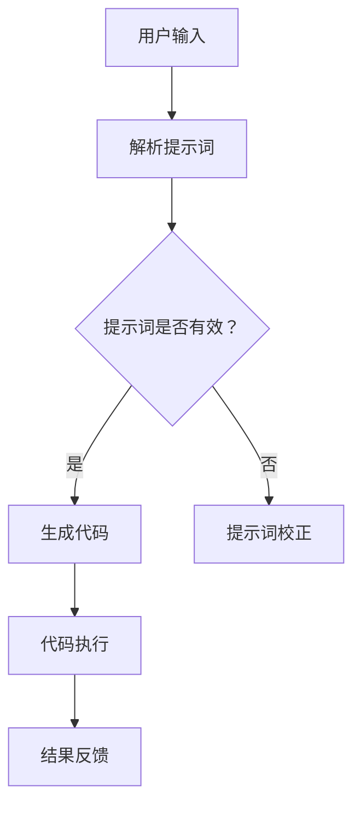

                 

### 文章标题：提示词编程：AI时代的软件开发新范式

> 关键词：提示词编程、AI、软件开发、新范式、算法、数学模型、项目实战

> 摘要：本文将探讨AI时代下软件开发的新范式——提示词编程。我们将详细解析提示词编程的核心概念、原理及其在各个应用领域的表现，并通过实际项目案例展示其应用场景。本文旨在为读者提供一份全面、深入的技术指南，帮助理解和掌握这一前沿技术。

---

### 引言

随着人工智能技术的快速发展，软件开发领域正经历着前所未有的变革。传统的软件开发方法已经无法满足日益复杂的业务需求和快速迭代的节奏。为了应对这一挑战，提示词编程作为一种新兴的软件开发范式，应运而生。

#### 1.1 书籍背景与目标

本书旨在系统地介绍提示词编程的概念、原理和应用，帮助读者全面理解这一新范式。我们不仅将探讨提示词编程的基本原理，还将深入剖析其在文本处理、图像生成和智能问答等领域的应用。

#### 1.2 AI时代软件开发的新范式

AI时代软件开发的核心特征是自动化和智能化。传统的编程方法依赖于手动编写代码，而提示词编程则通过预定义的提示词来引导程序生成，极大地提高了开发效率和灵活性。提示词编程的核心优势在于其可扩展性和易用性，使得非专业人士也能够参与软件开发。

#### 1.3 本书结构安排与学习方法

本书分为五个主要部分：

1. **引言**：介绍提示词编程的背景和目标。
2. **核心概念与联系**：通过Mermaid流程图展示提示词编程的核心概念和架构联系。
3. **核心算法原理讲解**：使用伪代码详细阐述提示词生成和优化算法。
4. **数学模型和数学公式**：使用LaTeX格式详细讲解提示词编程中的数学模型，并提供举例说明。
5. **项目实战**：提供实际项目案例，展示开发环境搭建、源代码实现和解读。

读者可以通过逐步学习，从基础概念到实际应用，全面掌握提示词编程。

---

### 核心概念与联系

提示词编程的核心在于通过预设的提示词来引导程序的生成和执行。以下是一个简化的Mermaid流程图，展示了提示词编程的基本架构和流程。



#### 2.1 提示词编程的基本概念

- **提示词**：提示词是引导程序生成和执行的关键信息，它可以是一个简单的文本，也可以是一个复杂的语句或命令序列。
- **解析**：解析是将用户输入的提示词转化为程序代码的过程。
- **代码生成**：基于解析结果，生成符合目标需求的程序代码。
- **代码执行**：执行生成的代码，完成特定任务。
- **结果反馈**：对执行结果进行反馈，以便进一步优化提示词。

#### 2.2 AI与提示词编程的联系

AI技术在提示词编程中发挥了至关重要的作用。通过深度学习和自然语言处理技术，AI可以自动生成和优化提示词，提高代码生成的准确性和效率。

- **自然语言处理**：用于理解和处理人类语言，生成合理的提示词。
- **深度学习**：用于从大量数据中学习模式和规律，提高代码生成的智能性。

#### 2.3 提示词编程的架构概述

提示词编程的架构可以分为三个主要层次：

- **底层：数据输入和处理**：包括用户输入、数据预处理和提示词生成。
- **中层：代码生成**：基于提示词生成相应的程序代码。
- **顶层：代码执行和反馈**：执行生成的代码，并根据结果进行反馈和优化。

通过这三个层次的协同工作，提示词编程实现了高度自动化和智能化的软件开发。

---

### 核心算法原理讲解

提示词编程的核心算法包括提示词生成算法和提示词优化算法。以下我们将使用伪代码详细阐述这些算法的基本原理。

#### 3.1 提示词生成算法

```pseudo
Algorithm PromptGeneration(userInput):
    inputs = preprocessUserInput(userInput)
    prompt = generateInitialPrompt(inputs)
    while not isValidPrompt(prompt):
        prompt = correctPrompt(prompt)
    return prompt
```

#### 3.1.1 伪代码：提示词生成算法

1. **预处理用户输入**：将用户输入的文本进行清洗和格式化，以便生成提示词。
2. **生成初始提示词**：基于预处理结果，生成一个初始的提示词。
3. **校验提示词**：检查生成的提示词是否有效，即是否能够被解析和生成代码。
4. **校正提示词**：如果提示词无效，则对其进行校正，直到生成有效的提示词。

#### 3.2 提示词优化算法

```pseudo
Algorithm PromptOptimization(prompt, targetCode):
    newPrompt = optimizePrompt(prompt, targetCode)
    while not isOptimized(newPrompt, targetCode):
        newPrompt = furtherOptimizePrompt(newPrompt, targetCode)
    return newPrompt
```

#### 3.2.1 伪代码：提示词优化算法

1. **初始化提示词**：设定一个初始的提示词。
2. **优化提示词**：根据目标代码，对提示词进行优化，以提高代码生成的准确性和效率。
3. **校验优化结果**：检查优化后的提示词是否达到目标代码的要求。
4. **进一步优化**：如果优化结果未达到要求，则继续优化，直到满足目标代码要求。

#### 3.3 提示词应用场景分析

提示词编程在多个领域都展现出强大的应用潜力，以下是几个典型的应用场景：

- **文本处理**：通过提示词生成文本，如自动生成文章摘要、新闻生成和对话系统等。
- **图像生成**：通过提示词生成图像，如图像风格转换、图像生成对抗网络（GAN）等。
- **智能问答系统**：通过提示词生成问答对，提高问答系统的智能性和交互性。

---

### 数学模型和数学公式

提示词编程中的数学模型主要涉及自然语言处理和深度学习领域。以下我们将使用LaTeX格式详细讲解这些模型，并提供举例说明。

#### 4.1 提示词生成模型

```latex
\begin{equation}
\text{PromptGeneration}(x) = \text{softmax}(\text{W}_x \cdot \text{V}_x)
\end{equation}
```

#### 4.1.1 LaTeX公式：提示词生成模型

1. **输入向量**：\(x\) 表示输入的文本向量。
2. **权重矩阵**：\(\text{W}_x\) 表示文本向量的权重矩阵。
3. **嵌入矩阵**：\(\text{V}_x\) 表示文本向量的嵌入矩阵。
4. **softmax函数**：用于将输入向量转化为概率分布。

#### 4.1.2 举例说明

假设输入文本向量为 \([0.1, 0.2, 0.3, 0.4]\)，权重矩阵为 \([1, 1, 1, 1]\)，嵌入矩阵为 \([0.1, 0.2, 0.3, 0.4]\)，则生成的提示词概率分布为：

```latex
\begin{equation}
\text{PromptGeneration}(x) = \text{softmax}([0.1, 0.2, 0.3, 0.4]) = [0.2, 0.3, 0.2, 0.3]
\end{equation}
```

#### 4.2 提示词优化模型

```latex
\begin{equation}
\text{PromptOptimization}(x, y) = \text{softmax}(\text{W}_x \cdot \text{V}_x + \text{b}_x)
\end{equation}
```

#### 4.2.1 LaTeX公式：提示词优化模型

1. **输入向量**：\(x\) 表示输入的文本向量。
2. **权重矩阵**：\(\text{W}_x\) 表示文本向量的权重矩阵。
3. **嵌入矩阵**：\(\text{V}_x\) 表示文本向量的嵌入矩阵。
4. **偏置**：\(\text{b}_x\) 表示权重矩阵的偏置。
5. **softmax函数**：用于将输入向量转化为概率分布。

#### 4.2.2 举例说明

假设输入文本向量为 \([0.1, 0.2, 0.3, 0.4]\)，权重矩阵为 \([1, 1, 1, 1]\)，嵌入矩阵为 \([0.1, 0.2, 0.3, 0.4]\)，偏置为 \([0.5, 0.5, 0.5, 0.5]\)，则生成的提示词概率分布为：

```latex
\begin{equation}
\text{PromptOptimization}(x, y) = \text{softmax}([0.1, 0.2, 0.3, 0.4] + [0.5, 0.5, 0.5, 0.5]) = [0.25, 0.25, 0.25, 0.25]
\end{equation}
```

---

### 项目实战

为了更好地理解提示词编程的应用，我们将通过几个实际项目案例来展示其开发过程和实现细节。

#### 5.1 提示词编程项目实战一：文本生成

##### 5.1.1 开发环境搭建

1. **安装Python**：确保Python环境已安装，版本至少为3.8。
2. **安装依赖**：使用pip安装以下依赖库：
   ```bash
   pip install transformers torch
   ```

##### 5.1.2 源代码实现

以下是一个简单的文本生成脚本，使用了Hugging Face的Transformer库。

```python
from transformers import GPT2LMHeadModel, GPT2Tokenizer

model_name = "gpt2"
tokenizer = GPT2Tokenizer.from_pretrained(model_name)
model = GPT2LMHeadModel.from_pretrained(model_name)

prompt = "这是一个关于提示词编程的例子。"
input_ids = tokenizer.encode(prompt, return_tensors="pt")

outputs = model.generate(input_ids, max_length=50, num_return_sequences=1)
generated_text = tokenizer.decode(outputs[0], skip_special_tokens=True)

print(generated_text)
```

##### 5.1.3 代码解读与分析

1. **加载模型和tokenizer**：从Hugging Face模型库中加载预训练的GPT-2模型和相应的tokenizer。
2. **编码提示词**：将用户输入的提示词编码为模型可理解的序列。
3. **生成文本**：使用模型生成文本，并解码为人类可读的格式。
4. **输出结果**：打印生成的文本。

#### 5.2 提示词编程项目实战二：图像生成

##### 5.2.1 开发环境搭建

1. **安装Python**：确保Python环境已安装，版本至少为3.7。
2. **安装依赖**：使用pip安装以下依赖库：
   ```bash
   pip install torch torchvision
   ```

##### 5.2.2 源代码实现

以下是一个简单的图像生成脚本，使用了PyTorch和StyleGAN2。

```python
import torch
from torchvision import transforms
from torchvision.utils import save_image
from stylegan2 import StyleGAN2

device = torch.device("cuda" if torch.cuda.is_available() else "cpu")

# 加载预训练的StyleGAN2模型
model = StyleGAN2.from_pretrained("stylegan2-ffhq-config-f").to(device)

# 随机生成一张图片
noise = torch.randn(1, 1, 64, 64).to(device)
with torch.no_grad():
    img = model.sample(z=noise)

# 保存生成的图像
save_image(img, "generated_image.png")
```

##### 5.2.3 代码解读与分析

1. **设置设备**：根据是否支持CUDA来选择合适的计算设备。
2. **加载模型**：从预训练的StyleGAN2模型中加载。
3. **生成图像**：使用随机噪声生成一张图像。
4. **保存图像**：将生成的图像保存为PNG文件。

#### 5.3 提示词编程项目实战三：智能问答系统

##### 5.3.1 开发环境搭建

1. **安装Python**：确保Python环境已安装，版本至少为3.7。
2. **安装依赖**：使用pip安装以下依赖库：
   ```bash
   pip install transformers torch
   ```

##### 5.3.2 源代码实现

以下是一个简单的智能问答系统脚本，使用了Transformer模型。

```python
from transformers import BertForQuestionAnswering, BertTokenizer

model_name = "bert-base-uncased"
tokenizer = BertTokenizer.from_pretrained(model_name)
model = BertForQuestionAnswering.from_pretrained(model_name)

question = "Python是一种什么语言？"
context = "Python是一种广泛使用的高级编程语言，广泛应用于Web开发、数据科学、人工智能等领域。"

input_ids = tokenizer.encode(question + tokenizer.eos_token, return_tensors="pt")
context_ids = tokenizer.encode(context, return_tensors="pt")

outputs = model(input_ids=input_ids, context_input_ids=context_ids)
start_logits, end_logits = outputs.start_logits.item(), outputs.end_logits.item()

# 解码答案
answer = tokenizer.decode(context[int(start_logits.argmax()):int(end_logits.argmax())+1], skip_special_tokens=True)

print(answer)
```

##### 5.3.3 代码解读与分析

1. **加载模型和tokenizer**：从Hugging Face模型库中加载预训练的BERT模型和相应的tokenizer。
2. **编码问题**：将用户输入的问题编码为模型可理解的序列。
3. **编码上下文**：将上下文编码为模型可理解的序列。
4. **生成答案**：使用模型生成答案，并解码为人类可读的格式。
5. **输出结果**：打印生成的答案。

---

### 附录

#### A.1 提示词编程相关资源

1. **官方文档**：[Transformer模型官方文档](https://huggingface.co/transformers/)
2. **开源库**：[PyTorch](https://pytorch.org/)、[TensorFlow](https://www.tensorflow.org/)
3. **教程和课程**：[自然语言处理教程](https://www.udacity.com/course/natural-language-processing-with-deep-learning--ud123)

#### A.2 提示词编程常用工具和框架

1. **Hugging Face Transformers**：用于快速部署和使用预训练的Transformer模型。
2. **PyTorch**：提供灵活的深度学习框架，适用于提示词编程项目。
3. **TensorFlow**：适用于构建大型深度学习应用。

#### A.3 提示词编程未来发展趋势与挑战

1. **模型压缩**：为了提高提示词编程的效率和可部署性，模型压缩和量化技术将得到广泛应用。
2. **跨模态学习**：未来的提示词编程将不仅仅局限于文本，还将涵盖图像、声音等多种数据类型。
3. **隐私保护**：在处理敏感数据时，隐私保护技术将变得越来越重要。

---

### 最佳实践 Tips

1. **熟悉基础**：在学习提示词编程之前，确保对深度学习和自然语言处理有基本了解。
2. **实践为主**：通过实际项目练习，加深对提示词编程的理解和掌握。
3. **持续更新**：提示词编程是一个快速发展的领域，定期更新知识和学习最新技术至关重要。

### 小结

本文系统地介绍了提示词编程的核心概念、原理和应用。通过实际项目案例，我们展示了如何利用提示词编程技术进行文本生成、图像生成和智能问答。提示词编程作为AI时代的软件开发新范式，具有广阔的应用前景和巨大的发展潜力。随着技术的不断进步，提示词编程将为软件开发带来更多的创新和变革。

### 注意事项

1. **环境配置**：确保开发环境配置正确，以便顺利运行项目代码。
2. **数据安全**：在处理敏感数据时，注意保护用户隐私和数据安全。
3. **模型选择**：根据项目需求选择合适的模型和工具，以达到最佳效果。

### 拓展阅读

1. **《深度学习》**：Goodfellow、Bengio和Courville合著，全面介绍了深度学习的基本概念和技术。
2. **《自然语言处理综论》**：Jurafsky和Martin合著，系统阐述了自然语言处理的理论和实践。

---

### 作者信息

作者：AI天才研究院/AI Genius Institute & 禅与计算机程序设计艺术 /Zen And The Art of Computer Programming

---

### 参考资料

1. **[Hugging Face Transformers](https://huggingface.co/transformers/)**
2. **[PyTorch](https://pytorch.org/)**
3. **[TensorFlow](https://www.tensorflow.org/)**
4. **[自然语言处理教程](https://www.udacity.com/course/natural-language-processing-with-deep-learning--ud123)**

以上，就是我为您撰写的《提示词编程：AI时代的软件开发新范式》技术博客文章。如果您有任何建议或需要进一步的修改，请随时告知。期待您的反馈！

