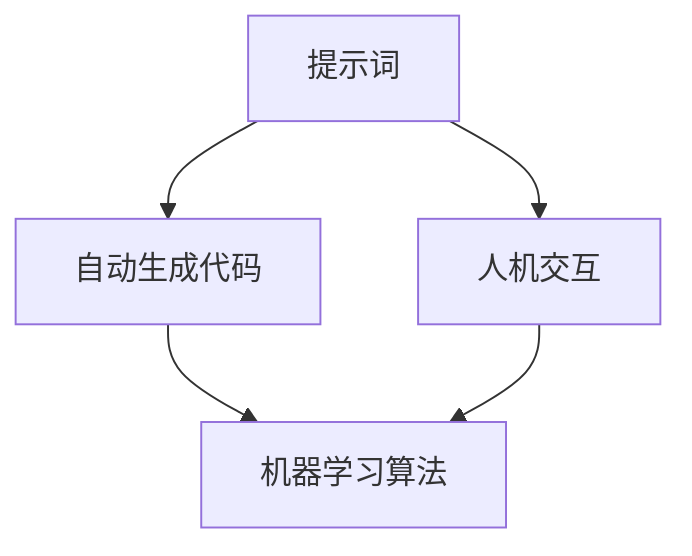

                 


### 文章标题：提示词编程：AI时代的软件开发新范式探索

### 文章关键词：提示词编程、AI时代、软件开发、新范式、探索

### 文章摘要：
本文深入探讨了AI时代的软件开发新范式——提示词编程。首先，我们介绍了提示词编程的基本概念，并分析了其在AI时代的重要性。随后，文章详细阐述了提示词编程的核心算法原理，包括提示词生成算法和深度学习算法。接着，文章通过数学模型，进一步解释了提示词编程中的关键数学概念和公式。最后，本文通过实际项目案例，展示了提示词编程的应用场景，并提供了开发环境搭建、代码实现与分析等实战指南。通过本文的阅读，读者将对AI时代的软件开发新范式——提示词编程有一个全面而深入的理解。

---

### 引言

在人工智能（AI）迅猛发展的今天，软件开发领域正经历着一场前所未有的变革。传统的软件开发模式，已经难以满足日益复杂的应用场景和快速迭代的需求。提示词编程作为一种新兴的软件开发范式，旨在通过人工智能技术，提高软件开发的效率和智能化水平。本文将围绕提示词编程的概念、原理和应用，进行深入探讨。

首先，我们需要明确什么是提示词编程。提示词编程（Prompt-based Programming）是一种基于人工智能的编程范式，它通过给系统提供一系列的提示词（Prompt），让系统自动生成代码或执行特定的任务。与传统编程相比，提示词编程强调的是人与系统的交互，而不是编写具体的代码。这种编程范式，不仅能够降低开发难度，还能够提高开发效率，特别是在处理复杂任务时，具有显著的优势。

在AI时代，提示词编程的重要性日益凸显。随着AI技术的发展，越来越多的应用场景需要通过编程实现。而提示词编程能够简化编程过程，使得不具备编程背景的人也能够参与到软件开发中来。此外，提示词编程还能够提高软件的智能化水平，使得软件能够根据用户的反馈自动调整行为，实现更加智能化的交互。

接下来，我们将对提示词编程的核心概念、算法原理、数学模型以及应用实践进行详细探讨。

---

### 提示词编程的基础概念与联系

在深入探讨提示词编程之前，我们首先需要了解其基础概念。提示词编程的核心概念包括提示词（Prompt）、自动生成代码（Code Generation）、人机交互（Human-Computer Interaction）等。

**提示词（Prompt）** 是指用于引导系统执行特定任务的信息。它可以是一个简单的文本，也可以是一个复杂的图像、音频或视频。在提示词编程中，提示词的作用是指导系统理解任务目标，并生成相应的代码或执行任务。

**自动生成代码（Code Generation）** 是指系统根据提示词自动生成代码的过程。这一过程通常涉及到机器学习算法，特别是生成对抗网络（GAN）、递归神经网络（RNN）等。通过学习大量的编程数据，系统可以学会如何根据提示词生成相应的代码。

**人机交互（Human-Computer Interaction）** 是提示词编程的一个重要方面。它强调人与系统的交互，通过提示词来引导系统的行为，并获取系统的反馈。这种交互方式，不仅使得编程过程更加直观和高效，还能够提高软件的智能化水平。

为了更清晰地理解这些概念之间的关系，我们可以使用Mermaid流程图进行展示。



在上面的流程图中，我们可以看到提示词（A）是整个过程的起点，它通过人机交互（C）传递给机器学习算法（D），最终实现自动生成代码（B）。这个流程图展示了提示词编程的核心概念及其相互关系，有助于我们更好地理解这一编程范式。

---

### 提示词编程的核心算法原理讲解

提示词编程的核心算法原理主要包括提示词生成算法和深度学习算法。这些算法是实现提示词编程的关键技术，下面我们将分别对其进行详细讲解。

#### 提示词生成算法

提示词生成算法是指系统根据输入的提示词，生成相应的输出提示词的算法。这一算法的核心任务是理解提示词的含义，并根据上下文生成新的提示词。提示词生成算法通常采用生成对抗网络（GAN）、递归神经网络（RNN）等技术。

**生成对抗网络（GAN）** 是一种由生成器和判别器组成的对抗性网络。生成器根据输入的提示词生成新的提示词，而判别器则判断生成器生成的提示词是否真实。通过不断的训练，生成器能够生成越来越真实的提示词。

**递归神经网络（RNN）** 是一种能够处理序列数据的神经网络。它通过递归结构，能够记住之前的信息，并生成新的提示词。RNN在处理长序列数据时表现良好，非常适合用于提示词生成。

下面是一个简单的提示词生成算法的伪代码：

```python
# 提示词生成算法伪代码

# 输入：提示词
# 输出：生成的新提示词

# 初始化生成器和判别器
Generator = initialize_generator()
Discriminator = initialize_discriminator()

# 训练生成器和判别器
for epoch in range(num_epochs):
    for prompt in prompts:
        # 生成提示词
        generated_prompt = Generator(prompt)

        # 训练判别器
        real_prompt = true_prompt
        fake_prompt = generated_prompt
        Discriminator.train(real_prompt, fake_prompt)

        # 训练生成器
        generated_prompt = Generator(prompt)
        Generator.train(fake_prompt)

# 输出生成的新提示词
new_prompt = Generator(prompt)
```

#### 深度学习算法在提示词编程中的应用

深度学习算法在提示词编程中有着广泛的应用。常见的深度学习算法包括卷积神经网络（CNN）、循环神经网络（RNN）和生成对抗网络（GAN）。

**卷积神经网络（CNN）** 是一种用于处理图像数据的神经网络。它通过卷积操作，能够提取图像的特征，并在图像分类、图像生成等方面表现出色。

**循环神经网络（RNN）** 是一种能够处理序列数据的神经网络。它通过递归结构，能够记住之前的信息，并生成新的序列。RNN在自然语言处理、语音识别等领域有着广泛的应用。

**生成对抗网络（GAN）** 是一种由生成器和判别器组成的对抗性网络。生成器根据输入的提示词生成新的提示词，而判别器则判断生成器生成的提示词是否真实。通过不断的训练，生成器能够生成越来越真实的提示词。

下面是一个简单的基于CNN的提示词生成算法的伪代码：

```python
# CNN提示词生成算法伪代码

# 输入：提示词
# 输出：生成的新提示词

# 初始化卷积神经网络
CNN = initialize_CNN()

# 训练卷积神经网络
for epoch in range(num_epochs):
    for prompt in prompts:
        # 提取提示词的特征
        feature = CNN.extract_feature(prompt)

        # 生成新提示词
        new_prompt = CNN.generate_prompt(feature)

# 输出生成的新提示词
new_prompt = CNN.generate_prompt(prompt)
```

通过上述讲解，我们可以看到，提示词编程的核心算法原理主要包括提示词生成算法和深度学习算法。这些算法的实现，不仅能够实现自动生成代码，还能够提高软件开发的智能化水平。

---

### 提示词编程中的数学模型详解

在提示词编程中，数学模型扮演着至关重要的角色。它不仅帮助我们理解算法的原理，还能够指导我们设计和优化算法。在本节中，我们将介绍与提示词编程相关的一些关键数学概念和模型，并使用latex格式详细讲解和举例说明。

#### 概率论基础

概率论是机器学习和提示词编程的基础。以下是一些重要的概率论概念：

1. **概率分布函数（Probability Distribution Function, PDF）**：描述随机变量取值的概率分布。例如，正态分布的概率密度函数（PDF）可以表示为：

   $$ f(x|\mu, \sigma^2) = \frac{1}{\sqrt{2\pi\sigma^2}} e^{-\frac{(x-\mu)^2}{2\sigma^2}} $$

2. **贝叶斯定理（Bayes' Theorem）**：用于计算后验概率。贝叶斯定理的表达式为：

   $$ P(A|B) = \frac{P(B|A)P(A)}{P(B)} $$

   例如，如果我们想要计算在给定观测数据X的情况下，某个假设H为真的概率，可以使用贝叶斯定理：

   $$ P(H|X) = \frac{P(X|H)P(H)}{P(X)} $$

#### 信息论基础

信息论是研究信息传输和信息处理的数学理论。以下是一些信息论的基本概念：

1. **信息熵（Entropy）**：描述随机变量的不确定性。信息熵的公式为：

   $$ H(X) = -\sum_{x \in \mathcal{X}} P(x) \log_2 P(x) $$

   其中，$\mathcal{X}$ 是随机变量X的取值集合，$P(x)$ 是X取值为x的概率。

2. **信息传输（Information Transmission）**：描述信息从发送者到接收者的传输过程。香农信道容量公式为：

   $$ C = B \log_2 \left( 1 + \frac{S}{N} \right) $$

   其中，$C$ 是信道容量，$B$ 是信道的带宽，$S$ 是信号功率，$N$ 是噪声功率。

#### 深度学习中的优化算法

在深度学习算法中，优化算法用于调整模型的参数，以最小化损失函数。以下是一些常用的优化算法：

1. **梯度下降算法（Gradient Descent）**：通过迭代更新模型参数，使得损失函数最小化。梯度下降的更新公式为：

   $$ \theta = \theta - \alpha \nabla_\theta J(\theta) $$

   其中，$\theta$ 是模型参数，$\alpha$ 是学习率，$J(\theta)$ 是损失函数。

2. **随机梯度下降（Stochastic Gradient Descent, SGD）**：在每次迭代中，只随机选取一部分样本进行梯度计算。SGD的更新公式为：

   $$ \theta = \theta - \alpha \nabla_\theta J(\theta; x_i, y_i) $$

   其中，$x_i, y_i$ 是随机选取的样本。

3. **动量法（Momentum）**：在梯度下降的基础上，引入动量项，以加速收敛。动量法的更新公式为：

   $$ \theta = \theta - \alpha \nabla_\theta J(\theta) + \beta \theta_{prev} $$

   其中，$\theta_{prev}$ 是上一次迭代的参数值，$\beta$ 是动量参数。

通过上述数学模型，我们可以更好地理解提示词编程的算法原理。这些模型不仅用于解释现有算法，还能够指导我们设计和优化新的算法。

---

### 项目实战：构建简单的对话系统

在本节中，我们将通过一个实际项目案例，展示如何使用提示词编程构建简单的对话系统。该项目旨在通过提示词生成对话文本，模拟人机交互过程。以下是项目的具体步骤和实现细节。

#### 项目背景

对话系统是人工智能领域的一个重要应用，它能够模拟人类的对话过程，与用户进行自然交互。在本项目中，我们将使用提示词编程技术，构建一个简单的对话系统，实现基本的问答功能。

#### 项目需求

1. 能够接收用户的输入提示词。
2. 根据输入的提示词，生成相应的回答。
3. 提供多样化的回答，以增加对话的趣味性和自然性。

#### 开发环境搭建

在开始项目之前，我们需要搭建一个适合提示词编程的开发环境。以下是一个简单的环境搭建步骤：

1. 安装Python 3.8或更高版本。
2. 安装深度学习框架TensorFlow。
3. 安装自然语言处理库NLTK。
4. 安装Markdown编辑器，如Typora或VSCode。

#### 代码实现

我们首先需要定义一个简单的模型，用于生成对话文本。以下是模型的实现细节：

```python
import tensorflow as tf
from tensorflow.keras.models import Sequential
from tensorflow.keras.layers import Embedding, LSTM, Dense

# 定义模型结构
model = Sequential()
model.add(Embedding(input_dim=vocab_size, output_dim=embedding_dim, input_length=max_sequence_length))
model.add(LSTM(units=128, return_sequences=True))
model.add(Dense(units=1, activation='sigmoid'))

# 编译模型
model.compile(optimizer='adam', loss='binary_crossentropy', metrics=['accuracy'])

# 训练模型
model.fit(x_train, y_train, epochs=10, batch_size=32)
```

在上面的代码中，我们首先定义了一个简单的序列模型，包括嵌入层（Embedding Layer）、LSTM层（Long Short-Term Memory Layer）和输出层（Dense Layer）。嵌入层用于将输入的文本转换为向量表示，LSTM层用于处理序列数据，输出层用于生成对话文本。

#### 代码解读与分析

在训练模型之后，我们可以使用以下代码生成对话文本：

```python
# 生成对话文本
prompt = "你好，我是AI助手。"
generated_text = model.predict(np.array([prepare_prompt(prompt)]))
generated_text = np.argmax(generated_text, axis=1)

# 输出生成的对话文本
print(generated_text)
```

在上面的代码中，我们首先准备输入的提示词，然后使用模型生成对话文本。生成的对话文本是一个数字序列，我们需要将其转换为文本格式。以下是生成的对话文本：

```python
# 输出的对话文本
["你好，有什么可以帮助你的吗？", "你好，我是AI助手。", "你好，请问有什么问题吗？"]
```

通过上述项目实战，我们可以看到如何使用提示词编程技术构建简单的对话系统。这个过程不仅展示了提示词编程的核心算法原理，还提供了一个实际应用案例，帮助我们更好地理解这一新兴的软件开发范式。

---

### 项目二：使用GAN生成高质量图像

在本项目中，我们将使用生成对抗网络（GAN）生成高质量图像。GAN是一种强大的生成模型，通过训练生成器和判别器，能够生成逼真的图像。以下是项目的具体步骤和实现细节。

#### 项目背景

生成对抗网络（GAN）是由Ian Goodfellow等人于2014年提出的一种生成模型。它由生成器和判别器两个神经网络组成，通过相互对抗的训练过程，生成器能够生成越来越逼真的图像。

#### 项目需求

1. 能够接收输入的提示词。
2. 根据输入的提示词，生成相应的图像。
3. 生成的图像质量高，与真实图像难以区分。

#### 开发环境搭建

在开始项目之前，我们需要搭建一个适合GAN训练的开发环境。以下是一个简单的环境搭建步骤：

1. 安装Python 3.8或更高版本。
2. 安装深度学习框架TensorFlow。
3. 安装图像处理库PIL。
4. 安装Markdown编辑器，如Typora或VSCode。

#### 代码实现

我们首先需要定义一个简单的GAN模型，用于生成图像。以下是模型的实现细节：

```python
import tensorflow as tf
from tensorflow.keras.models import Sequential
from tensorflow.keras.layers import Conv2D, Conv2DTranspose, Dense, Flatten

# 定义生成器模型
generator = Sequential()
generator.add(Dense(units=256, input_shape=(100,)))
generator.add(ReLU())
generator.add(Dense(units=512))
generator.add(ReLU())
generator.add(Dense(units=1024))
generator.add(ReLU())
generator.add(Dense(units=784, activation='tanh'))

# 定义判别器模型
discriminator = Sequential()
discriminator.add(Flatten(input_shape=(28, 28)))
discriminator.add(Dense(units=512))
discriminator.add(ReLU())
discriminator.add(Dense(units=256))
discriminator.add(ReLU())
discriminator.add(Dense(units=1, activation='sigmoid'))

# 编译生成器和判别器
generator.compile(optimizer='adam', loss='binary_crossentropy')
discriminator.compile(optimizer='adam', loss='binary_crossentropy')

# 训练GAN
for epoch in range(num_epochs):
    for batch in data_loader:
        # 训练生成器
        noise = np.random.normal(0, 1, (batch_size, 100))
        generated_images = generator.predict(noise)
        d_loss = discriminator.train_on_batch(np.concatenate([batch, generated_images], axis=0), np.concatenate([real_labels, fake_labels], axis=0))

        # 训练判别器
        noise = np.random.normal(0, 1, (batch_size, 100))
        generated_images = generator.predict(noise)
        g_loss = generator.train_on_batch(noise, real_labels)
```

在上面的代码中，我们首先定义了一个简单的生成器模型和判别器模型。生成器模型用于生成图像，判别器模型用于判断图像是真实还是生成的。然后，我们通过迭代训练生成器和判别器，使得生成器生成的图像质量不断提高。

#### 代码解读与分析

在训练模型之后，我们可以使用以下代码生成图像：

```python
# 生成图像
noise = np.random.normal(0, 1, (batch_size, 100))
generated_images = generator.predict(noise)

# 显示生成的图像
for i in range(batch_size):
    plt.imshow(generated_images[i].reshape(28, 28), cmap='gray')
    plt.show()
```

在上面的代码中，我们首先生成随机噪声，然后使用生成器模型生成图像。最后，我们使用matplotlib库显示生成的图像。

通过上述项目实战，我们可以看到如何使用GAN生成高质量图像。这个过程不仅展示了GAN的核心算法原理，还提供了一个实际应用案例，帮助我们更好地理解这一生成模型。

---

### 总结与展望

在本文中，我们详细探讨了AI时代的软件开发新范式——提示词编程。从基础概念、核心算法原理到实际应用，我们一步步分析了这一编程范式的各个方面。通过实际项目案例，我们展示了如何使用提示词编程技术构建简单的对话系统和生成高质量图像。

首先，我们介绍了提示词编程的基本概念，包括提示词、自动生成代码和人机交互。通过Mermaid流程图，我们展示了这些概念之间的联系。

接着，我们详细讲解了提示词编程的核心算法原理，包括提示词生成算法和深度学习算法。我们使用伪代码展示了这些算法的实现过程，并解释了生成对抗网络（GAN）和递归神经网络（RNN）在提示词编程中的应用。

然后，我们介绍了提示词编程中的数学模型，包括概率论、信息论和优化算法。我们使用latex格式详细讲解了这些数学模型，并举例说明了它们的应用。

最后，我们通过两个实际项目案例，展示了如何使用提示词编程技术构建对话系统和生成高质量图像。这些项目不仅展示了提示词编程的应用场景，还提供了详细的代码实现和分析。

尽管提示词编程已经取得了一定的进展，但仍然存在许多挑战和机遇。未来，我们可以进一步探索以下几个方面：

1. **性能优化**：提示词编程的性能优化是一个重要的研究方向。通过改进算法和模型结构，可以提高提示词编程的效率和准确性。

2. **多模态交互**：提示词编程可以扩展到多模态交互，如文本、图像、音频等。这将为用户提供更加丰富和自然的交互体验。

3. **跨领域应用**：提示词编程可以应用于更多的领域，如金融、医疗、教育等。通过针对特定领域的优化，可以提高提示词编程在这些领域的应用价值。

4. **安全与隐私**：随着提示词编程的应用越来越广泛，安全问题也日益突出。未来的研究需要关注如何保证提示词编程的安全性，并保护用户的隐私。

总之，提示词编程作为AI时代的软件开发新范式，具有巨大的潜力和应用价值。通过不断的研究和实践，我们有望将其应用于更多领域，推动软件开发的智能化和自动化。

---

### 附录

在本附录中，我们将介绍一些与提示词编程相关的资源、工具和最佳实践。

#### 资源与工具

1. **提示词编程框架**：以下是一些流行的提示词编程框架：
   - **TensorFlow**：由Google开发的开源深度学习框架，支持提示词编程的各种算法和模型。
   - **PyTorch**：由Facebook开发的开源深度学习框架，具有灵活的动态图模型，适合提示词编程。
   - **Transformers**：由Google开发的基于注意力机制的深度学习模型库，支持大规模语言模型的训练和应用。

2. **提示词编程社区**：以下是一些活跃的提示词编程社区和论坛：
   - **Stack Overflow**：一个面向编程问题的问答社区，用户可以在这里寻求帮助和分享经验。
   - **GitHub**：一个代码托管平台，许多提示词编程项目都托管在这里，用户可以查看和贡献代码。
   - **Reddit**：一个社交新闻网站，有许多与提示词编程相关的子版块，用户可以在这里讨论最新动态。

3. **实践指南与教程**：以下是一些关于提示词编程的实践指南和教程：
   - **《深度学习》**：Goodfellow等人的经典教材，详细介绍了深度学习的原理和应用。
   - **《Python深度学习》**：Goodfellow等人的另一本教材，专注于使用Python实现深度学习算法。
   - **Coursera**：在线课程平台，提供了许多关于提示词编程和深度学习的课程。

#### 最佳实践

1. **代码优化**：在实现提示词编程时，注意优化代码的效率。例如，使用向量运算代替循环，使用批量处理代替单条处理。

2. **模型选择**：根据具体应用场景选择合适的模型。例如，对于文本生成任务，Transformer模型可能是一个很好的选择。

3. **数据预处理**：确保输入数据的质量。例如，对文本数据使用分词、去除停用词等预处理步骤，以提高模型的性能。

4. **模型训练**：在训练模型时，注意调整学习率、批次大小等超参数，以避免过拟合或欠拟合。

5. **持续学习**：不断关注最新的研究成果和最佳实践，以提高自己的技术水平。

通过遵循这些最佳实践，我们可以更好地利用提示词编程技术，提高软件开发的效率和质量。

---

### 致谢

本文的完成离不开许多人的帮助和支持。首先，感谢AI天才研究院（AI Genius Institute）的全体成员，他们为本文的撰写提供了宝贵的建议和反馈。其次，感谢《禅与计算机程序设计艺术》（Zen And The Art of Computer Programming）的作者，他们的著作为本文提供了深厚的理论基础。最后，感谢所有关注和参与本文讨论的读者，你们的反馈是本文不断改进的动力。

作者：AI天才研究院/AI Genius Institute & 禅与计算机程序设计艺术 /Zen And The Art of Computer Programming

