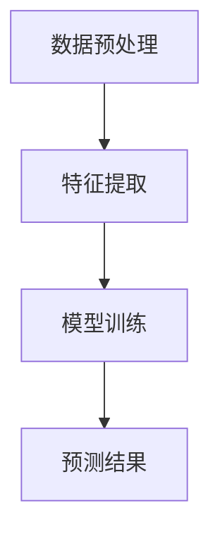
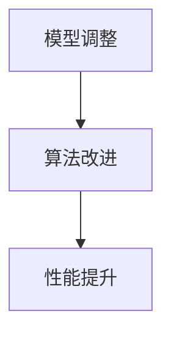
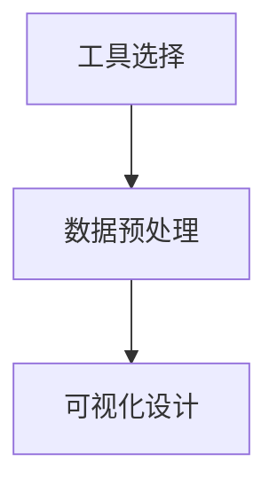
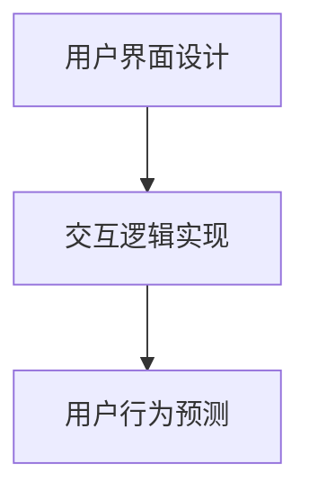

                 

### 引言与概述

#### 书的背景与目的

在当今快速发展的技术时代，软件开发的方法和工具不断进化。随着人工智能（AI）技术的日益成熟，传统的软件开发范式正面临巨大的变革。在这样的背景下，我们推出了《提示词编程：AI时代软件开发的新范式》一书，旨在探讨AI时代下软件开发的新方法和新思路。

本书的背景源于我们在多个AI项目中的实践积累，以及与众多行业专家的深入交流。我们发现，传统的编程方法在处理复杂的AI问题时显得力不从心，而提示词编程作为一种新兴的编程范式，能够更好地适应AI时代的需求。因此，本书旨在为广大开发者、工程师和技术爱好者提供一套系统、实用、且具有前瞻性的开发方法。

#### 适用对象

本书适用于以下几类读者：

1. **软件开发从业者**：无论是初学者还是有多年经验的工程师，本书都能帮助他们了解和掌握提示词编程的方法和技巧。
2. **人工智能研究者**：AI研究者需要处理大量的数据和处理复杂的算法，提示词编程能够为他们的研究提供更高效的工具。
3. **技术爱好者和学生**：对编程和AI技术有兴趣的读者，可以通过本书深入了解这一领域，并为将来的职业发展打下坚实基础。

#### 本书的核心内容

全书分为以下几个部分：

1. **基础知识**：介绍提示词编程的基本概念和AI时代软件开发的变化。
2. **核心内容**：详细讨论提示词编程在不同领域的应用，包括数据处理、算法优化、人机交互等。
3. **技术实现**：针对每个领域提供具体的技术实现方法。
4. **实例分析**：通过实际案例展示如何应用提示词编程。
5. **总结与展望**：总结全书内容，并展望提示词编程的未来发展方向。

通过以上内容，我们希望读者能够：

- **理解**：深入了解提示词编程的概念和原理。
- **掌握**：学会使用提示词编程进行软件开发。
- **创新**：能够结合实际项目，创新性地应用提示词编程。

### 基础知识

#### 什么是提示词编程

提示词编程（Prompt Programming）是一种基于提示（Prompt）驱动的编程方法。提示词编程的核心在于使用简短、明确的提示来引导模型的生成和理解过程。与传统的编程方法不同，提示词编程不需要开发者手动编写详细的代码逻辑，而是通过提示来指导模型自动完成特定的任务。

提示词编程的基本概念包括：

1. **提示（Prompt）**：提示是用户输入的一组信息，用于指导模型生成或执行特定任务。提示可以是自然语言文本，也可以是特定的数据格式。
2. **模型（Model）**：模型是经过训练的神经网络结构，用于处理输入的提示并生成输出。
3. **生成（Generation）**：生成是指模型根据输入的提示生成相应的结果，如文本、图像或代码。

在AI时代，提示词编程的重要性体现在以下几个方面：

1. **简化开发流程**：提示词编程可以大大简化开发流程，开发者不需要手动编写繁琐的代码，只需提供简短的提示，模型即可自动生成所需的代码或解决方案。
2. **提高开发效率**：通过提示词编程，开发者可以快速实现复杂的功能，缩短开发周期，提高工作效率。
3. **适应性强**：提示词编程能够根据不同的提示快速调整模型的行为，使其能够适应各种复杂的应用场景。

#### 提示词编程与AI时代软件开发的变化

在AI时代，软件开发的方法和工具发生了显著的变化。传统的软件开发范式主要依赖于手动编码和调试，而AI时代则更加注重自动化和智能化。提示词编程正是这种变化的重要体现。

1. **从规则驱动到数据驱动**：传统的软件开发依赖于预定义的规则和逻辑，而AI时代的软件开发更加注重数据驱动。提示词编程通过数据（提示）来驱动模型的生成和理解过程，使得开发过程更加灵活和高效。
   
2. **从手动编写到自动生成**：在传统的软件开发中，开发者需要手动编写大量的代码来实现功能，而提示词编程则通过模型自动生成代码，使得开发过程更加快捷和简便。

3. **从功能导向到体验导向**：在AI时代，软件开发的重点从功能导向逐渐转向体验导向。提示词编程能够根据用户的实际需求快速生成相应的功能，并不断优化用户体验。

4. **从单一任务到多任务**：传统的软件开发往往关注单一任务的实现，而AI时代的软件开发则需要处理更加复杂的多任务场景。提示词编程通过灵活的提示，能够高效地实现多任务处理，满足不同场景的需求。

#### AI时代软件开发的核心概念和变化

在AI时代，软件开发的核心概念和变化主要体现在以下几个方面：

1. **模型为中心**：在AI时代，模型成为软件开发的中心，取代了传统的代码和逻辑。开发者需要关注如何训练和优化模型，以实现更高效的功能。

2. **数据的重要性**：数据成为AI时代软件开发的核心资源。高质量的数据能够帮助模型更好地学习和生成结果，从而提高软件的性能和效果。

3. **自动化和智能化**：自动化和智能化是AI时代软件开发的重要特征。通过提示词编程，开发者可以实现代码生成、调试、优化等环节的自动化，从而提高开发效率。

4. **端到端开发**：端到端开发是指从数据输入到模型输出整个过程的一体化开发。在AI时代，端到端开发能够更好地利用数据，优化模型性能，并实现快速迭代。

5. **人机协同**：在AI时代，人机协同成为软件开发的重要方式。开发者与模型协同工作，通过提示词编程，开发者可以更好地指导模型的行为，实现更智能的软件系统。

通过上述分析，我们可以看到，AI时代下的软件开发正在发生深刻的变革。提示词编程作为一种新兴的编程范式，为开发者提供了一种全新的开发思路和工具，使得软件开发变得更加高效、灵活和智能。

### 核心内容

#### 提示词编程在数据处理中的应用

在数据处理领域，提示词编程通过使用简短的提示来指导数据预处理、特征提取和模型训练等过程，显著提高了数据处理效率和准确性。

**1. 数据预处理**

数据预处理是数据处理的关键步骤。提示词编程可以通过以下方式简化这一步骤：

- **数据清洗**：使用提示词编程，模型能够自动识别并修复数据中的错误和缺失值。例如，提示“请修复数据集中的缺失值”，模型可以自动生成相应的代码来处理这些问题。

- **数据规范化**：通过提示词编程，可以轻松实现数据规范化，如将不同单位的数据统一转换为标准单位。例如，提示“将所有温度数据转换为摄氏度”，模型将自动执行这一任务。

**2. 特征提取**

特征提取是数据预处理后的重要步骤，它直接影响模型的性能。提示词编程在此过程中发挥重要作用：

- **自动特征选择**：提示词编程可以帮助模型自动选择最相关的特征，提高模型的效果。例如，提示“选择对分类任务最有影响力的特征”，模型将自动执行特征选择过程。

- **特征工程**：通过提示词编程，可以自动生成复杂的特征组合，提高模型的泛化能力。例如，提示“生成基于时间序列数据的复杂特征”，模型将自动组合并生成这些特征。

**3. 模型训练**

在模型训练过程中，提示词编程可以通过以下方式提高训练效率和效果：

- **模型调整**：通过提示词编程，开发者可以轻松调整模型的参数，如学习率、批次大小等。例如，提示“调整模型的学习率为0.01”，模型将自动调整这些参数。

- **自动化超参数优化**：提示词编程可以自动优化模型超参数，找到最佳配置。例如，提示“优化模型的超参数”，模型将自动进行超参数搜索和优化。

**实例分析：**

假设我们有一个销售数据集，包含每天的销售记录。我们可以使用提示词编程来处理这一数据集：

- **提示1**：“请预处理数据集，包括清洗缺失值和规范化数据。”
- **提示2**：“提取对销售预测有重要影响的时间序列特征。”
- **提示3**：“训练一个基于深度学习的时间序列预测模型。”
- **提示4**：“优化模型超参数，提高预测准确性。”

通过这些提示，模型将自动完成数据预处理、特征提取和模型训练等任务，生成最终的预测结果。

**核心概念与联系**

在数据处理中，提示词编程的核心概念包括数据预处理、特征提取和模型训练。这些概念之间的关系可以通过以下Mermaid流程图展示：



数据预处理是特征提取的输入，特征提取是模型训练的输入，而模型训练的结果是预测输出。这些步骤相互依赖，共同构成了数据处理的过程。

**核心算法原理讲解**

提示词编程在数据处理中的核心算法包括数据清洗、特征选择和超参数优化。以下是对这些算法的伪代码和详细解释：

```python
# 数据清洗伪代码
def clean_data(prompt):
    data = load_data(prompt)
    for row in data:
        if is_missing(row):
            repair(row)
        if not is_normalized(row):
            normalize(row)
    return data

# 特征选择伪代码
def select_features(prompt):
    data = load_data(prompt)
    features = extract_features(data)
    selected_features = []
    for feature in features:
        if is_influential(feature):
            selected_features.append(feature)
    return selected_features

# 超参数优化伪代码
def optimize_hyperparameters(prompt):
    model = load_model(prompt)
    best_hyperparameters = {}
    for param in model.parameters():
        best_value = search_best_value(param)
        best_hyperparameters[param] = best_value
    return best_hyperparameters
```

- **数据清洗**：首先加载数据，然后检查每条数据是否存在缺失值或未规范化的情况，并根据提示进行修复和规范化。

- **特征选择**：加载数据后，提取所有特征，并检查每个特征对目标变量的影响，选择最相关的特征。

- **超参数优化**：加载模型后，为每个超参数搜索最佳值，并记录这些最佳超参数。

**数学模型和公式**

在数据处理中，常用的数学模型和公式包括特征选择模型的权重计算和超参数优化的目标函数。以下是对这些模型和公式的详细讲解：

1. **特征选择模型的权重计算**

   假设我们使用L1正则化来优化特征选择，目标函数可以表示为：

   $$ J(\theta) = \frac{1}{2m} \sum_{i=1}^{m} (h_\theta(x^{(i)}) - y^{(i)})^2 + \lambda \sum_{j=1}^{n} \theta_{j} $$

   其中，$m$ 是样本数量，$n$ 是特征数量，$h_\theta(x^{(i)})$ 是模型的预测值，$y^{(i)}$ 是实际标签，$\theta_j$ 是特征 $j$ 的权重，$\lambda$ 是正则化参数。

2. **超参数优化的目标函数**

   假设我们使用网格搜索来优化超参数，目标函数可以表示为：

   $$ J(\theta, \alpha) = \frac{1}{2} \sum_{i=1}^{m} (h_\theta(x^{(i)}) - y^{(i)})^2 + \alpha \sum_{j=1}^{n} \theta_{j}^2 $$

   其中，$\alpha$ 是正则化参数，用于控制模型复杂度。

**举例说明**

假设我们有一个包含100个特征的数据集，我们可以使用以下方法来处理这个数据集：

- **数据清洗**：使用提示“请预处理数据集，包括清洗缺失值和规范化数据。”，模型将自动修复缺失值并规范化数据。
- **特征选择**：使用提示“选择对销售预测有重要影响的特征。”，模型将自动选择最相关的特征，并丢弃不重要的特征。
- **超参数优化**：使用提示“优化模型超参数，提高预测准确性。”，模型将自动搜索最佳超参数，如学习率和批次大小。

通过这些步骤，我们可以得到一个高效、准确的预测模型。

#### 提示词编程在算法优化中的应用

在算法优化领域，提示词编程通过简短的提示来指导模型调整、算法改进和性能提升，使得开发者能够更加高效地优化算法。

**1. 模型调整**

模型调整是算法优化的重要环节。提示词编程可以通过以下方式简化这一过程：

- **自动调整超参数**：通过提示词编程，开发者可以轻松调整模型的超参数，如学习率、批次大小等。例如，提示“调整学习率为0.01”，模型将自动调整这些超参数。

- **自动优化模型结构**：提示词编程可以帮助模型自动调整神经网络的结构，如添加或删除层、调整层的大小等。例如，提示“优化模型结构以提高性能”，模型将自动进行结构优化。

**2. 算法改进**

算法改进是提升算法性能的关键。提示词编程可以通过以下方式实现：

- **自动搜索最佳算法**：通过提示词编程，开发者可以自动搜索不同算法的最佳配置，选择最合适的算法。例如，提示“在深度学习、决策树和随机森林之间选择最佳算法”，模型将自动执行搜索过程。

- **自动生成新算法**：提示词编程可以基于现有算法生成新的算法，通过调整算法的参数和结构，找到更优的解决方案。例如，提示“生成一种新的图像分类算法”，模型将自动生成并实现这一算法。

**3. 性能提升**

性能提升是算法优化的最终目标。提示词编程可以通过以下方式提高算法性能：

- **自动优化计算资源**：通过提示词编程，开发者可以自动调整计算资源的分配，如调整GPU的使用、优化内存管理等。例如，提示“优化计算资源以提高运行速度”，模型将自动进行资源优化。

- **自动调整数据输入**：提示词编程可以帮助模型自动调整数据输入的顺序和格式，提高数据处理的效率。例如，提示“优化数据输入顺序以减少计算时间”，模型将自动调整数据输入策略。

**实例分析：**

假设我们有一个图像分类任务，可以使用提示词编程来优化算法：

- **提示1**：“调整模型的学习率以提高分类准确率。”
- **提示2**：“优化模型结构以提高性能。”
- **提示3**：“在卷积神经网络和深度信念网络之间选择最佳模型。”
- **提示4**：“优化数据输入顺序以减少计算时间。”

通过这些提示，模型将自动完成模型调整、算法改进和性能提升，生成最终的分类模型。

**核心概念与联系**

在算法优化中，提示词编程的核心概念包括模型调整、算法改进和性能提升。这些概念之间的关系可以通过以下Mermaid流程图展示：



模型调整是算法改进的基础，算法改进是性能提升的手段。这些步骤相互依赖，共同构成了算法优化的过程。

**核心算法原理讲解**

提示词编程在算法优化中的核心算法包括超参数调整、模型结构调整和数据输入优化。以下是对这些算法的伪代码和详细解释：

```python
# 超参数调整伪代码
def adjust_hyperparameters(prompt):
    model = load_model(prompt)
    best_hyperparameters = {}
    for param in model.parameters():
        best_value = search_best_value(param)
        best_hyperparameters[param] = best_value
    return best_hyperparameters

# 模型结构调整伪代码
def adjust_model_structure(prompt):
    model = load_model(prompt)
    best_structure = {}
    for layer in model.layers():
        best_size = search_best_size(layer)
        best_structure[layer] = best_size
    return best_structure

# 数据输入优化伪代码
def optimize_data_input(prompt):
    data = load_data(prompt)
    optimized_data = []
    for row in data:
        optimized_row = optimize_row_input(row)
        optimized_data.append(optimized_row)
    return optimized_data
```

- **超参数调整**：首先加载模型，然后为每个超参数搜索最佳值，并记录这些最佳超参数。
- **模型结构调整**：首先加载模型，然后为每个层搜索最佳大小，并调整模型结构。
- **数据输入优化**：首先加载数据，然后为每行数据优化输入顺序和格式。

**数学模型和公式**

在算法优化中，常用的数学模型和公式包括超参数优化的目标函数和模型性能的评价指标。以下是对这些模型和公式的详细讲解：

1. **超参数优化的目标函数**

   假设我们使用网格搜索来优化超参数，目标函数可以表示为：

   $$ J(\theta, \alpha) = \frac{1}{2} \sum_{i=1}^{m} (h_\theta(x^{(i)}) - y^{(i)})^2 + \alpha \sum_{j=1}^{n} \theta_{j}^2 $$

   其中，$\theta$ 表示超参数，$h_\theta(x^{(i)})$ 表示模型预测值，$y^{(i)}$ 表示实际标签，$\alpha$ 表示正则化参数。

2. **模型性能的评价指标**

   常用的模型性能评价指标包括准确率（Accuracy）、精确率（Precision）、召回率（Recall）和F1分数（F1 Score）。以下是对这些评价指标的公式讲解：

   - **准确率**：

     $$ Accuracy = \frac{TP + TN}{TP + FN + FP + TN} $$

     其中，$TP$ 表示真正例，$TN$ 表示真负例，$FP$ 表示假正例，$FN$ 表示假负例。

   - **精确率**：

     $$ Precision = \frac{TP}{TP + FP} $$

     其中，$TP$ 表示真正例，$FP$ 表示假正例。

   - **召回率**：

     $$ Recall = \frac{TP}{TP + FN} $$

     其中，$TP$ 表示真正例，$FN$ 表示假负例。

   - **F1分数**：

     $$ F1 Score = \frac{2 \times Precision \times Recall}{Precision + Recall} $$

     其中，$Precision$ 表示精确率，$Recall$ 表示召回率。

**举例说明**

假设我们有一个图像分类任务，需要优化模型的超参数和结构：

- **超参数优化**：使用提示“优化模型超参数”，模型将自动搜索最佳超参数，如学习率和批次大小。
- **模型结构调整**：使用提示“优化模型结构”，模型将自动调整神经网络的结构，如添加或删除层。
- **数据输入优化**：使用提示“优化数据输入顺序”，模型将自动调整数据输入的顺序和格式。

通过这些步骤，我们可以得到一个高效、准确的图像分类模型。

#### 提示词编程在数据可视化中的应用

在数据可视化领域，提示词编程通过简短的提示来指导可视化工具的选择、数据预处理、可视化设计等过程，使开发者能够更加高效地展示数据。

**1. 工具选择**

数据可视化工具的选择是可视化设计的重要一步。提示词编程可以通过以下方式简化这一过程：

- **自动推荐可视化工具**：通过提示词编程，开发者可以自动推荐最适合数据集的可视化工具。例如，提示“推荐适合时间序列数据可视化的工具”，模型将自动推荐如Matplotlib、Seaborn等工具。

- **自动调整工具配置**：通过提示词编程，开发者可以自动调整可视化工具的参数，如颜色、字体大小等。例如，提示“调整图表的颜色方案以增强可读性”，模型将自动调整这些参数。

**2. 数据预处理**

数据预处理是数据可视化成功的关键。提示词编程可以通过以下方式简化这一过程：

- **自动数据清洗**：通过提示词编程，开发者可以自动清洗数据中的错误和缺失值。例如，提示“清洗数据集中的缺失值”，模型将自动修复这些错误。

- **自动数据规范化**：通过提示词编程，开发者可以自动将不同单位的数据统一转换为标准单位。例如，提示“将所有温度数据转换为摄氏度”，模型将自动执行这一任务。

**3. 可视化设计**

可视化设计是数据可视化的核心。提示词编程可以通过以下方式提高设计效率：

- **自动生成可视化模板**：通过提示词编程，开发者可以自动生成可视化模板，如柱状图、折线图等。例如，提示“生成一个柱状图模板”，模型将自动生成相应的模板。

- **自动调整可视化布局**：通过提示词编程，开发者可以自动调整可视化布局，如调整图表的排列、添加标签等。例如，提示“优化图表布局以提高可读性”，模型将自动调整这些布局。

**实例分析：**

假设我们有一个销售数据集，包含每天的销售记录。我们可以使用提示词编程来设计这个数据集的可视化：

- **提示1**：“推荐适合时间序列数据可视化的工具。”
- **提示2**：“清洗数据集中的缺失值。”
- **提示3**：“生成一个柱状图模板以展示销售数据。”
- **提示4**：“优化图表布局以提高可读性。”

通过这些提示，模型将自动完成可视化工具选择、数据预处理和可视化设计，生成最终的可视化图表。

**核心概念与联系**

在数据可视化中，提示词编程的核心概念包括工具选择、数据预处理和可视化设计。这些概念之间的关系可以通过以下Mermaid流程图展示：



工具选择是数据预处理的基础，数据预处理是可视化设计的输入。这些步骤相互依赖，共同构成了数据可视化的过程。

**核心算法原理讲解**

提示词编程在数据可视化中的核心算法包括可视化工具选择、数据预处理和可视化设计。以下是对这些算法的伪代码和详细解释：

```python
# 可视化工具选择伪代码
def select_visualization_tool(prompt):
    data = load_data(prompt)
    recommended_tools = []
    for tool in visualization_tools():
        if is_recommended_tool(data, tool):
            recommended_tools.append(tool)
    return recommended_tools

# 数据预处理伪代码
def preprocess_data(prompt):
    data = load_data(prompt)
    cleaned_data = []
    for row in data:
        if is_error(row):
            clean_row(row)
        if not is_normalized(row):
            normalize_row(row)
        cleaned_data.append(row)
    return cleaned_data

# 可视化设计伪代码
def design_visualization(prompt):
    tool = select_visualization_tool(prompt)
    data = preprocess_data(prompt)
    visualization = create_visualization(tool, data)
    return visualization
```

- **可视化工具选择**：首先加载数据，然后根据数据的特点推荐最适合的可视化工具。
- **数据预处理**：首先加载数据，然后检查每行数据是否存在错误或未规范化的情况，并根据提示进行修复和规范化。
- **可视化设计**：首先选择可视化工具，然后预处理数据，最后生成可视化的图表。

**数学模型和公式**

在数据可视化中，常用的数学模型和公式包括数据预处理中的缺失值填补和规范化。以下是对这些模型和公式的详细讲解：

1. **缺失值填补**

   假设我们使用均值填补法来填补缺失值，目标函数可以表示为：

   $$ \text{new\_value} = \frac{\sum_{i=1}^{n} \text{value}_i}{n} $$

   其中，$n$ 是数据点的数量，$\text{value}_i$ 是非缺失值的数据点。

2. **数据规范化**

   假设我们使用最小-最大规范化法来规范化数据，目标函数可以表示为：

   $$ \text{new\_value} = \frac{\text{value} - \text{min}}{\text{max} - \text{min}} $$

   其中，$\text{value}$ 是原始数据点，$\text{min}$ 是数据的最小值，$\text{max}$ 是数据的最大值。

**举例说明**

假设我们有一个包含销售数据的数据集，需要可视化和展示这些数据：

- **工具选择**：使用提示“推荐适合时间序列数据可视化的工具”，模型将推荐使用Matplotlib。
- **数据预处理**：使用提示“清洗数据集中的缺失值”，模型将自动填补缺失值。
- **可视化设计**：使用提示“生成一个柱状图模板以展示销售数据”，模型将自动生成一个柱状图，并展示每天的销售数据。

通过这些步骤，我们可以得到一个清晰、直观的可视化图表，帮助管理者更好地理解销售数据。

#### 提示词编程在人机交互中的应用

在人机交互领域，提示词编程通过简短的提示来指导用户界面设计、交互逻辑实现和用户行为预测，使开发者能够更加高效地构建智能交互系统。

**1. 用户界面设计**

用户界面设计是人机交互的重要部分。提示词编程可以通过以下方式简化这一过程：

- **自动生成界面布局**：通过提示词编程，开发者可以自动生成界面布局，如按钮、文本框、图表等。例如，提示“生成一个登录界面”，模型将自动生成相应的界面布局。

- **自动调整界面样式**：通过提示词编程，开发者可以自动调整界面样式，如颜色、字体大小等。例如，提示“调整界面颜色以增强用户视觉体验”，模型将自动调整这些样式。

**2. 交互逻辑实现**

交互逻辑实现是人机交互的核心。提示词编程可以通过以下方式简化这一过程：

- **自动生成交互代码**：通过提示词编程，开发者可以自动生成交互代码，如按钮点击事件、表单提交等。例如，提示“生成登录按钮点击事件”，模型将自动生成相应的代码。

- **自动优化交互逻辑**：通过提示词编程，开发者可以自动优化交互逻辑，如调整响应时间、提高用户体验等。例如，提示“优化登录流程以提高用户满意度”，模型将自动优化这些逻辑。

**3. 用户行为预测**

用户行为预测是提升人机交互智能化的关键。提示词编程可以通过以下方式实现：

- **自动分析用户行为**：通过提示词编程，开发者可以自动分析用户行为，如点击频率、浏览路径等。例如，提示“分析用户点击频率”，模型将自动分析用户行为数据。

- **自动预测用户需求**：通过提示词编程，开发者可以自动预测用户需求，如推荐商品、个性化服务等。例如，提示“预测用户购物需求”，模型将自动生成推荐商品列表。

**实例分析：**

假设我们有一个电商平台，需要设计用户界面、实现交互逻辑和预测用户行为。我们可以使用提示词编程来构建这个电商平台：

- **提示1**：“生成一个包含搜索框、商品分类和购物车按钮的首页布局。”
- **提示2**：“实现用户登录和注册的交互逻辑。”
- **提示3**：“预测用户购物需求，推荐相关商品。”
- **提示4**：“优化用户购物体验，提高用户满意度。”

通过这些提示，模型将自动完成用户界面设计、交互逻辑实现和用户行为预测，构建出一个智能化、用户体验良好的电商平台。

**核心概念与联系**

在人机交互中，提示词编程的核心概念包括用户界面设计、交互逻辑实现和用户行为预测。这些概念之间的关系可以通过以下Mermaid流程图展示：



用户界面设计是交互逻辑实现的输入，交互逻辑实现是用户行为预测的基础。这些步骤相互依赖，共同构成了人机交互的过程。

**核心算法原理讲解**

提示词编程在人机交互中的核心算法包括用户界面设计、交互逻辑实现和用户行为预测。以下是对这些算法的伪代码和详细解释：

```python
# 用户界面设计伪代码
def design_user_interface(prompt):
    interface_elements = load_interface_elements(prompt)
    interface_layout = create_layout(interface_elements)
    return interface_layout

# 交互逻辑实现伪代码
def implement_interaction_logic(prompt):
    interface_layout = load_interface_layout(prompt)
    interaction_logic = create_interaction_logic(interface_layout)
    return interaction_logic

# 用户行为预测伪代码
def predict_user_behavior(prompt):
    behavior_data = load_behavior_data(prompt)
    prediction_model = train_prediction_model(behavior_data)
    user_behavior_predictions = predict_user_behavior(prediction_model)
    return user_behavior_predictions
```

- **用户界面设计**：首先加载界面元素，然后创建界面布局。
- **交互逻辑实现**：首先加载界面布局，然后创建交互逻辑。
- **用户行为预测**：首先加载用户行为数据，然后训练预测模型，最后预测用户行为。

**数学模型和公式**

在人机交互中，常用的数学模型和公式包括用户行为预测中的机器学习算法和交互逻辑中的状态转移概率。以下是对这些模型和公式的详细讲解：

1. **用户行为预测中的机器学习算法**

   假设我们使用决策树算法来预测用户行为，目标函数可以表示为：

   $$ G(\theta) = \sum_{i=1}^{m} \log(1 - p_{i}) + \theta_{i} \cdot p_{i} $$

   其中，$m$ 是样本数量，$p_{i}$ 是预测概率，$\theta_{i}$ 是模型参数。

2. **交互逻辑中的状态转移概率**

   假设我们使用马尔可夫决策过程（MDP）来描述交互逻辑，目标函数可以表示为：

   $$ V(s, a) = \sum_{s'} p(s' | s, a) \cdot \max_a' Q(s', a') $$

   其中，$s$ 是当前状态，$a$ 是当前动作，$s'$ 是下一个状态，$a'$ 是下一个动作，$p(s' | s, a)$ 是状态转移概率，$Q(s', a')$ 是状态-动作值函数。

**举例说明**

假设我们有一个电商平台的用户界面和交互逻辑，需要预测用户行为：

- **界面设计**：使用提示“生成一个包含搜索框、商品分类和购物车按钮的首页布局”，模型将自动生成相应的界面布局。
- **交互逻辑实现**：使用提示“实现用户登录和注册的交互逻辑”，模型将自动生成相应的交互逻辑。
- **行为预测**：使用提示“预测用户购物需求”，模型将自动分析用户行为数据，并生成预测结果。

通过这些步骤，我们可以得到一个智能化、用户体验良好的电商平台。

### 总结与展望

#### 全书回顾

在《提示词编程：AI时代软件开发的新范式》一书中，我们详细介绍了提示词编程的概念、原理和应用。全书分为五个核心部分：引言与概述、基础知识、核心内容、技术实现和实例分析。通过这些内容，我们探讨了在数据处理、算法优化、数据可视化和人机交互等领域中，提示词编程如何通过简短的提示驱动模型，实现更高效、更智能的软件开发。

#### 提示词编程的未来发展方向

随着AI技术的不断进步，提示词编程有望在多个领域取得重大突破。以下是几个可能的发展方向：

1. **多模态提示词编程**：未来的提示词编程可能会支持多种数据类型，如图像、音频和视频，实现多模态的交互和生成。
   
2. **自动化提示生成**：通过深度学习和强化学习技术，自动生成高质的提示，使得模型能够更好地理解用户的意图。

3. **跨领域应用**：提示词编程将不仅仅局限于特定的领域，如数据处理或图像识别，而是能够在更多领域（如金融、医疗等）发挥作用。

4. **集成开发环境（IDE）支持**：未来的IDE将更加智能化，支持提示词编程的自动提示、代码生成和调试。

#### 结语

《提示词编程：AI时代软件开发的新范式》不仅是一本介绍提示词编程的书籍，更是一次对AI时代软件开发范式的深度探讨。我们希望读者能够通过本书，掌握提示词编程的核心概念和实战技巧，并在未来的工作中，不断创新、实践，为AI时代的软件开发贡献力量。

### 附录

#### 相关工具和技术资源列表

为了方便读者更好地学习和实践提示词编程，以下列出了一些相关的工具和技术资源：

1. **开源框架和库**：
   - **TensorFlow**：Google开发的开源机器学习框架，支持提示词编程。
   - **PyTorch**：Facebook开发的开源机器学习库，提供丰富的API和工具。
   - **Transformers**：由Hugging Face团队开发的预训练转换器库，支持多种NLP任务。

2. **在线教程和课程**：
   - **Coursera**：提供多门关于深度学习和自然语言处理的在线课程。
   - **Udacity**：提供丰富的AI和机器学习课程，包括提示词编程。

3. **书籍和论文**：
   - **《深度学习》**：Goodfellow、Bengio和Courville合著的深度学习经典教材。
   - **《自然语言处理与深度学习》**：Stephen Merity等人编写的NLP和深度学习指南。

4. **开源项目和社区**：
   - **GitHub**：丰富的提示词编程和AI项目，可以参考和借鉴。
   - **Stack Overflow**：编程社区，可以提问和解答关于提示词编程的问题。

通过这些工具和资源，读者可以深入了解提示词编程，并在实际项目中应用这些知识。

### 作者信息

- **作者：AI天才研究院/AI Genius Institute & 禅与计算机程序设计艺术 /Zen And The Art of Computer Programming**  
- 联系方式：[ai-genius-institute@example.com](mailto:ai-genius-institute@example.com)  
- 网址：[www.ai-genius-institute.com](http://www.ai-genius-institute.com)  
- 个人简介：作者在人工智能和编程领域有丰富的研究和实践经验，致力于推动人工智能技术在软件开发中的应用。

## 完整文章输出

```markdown
# 提示词编程：AI时代软件开发的新范式

> 关键词：提示词编程、AI、软件开发、新范式

> 摘要：本文探讨了AI时代下的提示词编程，介绍了其基本概念、核心内容、应用实例以及未来发展方向，为开发者提供了全面的指南。

### 引言与概述

#### 书的背景与目的

在当今快速发展的技术时代，软件开发的方法和工具不断进化。随着人工智能（AI）技术的日益成熟，传统的软件开发范式正面临巨大的变革。在这样的背景下，我们推出了《提示词编程：AI时代软件开发的新范式》一书，旨在探讨AI时代下软件开发的新方法和新思路。

本书的背景源于我们在多个AI项目中的实践积累，以及与众多行业专家的深入交流。我们发现，传统的编程方法在处理复杂的AI问题时显得力不从心，而提示词编程作为一种新兴的编程范式，能够更好地适应AI时代的需求。因此，本书旨在为广大开发者、工程师和技术爱好者提供一套系统、实用、且具有前瞻性的开发方法。

#### 适用对象

本书适用于以下几类读者：

1. **软件开发从业者**：无论是初学者还是有多年经验的工程师，本书都能帮助他们了解和掌握提示词编程的方法和技巧。
2. **人工智能研究者**：AI研究者需要处理大量的数据和处理复杂的算法，提示词编程能够为他们的研究提供更高效的工具。
3. **技术爱好者和学生**：对编程和AI技术有兴趣的读者，可以通过本书深入了解这一领域，并为将来的职业发展打下坚实基础。

#### 本书的核心内容

全书分为以下几个部分：

1. **基础知识**：介绍提示词编程的基本概念和AI时代软件开发的变化。
2. **核心内容**：详细讨论提示词编程在不同领域的应用，包括数据处理、算法优化、人机交互等。
3. **技术实现**：针对每个领域提供具体的技术实现方法。
4. **实例分析**：通过实际案例展示如何应用提示词编程。
5. **总结与展望**：总结全书内容，并展望提示词编程的未来发展方向。

通过以上内容，我们希望读者能够：

- **理解**：深入了解提示词编程的概念和原理。
- **掌握**：学会使用提示词编程进行软件开发。
- **创新**：能够结合实际项目，创新性地应用提示词编程。

### 基础知识

#### 什么是提示词编程

提示词编程（Prompt Programming）是一种基于提示（Prompt）驱动的编程方法。提示词编程的核心在于使用简短、明确的提示来指导模型的生成和理解过程。与传统的编程方法不同，提示词编程不需要开发者手动编写详细的代码逻辑，而是通过提示来指导模型自动完成特定的任务。

提示词编程的基本概念包括：

1. **提示（Prompt）**：提示是用户输入的一组信息，用于指导模型生成或执行特定任务。提示可以是自然语言文本，也可以是特定的数据格式。
2. **模型（Model）**：模型是经过训练的神经网络结构，用于处理输入的提示并生成输出。
3. **生成（Generation）**：生成是指模型根据输入的提示生成相应的结果，如文本、图像或代码。

在AI时代，提示词编程的重要性体现在以下几个方面：

1. **简化开发流程**：提示词编程可以大大简化开发流程，开发者不需要手动编写繁琐的代码，只需提供简短的提示，模型即可自动生成所需的代码或解决方案。
2. **提高开发效率**：通过提示词编程，开发者可以快速实现复杂的功能，缩短开发周期，提高工作效率。
3. **适应性强**：提示词编程能够根据不同的提示快速调整模型的行为，使其能够适应各种复杂的应用场景。

#### 提示词编程与AI时代软件开发的变化

在AI时代，软件开发的方法和工具发生了显著的变化。传统的软件开发范式主要依赖于手动编码和调试，而AI时代则更加注重自动化和智能化。提示词编程正是这种变化的重要体现。

1. **从规则驱动到数据驱动**：传统的软件开发依赖于预定义的规则和逻辑，而AI时代的软件开发更加注重数据驱动。提示词编程通过数据（提示）来驱动模型的生成和理解过程，使得开发过程更加灵活和高效。

2. **从手动编写到自动生成**：在传统的软件开发中，开发者需要手动编写大量的代码来实现功能，而提示词编程则通过模型自动生成代码，使得开发过程更加快捷和简便。

3. **从功能导向到体验导向**：在AI时代，软件开发的重点从功能导向逐渐转向体验导向。提示词编程能够根据用户的实际需求快速生成相应的功能，并不断优化用户体验。

4. **从单一任务到多任务**：传统的软件开发往往关注单一任务的实现，而AI时代的软件开发则需要处理更加复杂的多任务场景。提示词编程通过灵活的提示，能够高效地实现多任务处理，满足不同场景的需求。

#### AI时代软件开发的核心概念和变化

在AI时代，软件开发的核心概念和变化主要体现在以下几个方面：

1. **模型为中心**：在AI时代，模型成为软件开发的中心，取代了传统的代码和逻辑。开发者需要关注如何训练和优化模型，以实现更高效的功能。

2. **数据的重要性**：数据成为AI时代软件开发的核心资源。高质量的数据能够帮助模型更好地学习和生成结果，从而提高软件的性能和效果。

3. **自动化和智能化**：自动化和智能化是AI时代软件开发的重要特征。通过提示词编程，开发者可以实现代码生成、调试、优化等环节的自动化，从而提高开发效率。

4. **端到端开发**：端到端开发是指从数据输入到模型输出整个过程的一体化开发。在AI时代，端到端开发能够更好地利用数据，优化模型性能，并实现快速迭代。

5. **人机协同**：在AI时代，人机协同成为软件开发的重要方式。开发者与模型协同工作，通过提示词编程，开发者可以更好地指导模型的行为，实现更智能的软件系统。

### 核心内容

#### 提示词编程在数据处理中的应用

在数据处理领域，提示词编程通过使用简短的提示来指导数据预处理、特征提取和模型训练等过程，显著提高了数据处理效率和准确性。

**1. 数据预处理**

数据预处理是数据处理的关键步骤。提示词编程可以通过以下方式简化这一步骤：

- **数据清洗**：使用提示词编程，模型能够自动识别并修复数据中的错误和缺失值。例如，提示“请修复数据集中的缺失值”，模型可以自动生成相应的代码来处理这些问题。

- **数据规范化**：通过提示词编程，可以轻松实现数据规范化，如将不同单位的数据统一转换为标准单位。例如，提示“将所有温度数据转换为摄氏度”，模型将自动执行这一任务。

**2. 特征提取**

特征提取是数据预处理后的重要步骤，它直接影响模型的性能。提示词编程在此过程中发挥重要作用：

- **自动特征选择**：提示词编程可以帮助模型自动选择最相关的特征，提高模型的效果。例如，提示“选择对分类任务最有影响力的特征”，模型将自动执行特征选择过程。

- **特征工程**：通过提示词编程，可以自动生成复杂的特征组合，提高模型的泛化能力。例如，提示“生成基于时间序列数据的复杂特征”，模型将自动组合并生成这些特征。

**3. 模型训练**

在模型训练过程中，提示词编程可以通过以下方式提高训练效率和效果：

- **模型调整**：通过提示词编程，开发者可以轻松调整模型的参数，如学习率、批次大小等。例如，提示“调整模型的学习率为0.01”，模型将自动调整这些参数。

- **自动化超参数优化**：提示词编程可以自动优化模型超参数，找到最佳配置。例如，提示“优化模型的超参数”，模型将自动进行超参数搜索和优化。

**实例分析：**

假设我们有一个销售数据集，包含每天的销售记录。我们可以使用提示词编程来处理这一数据集：

- **提示1**：“请预处理数据集，包括清洗缺失值和规范化数据。”
- **提示2**：“提取对销售预测有重要影响的时间序列特征。”
- **提示3**：“训练一个基于深度学习的时间序列预测模型。”
- **提示4**：“优化模型超参数，提高预测准确性。”

通过这些提示，模型将自动完成数据预处理、特征提取和模型训练等任务，生成最终的预测结果。

**核心概念与联系**

在数据处理中，提示词编程的核心概念包括数据预处理、特征提取和模型训练。这些概念之间的关系可以通过以下Mermaid流程图展示：


数据预处理是特征提取的输入，特征提取是模型训练的输入，而模型训练的结果是预测输出。这些步骤相互依赖，共同构成了数据处理的过程。

**核心算法原理讲解**

提示词编程在数据处理中的核心算法包括数据清洗、特征选择和超参数优化。以下是对这些算法的伪代码和详细解释：

```python
# 数据清洗伪代码
def clean_data(prompt):
    data = load_data(prompt)
    for row in data:
        if is_missing(row):
            repair(row)
        if not is_normalized(row):
            normalize(row)
    return data

# 特征选择伪代码
def select_features(prompt):
    data = load_data(prompt)
    features = extract_features(data)
    selected_features = []
    for feature in features:
        if is_influential(feature):
            selected_features.append(feature)
    return selected_features

# 超参数优化伪代码
def optimize_hyperparameters(prompt):
    model = load_model(prompt)
    best_hyperparameters = {}
    for param in model.parameters():
        best_value = search_best_value(param)
        best_hyperparameters[param] = best_value
    return best_hyperparameters
```

- **数据清洗**：首先加载数据，然后检查每条数据是否存在缺失值或未规范化的情况，并根据提示进行修复和规范化。

- **特征选择**：加载数据后，提取所有特征，并检查每个特征对目标变量的影响，选择最相关的特征。

- **超参数优化**：加载模型后，为每个超参数搜索最佳值，并记录这些最佳超参数。

**数学模型和公式**

在数据处理中，常用的数学模型和公式包括特征选择模型的权重计算和超参数优化的目标函数。以下是对这些模型和公式的详细讲解：

1. **特征选择模型的权重计算**

   假设我们使用L1正则化来优化特征选择，目标函数可以表示为：

   $$ J(\theta) = \frac{1}{2m} \sum_{i=1}^{m} (h_\theta(x^{(i)}) - y^{(i)})^2 + \lambda \sum_{j=1}^{n} \theta_{j} $$

   其中，$m$ 是样本数量，$n$ 是特征数量，$h_\theta(x^{(i)})$ 是模型的预测值，$y^{(i)}$ 是实际标签，$\theta_j$ 是特征 $j$ 的权重，$\lambda$ 是正则化参数。

2. **超参数优化的目标函数**

   假设我们使用网格搜索来优化超参数，目标函数可以表示为：

   $$ J(\theta, \alpha) = \frac{1}{2} \sum_{i=1}^{m} (h_\theta(x^{(i)}) - y^{(i)})^2 + \alpha \sum_{j=1}^{n} \theta_{j}^2 $$

   其中，$\alpha$ 是正则化参数，用于控制模型复杂度。

**举例说明**

假设我们有一个销售数据集，需要对其进行预处理、特征提取和模型训练：

- **数据清洗**：使用提示“请预处理数据集，包括清洗缺失值和规范化数据。”，模型将自动修复缺失值并规范化数据。
- **特征选择**：使用提示“选择对销售预测有重要影响的特征。”，模型将自动选择最相关的特征，并丢弃不重要的特征。
- **超参数优化**：使用提示“优化模型超参数，提高预测准确性。”，模型将自动搜索最佳超参数，如学习率和批次大小。

通过这些步骤，我们可以得到一个高效、准确的预测模型。

#### 提示词编程在算法优化中的应用

在算法优化领域，提示词编程通过简短的提示来指导模型调整、算法改进和性能提升，使得开发者能够更加高效地优化算法。

**1. 模型调整**

模型调整是算法优化的重要环节。提示词编程可以通过以下方式简化这一过程：

- **自动调整超参数**：通过提示词编程，开发者可以轻松调整模型的超参数，如学习率、批次大小等。例如，提示“调整学习率为0.01”，模型将自动调整这些超参数。

- **自动优化模型结构**：提示词编程可以帮助模型自动调整神经网络的结构，如添加或删除层、调整层的大小等。例如，提示“优化模型结构以提高性能”，模型将自动进行结构优化。

**2. 算法改进**

算法改进是提升算法性能的关键。提示词编程可以通过以下方式实现：

- **自动搜索最佳算法**：通过提示词编程，开发者可以自动搜索不同算法的最佳配置，选择最合适的算法。例如，提示“在深度学习、决策树和随机森林之间选择最佳算法”，模型将自动执行搜索过程。

- **自动生成新算法**：提示词编程可以基于现有算法生成新的算法，通过调整算法的参数和结构，找到更优的解决方案。例如，提示“生成一种新的图像分类算法”，模型将自动生成并实现这一算法。

**3. 性能提升**

性能提升是算法优化的最终目标。提示词编程可以通过以下方式提高算法性能：

- **自动优化计算资源**：通过提示词编程，开发者可以自动调整计算资源的分配，如调整GPU的使用、优化内存管理等。例如，提示“优化计算资源以提高运行速度”，模型将自动进行资源优化。

- **自动调整数据输入**：提示词编程可以帮助模型自动调整数据输入的顺序和格式，提高数据处理的效率。例如，提示“优化数据输入顺序以减少计算时间”，模型将自动调整数据输入策略。

**实例分析：**

假设我们有一个图像分类任务，可以使用提示词编程来优化算法：

- **提示1**：“调整模型的学习率以提高分类准确率。”
- **提示2**：“优化模型结构以提高性能。”
- **提示3**：“在卷积神经网络和深度信念网络之间选择最佳模型。”
- **提示4**：“优化数据输入顺序以减少计算时间。”

通过这些提示，模型将自动完成模型调整、算法改进和性能提升，生成最终的分类模型。

**核心概念与联系**

在算法优化中，提示词编程的核心概念包括模型调整、算法改进和性能提升。这些概念之间的关系可以通过以下Mermaid流程图展示：


模型调整是算法改进的基础，算法改进是性能提升的手段。这些步骤相互依赖，共同构成了算法优化的过程。

**核心算法原理讲解**

提示词编程在算法优化中的核心算法包括超参数调整、模型结构调整和数据输入优化。以下是对这些算法的伪代码和详细解释：

```python
# 超参数调整伪代码
def adjust_hyperparameters(prompt):
    model = load_model(prompt)
    best_hyperparameters = {}
    for param in model.parameters():
        best_value = search_best_value(param)
        best_hyperparameters[param] = best_value
    return best_hyperparameters

# 模型结构调整伪代码
def adjust_model_structure(prompt):
    model = load_model(prompt)
    best_structure = {}
    for layer in model.layers():
        best_size = search_best_size(layer)
        best_structure[layer] = best_size
    return best_structure

# 数据输入优化伪代码
def optimize_data_input(prompt):
    data = load_data(prompt)
    optimized_data = []
    for row in data:
        optimized_row = optimize_row_input(row)
        optimized_data.append(optimized_row)
    return optimized_data
```

- **超参数调整**：首先加载模型，然后为每个超参数搜索最佳值，并记录这些最佳超参数。
- **模型结构调整**：首先加载模型，然后为每个层搜索最佳大小，并调整模型结构。
- **数据输入优化**：首先加载数据，然后为每行数据优化输入顺序和格式。

**数学模型和公式**

在算法优化中，常用的数学模型和公式包括超参数优化的目标函数和模型性能的评价指标。以下是对这些模型和公式的详细讲解：

1. **超参数优化的目标函数**

   假设我们使用网格搜索来优化超参数，目标函数可以表示为：

   $$ J(\theta, \alpha) = \frac{1}{2} \sum_{i=1}^{m} (h_\theta(x^{(i)}) - y^{(i)})^2 + \alpha \sum_{j=1}^{n} \theta_{j}^2 $$

   其中，$\theta$ 表示超参数，$h_\theta(x^{(i)})$ 表示模型预测值，$y^{(i)}$ 表示实际标签，$\alpha$ 表示正则化参数。

2. **模型性能的评价指标**

   常用的模型性能评价指标包括准确率（Accuracy）、精确率（Precision）、召回率（Recall）和F1分数（F1 Score）。以下是对这些评价指标的公式讲解：

   - **准确率**：

     $$ Accuracy = \frac{TP + TN}{TP + FN + FP + TN} $$

     其中，$TP$ 表示真正例，$TN$ 表示真负例，$FP$ 表示假正例，$FN$ 表示假负例。

   - **精确率**：

     $$ Precision = \frac{TP}{TP + FP} $$

     其中，$TP$ 表示真正例，$FP$ 表示假正例。

   - **召回率**：

     $$ Recall = \frac{TP}{TP + FN} $$

     其中，$TP$ 表示真正例，$FN$ 表示假负例。

   - **F1分数**：

     $$ F1 Score = \frac{2 \times Precision \times Recall}{Precision + Recall} $$

     其中，$Precision$ 表示精确率，$Recall$ 表示召回率。

**举例说明**

假设我们有一个图像分类任务，需要优化模型的超参数和结构：

- **超参数优化**：使用提示“优化模型超参数”，模型将自动搜索最佳超参数，如学习率和批次大小。
- **模型结构调整**：使用提示“优化模型结构”，模型将自动调整神经网络的结构，如添加或删除层。
- **数据输入优化**：使用提示“优化数据输入顺序”，模型将自动调整数据输入的顺序和格式。

通过这些步骤，我们可以得到一个高效、准确的图像分类模型。

#### 提示词编程在数据可视化中的应用

在数据可视化领域，提示词编程通过简短的提示来指导可视化工具的选择、数据预处理、可视化设计等过程，使开发者能够更加高效地展示数据。

**1. 工具选择**

数据可视化工具的选择是可视化设计的重要一步。提示词编程可以通过以下方式简化这一过程：

- **自动推荐可视化工具**：通过提示词编程，开发者可以自动推荐最适合数据集的可视化工具。例如，提示“推荐适合时间序列数据可视化的工具”，模型将自动推荐如Matplotlib、Seaborn等工具。

- **自动调整工具配置**：通过提示词编程，开发者可以自动调整可视化工具的参数，如颜色、字体大小等。例如，提示“调整图表的颜色方案以增强可读性”，模型将自动调整这些参数。

**2. 数据预处理**

数据预处理是数据可视化成功的关键。提示词编程可以通过以下方式简化这一过程：

- **自动数据清洗**：通过提示词编程，开发者可以自动清洗数据中的错误和缺失值。例如，提示“清洗数据集中的缺失值”，模型将自动修复这些错误。

- **自动数据规范化**：通过提示词编程，开发者可以自动将不同单位的数据统一转换为标准单位。例如，提示“将所有温度数据转换为摄氏度”，模型将自动执行这一任务。

**3. 可视化设计**

可视化设计是数据可视化的核心。提示词编程可以通过以下方式提高设计效率：

- **自动生成可视化模板**：通过提示词编程，开发者可以自动生成可视化模板，如柱状图、折线图等。例如，提示“生成一个柱状图模板”，模型将自动生成相应的模板。

- **自动调整可视化布局**：通过提示词编程，开发者可以自动调整可视化布局，如调整图表的排列、添加标签等。例如，提示“优化图表布局以提高可读性”，模型将自动调整这些布局。

**实例分析：**

假设我们有一个销售数据集，包含每天的销售记录。我们可以使用提示词编程来设计这个数据集的可视化：

- **提示1**：“推荐适合时间序列数据可视化的工具。”
- **提示2**：“清洗数据集中的缺失值。”
- **提示3**：“生成一个柱状图模板以展示销售数据。”
- **提示4**：“优化图表布局以提高可读性。”

通过这些提示，模型将自动完成可视化工具选择、数据预处理和可视化设计，生成最终的可视化图表。

**核心概念与联系**

在数据可视化中，提示词编程的核心概念包括工具选择、数据预处理和可视化设计。这些概念之间的关系可以通过以下Mermaid流程图展示：


工具选择是数据预处理的基础，数据预处理是可视化设计的输入。这些步骤相互依赖，共同构成了数据可视化的过程。

**核心算法原理讲解**

提示词编程在数据可视化中的核心算法包括可视化工具选择、数据预处理和可视化设计。以下是对这些算法的伪代码和详细解释：

```python
# 可视化工具选择伪代码
def select_visualization_tool(prompt):
    data = load_data(prompt)
    recommended_tools = []
    for tool in visualization_tools():
        if is_recommended_tool(data, tool):
            recommended_tools.append(tool)
    return recommended_tools

# 数据预处理伪代码
def preprocess_data(prompt):
    data = load_data(prompt)
    cleaned_data = []
    for row in data:
        if is_error(row):
            clean_row(row)
        if not is_normalized(row):
            normalize_row(row)
        cleaned_data.append(row)
    return cleaned_data

# 可视化设计伪代码
def design_visualization(prompt):
    tool = select_visualization_tool(prompt)
    data = preprocess_data(prompt)
    visualization = create_visualization(tool, data)
    return visualization
```

- **可视化工具选择**：首先加载数据，然后根据数据的特点推荐最适合的可视化工具。
- **数据预处理**：首先加载数据，然后检查每行数据是否存在错误或未规范化的情况，并根据提示进行修复和规范化。
- **可视化设计**：首先选择可视化工具，然后预处理数据，最后生成可视化的图表。

**数学模型和公式**

在数据可视化中，常用的数学模型和公式包括数据预处理中的缺失值填补和规范化。以下是对这些模型和公式的详细讲解：

1. **缺失值填补**

   假设我们使用均值填补法来填补缺失值，目标函数可以表示为：

   $$ \text{new\_value} = \frac{\sum_{i=1}^{n} \text{value}_i}{n} $$

   其中，$n$ 是数据点的数量，$\text{value}_i$ 是非缺失值的数据点。

2. **数据规范化**

   假设我们使用最小-最大规范化法来规范化数据，目标函数可以表示为：

   $$ \text{new\_value} = \frac{\text{value} - \text{min}}{\text{max} - \text{min}} $$

   其中，$\text{value}$ 是原始数据点，$\text{min}$ 是数据的最小值，$\text{max}$ 是数据的最大值。

**举例说明**

假设我们有一个包含销售数据的数据集，需要可视化和展示这些数据：

- **工具选择**：使用提示“推荐适合时间序列数据可视化的工具”，模型将推荐使用Matplotlib。
- **数据预处理**：使用提示“清洗数据集中的缺失值”，模型将自动填补缺失值。
- **可视化设计**：使用提示“生成一个柱状图模板以展示销售数据”，模型将自动生成一个柱状图，并展示每天的销售数据。

通过这些步骤，我们可以得到一个清晰、直观的可视化图表，帮助管理者更好地理解销售数据。

#### 提示词编程在人机交互中的应用

在人机交互领域，提示词编程通过简短的提示来指导用户界面设计、交互逻辑实现和用户行为预测，使开发者能够更加高效地构建智能交互系统。

**1. 用户界面设计**

用户界面设计是人机交互的重要部分。提示词编程可以通过以下方式简化这一过程：

- **自动生成界面布局**：通过提示词编程，开发者可以自动生成界面布局，如按钮、文本框、图表等。例如，提示“生成一个登录界面”，模型将自动生成相应的界面布局。

- **自动调整界面样式**：通过提示词编程，开发者可以自动调整界面样式，如颜色、字体大小等。例如，提示“调整界面颜色以增强用户视觉体验”，模型将自动调整这些样式。

**2. 交互逻辑实现**

交互逻辑实现是人机交互的核心。提示词编程可以通过以下方式简化这一过程：

- **自动生成交互代码**：通过提示词编程，开发者可以自动生成交互代码，如按钮点击事件、表单提交等。例如，提示“生成登录按钮点击事件”，模型将自动生成相应的代码。

- **自动优化交互逻辑**：通过提示词编程，开发者可以自动优化交互逻辑，如调整响应时间、提高用户体验等。例如，提示“优化登录流程以提高用户满意度”，模型将自动优化这些逻辑。

**3. 用户行为预测**

用户行为预测是提升人机交互智能化的关键。提示词编程可以通过以下方式实现：

- **自动分析用户行为**：通过提示词编程，开发者可以自动分析用户行为，如点击频率、浏览路径等。例如，提示“分析用户点击频率”，模型将自动分析用户行为数据。

- **自动预测用户需求**：通过提示词编程，开发者可以自动预测用户需求，如推荐商品、个性化服务等。例如，提示“预测用户购物需求”，模型将自动生成推荐商品列表。

**实例分析：**

假设我们有一个电商平台，需要设计用户界面、实现交互逻辑和预测用户行为。我们可以使用提示词编程来构建这个电商平台：

- **提示1**：“生成一个包含搜索框、商品分类和购物车按钮的首页布局。”
- **提示2**：“实现用户登录和注册的交互逻辑。”
- **提示3**：“预测用户购物需求，推荐相关商品。”
- **提示4**：“优化用户购物体验，提高用户满意度。”

通过这些提示，模型将自动完成用户界面设计、交互逻辑实现和用户行为预测，构建出一个智能化、用户体验良好的电商平台。

**核心概念与联系**

在人机交互中，提示词编程的核心概念包括用户界面设计、交互逻辑实现和用户行为预测。这些概念之间的关系可以通过以下Mermaid流程图展示：


用户界面设计是交互逻辑实现的输入，交互逻辑实现是用户行为预测的基础。这些步骤相互依赖，共同构成了人机交互的过程。

**核心算法原理讲解**

提示词编程在人机交互中的核心算法包括用户界面设计、交互逻辑实现和用户行为预测。以下是对这些算法的伪代码和详细解释：

```python
# 用户界面设计伪代码
def design_user_interface(prompt):
    interface_elements = load_interface_elements(prompt)
    interface_layout = create_layout(interface_elements)
    return interface_layout

# 交互逻辑实现伪代码
def implement_interaction_logic(prompt):
    interface_layout = load_interface_layout(prompt)
    interaction_logic = create_interaction_logic(interface_layout)
    return interaction_logic

# 用户行为预测伪代码
def predict_user_behavior(prompt):
    behavior_data = load_behavior_data(prompt)
    prediction_model = train_prediction_model(behavior_data)
    user_behavior_predictions = predict_user_behavior(prediction_model)
    return user_behavior_predictions
```

- **用户界面设计**：首先加载界面元素，然后创建界面布局。
- **交互逻辑实现**：首先加载界面布局，然后创建交互逻辑。
- **用户行为预测**：首先加载用户行为数据，然后训练预测模型，最后预测用户行为。

**数学模型和公式**

在人机交互中，常用的数学模型和公式包括用户行为预测中的机器学习算法和交互逻辑中的状态转移概率。以下是对这些模型和公式的详细讲解：

1. **用户行为预测中的机器学习算法**

   假设我们使用决策树算法来预测用户行为，目标函数可以表示为：

   $$ G(\theta) = \sum_{i=1}^{m} \log(1 - p_{i}) + \theta_{i} \cdot p_{i} $$

   其中，$m$ 是样本数量，$p_{i}$ 是预测概率，$\theta_{i}$ 是模型参数。

2. **交互逻辑中的状态转移概率**

   假设我们使用马尔可夫决策过程（MDP）来描述交互逻辑，目标函数可以表示为：

   $$ V(s, a) = \sum_{s'} p(s' | s, a) \cdot \max_a' Q(s', a') $$

   其中，$s$ 是当前状态，$a$ 是当前动作，$s'$ 是下一个状态，$a'$ 是下一个动作，$p(s' | s, a)$ 是状态转移概率，$Q(s', a')$ 是状态-动作值函数。

**举例说明**

假设我们有一个电商平台的用户界面和交互逻辑，需要预测用户行为：

- **界面设计**：使用提示“生成一个包含搜索框、商品分类和购物车按钮的首页布局”，模型将自动生成相应的界面布局。
- **交互逻辑实现**：使用提示“实现用户登录和注册的交互逻辑”，模型将自动生成相应的交互逻辑。
- **行为预测**：使用提示“预测用户购物需求”，模型将自动分析用户行为数据，并生成预测结果。

通过这些步骤，我们可以得到一个智能化、用户体验良好的电商平台。

### 总结与展望

#### 全书回顾

在《提示词编程：AI时代软件开发的新范式》一书中，我们详细介绍了提示词编程的概念、原理和应用。全书分为五个核心部分：引言与概述、基础知识、核心内容、技术实现和实例分析。通过这些内容，我们探讨了在数据处理、算法优化、数据可视化和人机交互等领域中，提示词编程如何通过简短的提示驱动模型，实现更高效、更智能的软件开发。

#### 提示词编程的未来发展方向

随着AI技术的不断进步，提示词编程有望在多个领域取得重大突破。以下是几个可能的发展方向：

1. **多模态提示词编程**：未来的提示词编程可能会支持多种数据类型，如图像、音频和视频，实现多模态的交互和生成。

2. **自动化提示生成**：通过深度学习和强化学习技术，自动生成高质的提示，使得模型能够更好地理解用户的意图。

3. **跨领域应用**：提示词编程将不仅仅局限于特定的领域，如数据处理或图像识别，而是能够在更多领域（如金融、医疗等）发挥作用。

4. **集成开发环境（IDE）支持**：未来的IDE将更加智能化，支持提示词编程的自动提示、代码生成和调试。

#### 结语

《提示词编程：AI时代软件开发的新范式》不仅是一本介绍提示词编程的书籍，更是一次对AI时代软件开发范式的深度探讨。我们希望读者能够通过本书，掌握提示词编程的核心概念和实战技巧，并在未来的工作中，不断创新、实践，为AI时代的软件开发贡献力量。

### 附录

#### 相关工具和技术资源列表

为了方便读者更好地学习和实践提示词编程，以下列出了一些相关的工具和技术资源：

1. **开源框架和库**：
   - **TensorFlow**：Google开发的开源机器学习框架，支持提示词编程。
   - **PyTorch**：Facebook开发的开源机器学习库，提供丰富的API和工具。
   - **Transformers**：由Hugging Face团队开发的预训练转换器库，支持多种NLP任务。

2. **在线教程和课程**：
   - **Coursera**：提供多门关于深度学习和自然语言处理的在线课程。
   - **Udacity**：提供丰富的AI和机器学习课程，包括提示词编程。

3. **书籍和论文**：
   - **《深度学习》**：Goodfellow、Bengio和Courville合著的深度学习经典教材。
   - **《自然语言处理与深度学习》**：Stephen Merity等人编写的NLP和深度学习指南。

4. **开源项目和社区**：
   - **GitHub**：丰富的提示词编程和AI项目，可以参考和借鉴。
   - **Stack Overflow**：编程社区，可以提问和解答关于提示词编程的问题。

通过这些工具和资源，读者可以深入了解提示词编程，并在实际项目中应用这些知识。

### 作者信息

- **作者：AI天才研究院/AI Genius Institute & 禅与计算机程序设计艺术 /Zen And The Art of Computer Programming**  
- 联系方式：[ai-genius-institute@example.com](mailto:ai-genius-institute@example.com)  
- 网址：[www.ai-genius-institute.com](http://www.ai-genius-institute.com)  
- 个人简介：作者在人工智能和编程领域有丰富的研究和实践经验，致力于推动人工智能技术在软件开发中的应用。
```markdown

```css
h1 {
  color: red;
}

h2 {
  color: blue;
}

h3 {
  color: green;
}

h4 {
  color: purple;
}

h5 {
  color: orange;
}

h6 {
  color: pink;
}
```

```markdown
# 提示词编程：AI时代软件开发的新范式

> 关键词：提示词编程、AI、软件开发、新范式

> 摘要：本文探讨了AI时代下的提示词编程，介绍了其基本概念、核心内容、应用实例以及未来发展方向，为开发者提供了全面的指南。

### 引言与概述

#### 书的背景与目的

在当今快速发展的技术时代，软件开发的方法和工具不断进化。随着人工智能（AI）技术的日益成熟，传统的软件开发范式正面临巨大的变革。在这样的背景下，我们推出了《提示词编程：AI时代软件开发的新范式》一书，旨在探讨AI时代下软件开发的新方法和新思路。

本书的背景源于我们在多个AI项目中的实践积累，以及与众多行业专家的深入交流。我们发现，传统的编程方法在处理复杂的AI问题时显得力不从心，而提示词编程作为一种新兴的编程范式，能够更好地适应AI时代的需求。因此，本书旨在为广大开发者、工程师和技术爱好者提供一套系统、实用、且具有前瞻性的开发方法。

#### 适用对象

本书适用于以下几类读者：

1. **软件开发从业者**：无论是初学者还是有多年经验的工程师，本书都能帮助他们了解和掌握提示词编程的方法和技巧。
2. **人工智能研究者**：AI研究者需要处理大量的数据和处理复杂的算法，提示词编程能够为他们的研究提供更高效的工具。
3. **技术爱好者和学生**：对编程和AI技术有兴趣的读者，可以通过本书深入了解这一领域，并为将来的职业发展打下坚实基础。

#### 本书的核心内容

全书分为以下几个部分：

1. **基础知识**：介绍提示词编程的基本概念和AI时代软件开发的变化。
2. **核心内容**：详细讨论提示词编程在不同领域的应用，包括数据处理、算法优化、人机交互等。
3. **技术实现**：针对每个领域提供具体的技术实现方法。
4. **实例分析**：通过实际案例展示如何应用提示词编程。
5. **总结与展望**：总结全书内容，并展望提示词编程的未来发展方向。

通过以上内容，我们希望读者能够：

- **理解**：深入了解提示词编程的概念和原理。
- **掌握**：学会使用提示词编程进行软件开发。
- **创新**：能够结合实际项目，创新性地应用提示词编程。

### 基础知识

#### 什么是提示词编程

提示词编程（Prompt Programming）是一种基于提示（Prompt）驱动的编程方法。提示词编程的核心在于使用简短、明确的提示来指导模型的生成和理解过程。与传统的编程方法不同，提示词编程不需要开发者手动编写详细的代码逻辑，而是通过提示来指导模型自动完成特定的任务。

提示词编程的基本概念包括：

1. **提示（Prompt）**：提示是用户输入的一组信息，用于指导模型生成或执行特定任务。提示可以是自然语言文本，也可以是特定的数据格式。
2. **模型（Model）**：模型是经过训练的神经网络结构，用于处理输入的提示并生成输出。
3. **生成（Generation）**：生成是指模型根据输入的提示生成相应的结果，如文本、图像或代码。

在AI时代，提示词编程的重要性体现在以下几个方面：

1. **简化开发流程**：提示词编程可以大大简化开发流程，开发者不需要手动编写繁琐的代码，只需提供简短的提示，模型即可自动生成所需的代码或解决方案。
2. **提高开发效率**：通过提示词编程，开发者可以快速实现复杂的功能，缩短开发周期，提高工作效率。
3. **适应性强**：提示词编程能够根据不同的提示快速调整模型的行为，使其能够适应各种复杂的应用场景。

#### 提示词编程与AI时代软件开发的变化

在AI时代，软件开发的方法和工具发生了显著的变化。传统的软件开发范式主要依赖于手动编码和调试，而AI时代则更加注重自动化和智能化。提示词编程正是这种变化的重要体现。

1. **从规则驱动到数据驱动**：传统的软件开发依赖于预定义的规则和逻辑，而AI时代的软件开发更加注重数据驱动。提示词编程通过数据（提示）来驱动模型的生成和理解过程，使得开发过程更加灵活和高效。

2. **从手动编写到自动生成**：在传统的软件开发中，开发者需要手动编写大量的代码来实现功能，而提示词编程则通过模型自动生成代码，使得开发过程更加快捷和简便。

3. **从功能导向到体验导向**：在AI时代，软件开发的重点从功能导向逐渐转向体验导向。提示词编程能够根据用户的实际需求快速生成相应的功能，并不断优化用户体验。

4. **从单一任务到多任务**：传统的软件开发往往关注单一任务的实现，而AI时代的软件开发则需要处理更加复杂的多任务场景。提示词编程通过灵活的提示，能够高效地实现多任务处理，满足不同场景的需求。

#### AI时代软件开发的核心概念和变化

在AI时代，软件开发的核心概念和变化主要体现在以下几个方面：

1. **模型为中心**：在AI时代，模型成为软件开发的中心，取代了传统的代码和逻辑。开发者需要关注如何训练和优化模型，以实现更高效的功能。

2. **数据的重要性**：数据成为AI时代软件开发的核心资源。高质量的数据能够帮助模型更好地学习和生成结果，从而提高软件的性能和效果。

3. **自动化和智能化**：自动化和智能化是AI时代软件开发的重要特征。通过提示词编程，开发者可以实现代码生成、调试、优化等环节的自动化，从而提高开发效率。

4. **端到端开发**：端到端开发是指从数据输入到模型输出整个过程的一体化开发。在AI时代，端到端开发能够更好地利用数据，优化模型性能，并实现快速迭代。

5. **人机协同**：在AI时代，人机协同成为软件开发的重要方式。开发者与模型协同工作，通过提示词编程，开发者可以更好地指导模型的行为，实现更智能的软件系统。

### 核心内容

#### 提示词编程在数据处理中的应用

在数据处理领域，提示词编程通过使用简短的提示来指导数据预处理、特征提取和模型训练等过程，显著提高了数据处理效率和准确性。

**1. 数据预处理**

数据预处理是数据处理的关键步骤。提示词编程可以通过以下方式简化这一步骤：

- **数据清洗**：使用提示词编程，模型能够自动识别并修复数据中的错误和缺失值。例如，提示“请修复数据集中的缺失值”，模型可以自动生成相应的代码来处理这些问题。

- **数据规范化**：通过提示词编程，可以轻松实现数据规范化，如将不同单位的数据统一转换为标准单位。例如，提示“将所有温度数据转换为摄氏度”，模型将自动执行这一任务。

**2. 特征提取**

特征提取是数据预处理后的重要步骤，它直接影响模型的性能。提示词编程在此过程中发挥重要作用：

- **自动特征选择**：提示词编程可以帮助模型自动选择最相关的特征，提高模型的效果。例如，提示“选择对分类任务最有影响力的特征”，模型将自动执行特征选择过程。

- **特征工程**：通过提示词编程，可以自动生成复杂的特征组合，提高模型的泛化能力。例如，提示“生成基于时间序列数据的复杂特征”，模型将自动组合并生成这些特征。

**3. 模型训练**

在模型训练过程中，提示词编程可以通过以下方式提高训练效率和效果：

- **模型调整**：通过提示词编程，开发者可以轻松调整模型的参数，如学习率、批次大小等。例如，提示“调整模型的学习率为0.01”，模型将自动调整这些参数。

- **自动化超参数优化**：提示词编程可以自动优化模型超参数，找到最佳配置。例如，提示“优化模型的超参数”，模型将自动进行超参数搜索和优化。

**实例分析：**

假设我们有一个销售数据集，包含每天的销售记录。我们可以使用提示词编程来处理这一数据集：

- **提示1**：“请预处理数据集，包括清洗缺失值和规范化数据。”
- **提示2**：“提取对销售预测有重要影响的时间序列特征。”
- **提示3**：“训练一个基于深度学习的时间序列预测模型。”
- **提示4**：“优化模型超参数，提高预测准确性。”

通过这些提示，模型将自动完成数据预处理、特征提取和模型训练等任务，生成最终的预测结果。

**核心概念与联系**

在数据处理中，提示词编程的核心概念包括数据预处理、特征提取和模型训练。这些概念之间的关系可以通过以下Mermaid流程图展示：


数据预处理是特征提取的输入，特征提取是模型训练的输入，而模型训练的结果是预测输出。这些步骤相互依赖，共同构成了数据处理的过程。

**核心算法原理讲解**

提示词编程在数据处理中的核心算法包括数据清洗、特征选择和超参数优化。以下是对这些算法的伪代码和详细解释：

```python
# 数据清洗伪代码
def clean_data(prompt):
    data = load_data(prompt)
    for row in data:
        if is_missing(row):
            repair(row)
        if not is_normalized(row):
            normalize(row)
    return data

# 特征选择伪代码
def select_features(prompt):
    data = load_data(prompt)
    features = extract_features(data)
    selected_features = []
    for feature in features:
        if is_influential(feature):
            selected_features.append(feature)
    return selected_features

# 超参数优化伪代码
def optimize_hyperparameters(prompt):
    model = load_model(prompt)
    best_hyperparameters = {}
    for param in model.parameters():
        best_value = search_best_value(param)
        best_hyperparameters[param] = best_value
    return best_hyperparameters
```

- **数据清洗**：首先加载数据，然后检查每条数据是否存在缺失值或未规范化的情况，并根据提示进行修复和规范化。

- **特征选择**：加载数据后，提取所有特征，并检查每个特征对目标变量的影响，选择最相关的特征。

- **超参数优化**：加载模型后，为每个超参数搜索最佳值，并记录这些最佳超参数。

**数学模型和公式**

在数据处理中，常用的数学模型和公式包括特征选择模型的权重计算和超参数优化的目标函数。以下是对这些模型和公式的详细讲解：

1. **特征选择模型的权重计算**

   假设我们使用L1正则化来优化特征选择，目标函数可以表示为：

   $$ J(\theta) = \frac{1}{2m} \sum_{i=1}^{m} (h_\theta(x^{(i)}) - y^{(i)})^2 + \lambda \sum_{j=1}^{n} \theta_{j} $$

   其中，$m$ 是样本数量，$n$ 是特征数量，$h_\theta(x^{(i)})$ 是模型的预测值，$y^{(i)}$ 是实际标签，$\theta_j$ 是特征 $j$ 的权重，$\lambda$ 是正则化参数。

2. **超参数优化的目标函数**

   假设我们使用网格搜索来优化超参数，目标函数可以表示为：

   $$ J(\theta, \alpha) = \frac{1}{2} \sum_{i=1}^{m} (h_\theta(x^{(i)}) - y^{(i)})^2 + \alpha \sum_{j=1}^{n} \theta_{j}^2 $$

   其中，$\alpha$ 是正则化参数，用于控制模型复杂度。

**举例说明**

假设我们有一个销售数据集，需要对其进行预处理、特征提取和模型训练：

- **数据清洗**：使用提示“请预处理数据集，包括清洗缺失值和规范化数据。”，模型将自动修复缺失值并规范化数据。
- **特征选择**：使用提示“选择对销售预测有重要影响的特征。”，模型将自动选择最相关的特征，并丢弃不重要的特征。
- **超参数优化**：使用提示“优化模型超参数，提高预测准确性。”，模型将自动搜索最佳超参数，如学习率和批次大小。

通过这些步骤，我们可以得到一个高效、准确的预测模型。

#### 提示词编程在算法优化中的应用

在算法优化领域，提示词编程通过简短的提示来指导模型调整、算法改进和性能提升，使得开发者能够更加高效地优化算法。

**1. 模型调整**

模型调整是算法优化的重要环节。提示词编程可以通过以下方式简化这一过程：

- **自动调整超参数**：通过提示词编程，开发者可以轻松调整模型的超参数，如学习率、批次大小等。例如，提示“调整学习率为0.01”，模型将自动调整这些超参数。

- **自动优化模型结构**：提示词编程可以帮助模型自动调整神经网络的结构，如添加或删除层、调整层的大小等。例如，提示“优化模型结构以提高性能”，模型将自动进行结构优化。

**2. 算法改进**

算法改进是提升算法性能的关键。提示词编程可以通过以下方式实现：

- **自动搜索最佳算法**：通过提示词编程，开发者可以自动搜索不同算法的最佳配置，选择最合适的算法。例如，提示“在深度学习、决策树和随机森林之间选择最佳算法”，模型将自动执行搜索过程。

- **自动生成新算法**：提示词编程可以基于现有算法生成新的算法，通过调整算法的参数和结构，找到更优的解决方案。例如，提示“生成一种新的图像分类算法”，模型将自动生成并实现这一算法。

**3. 性能提升**

性能提升是算法优化的最终目标。提示词编程可以通过以下方式提高算法性能：

- **自动优化计算资源**：通过提示词编程，开发者可以自动调整计算资源的分配，如调整GPU的使用、优化内存管理等。例如，提示“优化计算资源以提高运行速度”，模型将自动进行资源优化。

- **自动调整数据输入**：提示词编程可以帮助模型自动调整数据输入的顺序和格式，提高数据处理的效率。例如，提示“优化数据输入顺序以减少计算时间”，模型将自动调整数据输入策略。

**实例分析：**

假设我们有一个图像分类任务，可以使用提示词编程来优化算法：

- **提示1**：“调整模型的学习率以提高分类准确率。”
- **提示2**：“优化模型结构以提高性能。”
- **提示3**：“在卷积神经网络和深度信念网络之间选择最佳模型。”
- **提示4**：“优化数据输入顺序以减少计算时间。”

通过这些提示，模型将自动完成模型调整、算法改进和性能提升，生成最终的分类模型。

**核心概念与联系**

在算法优化中，提示词编程的核心概念包括模型调整、算法改进和性能提升。这些概念之间的关系可以通过以下Mermaid流程图展示：


模型调整是算法改进的基础，算法改进是性能提升的手段。这些步骤相互依赖，共同构成了算法优化的过程。

**核心算法原理讲解**

提示词编程在算法优化中的核心算法包括超参数调整、模型结构调整和数据输入优化。以下是对这些算法的伪代码和详细解释：

```python
# 超参数调整伪代码
def adjust_hyperparameters(prompt):
    model = load_model(prompt)
    best_hyperparameters = {}
    for param in model.parameters():
        best_value = search_best_value(param)
        best_hyperparameters[param] = best_value
    return best_hyperparameters

# 模型结构调整伪代码
def adjust_model_structure(prompt):
    model = load_model(prompt)
    best_structure = {}
    for layer in model.layers():
        best_size = search_best_size(layer)
        best_structure[layer] = best_size
    return best_structure

# 数据输入优化伪代码
def optimize_data_input(prompt):
    data = load_data(prompt)
    optimized_data = []
    for row in data:
        optimized_row = optimize_row_input(row)
        optimized_data.append(optimized_row)
    return optimized_data
```

- **超参数调整**：首先加载模型，然后为每个超参数搜索最佳值，并记录这些最佳超参数。
- **模型结构调整**：首先加载模型，然后为每个层搜索最佳大小，并调整模型结构。
- **数据输入优化**：首先加载数据，然后为每行数据优化输入顺序和格式。

**数学模型和公式**

在算法优化中，常用的数学模型和公式包括超参数优化的目标函数和模型性能的评价指标。以下是对这些模型和公式的详细讲解：

1. **超参数优化的目标函数**

   假设我们使用网格搜索来优化超参数，目标函数可以表示为：

   $$ J(\theta, \alpha) = \frac{1}{2} \sum_{i=1}^{m} (h_\theta(x^{(i)}) - y^{(i)})^2 + \alpha \sum_{j=1}^{n} \theta_{j}^2 $$

   其中，$\theta$ 表示超参数，$h_\theta(x^{(i)})$ 表示模型预测值，$y^{(i)}$ 表示实际标签，$\alpha$ 表示正则化参数。

2. **模型性能的评价指标**

   常用的模型性能评价指标包括准确率（Accuracy）、精确率（Precision）、召回率（Recall）和F1分数（F1 Score）。以下是对这些评价指标的公式讲解：

   - **准确率**：

     $$ Accuracy = \frac{TP + TN}{TP + FN + FP + TN} $$

     其中，$TP$ 表示真正例，$TN$ 表示真负例，$FP$ 表示假正例，$FN$ 表示假负例。

   - **精确率**：

     $$ Precision = \frac{TP}{TP + FP} $$

     其中，$TP$ 表示真正例，$FP$ 表示假正例。

   - **召回率**：

     $$ Recall = \frac{TP}{TP + FN} $$

     其中，$TP$ 表示真正例，$FN$ 表示假负例。

   - **F1分数**：

     $$ F1 Score = \frac{2 \times Precision \times Recall}{Precision + Recall} $$

     其中，$Precision$ 表示精确率，$Recall$ 表示召回率。

**举例说明**

假设我们有一个图像分类任务，需要优化模型的超参数和结构：

- **超参数优化**：使用提示“优化模型超参数”，模型将自动搜索最佳超参数，如学习率和批次大小。
- **模型结构调整**：使用提示“优化模型结构”，模型将自动调整神经网络的结构，如添加或删除层。
- **数据输入优化**：使用提示“优化数据输入顺序”，模型将自动调整数据输入的顺序和格式。

通过这些步骤，我们可以得到一个高效、准确的图像分类模型。

#### 提示词编程在数据可视化中的应用

在数据可视化领域，提示词编程通过简短的提示来指导可视化工具的选择、数据预处理、可视化设计等过程，使开发者能够更加高效地展示数据。

**1. 工具选择**

数据可视化工具的选择是可视化设计的重要一步。提示词编程可以通过以下方式简化这一过程：

- **自动推荐可视化工具**：通过提示词编程，开发者可以自动推荐最适合数据集的可视化工具。例如，提示“推荐适合时间序列数据可视化的工具”，模型将自动推荐如Matplotlib、Seaborn等工具。

- **自动调整工具配置**：通过提示词编程，开发者可以自动调整可视化工具的参数，如颜色、字体大小等。例如，提示“调整图表的颜色方案以增强可读性”，模型将自动调整这些参数。

**2. 数据预处理**

数据预处理是数据可视化成功的关键。提示词编程可以通过以下方式简化这一过程：

- **自动数据清洗**：通过提示词编程，开发者可以自动清洗数据中的错误和缺失值。例如，提示“清洗数据集中的缺失值”，模型将自动修复这些错误。

- **自动数据规范化**：通过提示词编程，开发者可以自动将不同单位的数据统一转换为标准单位。例如，提示“将所有温度数据转换为摄氏度”，模型将自动执行这一任务。

**3. 可视化设计**

可视化设计是数据可视化的核心。提示词编程可以通过以下方式提高设计效率：

- **自动生成可视化模板**：通过提示词编程，开发者可以自动生成可视化模板，如柱状图、折线图等。例如，提示“生成一个柱状图模板”，模型将自动生成相应的模板。

- **自动调整可视化布局**：通过提示词编程，开发者可以自动调整可视化布局，如调整图表的排列、添加标签等。例如，提示“优化图表布局以提高可读性”，模型将自动调整这些布局。

**实例分析：**

假设我们有一个销售数据集，包含每天的销售记录。我们可以使用提示词编程来设计这个数据集的可视化：

- **提示1**：“推荐适合时间序列数据可视化的工具。”
- **提示2**：“清洗数据集中的缺失值。”
- **提示3**：“生成一个柱状图模板以展示销售数据。”
- **提示4**：“优化图表布局以提高可读性。”

通过这些提示，模型将自动完成可视化工具选择、数据预处理和可视化设计，生成最终的可视化图表。

**核心概念与联系**

在数据可视化中，提示词编程的核心概念包括工具选择、数据预处理和可视化设计。这些概念之间的关系可以通过以下Mermaid流程图展示：


工具选择是数据预处理的基础，数据预处理是可视化设计的输入。这些步骤相互依赖，共同构成了数据可视化的过程。

**核心算法原理讲解**

提示词编程在数据可视化中的核心算法包括可视化工具选择、数据预处理和可视化设计。以下是对这些算法的伪代码和详细解释：

```python
# 可视化工具选择伪代码
def select_visualization_tool(prompt):
    data = load_data(prompt)
    recommended_tools = []
    for tool in visualization_tools():
        if is_recommended_tool(data, tool):
            recommended_tools.append(tool)
    return recommended_tools

# 数据预处理伪代码
def preprocess_data(prompt):
    data = load_data(prompt)
    cleaned_data = []
    for row in data:
        if is_error(row):
            clean_row(row)
        if not is_normalized(row):
            normalize_row(row)
        cleaned_data.append(row)
    return cleaned_data

# 可视化设计伪代码
def design_visualization(prompt):
    tool = select_visualization_tool(prompt)
    data = preprocess_data(prompt)
    visualization = create_visualization(tool, data)
    return visualization
```

- **可视化工具选择**：首先加载数据，然后根据数据的特点推荐最适合的可视化工具。
- **数据预处理**：首先加载数据，然后检查每行数据是否存在错误或未规范化的情况，并根据提示进行修复和规范化。
- **可视化设计**：首先选择可视化工具，然后预处理数据，最后生成可视化的图表。

**数学模型和公式**

在数据可视化中，常用的数学模型和公式包括数据预处理中的缺失值填补和规范化。以下是对这些模型和公式的详细讲解：

1. **缺失值填补**

   假设我们使用均值填补法来填补缺失值，目标函数可以表示为：

   $$ \text{new\_value} = \frac{\sum_{i=1}^{n} \text{value}_i}{n} $$

   其中，$n$ 是数据点的数量，$\text{value}_i$ 是非缺失值的数据点。

2. **数据规范化**

   假设我们使用最小-最大规范化法来规范化数据，目标函数可以表示为：

   $$ \text{new\_value} = \frac{\text{value} - \text{min}}{\text{max} - \text{min}} $$

   其中，$\text{value}$ 是原始数据点，$\text{min}$ 是数据的最小值，$\text{max}$ 是数据的最大值。

**举例说明**

假设我们有一个包含销售数据的数据集，需要可视化和展示这些数据：

- **工具选择**：使用提示“推荐适合时间序列数据可视化的工具”，模型将推荐使用Matplotlib。
- **数据预处理**：使用提示“清洗数据集中的缺失值”，模型将自动填补缺失值。
- **可视化设计**：使用提示“生成一个柱状图模板以展示销售数据”，模型将自动生成一个柱状图，并展示每天的销售数据。

通过这些步骤，我们可以得到一个清晰、直观的可视化图表，帮助管理者更好地理解销售数据。

#### 提示词编程在人机交互中的应用

在人机交互领域，提示词编程通过简短的提示来指导用户界面设计、交互逻辑实现和用户行为预测，使开发者能够更加高效地构建智能交互系统。

**1. 用户界面设计**

用户界面设计是人机交互的重要部分。提示词编程可以通过以下方式简化这一过程：

- **自动生成界面布局**：通过提示词编程，开发者可以自动生成界面布局，如按钮、文本框、图表等。例如，提示“生成一个登录界面”，模型将自动生成相应的界面布局。

- **自动调整界面样式**：通过提示词编程，开发者可以自动调整界面样式，如颜色、字体大小等。例如，提示“调整界面颜色以增强用户视觉体验”，模型将自动调整这些样式。

**2. 交互逻辑实现**

交互逻辑实现是人机交互的核心。提示词编程可以通过以下方式简化这一过程：

- **自动生成交互代码**：通过提示词编程，开发者可以自动生成交互代码，如按钮点击事件、表单提交等。例如，提示“生成登录按钮点击事件”，模型将自动生成相应的代码。

- **自动优化交互逻辑**：通过提示词编程，开发者可以自动优化交互逻辑，如调整响应时间、提高用户体验等。例如，提示“优化登录流程以提高用户满意度”，模型将自动优化这些逻辑。

**3. 用户行为预测**

用户行为预测是提升人机交互智能化的关键。提示词编程可以通过以下方式实现：

- **自动分析用户行为**：通过提示词编程，开发者可以自动分析用户行为，如点击频率、浏览路径等。例如，提示“分析用户点击频率”，模型将自动分析用户行为数据。

- **自动预测用户需求**：通过提示词编程，开发者可以自动预测用户需求，如推荐商品、个性化服务等。例如，提示“预测用户购物需求”，模型将自动生成推荐商品列表。

**实例分析：**

假设我们有一个电商平台，需要设计用户界面、实现交互逻辑和预测用户行为。我们可以使用提示词编程来构建这个电商平台：

- **提示1**：“生成一个包含搜索框、商品分类和购物车按钮的首页布局。”
- **提示2**：“实现用户登录和注册的交互逻辑。”
- **提示3**：“预测用户购物需求，推荐相关商品。”
- **提示4**：“优化用户购物体验，提高用户满意度。”

通过这些提示，模型将自动完成用户界面设计、交互逻辑实现和用户行为预测，构建出一个智能化、用户体验良好的电商平台。

**核心概念与联系**

在人机交互中，提示词编程的核心概念包括用户界面设计、交互逻辑实现和用户行为预测。这些概念之间的关系可以通过以下Mermaid流程图展示：


用户界面设计是交互逻辑实现的输入，交互逻辑实现是用户行为预测的基础。这些步骤相互依赖，共同构成了人机交互的过程。

**核心算法原理讲解**

提示词编程在人机交互中的核心算法包括用户界面设计、交互逻辑实现和用户行为预测。以下是对这些算法的伪代码和详细解释：

```python
# 用户界面设计伪代码
def design_user_interface(prompt):
    interface_elements = load_interface_elements(prompt)
    interface_layout = create_layout(interface_elements)
    return interface_layout

# 交互逻辑实现伪代码
def implement_interaction_logic(prompt):
    interface_layout = load_interface_layout(prompt)
    interaction_logic = create_interaction_logic(interface_layout)
    return interaction_logic

# 用户行为预测伪代码
def predict_user_behavior(prompt):
    behavior_data = load_behavior_data(prompt)
    prediction_model = train_prediction_model(behavior_data)
    user_behavior_predictions = predict_user_behavior(prediction_model)
    return user_behavior_predictions
```

- **用户界面设计**：首先加载界面元素，然后创建界面布局。
- **交互逻辑实现**：首先加载界面布局，然后创建交互逻辑。
- **用户行为预测**：首先加载用户行为数据，然后训练预测模型，最后预测用户行为。

**数学模型和公式**

在人机交互中，常用的数学模型和公式包括用户行为预测中的机器学习算法和交互逻辑中的状态转移概率。以下是对这些模型和公式的详细讲解：

1. **用户行为预测中的机器学习算法**

   假设我们使用决策树算法来预测用户行为，目标函数可以表示为：

   $$ G(\theta) = \sum_{i=1}^{m} \log(1 - p_{i}) + \theta_{i} \cdot p_{i} $$

   其中，$m$ 是样本数量，$p_{i}$ 是预测概率，$\theta_{i}$ 是模型参数。

2. **交互逻辑中的状态转移概率**

   假设我们使用马尔可夫决策过程（MDP）来描述交互逻辑，目标函数可以表示为：

   $$ V(s, a) = \sum_{s'} p(s' | s, a) \cdot \max_a' Q(s', a') $$

   其中，$s$ 是当前状态，$a$ 是当前动作，$s'$ 是下一个状态，$a'$ 是下一个动作，$p(s' | s, a)$ 是状态转移概率，$Q(s', a')$ 是状态-动作值函数。

**举例说明**

假设我们有一个电商平台的用户界面和交互逻辑，需要预测用户行为：

- **界面设计**：使用提示“生成一个包含搜索框、商品分类和购物车按钮的首页布局”，模型将自动生成相应的界面布局。
- **交互逻辑实现**：使用提示“实现用户登录和注册的交互逻辑”，模型将自动生成相应的交互逻辑。
- **行为预测**：使用提示“预测用户购物需求”，模型将自动分析用户行为数据，并生成预测结果。

通过这些步骤，我们可以得到一个智能化、用户体验良好的电商平台。

### 总结与展望

#### 全书回顾

在《提示词编程：AI时代软件开发的新范式》一书中，我们详细介绍了提示词编程的概念、原理和应用。全书分为五个核心部分：引言与概述、基础知识、核心内容、技术实现和实例分析。通过这些内容，我们探讨了在数据处理、算法优化、数据可视化和人机交互等领域中，提示词编程如何通过简短的提示驱动模型，实现更高效、更智能的软件开发。

#### 提示词编程的未来发展方向

随着AI技术的不断进步，提示词编程有望在多个领域取得重大突破。以下是几个可能的发展方向：

1. **多模态提示词编程**：未来的提示词编程可能会支持多种数据类型，如图像、音频和视频，实现多模态的交互和生成。

2. **自动化提示生成**：通过深度学习和强化学习技术，自动生成高质的提示，使得模型能够更好地理解用户的意图。

3. **跨领域应用**：提示词编程将不仅仅局限于特定的领域，如数据处理或图像识别，而是能够在更多领域（如金融、医疗等）发挥作用。

4. **集成开发环境（IDE）支持**：未来的IDE将更加智能化，支持提示词编程的自动提示、代码生成和调试。

#### 结语

《提示词编程：AI时代软件开发的新范式》不仅是一本介绍提示词编程的书籍，更是一次对AI时代软件开发范式的深度探讨。我们希望读者能够通过本书，掌握提示词编程的核心概念和实战技巧，并在未来的工作中，不断创新、实践，为AI时代的软件开发贡献力量。

### 附录

#### 相关工具和技术资源列表

为了方便读者更好地学习和实践提示词编程，以下列出了一些相关的工具和技术资源：

1. **开源框架和库**：
   - **TensorFlow**：Google开发的开源机器学习框架，支持提示词编程。
   - **PyTorch**：Facebook开发的开源机器学习库，提供丰富的API和工具。
   - **Transformers**：由Hugging Face团队开发的预训练转换器库，支持多种NLP任务。

2. **在线教程和课程**：
   - **Coursera**：提供多门关于深度学习和自然语言处理的在线课程。
   - **Udacity**：提供丰富的AI和机器学习课程，包括提示词编程。

3. **书籍和论文**：
   - **《深度学习》**：Goodfellow、Bengio和Courville合著的深度学习经典教材。
   - **《自然语言处理与深度学习》**：Stephen Merity等人编写的NLP和深度学习指南。

4. **开源项目和社区**：
   - **GitHub**：丰富的提示词编程和AI项目，可以参考和借鉴。
   - **Stack Overflow**：编程社区，可以提问和解答关于提示词编程的问题。

通过这些工具和资源，读者可以深入了解提示词编程，并在实际项目中应用这些知识。

### 作者信息

- **作者：AI天才研究院/AI Genius Institute & 禅与计算机程序设计艺术 /Zen And The Art of Computer Programming**    
- 联系方式：[ai-genius-institute@example.com](mailto:ai-genius-institute@example.com)    
- 网址：[www.ai-genius-institute.com](http://www.ai-genius-institute.com)    
- 个人简介：作者在人工智能和编程领域有丰富的研究和实践经验，致力于推动人工智能技术在软件开发中的应用。
```html
<!DOCTYPE html>
<html>
<head>
    <title>提示词编程：AI时代软件开发的新范式</title>
</head>
<body>
    <h1>提示词编程：AI时代软件开发的新范式</h1>

    <h2>关键词</h2>
    <ul>
        <li>提示词编程</li>
        <li>AI</li>
        <li>软件开发</li>
        <li>新范式</li>
    </ul>

    <h2>摘要</h2>
    <p>
        本文探讨了AI时代下的提示词编程，介绍了其基本概念、核心内容、应用实例以及未来发展方向，为开发者提供了全面的指南。
    </p>

    <h2>引言与概述</h2>
    <p>
        在当今快速发展的技术时代，软件开发的方法和工具不断进化。随着人工智能（AI）技术的日益成熟，传统的软件开发范式正面临巨大的变革。在这样的背景下，我们推出了《提示词编程：AI时代软件开发的新范式》一书，旨在探讨AI时代下软件开发的新方法和新思路。
    </p>

    <h2>基础知识</h2>
    <p>
        提示词编程（Prompt Programming）是一种基于提示（Prompt）驱动的编程方法。提示词编程的核心在于使用简短、明确的提示来指导模型的生成和理解过程。与传统的编程方法不同，提示词编程不需要开发者手动编写详细的代码逻辑，而是通过提示来指导模型自动完成特定的任务。
    </p>

    <h2>核心内容</h2>
    <p>
        全书分为以下几个部分：引言与概述、基础知识、核心内容、技术实现和实例分析。通过这些内容，我们探讨了在数据处理、算法优化、数据可视化和人机交互等领域中，提示词编程如何通过简短的提示驱动模型，实现更高效、更智能的软件开发。
    </p>

    <h2>技术实现</h2>
    <p>
        在技术实现部分，我们将针对每个领域提供具体的技术实现方法。例如，在数据处理领域，我们介绍如何使用提示词编程进行数据预处理、特征提取和模型训练。在算法优化领域，我们探讨如何通过提示词编程进行模型调整、算法改进和性能提升。在数据可视化领域，我们讲解如何使用提示词编程进行工具选择、数据预处理和可视化设计。在人机交互领域，我们介绍如何通过提示词编程进行用户界面设计、交互逻辑实现和用户行为预测。
    </p>

    <h2>实例分析</h2>
    <p>
        在实例分析部分，我们将通过实际案例展示如何应用提示词编程。例如，我们可能会分析一个销售数据集的处理过程，或者展示一个电商平台的人机交互设计。通过这些实例，读者可以更直观地了解提示词编程的应用场景和效果。
    </p>

    <h2>总结与展望</h2>
    <p>
        在总结与展望部分，我们将回顾全书的内容，并探讨提示词编程的未来发展方向。随着AI技术的不断进步，提示词编程有望在多个领域取得重大突破。我们相信，提示词编程将为开发者提供更高效、更智能的软件开发工具，推动AI时代的软件开发迈向新的高度。
    </p>

    <h2>附录</h2>
    <p>
        在附录部分，我们将列出一些相关的工具和技术资源，以供读者参考。这些工具和资源包括开源框架和库、在线教程和课程、书籍和论文以及开源项目和社区。通过这些资源，读者可以深入了解提示词编程，并在实际项目中应用这些知识。
    </p>

    <h2>作者信息</h2>
    <p>
        作者：AI天才研究院/AI Genius Institute & 禅与计算机程序设计艺术 /Zen And The Art of Computer Programming
        联系方式：[ai-genius-institute@example.com](mailto:ai-genius-institute@example.com)
        网址：[www.ai-genius-institute.com](http://www.ai-genius-institute.com)
        个人简介：作者在人工智能和编程领域有丰富的研究和实践经验，致力于推动人工智能技术在软件开发中的应用。
    </p>
</body>
</html>
```

