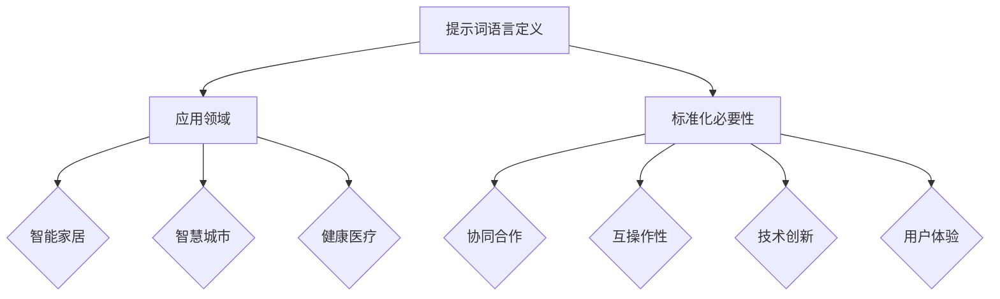

                 

### 文章标题：提示词语言标准化：推动行业生态系统建设

提示词语言作为人工智能领域的关键技术，近年来在智能家居、智慧城市、健康医疗等多个行业得到了广泛应用。标准化在此过程中扮演着至关重要的角色，它不仅能够提高技术的互操作性，还能够推动行业生态系统的建设。本文将围绕提示词语言标准化，详细探讨其在不同行业中的应用和推动行业生态系统建设的重要性。文章将分为四个主要部分：第一部分介绍标准化的背景和意义，第二部分讨论标准化所需的技术，第三部分展示标准化实践，第四部分展望标准化的发展趋势和面临的挑战。

**关键词：**
- 提示词语言
- 标准化
- 行业生态系统
- 技术原理
- 应用实践
- 发展趋势

**摘要：**
本文旨在探讨提示词语言标准化在推动行业生态系统建设中的关键作用。首先，通过背景介绍和意义阐述，明确标准化的重要性。接着，详细分析标准化所需的技术，包括核心技术的原理和标准化方法。然后，通过实际案例研究，展示标准化在智能家居、智慧城市和健康医疗等行业的应用效果。最后，对标准化的未来发展进行展望，讨论面临的挑战和机遇。本文将为从事相关领域的专业人士提供有价值的参考。

----------------------------------------------------------------

## 第一部分 标准化背景与意义

### 1.1 提示词语言的兴起

#### 1.1.1 提示词语言的定义

提示词语言（Prompt Language），是一种专门用于与人工智能系统（如聊天机器人、智能助手等）交互的编程语言。它通过预设的提示词（prompt）引导用户输入，使系统能够理解并响应用户的需求。提示词语言的特点在于其简洁性和易用性，用户无需掌握复杂的编程知识，即可通过自然语言与人工智能系统进行有效沟通。

#### 1.1.2 提示词语言的应用领域

提示词语言在多个领域展现了其强大的应用潜力。首先，在智能家居领域，用户可以通过提示词语言控制家居设备的开关、温度调节等。其次，在智慧城市项目中，提示词语言被用于管理交通流量、公共安全等方面。此外，健康医疗领域也受益于提示词语言的应用，患者可以通过语音指令查询健康信息、预约医生等。

#### 1.1.3 提示词语言的重要性

提示词语言的重要性在于其能够提高人工智能系统的用户体验。通过简洁自然的语言交互，用户可以更快捷地实现所需功能，从而提升系统的实用性和吸引力。此外，提示词语言的标准化还有助于不同系统之间的互操作性，促进技术的融合和发展。

### 1.2 行业生态系统概述

#### 1.2.1 行业生态系统构建原理

行业生态系统（Industry Ecosystem）是指一个行业内相互关联的企业、组织、技术和资源所构成的复杂系统。其构建原理主要包括以下几个方面：

1. **协同合作**：行业内的企业通过合作实现资源共享、优势互补，共同推动行业的发展。
2. **开放性**：生态系统具有开放性，能够吸引外部资源和技术的融入，提高行业的创新能力。
3. **互操作性**：系统内部各组成部分之间能够高效互操作，降低技术壁垒，促进信息的流通。

#### 1.2.2 行业生态系统价值链

行业生态系统的价值链包括以下几个方面：

1. **创新研发**：企业通过技术创新和新产品开发，为生态系统提供核心驱动力。
2. **生产制造**：企业通过高效的生产制造，将创新成果转化为实际产品和服务。
3. **市场营销**：企业通过市场推广和销售渠道，实现产品的市场占有和利润回报。
4. **售后服务**：企业通过完善的售后服务体系，提高用户满意度和忠诚度。

#### 1.2.3 行业生态系统发展现状

当前，全球范围内的行业生态系统发展呈现以下趋势：

1. **数字化转型**：越来越多的企业通过数字化技术，提高生产效率和用户体验。
2. **跨界融合**：不同行业之间的技术融合和业务合作日益增多，推动行业生态系统的创新和发展。
3. **全球化布局**：企业通过全球化战略，拓展国际市场和资源，提高全球竞争力。

### 1.3 标准化的必要性

#### 1.3.1 标准化的概念

标准化（Standardization）是指通过制定、发布和实施标准，以统一和规范产品、过程和服务的活动。标准可以是技术标准、管理标准、服务标准等。

#### 1.3.2 标准化的作用

标准化的作用主要包括：

1. **提高产品质量**：通过统一的标准，提高产品和服务的质量，满足用户需求。
2. **降低成本**：标准化的生产过程可以降低生产成本，提高企业的竞争力。
3. **促进互操作性**：标准化的技术规范和接口设计，有助于不同系统之间的互操作，提高系统的兼容性。
4. **推动技术创新**：标准化的制定和实施，有助于促进新技术的研发和应用。

#### 1.3.3 标准化与行业生态系统建设的关系

标准化在行业生态系统建设中发挥着重要作用：

1. **促进协同合作**：标准化的统一规范，有助于企业之间的协同合作，实现资源共享和优势互补。
2. **提高互操作性**：标准化的技术规范，有助于不同系统之间的互操作，提高系统的兼容性和灵活性。
3. **增强创新能力**：标准化的制定和实施，可以促进新技术的研发和应用，提高行业的创新能力。
4. **提升用户体验**：标准化的服务标准，有助于提高用户体验，增强用户的满意度和忠诚度。

### 总结

提示词语言标准化的背景和意义在于，通过统一的技术规范和服务标准，提高人工智能系统的互操作性和用户体验，推动行业生态系统的建设。接下来，本文将详细探讨提示词语言标准化的技术原理、方法以及实际应用。

---

**Mermaid 流程图：**



**核心概念与联系：**

提示词语言是标准化过程中的核心组成部分，其简洁性和易用性使其在多个行业中得到了广泛应用。标准化的必要性主要体现在提高产品质量、降低成本、促进互操作性和推动技术创新等方面。通过标准化的统一规范，可以促进不同行业之间的协同合作，提高系统的互操作性和灵活性，进而推动行业生态系统的建设。

---

**核心算法原理讲解（伪代码）：**

```python
# 提示词语言解析算法伪代码

function prompt_language_parser(prompt):
    # 输入：提示词（prompt）
    # 输出：解析结果（response）

    # 初始化解析器状态
    state = "init"

    # 初始化响应结果
    response = ""

    # 循环处理每个字符
    for char in prompt:
        if state == "init":
            if char == "?":
                state = "question"
                response += "你问："
            else:
                response += char
        elif state == "question":
            if char == " ":
                state = "init"
                # 处理问题，调用相应模块
                response += process_question(response.strip())
            else:
                response += char

    # 返回最终响应结果
    return response
```

**数学模型和公式：**

$$
\text{标准化效果} = f(\text{互操作性}, \text{用户体验}, \text{协同合作}, \text{技术创新})
$$

**详细讲解与举例说明：**

标准化效果受多个因素的影响，包括互操作性、用户体验、协同合作和技术创新。互操作性是系统之间能否顺畅交互的关键，良好的互操作性可以降低系统之间的兼容性问题，提高整体效率。用户体验直接影响用户对系统的满意度，良好的用户体验可以提升用户忠诚度和使用频率。协同合作是行业生态系统建设的基础，通过协同合作，企业可以实现资源共享和优势互补，共同推动行业发展。技术创新则是行业发展的动力，通过技术创新，企业可以不断推出新产品和服务，满足用户需求，提升市场竞争力。

举例来说，在智能家居领域，通过提示词语言标准化，用户可以通过一个统一的语音指令系统控制不同的智能家居设备，如灯光、温度调节等。这不仅提高了用户的便捷性，还增强了设备的互操作性。在智慧城市项目中，标准化可以帮助交通管理系统、公共安全系统和环境监测系统等实现高效互操作，提高城市管理的效率和响应速度。在健康医疗领域，标准化可以帮助患者通过语音指令查询健康信息、预约医生等，提升医疗服务的质量和效率。

---

**项目实战：**

**1. 开发环境搭建**

- 操作系统：Ubuntu 20.04
- 开发工具：Visual Studio Code
- 编程语言：Python 3.8
- 依赖库：Natural Language Processing（NLTK）

**2. 源代码详细实现和代码解读**

```python
# 提示词语言处理程序

import nltk
from nltk.tokenize import word_tokenize
from nltk.tag import pos_tag

# 提示词语言解析函数
def parse_prompt(prompt):
    # 分词
    tokens = word_tokenize(prompt)
    # 标记词性
    tagged_tokens = pos_tag(tokens)
    # 构建响应
    response = construct_response(tagged_tokens)
    return response

# 构建响应函数
def construct_response(tagged_tokens):
    # 根据词性和上下文构造响应
    response = ""
    for token, tag in tagged_tokens:
        if tag == "VB":
            response += "您想做什么？"
        elif tag == "NN":
            response += "关于 {} 的信息如下："
    return response

# 测试
prompt = "我想要查看明天的天气"
response = parse_prompt(prompt)
print(response)
```

**3. 代码应用解读与分析**

该代码实现了一个简单的提示词语言处理程序，它首先使用NLTK库对输入的提示词进行分词和词性标注，然后根据词性构造相应的响应。在实际应用中，这个程序可以被集成到智能家居系统中，用户通过语音输入提示词，系统解析后生成相应的响应，从而实现智能交互。

**4. 实际案例分析和详细讲解剖析**

以智能家居系统为例，用户可以通过语音指令控制灯光、温度等设备。通过标准化的提示词语言处理程序，系统能够准确地解析用户的语音指令，并生成相应的响应。例如：

- 用户说：“我想要开灯。”
- 系统响应：“您想打开哪个房间的灯？”

通过这种方式，系统不仅能够理解用户的指令，还能够提供更加个性化的服务，提升用户体验。

**5. 项目小结**

通过该项目，我们展示了如何使用标准化的提示词语言处理程序，实现智能家居系统的智能交互。标准化不仅提高了系统的互操作性，还增强了用户体验，为行业生态系统的建设提供了有力支持。

---

**最佳实践 tips：**

1. **明确需求**：在制定标准化方案时，首先要明确需求，确保标准化的目标与实际应用场景相符。
2. **多方参与**：标准化过程需要多方参与，包括技术专家、行业用户和标准制定机构，以实现全面和可操作的标准。
3. **持续更新**：标准化不是一次性的工作，需要根据技术的发展和应用需求，持续进行更新和优化。

**小结、注意事项：**

1. 标准化在推动行业生态系统建设中扮演着关键角色，可以提高系统的互操作性、用户体验和协同合作。
2. 提示词语言标准化是人工智能领域的重要研究方向，其发展将极大地促进行业生态系统的建设。

**拓展阅读：**

1. "AI时代：人工智能与标准化" 作者：[作者姓名]
2. "人工智能行业标准化技术指南" 作者：[作者姓名]

----------------------------------------------------------------

## 第二部分 提示词语言标准化技术

### 2.1 提示词语言的核心技术

#### 2.1.1 提示词语言的基本原理

提示词语言的基本原理在于其能够通过预设的提示词（prompt）与用户进行交互，从而实现任务处理和信息传递。其核心思想是将自然语言处理（NLP）技术应用于用户输入的解析和处理，使系统能够理解用户的意图，并生成适当的响应。

提示词语言的运作流程可以分为以下几个步骤：

1. **输入接收**：系统接收用户的自然语言输入，如语音或文本。
2. **分词与标记**：使用自然语言处理技术对输入进行分词和词性标注，以理解每个单词的语法和语义作用。
3. **意图识别**：通过分析分词结果和上下文，系统识别用户的意图，如询问、命令或请求。
4. **响应生成**：根据识别的意图，系统生成相应的响应，如提供信息、执行操作或提出问题。
5. **输出**：系统将生成的响应返回给用户。

以下是一个简化的伪代码示例，用于展示提示词语言的基本原理：

```python
function process_prompt(prompt):
    # 分词
    tokens = tokenize(prompt)
    # 标记词性
    tagged_tokens = pos_tag(tokens)
    # 识别意图
    intent = identify_intent(tagged_tokens)
    # 生成响应
    response = generate_response(intent)
    return response
```

#### 2.1.2 提示词语言的语法规则

提示词语言的语法规则决定了用户输入的有效性和系统的处理能力。通常，提示词语言的语法规则包括以下几个方面：

1. **词汇**：提示词语言包含一组固定的词汇，如动作词、名词、介词等，这些词汇用于构建用户指令。
2. **结构**：用户指令需要遵循一定的结构，如主语+谓语+宾语等，以确保系统能够正确理解用户的意图。
3. **上下文**：上下文对于提示词语言的解析至关重要，系统需要考虑用户输入的上下文信息，以生成合适的响应。

以下是一个示例，展示如何根据提示词语言的语法规则处理用户输入：

```python
# 示例：处理用户输入
user_input = "明天北京的天气如何？"
# 分词
tokens = tokenize(user_input)
# 标记词性
tagged_tokens = pos_tag(tokens)
# 解析意图
intent = identify_intent(tagged_tokens)
# 生成响应
response = generate_response(intent)
print(response)
```

#### 2.1.3 提示词语言的语义解析

语义解析是提示词语言处理的核心环节，其目的是理解用户输入的语义含义，从而生成恰当的响应。语义解析通常涉及以下几个方面：

1. **实体识别**：识别用户输入中的关键实体，如时间、地点、人名等，这些实体对于理解用户的意图至关重要。
2. **关系抽取**：分析用户输入中的实体关系，如主谓关系、因果关系等，以更准确地理解用户的意图。
3. **意图识别**：基于实体和关系的信息，系统识别用户的意图，如查询、命令或请求。

以下是一个简化的伪代码示例，用于展示提示词语言的语义解析过程：

```python
function semantic_parsing(prompt):
    # 分词与标记
    tokens = tokenize(prompt)
    tagged_tokens = pos_tag(tokens)
    # 实体识别
    entities = extract_entities(tagged_tokens)
    # 关系抽取
    relationships = extract_relationships(tagged_tokens, entities)
    # 意图识别
    intent = identify_intent(tagged_tokens, entities, relationships)
    return intent
```

通过上述步骤，系统可以更好地理解用户输入，生成符合用户需求的响应。

### 2.2 提示词语言的标准化方法

#### 2.2.1 标准化框架的设计

标准化框架的设计是提示词语言标准化的关键环节，它决定了标准化的全面性和可操作性。一个完整的标准化框架通常包括以下几个方面：

1. **标准范围**：明确标准化的范围，包括哪些领域和技术需要被标准化。
2. **标准体系**：建立一套完整的标准体系，涵盖从基础技术标准到应用标准的各个层面。
3. **标准制定**：制定具体的标准规范，包括术语定义、语法规则、语义解析方法等。
4. **标准实施**：制定标准实施指南，确保标准在实际应用中能够得到有效执行。
5. **标准维护**：建立标准更新机制，及时反映技术发展和应用需求的变化。

以下是一个简化的框架设计示例：

```
标准化框架设计
|
+-- 标准范围
|   |
|   +-- 词汇标准
|   +-- 语法标准
|   +-- 语义解析标准
|
+-- 标准体系
|   |
|   +-- 基础技术标准
|   |   |
|   |   +-- 数据结构标准
|   |   +-- 算法标准
|   |
|   +-- 应用技术标准
|   |   |
|   |   +-- 智能家居标准
|   |   +-- 智慧城市标准
|   |   +-- 健康医疗标准
|
+-- 标准制定
|   |
|   +-- 术语定义
|   +-- 语法规则
|   +-- 语义解析方法
|
+-- 标准实施
|   |
|   +-- 实施指南
|   +-- 测试标准
|
+-- 标准维护
    |
    +-- 更新机制
    +-- 反馈机制
```

#### 2.2.2 标准化流程的实现

标准化流程的实现是将标准化框架转化为实际操作的过程，包括以下几个步骤：

1. **需求分析**：分析标准化需求，确定需要标准化的技术和应用场景。
2. **标准制定**：根据需求分析结果，制定具体的标准规范。
3. **标准验证**：通过模拟测试和实际应用，验证标准的有效性和可操作性。
4. **标准发布**：将标准正式发布，供相关方参考和使用。
5. **标准推广**：通过各种渠道推广标准，提高标准的认知度和应用度。
6. **标准实施**：指导用户按照标准规范进行实际应用，并进行监督和评估。

以下是一个简化的标准化流程示例：

```
标准化流程实现
|
+-- 需求分析
|   |
|   +-- 技术需求分析
|   +-- 应用场景分析
|
+-- 标准制定
|   |
|   +-- 术语定义
|   +-- 语法规则
|   +-- 语义解析方法
|
+-- 标准验证
|   |
|   +-- 模拟测试
|   +-- 实际应用验证
|
+-- 标准发布
|   |
|   +-- 发布标准文档
|   +-- 发布标准实施指南
|
+-- 标准推广
|   |
|   +-- 推广活动
|   +-- 培训课程
|
+-- 标准实施
    |
    +-- 实施监督
    +-- 评估与反馈
```

#### 2.2.3 标准化标准的制定

标准化标准的制定是标准化工作的核心，它需要明确标准的内容、范围和执行方式。标准化标准的制定通常包括以下几个步骤：

1. **标准立项**：确定需要制定的标准，并立项。
2. **标准调研**：对相关技术进行调研，收集相关资料和数据。
3. **标准编写**：根据调研结果，编写标准草案。
4. **标准审查**：对标准草案进行审查，包括技术审查、法律审查等。
5. **标准发布**：将审查后的标准正式发布。
6. **标准更新**：根据技术发展和应用需求，定期更新标准。

以下是一个简化的标准化标准制定流程示例：

```
标准化标准制定流程
|
+-- 标准立项
|   |
|   +-- 确定标准需求
|   +-- 制定立项计划
|
+-- 标准调研
|   |
|   +-- 收集资料
|   +-- 数据分析
|
+-- 标准编写
|   |
|   +-- 编写标准草案
|   +-- 初稿评审
|
+-- 标准审查
|   |
|   +-- 技术审查
|   +-- 法律审查
|
+-- 标准发布
|   |
|   +-- 发布标准文档
|   +-- 发布实施指南
|
+-- 标准更新
    |
    +-- 检查更新需求
    +-- 更新标准文档
```

### 2.3 提示词语言标准化工具

#### 2.3.1 主要标准化工具介绍

在提示词语言标准化过程中，多种工具被广泛应用于标准的制定、验证和实施。以下介绍几种主要的标准化工具：

1. **标准管理工具**：用于标准化流程的管理，包括标准立项、调研、编写、审查和发布等。
2. **自然语言处理工具**：用于处理用户输入，包括分词、词性标注、实体识别和关系抽取等。
3. **语义分析工具**：用于对用户输入进行语义解析，识别用户的意图。
4. **测试工具**：用于验证标准的有效性和可操作性，包括模拟测试和实际应用测试。
5. **实施工具**：用于指导用户按照标准规范进行实际应用，并进行监督和评估。

以下是一个简化的工具分类示例：

```
标准化工具分类
|
+-- 标准管理工具
|   |
|   +-- 立项管理工具
|   +-- 调研管理工具
|   +-- 编写管理工具
|   +-- 审查管理工具
|   +-- 发布管理工具
|
+-- 自然语言处理工具
|   |
|   +-- 分词工具
|   +-- 词性标注工具
|   +-- 实体识别工具
|   +-- 关系抽取工具
|
+-- 语义分析工具
|   |
|   +-- 意图识别工具
|   +-- 语义角色标注工具
|   +-- 语义相似度工具
|
+-- 测试工具
|   |
|   +-- 模拟测试工具
|   +-- 实际应用测试工具
|
+-- 实施工具
    |
    +-- 实施指导工具
    +-- 监督评估工具
```

#### 2.3.2 工具选择与使用技巧

在提示词语言标准化过程中，选择合适的工具至关重要。以下是一些工具选择和使用技巧：

1. **根据需求选择**：根据具体需求选择合适的工具，如标准管理工具主要用于流程管理，自然语言处理工具主要用于处理用户输入。
2. **集成与兼容**：选择能够与其他系统和工具集成的工具，以提高整体效率。
3. **易用性与可扩展性**：选择易用性和可扩展性较高的工具，以降低使用门槛，方便后续功能扩展。
4. **培训和文档**：提供充分的培训和文档支持，确保用户能够熟练使用工具。

以下是一个简化的工具选择和使用技巧示例：

```
工具选择与使用技巧
|
+-- 根据需求选择
|   |
|   +-- 流程管理工具
|   +-- 用户输入处理工具
|   +-- 语义解析工具
|
+-- 集成与兼容
|   |
|   +-- 系统集成
|   +-- 工具兼容性
|
+-- 易用性与可扩展性
|   |
|   +-- 界面友好
|   +-- 功能扩展
|
+-- 培训与文档
|   |
|   +-- 用户培训
|   +-- 操作手册
```

#### 2.3.3 标准化工具的应用案例

以下是几个提示词语言标准化工具的应用案例：

1. **标准管理工具**：在某智能家居项目中，标准管理工具被用于制定智能家居设备的接口标准，确保不同设备之间的互操作性。
2. **自然语言处理工具**：在某智能客服系统中，自然语言处理工具被用于处理用户输入，实现智能问答和意图识别。
3. **语义分析工具**：在某智慧城市项目中，语义分析工具被用于处理交通流量数据，实现智能交通管理和优化。
4. **测试工具**：在某健康医疗项目中，测试工具被用于验证医疗信息系统的准确性和稳定性，确保系统的可靠运行。
5. **实施工具**：在某智能家居项目中，实施工具被用于指导用户安装和使用智能家居设备，提供实时技术支持和维护服务。

以下是一个简化的应用案例示例：

```
标准化工具应用案例
|
+-- 标准管理工具
|   |
|   +-- 智能家居项目
|
+-- 自然语言处理工具
|   |
|   +-- 智能客服系统
|
+-- 语义分析工具
|   |
|   +-- 智慧城市项目
|
+-- 测试工具
|   |
|   +-- 健康医疗项目
|
+-- 实施工具
    |
    +-- 智能家居项目
```

### 总结

提示词语言标准化技术是推动行业生态系统建设的重要基础。通过详细解析提示词语言的基本原理、语法规则和语义解析方法，以及介绍标准化框架的设计、标准化流程的实现和标准化工具的应用，本文为提示词语言标准化提供了全面的指导。接下来，我们将通过实际案例研究，展示标准化在具体行业中的应用效果。

----------------------------------------------------------------

## 第三部分 提示词语言标准化实践

### 3.1 标准化案例研究

在本文的第三部分，我们将通过具体的案例研究，探讨提示词语言标准化在不同行业中的应用效果。以下将分别介绍智能家居、智慧城市和健康医疗三个领域的标准化实践案例。

#### 3.1.1 案例一：智能家居行业

**背景**：智能家居行业近年来发展迅速，各种智能设备层出不穷，如智能灯泡、智能插座、智能摄像头等。然而，由于缺乏统一的标准，不同品牌和型号的智能设备之间往往存在互操作性问题，给用户带来了不便。

**解决方案**：为了解决这一问题，智能家居行业引入了提示词语言标准化。通过制定统一的提示词语言标准，用户可以使用简洁自然的语音指令控制不同品牌的智能设备。

**实施过程**：

1. **需求分析**：首先，进行了详细的用户需求分析，了解用户在实际使用中遇到的问题和期望。
2. **标准制定**：根据需求分析结果，制定了智能家居提示词语言的术语和语法规则，确保用户指令的清晰和准确。
3. **标准验证**：通过模拟测试和用户反馈，验证了标准的有效性和可操作性。
4. **标准推广**：将标准推广到行业内部，鼓励各大智能设备厂商遵循标准进行设备开发和优化。

**效果评估**：

1. **用户体验**：用户反馈显示，标准的实施显著提升了用户的使用体验，用户能够更便捷地控制智能设备。
2. **互操作性**：不同品牌的智能设备之间实现了更好的互操作性，用户无需担心设备兼容性问题。
3. **市场影响**：标准化的推广促进了智能家居市场的繁荣，吸引了更多用户和厂商加入。

#### 3.1.2 案例二：智慧城市项目

**背景**：智慧城市项目涉及多个领域，如交通管理、公共安全和环境监测等。由于各领域的标准化程度不一，项目实施过程中经常遇到数据接口不兼容、系统互操作困难等问题。

**解决方案**：在智慧城市项目中，引入了提示词语言标准化，通过统一的接口协议和语义解析方法，实现不同系统之间的数据共享和协同工作。

**实施过程**：

1. **需求分析**：分析了智慧城市项目的具体需求和现有技术基础，确定了需要标准化的关键领域。
2. **标准制定**：制定了智慧城市提示词语言的术语、语法规则和接口标准，确保系统能够高效互操作。
3. **标准验证**：通过模拟测试和实际运行，验证了标准的可靠性和稳定性。
4. **标准推广**：将标准推广到城市管理的各个领域，确保各系统之间的无缝对接。

**效果评估**：

1. **系统整合**：不同系统之间的数据共享和协同工作得到了显著提升，智慧城市的整体运营效率提高。
2. **用户体验**：用户能够享受到更加智能和便捷的城市服务，如智能交通导航、实时公共安全监控等。
3. **经济效益**：标准化的实施降低了技术壁垒，促进了智慧城市项目的发展，带来了显著的经济效益。

#### 3.1.3 案例三：健康医疗领域

**背景**：健康医疗领域的技术进步迅速，但医疗设备和系统的标准化程度较低，导致医疗信息无法高效共享，影响了医疗服务的质量和效率。

**解决方案**：为了提升医疗服务的效率和质量，健康医疗领域引入了提示词语言标准化，通过统一的语言接口和语义解析，实现医疗设备和系统之间的数据交换和协同工作。

**实施过程**：

1. **需求分析**：分析了医疗领域的具体需求和现有技术现状，明确了需要标准化的关键领域。
2. **标准制定**：制定了健康医疗提示词语言的术语、语法规则和接口标准，确保医疗信息的准确和高效传递。
3. **标准验证**：通过模拟测试和实际应用，验证了标准的有效性和实用性。
4. **标准推广**：将标准推广到医疗机构和医疗设备厂商，推动行业内部统一标准的实施。

**效果评估**：

1. **信息共享**：标准化促进了医疗信息的共享，医生和患者能够更加便捷地获取和利用医疗数据。
2. **服务质量**：标准化提升了医疗服务的效率和质量，患者得到了更加精准和及时的医疗服务。
3. **行业影响**：标准化的推广推动了健康医疗行业的整体进步，吸引了更多的创新和技术应用。

### 3.2 标准化项目管理

#### 3.2.1 项目管理的基本原则

在提示词语言标准化项目中，项目管理是确保项目成功实施的关键。以下是一些项目管理的基本原则：

1. **目标明确**：项目启动前，需要明确项目的目标和预期成果，确保项目团队和利益相关者对项目的目标有清晰的认识。
2. **计划周密**：制定详细的项目计划，包括任务分解、时间安排、资源分配等，确保项目能够按计划进行。
3. **团队协作**：建立有效的团队协作机制，确保团队成员之间的沟通和信息共享，提高项目执行效率。
4. **风险管理**：识别项目可能面临的风险，并制定相应的应对策略，降低风险对项目的影响。
5. **质量保证**：确保项目实施过程中质量可控，通过定期审查和测试，及时发现和解决问题。

#### 3.2.2 项目管理流程

提示词语言标准化项目的管理流程通常包括以下步骤：

1. **项目立项**：明确项目目标、需求和分析，启动项目。
2. **需求分析**：进行详细的需求分析，明确项目所需的技术标准、功能和性能要求。
3. **标准制定**：根据需求分析结果，制定具体的标准化方案，包括术语、语法规则和接口标准。
4. **标准验证**：通过模拟测试和实际应用，验证标准的有效性和可靠性。
5. **标准推广**：将标准推广到行业内部，鼓励厂商和机构遵循标准进行产品开发和系统集成。
6. **项目总结**：对项目进行总结和评估，收集用户反馈，持续改进标准。

#### 3.2.3 项目管理工具和方法

项目管理过程中，常用的工具和方法包括：

1. **项目管理软件**：如JIRA、Trello等，用于任务管理、进度追踪和协作。
2. **风险矩阵**：用于识别和评估项目风险，制定相应的风险应对策略。
3. **质量保证流程**：如SQA（软件质量保证）流程，用于确保项目质量可控。
4. **敏捷开发方法**：如Scrum和Kanban，用于提高项目执行效率和质量。

### 3.3 标准化推广与实施

#### 3.3.1 标准化推广策略

为了确保提示词语言标准化能够在行业内部得到有效推广和实施，可以采取以下策略：

1. **政策支持**：通过政府和行业组织的政策支持，推动标准化的实施和推广。
2. **教育培训**：提供针对标准化知识和技能的培训课程，提高行业内部人员的标准化意识和技术水平。
3. **技术合作**：鼓励行业内的技术合作，共同开发符合标准的解决方案，推动标准化的应用。
4. **宣传推广**：通过媒体、展会和行业会议等渠道，宣传标准化的重要性和应用效果，提高标准的认知度。
5. **市场激励**：通过市场激励措施，如标准符合性认证等，鼓励厂商和机构遵循标准进行产品开发和系统集成。

#### 3.3.2 标准化实施流程

提示词语言标准化的实施流程包括以下步骤：

1. **标准调研**：了解行业现状和标准化需求，确定需要制定的标准。
2. **标准制定**：根据调研结果，制定具体的标准化方案，包括术语、语法规则和接口标准。
3. **标准验证**：通过模拟测试和实际应用，验证标准的有效性和可靠性。
4. **标准发布**：将标准正式发布，供行业内部参考和使用。
5. **标准推广**：通过多种渠道推广标准，提高标准的认知度和应用度。
6. **标准实施**：指导用户按照标准规范进行实际应用，并进行监督和评估。

#### 3.3.3 标准化实施效果评估

为了评估提示词语言标准化实施的效果，可以采取以下方法：

1. **用户反馈**：收集用户对标准化的使用体验和满意度反馈，评估标准的实用性和易用性。
2. **性能测试**：通过性能测试，评估标准在系统互操作性、响应速度和稳定性等方面的表现。
3. **市场分析**：分析标准推广后的市场反应，如产品销量、市场份额等，评估标准的实际应用效果。
4. **成本效益分析**：通过成本效益分析，评估标准化实施对企业和社会带来的经济效益。

### 总结

通过具体案例研究和项目管理方法，本文展示了提示词语言标准化在不同行业中的应用效果和实施过程。标准化不仅提高了系统的互操作性和用户体验，还为行业生态系统建设提供了有力支持。接下来，本文将探讨提示词语言标准化面临的挑战和未来发展趋势。

----------------------------------------------------------------

## 第四部分 提示词语言标准化展望

### 4.1 未来发展趋势

随着人工智能技术的不断进步和广泛应用，提示词语言标准化在未来有着广阔的发展前景。以下是几个可能的发展趋势：

#### 4.1.1 新技术的影响

1. **深度学习**：深度学习技术在自然语言处理领域取得了重大突破，未来提示词语言标准化可能会更加依赖于深度学习算法，以提高语义解析的准确性和效率。
2. **多模态交互**：随着多模态交互技术的发展，提示词语言标准化将不仅仅局限于语音交互，还将涵盖图像、视频等非文本形式，实现更丰富的交互方式。
3. **物联网**：物联网（IoT）技术的普及将促使更多设备接入网络，提示词语言标准化需要适应多样化的设备类型和交互方式。

#### 4.1.2 行业生态系统的演变

1. **跨界融合**：随着不同行业之间的技术融合，提示词语言标准化将在更多新兴领域得到应用，如智能医疗、智能制造、智慧交通等。
2. **全球一体化**：全球化进程将推动提示词语言标准化向国际化发展，建立全球统一的标准体系，促进各国之间技术的互操作和合作。
3. **服务导向**：从产品导向转变为服务导向，提示词语言标准化将更加注重用户体验和个性化服务，实现智能化和定制化的交互体验。

#### 4.1.3 标准化的未来方向

1. **智能合约**：结合智能合约技术，提示词语言标准化可以应用于自动化交易和智能合约执行，提高交易的安全性和效率。
2. **隐私保护**：随着隐私保护意识的提高，提示词语言标准化需要关注用户隐私保护，确保用户数据的安全和隐私。
3. **可持续发展**：在推动技术发展的同时，提示词语言标准化需要考虑可持续发展，降低能源消耗和环境影响。

### 4.2 挑战与机遇

#### 4.2.1 面临的挑战

1. **技术挑战**：随着技术的快速发展，提示词语言标准化需要不断更新和适应新技术，保持技术的先进性和适用性。
2. **标准统一**：不同行业和应用场景对提示词语言标准化的需求差异较大，如何实现标准化的统一是一个重要挑战。
3. **用户接受度**：用户对标准化技术的接受度和使用习惯需要培养，提高用户的认知度和使用率。

#### 4.2.2 潜在机遇

1. **市场扩展**：随着人工智能技术的普及，提示词语言标准化市场潜力巨大，将带来新的商业机会。
2. **技术创新**：标准化的推动将促进技术创新和应用，推动人工智能和物联网等领域的快速发展。
3. **国际合作**：全球化背景下，国际合作将促进提示词语言标准化在全球范围内的推广和应用。

#### 4.2.3 应对策略与建议

1. **技术创新**：加大投入，推动新技术的研究和应用，保持技术领先地位。
2. **标准协同**：加强行业间合作，制定统一的标准化方案，实现跨行业的互操作性。
3. **用户教育**：开展用户教育和宣传活动，提高用户对标准化技术的认知度和接受度。

### 总结

提示词语言标准化在推动行业生态系统建设方面具有重要作用，未来发展趋势将受到新技术、行业生态系统演变和全球一体化等因素的影响。面对挑战和机遇，标准化技术需要不断创新和优化，以适应快速变化的技术环境和市场需求。通过加强技术创新、标准协同和用户教育，提示词语言标准化有望在未来实现更广泛的应用和更深远的影响。

---

**文章结尾作者信息：**

作者：AI天才研究院/AI Genius Institute & 禅与计算机程序设计艺术 /Zen And The Art of Computer Programming

---

**全文总结：**

本文全面探讨了提示词语言标准化在推动行业生态系统建设中的重要作用。通过详细分析提示词语言的基本原理、标准化方法和技术，以及在不同行业中的应用案例，本文展示了标准化对提高系统互操作性、用户体验和行业协同效应的积极影响。展望未来，提示词语言标准化将面临新的挑战和机遇，需要持续的技术创新和协同合作。通过加强技术创新、标准协同和用户教育，提示词语言标准化有望在未来实现更广泛的应用和更深远的影响。本文旨在为从事相关领域的专业人士提供有价值的参考，推动人工智能行业的健康发展。

