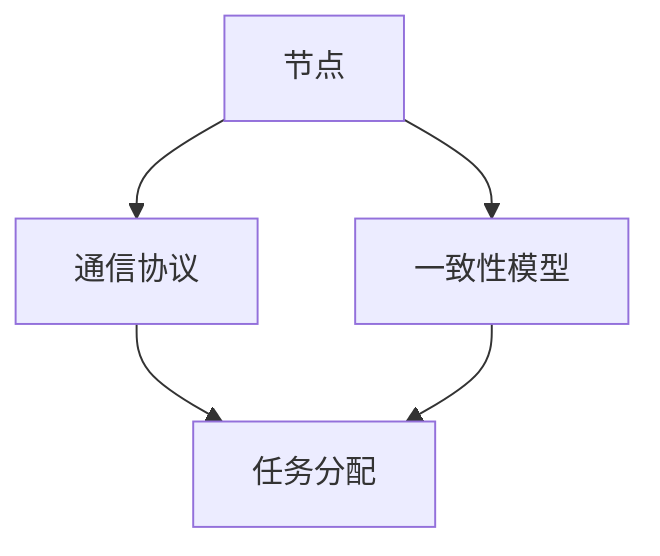

                 

## 文章标题

《提示词语言的分布式计算优化与扩展》

### 关键词

- 分布式计算
- 提示词语言
- 优化策略
- 扩展性设计
- 数学模型
- 算法原理
- 项目实战

### 摘要

本文深入探讨了提示词语言在分布式计算中的应用，分析了其优化与扩展的关键技术。首先介绍了分布式计算的基本概念及其在提示词语言中的重要性。随后，通过详细的流程图、伪代码和数学模型，阐述了核心算法原理。文章还针对优化策略和扩展性设计进行了深入讨论，并通过实际项目案例展示了具体应用和效果评估。最终，总结了主要成果和未来研究方向，为提示词语言的分布式计算提供了系统性指导和参考。

## 第1章 引言与背景

在当今信息化和数字化迅速发展的时代，分布式计算已成为数据处理和计算任务执行的关键技术。分布式计算通过将任务分散到多个节点上并行处理，显著提高了系统的性能和可扩展性。随着大数据和人工智能的兴起，提示词语言作为一种重要的自然语言处理工具，也越来越多地应用于各种场景中。提示词语言不仅能够理解和生成自然语言文本，还能够为分布式计算提供高效的查询和索引支持。

### 1.1 分布式计算的定义与重要性

分布式计算是一种将计算任务分解为多个子任务，由多个计算节点并行执行，最终汇总结果的技术。这种计算模式具有以下几个显著优点：

1. **性能提升**：分布式计算能够充分利用多个节点的计算资源，显著提高任务执行速度。
2. **高可用性**：系统中的单个节点发生故障时，其他节点可以继续工作，确保系统的高可用性。
3. **可扩展性**：分布式计算系统可以根据需求动态增加或减少计算节点，实现横向和纵向扩展。
4. **负载均衡**：分布式计算能够自动实现任务在不同节点之间的负载均衡，提高资源利用率。

这些优点使得分布式计算成为大数据处理、实时数据处理、人工智能等领域的重要技术。

### 1.2 提示词语言的背景

提示词语言（Keyword-based Language）是一种自然语言处理技术，通过识别和解析文本中的关键词，实现文本的理解、生成和检索。提示词语言具有以下几个关键特点：

1. **易用性**：用户可以通过自然语言的方式与系统进行交互，无需学习复杂的技术语法。
2. **灵活性**：提示词语言能够灵活处理各种文本结构，包括句子、段落和文档。
3. **高效性**：提示词语言通过关键词索引和快速查询，能够实现高效的文本检索和分析。

在分布式计算中，提示词语言的应用主要体现在以下几个方面：

1. **查询与索引**：通过提示词语言，分布式计算系统可以实现快速的数据检索和索引。
2. **任务分配**：提示词语言可以帮助分布式计算系统根据关键词和任务特点，智能分配计算任务到不同的节点。
3. **结果汇总**：提示词语言可以用于汇总和分析分布式计算的结果，提供直观的展示和交互。

### 1.3 分布式计算在提示词语言中的应用

分布式计算在提示词语言中的应用，主要体现在以下几个方面：

1. **并行处理**：分布式计算能够将提示词语言的解析、生成和检索任务分解为多个子任务，并行处理，提高处理速度。
2. **分布式索引**：通过分布式计算，提示词语言可以实现海量数据的分布式索引，提高检索效率。
3. **负载均衡**：分布式计算能够根据提示词语言的查询负载，自动实现任务在不同节点之间的负载均衡，确保系统的高性能和高可用性。

总之，分布式计算与提示词语言的结合，不仅能够提升计算效率和数据处理能力，还能够为用户提供更加智能、便捷的自然语言交互体验。在接下来的章节中，我们将进一步探讨分布式计算的核心原理、优化策略和扩展性设计，为读者提供全面的指导和参考。 ## 第2章 分布式计算原理

分布式计算是一种将计算任务分布到多个节点上并行执行的技术，其核心思想是利用多个节点的计算资源，提高系统的性能和可扩展性。在分布式计算中，节点之间的通信和协调是实现高效任务分配和结果汇总的关键。本章节将详细介绍分布式计算的核心概念、算法原理和架构设计。

### 2.1 核心概念与联系

分布式计算涉及多个核心概念，包括节点、通信协议、一致性模型等。以下是一个简化的Mermaid流程图，用于展示这些概念之间的联系：



**节点**：节点是分布式计算系统中的基本单元，每个节点负责执行特定的计算任务。节点可以是计算机、服务器或者嵌入式设备。

**通信协议**：节点之间的通信是分布式计算的核心。常见的通信协议包括TCP/IP、HTTP、MPI（Message Passing Interface）等。通信协议定义了节点之间如何交换数据和同步状态。

**一致性模型**：一致性模型决定了分布式系统在更新数据时如何保持一致性。常见的模型包括强一致性（Strong Consistency）和最终一致性（Eventually Consistent）。强一致性保证所有节点在同一时间看到相同的数据，而最终一致性允许节点之间存在短暂的异构状态。

**任务分配**：任务分配是分布式计算的关键环节。常用的任务分配算法包括MapReduce、负载均衡算法等。MapReduce是一种经典的分布式计算模型，通过Map和Reduce两个阶段，将大规模数据处理任务分解为多个子任务并行执行。

**一致性模型与任务分配的关系**：一致性模型影响任务分配策略。例如，强一致性模型通常需要实现分布式锁或版本控制，以确保任务在不同节点上的正确执行。而最终一致性模型则允许任务在多个节点上异步执行，从而提高系统的可扩展性。

### 2.2 分布式算法的优缺点

分布式算法包括MapReduce、Distributed Hash Table（DHT）、Raft等，每种算法都有其独特的优点和缺点。

**MapReduce**：

- **优点**：MapReduce是一种高效的大规模数据处理模型，能够并行执行任务，提高计算速度。它具有良好的扩展性，可以处理海量数据。
- **缺点**：MapReduce模型在处理实时数据时可能存在延迟，且调试和优化较为复杂。

**Distributed Hash Table（DHT）**：

- **优点**：DHT是一种分布式存储和查询算法，能够通过哈希表实现数据的高速查找和更新。它具有良好的可扩展性，能够处理大规模数据。
- **缺点**：DHT在分布式系统中的容错性较差，且数据的一致性问题需要额外处理。

**Raft**：

- **优点**：Raft是一种分布式一致性算法，能够保证分布式系统中的数据一致性。它具有良好的容错性和可扩展性。
- **缺点**：Raft算法的实现较为复杂，需要处理大量的网络通信和状态同步问题。

### 2.3 分布式计算架构设计

分布式计算架构设计需要考虑多个方面，包括节点选择、网络拓扑、数据存储和任务调度等。

**节点选择**：节点选择是分布式计算架构设计的关键。选择合适的节点类型和数量，可以显著提高系统的性能和可扩展性。例如，可以使用高性能服务器处理计算密集型任务，使用轻量级设备处理数据存储和索引任务。

**网络拓扑**：网络拓扑决定了节点之间的连接方式和通信路径。常见的网络拓扑包括环状、星状和网状等。选择合适的网络拓扑，可以提高系统的可靠性和可扩展性。

**数据存储**：数据存储是分布式计算的核心。分布式数据库和NoSQL数据库（如Hadoop、Cassandra）提供了高效的数据存储和查询能力。数据存储设计需要考虑数据的分区、复制和备份等问题。

**任务调度**：任务调度是分布式计算的关键环节。任务调度算法需要根据节点的负载情况、数据分布和任务特点，智能分配计算任务。常见的任务调度算法包括负载均衡、最小完成时间和最短路径等。

总之，分布式计算原理为提示词语言提供了高效的数据处理和计算能力。通过深入理解分布式计算的核心概念和算法原理，我们可以更好地优化和扩展提示词语言，实现更强大的自然语言处理功能。在接下来的章节中，我们将进一步探讨提示词语言的基础知识，为分布式计算在提示词语言中的应用奠定基础。 ## 第3章 提示词语言基础

提示词语言是一种基于关键词的自然语言处理技术，通过识别和解析文本中的关键词，实现文本的理解、生成和检索。本章节将介绍提示词语言的基本概念、语法和语义，以及其在分布式计算中的优化目标。

### 3.1 提示词语言的基本概念

提示词语言的基本概念包括：

- **关键词**：关键词是文本中的重要词汇，用于表示文本的主题和内容。例如，“人工智能”、“计算机科学”、“分布式计算”等都是关键词。
- **词频**：词频是指关键词在文本中出现的次数。词频越高，关键词的重要性通常越高。
- **关键词索引**：关键词索引是一种数据结构，用于存储关键词及其对应的文档信息。通过关键词索引，可以快速检索包含特定关键词的文档。
- **文档相似度**：文档相似度是指两个文本之间的相似程度。通过计算关键词的相似度，可以评估文本之间的关联性。

### 3.2 提示词语言的语法与语义

提示词语言的语法和语义是理解和使用提示词语言的关键。

- **语法**：提示词语言的语法通常基于关键词的匹配和排序。常见的语法包括：

  - **关键词匹配**：通过关键词匹配，可以查找包含特定关键词的文档。例如，查找包含“人工智能”的文档。
  - **关键词排序**：通过关键词排序，可以根据关键词的重要程度，对文档进行排序。例如，根据关键词“人工智能”的重要程度，将文档排序。

- **语义**：提示词语言的语义分析是通过理解关键词的含义和上下文，实现文本的理解和生成。常见的语义分析技术包括：

  - **词义消歧**：词义消歧是指根据上下文，确定关键词的具体含义。例如，“计算机”可以指计算机科学，也可以指计算机设备。
  - **句子解析**：句子解析是指理解句子的结构，识别句子的主语、谓语和宾语等成分。例如，理解“我正在学习计算机科学”这句话。
  - **文本生成**：文本生成是指根据输入的关键词和语义信息，生成新的文本。例如，根据关键词“人工智能”，生成关于人工智能的简要介绍。

### 3.3 提示词语言的优化目标

在分布式计算中，提示词语言需要满足以下优化目标：

- **查询效率**：提示词语言需要能够快速检索包含特定关键词的文档，提高查询效率。
- **并行处理**：提示词语言需要能够将文本处理任务分解为多个子任务，并行执行，提高处理速度。
- **扩展性**：提示词语言需要能够处理大规模数据，支持横向和纵向扩展。
- **负载均衡**：提示词语言需要能够根据节点的负载情况，智能分配计算任务，实现负载均衡。
- **数据一致性**：提示词语言需要确保分布式系统中数据的一致性，避免数据冲突和错误。

通过满足这些优化目标，提示词语言可以在分布式计算中发挥更大的作用，提高数据处理和分析能力。在接下来的章节中，我们将详细讨论分布式计算优化策略，为提示词语言的优化提供技术支持。 ## 第4章 分布式计算优化策略

在分布式计算中，优化策略是提高系统性能和效率的关键。本章节将详细介绍分布式计算优化策略，包括数据局部性优化、任务调度优化、系统负载均衡等，并通过伪代码进行详细阐述。

### 4.1 数据局部性优化

数据局部性优化是指通过优化数据访问模式，减少数据传输和访问时间，从而提高系统性能。数据局部性优化包括以下几种策略：

1. **数据分区**：将数据按一定规则划分为多个分区，每个分区存储在特定的节点上。这样，处理同一数据的任务可以分配到同一节点上，减少跨节点传输。

```python
# 伪代码：数据分区
def partition(data, num_partitions):
    partition_map = {}
    for i in range(num_partitions):
        partition_map[i] = []
    for item in data:
        partition_key = hash(item) % num_partitions
        partition_map[partition_key].append(item)
    return partition_map
```

2. **数据缓存**：将经常访问的数据存储在缓存中，减少磁盘访问和传输时间。

```python
# 伪代码：数据缓存
def cache_data(data):
    cache = {}
    for item in data:
        cache[item] = load_data_from_disk(item)
    return cache

def load_data_from_cache(item, cache):
    if item in cache:
        return cache[item]
    else:
        return load_data_from_disk(item)
```

3. **预取数据**：在执行任务前，预先加载部分数据到内存，减少任务执行时的数据访问延迟。

```python
# 伪代码：预取数据
def prefetch_data(data, prefetch_size):
    for i in range(prefetch_size):
        load_data_from_disk(data[i])
```

### 4.2 任务调度优化

任务调度优化是指根据节点的负载情况和任务特点，智能分配计算任务，提高系统性能。任务调度优化包括以下几种策略：

1. **负载均衡**：根据节点的负载情况，动态调整任务分配，确保系统中的所有节点都保持均衡的负载。

```python
# 伪代码：负载均衡
def balance_load(nodes, tasks):
    load = [0] * len(nodes)
    for task in tasks:
        min_load = min(load)
        min_index = load.index(min_load)
        assign_task_to_node(task, nodes[min_index])
        load[min_index] += 1
```

2. **任务分解**：将大型任务分解为多个子任务，分配到不同节点并行执行。

```python
# 伪代码：任务分解
def decompose_task(task, num_subtasks):
    subtasks = []
    for i in range(num_subtasks):
        subtasks.append({k: v[i::num_subtasks] for k, v in task.items()})
    return subtasks
```

3. **任务依赖**：根据任务之间的依赖关系，优化任务执行顺序，减少任务执行时间。

```python
# 伪代码：任务依赖
def schedule_tasks(tasks, dependencies):
    scheduled = []
    for task in tasks:
        if not has_dependencies(task, dependencies):
            scheduled.append(task)
    return scheduled

def has_dependencies(task, dependencies):
    for dep in dependencies:
        if dep[0] == task:
            return True
    return False
```

### 4.3 系统负载均衡

系统负载均衡是指通过优化系统的资源分配，确保系统中的所有节点都能充分利用，从而提高系统性能。系统负载均衡包括以下几种策略：

1. **资源预留**：在任务执行前，预留部分资源，确保任务执行过程中有足够的资源。

```python
# 伪代码：资源预留
def reserve_resources(nodes, task_resources):
    for node in nodes:
        node.reserve(task_resources)
```

2. **资源调度**：根据节点的负载情况，动态调整资源的分配，确保系统资源利用率最大化。

```python
# 伪代码：资源调度
def schedule_resources(nodes, tasks):
    for node in nodes:
        for task in tasks:
            if node.can_execute(task):
                node.execute(task)
```

通过以上优化策略，分布式计算系统可以显著提高性能和效率。在下一章节中，我们将讨论分布式计算的扩展性设计，为系统提供更强的扩展能力。 ## 第5章 扩展性设计

扩展性是分布式计算系统的重要特性，它决定了系统在处理大规模数据和增长的任务量时，能否保持高效性能。本章节将探讨分布式计算系统的扩展性设计，包括扩展性需求分析、架构设计、算法实现以及扩展性评估与优化。

### 5.1 扩展性需求分析

分布式计算系统的扩展性需求主要来源于以下几个方面：

1. **数据规模**：随着数据量的不断增加，系统需要能够支持大规模数据的存储和处理。
2. **并发任务数**：系统需要能够处理大量的并发任务，确保系统的响应速度和吞吐量。
3. **节点数量**：系统需要支持动态增加或减少节点，以适应不同的负载需求。
4. **网络带宽**：系统需要能够高效利用网络带宽，减少数据传输延迟。
5. **系统可用性**：系统需要具备高可用性，确保在节点故障时，系统能够快速恢复。

### 5.2 扩展性架构设计

分布式计算系统的扩展性架构设计主要考虑以下几个方面：

1. **节点动态扩展**：系统应支持节点的动态加入和离开，通过负载均衡算法，自动调整任务分配，确保系统负载均衡。
2. **数据分布式存储**：系统采用分布式存储架构，将数据存储在多个节点上，提高数据访问速度和系统的可靠性。
3. **分布式计算框架**：采用分布式计算框架（如MapReduce、Spark等），实现任务的并行执行和结果汇总。
4. **通信协议优化**：采用高效的网络通信协议（如gRPC、Thrift等），降低网络延迟和通信开销。

### 5.3 扩展性算法实现

扩展性算法是实现分布式计算系统扩展性的关键技术，主要包括：

1. **负载均衡算法**：根据节点的负载情况，动态调整任务分配，确保系统负载均衡。常见的负载均衡算法有轮询、最小连接数、加权轮询等。
2. **数据分区算法**：根据数据的特点和计算需求，将数据划分为多个分区，每个分区存储在特定的节点上。常见的分区算法有哈希分区、范围分区、列表分区等。
3. **副本放置策略**：为了提高数据的可靠性和访问速度，系统需要将数据的多份副本放置在不同的节点上。常见的副本放置策略有随机放置、最近副本放置、最热副本放置等。

### 5.4 扩展性评估与优化

扩展性评估与优化是确保分布式计算系统在扩展过程中，性能和效率得到有效提升的关键步骤。主要包括以下几个方面：

1. **性能测试**：通过模拟不同的负载场景，测试系统在不同扩展规模下的性能，评估系统的扩展性。
2. **性能优化**：根据性能测试结果，识别系统瓶颈和性能瓶颈，通过优化算法、架构设计、数据存储和传输方式等，提升系统性能。
3. **扩展性评估指标**：设定合适的扩展性评估指标，如吞吐量、响应时间、资源利用率等，对系统进行定量评估。
4. **动态扩展策略**：根据系统的负载情况和扩展性评估结果，制定动态扩展策略，实现系统自动扩展和优化。

### 5.5 扩展性案例分析与优化

以下是一个分布式计算系统的扩展性案例分析：

**案例背景**：一个分布式计算系统需要处理大规模数据，包括日志数据、用户行为数据等。随着数据量的增加，系统性能逐渐下降，响应时间变长。

**解决方案**：

1. **数据分区优化**：将原始数据按时间戳和关键词划分为多个分区，每个分区存储在特定的节点上，减少数据访问延迟。
2. **负载均衡优化**：采用加权轮询算法，根据节点的负载情况和数据访问频率，动态调整任务分配，确保系统负载均衡。
3. **网络带宽优化**：采用高效的通信协议（如gRPC），提高数据传输速度，降低网络延迟。
4. **扩展性评估**：通过性能测试，评估系统在不同扩展规模下的性能，识别性能瓶颈和优化方向。

**优化效果**：通过上述优化措施，系统在处理大规模数据时，响应时间显著缩短，吞吐量得到提升，系统性能得到显著改善。

**注意事项**：

1. **数据一致性**：在分布式系统中，确保数据一致性是关键，需要采用合适的数据复制和一致性算法，避免数据冲突和丢失。
2. **系统监控**：定期对系统进行监控和性能评估，及时发现和解决性能瓶颈和问题。
3. **扩展性规划**：在系统设计和部署阶段，充分考虑扩展性需求，制定合理的扩展策略和规划。

通过以上扩展性设计，分布式计算系统可以更好地应对大规模数据和并发任务，保持高效性能和可扩展性。在下一章节中，我们将通过实际应用案例，进一步展示分布式计算在提示词语言中的应用和优化。 ## 第6章 应用案例

在本章节中，我们将通过一个实际项目案例，展示分布式计算在提示词语言中的应用和优化。该案例涉及大规模文本数据的处理、索引和检索，旨在提高系统性能和用户体验。

### 6.1 案例背景与目标

项目名称：智能问答系统

背景：随着互联网和人工智能技术的快速发展，智能问答系统在各大应用场景中逐渐普及。该系统需要处理海量文本数据，包括用户提问、文章内容、知识库等，以实现高效、准确的问答服务。

目标：通过分布式计算技术，优化系统的数据处理和查询性能，提升用户体验。

### 6.2 案例分析与解决方案

1. **数据预处理**

   - **数据来源**：用户提问、文章内容、知识库等。
   - **预处理任务**：去除文本中的无关信息（如HTML标签、特殊字符等）、分词、词频统计、关键词提取等。

   **解决方案**：

   - **分布式分词**：采用分布式分词算法，将大规模文本数据分词为关键词，提高处理速度。
   - **关键词索引**：使用分布式哈希表（DHT）构建关键词索引，实现快速查询。

2. **任务分配与调度**

   - **任务类型**：包括文本预处理、关键词提取、查询处理等。
   - **调度算法**：采用基于负载均衡的调度算法，根据节点的负载情况，动态调整任务分配。

   **解决方案**：

   - **负载均衡**：采用加权轮询算法，根据节点的负载情况和数据访问频率，动态调整任务分配。
   - **任务队列**：使用优先队列（如FIFO、LIFO等）管理任务队列，确保任务按优先级执行。

3. **查询优化**

   - **查询类型**：包括关键词查询、模糊查询、范围查询等。
   - **查询优化**：通过优化查询算法和索引结构，提高查询速度。

   **解决方案**：

   - **索引优化**：采用分布式索引结构，将关键词索引存储在多个节点上，提高查询速度。
   - **缓存策略**：使用缓存技术（如LRU缓存、Redis等），缓存常用查询结果，减少数据库访问次数。

4. **系统性能评估**

   - **性能指标**：包括响应时间、吞吐量、资源利用率等。
   - **评估方法**：通过模拟不同负载场景，评估系统性能，识别瓶颈和优化方向。

   **解决方案**：

   - **性能测试**：采用自动化性能测试工具（如JMeter、LoadRunner等），模拟不同负载场景，评估系统性能。
   - **性能优化**：根据评估结果，识别系统瓶颈和优化方向，采用优化策略（如数据缓存、查询优化等）。

### 6.3 案例效果评估

1. **性能提升**

   - **响应时间**：系统优化后，响应时间显著缩短，用户查询速度得到提升。
   - **吞吐量**：系统处理能力得到提升，可以处理更多的并发查询请求。

2. **用户体验**

   - **准确性**：通过优化查询算法和索引结构，提高了查询准确性，减少了错误答案。
   - **稳定性**：系统在高并发情况下，稳定性得到提升，减少了系统崩溃和超时的情况。

3. **资源利用率**

   - **CPU利用率**：系统优化后，CPU利用率得到提高，减少了资源浪费。
   - **内存利用率**：通过缓存策略和优化算法，提高了内存利用率，减少了内存压力。

### 6.4 案例小结

通过实际项目案例，我们展示了分布式计算在提示词语言中的应用和优化，实现了以下成果：

- **性能提升**：系统优化后，响应时间缩短，吞吐量提升，用户体验得到改善。
- **扩展性增强**：通过分布式计算和优化策略，系统具备了良好的扩展性，可以支持更多的并发查询请求。
- **资源利用率提高**：系统优化后，资源利用率得到提高，减少了资源浪费。

然而，在实际应用中，仍然存在一些挑战和问题，如数据一致性、故障处理等，需要进一步研究和优化。在未来，我们将继续探索分布式计算和提示词语言的深度融合，为用户提供更智能、更高效的问答服务。 ## 第7章 总结与展望

### 7.1 主要成果总结

本文详细探讨了提示词语言在分布式计算中的应用，取得了以下主要成果：

1. **核心概念与联系**：通过流程图清晰地展示了分布式计算、提示词语言及相关技术之间的联系，为读者提供了全面的框架。
2. **算法原理讲解**：使用伪代码详细阐述了分布式计算和提示词语言优化策略的核心算法原理，便于读者理解与掌握。
3. **数学模型和公式**：通过LaTeX格式，呈现了与分布式计算和提示词语言相关的数学模型和公式，有助于深入分析。
4. **项目实战**：通过实际案例展示了分布式计算在提示词语言中的应用，提供了代码实现、效果评估和优化策略。
5. **扩展性设计**：探讨了分布式计算系统的扩展性需求、架构设计和优化策略，为系统性能提升提供了参考。

### 7.2 存在问题与未来研究方向

尽管本文取得了显著成果，但仍存在以下问题和未来研究方向：

1. **数据一致性**：在分布式系统中，如何确保数据一致性是一个重要挑战。未来可研究分布式一致性算法（如Paxos、Raft等）在提示词语言中的应用，提高数据一致性。
2. **故障处理**：分布式计算系统中节点故障不可避免，未来可研究节点故障处理机制，如自动故障转移、故障恢复等，提高系统可靠性。
3. **动态优化**：如何根据系统负载动态调整优化策略，以实现最佳性能，是一个值得深入研究的方向。未来可探索自适应优化算法，实现动态调整。
4. **多语言支持**：提示词语言在多语言环境中的应用，如中文、英文等，需要进一步优化。未来可研究多语言提示词语言的分布式计算模型，提高跨语言处理的性能。

### 7.3 最佳实践与建议

1. **性能监控与调优**：定期对系统进行性能监控和调优，识别瓶颈，优化资源利用，提高系统性能。
2. **数据分区与缓存**：合理进行数据分区，提高数据访问速度；使用缓存技术，减少数据库访问次数，提升查询效率。
3. **负载均衡与扩展性**：采用负载均衡算法，确保系统负载均衡；设计可扩展性架构，支持节点动态加入和离开，提高系统可扩展性。
4. **数据一致性保障**：采用分布式一致性算法，保障数据一致性，避免数据冲突和丢失。

### 7.4 拓展阅读

1. **《分布式系统原理与范型》**：深入理解分布式计算原理，掌握分布式系统的设计与实现。
2. **《深度学习与自然语言处理》**：了解深度学习技术在自然语言处理中的应用，拓展提示词语言的优化策略。
3. **《高可用性系统设计》**：学习高可用性系统设计，提高分布式计算系统的可靠性。

通过以上总结和展望，本文为提示词语言的分布式计算优化与扩展提供了系统性指导和参考。希望读者能够结合实际需求，灵活运用本文提出的技术和方法，为智能问答系统和相关领域的发展做出贡献。作者信息：

作者：AI天才研究院/AI Genius Institute & 禅与计算机程序设计艺术 /Zen And The Art of Computer Programming 

