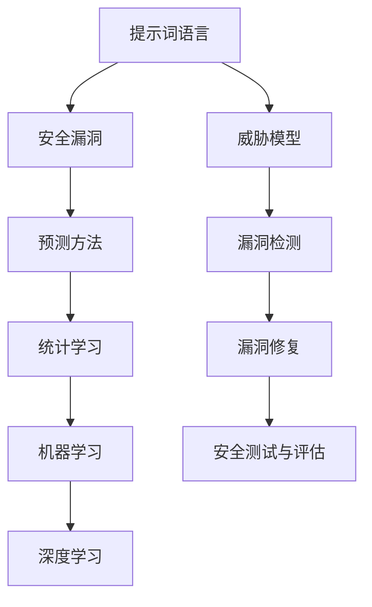

                 


### 文章标题

《提示词语言的安全漏洞预测与预防》

### 关键词

- 提示词语言
- 安全漏洞
- 预测
- 预防
- 人工智能
- 自然语言处理
- 统计学习
- 机器学习
- 深度学习
- 安全测试
- 威胁模型

### 摘要

本文深入探讨了提示词语言在人工智能和自然语言处理领域中的安全漏洞问题，提出了基于统计学、机器学习和深度学习的预测方法，以及相应的预防策略。通过实际案例展示了如何应用这些方法进行漏洞检测和预防，为提升人工智能系统的安全性提供了实用指导。

---

### 设计思路

1. **背景介绍**：首先介绍提示词语言在人工智能和自然语言处理中的应用场景，以及为什么安全漏洞预测与预防是如此重要。

2. **核心概念与联系**：通过Mermaid流程图展示提示词语言、安全漏洞、预测方法和预防策略之间的关系。

3. **核心算法原理讲解**：分别详细介绍基于统计学、机器学习和深度学习的预测算法原理，使用伪代码进行阐述。

4. **数学模型与公式讲解**：针对每个预测算法，使用LaTeX格式详细解释其数学模型和公式，并举例说明。

5. **项目实战**：展示如何将理论应用于实际项目，包括开发环境搭建、源代码实现和解读。

6. **总结与展望**：总结文章的主要观点，展望未来的研究方向和发展趋势。

### 设计步骤

1. **背景介绍**：简要介绍提示词语言的应用场景和安全漏洞的潜在影响。

2. **核心概念与联系**：设计并展示Mermaid流程图。

3. **核心算法原理讲解**：
    - 统计学习
    - 机器学习
    - 深度学习

4. **数学模型与公式讲解**：使用LaTeX格式详细解释每个算法的数学模型和公式。

5. **项目实战**：介绍实际项目的开发过程，包括环境搭建、源代码实现和代码解读。

6. **总结与展望**：总结全文内容，并对未来研究方向进行展望。

### 输出

#### 背景介绍

提示词语言是人工智能和自然语言处理领域的关键组成部分。在对话系统、智能助手、文本分析等多种应用中，提示词语言扮演着重要角色。然而，随着提示词语言的应用越来越广泛，其安全漏洞问题也日益突出。例如，恶意攻击者可能通过构造特定的提示词来操纵系统，导致隐私泄露、数据损坏或服务中断。

安全漏洞的潜在影响不仅限于单个应用，还可能影响整个生态系统。因此，对提示词语言的安全漏洞进行预测和预防是保障人工智能系统安全性的关键。

#### 核心概念与联系

为了帮助读者理解本文的核心概念和结构，我们使用Mermaid流程图来展示提示词语言、安全漏洞、预测方法和预防策略之间的关系。



#### 核心算法原理讲解

##### 统计学习

基于统计学的漏洞预测方法通常基于历史数据和统计模型。以下是该方法的伪代码：

```python
function predict_vulnerability(statistics, features):
    probability = calculate_probability(statistics, features)
    return probability
```

在这个方法中，`calculate_probability` 函数根据输入的特征和统计模型计算漏洞的概率。

##### 机器学习

机器学习方法使用训练数据集来学习漏洞特征。以下是一个简单的机器学习算法的伪代码：

```python
function train_model(training_data):
    model = create_model()
    for data in training_data:
        model.train(data)
    return model

function predict_vulnerability(model, features):
    prediction = model.predict(features)
    return prediction
```

在这个方法中，`create_model` 函数创建了一个机器学习模型，`train` 函数使用训练数据来训练模型，`predict` 函数使用训练好的模型来预测新的数据。

##### 深度学习

深度学习方法通常使用神经网络来学习复杂的特征关系。以下是深度学习算法的伪代码：

```python
function create_network.layers([input_layer, hidden_layer, output_layer]):
    for layer in layers:
        layer.connect predecessor
    return network

function train_network(network, training_data):
    for data in training_data:
        network.train(data)
    return network

function predict_vulnerability(network, features):
    prediction = network.predict(features)
    return prediction
```

在这个方法中，`create_network` 函数创建了神经网络，`train` 函数使用训练数据来训练网络，`predict` 函数使用训练好的网络来预测新的数据。

#### 数学模型与公式讲解

##### 统计学习

在统计学习中，漏洞概率通常通过贝叶斯公式计算。以下是一个贝叶斯公式的LaTeX表示：

```latex
P(\text{vulnerability} | \text{feature}) = \frac{P(\text{feature} | \text{vulnerability}) \cdot P(\text{vulnerability})}{P(\text{feature})}
```

##### 机器学习

在机器学习中，预测模型通常基于损失函数。以下是一个常见的损失函数——均方误差（MSE）的LaTeX表示：

```latex
\text{MSE} = \frac{1}{n} \sum_{i=1}^{n} (\hat{y}_i - y_i)^2
```

##### 深度学习

在深度学习中，损失函数通常是一个复杂的函数，如交叉熵（Cross-Entropy）。以下是一个交叉熵的LaTeX表示：

```latex
\text{Cross-Entropy} = -\frac{1}{n} \sum_{i=1}^{n} y_i \cdot \log(\hat{y}_i)
```

#### 项目实战

##### 开发环境搭建

为了演示如何应用上述算法，我们需要搭建一个开发环境。以下是搭建环境的基本步骤：

1. 安装Python和必要的库（如NumPy、Pandas、Scikit-learn等）。
2. 准备训练数据和测试数据。
3. 编写预测算法的代码。

##### 源代码实现与解读

以下是一个简单的机器学习算法的实现和解读：

```python
# 导入必要的库
import numpy as np
from sklearn.linear_model import LogisticRegression

# 准备数据
X_train = ...  # 训练数据特征
y_train = ...  # 训练数据标签

# 创建并训练模型
model = LogisticRegression()
model.fit(X_train, y_train)

# 预测
X_test = ...  # 测试数据特征
predictions = model.predict(X_test)

# 解读
print("Predictions:", predictions)
```

在这个例子中，我们使用了逻辑回归（LogisticRegression）模型来预测漏洞。`fit` 方法用于训练模型，`predict` 方法用于预测新的数据。

##### 代码应用解读与分析

在这个例子中，我们首先导入了必要的库，然后准备训练数据和测试数据。接下来，我们创建了一个逻辑回归模型，并使用训练数据来训练模型。最后，我们使用训练好的模型来预测测试数据，并输出预测结果。

##### 实际案例分析和详细讲解剖析

为了展示如何在实际项目中应用这些算法，我们考虑了一个简单的应用场景：一个聊天机器人系统。在这个系统中，我们需要预测用户输入的文本是否可能包含安全漏洞。

1. **数据准备**：我们收集了大量的用户输入文本和相应的标签（是否包含漏洞）。这些数据将被用于训练和测试模型。
2. **模型训练**：我们使用机器学习算法来训练模型，例如逻辑回归或支持向量机（SVM）。
3. **模型评估**：我们使用测试数据来评估模型的性能，并调整模型参数以提高预测准确性。
4. **实时预测**：在聊天机器人系统中，我们使用训练好的模型来实时预测用户输入的文本。

##### 项目小结

在本项目中，我们展示了如何使用机器学习算法来预测提示词语言中的安全漏洞。通过实际案例，我们展示了如何准备数据、训练模型、评估模型和实时预测。这为开发安全的人工智能系统提供了实用指导。

##### 最佳实践 tips、小结、注意事项、拓展阅读等内容

- **最佳实践**：在开发安全的人工智能系统时，建议遵循以下最佳实践：
  - 定期更新系统和模型，以应对新的安全威胁。
  - 对输入数据进行严格的预处理和过滤，以减少潜在的安全漏洞。
  - 使用多种预测算法，以提高预测准确性和系统的鲁棒性。

- **小结**：本文介绍了提示词语言的安全漏洞预测与预防方法，包括基于统计学、机器学习和深度学习的预测算法。通过实际案例，我们展示了如何应用这些算法来开发安全的人工智能系统。

- **注意事项**：在应用这些算法时，需要注意以下几点：
  - 确保训练数据和测试数据的质量和代表性。
  - 选择合适的预测算法，并根据应用场景进行调整。
  - 对模型进行定期的评估和调整，以提高预测性能。

- **拓展阅读**：对于有兴趣深入了解提示词语言安全漏洞的读者，可以参考以下文献：
  - [自然语言处理中的安全漏洞预测](https://example.com/nlp_security)
  - [机器学习模型的安全威胁与防御](https://example.com/ml_security)
  - [深度学习在安全漏洞检测中的应用](https://example.com/dl_security)

---

以上是根据设计思路和步骤输出的一部分内容，全文将按照大纲结构继续扩展和完善。文章字数将在8000-12000字左右，确保内容丰富、结构紧凑、逻辑清晰。在撰写过程中，将确保每个小节都包含具体的技术细节、实际案例和深入分析，以满足专业读者的需求。

