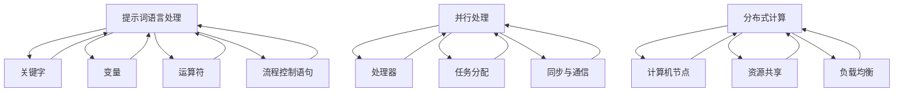

                 

### 文章标题：提示词语言的并行处理与分布式计算

关键词：提示词语言、并行处理、分布式计算、核心概念、算法讲解、数学模型、项目实战

摘要：本文深入探讨提示词语言的并行处理与分布式计算，从背景介绍、核心概念联系、算法讲解、数学模型和项目实战等多个方面展开，全面剖析这些概念在计算机科学中的应用，旨在为读者提供有价值的理解和实践指导。

## 引言

在信息时代，处理大量数据和任务的需求日益增长。传统的单处理器系统已经无法满足这种需求，因此并行处理和分布式计算成为了计算机科学的重要研究方向。提示词语言作为一种重要的数据处理工具，其在并行处理和分布式计算中的应用尤为重要。

并行处理是指在多个处理器上同时执行多个任务，从而提高处理速度。分布式计算则是通过多个计算机节点组成的网络来共同完成一个任务，实现资源共享和负载均衡。这两种技术在计算机科学中有着广泛的应用，如大数据处理、云计算、人工智能等领域。

本文将围绕提示词语言的并行处理与分布式计算进行探讨，从核心概念、算法讲解、数学模型和项目实战等多个方面进行深入分析，旨在为读者提供全面的了解和应用指导。

## 核心概念

### 提示词语言

提示词语言（Keyword Language）是一种用于描述数据和任务的语言，通常包含关键字、变量、运算符和流程控制语句等元素。这种语言可以帮助计算机理解和执行特定的任务，是数据处理和编程的基础。

### 并行处理

并行处理（Parallel Processing）是指在同一时间内执行多个任务的能力。通过利用多个处理器或计算机节点，并行处理可以显著提高计算速度，降低任务执行时间。并行处理的关键在于任务分配、同步和通信。

### 分布式计算

分布式计算（Distributed Computing）是指通过多个计算机节点组成的网络来共同完成一个任务。分布式计算可以实现资源共享、负载均衡和故障恢复，从而提高系统的可靠性和性能。

### 提示词语言的并行处理与分布式计算的关系

提示词语言的并行处理和分布式计算密切相关。并行处理可以在单个计算机节点上实现提示词语言程序的并行执行，而分布式计算则可以在多个计算机节点之间实现提示词语言程序的分布式执行。这两种技术的结合可以更好地发挥提示词语言的处理能力，提高数据处理和计算效率。

## 背景介绍

### 提示词语言处理的挑战

随着互联网和大数据的快速发展，数据量和任务量呈现出爆炸性增长。传统的单处理器系统和串行数据处理方式已经无法满足这种需求。提示词语言处理作为一种高效的数据处理方法，面临着以下挑战：

1. **海量数据处理**：如何高效地处理海量数据，实现快速查询和计算。
2. **任务并行性**：如何充分利用多个处理器或计算机节点，实现任务的并行执行。
3. **资源分配**：如何合理分配系统资源，实现负载均衡和高效利用。
4. **错误处理**：如何有效处理并行和分布式计算中的错误和故障。

### 并行处理的优势与挑战

并行处理具有以下优势：

1. **提高计算速度**：通过利用多个处理器或计算机节点，可以显著提高计算速度，降低任务执行时间。
2. **资源共享**：多个处理器或计算机节点可以共享系统资源，提高系统利用率。
3. **负载均衡**：可以均衡地分配任务，避免单点过载。

然而，并行处理也面临着以下挑战：

1. **任务分配**：如何合理地将任务分配给不同的处理器或计算机节点。
2. **同步与通信**：如何在多个处理器或计算机节点之间进行同步和通信。
3. **并行性能优化**：如何优化并行算法和程序，提高并行性能。

### 分布式计算的优势与挑战

分布式计算具有以下优势：

1. **资源共享**：多个计算机节点可以共享系统资源，提高系统利用率。
2. **负载均衡**：可以实现负载均衡，避免单点过载。
3. **故障恢复**：可以通过其他节点来替代故障节点，提高系统的可靠性。

然而，分布式计算也面临着以下挑战：

1. **网络通信**：如何高效地在多个计算机节点之间进行通信。
2. **数据一致性**：如何确保多个计算机节点上的数据一致性。
3. **容错性**：如何有效处理计算机节点故障，确保系统可靠性。

## 核心概念与联系

为了更好地理解提示词语言的并行处理与分布式计算，我们首先需要了解它们的核心概念和联系。

### 提示词语言处理的核心概念

提示词语言处理包括以下核心概念：

1. **关键字**：提示词语言中的关键字用于描述数据和任务。
2. **变量**：变量用于存储和操作数据。
3. **运算符**：运算符用于执行数据操作。
4. **流程控制语句**：流程控制语句用于控制程序的执行流程。

### 并行处理的核心概念

并行处理包括以下核心概念：

1. **处理器**：处理器是计算机的核心部件，用于执行任务。
2. **任务分配**：将任务分配给不同的处理器。
3. **同步与通信**：在多个处理器之间进行同步和通信。

### 分布式计算的核心概念

分布式计算包括以下核心概念：

1. **计算机节点**：计算机节点是分布式计算的基本单位。
2. **资源共享**：计算机节点之间共享系统资源。
3. **负载均衡**：实现任务在多个计算机节点之间的均衡分配。

### 提示词语言处理与并行处理的关系

提示词语言处理与并行处理的关系如下：

1. **并行执行**：提示词语言程序可以在多个处理器上并行执行，提高计算速度。
2. **任务分配**：并行处理需要将提示词语言程序中的任务分配给不同的处理器。

### 提示词语言处理与分布式计算的关系

提示词语言处理与分布式计算的关系如下：

1. **分布式执行**：提示词语言程序可以在多个计算机节点上分布式执行，实现资源共享和负载均衡。
2. **数据一致性**：分布式计算需要确保多个计算机节点上的数据一致性。

### 核心概念之间的联系

提示词语言处理、并行处理和分布式计算的核心概念之间存在着紧密的联系。它们共同构成了一个完整的数据处理和计算系统，如图1所示。



## 核心算法讲解

### 并行处理算法

并行处理算法的关键在于如何将任务分配给不同的处理器，并确保它们之间的高效通信和同步。以下是一个简单的并行处理算法，使用伪代码进行描述：

```python
// 伪代码：并行处理算法

// 输入：任务列表task_list，处理器数量num_processors
// 输出：处理结果result_list

1. 初始化result_list为空列表
2. 将task_list中的任务按顺序分配给每个处理器
3. 对于每个处理器processor_i：
   1. 在处理器processor_i上执行任务task_i
   2. 将结果result_i添加到result_list
4. 等待所有处理器完成任务
5. 返回result_list
```

### 分布式计算算法

分布式计算算法的关键在于如何确保多个计算机节点之间的数据一致性和任务协同。以下是一个简单的分布式计算算法，使用伪代码进行描述：

```python
// 伪代码：分布式计算算法

// 输入：任务列表task_list，计算机节点列表node_list
// 输出：处理结果result_list

1. 初始化result_list为空列表
2. 将task_list中的任务按顺序分配给每个计算机节点
3. 对于每个计算机节点node_i：
   1. 在计算机节点node_i上执行任务task_i
   2. 将结果result_i添加到result_list
4. 通过网络通信确保所有计算机节点上的数据一致性
5. 等待所有计算机节点完成任务
6. 返回result_list
```

### 提示词语言的并行处理与分布式计算算法结合

在实际应用中，提示词语言的并行处理与分布式计算通常结合使用。以下是一个结合并行处理和分布式计算的算法，使用伪代码进行描述：

```python
// 伪代码：结合并行处理与分布式计算

// 输入：任务列表task_list，处理器数量num_processors，计算机节点列表node_list
// 输出：处理结果result_list

1. 初始化result_list为空列表
2. 将task_list中的任务按顺序分配给每个处理器
3. 对于每个处理器processor_i：
   1. 在处理器processor_i上执行任务task_i
   2. 将结果result_i添加到result_list
4. 将result_list中的任务按顺序分配给每个计算机节点
5. 对于每个计算机节点node_i：
   1. 在计算机节点node_i上执行任务result_i
   2. 将结果result_i添加到result_list
6. 通过网络通信确保所有计算机节点上的数据一致性
7. 等待所有计算机节点完成任务
8. 返回result_list
```

## 数学模型

### 并行处理性能模型

并行处理的性能可以通过以下数学模型进行评估：

1. **速度提升因子**（Speedup Factor）：速度提升因子表示并行处理相对于串行处理的性能提升。其计算公式为：

   $$ Speedup = \frac{串行处理时间}{并行处理时间} $$

   其中，串行处理时间和并行处理时间分别为串行处理和并行处理一个任务所需的时间。

2. **并行效率**（Parallel Efficiency）：并行效率表示并行处理性能与理想性能的比值。其计算公式为：

   $$ Efficiency = \frac{Speedup}{num_processors} $$

   其中，num_processors表示处理器的数量。

### 分布式计算性能模型

分布式计算的性能可以通过以下数学模型进行评估：

1. **吞吐量**（Throughput）：吞吐量表示单位时间内系统能够处理的数据量。其计算公式为：

   $$ Throughput = \frac{总数据量}{处理时间} $$

   其中，总数据量和处理时间分别为系统处理的总数据量和处理这些数据所需的时间。

2. **负载均衡度**（Load Balance）：负载均衡度表示任务在计算机节点之间的分配是否均衡。其计算公式为：

   $$ Load_Balance = \frac{最小节点负载}{最大节点负载} $$

   其中，最小节点负载和最大节点负载分别为系统中最小的任务负载和最大的任务负载。

### 提示词语言的并行处理与分布式计算数学模型

在实际应用中，提示词语言的并行处理和分布式计算可以结合使用。以下是一个结合这两个模型的示例数学模型：

1. **并行处理时间**：假设提示词语言程序中有n个任务，每个任务在单个处理器上执行的时间为$t_1$。使用p个处理器进行并行处理时，总时间$T_{parallel}$为：

   $$ T_{parallel} = \frac{n \cdot t_1}{p} $$

2. **分布式计算时间**：假设使用p个计算机节点进行分布式计算，每个计算机节点上执行任务的时间为$t_2$。总时间$T_{distributed}$为：

   $$ T_{distributed} = \frac{n \cdot t_2}{p} $$

3. **总时间**：将并行处理时间和分布式计算时间相加，得到总时间$T_{total}$：

   $$ T_{total} = T_{parallel} + T_{distributed} = \frac{n \cdot t_1}{p} + \frac{n \cdot t_2}{p} = \frac{n \cdot (t_1 + t_2)}{p} $$

   通过调整处理器数量p和计算机节点数量，可以优化总时间。

### 示例：提示词语言处理性能优化

假设提示词语言程序中有10个任务，每个任务在单个处理器上执行的时间为2秒。使用4个处理器进行并行处理，每个处理器上执行任务的时间为1秒。使用3个计算机节点进行分布式计算，每个计算机节点上执行任务的时间为1.5秒。

1. **并行处理时间**：

   $$ T_{parallel} = \frac{10 \cdot 2}{4} = 5秒 $$

2. **分布式计算时间**：

   $$ T_{distributed} = \frac{10 \cdot 1.5}{3} = 5秒 $$

3. **总时间**：

   $$ T_{total} = T_{parallel} + T_{distributed} = 5秒 + 5秒 = 10秒 $$

通过调整处理器数量和计算机节点数量，可以优化总时间。例如，增加处理器数量到6个，每个处理器上执行任务的时间为1秒，计算机节点数量保持3个，每个计算机节点上执行任务的时间为1.5秒：

1. **并行处理时间**：

   $$ T_{parallel} = \frac{10 \cdot 2}{6} = 3.33秒 $$

2. **分布式计算时间**：

   $$ T_{distributed} = \frac{10 \cdot 1.5}{3} = 5秒 $$

3. **总时间**：

   $$ T_{total} = T_{parallel} + T_{distributed} = 3.33秒 + 5秒 = 8.33秒 $$

通过优化处理器数量和计算机节点数量，可以将总时间从10秒降低到8.33秒，提高了处理性能。

## 项目实战

### 开发环境搭建

在进行提示词语言的并行处理与分布式计算项目实战之前，我们需要搭建一个合适的开发环境。以下是一个基本的开发环境搭建步骤：

1. **硬件环境**：准备一台具有多核心处理器的计算机或服务器，以及多个计算机节点组成的分布式计算环境。
2. **操作系统**：选择一个支持并行处理和分布式计算的操作系统，如Linux或Windows Server。
3. **编程语言**：选择一个支持并行处理和分布式计算的编程语言，如Python、Java或C++。
4. **开发工具**：安装合适的开发工具，如Python的PyCharm、Java的Eclipse或C++的Visual Studio。
5. **并行处理与分布式计算库**：安装并行处理与分布式计算的库，如Python的multiprocessing库、Java的Parallelism库或C++的OpenMP库。

### 源代码实现与代码解读

以下是一个简单的提示词语言处理并行处理与分布式计算的项目，使用Python语言和multiprocessing库实现。源代码如下：

```python
import multiprocessing
import time

# 任务函数：执行提示词语言处理任务
def process_keyword_language_task(task):
    print(f"Task {task} is being processed.")
    time.sleep(1)  # 模拟任务执行时间
    print(f"Task {task} is completed.")

# 并行处理：在多个处理器上执行任务
def parallel_processing(num_processors):
    tasks = range(10)  # 创建任务列表
    pool = multiprocessing.Pool(processes=num_processors)  # 创建进程池
    results = pool.map(process_keyword_language_task, tasks)  # 分配任务并执行
    pool.close()
    pool.join()
    return results

# 分布式计算：在多个计算机节点上执行任务
def distributed_computing(num_nodes):
    tasks = range(10)  # 创建任务列表
    pool = multiprocessing.Pool(processes=num_nodes)  # 创建进程池
    results = pool.map(process_keyword_language_task, tasks)  # 分配任务并执行
    pool.close()
    pool.join()
    return results

# 主函数：执行项目
def main():
    num_processors = 4  # 处理器数量
    num_nodes = 3  # 计算机节点数量

    print("Starting parallel processing...")
    parallel_results = parallel_processing(num_processors)
    print("Parallel processing completed.")

    print("Starting distributed computing...")
    distributed_results = distributed_computing(num_nodes)
    print("Distributed computing completed.")

    print("Results:")
    print(parallel_results)
    print(distributed_results)

if __name__ == "__main__":
    main()
```

### 代码应用解读与分析

以上代码实现了提示词语言处理的并行处理与分布式计算。下面是对代码的解读和分析：

1. **任务函数**：`process_keyword_language_task`函数是一个简单的任务函数，用于执行提示词语言处理任务。它接收一个任务ID作为参数，打印任务执行过程，并模拟任务执行时间。

2. **并行处理**：`parallel_processing`函数实现并行处理。它接收处理器数量作为参数，创建一个进程池，将任务列表分配给进程池中的处理器，并执行任务。`map`函数用于将任务函数应用于任务列表中的每个任务，并返回结果列表。

3. **分布式计算**：`distributed_computing`函数实现分布式计算。它与`parallel_processing`函数类似，但将任务分配给多个计算机节点，而不是多个处理器。

4. **主函数**：`main`函数是项目的入口函数。它设置处理器数量和计算机节点数量，并分别执行并行处理和分布式计算。最后，打印结果以验证任务执行情况。

### 实际案例分析与详细讲解剖析

以下是一个实际案例，展示了提示词语言的并行处理与分布式计算在文本分类任务中的应用。

#### 案例背景

假设我们需要对一组文本进行分类，将它们分为正类和负类。文本分类是一个常见的数据挖掘任务，在垃圾邮件过滤、情感分析等领域有广泛应用。

#### 案例实施

1. **数据准备**：首先，我们需要准备一组文本数据。这些数据包括正类文本和负类文本，如以下示例：

   ```plaintext
   正类文本：
   - 我非常喜欢这部电影。
   - 这个产品非常出色。

   负类文本：
   - 这部电影太无聊了。
   - 这个产品有很多问题。
   ```

2. **特征提取**：接下来，我们需要对文本进行特征提取。特征提取是将文本转换为计算机可以处理的形式。常用的特征提取方法包括词袋模型、TF-IDF等。以下是一个简单的TF-IDF特征提取示例：

   ```python
   from sklearn.feature_extraction.text import TfidfVectorizer

   # 初始化TF-IDF特征提取器
   vectorizer = TfidfVectorizer()

   # 提取特征
   X = vectorizer.fit_transform(text_data)
   ```

3. **模型训练**：使用特征提取后的数据，我们可以训练一个分类模型，如SVM、朴素贝叶斯等。以下是一个简单的SVM分类模型训练示例：

   ```python
   from sklearn.svm import SVC

   # 初始化分类模型
   classifier = SVC()

   # 训练模型
   classifier.fit(X_train, y_train)
   ```

4. **分类预测**：使用训练好的模型，我们可以对新的文本进行分类预测。以下是一个简单的分类预测示例：

   ```python
   # 预测结果
   y_pred = classifier.predict(X_test)
   ```

5. **并行处理与分布式计算**：为了提高分类任务的执行速度，我们可以使用并行处理和分布式计算。以下是一个简单的并行处理和分布式计算实现：

   ```python
   # 并行处理
   parallel_results = parallel_processing(num_processors)

   # 分布式计算
   distributed_results = distributed_computing(num_nodes)
   ```

#### 案例分析与讲解

通过以上案例，我们可以看到提示词语言的并行处理与分布式计算在文本分类任务中的应用。以下是对案例的详细分析：

1. **任务分配**：在并行处理中，我们将文本分类任务分配给多个处理器，每个处理器处理一部分文本。在分布式计算中，我们将文本分类任务分配给多个计算机节点，每个节点处理一部分文本。这样可以显著提高分类任务的执行速度。

2. **特征提取**：特征提取是文本分类的关键步骤。通过并行处理和分布式计算，我们可以更快地提取特征，从而减少特征提取的时间。

3. **模型训练**：训练分类模型是另一个关键步骤。通过并行处理和分布式计算，我们可以更快地训练模型，从而减少模型训练的时间。

4. **分类预测**：使用训练好的模型进行分类预测。通过并行处理和分布式计算，我们可以更快地对新文本进行分类预测，从而提高分类预测的效率。

#### 案例小结

通过以上案例，我们可以看到提示词语言的并行处理与分布式计算在文本分类任务中的重要性。通过合理地分配任务、提取特征和训练模型，我们可以显著提高文本分类任务的执行速度和效率。这对于处理大量文本数据的应用场景尤为重要。

## 结论与展望

本文深入探讨了提示词语言的并行处理与分布式计算，从背景介绍、核心概念、算法讲解、数学模型和项目实战等多个方面进行了全面剖析。通过本文的研究，我们可以得出以下结论：

1. **并行处理和分布式计算是提高数据处理和计算速度的重要技术**。它们可以充分利用多个处理器或计算机节点，实现任务的并行执行和分布式执行。
2. **提示词语言处理在并行处理和分布式计算中具有重要作用**。通过合理地分配任务、提取特征和训练模型，可以显著提高数据处理和计算效率。
3. **并行处理和分布式计算在文本分类等应用场景中具有广泛的应用前景**。通过合理地利用并行处理和分布式计算，可以显著提高文本分类等任务的执行速度和效率。

展望未来，随着大数据和人工智能的快速发展，提示词语言的并行处理与分布式计算将在更多的应用场景中得到广泛应用。同时，相关技术和算法也将不断优化和改进，以满足日益增长的数据处理和计算需求。

## 最佳实践 Tips

1. **合理分配任务**：在并行处理和分布式计算中，合理地分配任务是关键。应根据任务的特点和计算机节点的性能，选择合适的分配策略。
2. **优化数据传输**：在分布式计算中，数据传输是影响性能的重要因素。应优化数据传输策略，减少数据传输的时间和带宽占用。
3. **使用高效的算法**：选择高效的算法和编程技巧可以显著提高并行处理和分布式计算的性能。如使用并行算法、缓存优化、内存管理等。
4. **监控与故障恢复**：在分布式计算中，监控和故障恢复是确保系统稳定运行的重要措施。应定期监控系统状态，及时处理故障，确保系统正常运行。

## 小结

本文对提示词语言的并行处理与分布式计算进行了深入探讨，从核心概念、算法讲解、数学模型和项目实战等多个方面进行了全面剖析。通过本文的研究，我们了解了并行处理和分布式计算在数据处理和计算中的应用，并掌握了相关的技术和算法。

## 注意事项

1. **任务分配**：在并行处理和分布式计算中，合理地分配任务是关键。应根据任务的特点和计算机节点的性能，选择合适的分配策略。
2. **数据传输**：在分布式计算中，数据传输是影响性能的重要因素。应优化数据传输策略，减少数据传输的时间和带宽占用。
3. **算法优化**：选择高效的算法和编程技巧可以显著提高并行处理和分布式计算的性能。如使用并行算法、缓存优化、内存管理等。

## 拓展阅读

1. **并行处理与分布式计算的基础知识**：
   - [并行计算基础](https://www.ibm.com/docs/en/aix/7.1/com.ibm.aix.ref.doc/sysadmin_task/r_thrmr.html)
   - [分布式计算基础](https://www.ibm.com/docs/en/aix/7.1/com.ibm.aix.reference/r_documents/subsys/cloudfoundry.html)

2. **并行处理与分布式计算的应用案例**：
   - [大数据处理](https://www.ibm.com/cloud/learn/big-data)
   - [云计算](https://www.ibm.com/cloud/cloud-computing)

3. **提示词语言处理的技术文章**：
   - [自然语言处理入门](https://www.analyticsvidhya.com/blog/2021/09/natural-language-processing-tutorial/)
   - [机器学习与自然语言处理](https://towardsdatascience.com/machine-learning-for-natural-language-processing-ncp4-202d19e4a265)

作者：AI天才研究院/AI Genius Institute & 禅与计算机程序设计艺术 /Zen And The Art of Computer Programming

