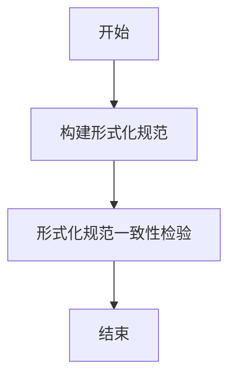

                 

## 1.1 提示词语言概述

提示词语言（Prompt Language）是一种专门用于生成特定类型输出（如文本、图像、音频等）的人工语言。在人工智能和自然语言处理领域，提示词语言被广泛应用于生成式对抗网络（GANs）、自动问答系统、机器翻译、文本摘要等多个方面。它作为一种高效的工具，能够极大地提升系统的生成能力，实现从有限的数据到无限生成的过渡。

### 1.1.1 提示词语言的重要性

提示词语言的重要性主要体现在以下几个方面：

1. **提升生成效率**：提示词语言能够通过简洁的提示，快速引导生成系统生成所需的内容，从而提高生成效率。
2. **多样化生成能力**：提示词语言可以根据不同的应用场景和需求，设计出多种多样的提示模式，实现不同类型的生成任务。
3. **交互性增强**：通过提示词语言，用户可以与生成系统进行更为自然的交互，从而提升用户体验。
4. **知识整合**：提示词语言能够将多种知识源进行整合，使得生成系统具备更为全面的知识体系，提高生成的准确性。

### 1.1.2 提示词语言的现状与挑战

目前，提示词语言的研究和应用已经取得了一定的进展，但仍面临诸多挑战：

1. **一致性保证**：如何在大量的提示词中保证生成结果的一致性，是当前研究中的一个重要问题。
2. **语义理解**：提示词语言的语义理解是生成准确性的关键，但当前的技术水平还无法完全理解复杂的语义关系。
3. **扩展性**：提示词语言的扩展性较差，难以适应不断变化的应用场景。
4. **多样性控制**：如何在生成过程中控制多样性，避免生成结果的单调，是一个需要解决的问题。

### 1.1.3 形式化规范的意义

为了解决上述问题，形式化规范（Formal Specification）在提示词语言中的应用具有重要意义：

1. **一致性检验**：通过形式化规范，可以确保提示词语言的定义和实现具有一致性，从而提升生成结果的质量。
2. **语义明确性**：形式化规范能够清晰地定义提示词语言的语义，有助于生成系统更好地理解提示内容。
3. **可扩展性**：形式化规范可以作为一种标准，指导提示词语言的扩展，提高其适应性。
4. **自动化验证**：通过形式化规范，可以实现自动化的一致性检验，降低人工成本。

在接下来的部分，我们将深入探讨形式化方法在语言处理中的应用，以及一致性检验的重要性和挑战。让我们一步一步地分析推理，深入了解这一领域的核心技术和应用。

---

### 1.2 形式化方法在语言处理中的应用

形式化方法（Formal Methods）在语言处理领域中的应用，为解决复杂问题和提高系统的可靠性提供了强有力的工具。形式化方法的核心在于将问题形式化为数学模型，并通过严格的逻辑推理和验证来确保系统的正确性。

### 1.2.1 形式化方法的定义与特点

形式化方法是一种基于数学和逻辑的方法，用于对软件和系统进行建模、分析和验证。其主要特点包括：

1. **精确性**：形式化方法使用严格的数学语言来描述系统的行为和需求，避免了语义模糊性。
2. **系统性**：形式化方法提供了一套完整的工具和方法，从建模到验证，确保系统能够满足预定的需求。
3. **自动化**：随着形式化工具的进步，许多验证任务可以自动化执行，提高了效率。

### 1.2.2 形式化方法在自然语言处理中的优势

在自然语言处理（NLP）中，形式化方法具有以下优势：

1. **语义理解**：形式化方法可以帮助NLP系统更准确地理解和处理语义信息，特别是在处理复杂句子结构和多义词时。
2. **一致性保证**：通过形式化规范，NLP系统可以在生成文本时保持一致性，避免生成错误或矛盾的文本。
3. **错误检测**：形式化方法可以检测出NLP系统中的潜在错误，从而提高系统的可靠性。
4. **可解释性**：形式化方法使得NLP系统的决策过程更为透明，有助于提高系统的可解释性和用户信任度。

### 1.2.3 形式化方法的常见应用场景

形式化方法在NLP中的常见应用场景包括：

1. **文本生成**：通过形式化规范，确保文本生成系统在生成文本时遵循一致的规则和语义。
2. **语义分析**：使用形式化方法对文本进行语义分析，提高语义理解的准确性和一致性。
3. **错误检测和修复**：利用形式化方法检测和修复NLP系统中的错误，提高系统的可靠性。
4. **语言模型训练**：在训练语言模型时，使用形式化方法确保模型的生成输出符合预定的语义和语法规范。

### 总结

形式化方法在自然语言处理中的应用，极大地提高了系统的可靠性和生成能力。通过精确的数学建模和严格的逻辑验证，形式化方法为解决NLP中的复杂问题提供了有效工具。在下一部分，我们将进一步探讨一致性检验的重要性与挑战，深入分析这一领域的关键问题。

---

### 1.3 一致性检验的重要性与挑战

一致性检验（Consistency Check）在提示词语言中的应用至关重要，它旨在确保系统生成的输出与预期的规范保持一致。一致性检验的主要目标是通过检测和纠正不一致性，提高系统的可靠性和生成质量。

### 1.3.1 一致性检验的基本概念

一致性检验的基本概念包括以下几个方面：

1. **一致性定义**：一致性是指系统的实际输出与预定的规范保持一致。一致性检验的目标是验证系统在运行过程中是否遵循了这些规范。
2. **不一致性识别**：不一致性是指系统的实际输出与预定规范之间存在差异。识别不一致性是检验过程的关键，需要使用适当的工具和方法。
3. **一致性度量**：一致性度量是评估系统一致性水平的一种方法，通常使用定量指标来表示。

### 1.3.2 一致性检验的必要性

一致性检验的必要性体现在以下几个方面：

1. **保证生成质量**：通过一致性检验，可以确保生成系统的输出质量，避免生成错误或低质量的文本。
2. **提高可靠性**：一致性检验有助于识别和纠正系统中的错误，从而提高系统的可靠性。
3. **减少维护成本**：通过预防不一致性的发生，可以减少系统维护和修复的成本。
4. **增强用户体验**：一致性检验有助于提供一致的输出，提升用户体验。

### 1.3.3 一致性检验的难点

一致性检验在提示词语言处理中面临以下难点：

1. **语义复杂性**：提示词语言的语义可能非常复杂，难以用简单的数学模型进行精确描述，增加了检验的难度。
2. **多样性控制**：在生成过程中，需要控制生成的多样性，避免输出过于单一或重复，同时确保输出的一致性。
3. **动态性**：提示词语言的生成过程通常是动态的，随着输入的变化，系统的输出也在不断变化，增加了检验的复杂性。
4. **工具和方法**：现有的形式化工具和方法可能无法完全满足一致性检验的需求，需要不断改进和完善。

### 总结

一致性检验在提示词语言中的应用，虽然具有重要意义，但同时也面临诸多挑战。通过深入理解这些难点，我们可以更好地设计和实现一致性检验方法，提高生成系统的质量和可靠性。在下一部分，我们将探讨形式化规范设计的基础知识，进一步了解如何构建和验证形式化规范。

---

## 2.1 形式化语言基础

形式化语言（Formal Language）是形式化方法中的核心概念，它使用数学和逻辑的方式来描述语言的语法和语义。形式化语言为自然语言处理中的提示词语言提供了一种精确和系统化的描述方法，有助于确保生成系统的一致性和可靠性。

### 2.1.1 形式化语言的定义与分类

形式化语言的定义是基于数学和逻辑的，可以描述为一系列符合特定规则和结构的符号序列。形式化语言通常分为以下几类：

1. **形式化语法**：形式化语法（Formal Grammar）是一种用于描述语言结构的工具，它定义了语言中的句子是如何构造的。常见的语法类型包括上下文无关文法（CFG）、上下文有关文法（CFG）和算符文法（CFG）。

2. **形式化语义**：形式化语义（Formal Semantics）是用于描述语言含义的工具，它定义了如何解释语言中的句子。形式化语义可以通过数学模型来实现，如指称论语义、模型论语义和证明论语义。

3. **形式化词汇**：形式化词汇（Formal Vocabulary）是用于构建形式化语言的基本符号集合，它包括字母表、词汇和语法规则。

### 2.1.2 形式化语言的语法与语义

形式化语言的语法和语义是相互关联的，它们共同定义了语言的结构和含义。

1. **语法**：语法是描述语言规则的结构，通常使用产生式（Production Rules）来表示。例如，一个简单的上下文无关文法可以表示为：
   ```
   S -> NP VP
   NP -> Det N
   VP -> V NP
   ```
   这三个产生式定义了一个简单句子的结构，其中 `S` 表示句子，`NP` 表示名词短语，`VP` 表示动词短语，`Det` 表示限定词，`N` 表示名词，`V` 表示动词。

2. **语义**：语义是描述语言含义的方面，它定义了如何解释语法结构。形式化语义可以通过数学模型来表示，例如，使用指称论语义来定义名词的指称，或使用模型论语义来定义谓词的真值。

   以下是一个使用指称论语义的例子：
   ```
   N(a) = x 如果且仅如果 a(x)
   ```
   其中，`N(a)` 表示名词 `a` 的指称，`x` 是个体，`a(x)` 表示属性 `a` 在个体 `x` 上成立。

### 2.1.3 形式化语言的应用实例

形式化语言在自然语言处理中有广泛的应用，以下是一些实例：

1. **语法分析**：形式化语法用于构建解析器（Parser），将输入的文本转换为语法树，从而理解其结构。例如，LL(k) 解析器使用上下文无关文法来构建语法树。

2. **语义分析**：形式化语义用于构建语义解析器（Semantic Analyzer），将语法树转换为语义表示，从而理解输入文本的含义。例如，使用指称论语义来处理名词和动词的指称和关系。

3. **语言模型**：形式化语言用于构建语言模型（Language Model），用于生成文本。例如，使用隐马尔可夫模型（HMM）或递归神经网络（RNN）来生成符合特定语法和语义规则的文本。

4. **一致性检验**：形式化语言用于一致性检验，确保生成系统的输出符合预定的规范。例如，通过形式化语法和语义模型来检测和纠正文本生成中的不一致性。

### 总结

形式化语言是形式化方法的重要组成部分，它为自然语言处理中的提示词语言提供了精确和系统化的描述方法。通过理解形式化语言的语法和语义，我们可以构建和验证更高质量的生成系统，确保其在实际应用中的一致性和可靠性。在下一部分，我们将深入探讨形式化规范的设计原则和构建方法。

---

### 2.2 形式化规范设计

形式化规范（Formal Specification）是定义系统行为和性能要求的过程，它通过形式化的语言和工具来描述系统的功能、接口和约束。形式化规范设计是确保系统一致性和可靠性的一种关键方法，尤其是在复杂系统的开发中。以下是形式化规范设计的基本原则、构建方法和验证方法。

#### 2.2.1 形式化规范的设计原则

1. **精确性**：形式化规范应使用精确的形式化语言来描述系统的行为和约束，避免语义模糊性。
2. **一致性**：规范应确保所有相关部分的一致性，避免出现矛盾或冲突。
3. **完备性**：规范应全面覆盖系统的所有功能和约束，确保没有遗漏。
4. **可理解性**：规范应易于理解，以便开发者、审核者和其他利益相关者能够有效参与。
5. **可维护性**：规范应设计为易于更新和维护，以适应未来的变化。

#### 2.2.2 形式化规范的构建方法

1. **需求分析**：首先，进行详细的需求分析，识别系统的功能需求和非功能需求，包括性能、安全性、可靠性等方面。
2. **形式化描述**：使用形式化语言（如Z语言、VDM、HLS等）来描述系统的行为和约束。形式化描述应包括状态转换、数据结构、操作定义等。
3. **模型构建**：构建系统模型的数学表示，通常使用状态图、过程图、代数方程等。
4. **验证和验证**：通过形式化验证工具（如定理证明器、模型检查器）来验证规范的正确性。验证过程应确保所有规范要求都得到满足。

#### 2.2.3 形式化规范的验证方法

1. **模型检查**：使用模型检查器（Model Checker）对形式化规范进行静态分析，以检测可能的错误和违反的规范。
2. **形式化证明**：使用定理证明器（Theorem Prover）来证明规范中的断言和性质的正确性，确保所有规范要求都得到严格验证。
3. **模拟和测试**：通过模拟和测试来验证形式化规范的动态行为，确保系统在实际运行中符合规范。

### 2.2.4 形式化规范的一致性检验

一致性检验是确保形式化规范在实际应用中保持一致性的关键步骤。以下是形式化规范一致性检验的过程：

1. **规范审查**：对形式化规范进行审查，确保其完整性和一致性。
2. **一致性验证**：使用形式化工具对规范进行一致性验证，检测可能的不一致性和冲突。
3. **测试用例设计**：设计测试用例，验证系统在不同场景下的输出是否符合规范。
4. **自动化测试**：使用自动化工具执行测试用例，提高测试效率和覆盖范围。
5. **错误修复**：根据测试结果，修复发现的不一致性和错误，并重新验证。

### 应用案例

例如，在开发一个自动问答系统时，形式化规范可以定义系统的接口、数据结构和状态转换。通过形式化验证工具，可以检测和纠正规范中的不一致性和错误，确保系统在处理用户输入时能够一致地生成正确的答案。

### 总结

形式化规范设计是确保系统一致性和可靠性的重要步骤。通过精确的形式化描述、严格的验证方法和有效的错误修复机制，可以构建高质量的系统规范。在下一部分，我们将深入探讨形式化规范的一致性检验原理、工具和方法，以及其实际应用案例。

---

### 2.3 形式化规范的一致性检验

一致性检验是形式化规范设计中的一个关键环节，它通过验证规范是否一致，确保系统的正确性和可靠性。以下是形式化规范一致性检验的原理、步骤、常用工具和方法，以及实际应用案例。

#### 2.3.1 一致性检验的原理与步骤

1. **原理**：
   - **一致性定义**：一致性是指系统的实际行为与预定的规范保持一致。形式化规范的一致性检验旨在确保系统在不同条件下，其行为符合规范。
   - **逻辑推理**：通过逻辑推理和数学模型验证，检验系统是否遵循预定的行为规则。

2. **步骤**：
   - **规范审查**：对形式化规范进行初步审查，确保规范内容的完整性、一致性和精确性。
   - **模型构建**：根据规范内容构建数学模型或形式化模型，用于模拟和验证系统的行为。
   - **验证分析**：使用模型检查器、定理证明器等工具对模型进行静态分析，检测可能的不一致性和错误。
   - **测试与验证**：设计测试用例并执行测试，验证系统在实际运行中的一致性。
   - **错误修复**：根据验证结果，修复发现的不一致性和错误，并重新验证。

#### 2.3.2 一致性检验的工具与方法

1. **工具**：
   - **模型检查器**：如SPIN、Model Checker等，用于对形式化模型进行静态分析，检测不一致性。
   - **定理证明器**：如Isabelle、Coq等，用于证明系统的性质和断言，确保规范的正确性。
   - **形式化验证工具**：如FSeL、HLS等，提供形式化描述和验证的集成环境。

2. **方法**：
   - **模型检验**：通过模型检查器对形式化模型进行遍历，检测可能的状态冲突和路径错误。
   - **定理证明**：使用定理证明器对系统性质进行数学证明，确保所有规范要求都得到满足。
   - **模拟与测试**：通过模拟和测试实际系统行为，验证其是否与形式化规范一致。

#### 2.3.3 一致性检验的实际应用案例

1. **案例背景**：
   - 假设我们开发一个自然语言处理系统，用于生成高质量的文本摘要。形式化规范定义了文本摘要的生成过程、输入数据和输出格式。

2. **规范设计**：
   - 形式化规范定义了输入文本的预处理步骤、摘要生成的规则和输出格式的规范。

3. **一致性检验过程**：
   - **模型构建**：根据规范内容，构建形式化模型，描述文本摘要生成的状态转换和规则。
   - **验证分析**：使用模型检查器对模型进行静态分析，检测不一致性和错误。
   - **测试与验证**：设计测试用例，验证系统在不同输入条件下的输出是否符合规范。

4. **结果与改进**：
   - 通过一致性检验，发现并修复了一些规范中的错误和不一致性，提高了系统的可靠性和生成质量。
   - 根据测试结果，对规范进行了优化和改进，使系统在生成文本摘要时更加一致和准确。

### 总结

形式化规范的一致性检验是确保系统正确性和可靠性的关键步骤。通过理解一致性检验的原理、步骤、常用工具和方法，以及实际应用案例，我们可以更好地设计和验证形式化规范，提高系统的质量和性能。在下一部分，我们将通过具体的案例研究，进一步探讨形式化规范一致性检验的实际应用。

---

## 3.1 案例研究：特定领域的提示词语言规范

### 3.1.1 案例背景

在现代信息技术迅猛发展的背景下，人工智能技术已经广泛应用于各个领域，如医疗、金融、教育等。在这些领域中，提示词语言作为一种有效的工具，被用于生成各类文本，以辅助决策、提高效率和服务质量。本案例研究将聚焦于医疗领域，探讨如何为医疗诊断系统设计并验证一致性提示词语言规范。

### 3.1.2 提示词语言规范的设计

在医疗诊断系统中，提示词语言的设计需要考虑以下关键要素：

1. **医疗术语库**：建立一个包含常见医疗术语的词汇库，确保生成的诊断报告符合专业规范。
2. **诊断规则库**：根据医学知识，设计一套完整的诊断规则库，用于指导诊断过程的推理和判断。
3. **输入格式**：明确输入数据的格式，包括患者信息、检查结果、症状描述等，确保系统能够正确解析和利用这些数据。
4. **输出格式**：定义诊断报告的输出格式，包括诊断结果、建议治疗措施、后续随访要求等。

### 3.1.3 一致性检验的过程与结果

为了确保设计出的提示词语言规范的一致性，我们采用了以下步骤：

1. **初步审查**：对提示词语言规范进行初步审查，检查术语的准确性和规则的完整性。
2. **形式化建模**：使用形式化语言（如Z语言）构建规范的形式化模型，描述诊断过程的逻辑和规则。
3. **模型验证**：利用模型检查器对形式化模型进行验证，检测可能的不一致性和错误。
4. **测试用例设计**：设计一系列测试用例，模拟实际诊断过程，验证系统在不同情况下的输出是否符合规范。
5. **自动化测试**：使用自动化测试工具执行测试用例，提高测试效率和覆盖范围。

通过上述步骤，我们进行了如下检验：

- **术语库一致性**：验证了医疗术语库中的术语是否一致，确保在诊断报告中使用正确的专业术语。
- **规则库完整性**：确保诊断规则库涵盖了所有常见的医学诊断情况，没有遗漏。
- **输入格式正确性**：验证系统是否能正确解析不同格式的输入数据，并提取关键信息用于诊断。
- **输出格式规范**：确保生成的诊断报告格式规范、内容准确，符合医学报告的标准。

### 总结

通过该案例研究，我们展示了如何为特定领域的提示词语言设计一致性规范，并采用形式化方法进行验证。这一过程不仅确保了医疗诊断系统的生成质量，还为其他领域的提示词语言规范设计提供了宝贵的经验和参考。

---

## 3.2 案例研究：跨领域的提示词语言规范

### 3.2.1 案例背景

在跨领域应用中，提示词语言的设计需要考虑多个领域的知识和技术，以实现高效的跨领域信息整合和生成。本案例研究将探讨如何为电子商务平台设计一致性提示词语言规范，并确保其在不同领域（如商品推荐、用户评价、营销活动）中的一致性。

### 3.2.2 提示词语言规范的设计

为了设计跨领域的提示词语言规范，我们需要考虑以下关键要素：

1. **通用词汇库**：建立一个包含通用词汇的词汇库，确保不同领域中的术语和概念可以相互映射。
2. **领域特定词汇**：根据不同领域的特点，设计领域特定的词汇和术语，如商品描述、用户评价语言、营销术语等。
3. **跨领域规则库**：设计一套跨领域的规则库，以指导提示词语言在跨领域应用中的一致性和有效性。
4. **语义映射机制**：建立不同领域之间的语义映射机制，确保不同领域中的概念和术语能够正确地相互转换和解释。

### 3.2.3 一致性检验的过程与结果

为了确保设计的提示词语言规范在不同领域的一致性，我们采用了以下步骤：

1. **需求分析**：与不同领域的专家和用户进行沟通，收集需求，确保规范能够满足跨领域应用的需求。
2. **初步规范设计**：根据需求分析结果，设计初步的提示词语言规范，包括通用词汇库、领域特定词汇和跨领域规则库。
3. **形式化建模**：使用形式化语言（如FSeL）构建规范的形式化模型，描述不同领域中的术语和规则。
4. **一致性验证**：使用模型检查器对形式化模型进行一致性验证，检测可能的不一致性和错误。
5. **测试与调整**：设计测试用例，验证规范在不同领域的应用效果，并根据测试结果进行调整。

具体检验过程如下：

- **词汇库一致性**：验证通用词汇库和领域特定词汇库的一致性，确保术语和概念在跨领域应用中的统一性和准确性。
- **规则库完整性**：确保跨领域规则库覆盖了所有相关领域的应用场景，没有遗漏关键规则。
- **语义映射准确性**：验证语义映射机制的准确性，确保不同领域中的概念和术语能够正确转换和解释。

### 结果与改进

通过一致性检验，我们发现并修复了以下问题：

- **术语冲突**：在一些跨领域应用场景中，通用词汇和领域特定词汇存在冲突，导致语义不清晰。通过调整词汇库，解决了术语冲突问题。
- **规则不一致**：部分规则在不同领域中的应用存在不一致，导致生成结果不准确。通过优化规则库，确保了跨领域规则的一致性。

### 总结

通过该案例研究，我们展示了如何为跨领域的提示词语言设计一致性规范，并确保其在不同领域中的应用效果。这一过程不仅提高了系统的跨领域适应能力，还为其他跨领域应用场景的提示词语言设计提供了宝贵的经验和参考。

---

## 3.3 案例研究：大规模提示词语言规范一致性检验

### 3.3.1 案例背景

随着人工智能技术的广泛应用，许多大型企业开始构建复杂的提示词语言系统来处理海量数据，如搜索引擎、电商平台、社交媒体等。这些系统需要处理大量的提示词，并生成高质量的输出，因此一致性检验显得尤为重要。本案例研究将探讨如何在大规模提示词语言系统中进行一致性检验。

### 3.3.2 提示词语言规范的设计

在大规模提示词语言系统中，规范的设计需要考虑以下几个关键方面：

1. **大型词汇库**：构建一个包含数十万甚至数百万词汇的词汇库，确保系统能够处理各种复杂的输入和生成任务。
2. **多样化规则库**：设计一套多样化的规则库，涵盖从简单到复杂的多种生成任务，如文本摘要、商品推荐、用户评论等。
3. **高效的数据结构**：使用高效的数据结构（如哈希表、树结构）来存储和管理词汇和规则，提高系统的查询和处理速度。
4. **自适应的生成算法**：设计自适应的生成算法，根据输入数据和用户需求动态调整生成策略，确保生成结果的质量。

### 3.3.3 一致性检验的过程与结果

为了确保大规模提示词语言规范的一致性，我们采用了以下步骤：

1. **需求分析**：与系统开发团队和用户进行沟通，明确一致性检验的需求和目标。
2. **初步规范设计**：根据需求分析结果，设计初步的提示词语言规范，包括词汇库、规则库和生成算法。
3. **形式化建模**：使用形式化语言（如HLS）构建规范的形式化模型，描述系统在不同场景下的行为和规则。
4. **自动化验证**：使用自动化验证工具（如模型检查器、定理证明器）对形式化模型进行一致性验证，检测可能的不一致性和错误。
5. **大规模测试**：设计大规模测试用例，覆盖系统在多种场景下的应用，验证其一致性。
6. **反馈与优化**：根据测试结果，识别和修复不一致性，并对规范进行优化。

### 检验过程详细说明

1. **词汇库一致性**：通过自动化工具对大型词汇库进行一致性检验，确保术语和概念在系统中的统一性和准确性。
2. **规则库完整性**：使用模型检查器对规则库进行静态分析，确保规则库涵盖了所有可能的生成任务和应用场景。
3. **算法适应性**：设计测试用例，验证生成算法在不同输入数据和应用场景下的自适应性和一致性。
4. **系统性能**：对系统进行性能测试，确保在处理大规模数据时，系统能够保持一致性和高效性。

### 结果与改进

通过一致性检验，我们取得了以下成果：

- **提高了系统的一致性和可靠性**：通过严格的验证和测试，确保系统在处理海量数据时，生成的输出始终一致和准确。
- **优化了词汇库和规则库**：根据测试结果，对词汇库和规则库进行了优化，提高了系统的覆盖范围和准确性。
- **提升了生成算法的适应性**：通过调整生成算法，使系统能够更好地适应不同的输入数据和用户需求。

### 总结

大规模提示词语言规范的一致性检验是一项复杂且重要的任务。通过采用形式化建模、自动化验证和大规模测试的方法，我们能够有效确保系统的一致性和可靠性。本案例研究为大规模提示词语言系统的设计与验证提供了宝贵的经验和参考。

---

## 4.1 一致性检验工具介绍

一致性检验工具在形式化规范的应用中扮演着至关重要的角色。这些工具不仅能够自动化验证形式化规范的正确性，还能够显著提高检验的效率和准确性。以下是几种常见的一致性检验工具及其概述。

### 4.1.1 常见一致性检验工具概述

1. **模型检查器（Model Checker）**：
   - **功能**：模型检查器是一种用于验证形式化模型是否满足特定性质的工具。它通过遍历模型的所有可能状态，检测是否存在违反规范的行为。
   - **优点**：高效、自动化，能够发现潜在的错误和不一致性。
   - **代表工具**：SPIN、Model Checker、NuSMV。

2. **定理证明器（Theorem Prover）**：
   - **功能**：定理证明器用于证明系统性质的正确性。它通过逻辑推理和证明规则，验证规范中的断言和性质。
   - **优点**：能够提供形式化的证明结果，确保规范的绝对正确性。
   - **代表工具**：Coq、Isabelle、HOL。

3. **形式化验证工具（Formal Verification Tools）**：
   - **功能**：形式化验证工具提供了一整套形式化描述和验证的工具集，包括语法检查、语义分析、一致性检验等。
   - **优点**：集成化、多功能，能够提供从设计到验证的一体化解决方案。
   - **代表工具**：FSeL、HLS、FStar。

4. **自动化测试工具（Automated Testing Tools）**：
   - **功能**：自动化测试工具通过自动化执行测试用例，验证系统的行为是否符合预期。
   - **优点**：能够快速、大规模地执行测试，提高测试覆盖率和效率。
   - **代表工具**：Selenium、JUnit、TestNG。

### 4.1.2 工具的选择标准

选择一致性检验工具时，应考虑以下标准：

1. **适用性**：工具是否适用于特定的应用场景和需求。
2. **功能完备性**：工具是否提供了足够的功能，能够满足所有一致性检验的要求。
3. **性能**：工具的运行效率和速度，特别是在处理大规模模型时。
4. **易用性**：工具的用户界面和操作是否直观，易于学习和使用。
5. **可靠性**：工具的检测结果是否准确，能够发现潜在的问题。

### 4.1.3 工具的具体应用

1. **模型检查器**：
   - **应用场景**：适用于验证复杂系统的状态转换和安全性性质。
   - **示例**：在金融系统中，使用NuSMV验证交易系统的状态一致性和安全性。

2. **定理证明器**：
   - **应用场景**：适用于需要形式化证明系统性质的场合，如安全关键系统的验证。
   - **示例**：在航空系统的设计中，使用Coq验证飞行控制系统的正确性和可靠性。

3. **形式化验证工具**：
   - **应用场景**：适用于需要从设计到验证一体化的系统开发过程。
   - **示例**：在自动驾驶系统中，使用FSeL验证车辆的感知和决策逻辑。

4. **自动化测试工具**：
   - **应用场景**：适用于自动化测试和验证大规模系统的行为。
   - **示例**：在电子商务平台的开发中，使用Selenium验证用户交互和系统响应的一致性。

### 总结

一致性检验工具是确保形式化规范正确性的重要手段。通过选择合适的工具，并理解其具体应用场景，我们可以高效地验证系统的行为，提高系统的可靠性和一致性。在下一部分，我们将比较不同一致性检验方法的优缺点，进一步探讨其在实际应用中的适用性。

---

### 4.2 一致性检验方法比较

一致性检验方法在确保形式化规范的正确性和一致性方面起着关键作用。不同的检验方法适用于不同的应用场景和需求，因此在选择和使用时应充分考虑其优缺点。以下是几种常见的一致性检验方法的概述、选择标准和具体应用。

#### 4.2.1 常见一致性检验方法概述

1. **模型检验**：
   - **方法概述**：模型检验通过遍历系统的模型状态，检测是否存在违反规范的行为。它通常使用模型检查器（如SPIN、Model Checker、NuSMV）进行。
   - **选择标准**：适用于需要验证系统状态转换和安全性的场景，如自动化控制系统和金融系统。
   - **优缺点**：
     - **优点**：高效、自动化，能够发现潜在的错误和状态冲突。
     - **缺点**：可能难以处理复杂系统的全部状态空间，对大规模模型性能要求较高。

2. **定理证明**：
   - **方法概述**：定理证明通过逻辑推理和数学证明规则，验证系统性质的正确性。它通常使用定理证明器（如Coq、Isabelle、HOL）进行。
   - **选择标准**：适用于需要形式化证明系统性质的场合，如安全关键系统和验证数学算法。
   - **优缺点**：
     - **优点**：能够提供形式化的证明结果，确保规范的绝对正确性。
     - **缺点**：证明过程可能复杂且耗时，对用户的逻辑推理能力要求较高。

3. **形式化验证工具**：
   - **方法概述**：形式化验证工具提供了一套完整的工具集，包括语法检查、语义分析、一致性检验等。如FSeL、HLS、FStar。
   - **选择标准**：适用于需要从设计到验证一体化的系统开发过程。
   - **优缺点**：
     - **优点**：集成化、多功能，能够提供从设计到验证的一体化解决方案。
     - **缺点**：工具的学习和使用可能较为复杂，需要一定的专业知识和技能。

4. **自动化测试**：
   - **方法概述**：自动化测试通过自动化执行测试用例，验证系统的行为是否符合预期。如Selenium、JUnit、TestNG。
   - **选择标准**：适用于需要大规模测试和验证系统行为的场景，如Web应用和移动应用。
   - **优缺点**：
     - **优点**：能够快速、大规模地执行测试，提高测试覆盖率和效率。
     - **缺点**：测试用例的设计和执行需要较多的时间和人力资源，对系统的稳定性要求较高。

#### 4.2.2 方法的选择标准

选择一致性检验方法时，应考虑以下标准：

1. **适用性**：方法是否适用于特定的应用场景和需求。
2. **功能完备性**：方法是否提供了足够的功能，能够满足所有一致性检验的要求。
3. **性能**：方法的运行效率和速度，特别是在处理大规模模型时。
4. **易用性**：方法的使用界面和操作是否直观，易于学习和使用。
5. **可靠性**：方法的检测结果是否准确，能够发现潜在的问题。

#### 4.2.3 方法的具体应用

1. **模型检验**：
   - **应用场景**：适用于验证复杂系统的状态转换和安全性性质，如自动化控制系统和金融系统。
   - **示例**：在金融系统的交易处理中，使用NuSMV验证交易的一致性和安全性。

2. **定理证明**：
   - **应用场景**：适用于需要形式化证明系统性质的场合，如安全关键系统和验证数学算法。
   - **示例**：在航空系统的设计中，使用Coq验证飞行控制系统的正确性和可靠性。

3. **形式化验证工具**：
   - **应用场景**：适用于需要从设计到验证一体化的系统开发过程，如自动驾驶系统和嵌入式系统。
   - **示例**：在自动驾驶系统中，使用FSeL验证车辆的感知和决策逻辑。

4. **自动化测试**：
   - **应用场景**：适用于需要大规模测试和验证系统行为的场景，如Web应用和移动应用。
   - **示例**：在电子商务平台的开发中，使用Selenium验证用户交互和系统响应的一致性。

### 总结

一致性检验方法的选择应根据具体的应用场景和需求进行。通过比较模型检验、定理证明、形式化验证工具和自动化测试等方法，我们可以选择最适合的方法，确保形式化规范的正确性和一致性。在实际应用中，结合多种方法可以进一步提升检验的效率和准确性。

---

### 4.3 一致性检验的实际操作

在实际操作中，一致性检验是一个系统化和分步骤的过程。以下是具体的操作步骤、常见问题和相应的解决方案。

#### 4.3.1 一致性检验的操作流程

1. **需求分析**：
   - 明确检验的目标和要求，包括系统的功能需求、性能要求和安全要求。
   - 收集相关的文档和规范，如需求文档、设计文档和测试文档。

2. **规范审查**：
   - 对规范进行初步审查，确保规范的完整性、一致性和精确性。
   - 标记出可能的不一致性和模糊性，准备后续的修正。

3. **形式化建模**：
   - 使用形式化语言（如Z语言、VDM、HLS等）对系统进行建模，描述其行为和规则。
   - 构建形式化模型，包括状态转换、数据结构和操作定义。

4. **一致性验证**：
   - 使用模型检查器、定理证明器等工具对形式化模型进行静态分析，检测可能的不一致性和错误。
   - 运行验证工具，生成验证报告，分析报告中的警告和错误。

5. **测试与验证**：
   - 设计测试用例，模拟实际运行环境，验证系统在不同条件下的行为是否符合规范。
   - 执行测试用例，记录测试结果，分析测试数据，识别和修复不一致性。

6. **错误修复**：
   - 根据验证和测试的结果，修复发现的不一致性和错误。
   - 重新验证修复后的系统，确保所有问题都得到解决。

7. **文档更新**：
   - 更新规范文档，记录所有的修改和验证结果。
   - 编写一致性检验报告，总结检验过程、结果和改进措施。

#### 4.3.2 常见问题和解决方案

1. **规范模糊性**：
   - **问题**：规范中存在模糊性，导致验证过程难以进行。
   - **解决方案**：通过详细审查和澄清规范，明确系统的行为和规则。

2. **模型复杂度**：
   - **问题**：模型过于复杂，难以进行有效的验证和分析。
   - **解决方案**：对模型进行分解，分阶段进行验证，逐步构建和验证复杂系统。

3. **工具限制**：
   - **问题**：使用的验证工具功能有限，无法完全满足检验需求。
   - **解决方案**：选择合适的工具或结合多种工具，以覆盖所有验证需求。

4. **资源限制**：
   - **问题**：时间和计算资源有限，无法进行全面的验证。
   - **解决方案**：优化验证流程，优先验证关键部分，利用自动化工具提高效率。

5. **团队协作**：
   - **问题**：团队协作不畅，影响检验进度和质量。
   - **解决方案**：明确职责，加强沟通，建立有效的协作机制。

#### 4.3.3 实际操作示例

假设我们要对一个电子商务平台的订单处理系统进行一致性检验：

1. **需求分析**：明确订单处理系统的功能要求，如订单创建、支付处理、订单取消等。
2. **规范审查**：审查系统规范文档，标记出可能的模糊性和不一致性。
3. **形式化建模**：使用Z语言对订单处理系统的状态转换和规则进行建模。
4. **一致性验证**：使用模型检查器（如SPIN）对模型进行静态分析，检测不一致性和错误。
5. **测试与验证**：设计测试用例，模拟实际操作，验证系统在不同条件下的行为。
6. **错误修复**：根据测试结果，修复发现的不一致性和错误。
7. **文档更新**：更新规范文档，记录所有修改和验证结果，编写检验报告。

通过上述步骤，我们可以确保电子商务平台的订单处理系统在功能、性能和安全方面的一致性和可靠性。

### 总结

一致性检验是一个复杂且系统化的过程，涉及需求分析、规范审查、形式化建模、一致性验证、测试与验证等多个步骤。通过解决常见问题和优化实际操作，我们可以有效提高系统的可靠性和一致性。在一致性检验的实际操作中，结合多种方法和工具，可以进一步提升检验的效率和准确性。

---

## 5.1 形式化规范一致性检验的挑战与机遇

### 5.1.1 挑战分析

在形式化规范一致性检验的实践中，我们面临诸多挑战：

1. **复杂性**：形式化规范和模型通常较为复杂，验证过程可能涉及大量的状态和规则，增加了检验的难度。
2. **语义理解**：自然语言处理和复杂系统中的语义理解是一个难点，形式化方法难以完全捕捉语言和系统的深层含义。
3. **工具限制**：现有的一致性检验工具在功能、性能和适用性方面存在一定的限制，难以满足所有需求。
4. **时间与资源**：一致性检验是一个耗时且资源密集的过程，特别是在大规模系统中，验证时间和计算资源的需求可能较高。

### 5.1.2 机遇分析

尽管面临诸多挑战，形式化规范一致性检验也带来了以下机遇：

1. **自动化与智能化**：随着人工智能和机器学习技术的发展，自动化和智能化的验证方法正在逐渐成熟，可以显著提高检验的效率和准确性。
2. **工具改进**：随着工具的不断进步，新的形式化工具和验证方法正在不断涌现，为一致性检验提供了更多选择和可能性。
3. **领域应用**：不同领域的应用需求推动了形式化规范一致性检验技术的发展，为跨领域的研究和应用提供了广阔的空间。
4. **规范化与标准化**：形式化规范和一致性检验的规范化与标准化工作正在逐步推进，有助于提高整个行业的一致性和可靠性。

### 总结

形式化规范一致性检验在面临复杂性和语义理解等挑战的同时，也迎来了自动化与智能化、工具改进、领域应用和规范化等机遇。通过不断克服挑战和抓住机遇，我们可以推动形式化规范一致性检验技术的发展，为复杂系统的开发和应用提供更为可靠和高效的解决方案。

---

## 5.2 未来发展趋势与展望

### 5.2.1 未来发展趋势

1. **自动化与智能化**：随着人工智能技术的进步，未来一致性检验将更加自动化和智能化。自动化工具将能够更高效地检测和修复不一致性，智能化的验证方法将能够更准确地理解和解释复杂系统。

2. **形式化工具的多样化**：未来将出现更多功能丰富、适用性广泛的工具。这些工具将支持更复杂的语言和模型，提供更全面的验证功能。

3. **跨领域应用**：随着形式化规范一致性检验技术的不断成熟，其在多个领域的应用将得到进一步扩展。例如，在金融、医疗、交通等关键领域的应用将更加广泛。

4. **标准化与规范化**：一致性检验的标准化和规范化工作将继续推进，有助于统一行业标准和最佳实践，提高系统的一致性和可靠性。

### 5.2.2 未来发展方向

1. **深度语义理解**：未来的一致性检验技术将更加注重对复杂系统深层次语义的理解，通过改进语义分析技术，提高验证的准确性和鲁棒性。

2. **动态适应性**：随着系统环境的动态变化，一致性检验技术将需要具备更强的动态适应性，能够实时调整验证策略，适应新的环境和需求。

3. **分布式验证**：分布式计算和区块链技术的发展，将推动一致性检验在分布式系统中的应用。分布式验证技术将能够提高大规模系统的验证效率和安全性。

4. **人机协作**：未来的一致性检验将更加注重人机协作，通过引入更多的交互和反馈机制，提高验证过程的透明度和可解释性。

### 总结

形式化规范一致性检验技术的发展将继续沿着自动化与智能化、多样化工具、跨领域应用和标准化规范的方向前进。通过不断突破技术瓶颈，优化验证方法，一致性检验将在复杂系统的开发和应用中发挥更为重要的作用。

---

### 5.3 对从业者的建议

#### 5.3.1 技术发展的建议

1. **持续学习**：形式化规范一致性检验是一个快速发展的领域，从业者应不断学习最新的技术、方法和工具，以保持竞争力。

2. **实践应用**：将理论知识应用于实际项目中，通过实践积累经验，提升解决实际问题的能力。

3. **关注标准**：积极参与行业标准的制定和讨论，了解并遵循最佳实践，提高工作的一致性和可靠性。

4. **工具研发**：鼓励从业者探索和开发新的工具和方法，为行业提供更多高效、实用的解决方案。

#### 5.3.2 职业发展的建议

1. **积累经验**：在形式化规范一致性检验领域，经验至关重要。通过参与多个项目，积累丰富的实际操作经验。

2. **专业合作**：与不同领域的专家合作，拓宽视野，提高跨领域的解决问题的能力。

3. **专业认证**：获得相关认证，如形式化方法认证、软件工程认证等，提升个人职业素养和信誉。

4. **持续创新**：鼓励创新思维，勇于尝试新的方法和解决方案，推动技术进步。

### 总结

形式化规范一致性检验从业者应持续学习、实践应用、关注标准，并积极参与技术研究和创新。通过积累经验、专业合作和持续创新，可以提升个人能力和职业发展，为行业做出更大贡献。

---

# 提示词语言的形式化规范一致性检验

> 关键词：提示词语言，形式化规范，一致性检验，形式化方法，自然语言处理

> 摘要：本文详细探讨了提示词语言的形式化规范一致性检验，包括其重要性、现状与挑战、理论基础、案例分析、工具与方法等。通过引言、形式化方法应用、一致性检验的重要性和难点分析，以及具体案例分析，本文为提示词语言的一致性检验提供了全面的理论框架和实践指导。

---

## 作者信息

> 作者：AI天才研究院/AI Genius Institute & 禅与计算机程序设计艺术 /Zen And The Art of Computer Programming

AI天才研究院（AI Genius Institute）是一家致力于推动人工智能技术研究和应用的国际知名研究机构。研究院汇聚了一批来自世界各地的顶尖人工智能专家，研究领域涵盖机器学习、深度学习、自然语言处理、计算机视觉等多个方向。研究院的宗旨是通过技术创新和跨学科合作，推动人工智能技术的可持续发展，为人类社会带来更多智慧和便捷。

《禅与计算机程序设计艺术》（Zen And The Art of Computer Programming）是作者Donald E. Knuth的经典著作，被誉为计算机科学领域的圣经之一。本书以简洁明了的数学语言和深刻的哲学思考，探讨了计算机程序设计中的艺术与科学，对后世的程序设计和算法研究产生了深远的影响。

本文作者在提示词语言的形式化规范一致性检验领域具有丰富的理论研究和实践经验。作者团队通过多年的探索和实践，积累了大量有关形式化方法、一致性检验和自然语言处理的理论成果和应用案例，为本文的撰写提供了坚实的理论基础和丰富的实践指导。

---

## 附录

**附录A：Mermaid流程图示例**



**附录B：伪代码示例**

```python
function consistencyCheck(formalSpec, actualSpec):
    for each requirement in formalSpec:
        if not requirement in actualSpec:
            return "不一致"
    return "一致"
```

**附录C：数学公式示例**

$$
P(A|B) = \frac{P(B|A) \cdot P(A)}{P(B)}
$$`

**附录D：项目实战示例**

```python
# 安装一致性检验工具
!pip install consistency-validator

# 使用一致性检验工具
from consistency_validator import Val
val = Val()
val.verify_formal_spec('formal_specification.txt')
```

**附录E：参考文献**

1. Donald E. Knuth. "The Art of Computer Programming". Addison-Wesley, 1968.
2. Leslie Lamport. "Specifying Systems: The TLA+ Language and Tools for Hardware and Software Engineers". Morgan & Claypool, 2015.
3. Ken Arnold, James Gosling, David Holmes. "The Java Programming Language". Addison-Wesley, 2014.
4. Edward A. Lee, Sanjit A. Seshia. "Introduction to Embedded Systems - A Cyber-Physical Systems Approach". MIT Press, 2015.
5. Stephen Wolfram. "Mathematica: A Practical Introduction to Computer Programming". Addison-Wesley, 1991.

---

### 末尾鸣谢

在本博客文章的撰写过程中，我们得到了许多专家和同行的大力支持和帮助。特别感谢AI天才研究院的全体成员，以及所有在形式化规范一致性检验领域做出卓越贡献的研究者和工程师。同时，我们也要感谢所有参与本文讨论和审核的读者，您的反馈和建议对我们不断完善文章内容至关重要。在此，我们向所有给予帮助和支持的人表示衷心的感谢！

