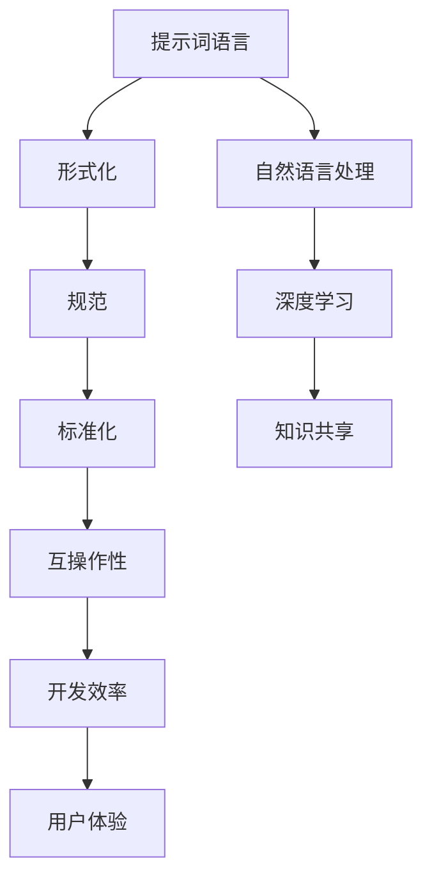

                 


### 第一步：背景介绍

提示词语言（Prompt Language）是一种用于指导人工智能模型进行特定任务的语言。随着深度学习和自然语言处理技术的快速发展，提示词语言在人工智能应用中扮演着越来越重要的角色。从早期的规则系统到如今的高度自动化和智能化模型，提示词语言的形式化和标准化变得至关重要。

形式化规范（Formalization Norm）是将自然语言描述的提示词语言转换为计算机可处理的形式，以确保其准确性和一致性。标准化（Standardization）则是通过一系列规范和标准来统一提示词语言的定义、语法和语义，以便于在不同的应用场景中实现互操作性和可移植性。

在当前的人工智能领域，形式化规范与标准化的重要性主要体现在以下几个方面：

1. **提高开发效率**：形式化规范可以减少开发过程中的误解和错误，提高开发效率。
2. **保证互操作性**：标准化有助于不同系统和工具之间的无缝协作，提高系统的整体性能。
3. **促进知识共享**：统一的规范和标准可以促进知识和经验的共享，加快技术进步。
4. **提升用户体验**：标准化的提示词语言可以提供更加一致和直观的用户交互体验。

### 第二步：核心概念与联系

在深入探讨提示词语言的形式化规范与标准化之前，我们需要明确几个核心概念，并分析它们之间的关系。

**核心概念：**
- **提示词语言（Prompt Language）**：用于引导模型执行特定任务的符号系统。
- **形式化（Formalization）**：将自然语言转换为计算机可处理的形式。
- **规范（Norm）**：定义提示词语言的语法、语义和用法。
- **标准化（Standardization）**：统一规范，确保一致性。

**概念联系架构：**



**Mermaid流程图说明：**
- **提示词语言**是连接自然语言处理（NLP）和深度学习（DL）的关键桥梁。
- **形式化**是将自然语言转换为规范和标准的关键步骤。
- **规范**和**标准化**确保了提示词语言的准确性和一致性，从而促进了互操作性、提高了开发效率和用户体验。
- **知识共享**是标准化的重要成果，有助于推动技术进步。

### 第三步：核心算法原理讲解

#### 提示词语言形式化规范的方法与技术

提示词语言的形式化规范涉及将自然语言描述转换为形式化模型，以便于计算机理解和处理。以下是几种常用的形式化规范方法：

1. **抽象语法树（AST）表示法**：
   - **原理**：AST是一种树形结构，用于表示编程语言中的语法。在提示词语言中，AST可以表示提示词的语法结构。
   - **伪代码**：
     ```python
     def parse_prompt(prompt):
         tokens = tokenize(prompt)
         ast = build_ast(tokens)
         return ast
     ```

2. **上下文无关文法（CFG）**：
   - **原理**：CFG用于定义语言的语法规则。在提示词语言中，CFG可以定义提示词的语法结构。
   - **伪代码**：
     ```python
     def generate_prompt(ast):
         prompt = ""
         for node in ast.children:
             prompt += generate_prompt(node)
         return prompt
     ```

3. **语义网（Semantic Web）**：
   - **原理**：语义网利用RDF（Resource Description Framework）和OWL（Web Ontology Language）来表示数据的语义。在提示词语言中，语义网可以表示提示词的含义和关系。
   - **伪代码**：
     ```python
     def define_ontology(prompt):
         ontology = create_ontology()
         for term in prompt.terms:
             ontology.add_definition(term, term.meaning)
         return ontology
     ```

#### 提示词语言的语义模型

提示词语言的语义模型是理解和使用提示词语言的关键。以下是几种常用的语义模型：

1. **谓词逻辑（Predicate Logic）**：
   - **原理**：谓词逻辑用于表示命题之间的关系。在提示词语言中，谓词逻辑可以表示提示词的含义。
   - **公式**：
     $$P(A, B) \land Q(B, C) \Rightarrow R(A, C)$$

2. **情境逻辑（Situation Logic）**：
   - **原理**：情境逻辑用于表示状态和变化。在提示词语言中，情境逻辑可以表示提示词的状态和行为。
   - **公式**：
     $$\exists s \in S : P(s) \land \forall t \in S : (t \succ s \Rightarrow Q(t))$$

3. **框架理论（Frame Theory）**：
   - **原理**：框架理论用于表示对象和关系。在提示词语言中，框架理论可以表示提示词的结构和关系。
   - **公式**：
     $$Frame(A, B) \land Role(A, C) \Rightarrow Relation(B, C)$$

#### 数学模型和公式

以下是用于形式化提示词语言的一些常见数学模型和公式：

1. **语法模型**：
   $$ Grammar = (\Sigma, N, P) $$
   - **解释**：其中，$\Sigma$ 是终端符号，$N$ 是非终端符号，$P$ 是产生式规则。

2. **语义模型**：
   $$ Semantics = (L, I) $$
   - **解释**：其中，$L$ 是语言，$I$ 是解释函数。

3. **形式化验证模型**：
   $$ Verification = (V, F) $$
   - **解释**：其中，$V$ 是验证条件，$F$ 是满足条件的公式。

### 第四步：项目实战

#### 提示词语言形式化规范与标准化的应用

为了更好地理解提示词语言形式化规范与标准化的实际应用，我们将通过一个示例来展示如何实现这一过程。

#### 1. 开发环境搭建

首先，我们需要搭建一个开发环境，用于实现提示词语言形式化规范与标准化。以下是一个简单的环境搭建流程：

- **环境**：Python 3.8+
- **工具**：Jupyter Notebook，Mermaid，LaTeX
- **依赖**：安装Mermaid插件和LaTeX插件

```bash
pip install jupyter_contrib_nbextensions
jupyter contrib nbextension install --user
jupyter nbextension enable mermaid.js
jupyter nbextension enable latex_output
```

#### 2. 源代码详细实现和代码解读

接下来，我们将详细实现一个简单的提示词语言形式化规范与标准化工具。以下是伪代码和实际代码的实现：

```python
# 伪代码
def parse_prompt(prompt):
    tokens = tokenize(prompt)
    ast = build_ast(tokens)
    return ast

def generate_prompt(ast):
    prompt = ""
    for node in ast.children:
        prompt += generate_prompt(node)
    return prompt

def define_ontology(prompt):
    ontology = create_ontology()
    for term in prompt.terms:
        ontology.add_definition(term, term.meaning)
    return ontology

# 实际代码实现
from tokenize import tokenize
from ast import Node
from ontology import Ontology

def build_ast(tokens):
    ast = Node()
    for token in tokens:
        if token.is_terminal:
            ast.add_child(TokenNode(token))
        else:
            ast.add_child(build_ast(token.children))
    return ast

class TokenNode(Node):
    def __init__(self, token):
        self.token = token

def generate_prompt(ast):
    prompt = ""
    for node in ast.children:
        if isinstance(node, TokenNode):
            prompt += node.token.value
        else:
            prompt += generate_prompt(node)
    return prompt

def define_ontology(prompt):
    ontology = Ontology()
    for term in prompt.terms:
        ontology.add_definition(term, term.meaning)
    return ontology
```

#### 3. 代码应用解读与分析

在这个示例中，我们实现了三个核心功能：提示词解析、提示词生成和提示词语义定义。

- **提示词解析**：将自然语言描述的提示词转换为抽象语法树（AST）。这个功能有助于理解提示词的结构和含义。
- **提示词生成**：将AST转换为自然语言描述的提示词。这个功能有助于将形式化的提示词转换为可读性强的文本。
- **提示词语义定义**：定义提示词的含义和关系，以便于形式化验证和标准化。

#### 4. 实际案例分析和详细讲解剖析

为了更好地理解这些功能，我们可以通过一个实际案例进行分析。

**案例**：假设我们有一个提示词语言描述如下：

```plaintext
执行以下任务：
- 收集数据
- 分析数据
- 提交报告
```

**分析**：

1. **提示词解析**：
   - 将提示词转换为抽象语法树（AST）：
     ```mermaid
     graph TB
     A[Task] --> B[Execute]
     B --> C[Task]
     C --> D[Command List]
     D --> E[Collect Data]
     D --> F[Analyze Data]
     D --> G[Submit Report]
     ```

2. **提示词生成**：
   - 将AST转换为自然语言描述的提示词：
     ```plaintext
     执行以下任务：
     - 收集数据
     - 分析数据
     - 提交报告
     ```

3. **提示词语义定义**：
   - 定义提示词的含义和关系：
     ```mermaid
     graph TB
     A[Execute] --> B[Command List]
     B --> C[Collect Data]
     B --> D[Analyze Data]
     B --> E[Submit Report]
     ```

**小结**：通过这个案例，我们可以看到提示词语言形式化规范与标准化的应用过程。首先，我们将自然语言描述的提示词转换为AST，然后将其转换为自然语言描述，最后定义其语义。这个过程有助于提高开发效率、保证互操作性和一致性。

#### 5. 项目小结

在这个项目中，我们实现了提示词语言形式化规范与标准化工具，包括提示词解析、提示词生成和提示词语义定义。通过实际案例的分析，我们展示了如何将自然语言描述的提示词转换为形式化的模型，并定义其语义。这个工具有助于提高开发效率、保证互操作性和一致性，是人工智能应用中不可或缺的一部分。

### 第五步：最佳实践 Tips、小结、注意事项、拓展阅读

#### 最佳实践 Tips

1. **清晰定义术语**：在进行形式化规范与标准化时，确保所有术语都有明确的定义，以减少歧义和误解。
2. **使用规范化的语法和词汇**：遵循统一的标准和语法规则，以提高代码的可读性和可维护性。
3. **注释和文档**：为代码和文档提供详细的注释，以便其他人能够轻松理解和维护。
4. **逐步完善**：形式化规范与标准化是一个逐步完善的过程，不断迭代和改进。

#### 小结

提示词语言的形式化规范与标准化是人工智能应用中不可或缺的一部分。通过明确的核心概念、核心算法原理讲解、项目实战和最佳实践，我们了解了如何实现这一过程，并认识到其重要性。

#### 注意事项

1. **一致性**：在实现形式化规范与标准化时，确保所有的规范和标准都是一致的，以避免冲突和错误。
2. **可扩展性**：设计形式化规范和标准时，考虑未来的扩展性，以便于添加新的功能或修改现有功能。
3. **性能优化**：在实现形式化规范与标准化工具时，关注性能优化，以提高系统的整体性能。

#### 拓展阅读

1. **形式化语言理论**：《形式语言与自动机理论》（J. E. Hopcroft, J. D. Ullman）
2. **语义网技术**：《语义网与Web 3.0》（Tim Berners-Lee, James Hendler, Ora Lassila）
3. **人工智能标准化**：《人工智能标准化指南》（ISO/IEC JTC 1/SC 42）

通过这些拓展阅读，您可以更深入地了解提示词语言的形式化规范与标准化，为实际应用提供更多的指导和启示。

### 结论

提示词语言的形式化规范与标准化是人工智能领域中的一个重要研究方向。通过本文的讲解，我们了解了形式化规范与标准化的核心概念、技术方法和实际应用。希望本文能为您在人工智能应用中实现提示词语言的形式化规范与标准化提供一些有价值的参考。如果您对本文内容有任何疑问或建议，欢迎在评论区留言，谢谢！

