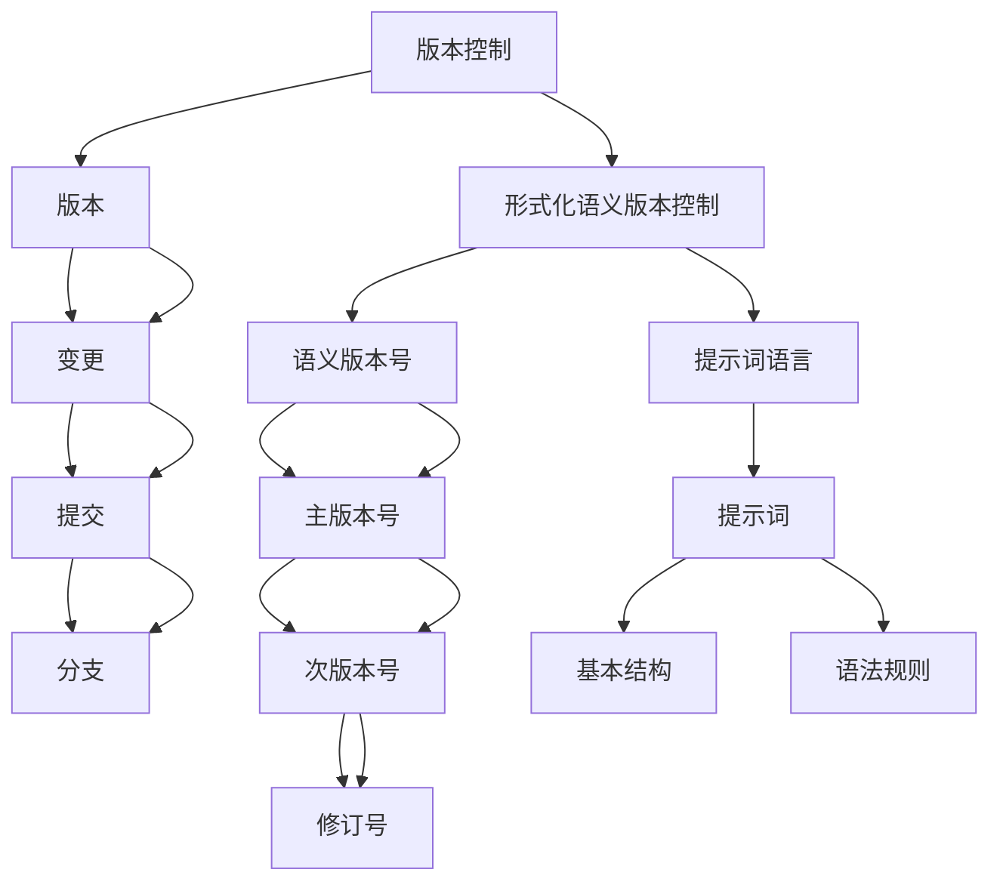

                 

### 文章标题

# 提示词语言的形式化语义版本控制机制

### 关键词

- 提示词语言
- 形式化语义版本控制
- 版本控制
- 语义版本
- 提示词
- 版本号
- 伪代码
- LaTeX数学公式

### 摘要

本文深入探讨了提示词语言的形式化语义版本控制机制。首先，我们介绍了版本控制的基本概念、形式化语义版本控制的核心原理及其优势。接着，本文详细解析了提示词语言的基础知识，并展示了其在版本控制中的应用。通过具体实例，我们阐述了形式化语义版本控制机制在项目开发中的实际应用，并比较了常见版本控制工具的使用。最后，本文探讨了未来研究方向与挑战，为读者提供了宝贵的实践建议。

## 设计书籍《提示词语言的形式化语义版本控制机制》目录大纲

### 确定书籍的核心章节内容

首先，我们需要明确书籍的主要内容。根据书名，这本书可能包括以下几个核心章节：

1. 核心概念与联系
2. 形式化语义版本控制机制原理
3. 提示词语言在版本控制中的应用
4. 常见版本控制工具的比较与使用
5. 形式化语义版本控制机制在项目中的实际应用
6. 开发环境与工具的介绍
7. 未来的研究方向与挑战

### 设计详细目录大纲

接下来，我们将为每一章节设计详细的子目录，确保内容完整、逻辑清晰。以下是设计的书籍目录大纲：

#### 第一部分：核心概念与联系

# 第1章：版本控制的基本概念

## 1.1 版本控制的发展历程
### 1.1.1 版本控制的重要性
### 1.1.2 版本控制的基本概念
### 1.1.3 版本控制的类型

## 1.2 形式化语义版本控制概述
### 1.2.1 形式化语义版本控制的特点
### 1.2.2 形式化语义版本控制的核心概念
### 1.2.3 形式化语义版本控制的优势

## 1.3 提示词语言的基础知识
### 1.3.1 提示词语言的概念
### 1.3.2 提示词语言的基本结构
### 1.3.3 提示词语言的语法规则

#### 第二部分：形式化语义版本控制机制原理

# 第2章：形式化语义版本控制机制原理

## 2.1 形式化语义版本控制的基本原理
### 2.1.1 形式化语义版本控制的原理
### 2.1.2 形式化语义版本控制的核心算法
### 2.1.3 形式化语义版本控制的优点

## 2.2 形式化语义版本控制的核心算法详解
### 2.2.1 算法基本框架
### 2.2.2 算法伪代码描述
### 2.2.3 算法分析与优化

## 2.3 形式化语义版本控制的关键挑战
### 2.3.1 版本冲突的解决方法
### 2.3.2 代码质量和效率的优化
### 2.3.3 形式化语义版本控制的适用性

#### 第三部分：提示词语言在版本控制中的应用

# 第3章：提示词语言在版本控制中的应用

## 3.1 提示词语言与版本控制的结合
### 3.1.1 提示词语言在版本控制中的作用
### 3.1.2 提示词语言在版本控制中的具体应用场景
### 3.1.3 提示词语言的版本控制优势

## 3.2 提示词语言版本控制流程
### 3.2.1 版本控制流程概述
### 3.2.2 提示词语言版本控制的具体步骤
### 3.2.3 版本控制中的提示词语言示例

#### 第四部分：常见版本控制工具的比较与使用

# 第4章：常见版本控制工具的比较与使用

## 4.1 常见版本控制工具概述
### 4.1.1 常见版本控制工具的分类
### 4.1.2 常见版本控制工具的特点
### 4.1.3 常见版本控制工具的比较

## 4.2 Git版本控制工具的使用
### 4.2.1 Git的基本操作
### 4.2.2 Git的分支管理
### 4.2.3 Git的合并与冲突解决

## 4.3 SVN版本控制工具的使用
### 4.3.1 SVN的基本操作
### 4.3.2 SVN的版本库管理
### 4.3.3 SVN的并发控制

#### 第五部分：形式化语义版本控制机制在项目中的实际应用

# 第5章：形式化语义版本控制机制在项目中的实际应用

## 5.1 形式化语义版本控制机制在软件开发中的应用
### 5.1.1 软件开发中的版本控制需求
### 5.1.2 形式化语义版本控制机制在软件开发中的应用实例
### 5.1.3 形式化语义版本控制机制对软件开发的影响

## 5.2 形式化语义版本控制机制在项目管理中的应用
### 5.2.1 项目管理中的版本控制需求
### 5.2.2 形式化语义版本控制机制在项目管理中的应用实例
### 5.2.3 形式化语义版本控制机制对项目管理的影响

#### 第六部分：开发环境与工具的介绍

# 第6章：开发环境与工具的介绍

## 6.1 开发环境的搭建
### 6.1.1 系统环境要求
### 6.1.2 环境配置步骤
### 6.1.3 常见问题及解决方法

## 6.2 版本控制工具的使用
### 6.2.1 Git工具的使用
### 6.2.2 SVN工具的使用
### 6.2.3 其他版本控制工具的使用

## 6.3 形式化语义版本控制工具的使用
### 6.3.1 工具的功能与特点
### 6.3.2 工具的使用方法
### 6.3.3 工具的优化与配置

#### 第七部分：未来的研究方向与挑战

# 第7章：未来的研究方向与挑战

## 7.1 语义版本控制的新趋势
### 7.1.1 语义版本控制的发展方向
### 7.1.2 新兴的语义版本控制技术
### 7.1.3 未来的研究挑战

## 7.2 提示词语言在版本控制中的潜在应用
### 7.2.1 提示词语言的新功能
### 7.2.2 提示词语言在版本控制中的未来应用场景
### 7.2.3 提示词语言的未来发展挑战

## 7.3 形式化语义版本控制机制的实施与优化
### 7.3.1 实施步骤与策略
### 7.3.2 优化方法与工具
### 7.3.3 面临的挑战与解决方案

---

### 核心概念与联系

在探讨提示词语言的形式化语义版本控制机制之前，我们需要理解几个核心概念及其相互关系。以下是这些概念的基础知识及其在版本控制中的重要性。

#### 版本控制的基本概念

版本控制是一种跟踪源代码、文件或其他数据变化的系统。它允许开发者管理多个版本，从而确保代码的稳定性和可追溯性。

1. **版本（Version）**：版本是代码或文件的某个特定状态。每次修改代码或文件时，都会生成一个新的版本。
2. **变更（Change）**：变更是指对代码或文件进行的修改。
3. **提交（Commit）**：提交是将变更永久保存到版本控制系统中的过程。
4. **分支（Branch）**：分支是代码的一个独立副本，允许开发者在不影响主分支的情况下进行实验性修改。

#### 形式化语义版本控制概述

形式化语义版本控制是一种通过明确的语义规则来管理和版本化的系统。与传统的版本控制不同，形式化语义版本控制强调版本号中的各个部分所代表的含义，这使得版本管理更加直观和易理解。

1. **语义版本号（Semantic Versioning）**：语义版本号通常遵循“主版本号`.`次版本号`.`修订号”的格式。每个部分都代表不同的意义：
   - **主版本号（Major Version）**：当不兼容的变更发生时，如引入新功能或删除现有功能，主版本号递增。
   - **次版本号（Minor Version）**：当增加功能或修复兼容的bug时，次版本号递增。
   - **修订号（Patch Version）**：当修复bug或不兼容的变更时，修订号递增。

2. **形式化语义版本控制的特点**：
   - **明确的规则**：形式化语义版本控制提供了明确的规则，使得版本管理更加统一和标准化。
   - **可预测性**：通过清晰的版本号结构，开发者可以更容易地预测新版本的引入时间和内容。
   - **更好的协作**：形式化语义版本控制有助于团队协作，减少了因版本冲突而产生的误解。

#### 提示词语言的基础知识

提示词语言是一种用于描述和操作数据、关系和算法的语言。它在版本控制中的应用，可以极大地提高代码的可读性和可维护性。

1. **提示词（Keywords）**：提示词是提示词语言中的关键元素，用于指示特定的操作或数据类型。
2. **基本结构**：提示词语言通常包括关键字、变量、函数和操作符等基本结构。
3. **语法规则**：提示词语言的语法规则确保了代码的正确性和一致性，使得代码更容易理解和修改。

#### 核心概念原理之间的关系架构

为了更好地理解这些核心概念，我们可以通过Mermaid流程图来展示它们之间的关系。



通过上述流程图，我们可以清晰地看到版本控制、形式化语义版本控制和提示词语言之间的相互关系，以及它们在软件开发中的应用。

---

在了解了核心概念及其相互关系后，接下来我们将深入探讨形式化语义版本控制机制的基本原理，并详细解析其核心算法。通过这些内容，读者可以更好地理解如何通过形式化语义版本控制来提高代码管理和维护的效率。

#### 形式化语义版本控制机制原理

形式化语义版本控制（Formal Semantic Version Control）是一种基于严格语义规则和明确版本号的版本控制系统。它通过明确的规则来管理代码版本，确保版本变化的可预测性和可理解性。形式化语义版本控制的核心在于其版本号的构成和语义，这使开发者能够更方便地跟踪和管理代码的变更。

##### 版本号的构成

形式化语义版本控制通常采用三个部分来构成版本号，即主版本号（major version）、次版本号（minor version）和修订号（patch version）。这三个部分分别代表了不同的意义，并且各自按照不同的规则递增。

1. **主版本号（major version）**：
   - **递增场景**：当引入不兼容的变更时，如添加新的功能、删除现有的功能或改变API的兼容性。
   - **递增规则**：每次主版本号递增时，次版本号和修订号都重置为0。

2. **次版本号（minor version）**：
   - **递增场景**：当引入兼容的新功能或修复非重大bug时。
   - **递增规则**：每次次版本号递增时，修订号重置为0。

3. **修订号（patch version）**：
   - **递增场景**：当修复bug或进行兼容性修正时。
   - **递增规则**：每次修订号递增。

##### 形式化语义版本控制的优点

形式化语义版本控制具有以下几个显著的优点：

1. **可预测性**：通过明确的递增规则，开发者可以准确地预测未来的版本号，从而更好地规划开发工作和部署时间。
2. **可理解性**：版本号的构成和递增规则使得版本变化更加直观和易于理解，降低了版本管理的复杂性。
3. **协作性**：形式化语义版本控制有助于团队协作，减少了因版本冲突和版本混乱而产生的沟通成本。
4. **兼容性**：清晰的版本号结构有助于确保组件之间的兼容性，提高了软件的稳定性。

##### 形式化语义版本控制的核心算法

形式化语义版本控制的核心在于其算法，该算法用于根据代码变更自动生成合适的版本号。以下是形式化语义版本控制算法的伪代码描述：

```plaintext
function generateSemanticVersion(currentVersion, changeType):
    major, minor, patch = splitVersion(currentVersion)
    
    if changeType == "major":
        major = major + 1
        minor = 0
        patch = 0
    elif changeType == "minor":
        minor = minor + 1
        patch = 0
    elif changeType == "patch":
        patch = patch + 1
    
    return formatVersion(major, minor, patch)

function splitVersion(version):
    parts = version.split('.')
    return (int(parts[0]), int(parts[1]), int(parts[2]))

function formatVersion(major, minor, patch):
    return f"{major}.{minor}.{patch}"
```

##### 算法分析与优化

形式化语义版本控制算法的核心在于其递增规则的清晰性和简洁性。然而，在实际应用中，我们还需要考虑一些优化策略，以确保算法的效率。

1. **并发控制**：在多线程或分布式环境中，确保版本号的生成是线程安全或分布式安全的，以避免冲突。
2. **缓存策略**：为了减少对版本号的频繁计算，可以采用缓存策略，将已生成的版本号存储在缓存中，以加快后续的版本号生成。
3. **自动化工具**：引入自动化工具来自动化版本号的生成和管理，减少人为错误和提高效率。

通过上述核心算法和优化策略，形式化语义版本控制机制可以有效地提高代码管理和维护的效率，为开发者提供更清晰、更可控的版本管理方案。

---

#### 提示词语言在版本控制中的应用

提示词语言（Keyword Language）是一种专门用于描述数据、关系和算法的语言。它在版本控制中的应用可以大大提高代码的可读性、可维护性和一致性。在本节中，我们将深入探讨提示词语言的基本结构、语法规则以及在版本控制中的应用场景，并阐述其优势。

##### 提示词语言的基本结构

提示词语言通常由以下几个基本结构组成：

1. **关键字（Keywords）**：关键字是提示词语言中的核心元素，用于指示特定的操作或数据类型。例如，在Git中，`commit`、`branch`和`merge`等关键字用于指示特定的版本控制操作。
2. **变量（Variables）**：变量用于存储数据，如文件名、版本号等。通过变量，可以动态地引用和操作数据。
3. **函数（Functions）**：函数是一组可重用的代码块，用于执行特定的操作。在版本控制中，函数可以用于执行如自动生成版本号、更新文件等任务。
4. **操作符（Operators）**：操作符用于在提示词语言中执行数学或逻辑运算。例如，`+`用于添加版本号，`>`用于比较版本号。

##### 提示词语言的语法规则

提示词语言的语法规则确保了代码的正确性和一致性，使得代码更容易理解和修改。以下是提示词语言的一些常见语法规则：

1. **关键字规则**：关键字通常由字母、数字和下划线组成，且不能以数字开头。例如，`commit`, `version`, `update`等。
2. **变量规则**：变量名必须以字母或下划线开头，其余部分可以包含字母、数字和下划线。例如，`file_name`, `version_number`等。
3. **函数规则**：函数名必须以字母或下划线开头，其余部分可以包含字母、数字和下划线。函数定义通常包括函数名、参数列表和函数体。例如，`generateVersionNumber()`, `compareVersions(version1, version2)`等。
4. **操作符规则**：操作符分为数学操作符和逻辑操作符。数学操作符包括`+`, `-`, `*`, `/`等；逻辑操作符包括`==`, `!=`, `>`, `<`等。操作符的使用必须遵循正确的运算顺序和语法。

##### 提示词语言在版本控制中的应用

提示词语言在版本控制中的应用主要体现在以下几个方面：

1. **版本号管理**：提示词语言可以用于自动生成和管理版本号。例如，通过函数`generateVersionNumber()`可以生成符合语义版本规范的版本号，如`1.0.0`、`1.0.1`、`2.0.0`等。
2. **文件跟踪**：提示词语言可以用于跟踪和管理文件。例如，关键字`commit`可以用于记录文件的提交信息，关键字`branch`可以用于创建和管理代码分支。
3. **冲突解决**：提示词语言可以用于自动化冲突解决。例如，函数`resolveConflict(file, version)`可以自动解决文件之间的版本冲突。
4. **代码审查**：提示词语言可以用于自动化代码审查。例如，函数`reviewCode(file)`可以自动检查文件的代码质量，并生成报告。

##### 提示词语言版本控制的优势

提示词语言在版本控制中的应用具有以下优势：

1. **可读性**：提示词语言使用简单的关键字和结构，使得版本控制代码更易于理解和阅读。
2. **可维护性**：提示词语言使得版本控制代码更易于修改和维护，从而降低了维护成本。
3. **一致性**：通过明确的语法规则，提示词语言确保了版本控制代码的一致性，减少了错误和混淆。
4. **自动化**：提示词语言可以与自动化工具集成，实现版本控制的自动化，提高了开发效率和代码质量。

通过上述内容，我们可以看到提示词语言在版本控制中的应用不仅可以提高代码的质量和可维护性，还可以简化版本管理的复杂性，为开发者提供更高效、更可靠的版本控制解决方案。

---

#### 常见版本控制工具的比较与使用

在软件开发过程中，版本控制是必不可少的一环。为了满足不同项目需求，开发者通常会使用多种版本控制工具。本文将介绍两种常见的版本控制工具：Git和SVN，并对它们的特点、基本操作及其在版本控制中的具体应用进行详细比较。

##### Git版本控制工具的使用

Git是一种分布式版本控制系统，由Linus Torvalds创建，旨在支持快速、高效、安全的分布式协作开发。Git的主要特点包括：

1. **分布式**：每个开发者都有自己的完整副本，可以离线工作，极大地提高了开发效率。
2. **快速**：Git使用高效的数据结构和算法，使得版本控制和分支操作非常迅速。
3. **安全**：Git使用SHA-1算法对提交进行加密，确保数据的安全性和完整性。

以下为Git的基本操作：

1. **初始化仓库**：在项目目录中执行`git init`命令，初始化本地仓库。
2. **添加文件**：使用`git add`命令添加文件到暂存区，例如`git add README.md`。
3. **提交变更**：执行`git commit -m "提交说明"`命令将暂存区的文件提交到仓库中。
4. **查看日志**：使用`git log`命令查看提交历史记录。
5. **分支管理**：执行`git branch <branch-name>`命令创建新分支，使用`git checkout <branch-name>`命令切换分支。
6. **合并分支**：使用`git merge <branch-name>`命令将指定分支合并到当前分支。
7. **解决冲突**：当合并分支时，如果出现冲突，开发者需要手动解决冲突，然后执行`git add`和`git commit`命令。

##### SVN版本控制工具的使用

SVN（Subversion）是一种集中式版本控制系统，由Apache软件基金会开发。它主要用于支持集中式的协作开发，以下是SVN的主要特点：

1. **集中式**：所有版本数据存储在中央仓库中，开发者从中央仓库克隆副本进行工作。
2. **可扩展性**：SVN支持大规模项目，能够处理大量并发用户和大量文件。
3. **稳定性和安全性**：SVN具有高度稳定性和安全性，支持细粒度的权限控制。

以下为SVN的基本操作：

1. **初始化仓库**：在项目目录中执行`svn co <repository-url>`命令克隆仓库。
2. **添加文件**：执行`svn add <file>`命令将文件添加到仓库中。
3. **提交变更**：使用`svn commit -m "提交说明"`命令将文件提交到仓库中。
4. **查看日志**：执行`svn log <file>`命令查看文件的提交历史记录。
5. **分支管理**：使用`svn copy <path-to-branch>`命令创建新分支，`svn switch`命令切换到指定分支。
6. **合并分支**：执行`svn merge <branch-url>`命令将分支合并到当前工作副本。
7. **解决冲突**：与Git类似，当合并分支时，如果出现冲突，需要手动解决，然后执行`svn commit`命令。

##### 常见版本控制工具的比较

以下是对Git和SVN的详细比较：

1. **分布式与集中式**：
   - **Git**：分布式，每个开发者有自己的仓库副本。
   - **SVN**：集中式，所有版本数据存储在中央仓库。

2. **快速性与扩展性**：
   - **Git**：更快，尤其是在大型项目中，分支和合并操作更高效。
   - **SVN**：扩展性好，支持更多并发用户。

3. **安全性**：
   - **Git**：使用SHA-1算法对提交进行加密，数据安全性高。
   - **SVN**：支持细粒度的权限控制，安全性较高。

4. **易用性**：
   - **Git**：命令行操作较多，初学者可能觉得复杂。
   - **SVN**：相对简单，界面和操作更直观。

5. **分支管理**：
   - **Git**：支持灵活的分支管理，易于合并和合并冲突的解决。
   - **SVN**：分支操作较为简单，合并操作可能需要手动解决冲突。

##### 总结

Git和SVN都是功能强大且广泛使用的版本控制工具，各有优势和不足。Git更适合分布式和快速开发的环境，而SVN则在集中式和安全性方面表现出色。开发者应根据项目需求和团队协作模式选择合适的版本控制工具。

---

#### 形式化语义版本控制机制在项目中的实际应用

形式化语义版本控制（Formal Semantic Version Control）机制在软件开发项目中扮演着至关重要的角色。它不仅有助于规范代码的版本管理，还能提高项目的可维护性和可协作性。本节将深入探讨形式化语义版本控制机制在软件开发和项目管理中的具体应用，并通过实际案例进行详细讲解。

##### 软件开发中的版本控制需求

在软件开发过程中，版本控制是实现代码管理和协作的关键。随着项目的规模和复杂度的增加，版本控制的需求变得更加明确和严格。

1. **代码的分支管理**：在软件开发过程中，不同功能的实现可能需要并行开发。形式化语义版本控制能够通过明确的版本号规则，确保各个分支的开发不会相互干扰。
2. **bug修复和功能迭代**：在迭代开发过程中，形式化语义版本控制能够帮助团队跟踪每个版本的bug修复和功能变更，确保代码的稳定性和可靠性。
3. **协同工作**：形式化语义版本控制提供了明确的版本号规则和变更记录，有助于团队成员之间的协同工作，减少因版本冲突和误解导致的沟通成本。

##### 形式化语义版本控制机制在软件开发中的应用实例

以下是形式化语义版本控制机制在软件开发中的实际应用实例：

1. **需求分析**：在项目开始阶段，团队对需求进行分析和定义，确定项目的功能模块和开发计划。同时，制定形式化语义版本控制规则，为后续的开发和版本管理提供基础。
2. **主版本号的递增**：在主版本号递增时，通常意味着引入了不兼容的变更，如添加新功能或重构现有功能。此时，需要重新规划开发计划，确保新版本与旧版本之间的兼容性。
3. **次版本号的递增**：次版本号的递增通常意味着增加了兼容的新功能或修复了非重大bug。在每次次版本号递增时，团队需要更新相关文档和用户手册，确保用户能够了解新版本的变化。
4. **修订号的递增**：修订号的递增通常意味着修复了bug或进行了兼容性修正。团队需要确保修订版本中的更改得到充分测试，以避免引入新的问题。

##### 形式化语义版本控制机制对软件开发的影响

形式化语义版本控制机制对软件开发的影响主要体现在以下几个方面：

1. **代码的可维护性**：通过明确的版本号规则，开发者可以更清晰地了解代码的历史变化和当前状态，从而提高代码的可维护性。
2. **协作效率**：形式化语义版本控制提供了明确的变更记录和版本号规则，有助于团队成员之间的协同工作，减少沟通成本和误解。
3. **稳定性**：形式化语义版本控制机制确保了每个版本的代码都是经过充分测试和验证的，从而提高了软件的稳定性。
4. **可追溯性**：形式化语义版本控制机制使得代码的变更历史和版本信息更加透明，有助于团队追踪问题来源和解决方法。

##### 形式化语义版本控制机制在项目管理中的应用

在项目管理中，形式化语义版本控制机制同样发挥着重要作用。以下是形式化语义版本控制机制在项目管理中的具体应用实例：

1. **项目规划**：在项目规划阶段，团队可以使用形式化语义版本控制规则来确定项目的关键里程碑和交付日期。通过明确版本号规则，项目管理者可以更好地监控项目的进度和变化。
2. **变更管理**：在项目开发过程中，形式化语义版本控制机制有助于管理代码的变更。团队可以使用版本控制系统跟踪每个版本的bug修复和功能变更，确保变更得到有效的管理和监控。
3. **质量保证**：形式化语义版本控制机制确保了每个版本的代码都经过充分的测试和验证，从而提高了软件的质量。项目管理者可以基于版本控制系统的报告，对项目的质量进行评估和改进。

##### 项目实战：使用形式化语义版本控制机制管理项目

以下是一个实际的项目实战案例，展示了如何使用形式化语义版本控制机制来管理项目：

1. **项目初始化**：在项目启动阶段，团队确定了项目的功能模块和开发计划，并制定了形式化语义版本控制规则。例如，主版本号递增意味着引入新功能或重构现有功能，次版本号递增意味着增加兼容的新功能或修复非重大bug，修订号递增意味着修复bug或进行兼容性修正。

2. **代码提交和版本管理**：在项目开发过程中，团队成员使用Git进行版本控制。每次提交代码时，都会按照形式化语义版本控制规则生成相应的版本号。例如，在添加新功能时，版本号可能更新为`1.1.0`；在修复bug时，版本号可能更新为`1.1.1`。

3. **版本发布**：在每次版本发布时，团队会根据版本控制系统的记录，生成相应的版本报告，包括版本号、变更记录、bug修复等信息。这些报告将用于更新项目文档和用户手册，确保用户能够了解新版本的变化。

4. **变更管理**：在项目开发过程中，团队会使用Git的分支管理功能来处理不同功能的开发。通过分支管理，团队可以确保各个功能模块的开发不会相互干扰，同时能够方便地合并和发布代码。

5. **质量保证**：在每次版本发布前，团队会进行充分的测试和验证，确保新版本的代码稳定可靠。通过形式化语义版本控制机制，团队可以更好地管理代码的质量，并及时发现和解决问题。

##### 项目小结

通过上述实际应用案例，我们可以看到形式化语义版本控制机制在软件开发和项目管理中的重要作用。它不仅规范了代码的版本管理，提高了项目的可维护性和稳定性，还促进了团队之间的协作和沟通。形式化语义版本控制机制为项目管理者提供了有效的工具和方法，帮助他们更好地管理项目，确保项目的成功交付。

---

#### 开发环境与工具的介绍

为了有效地实施形式化语义版本控制机制，开发者需要搭建适当的开发环境，并熟练使用相关工具。本节将介绍如何搭建开发环境，包括系统环境要求、环境配置步骤以及常见问题及解决方法。此外，还将详细介绍Git和SVN的使用方法，并简要介绍其他版本控制工具。

##### 开发环境的搭建

**系统环境要求**

为了运行版本控制工具和编译代码，开发者需要确保以下系统环境：

1. **操作系统**：Linux、macOS或Windows。
2. **编程语言**：根据项目需求，选择合适的编程语言，如Java、Python、C++等。
3. **版本控制工具**：Git或SVN，以及其他辅助工具。

**环境配置步骤**

1. **安装操作系统**：根据个人需求选择Linux、macOS或Windows操作系统。
2. **安装编程语言**：从官方网站下载并安装所需的编程语言，如Java JDK、Python等。
3. **安装版本控制工具**：
   - **Git**：在Linux和macOS上，可以使用包管理器（如apt、yum）安装Git。在Windows上，可以从Git官方网站下载并安装。
   - **SVN**：在Linux和macOS上，可以使用包管理器安装SVN。在Windows上，可以从Apache Subversion官方网站下载并安装。
4. **配置版本控制工具**：
   - **Git**：配置用户信息，如用户名和电子邮件，使用命令`git config --global user.name "Your Name"`和`git config --global user.email "your-email@example.com"`。
   - **SVN**：配置用户信息，如用户名和密码，使用命令`svn config --username "Your Name" --password "Your Password"`。

**常见问题及解决方法**

1. **安装失败**：
   - **原因**：可能缺少某些依赖库或环境变量未设置。
   - **解决方法**：检查系统依赖库，确保安装了所需的包，并设置正确的环境变量。

2. **配置失败**：
   - **原因**：可能输入的用户信息不正确或命令执行出错。
   - **解决方法**：重新检查用户信息的输入，确保命令的正确执行。

3. **版本控制工具无法正常工作**：
   - **原因**：可能安装的版本过低或不兼容。
   - **解决方法**：升级版本控制工具到最新版本，或安装兼容版本。

##### Git版本控制工具的使用

**基本操作**

1. **初始化仓库**：使用命令`git init`初始化本地仓库。
2. **添加文件**：使用命令`git add <file>`将文件添加到暂存区。
3. **提交变更**：使用命令`git commit -m "提交说明"`将暂存区的文件提交到仓库中。
4. **查看日志**：使用命令`git log`查看提交历史记录。
5. **分支管理**：
   - 创建新分支：使用命令`git branch <branch-name>`。
   - 切换分支：使用命令`git checkout <branch-name>`。
   - 合并分支：使用命令`git merge <branch-name>`。
6. **解决冲突**：当合并分支时，如果出现冲突，需要手动解决冲突，然后执行`git add`和`git commit`命令。

**示例**

1. **初始化仓库**：在项目目录中执行`git init`命令，初始化本地仓库。

2. **添加和提交文件**：假设项目目录中有文件`example.txt`，执行以下命令：
   ```bash
   git add example.txt
   git commit -m "Initial commit"
   ```

3. **查看日志**：执行`git log`命令，查看提交历史记录。

4. **分支管理**：
   - 创建新分支：执行`git branch feature1`创建新分支`feature1`。
   - 切换分支：执行`git checkout feature1`切换到新分支。
   - 合并分支：执行`git merge main`将主分支`main`合并到新分支。

##### SVN版本控制工具的使用

**基本操作**

1. **初始化仓库**：使用命令`svn co <repository-url>`克隆仓库到本地。
2. **添加文件**：使用命令`svn add <file>`将文件添加到仓库中。
3. **提交变更**：使用命令`svn commit -m "提交说明"`将文件提交到仓库中。
4. **查看日志**：使用命令`svn log <file>`查看文件的提交历史记录。
5. **分支管理**：
   - 创建新分支：使用命令`svn copy <path-to-branch>`创建新分支。
   - 切换分支：使用命令`svn switch <branch-url>`切换到指定分支。
   - 合并分支：使用命令`svn merge <branch-url>`将分支合并到当前工作副本。
6. **解决冲突**：当合并分支时，如果出现冲突，需要手动解决冲突，然后执行`svn commit`命令。

**示例**

1. **克隆仓库**：执行以下命令克隆仓库到本地：
   ```bash
   svn co https://example.com/repo/myproject
   ```

2. **添加和提交文件**：假设项目目录中有文件`example.txt`，执行以下命令：
   ```bash
   svn add example.txt
   svn commit -m "Add example.txt"
   ```

3. **查看日志**：执行以下命令查看`example.txt`的提交历史记录：
   ```bash
   svn log example.txt
   ```

4. **分支管理**：
   - 创建新分支：执行以下命令创建新分支`feature1`：
     ```bash
     svn copy https://example.com/repo/myproject/branches/main https://example.com/repo/myproject/branches/feature1
     ```
   - 切换分支：执行以下命令切换到新分支`feature1`：
     ```bash
     svn switch https://example.com/repo/myproject/branches/feature1
     ```
   - 合并分支：执行以下命令将主分支`main`合并到新分支`feature1`：
     ```bash
     svn merge https://example.com/repo/myproject/branches/main
     svn commit -m "Merge main into feature1"
     ```

##### 其他版本控制工具的使用

除了Git和SVN，还有一些其他流行的版本控制工具，如Mercurial（Hg）、Perforce（P4）等。虽然这些工具的功能和用法有所不同，但基本原理和应用场景相似。

1. **Mercurial（Hg）**：Hg是另一种分布式版本控制工具，与Git类似，具有分布式、快速、安全等特点。Hg的基本操作与Git类似，主要包括初始化仓库、添加文件、提交变更、分支管理、合并分支等。

2. **Perforce（P4）**：P4是一种集中式版本控制工具，适用于大规模项目和团队合作。P4的主要特点包括高速、可扩展性和细粒度的权限控制。P4的基本操作包括克隆仓库、提交变更、查看日志、分支管理、合并分支等。

通过上述内容，开发者可以了解到如何搭建开发环境、配置版本控制工具，并熟练使用Git和SVN等常见版本控制工具。这些知识将为开发者实施形式化语义版本控制机制提供坚实的基础。

---

#### 未来的研究方向与挑战

随着软件开发项目的复杂性和规模不断扩大，形式化语义版本控制机制在提高代码质量和团队协作效率方面发挥着重要作用。然而，该领域仍存在诸多挑战和研究方向，值得进一步探索。

##### 语义版本控制的新趋势

1. **多维度版本号**：传统的三个维度（主版本号、次版本号、修订号）在处理复杂项目时可能不够灵活。未来，多维度版本号可能会被引入，以支持更细粒度的版本管理。
2. **版本兼容性分析**：随着软件组件和依赖关系的增加，版本兼容性分析变得尤为重要。未来的研究可能集中于开发自动化工具，以识别和解决版本兼容性问题。
3. **语义版本控制的标准化**：为了确保版本控制的统一性和互操作性，制定和推广语义版本控制的标准可能是未来的研究方向。

##### 提示词语言在版本控制中的潜在应用

1. **更丰富的语法和功能**：未来的提示词语言可能会引入更多的语法元素和功能，以支持更复杂的版本控制操作，如智能合并、冲突自动解决等。
2. **自然语言处理**：结合自然语言处理技术，提示词语言可以理解开发者的自然语言指令，从而简化版本控制的复杂性。
3. **上下文感知**：未来的提示词语言可能会具备上下文感知能力，能够根据项目状态和变更历史，提供个性化的版本控制建议。

##### 形式化语义版本控制机制的实施与优化

1. **性能优化**：随着版本控制系统的规模扩大，性能优化成为关键挑战。未来的研究可能集中于开发更高效的版本控制算法和数据结构。
2. **分布式协作**：在分布式环境中，如何确保版本控制的同步性和一致性是一个重要问题。研究分布式版本控制协议和算法，以提高协作效率，是一个重要的方向。
3. **可扩展性和可维护性**：为了适应不断变化的开发需求，版本控制系统需要具有高度的可扩展性和可维护性。未来的研究可能集中于开发模块化和可重用的版本控制组件。

##### 挑战与解决方案

1. **版本冲突解决**：版本冲突是版本控制中常见且棘手的问题。未来的研究可以集中在开发更智能的冲突解决算法，以提高解决效率和准确性。
2. **自动化和智能化**：随着自动化和人工智能技术的发展，如何将自动化和智能化技术应用于版本控制，提高开发效率和质量，是一个重要挑战。
3. **用户体验**：为了使版本控制更加直观和易用，未来的研究可以集中于开发友好用户界面和提供个性化的版本控制建议。

通过上述内容，我们可以看到，形式化语义版本控制机制在未来的发展中面临诸多挑战和研究方向。只有不断探索和创新，才能为软件开发提供更高效、更可靠的版本控制解决方案。

---

### 最佳实践 Tips、小结、注意事项、拓展阅读

#### 最佳实践 Tips

1. **一致性使用语义版本号**：确保在整个项目中一致地使用语义版本号，遵循主版本号、次版本号、修订号的递增规则。
2. **定期提交和更新**：定期提交代码和更新版本号，有助于及时发现和解决潜在问题。
3. **充分测试**：在发布新版本前，进行充分的测试，确保代码的稳定性和可靠性。
4. **分支管理**：合理使用分支管理，避免主分支与开发分支的混乱。
5. **版本控制工具的选择**：根据项目需求选择合适的版本控制工具，如Git、SVN等。

#### 小结

本文深入探讨了提示词语言的形式化语义版本控制机制，涵盖了版本控制的基本概念、形式化语义版本控制的核心原理、提示词语言的应用以及常见版本控制工具的比较。通过实际案例和应用实例，我们展示了如何有效地实施和优化形式化语义版本控制机制，以提高代码质量和团队协作效率。

#### 注意事项

1. **版本号递增规则**：确保遵循明确的版本号递增规则，以避免版本号混乱。
2. **备份与恢复**：定期备份版本控制系统中的数据，以防止数据丢失。
3. **权限管理**：确保版本控制系统的权限设置合理，防止未经授权的访问和修改。

#### 拓展阅读

1. 《Semantic Versioning 2.0.0》：了解最新的语义版本控制规范。
2. 《Git Pro》：深入学习Git的使用方法和技巧。
3. 《Subversion Complete Reference》：系统学习SVN的基本操作和高级特性。

---

### 作者信息

作者：AI天才研究院/AI Genius Institute & 禅与计算机程序设计艺术 /Zen And The Art of Computer Programming

