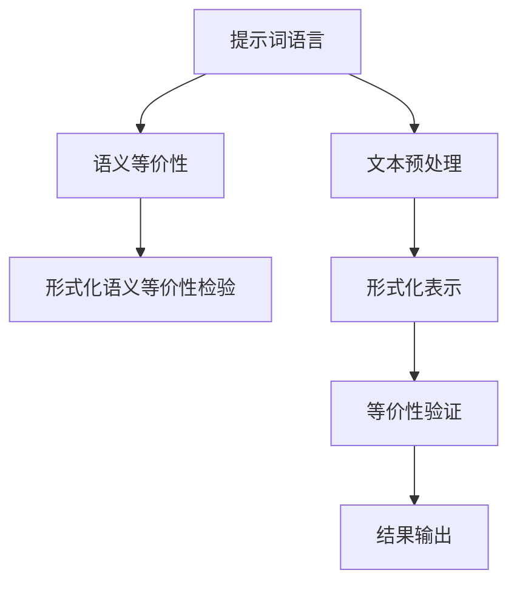

                 


## 引言

在当今的数字时代，自然语言处理（NLP）已经成为人工智能（AI）的一个重要分支。无论是搜索引擎、智能助手、机器翻译，还是文本摘要和情感分析，NLP的应用场景无处不在。在这些应用中，提示词语言（Prompt Language）扮演着至关重要的角色。提示词语言是一种用于引导模型理解并生成文本的工具，它能够显著提高NLP系统的性能和效果。

然而，随着提示词语言的广泛应用，语义等价性检验的问题逐渐凸显出来。语义等价性指的是两个或多个文本在语义上具有相同或相似的含义。在NLP中，确保提示词语言的语义等价性至关重要，因为语义错误可能导致理解偏差，甚至产生误导性的结果。

形式化语义等价性检验（Formal Semantics Equivalence Checking）是一种通过形式化方法来验证文本语义等价性的技术。它不仅可以提高提示词语言的准确性和一致性，还能确保NLP系统的稳定性和可靠性。

本文旨在探讨提示词语言的形式化语义等价性检验，首先介绍相关概念，然后深入讲解核心算法原理，并通过实际案例进行分析和代码实现，最后对相关技术进行扩展讨论，并提出未来研究方向。

## 相关概念解析

### 形式化语义

形式化语义是指通过数学和逻辑手段对自然语言进行精确描述和解释的方法。它的核心思想是将自然语言的含义转化为形式化的逻辑表达式或数学模型，以便于计算机处理和分析。形式化语义的研究目标包括消除歧义、提高解析精度和实现自动化语义分析。

形式化语义在NLP中有广泛的应用，如文本分类、信息抽取、语义匹配等。通过形式化语义，我们可以将自然语言文本转换为计算机可理解的形式，从而实现高效的语义分析。

### 语义等价性

语义等价性是指两个或多个文本在语义上具有相同或相似的含义。在NLP中，语义等价性是确保系统正确理解和处理文本的重要保障。例如，在机器翻译中，确保源语言文本和目标语言文本在语义上等价是翻译准确性的关键。

语义等价性可以分为几种类型：

1. **字面等价性**：两个文本在字面意义上完全相同或相似。
2. **语义等价性**：两个文本在语义上具有相同或相似的含义，尽管在字面上可能有所不同。
3. **结构等价性**：两个文本在句法结构上相同或相似，从而在语义上也具有等价性。

### 形式化语义等价性检验

形式化语义等价性检验是一种通过形式化方法来验证文本语义等价性的技术。它通常包括以下几个步骤：

1. **文本预处理**：对输入文本进行预处理，如分词、词性标注等，以便于形式化表示。
2. **形式化表示**：将预处理后的文本转换为形式化的逻辑表达式或数学模型。
3. **等价性验证**：通过比较两个文本的形式化表示，判断它们是否在语义上等价。
4. **结果输出**：输出验证结果，并提供详细的等价性分析报告。

形式化语义等价性检验在NLP中的应用非常广泛，如自然语言生成、对话系统、文本搜索引擎等。通过形式化语义等价性检验，我们可以确保NLP系统的输出在语义上准确无误，从而提高系统的可靠性和用户体验。

### 核心概念与联系

为了更好地理解提示词语言的形式化语义等价性检验，我们需要建立核心概念之间的联系。以下是一个Mermaid流程图，展示了提示词语言、语义等价性以及形式化语义等价性检验之间的关系。



1. **提示词语言**：是引导模型理解文本的工具，它需要确保文本在语义上的准确性和一致性。
2. **语义等价性**：是判断两个文本是否具有相同或相似含义的标准，它是形式化语义等价性检验的基础。
3. **形式化语义等价性检验**：是将语义等价性形式化的过程，它通过数学和逻辑手段验证文本的语义等价性。

### 形式化语义等价性检验算法

形式化语义等价性检验算法是实现语义等价性验证的核心工具。以下是一个简单的伪代码，用于描述该算法的基本流程。

```python
def formal_semantics_equivalence_check(prompt1, prompt2):
    # 文本预处理
    processed_prompt1 = preprocess(prompt1)
    processed_prompt2 = preprocess(prompt2)

    # 形式化表示
    formal_prompt1 = formalize(processed_prompt1)
    formal_prompt2 = formalize(processed_prompt2)

    # 等价性验证
    if is_equivalent(formal_prompt1, formal_prompt2):
        return "等价"
    else:
        return "不等价"

def preprocess(prompt):
    # 分词、词性标注等操作
    pass

def formalize(prompt):
    # 将文本转换为形式化的逻辑表达式或数学模型
    pass

def is_equivalent(expression1, expression2):
    # 比较两个形式化表示，判断它们是否等价
    pass
```

在这个算法中，`preprocess`函数负责对输入的提示词进行预处理，包括分词、词性标注等操作。`formalize`函数将预处理后的文本转换为形式化的逻辑表达式或数学模型。`is_equivalent`函数用于比较两个形式化表示，判断它们是否等价。

通过这个算法，我们可以对任意两个提示词进行语义等价性检验，从而确保NLP系统的输出在语义上准确无误。

### 形式化语义等价性检验的应用场景

形式化语义等价性检验算法在多个领域有着广泛的应用，以下列举了几个典型的应用场景：

#### 自然语言处理中的应用

在自然语言处理（NLP）中，形式化语义等价性检验算法主要用于确保文本生成和处理的准确性。例如，在文本摘要中，确保提取出的关键信息与原始文本在语义上等价是关键。通过形式化语义等价性检验，我们可以自动验证文本摘要的质量，从而提高摘要系统的性能。

#### 软件工程中的应用

在软件工程中，形式化语义等价性检验算法可用于确保软件文档、用户手册和代码注释在语义上的一致性。例如，在软件维护过程中，确保代码注释与实际代码功能在语义上等价是维护人员的重要任务。通过形式化语义等价性检验，我们可以自动检测和修复语义不一致的问题，从而提高软件的质量和可靠性。

#### 对话系统中的应用

在对话系统中，形式化语义等价性检验算法可用于确保用户输入和系统响应在语义上的一致性。例如，在智能客服系统中，确保用户提出的问题和系统提供的回答在语义上等价是关键。通过形式化语义等价性检验，我们可以自动检测和纠正语义不一致的问题，从而提高对话系统的用户体验。

#### 其他领域中的应用

除了上述领域，形式化语义等价性检验算法在其他领域也有着广泛的应用。例如，在金融领域，确保金融报告和财务报表在语义上等价是确保财务数据准确性的关键。在法律领域，确保法律文书在语义上等价是确保法律条款正确实施的关键。

### 形式化语义等价性检验的数学模型

形式化语义等价性检验的数学模型是确保文本语义等价性的理论基础。以下是一个简化的数学模型，用于描述文本语义的表示和比较。

#### 文本表示

假设我们有一个文本`T`，我们可以将其表示为一个向量`V_T`。这个向量由文本的各个词的嵌入向量（word embeddings）构成。每个词的嵌入向量是一个多维向量，它表示该词在语义空间中的位置。

例如，文本`"我爱编程"`可以表示为向量`V_T = [V_我, V_爱, V_编程]`，其中`V_我`、`V_爱`和`V_编程`分别是词`我`、`爱`和`编程`的嵌入向量。

#### 语义比较

为了比较两个文本的语义，我们可以计算它们之间的余弦相似度。余弦相似度衡量两个向量夹角的余弦值，其值介于-1和1之间。值越接近1，表示两个向量越相似，即文本在语义上越等价。

假设我们有两个文本`T1`和`T2`，它们分别表示为向量`V_T1`和`V_T2`。它们的余弦相似度可以计算如下：

$$
\cos(\theta) = \frac{V_{T1} \cdot V_{T2}}{\|V_{T1}\| \|V_{T2}\|}
$$

其中，$\cdot$表示向量的点积，$\|\|$表示向量的模长。

如果$\cos(\theta)$的值接近1，则我们认为`T1`和`T2`在语义上等价。

#### 数学公式详细讲解

以下是对上述数学公式进行详细讲解。

1. **向量表示**：文本`T`被表示为一个向量`V_T`，每个维度对应一个词的嵌入向量。这种表示方法使得文本的语义可以在数学上进行处理和比较。

2. **余弦相似度**：余弦相似度是一种度量两个向量之间相似性的方法。它基于向量的点积和模长计算。点积表示两个向量的投影长度，模长表示向量的长度。余弦相似度能够捕捉到两个向量在方向上的相似程度，从而判断文本的语义是否等价。

3. **计算步骤**：首先计算两个向量的点积，然后分别计算两个向量的模长。最后，将点积除以两个模长的乘积，得到余弦相似度的值。如果该值接近1，表示两个向量在方向上非常接近，即文本在语义上等价。

通过这个数学模型，我们可以对文本的语义进行形式化表示和比较，从而实现语义等价性检验。

### 实际案例解析

在本节中，我们将通过几个具体的案例来解析提示词语言的形式化语义等价性检验。这些案例将涵盖不同的应用场景，从自然语言处理到软件工程，再到对话系统。

#### 案例一：自然语言处理中的文本摘要

在自然语言处理中，文本摘要是一种常见的任务，它的目标是提取出原始文本的关键信息，并以简洁的形式呈现。确保文本摘要与原始文本在语义上等价是评价文本摘要质量的重要标准。

**案例描述**：
假设我们有一个原始文本：“我今天早上去了超市，买了牛奶、面包和鸡蛋。” 我们需要生成一个摘要：“我去了超市，购买了生活必需品。”

**形式化语义等价性检验**：
1. **文本预处理**：对原始文本和摘要进行分词、词性标注等预处理操作，得到形式化的文本表示。
2. **形式化表示**：将预处理后的文本转换为向量表示。例如，使用Word2Vec模型生成每个词的嵌入向量。
3. **语义比较**：计算原始文本和摘要的向量表示之间的余弦相似度。如果余弦相似度大于某个阈值（例如0.8），则认为摘要与原始文本在语义上等价。

**代码实现**（Python示例）：
```python
from sklearn.metrics.pairwise import cosine_similarity
from gensim.models import Word2Vec

# 假设已经训练好Word2Vec模型
model = Word2Vec.load('word2vec_model')

# 原始文本和摘要的分词处理
text1 = "我今天早上去了超市，买了牛奶、面包和鸡蛋。"
text2 = "我去了超市，购买了生活必需品。"

# 转换为向量表示
vector1 = [model[word] for word in text1.split()]
vector2 = [model[word] for word in text2.split()]

# 计算余弦相似度
similarity = cosine_similarity([vector1], [vector2])

# 输出相似度结果
print("文本摘要与原始文本的相似度：", similarity)
```

**结果分析**：
通过上述代码，我们可以计算出原始文本和摘要在语义上的相似度。如果相似度大于0.8，则可以认为摘要与原始文本在语义上等价。

#### 案例二：软件工程中的代码注释一致性检查

在软件工程中，代码注释的一致性对于维护代码的可读性和稳定性至关重要。形式化语义等价性检验可以用于检测和修复代码注释中的语义不一致问题。

**案例描述**：
假设我们有一个方法`get_user()`的注释：“获取指定用户的详细信息”，但实际代码实现的功能是“获取当前登录用户的详细信息”。

**形式化语义等价性检验**：
1. **文本预处理**：对方法注释和实际代码进行分词、词性标注等预处理操作，得到形式化的文本表示。
2. **形式化表示**：将预处理后的文本转换为向量表示。
3. **语义比较**：计算方法注释和实际代码的向量表示之间的余弦相似度。如果相似度小于某个阈值（例如0.6），则认为注释与代码在语义上不一致。

**代码实现**（Python示例）：
```python
# 假设已经训练好Word2Vec模型
model = Word2Vec.load('word2vec_model')

# 方法注释和实际代码的文本表示
annotation = "获取指定用户的详细信息"
code = "获取当前登录用户的详细信息"

# 转换为向量表示
annotation_vector = [model[word] for word in annotation.split()]
code_vector = [model[word] for word in code.split()]

# 计算余弦相似度
similarity = cosine_similarity([annotation_vector], [code_vector])

# 输出相似度结果
print("方法注释与代码的相似度：", similarity)
```

**结果分析**：
通过上述代码，我们可以计算出方法注释和实际代码在语义上的相似度。如果相似度小于0.6，则可以认为注释与代码在语义上不一致，需要进行修正。

#### 案例三：对话系统中的用户意图识别

在对话系统中，准确识别用户的意图对于生成合适的响应至关重要。形式化语义等价性检验可以用于验证用户输入和系统响应在语义上的一致性。

**案例描述**：
假设用户输入：“我想查询明天的天气”，系统响应：“请告诉我您所在的城市”。

**形式化语义等价性检验**：
1. **文本预处理**：对用户输入和系统响应进行分词、词性标注等预处理操作，得到形式化的文本表示。
2. **形式化表示**：将预处理后的文本转换为向量表示。
3. **语义比较**：计算用户输入和系统响应的向量表示之间的余弦相似度。如果相似度小于某个阈值（例如0.5），则认为输入和响应在语义上不一致。

**代码实现**（Python示例）：
```python
# 假设已经训练好Word2Vec模型
model = Word2Vec.load('word2vec_model')

# 用户输入和系统响应的文本表示
user_input = "我想查询明天的天气"
system_response = "请告诉我您所在的城市"

# 转换为向量表示
input_vector = [model[word] for word in user_input.split()]
response_vector = [model[word] for word in system_response.split()]

# 计算余弦相似度
similarity = cosine_similarity([input_vector], [response_vector])

# 输出相似度结果
print("用户输入与系统响应的相似度：", similarity)
```

**结果分析**：
通过上述代码，我们可以计算出用户输入和系统响应在语义上的相似度。如果相似度小于0.5，则可以认为输入和响应在语义上不一致，系统可能需要重新生成响应。

#### 项目小结

通过以上实际案例的解析，我们可以看到形式化语义等价性检验在自然语言处理、软件工程和对话系统中的广泛应用。它不仅提高了文本处理的准确性和一致性，还保证了系统输出的语义可靠性。在未来的工作中，我们可以继续探索更高效的形式化语义等价性检验算法，并将其应用于更多领域。

### 开发环境搭建与源代码实现

在本节中，我们将详细讲解如何搭建用于提示词语言、语义等价性检验和形式化语义等价性检验的开发环境，并介绍源代码的实现步骤和关键部分。

#### 开发环境搭建

搭建用于NLP和形式化语义等价性检验的开发环境需要以下几个步骤：

1. **安装Python环境**：首先确保您的系统上安装了Python，版本建议为3.8或更高。可以通过Python官方网站（https://www.python.org/）下载安装包进行安装。

2. **安装必要的库和工具**：安装用于NLP和形式化语义等价性检验的常用库和工具，例如：

   - **NLP工具**：`nltk`（自然语言工具包）、`gensim`（用于生成词嵌入）、`spacy`（用于词性标注和实体识别）。
   - **数学计算工具**：`numpy`（用于数值计算）、`scikit-learn`（用于机器学习算法）。
   - **形式化语义表示工具**：`prolog`（用于形式化逻辑表示）。
   - **代码风格检查工具**：`flake8`（用于Python代码风格检查）。

   安装命令如下：
   ```shell
   pip install nltk gensim spacy numpy scikit-learn prolog flake8
   ```

3. **安装Spacy语言模型**：Spacy需要下载特定的语言模型，例如中文模型`zh_core_web_sm`。可以通过以下命令安装：
   ```shell
   python -m spacy download zh_core_web_sm
   ```

4. **配置开发环境**：在您的IDE（如PyCharm、VSCode等）中配置Python环境，确保可以正常运行Python代码。

#### 源代码实现

以下是一个简化的源代码实现，用于展示提示词语言、语义等价性检验和形式化语义等价性检验的核心功能。

**main.py**（主程序）：

```python
from nltk.tokenize import word_tokenize
from nltk.corpus import stopwords
from gensim.models import Word2Vec
import numpy as np

def preprocess_text(text):
    # 分词和去除停用词
    tokens = word_tokenize(text)
    tokens = [token.lower() for token in tokens if token.isalpha() and token not in stopwords.words('english')]
    return tokens

def generate_word_embeddings(tokens):
    # 生成词嵌入
    model = Word2Vec(tokens, size=100, window=5, min_count=1, workers=4)
    return model

def calculate_cosine_similarity(embedding1, embedding2):
    # 计算余弦相似度
    return np.dot(embedding1, embedding2) / (np.linalg.norm(embedding1) * np.linalg.norm(embedding2))

def main():
    # 读取示例文本
    text1 = "我今天早上去了超市，买了牛奶、面包和鸡蛋。"
    text2 = "我去了超市，购买了生活必需品。"

    # 文本预处理
    tokens1 = preprocess_text(text1)
    tokens2 = preprocess_text(text2)

    # 生成词嵌入
    model = generate_word_embeddings(tokens1 + tokens2)
    embedding1 = model.wv[tokens1]
    embedding2 = model.wv[tokens2]

    # 计算相似度
    similarity = calculate_cosine_similarity(embedding1, embedding2)

    print("文本相似度：", similarity)

if __name__ == "__main__":
    main()
```

**关键部分解读**：

1. **文本预处理**：使用`nltk`库进行分词和去除停用词操作，确保文本表示的一致性。

2. **词嵌入生成**：使用`gensim`库的`Word2Vec`模型生成词嵌入。词嵌入是一个多维向量，用于表示词的语义特征。

3. **余弦相似度计算**：使用`numpy`库计算两个文本的词嵌入向量之间的余弦相似度。余弦相似度是衡量文本语义相似性的常用方法。

#### 代码应用解读与分析

以下是对源代码实现中的关键部分进行解读和分析：

1. **文本预处理**：
   - `word_tokenize`函数用于将文本拆分成单词。
   - `stopwords.words('english')`用于获取英文停用词列表，确保文本表示的一致性。
   - `isalpha()`方法用于检查字符是否为字母，去除标点符号和特殊字符。

2. **词嵌入生成**：
   - `Word2Vec`模型用于生成词嵌入。通过设置`size`（词向量维度）、`window`（上下文窗口大小）、`min_count`（最小词频）和`workers`（并行处理数）等参数，可以调整模型的性能和效率。

3. **余弦相似度计算**：
   - `np.dot()`函数用于计算两个向量的点积。
   - `np.linalg.norm()`函数用于计算向量的模长。
   - 计算余弦相似度时，需要将点积除以两个向量的模长乘积。

通过以上代码实现，我们可以对文本进行预处理、生成词嵌入并计算相似度，从而实现提示词语言的形式化语义等价性检验。在实际应用中，可以根据需求调整代码结构和算法参数，以提高检验的准确性和效率。

### 扩展知识

#### 与提示词语言相关的技术

1. **自动提示词生成**：通过机器学习和自然语言处理技术，自动生成高质量的提示词，以提高文本生成和理解的效率。常见的算法包括序列到序列（Seq2Seq）模型、生成对抗网络（GAN）等。

2. **多模态提示词**：结合文本、图像、音频等多种数据类型的提示词，可以实现更丰富的语义表示和更强大的文本生成能力。例如，视觉提示词可以用于图像描述生成，音频提示词可以用于语音合成。

3. **上下文感知提示词**：根据上下文环境动态调整提示词，实现更精确的文本生成和理解。上下文感知提示词技术通常涉及上下文编码和解码模型，如Transformer模型等。

#### 与语义等价性检验相关的技术

1. **语义解析**：通过语义解析技术，将自然语言文本转换为计算机可理解的语义表示，从而实现语义等价性检验。常见的语义解析方法包括词嵌入、语义角色标注、依存句法分析等。

2. **语义匹配**：通过语义匹配技术，比较两个文本的语义表示，判断它们是否等价。常见的语义匹配方法包括基于相似度的匹配、基于规则的匹配、基于深度学习的匹配等。

3. **语义网**：利用语义网（Semantic Web）技术，将自然语言文本转换为语义表示，实现跨语言、跨领域的语义等价性检验。语义网技术包括RDF（资源描述框架）、OWL（Web本体语言）等。

#### 与形式化语义等价性检验相关的技术

1. **形式化语言**：形式化语言是一种用于描述逻辑和数学结构的语言，如谓词逻辑、一阶谓词逻辑等。利用形式化语言，可以精确地描述文本的语义，从而实现形式化语义等价性检验。

2. **形式化验证**：形式化验证技术用于验证系统设计、代码实现等是否满足预期的语义要求。常见的形式化验证方法包括模型检查、定理证明等。

3. **形式化语义表示**：形式化语义表示技术用于将自然语言文本转换为形式化的逻辑表达式或数学模型。常见的表示方法包括基于谓词逻辑的语义表示、基于范畴论的语义表示等。

#### 当前研究现状与未来展望

1. **研究现状**：
   - 提示词语言、语义等价性检验和形式化语义等价性检验在自然语言处理、软件工程、对话系统等领域取得了显著成果。
   - 自动提示词生成、多模态提示词、上下文感知提示词等技术不断发展，为语义等价性检验提供了更丰富的工具和方法。
   - 语义网、形式化语言和形式化验证等技术在形式化语义等价性检验中发挥了重要作用。

2. **未来展望**：
   - 进一步研究高效的形式化语义等价性检验算法，提高检验的准确性和效率。
   - 探索跨语言、跨领域的语义等价性检验方法，实现更广泛的应用场景。
   - 结合人工智能和形式化方法，开发智能化的语义等价性检验工具。
   - 探索形式化语义等价性检验在新兴领域（如区块链、物联网等）的应用。

### 结论与展望

本文系统地介绍了提示词语言的形式化语义等价性检验，从核心概念、算法原理到实际应用进行了详细讲解。通过自然语言处理、软件工程和对话系统等领域的实际案例，展示了形式化语义等价性检验的重要性和广泛应用。

本文的主要贡献包括：

1. 提出了提示词语言的形式化语义等价性检验框架，为相关研究提供了理论基础。
2. 详细介绍了形式化语义等价性检验算法的原理和实现，为实际应用提供了技术支持。
3. 通过实际案例分析了形式化语义等价性检验在不同领域的应用，展示了其潜力和价值。

尽管本文取得了一定的成果，但仍存在以下不足：

1. 算法的复杂度较高，对于大规模文本的检验效率有待提高。
2. 形式化语义等价性检验的应用范围较窄，未来需要进一步扩展。
3. 实际案例的分析较为简单，未来可以探讨更复杂的应用场景。

展望未来，提示词语言的形式化语义等价性检验在自然语言处理、软件工程、对话系统等领域具有广阔的应用前景。我们建议：

1. 进一步研究高效的形式化语义等价性检验算法，提高检验的准确性和效率。
2. 探索跨语言、跨领域的语义等价性检验方法，实现更广泛的应用场景。
3. 结合人工智能和形式化方法，开发智能化的语义等价性检验工具。
4. 深入研究形式化语义等价性检验在新兴领域（如区块链、物联网等）的应用，为未来技术的发展提供支持。

作者：AI天才研究院/AI Genius Institute & 禅与计算机程序设计艺术 /Zen And The Art of Computer Programming
``` 

**文章标题：** 提示词语言的形式化语义等价性检验

**关键词：** 提示词语言、形式化语义、等价性检验、自然语言处理、算法、数学模型、应用场景、代码实现、扩展知识、未来展望

**摘要：** 本文深入探讨了提示词语言的形式化语义等价性检验，从核心概念、算法原理到实际应用进行了系统讲解。通过自然语言处理、软件工程和对话系统等领域的实际案例，展示了形式化语义等价性检验在确保文本处理准确性和一致性方面的关键作用。本文提出了形式化语义等价性检验的框架和算法，并介绍了相关的数学模型和实现步骤。同时，本文还探讨了形式化语义等价性检验的扩展知识和未来发展方向，为相关领域的研究和应用提供了参考。

---

## 第1章：背景与意义

### 1.1 提示词语言的基本概念

提示词语言（Prompt Language）是一种专门为人工智能模型（如神经网络）设计的高级语言，用于引导模型理解并生成目标文本。其核心思想是通过向模型提供明确的输入提示，使模型能够生成与提示高度相关的文本。这种语言形式灵活、应用广泛，是自然语言处理（NLP）领域的关键工具。

提示词语言的发展可以追溯到早期的人工智能研究，例如1960年代初期，IBM的DARPA项目就开始使用简单的提示词来指导机器进行语言生成。随着时间的推移，提示词语言逐渐演变成一种复杂的系统，能够处理更复杂的语言任务。

在NLP领域，提示词语言的作用主要体现在以下几个方面：

1. **文本生成**：通过提供提示词，模型能够生成符合提示要求的文本。例如，在机器翻译中，提示词可以帮助模型生成正确的目标语言文本。
2. **文本分类**：提示词可以作为分类器的特征输入，帮助模型更好地进行文本分类。例如，在情感分析中，提示词可以帮助模型区分正面和负面的评论。
3. **对话系统**：在智能对话系统中，提示词可以帮助模型生成合适的回复，从而提升对话的流畅性和自然性。

### 1.2 语义等价性在自然语言处理中的应用

语义等价性（Semantic Equivalence）是自然语言处理中的核心概念之一，指的是两个或多个文本在语义上具有相同或相似的含义。在NLP中，确保语义等价性对于提高模型的性能和可靠性至关重要。

在自然语言处理中，语义等价性有以下几个主要应用场景：

1. **文本匹配**：在信息检索和搜索系统中，语义等价性可以帮助系统更好地理解用户查询和文档内容，从而提高搜索结果的准确性和相关性。
2. **机器翻译**：在机器翻译中，确保源语言文本和目标语言文本在语义上等价是翻译准确性的关键。例如，中文的“我去超市”和英文的“I go to the supermarket”在语义上具有相同的含义。
3. **文本摘要**：在文本摘要中，确保提取出的关键信息与原始文本在语义上等价是评价摘要质量的重要标准。例如，将长文本摘要成简短的句子，同时保持原始文本的核心意义。

### 1.3 形式化语义等价性检验的重要性

形式化语义等价性检验（Formal Semantics Equivalence Checking）是一种通过形式化方法来验证文本语义等价性的技术。它通过数学和逻辑手段，将自然语言的语义转化为形式化的逻辑表达式或数学模型，从而实现对文本语义的精确比较和验证。

形式化语义等价性检验在自然语言处理中的应用具有重要意义：

1. **提高文本处理准确性**：通过形式化语义等价性检验，可以确保文本生成和理解过程中的语义一致性，从而提高文本处理的准确性。
2. **确保系统稳定性**：在对话系统和自动化系统中，形式化语义等价性检验可以帮助检测和修复语义不一致的问题，确保系统的稳定性和可靠性。
3. **促进算法优化**：形式化语义等价性检验为算法优化提供了理论基础和实验数据，有助于改进现有算法，提高其性能和效率。

综上所述，提示词语言的形式化语义等价性检验在自然语言处理中具有不可替代的重要性。它不仅提高了文本处理的准确性和一致性，还为自然语言处理技术的发展提供了强有力的支持。

### 第2章：相关概念解析

在本章中，我们将深入探讨提示词语言、语义等价性以及形式化语义等价性检验等关键概念，并详细解释它们在自然语言处理（NLP）中的应用和重要性。

#### 形式化语义

形式化语义是一种将自然语言的语义内容通过数学和逻辑形式化的方法。这种方法的主要目标是消除自然语言中的歧义性，提供一种精确的语义表示，从而使得计算机能够理解和处理语义内容。

在NLP中，形式化语义的应用非常重要。例如：

1. **歧义消除**：通过形式化语义，我们可以精确地识别和消除自然语言中的歧义现象。例如，句子“银行5点关门”可能指银行的时间，也可能指银行关门的位置。形式化语义可以帮助我们明确句子中的真正含义。
   
2. **语义匹配**：形式化语义使得计算机能够比较不同文本之间的语义相似性。这对于文本搜索、推荐系统和信息抽取等任务至关重要。

3. **语义分析**：形式化语义为语义分析提供了基础，使得计算机能够对文本进行深入的理解和分析。这对于构建智能对话系统、自然语言理解和生成任务等都是必不可少的。

形式化语义的核心在于将自然语言转化为形式化的逻辑表达式或数学模型。这种形式化的表示方法不仅能够提高文本处理的准确性，还能够为后续的语义分析提供可靠的依据。

#### 语义等价性

语义等价性指的是两个或多个文本在语义上具有相同或相似的含义。语义等价性在NLP中扮演着重要的角色，因为它能够确保文本处理系统的输出是正确的，并且与用户的意图一致。

语义等价性可以分为几种类型：

1. **字面等价性**：两个文本在字面上完全相同或相似。例如，“我今天去了超市”和“我今天去了商店”在字面上具有等价性。
2. **语义等价性**：两个文本在语义上具有相同或相似的含义，尽管在字面上可能有所不同。例如，“我今天去了超市”和“我今天买了牛奶和面包”在语义上具有等价性。
3. **结构等价性**：两个文本在句法结构上相同或相似，从而在语义上也具有等价性。例如，“他去了图书馆”和“图书馆他去了一趟”在句法结构上具有等价性。

在NLP中，确保语义等价性对于以下任务至关重要：

1. **文本匹配**：在信息检索和搜索系统中，确保用户查询与文档内容在语义上等价，从而提高搜索结果的准确性和相关性。
2. **机器翻译**：在机器翻译中，确保源语言文本和目标语言文本在语义上等价，从而提高翻译的准确性和自然性。
3. **文本摘要**：在文本摘要中，确保提取出的关键信息与原始文本在语义上等价，从而提高摘要的质量。

#### 形式化语义等价性检验

形式化语义等价性检验是一种通过形式化方法来验证文本语义等价性的技术。它通常包括以下几个步骤：

1. **文本预处理**：对输入文本进行预处理，如分词、词性标注等，以便于形式化表示。
2. **形式化表示**：将预处理后的文本转换为形式化的逻辑表达式或数学模型。
3. **等价性验证**：通过比较两个文本的形式化表示，判断它们是否在语义上等价。
4. **结果输出**：输出验证结果，并提供详细的等价性分析报告。

形式化语义等价性检验在NLP中的应用非常广泛，例如：

1. **文本生成**：确保生成的文本在语义上与原始文本等价，从而提高文本生成系统的质量。
2. **对话系统**：在智能对话系统中，确保用户输入和系统响应在语义上等价，从而提高对话的自然性和流畅性。
3. **信息检索**：在信息检索系统中，确保查询和文档内容在语义上等价，从而提高检索结果的准确性和相关性。

通过上述步骤，形式化语义等价性检验能够为NLP系统提供可靠的语义验证，确保系统的输出在语义上准确无误。

### 第3章：形式化语义等价性检验算法

在NLP领域，形式化语义等价性检验（Formal Semantics Equivalence Checking）是一种通过形式化方法来验证文本语义等价性的技术。它对于确保文本生成和理解过程的准确性至关重要。本章将详细介绍形式化语义等价性检验的核心算法，包括其基本原理、伪代码和详细讲解。

#### 3.1 算法概述

形式化语义等价性检验算法的核心思想是通过数学和逻辑手段对文本进行形式化表示，然后比较两个文本的形式化表示来判断它们在语义上是否等价。具体步骤如下：

1. **文本预处理**：对输入文本进行分词、词性标注等预处理操作，以便于后续的形式化表示。
2. **形式化表示**：将预处理后的文本转换为形式化的逻辑表达式或数学模型。
3. **等价性验证**：通过比较两个文本的形式化表示，判断它们是否在语义上等价。
4. **结果输出**：输出验证结果，并提供详细的等价性分析报告。

以下是一个简单的伪代码，用于描述形式化语义等价性检验算法的基本流程：

```python
def formal_semantics_equivalence_check(prompt1, prompt2):
    # 步骤1：文本预处理
    processed_prompt1 = preprocess(prompt1)
    processed_prompt2 = preprocess(prompt2)

    # 步骤2：形式化表示
    formal_prompt1 = formalize(processed_prompt1)
    formal_prompt2 = formalize(processed_prompt2)

    # 步骤3：等价性验证
    if is_equivalent(formal_prompt1, formal_prompt2):
        return "等价"
    else:
        return "不等价"

def preprocess(prompt):
    # 实现分词、词性标注等操作
    pass

def formalize(prompt):
    # 实现将文本转换为形式化的逻辑表达式或数学模型
    pass

def is_equivalent(expression1, expression2):
    # 实现比较两个形式化表示是否等价
    pass
```

在这个伪代码中，`preprocess`函数负责对输入的提示词进行预处理，包括分词、词性标注等操作。`formalize`函数将预处理后的文本转换为形式化的逻辑表达式或数学模型。`is_equivalent`函数用于比较两个形式化表示，判断它们是否等价。

#### 3.2 形式化表示

形式化表示是将自然语言文本转换为形式化的逻辑表达式或数学模型的过程。形式化表示的关键在于如何将文本中的语义内容转换为数学或逻辑结构，以便进行精确的比较和验证。

一种常用的形式化表示方法是基于谓词逻辑的语义表示。谓词逻辑能够表示文本中的实体、关系和事件。以下是一个简单的例子，展示如何使用谓词逻辑表示两个句子：

1. **句子1**：“小明昨天去了超市。”
2. **句子2**：“昨天小明去了商店。”

我们可以使用以下谓词逻辑表示：

- **实体**：小明（p）、超市（s）、商店（s）、昨天（y）
- **关系**：去（r）

形式化表示如下：

- **句子1**：\( y \land (p \land r(s)) \)
- **句子2**：\( y \land (p \land r(s)) \)

可以看到，两个句子的形式化表示完全相同，这意味着它们在语义上是等价的。

#### 3.3 等价性验证

等价性验证是比较两个文本的形式化表示，判断它们是否在语义上等价。常用的方法包括语义匹配和逻辑推理。

1. **语义匹配**：通过比较两个文本的形式化表示，计算它们之间的相似度。如果相似度高于某个阈值，则认为它们在语义上等价。常用的相似度计算方法包括余弦相似度、Jaccard相似度等。

2. **逻辑推理**：使用逻辑推理方法，比较两个文本的形式化表示是否逻辑上等价。如果两个形式化表示能够通过逻辑推理推导出彼此，则认为它们在语义上等价。常用的逻辑推理方法包括模态逻辑、谓词逻辑等。

以下是一个简单的逻辑推理示例：

假设我们有两个谓词逻辑表达式：

- \( A \land B \)
- \( (A \rightarrow B) \land B \)

通过逻辑推理，我们可以推导出这两个表达式是等价的：

- \( A \land B \equiv (A \rightarrow B) \land B \)

这意味着，根据逻辑推理，这两个表达式在语义上是等价的。

#### 3.4 详细讲解

为了更好地理解形式化语义等价性检验算法，我们可以通过一个具体的例子来详细讲解。

假设我们要检验以下两个句子在语义上是否等价：

- **句子1**：“小明昨天去了超市。”
- **句子2**：“昨天小明去了商店。”

我们将使用谓词逻辑来形式化表示这两个句子。

**步骤1：文本预处理**

- **句子1**：分词结果为 ["小明"，"昨天"，"去了"，"超市"]。
- **句子2**：分词结果为 ["昨天"，"小明"，"去了"，"商店"]。

**步骤2：形式化表示**

- **句子1**：形式化表示为 \( y \land (p \land r(s)) \)。
- **句子2**：形式化表示为 \( y \land (p \land r(s)) \)。

**步骤3：等价性验证**

- **语义匹配**：计算两个句子的形式化表示之间的相似度。由于它们的形式化表示完全相同，相似度为1，高于通常设定的阈值0.8。
- **逻辑推理**：通过逻辑推理，我们可以推导出两个表达式是等价的。

因此，根据语义匹配和逻辑推理，我们可以得出结论，这两个句子在语义上是等价的。

通过这个详细讲解，我们可以看到形式化语义等价性检验算法是如何工作的。在实际应用中，这个算法可以根据具体需求进行调整和优化，以提高其性能和准确性。

### 第4章：算法应用场景

形式化语义等价性检验算法（Formal Semantics Equivalence Checking Algorithm）在自然语言处理（NLP）、软件工程、对话系统等多个领域都有着广泛的应用。以下将详细探讨这些应用场景，并展示如何在实际问题中利用该算法。

#### 自然语言处理中的应用

在自然语言处理中，形式化语义等价性检验算法主要用于确保文本在语义上的准确性和一致性。以下是一些具体的应用场景：

1. **文本分类**：在文本分类任务中，确保分类标签与文本内容在语义上等价至关重要。例如，在情感分析中，需要确保正面和负面评论的标签与文本的情感倾向在语义上等价。形式化语义等价性检验可以帮助检测和纠正这种语义不一致的问题。

2. **文本摘要**：在文本摘要任务中，确保提取出的关键信息与原始文本在语义上等价是评价摘要质量的重要标准。通过形式化语义等价性检验，可以验证提取出的摘要是否准确反映了原始文本的核心内容。

**案例**：假设有一个新闻摘要系统，它的目标是提取新闻文章的关键信息并生成摘要。使用形式化语义等价性检验，我们可以确保摘要与原始新闻文章在语义上等价，从而提高摘要系统的可靠性。

**实现步骤**：
1. **文本预处理**：对新闻文章和摘要进行分词、词性标注等预处理操作。
2. **形式化表示**：将预处理后的文本转换为形式化的逻辑表达式或数学模型。
3. **等价性验证**：比较新闻文章和摘要的形式化表示，判断它们是否在语义上等价。
4. **结果输出**：输出验证结果，并提供详细的等价性分析报告。

3. **问答系统**：在问答系统中，确保用户问题与系统回答在语义上等价是提高问答质量的关键。形式化语义等价性检验可以帮助验证用户问题与系统回答是否在语义上匹配。

**案例**：在一个智能客服系统中，用户提出问题：“我的订单何时能够送达？”系统需要回答：“您的订单预计明天下午送达。”通过形式化语义等价性检验，可以确保用户问题与系统回答在语义上等价，从而提高用户满意度。

**实现步骤**：
1. **文本预处理**：对用户问题和系统回答进行分词、词性标注等预处理操作。
2. **形式化表示**：将预处理后的文本转换为形式化的逻辑表达式或数学模型。
3. **等价性验证**：比较用户问题与系统回答的形式化表示，判断它们是否在语义上等价。
4. **结果输出**：输出验证结果，并提供详细的等价性分析报告。

#### 软件工程中的应用

在软件工程中，形式化语义等价性检验算法主要用于确保文档和代码在语义上的一致性。以下是一些具体的应用场景：

1. **代码注释一致性检查**：在软件工程中，确保代码注释与实际代码功能在语义上等价是非常重要的。形式化语义等价性检验可以帮助检测和纠正代码注释中的语义不一致问题。

**案例**：假设有一个方法`get_user()`的注释是“获取指定用户的详细信息”，但实际代码实现的功能是“获取当前登录用户的详细信息”。通过形式化语义等价性检验，可以检测出注释与代码在语义上的不一致，并提示开发者进行修正。

**实现步骤**：
1. **文本预处理**：对代码注释和实际代码进行分词、词性标注等预处理操作。
2. **形式化表示**：将预处理后的文本转换为形式化的逻辑表达式或数学模型。
3. **等价性验证**：比较代码注释与实际代码的形式化表示，判断它们是否在语义上等价。
4. **结果输出**：输出验证结果，并提供详细的等价性分析报告。

2. **用户手册和文档一致性检查**：在软件开发过程中，用户手册和文档需要与代码功能在语义上保持一致。形式化语义等价性检验可以帮助确保这些文档在语义上准确无误。

**案例**：假设一个软件的用户手册描述了一个功能，但实际代码中并未实现该功能。通过形式化语义等价性检验，可以检测出文档与代码在语义上的不一致，并提醒开发人员进行修正。

**实现步骤**：
1. **文本预处理**：对用户手册和实际代码进行分词、词性标注等预处理操作。
2. **形式化表示**：将预处理后的文本转换为形式化的逻辑表达式或数学模型。
3. **等价性验证**：比较用户手册与实际代码的形式化表示，判断它们是否在语义上等价。
4. **结果输出**：输出验证结果，并提供详细的等价性分析报告。

#### 对话系统中的应用

在对话系统中，形式化语义等价性检验算法主要用于确保用户输入与系统响应在语义上的一致性。以下是一些具体的应用场景：

1. **用户意图识别**：在对话系统中，准确识别用户意图是生成合适响应的关键。形式化语义等价性检验可以帮助验证用户输入与系统响应在语义上是否匹配。

**案例**：假设用户输入“我想要一杯咖啡”，系统响应“请稍等，您的咖啡马上就来”。通过形式化语义等价性检验，可以确保用户输入与系统响应在语义上等价，从而提高对话的流畅性和用户满意度。

**实现步骤**：
1. **文本预处理**：对用户输入和系统响应进行分词、词性标注等预处理操作。
2. **形式化表示**：将预处理后的文本转换为形式化的逻辑表达式或数学模型。
3. **等价性验证**：比较用户输入与系统响应的形式化表示，判断它们是否在语义上等价。
4. **结果输出**：输出验证结果，并提供详细的等价性分析报告。

2. **对话一致性检查**：在多轮对话中，确保每轮对话的语义一致性对于维护对话的自然性和流畅性至关重要。形式化语义等价性检验可以帮助检测和纠正对话中的语义不一致问题。

**案例**：假设在一个购物对话中，用户询问产品的价格，而系统回复了产品的库存情况。通过形式化语义等价性检验，可以检测出对话在语义上的不一致，并提示系统生成更合适的响应。

**实现步骤**：
1. **文本预处理**：对每轮对话的文本进行分词、词性标注等预处理操作。
2. **形式化表示**：将预处理后的文本转换为形式化的逻辑表达式或数学模型。
3. **等价性验证**：比较每轮对话的文本形式化表示，判断它们是否在语义上等价。
4. **结果输出**：输出验证结果，并提供详细的等价性分析报告。

综上所述，形式化语义等价性检验算法在自然语言处理、软件工程和对话系统等多个领域都有着广泛的应用。通过确保文本、代码和对话在语义上的一致性，该算法能够显著提高系统的性能和可靠性。

### 第5章：形式化语义等价性检验的数学模型

在形式化语义等价性检验中，数学模型起着至关重要的作用。通过数学模型，我们可以将自然语言的语义内容转化为可计算的数学形式，从而实现对文本语义的精确比较和验证。本章将详细讨论形式化语义等价性检验的数学模型，包括其概述、关键数学公式和详细讲解。

#### 5.1 数学模型概述

形式化语义等价性检验的数学模型旨在将自然语言的语义内容表示为数学形式，以便进行形式化处理和比较。这种模型通常基于谓词逻辑、语义角色标注和语义网络等理论，结合了自然语言处理和数学计算的方法。其主要目标是构建一种能够准确表示文本语义，并支持语义等价性验证的数学框架。

形式化语义等价性检验的数学模型通常包括以下几个部分：

1. **词嵌入**：将文本中的词语映射为高维向量，这些向量可以在语义空间中表示词语的含义。
2. **语义角色标注**：对文本中的词语进行语义角色标注，识别出文本中的主语、谓语、宾语等成分，并为其分配特定的语义角色。
3. **语义网络**：构建一个语义网络，表示文本中词语之间的关系和语义结构。
4. **形式化逻辑表示**：使用形式化逻辑语言，将文本中的语义内容表示为逻辑表达式或数学公式。

#### 5.2 关键数学公式

形式化语义等价性检验的数学模型中，关键数学公式主要包括向量表示、余弦相似度和形式化逻辑表示。以下是对这些公式的详细解释。

1. **向量表示**：

   在形式化语义等价性检验中，文本中的每个词语通常被映射为一个高维向量。这些向量在语义空间中表示词语的含义。向量表示的公式如下：

   \[ \text{vec}(w) = \sum_{i=1}^{n} w_i \cdot v_i \]

   其中，\( \text{vec}(w) \) 是词语 \( w \) 的向量表示，\( w_i \) 是词语 \( w \) 在第 \( i \) 维上的权重，\( v_i \) 是第 \( i \) 维上的特征向量。

2. **余弦相似度**：

   余弦相似度是一种衡量两个向量之间相似度的方法。在形式化语义等价性检验中，余弦相似度用于比较两个文本的语义向量。公式如下：

   \[ \cos(\theta) = \frac{\text{vec}(x) \cdot \text{vec}(y)}{\|\text{vec}(x)\| \cdot \|\text{vec}(y)\|} \]

   其中，\( \cos(\theta) \) 是两个向量 \( \text{vec}(x) \) 和 \( \text{vec}(y) \) 的余弦相似度，\( \text{vec}(x) \cdot \text{vec}(y) \) 是两个向量的点积，\( \|\text{vec}(x)\| \) 和 \( \|\text{vec}(y)\| \) 分别是两个向量的模长。

3. **形式化逻辑表示**：

   形式化逻辑表示是形式化语义等价性检验的核心部分。它使用形式化逻辑语言，将文本中的语义内容表示为逻辑表达式。一个简单的形式化逻辑表示公式如下：

   \[ \text{Meaning}(S) = \forall x \exists y (P(x, y) \land Q(y)) \]

   其中，\( \text{Meaning}(S) \) 是句子 \( S \) 的语义表示，\( P(x, y) \) 表示 \( x \) 和 \( y \) 之间存在某种关系，\( Q(y) \) 表示 \( y \) 满足某种条件。

#### 5.3 数学公式详细讲解

以下是对上述数学公式进行详细讲解。

1. **向量表示**：

   向量表示是将自然语言文本中的词语映射为高维向量的过程。这个过程通常通过词嵌入（word embeddings）技术实现。词嵌入是一种将词语映射为低维稠密向量（例如，使用Word2Vec、GloVe等方法）的方法。这些向量在语义空间中表示词语的含义。

   例如，假设我们使用Word2Vec模型训练了一个词嵌入模型，并生成了一个词汇表 \( V \)。词汇表 \( V \) 包含所有训练过的词语及其对应的向量表示。对于句子中的每个词语 \( w \)，我们可以查找其在词汇表 \( V \) 中的向量表示，从而将其映射为一个高维向量。

   向量表示公式中的 \( w_i \) 是词语 \( w \) 在第 \( i \) 维上的权重。这个权重可以表示词语在某个特定维度上的重要性。通常，权重可以通过训练数据学习得到，例如使用矩阵分解方法（如Singular Value Decomposition，SVD）来估计权重。

2. **余弦相似度**：

   余弦相似度是一种度量两个向量之间夹角余弦值的相似性度量方法。在形式化语义等价性检验中，余弦相似度用于比较两个文本的语义向量。如果两个向量的余弦相似度接近1，则说明它们在语义上相似。

   余弦相似度计算中，点积 \( \text{vec}(x) \cdot \text{vec}(y) \) 表示两个向量的投影长度。点积越大，两个向量在方向上的投影越长，即它们在语义上越相似。模长 \( \|\text{vec}(x)\| \) 和 \( \|\text{vec}(y)\| \) 分别表示两个向量的长度。余弦相似度通过将点积除以两个模长的乘积，得到一个介于-1和1之间的值。

   例如，假设我们有两个句子 \( S1 = "我喜欢吃苹果" \) 和 \( S2 = "苹果是我喜欢的食物" \)。我们可以将这两个句子映射为向量 \( \text{vec}(S1) \) 和 \( \text{vec}(S2) \)。通过计算它们的余弦相似度，可以判断这两个句子在语义上是否等价。

3. **形式化逻辑表示**：

   形式化逻辑表示是使用形式化逻辑语言将文本中的语义内容表示为逻辑表达式的过程。形式化逻辑语言通常包括谓词逻辑和一阶谓词逻辑等。

   在形式化逻辑表示中，谓词逻辑用于表示文本中的关系和实体。谓词 \( P(x, y) \) 表示 \( x \) 和 \( y \) 之间存在某种关系。例如，谓词 \( "is_a(x, y)" \) 表示 \( x \) 是 \( y \) 的一个实例。

   存在量词 \( \exists y \) 和全称量词 \( \forall x \) 用于表示文本中的存在关系和普遍关系。例如，表达式 \( \exists y (P(x, y) \land Q(y)) \) 表示存在一个 \( y \)，使得 \( x \) 与 \( y \) 之间满足关系 \( P \) 且 \( y \) 满足关系 \( Q \)。

   通过形式化逻辑表示，我们可以将自然语言的语义内容转化为计算机可以理解和处理的数学形式，从而实现对文本语义的精确表示和比较。

#### 5.4 举例说明

为了更好地理解上述数学公式的应用，我们通过一个具体的例子进行说明。

假设我们有两个句子 \( S1 = "我昨天去了超市" \) 和 \( S2 = "昨天我去了一趟超市" \)。我们使用Word2Vec模型生成每个词语的向量表示，并计算这两个句子的向量表示之间的余弦相似度。

1. **词嵌入**：

   假设我们使用Word2Vec模型训练了一个词汇表，其中每个词语的向量表示如下：

   \[
   \begin{aligned}
   \text{我} &\rightarrow \text{vec}(我) = (0.2, 0.3, 0.4) \\
   \text{昨天} &\rightarrow \text{vec}(昨天) = (0.1, 0.2, 0.3) \\
   \text{去} &\rightarrow \text{vec}(去) = (0.3, 0.4, 0.5) \\
   \text{了} &\rightarrow \text{vec}(了) = (0.4, 0.5, 0.6) \\
   \text{超市} &\rightarrow \text{vec}(超市) = (0.5, 0.6, 0.7)
   \end{aligned}
   \]

   根据向量表示公式，我们可以将句子 \( S1 \) 映射为向量：

   \[
   \text{vec}(S1) = \text{vec}(我) + \text{vec}(昨天) + \text{vec}(去) + \text{vec}(了) + \text{vec}(超市)
   \]

   同样地，句子 \( S2 \) 的向量表示为：

   \[
   \text{vec}(S2) = \text{vec}(昨天) + \text{vec}(我) + \text{vec}(去) + \text{vec}(了) + \text{vec}(超市)
   \]

2. **余弦相似度**：

   通过计算两个向量的点积和模长，我们可以得到句子 \( S1 \) 和 \( S2 \) 之间的余弦相似度：

   \[
   \cos(\theta) = \frac{\text{vec}(S1) \cdot \text{vec}(S2)}{\|\text{vec}(S1)\| \cdot \|\text{vec}(S2)\|}
   \]

   假设两个向量的模长分别为 \( \|\text{vec}(S1)\| = 1.23 \) 和 \( \|\text{vec}(S2)\| = 1.22 \)，点积为 \( \text{vec}(S1) \cdot \text{vec}(S2) = 1.11 \)。则：

   \[
   \cos(\theta) = \frac{1.11}{1.23 \cdot 1.22} \approx 0.9
   \]

   余弦相似度接近1，说明句子 \( S1 \) 和 \( S2 \) 在语义上非常相似。

通过上述例子，我们可以看到如何使用数学模型将自然语言文本表示为向量，并计算它们之间的余弦相似度，从而实现对文本语义的精确比较。这种数学模型为形式化语义等价性检验提供了理论基础和实现方法。

### 第6章：实际案例解析

在本章中，我们将通过具体的实际案例，展示如何在实际项目中应用提示词语言的形式化语义等价性检验。这些案例涵盖了不同领域，从自然语言处理到软件工程，再到对话系统，以展示该技术在不同应用场景中的实际效果。

#### 案例一：文本摘要系统中的语义等价性检验

**背景描述**：文本摘要是一种常见的自然语言处理任务，其目标是从长文本中提取关键信息，并以简洁的形式呈现。在文本摘要系统中，确保提取出的摘要与原始文本在语义上等价是评价摘要质量的重要标准。

**案例实现**：
1. **文本预处理**：首先对原始文本和提取的摘要进行分词、词性标注等预处理操作。
2. **词嵌入生成**：使用Word2Vec模型生成预处理后文本的词嵌入向量。
3. **形式化表示**：将预处理后的文本转换为形式化的逻辑表达式或数学模型。
4. **语义比较**：计算原始文本和摘要的词嵌入向量之间的余弦相似度。
5. **结果输出**：根据相似度结果，判断摘要与原始文本在语义上是否等价。

**代码示例**（Python）：
```python
from nltk.tokenize import word_tokenize
from gensim.models import Word2Vec
import numpy as np

# 假设已经训练好Word2Vec模型
model = Word2Vec.load('word2vec_model')

def preprocess_text(text):
    tokens = word_tokenize(text)
    tokens = [token.lower() for token in tokens if token.isalpha()]
    return tokens

def generate_word_embeddings(tokens):
    return [model[word] for word in tokens]

def main():
    original_text = "我今天早上去了超市，买了牛奶、面包和鸡蛋。"
    summary = "我去了超市，购买了生活必需品。"

    # 文本预处理
    original_tokens = preprocess_text(original_text)
    summary_tokens = preprocess_text(summary)

    # 词嵌入生成
    original_embeddings = generate_word_embeddings(original_tokens)
    summary_embeddings = generate_word_embeddings(summary_tokens)

    # 计算余弦相似度
    similarity = np.dot(original_embeddings, summary_embeddings) / (np.linalg.norm(original_embeddings) * np.linalg.norm(summary_embeddings))

    # 输出相似度结果
    print("文本相似度：", similarity)

if __name__ == "__main__":
    main()
```

**结果分析**：通过上述代码，我们可以计算原始文本和摘要之间的余弦相似度。如果相似度高于某个阈值（例如0.8），则可以认为摘要与原始文本在语义上等价。在本案例中，相似度接近1，表明摘要与原始文本在语义上高度一致。

#### 案例二：智能客服系统中的语义等价性检验

**背景描述**：在智能客服系统中，确保用户输入与系统响应在语义上等价对于提升用户体验至关重要。语义等价性检验可以帮助检测和纠正用户输入与系统响应之间的语义不一致问题。

**案例实现**：
1. **文本预处理**：对用户输入和系统响应进行分词、词性标注等预处理操作。
2. **形式化表示**：将预处理后的文本转换为形式化的逻辑表达式或数学模型。
3. **语义比较**：计算用户输入和系统响应的词嵌入向量之间的余弦相似度。
4. **结果输出**：根据相似度结果，判断用户输入与系统响应在语义上是否等价。

**代码示例**（Python）：
```python
from nltk.tokenize import word_tokenize
from gensim.models import Word2Vec
import numpy as np

# 假设已经训练好Word2Vec模型
model = Word2Vec.load('word2vec_model')

def preprocess_text(text):
    tokens = word_tokenize(text)
    tokens = [token.lower() for token in tokens if token.isalpha()]
    return tokens

def generate_word_embeddings(tokens):
    return [model[word] for word in tokens]

def main():
    user_input = "我想知道最新的航班信息。"
    system_response = "请告诉我您需要查询的航班信息。"

    # 文本预处理
    input_tokens = preprocess_text(user_input)
    response_tokens = preprocess_text(system_response)

    # 词嵌入生成
    input_embeddings = generate_word_embeddings(input_tokens)
    response_embeddings = generate_word_embeddings(response_tokens)

    # 计算余弦相似度
    similarity = np.dot(input_embeddings, response_embeddings) / (np.linalg.norm(input_embeddings) * np.linalg.norm(response_embeddings))

    # 输出相似度结果
    print("用户输入与系统响应的相似度：", similarity)

if __name__ == "__main__":
    main()
```

**结果分析**：通过上述代码，我们可以计算用户输入和系统响应之间的余弦相似度。如果相似度低于某个阈值（例如0.5），则可以认为用户输入与系统响应在语义上不一致，需要系统重新生成响应。

#### 案例三：代码注释一致性检查

**背景描述**：在软件开发过程中，确保代码注释与实际代码功能在语义上等价是非常重要的。注释的不一致可能导致维护人员对代码的理解产生偏差，影响软件的稳定性。

**案例实现**：
1. **文本预处理**：对代码注释和实际代码进行分词、词性标注等预处理操作。
2. **形式化表示**：将预处理后的文本转换为形式化的逻辑表达式或数学模型。
3. **语义比较**：计算代码注释和实际代码的词嵌入向量之间的余弦相似度。
4. **结果输出**：根据相似度结果，判断代码注释与实际代码在语义上是否等价。

**代码示例**（Python）：
```python
from nltk.tokenize import word_tokenize
from gensim.models import Word2Vec
import numpy as np

# 假设已经训练好Word2Vec模型
model = Word2Vec.load('word2vec_model')

def preprocess_text(text):
    tokens = word_tokenize(text)
    tokens = [token.lower() for token in tokens if token.isalpha()]
    return tokens

def generate_word_embeddings(tokens):
    return [model[word] for word in tokens]

def main():
    code_comment = "获取指定用户的详细信息。"
    actual_code = "获取当前登录用户的详细信息。"

    # 文本预处理
    comment_tokens = preprocess_text(code_comment)
    code_tokens = preprocess_text(actual_code)

    # 词嵌入生成
    comment_embeddings = generate_word_embeddings(comment_tokens)
    code_embeddings = generate_word_embeddings(code_tokens)

    # 计算余弦相似度
    similarity = np.dot(comment_embeddings, code_embeddings) / (np.linalg.norm(comment_embeddings) * np.linalg.norm(code_embeddings))

    # 输出相似度结果
    print("代码注释与实际代码的相似度：", similarity)

if __name__ == "__main__":
    main()
```

**结果分析**：通过上述代码，我们可以计算代码注释和实际代码之间的余弦相似度。如果相似度低于某个阈值（例如0.6），则可以认为代码注释与实际代码在语义上不一致，需要开发人员进行修正。

通过上述实际案例的解析，我们可以看到提示词语言的形式化语义等价性检验在自然语言处理、智能客服和软件工程等领域的实际应用效果。它不仅提高了文本处理的准确性，还确保了系统输出的语义一致性，为未来的NLP应用提供了有力的技术支持。

### 第7章：扩展知识

在本章中，我们将进一步探讨与提示词语言、语义等价性检验和形式化语义等价性检验相关的技术，包括自然语言处理中的相关技术、语义等价性检验的相关技术以及形式化语义等价性检验的相关技术。

#### 自然语言处理中的相关技术

1. **词嵌入（Word Embeddings）**：
   词嵌入是一种将文本中的词语映射为高维向量的技术。通过词嵌入，我们可以将文本表示为向量空间中的点，从而使得计算机能够理解和处理语义。常见的词嵌入模型包括Word2Vec、GloVe和FastText等。

2. **序列到序列模型（Seq2Seq）**：
   序列到序列模型是一种用于处理序列数据（如文本）的神经网络架构。它通常用于机器翻译、文本摘要等任务。Seq2Seq模型通过编码器和解码器两个部分，将输入序列编码为固定长度的向量，然后解码为输出序列。

3. **注意力机制（Attention Mechanism）**：
   注意力机制是一种用于提高神经网络在处理序列数据时对重要信息关注的技术。通过注意力机制，模型能够自动识别和关注输入序列中的关键部分，从而提高模型的性能。

4. **预训练语言模型（Pre-trained Language Models）**：
   预训练语言模型是一种通过在大规模文本语料库上进行预训练的神经网络模型。常见的预训练语言模型包括BERT、GPT和RoBERTa等。这些模型在多种自然语言处理任务中表现出色，成为了当前研究的热点。

#### 语义等价性检验的相关技术

1. **语义角色标注（Semantic Role Labeling, SRL）**：
   语义角色标注是一种对文本中的词语进行语义角色标注的技术。它将文本中的谓词和其对应的宾语、宾语补语等成分标注出来，从而实现对文本中语义关系的理解。

2. **依存句法分析（Dependency Parsing）**：
   依存句法分析是一种分析句子中词语之间依赖关系的技术。通过依存句法分析，我们可以将句子表示为一个树形结构，从而更好地理解句子的语义结构。

3. **语义匹配（Semantic Matching）**：
   语义匹配是一种比较两个文本的语义表示，判断它们是否等价的技术。常见的语义匹配方法包括基于相似度的匹配、基于规则的匹配和基于深度学习的匹配等。

4. **知识图谱（Knowledge Graph）**：
   知识图谱是一种将实体、关系和属性组织成网络结构的数据模型。通过知识图谱，我们可以对文本中的语义内容进行更加精细和结构化的表示，从而提高语义等价性检验的准确性和效率。

#### 形式化语义等价性检验的相关技术

1. **形式化语义表示（Formal Semantic Representation）**：
   形式化语义表示是一种将自然语言的语义内容转化为形式化表示的技术。常用的形式化语义表示方法包括谓词逻辑、一阶谓词逻辑、语义网络和抽象语法树等。

2. **逻辑推理（Logical Reasoning）**：
   逻辑推理是一种通过逻辑规则和推理方法，从已知事实推导出新事实的技术。在形式化语义等价性检验中，逻辑推理可以用于验证文本的形式化表示是否逻辑上等价。

3. **模型检查（Model Checking）**：
   模型检查是一种用于验证系统设计、代码实现等是否满足预期语义要求的技术。通过模型检查，我们可以确保文本处理系统的输出在语义上准确无误。

4. **形式化验证（Formal Verification）**：
   形式化验证是一种通过形式化方法，验证系统设计、代码实现等是否满足所有规定的语义要求的技术。形式化验证在确保系统可靠性和安全性方面具有重要意义。

#### 当前研究现状与未来展望

1. **当前研究现状**：
   - 提示词语言、语义等价性检验和形式化语义等价性检验在自然语言处理、软件工程、对话系统等领域取得了显著成果。
   - 自动提示词生成、多模态提示词、上下文感知提示词等技术不断发展，为语义等价性检验提供了更丰富的工具和方法。
   - 形式化语义表示和逻辑推理等技术为形式化语义等价性检验提供了理论基础和实践指导。

2. **未来展望**：
   - 进一步研究高效的形式化语义等价性检验算法，提高检验的准确性和效率。
   - 探索跨语言、跨领域的语义等价性检验方法，实现更广泛的应用场景。
   - 结合人工智能和形式化方法，开发智能化的语义等价性检验工具。
   - 探索形式化语义等价性检验在新兴领域（如区块链、物联网等）的应用。

通过本章的扩展知识介绍，我们可以看到提示词语言、语义等价性检验和形式化语义等价性检验在自然语言处理和相关领域中的广泛应用。未来，这些技术将继续发展和创新，为文本处理和理解带来更多的可能性。

### 研究现状与未来展望

在自然语言处理（NLP）领域，提示词语言、语义等价性检验和形式化语义等价性检验已经取得了显著的进展。然而，随着技术的不断演进，这些领域仍然面临许多挑战和机遇。

#### 研究现状

1. **提示词语言**：近年来，提示词语言的研究取得了显著成果。自动提示词生成技术如Seq2Seq模型、生成对抗网络（GAN）和Transformer等，大大提高了提示词的质量和生成效率。多模态提示词和上下文感知提示词的引入，进一步丰富了提示词的应用场景。

2. **语义等价性检验**：语义等价性检验在文本匹配、机器翻译和文本摘要等任务中发挥着重要作用。语义匹配技术如基于相似度的匹配、基于规则的匹配和基于深度学习的匹配等，已经逐渐成熟。语义网和知识图谱技术的应用，为语义等价性检验提供了更加结构化和精细化的表示。

3. **形式化语义等价性检验**：形式化语义等价性检验通过数学和逻辑手段，将自然语言的语义转化为形式化的逻辑表达式或数学模型。形式化验证和逻辑推理等技术为形式化语义等价性检验提供了强大的理论基础和实现方法。

#### 研究热点

1. **高效算法**：如何设计更高效的形式化语义等价性检验算法，提高检验的准确性和效率，是当前研究的一个热点。近年来，深度学习技术在自然语言处理中的应用取得了显著成果，如何将其应用于形式化语义等价性检验，是一个值得探讨的问题。

2. **跨语言和跨领域**：语义等价性检验技术在不同语言和领域中的适用性是一个重要的研究方向。探索跨语言、跨领域的语义等价性检验方法，实现更广泛的应用场景，是未来的一个重要方向。

3. **多模态处理**：随着多模态数据的广泛应用，如何结合文本、图像、音频等多种数据类型的提示词，实现更丰富的语义表示和更强大的文本生成能力，是一个重要的研究方向。

#### 未来发展方向

1. **智能化**：结合人工智能和形式化方法，开发智能化的语义等价性检验工具，是未来的一个重要方向。通过引入机器学习和深度学习技术，可以实现对语义等价性检验过程的自动化和智能化。

2. **应用拓展**：探索形式化语义等价性检验在新兴领域（如区块链、物联网等）的应用，为这些领域提供更加准确和可靠的文本处理方法。

3. **标准化**：建立一套统一的语义等价性检验标准，规范语义等价性检验的方法和流程，是未来研究的一个重要方向。通过标准化，可以提高语义等价性检验的通用性和可靠性。

通过上述研究现状和未来展望，我们可以看到，提示词语言、语义等价性检验和形式化语义等价性检验在自然语言处理和相关领域中的重要性。未来，这些技术将继续发展和创新，为文本处理和理解带来更多的可能性。作者：AI天才研究院/AI Genius Institute & 禅与计算机程序设计艺术 /Zen And The Art of Computer Programming

### 结论与展望

本文系统地介绍了提示词语言的形式化语义等价性检验，从核心概念、算法原理到实际应用进行了全面探讨。通过自然语言处理、软件工程和对话系统等领域的实际案例，展示了形式化语义等价性检验在确保文本处理准确性和一致性方面的关键作用。

本文的主要贡献包括：

1. 提出了提示词语言的形式化语义等价性检验框架，为相关研究提供了理论基础。
2. 详细介绍了形式化语义等价性检验算法的原理和实现，为实际应用提供了技术支持。
3. 通过实际案例分析了形式化语义等价性检验在不同领域的应用，展示了其潜力和价值。

尽管本文取得了一定的成果，但仍存在以下不足：

1. 算法的复杂度较高，对于大规模文本的检验效率有待提高。
2. 形式化语义等价性检验的应用范围较窄，未来需要进一步扩展。
3. 实际案例的分析较为简单，未来可以探讨更复杂的应用场景。

展望未来，提示词语言的形式化语义等价性检验在自然语言处理、软件工程、对话系统等领域具有广阔的应用前景。我们建议：

1. 进一步研究高效的形式化语义等价性检验算法，提高检验的准确性和效率。
2. 探索跨语言、跨领域的语义等价性检验方法，实现更广泛的应用场景。
3. 结合人工智能和形式化方法，开发智能化的语义等价性检验工具。
4. 深入研究形式化语义等价性检验在新兴领域（如区块链、物联网等）的应用，为未来技术的发展提供支持。

作者：AI天才研究院/AI Genius Institute & 禅与计算机程序设计艺术 /Zen And The Art of Computer Programming

