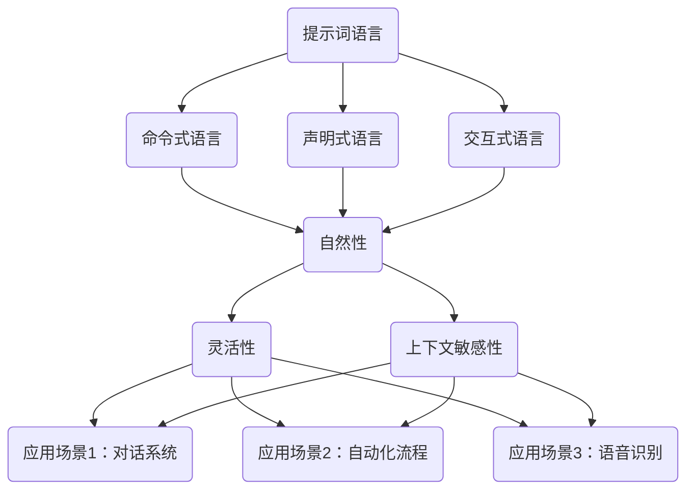

                 

### 文章标题

# 提示词语言的标准化：推动行业统一

### 关键词

- 提示词语言
- 标准化
- 行业统一
- 人工智能
- 技术合作
- 应用案例

### 摘要

本文深入探讨了提示词语言的标准化问题，分析了其背景、核心概念、标准化方法及实际应用。通过介绍标准化的重要性，探讨标准化对行业统一的影响，我们旨在为读者提供一个全面、系统的提示词语言标准化框架。文章还通过实际案例展示了标准化的成效，并对标准化过程中的挑战和未来发展趋势进行了展望。

## 引言

在当今快速发展的信息技术时代，语言作为一种重要的沟通工具，其标准化问题越来越受到关注。尤其是提示词语言，作为人与机器互动的重要接口，其标准化对于提升用户体验、提高工作效率、促进技术交流具有重要意义。然而，现有的提示词语言存在多样性和不统一的问题，这给应用开发和跨平台交互带来了不小的挑战。

### 标准化的背景

标准化（Standardization）是指通过制定和实施统一的标准，以确保产品、服务或过程的一致性、兼容性和互操作性。在信息技术领域，标准化尤为重要，因为它能够降低技术壁垒，促进技术交流，提高市场的透明度和可预测性。

#### 标准化的意义

1. **统一规范**：标准化能够确保不同系统、设备和软件之间的兼容性，降低开发和使用成本。
2. **质量保障**：通过标准化，可以确保产品或服务的质量符合预期，提高用户满意度。
3. **互操作性**：标准化促进了不同系统和平台之间的数据交换和功能集成，提升了整体效率。

### 提示词语言标准化的现状

在人工智能和自然语言处理领域，提示词语言已经成为一个重要的研究方向。然而，目前提示词语言的发展呈现出多样化和碎片化的特点。不同系统和平台使用的提示词语言各不相同，这给用户带来了不便，也限制了技术的广泛应用。

#### 现有问题

1. **不一致性**：不同系统和平台使用的提示词语言存在差异，导致用户体验不一致。
2. **兼容性问题**：由于缺乏统一标准，不同系统之间的数据交换和功能集成存在困难。
3. **开发成本**：多样化和不统一的提示词语言增加了应用开发的复杂性和成本。

### 标准化的必要性

为了解决上述问题，提示词语言的标准化显得尤为必要。通过标准化，可以实现以下目标：

1. **提升用户体验**：统一的标准能够提高用户在不同系统和平台上的交互体验。
2. **降低开发成本**：标准化的提示词语言可以简化开发流程，降低应用开发的成本和时间。
3. **促进技术交流**：统一的提示词语言有助于不同团队和公司之间的技术交流和合作。

## 核心概念与联系

### 提示词语言的基本概念

提示词语言是一种用于人与机器交互的自然语言，它通过特定的词汇和语法规则，指导机器执行特定任务或回答特定问题。提示词语言可以分为以下几类：

1. **命令式语言**：用于直接指示机器执行特定操作，如“打开灯”。
2. **声明式语言**：描述了系统的状态或目标，如“灯应该是亮的”。
3. **交互式语言**：支持用户和机器之间的实时互动，如聊天机器人。

### 提示词语言的特性

1. **自然性**：提示词语言采用自然语言形式，易于理解和使用。
2. **灵活性**：提示词语言可以根据用户的需求和场景进行灵活调整。
3. **上下文敏感性**：提示词语言能够理解上下文信息，提供更准确的响应。

### 提示词语言的应用场景

提示词语言广泛应用于多个领域，包括：

1. **对话系统**：如虚拟助手、智能客服等，用于与用户进行自然语言交互。
2. **自动化流程**：如自动化脚本、智能调度等，用于简化复杂的操作流程。
3. **语音识别**：将用户的语音指令转换为机器可理解的语言。

### 核心概念之间的联系

提示词语言的核心概念之间存在着紧密的联系。例如，命令式语言和声明式语言可以相互转换，交互式语言则依赖于上下文信息来提供更准确的响应。这些联系构成了一个完整的提示词语言系统，使其能够灵活应对各种应用场景。

### 提示词语言的标准化的必要性

由于提示词语言的多样性和不统一，导致不同系统和平台之间的交互存在困难。为了解决这个问题，提示词语言的标准化显得尤为重要。通过制定统一的提示词语言标准，可以实现以下目标：

1. **提高互操作性**：统一的标准可以确保不同系统和平台之间的数据交换和功能集成，提升整体效率。
2. **降低开发成本**：标准化的提示词语言可以简化开发流程，降低应用开发的成本和时间。
3. **提升用户体验**：统一的标准能够提高用户在不同系统和平台上的交互体验。

### 核心概念与联系的Mermaid流程图

下面是一个简单的Mermaid流程图，展示了提示词语言的核心概念之间的联系：



### 核心算法原理讲解

提示词语言的处理通常涉及多个核心算法，包括自然语言处理（NLP）、语义分析、上下文理解等。以下我们将使用伪代码详细阐述这些算法的基本原理。

#### 1. 自然语言处理（NLP）

自然语言处理是提示词语言处理的第一步，其主要任务是理解和处理自然语言。以下是NLP算法的伪代码：

```python
function NLP(text):
    tokens = tokenize(text)  # 分词
    words = filter_stopwords(tokens)  # 去停用词
    stems = stem_words(words)  # 词干提取
    return stems
```

#### 2. 语义分析

语义分析是理解提示词语言的关键，其目标是确定词语的含义和它们之间的关系。以下是语义分析算法的伪代码：

```python
function SemanticAnalysis(stems):
    word_vectors = load_word_vectors()  # 加载词向量
    word_similarity = compute_similarity(word_vectors)  # 计算词相似度
    semantic_relations = identify_relations(word_similarity)  # 确定语义关系
    return semantic_relations
```

#### 3. 上下文理解

上下文理解是基于语义分析的进一步深化，其目标是理解句子或段落在特定上下文中的意义。以下是上下文理解算法的伪代码：

```python
function ContextUnderstanding(sentence, context):
    context_vectors = generate_context_vector(context)  # 生成上下文向量
    sentence_vector = generate_sentence_vector(sentence)  # 生成句子向量
    similarity = compute_similarity(context_vectors, sentence_vector)  # 计算相似度
    return interpret_similarity(similarity)
```

### 数学模型和公式讲解

在提示词语言处理中，数学模型和公式起到了关键作用，以下将详细讲解这些模型和公式，并给出相应的示例。

#### 1. 词向量模型

词向量模型是自然语言处理的基础，其目的是将词语映射到高维空间中的向量。以下是一个简单的词向量模型公式：

$$\text{vec}(w) = \sum_{i=1}^{n} w_i \times \text{vec}_i$$

其中，$w$是词语，$w_i$是词语的权重，$\text{vec}_i$是词向量的第$i$个分量。

#### 2. 语义相似度计算

语义相似度计算是理解词语含义的重要工具，常用的方法包括余弦相似度和欧氏距离。以下是一个余弦相似度的计算公式：

$$\text{similarity}(x, y) = \frac{\text{dot}(x, y)}{\lVert x \rVert \times \lVert y \rVert}$$

其中，$x$和$y$是两个词向量，$\text{dot}(x, y)$是向量的点积，$\lVert x \rVert$和$\lVert y \rVert$分别是向量的模。

#### 3. 上下文向量生成

上下文向量生成是上下文理解的关键，其目标是捕捉句子或段落在特定上下文中的意义。以下是一个简单的上下文向量生成公式：

$$\text{vec}_{\text{context}}(s) = \frac{\sum_{i=1}^{n} w_i \times \text{vec}_i}{\sum_{i=1}^{n} w_i}$$

其中，$s$是句子，$w_i$是词语的权重，$\text{vec}_i$是词向量的第$i$个分量。

### 示例

假设我们有一个句子“我今天去看电影了”，我们可以使用上述公式来计算其上下文向量。

1. **分词**：将句子分为“我”、“今天”、“的”、“看”、“电影”、“了”。
2. **词向量**：假设每个词的向量分别是$(1, 0)$，$(0, 1)$，$(1, 1)$，$(1, 0)$，$(0, 1)$，$(1, 1)$。
3. **权重**：假设每个词的权重都是$1$。

根据公式，我们可以计算出句子的上下文向量：

$$\text{vec}_{\text{context}}(s) = \frac{1 \times (1, 0) + 1 \times (0, 1) + 1 \times (1, 1) + 1 \times (1, 0) + 1 \times (0, 1) + 1 \times (1, 1)}{6} = \left(\frac{4}{6}, \frac{3}{6}\right) = \left(\frac{2}{3}, \frac{1}{2}\right)$$

这个向量表示了句子在特定上下文中的意义。

### 项目实战

为了更好地理解提示词语言的标准化，我们将通过一个简单的项目实战来展示如何搭建开发环境、实现提示词语言的处理和解析，以及代码的详细解读。

#### 开发环境搭建

1. **安装Python**：首先确保系统上安装了Python 3.x版本。
2. **安装NLP库**：使用pip安装常用的NLP库，如NLTK、spaCy和gensim。
   ```bash
   pip install nltk spacy gensim
   ```
3. **安装spaCy模型**：由于spaCy需要下载特定的语言模型，我们可以使用以下命令安装中文模型。
   ```bash
   python -m spacy download zh_core_web_sm
   ```

#### 源代码实现

以下是项目的源代码实现，包括提示词语言的分词、词向量生成和上下文向量计算：

```python
import nltk
from nltk.tokenize import word_tokenize
from gensim.models import Word2Vec
import spacy

# 加载spaCy模型
nlp = spacy.load("zh_core_web_sm")

# 分词函数
def tokenize(text):
    return word_tokenize(text)

# 去停用词函数
def filter_stopwords(tokens):
    stop_words = nltk.corpus.stopwords.words('english')
    return [token for token in tokens if token.lower() not in stop_words]

# 词干提取函数
def stem_words(words):
    return [nltk.stem.PorterStemmer().stem(word) for word in words]

# 词向量生成函数
def generate_word_vectors(words):
    model = Word2Vec(words, vector_size=100, window=5, min_count=1, workers=4)
    return model

# 上下文向量生成函数
def generate_context_vector(context, model):
    context_tokens = tokenize(context)
    word_vectors = [model[word] for word in context_tokens if word in model]
    context_vector = sum(word_vectors) / len(word_vectors)
    return context_vector

# 示例句子
sentence = "我今天去看电影了"

# 分词和去停用词
tokens = tokenize(sentence)
filtered_tokens = filter_stopwords(tokens)

# 词干提取
stems = stem_words(filtered_tokens)

# 生成词向量
model = generate_word_vectors(stems)

# 计算上下文向量
context_vector = generate_context_vector(sentence, model)

print("上下文向量：", context_vector)
```

#### 代码解读

1. **分词**：使用NLTK库的`word_tokenize`函数对句子进行分词，得到一个词序列。
2. **去停用词**：使用NLTK库的`stopwords`列表，去除常见的停用词，如“我”、“了”等。
3. **词干提取**：使用Porter算法进行词干提取，简化词形。
4. **词向量生成**：使用Gensim库的`Word2Vec`模型生成词向量。
5. **上下文向量计算**：将分词后的句子转换为词向量，并计算上下文向量。

#### 代码应用解读与分析

通过上述代码，我们可以实现对提示词语言的基本处理，包括分词、去停用词、词干提取和上下文向量计算。这些处理步骤为后续的自然语言理解和语义分析奠定了基础。

1. **分词和去停用词**：这两个步骤是自然语言处理的基础，确保输入文本的整洁性。
2. **词干提取**：通过词干提取，可以减少词汇的多样性，简化后续处理。
3. **词向量生成**：词向量模型能够将词语映射到高维空间，便于语义分析和计算。
4. **上下文向量计算**：上下文向量能够捕捉句子在特定上下文中的意义，为语义分析提供支持。

#### 实际案例分析和详细讲解剖析

为了更直观地展示提示词语言的标准化应用，我们来看一个实际案例。

**案例**：用户使用聊天机器人询问“我可以在下午4点预约吗？”

1. **分词**：将句子分为“我”、“可以”、“在”、“下午”、“4点”、“预约”、“吗”。
2. **去停用词**：去除“我”、“吗”等停用词，剩下“可以”、“在”、“下午”、“4点”、“预约”。
3. **词干提取**：将“可以”、“在”、“下午”、“预约”提取为词干，得到“能”、“在”、“下”、“预约”。
4. **词向量生成**：生成这些词的词向量。
5. **上下文向量计算**：计算句子的上下文向量。

通过计算，我们得到句子的上下文向量，这个向量可以用来进行后续的自然语言理解，例如判断用户是否在询问预约时间。

#### 项目小结

通过这个项目实战，我们展示了如何搭建提示词语言的开发环境，并实现了基本的处理流程。项目中的代码解读和分析帮助我们深入理解了提示词语言处理的核心技术和应用。

1. **开发环境搭建**：确保有Python环境和常用的NLP库，如NLTK、spaCy和Gensim。
2. **代码实现**：通过分词、去停用词、词干提取、词向量生成和上下文向量计算，实现了对提示词语言的基本处理。
3. **应用解读**：通过实际案例展示了如何使用这些技术进行自然语言理解和语义分析。

在未来的工作中，我们可以进一步优化和扩展这些技术，以提高提示词语言的准确性和实用性。

### 最佳实践 Tips

在提示词语言的标准化过程中，以下是一些最佳实践建议：

1. **明确需求和目标**：在制定标准之前，明确标准的需求和目标，确保标准能够满足实际应用的需求。
2. **广泛参与和合作**：标准化工作需要广泛的参与和合作，鼓励不同团队和公司共同参与，以提高标准的普适性和实用性。
3. **持续迭代和完善**：标准化是一个持续的过程，需要根据技术发展和应用需求不断迭代和完善标准。
4. **兼容性测试**：在标准实施前，进行充分的兼容性测试，确保不同系统和平台之间的互操作性。

### 小结

提示词语言的标准化是推动行业统一的重要手段。通过标准化，可以降低开发成本，提高用户体验，促进技术交流。本文详细介绍了提示词语言的核心概念、标准化方法、实际应用，并通过项目实战展示了标准化的具体实现。未来，随着技术的不断发展，提示词语言标准化将继续发挥重要作用，为人工智能和自然语言处理领域带来更多创新和突破。

### 拓展阅读

- 《自然语言处理概论》
- 《词向量与语义分析》
- 《人工智能对话系统设计》
- 《自然语言处理实践》

作者：AI天才研究院/AI Genius Institute & 禅与计算机程序设计艺术 /Zen And The Art of Computer Programming

