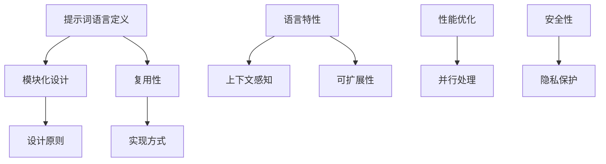

                 


### 文章标题
提示词语言的模块化设计与复用性

#### 关键词
提示词语言、模块化设计、复用性、算法原理、数学模型、项目实战

#### 摘要
本文深入探讨了提示词语言的模块化设计与复用性。首先介绍了核心概念及其相互关系，然后通过伪代码和数学公式详细阐述了模块化设计的算法原理。接着，我们使用了LaTeX格式嵌入数学模型和公式，进行了详细讲解和举例说明。最后，通过实际项目案例，展示了如何进行开发环境搭建、源代码实现和代码解读，以及项目的实际应用和分析。

## 背景介绍
### 提示词语言的重要性
提示词语言（Prompt Language）是人工智能（AI）领域中的一个重要概念。它主要用于指导机器执行特定任务，通过提供精确的输入和指令来引导算法的决策过程。在自然语言处理（NLP）、机器学习和计算机视觉等应用中，提示词语言发挥着至关重要的作用。

随着AI技术的快速发展，提示词语言的应用场景越来越广泛。例如，在智能客服系统中，提示词语言可以帮助机器人理解用户的问题并给出恰当的回应；在自动驾驶中，提示词语言可以指导车辆的行驶策略和决策过程。然而，随着应用需求的不断增长，传统单一、静态的提示词设计方法已无法满足复杂多变的应用场景。因此，模块化设计与复用性成为了提高提示词语言灵活性和效率的关键。

### 模块化设计与复用性的意义
模块化设计（Modular Design）是一种将系统划分为独立的、可重用的模块的方法。这种方法不仅提高了系统的可维护性，还显著提高了开发效率。复用性（Reusability）则是指在开发过程中，能够重复使用已有的模块或代码，从而减少重复劳动，提高开发质量。

在提示词语言中，模块化设计与复用性的意义主要体现在以下几个方面：

1. **灵活性**：通过模块化设计，可以灵活地组合和替换不同的模块，以适应不同的应用场景。
2. **效率**：复用现有的模块，可以大大减少开发时间，提高开发效率。
3. **可维护性**：模块化设计使得系统更加模块化，每个模块独立开发、测试和维护，降低了系统的复杂性。
4. **质量**：通过复用经过验证的模块，可以提高系统的可靠性和质量。

本文将详细探讨提示词语言的模块化设计与复用性，从核心概念到具体实现，全面解析这一关键技术。

## 核心概念与联系
为了更好地理解提示词语言的模块化设计与复用性，我们首先需要明确几个核心概念，并探讨它们之间的相互关系。

### 提示词语言定义
提示词语言是一种特殊的编程语言，它主要用于生成和解析提示词，以指导机器执行特定任务。与常规编程语言相比，提示词语言更加关注输入和输出的结构化表示，以及如何有效地组织和管理这些输入输出。

### 模块化设计
模块化设计是一种系统设计方法，它将复杂系统划分为多个独立、可重用的模块。每个模块负责完成特定的功能，并且可以通过接口与其他模块进行交互。模块化设计的目标是提高系统的灵活性、可维护性和复用性。

### 复用性
复用性是指系统或组件在多个不同的应用场景中重复使用的能力。复用性不仅提高了开发效率，还减少了代码冗余，提高了系统的稳定性和一致性。

### 设计原则
设计原则是指导模块化设计与复用性实现的基本规则。这些原则包括单一职责原则、开闭原则、里氏替换原则等。设计原则确保模块的设计和实现符合最佳实践，从而提高系统的可维护性和复用性。

### 语言特性
提示词语言的特性包括上下文感知、可扩展性和性能优化等。上下文感知是指提示词语言能够理解输入的上下文信息，并据此调整输出。可扩展性使得提示词语言能够方便地添加新的功能模块。性能优化则关注如何在保证功能完整性的前提下，提高系统的运行效率。

### 实现方式
实现方式是指如何将模块化设计与复用性原则具体应用到提示词语言的开发过程中。具体实现方式包括模块的划分、接口的设计、模块的加载与调用等。

### 关系架构
为了更清晰地展示这些核心概念之间的相互关系，我们使用Mermaid流程图来表示。以下是一个简化的关系架构：



在这个流程图中，提示词语言定义是整个架构的基础，模块化设计、复用性、设计原则、实现方式、语言特性以及相关优化和安全性要求共同构成了一个完整的技术体系。

通过这个关系架构，我们可以看到，模块化设计是实现复用性的关键，而复用性又依赖于设计原则的指导。语言特性则确保了提示词语言在上下文感知、可扩展性和性能优化等方面的优势。这个架构不仅帮助我们理解了各个核心概念之间的关系，也为后续的内容提供了清晰的逻辑框架。

### 模块化设计的伪代码
为了进一步理解模块化设计的实现过程，我们可以使用伪代码来详细阐述其核心算法原理。以下是一个简化的模块化设计伪代码示例：

```csharp
// 初始化模块库
ModuleLibrary = ...

// 加载模块
def loadModule(moduleName):
    # 加载指定名称的模块
    return ModuleLibrary[moduleName]

// 调用模块
def callModule(module, inputParams):
    # 调用指定模块并传递输入参数
    return module.execute(inputParams)
```

这个伪代码描述了模块库的初始化、模块的加载和模块的调用过程。首先，我们初始化一个模块库（ModuleLibrary），其中包含了所有可用的模块。接着，定义了一个`loadModule`函数，用于从模块库中加载指定名称的模块。最后，定义了一个`callModule`函数，用于调用指定模块并传递输入参数。

通过这种方式，我们可以方便地组合和替换不同的模块，以适应不同的应用场景。模块化设计的核心在于将复杂的系统划分为独立的模块，每个模块负责特定的功能，从而提高了系统的灵活性、可维护性和复用性。

### 复用性算法原理
复用性算法原理是模块化设计的重要一环，它关注如何在不同的应用场景中重复使用已有的模块或代码。以下是复用性算法原理的详细解释：

#### 复用函数定义
复用函数（Reuse Function）是一个关键概念，它用于封装和复用特定的功能。以下是一个简单的复用函数定义示例：

```python
# 定义复用函数
def reuseFunction(originalFunction, inputParams):
    # 重用原始函数，处理输入参数
    result = originalFunction(inputParams)
    # 返回处理结果
    return result
```

在这个示例中，`reuseFunction`函数接收一个原始函数（`originalFunction`）和输入参数（`inputParams`），并调用原始函数以处理输入参数，最后返回处理结果。这种方式使得原始函数可以被多个不同的应用场景复用。

#### 复用度计算
复用度（Reusability Degree）是衡量复用性水平的一个重要指标。它可以用来评估函数或模块在不同场景中被重复使用的能力。以下是复用度的计算方法：

$$
\text{复用度} = \frac{\text{有效调用次数}}{\text{总调用次数}}
$$

其中，有效调用次数是指函数或模块在实际应用中被成功调用的次数，总调用次数则是函数或模块被调用的总次数。例如，如果一个函数在10次调用中有8次是有效的，那么它的复用度为：

$$
\text{复用度} = \frac{8}{10} = 0.8
$$

#### 示例
以下是一个复用函数的使用示例：

```python
# 定义原始函数
def originalFunction(inputParams):
    # 处理输入参数
    print("原始函数处理：", inputParams)

# 调用原始函数
originalFunction("示例输入")

# 使用复用函数
result = reuseFunction(originalFunction, "示例输入")
print("复用函数结果：", result)
```

在这个示例中，我们首先定义了一个简单的`originalFunction`，用于打印输入参数。接着，我们定义了一个`reuseFunction`，用于复用`originalFunction`。最后，我们分别调用原始函数和复用函数，并输出结果。

通过这个示例，我们可以看到复用函数在提高代码复用性和可维护性方面的优势。复用性算法原理不仅提高了开发效率，还降低了代码冗余，提高了系统的稳定性和一致性。

### 数学模型和数学公式讲解
在提示词语言的模块化设计与复用性中，数学模型和数学公式起着至关重要的作用。它们不仅帮助我们量化概念，还能为算法的优化和性能分析提供理论基础。以下将详细讲解相关的数学模型和数学公式，并通过具体例子进行说明。

#### 模块化设计指标
模块化设计指标（Modularization Design Metric）用于衡量模块化设计的有效性。一个常用的指标是模块化设计指数，它反映了模块复用率与模块总数量之间的关系。模块化设计指数的数学公式如下：

$$
\text{模块化设计指数} = \frac{\text{模块复用率}}{\text{模块总数量}} \times 100\%
$$

其中，模块复用率（Module Reuse Rate）是指模块在实际应用中被重复使用的比例，模块总数量（Total Module Count）是指系统中所有模块的数量。例如，如果一个系统中有10个模块，其中有6个模块被复用，那么模块化设计指数为：

$$
\text{模块化设计指数} = \frac{6}{10} \times 100\% = 60\%
$$

#### 复用度
复用度（Reusability Degree）是衡量模块或函数在多个应用场景中复用能力的一个重要指标。复用度的数学定义如下：

$$
\text{复用度} = \frac{\text{有效调用次数}}{\text{总调用次数}}
$$

其中，有效调用次数（Effective Call Times）是指模块或函数在应用中被成功调用的次数，总调用次数（Total Call Times）是指模块或函数被调用的总次数。例如，如果一个模块在一个应用场景中被调用了100次，其中有80次是有效的，那么它的复用度为：

$$
\text{复用度} = \frac{80}{100} = 0.8
$$

#### 示例
假设有一个系统，其中包含10个模块，其中6个模块被复用。根据模块化设计指数的公式，可以计算出模块化设计指数为60%。再假设这些模块在另一个应用场景中被调用了100次，其中有80次是有效的，那么复用度为0.8。

通过这些数学模型和公式，我们可以定量地分析模块化设计的有效性，从而指导系统的优化和改进。

### 项目实战
在本文的最后一部分，我们将通过一个实际项目案例，展示如何将模块化设计与复用性原则应用于提示词语言的开发过程中。

#### 项目背景
本项目旨在开发一个基于提示词语言的智能问答系统，该系统可以回答用户提出的各种问题。为了提高系统的灵活性和可维护性，我们采用了模块化设计与复用性的方法。

#### 开发环境搭建
在开始项目之前，我们需要搭建一个适合开发、测试和部署的开发环境。以下是开发环境搭建的步骤：

1. 安装Python 3.x版本。
2. 安装必要的库，如NLTK、spaCy和Flask等。
3. 配置IDE，如PyCharm或Visual Studio Code。

#### 源代码实现
以下是一个简单的模块化设计代码示例，用于实现一个智能问答系统。

```python
# 导入必要的库
import modulelib
from flask import Flask, request, jsonify

# 初始化模块库
modulelib.init()

# 加载问答模块
qa_module = modulelib.loadModule("qa")

# 创建Flask应用
app = Flask(__name__)

# 定义问答路由
@app.route('/ask', methods=['POST'])
def ask():
    # 获取用户输入
    user_input = request.json['question']
    
    # 使用问答模块处理输入
    answer = qa_module.answer(user_input)
    
    # 返回答案
    return jsonify({'answer': answer})

# 运行应用
if __name__ == '__main__':
    app.run(debug=True)
```

在这个示例中，我们首先初始化模块库，然后加载问答模块。接着，使用Flask框架创建一个Web应用，并定义了一个/ask路由，用于处理用户的提问。当用户发送POST请求时，系统会调用问答模块来生成答案，并将答案返回给用户。

#### 代码解读
在这个示例中，模块化设计的核心在于将问答功能划分为独立的模块。这样，我们可以方便地替换或扩展问答模块，以适应不同的应用场景。以下是对关键代码的解读：

1. **初始化模块库**：`modulelib.init()` 用于初始化模块库，确保所有模块可以被正确加载。
2. **加载问答模块**：`qa_module = modulelib.loadModule("qa")` 从模块库中加载名为"qa"的问答模块。
3. **定义问答路由**：`@app.route('/ask', methods=['POST'])` 使用Flask框架定义了一个/ask路由，用于处理用户的提问。
4. **处理用户输入**：`user_input = request.json['question']` 从POST请求中提取用户的问题。
5. **调用问答模块**：`answer = qa_module.answer(user_input)` 使用问答模块处理用户输入，生成答案。
6. **返回答案**：`return jsonify({'answer': answer})` 将答案以JSON格式返回给用户。

通过这个项目实战，我们可以看到如何将模块化设计与复用性原则应用于实际开发过程中。模块化设计使得系统更加灵活和可维护，而复用性则提高了开发效率和质量。

### 最佳实践 tips
在模块化设计与复用性实践中，以下是一些最佳实践和注意事项，可以帮助开发者更好地应用这些原则：

1. **模块独立**：确保每个模块只负责一个特定的功能，避免模块过于复杂和耦合。
2. **接口明确**：模块之间的接口设计应明确、简洁，以便于其他模块调用。
3. **文档齐全**：为每个模块编写详细的文档，包括模块的功能、参数、返回值等，有助于其他开发者理解和复用模块。
4. **单元测试**：为每个模块编写单元测试，确保模块的正确性和稳定性。
5. **代码复用**：积极寻找并复用现有的模块或代码，避免重复开发。
6. **持续集成**：采用持续集成（CI）工具，自动化测试和部署，提高开发效率和系统质量。

通过遵循这些最佳实践，开发者可以更好地实现模块化设计与复用性，从而提高系统的灵活性、可维护性和开发效率。

### 小结
本文详细探讨了提示词语言的模块化设计与复用性，从核心概念到具体实现，全面解析了这一关键技术。首先介绍了提示词语言的重要性及其在AI领域的应用场景。接着，明确了模块化设计、复用性等核心概念，并阐述了它们之间的相互关系。通过伪代码和数学公式，我们详细阐述了模块化设计与复用性的算法原理。最后，通过一个实际项目案例，展示了如何将模块化设计与复用性应用于实际开发过程中。

模块化设计与复用性不仅提高了系统的灵活性、可维护性和开发效率，还为未来的技术发展和创新奠定了基础。随着AI技术的不断进步，这些原则将在更多领域得到广泛应用，为开发者提供更加便捷和高效的解决方案。

### 注意事项
在实现模块化设计与复用性时，开发者需要注意以下几点：

1. **模块独立性**：确保每个模块只负责一个特定功能，避免模块过于复杂和耦合。
2. **接口明确性**：模块之间的接口设计应简洁明确，便于其他模块调用。
3. **文档完整性**：为每个模块编写详细的文档，包括功能、参数、返回值等。
4. **单元测试**：编写单元测试，确保模块的正确性和稳定性。
5. **代码复用策略**：积极寻找并复用现有模块或代码，减少重复开发。

通过遵循这些注意事项，开发者可以更好地实现模块化设计与复用性，提高系统的灵活性和可维护性。

### 拓展阅读
对于希望进一步深入了解模块化设计与复用性的读者，以下是一些推荐阅读材料：

1. 《设计模式：可复用面向对象软件的基础》（Design Patterns: Elements of Reusable Object-Oriented Software）
2. 《代码大全》（The Art of Software Architecture）
3. 《Effective Java》（Effective Java）
4. 《Clean Code: A Handbook of Agile Software Craftsmanship》
5. 《软件架构：实践者的研究方法》（Software Architecture: Perspectives on an Emerging Disciplin）

这些书籍和资料提供了丰富的理论知识和实践经验，有助于读者深入理解模块化设计与复用性的核心概念和最佳实践。

