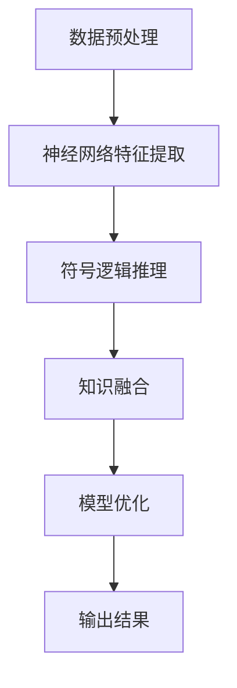

                 

### 引言

#### 背景介绍

随着人工智能技术的飞速发展，自然语言处理（Natural Language Processing, NLP）作为人工智能的重要分支，已经取得了显著的成果。然而，传统的NLP方法在处理复杂、多变的自然语言时仍存在诸多局限性。为此，研究人员提出了基于提示词（prompt-based）的语言神经符号整合方法，以期进一步提高NLP的性能和效果。

提示词语言（Prompt-based Language）是一种基于特定问题和场景生成的关键词或短语，用于引导和优化NLP模型的训练与推理过程。而神经符号整合（Neural Symbol Integration）则是一种将神经网络的计算能力与符号逻辑相结合的方法，旨在解决传统NLP模型在处理复杂语义信息时的不足。

#### 文章目标

本文旨在系统地介绍和探讨提示词语言的神经符号整合方法。我们将从基本概念、算法原理、数学模型、应用场景等方面逐步展开讨论，旨在为读者提供一个全面、深入的了解。具体目标包括：

1. 理解提示词语言和神经符号整合的基本概念及其相互关系。
2. 掌握神经符号整合算法的设计原则和核心实现方法。
3. 分析神经符号整合在自然语言处理中的应用案例和效果。
4. 探讨神经符号整合方法的未来发展方向和挑战。

通过本文的阅读，读者将能够：

- 明确提示词语言和神经符号整合的核心概念及其应用价值。
- 掌握基于神经符号整合的NLP模型设计和实现方法。
- 了解神经符号整合在不同NLP任务中的应用效果和局限性。
- 为进一步研究和应用神经符号整合方法提供参考和启示。

### 关键词

- 提示词语言
- 神经符号整合
- 自然语言处理
- 算法原理
- 数学模型
- 应用场景

### 摘要

本文详细介绍了提示词语言的神经符号整合方法，旨在提升自然语言处理模型的性能和效果。首先，我们阐述了提示词语言和神经符号整合的基本概念及其相互关系。接着，我们分析了神经符号整合算法的设计原则和核心实现方法，并探讨了其在自然语言处理中的具体应用。此外，我们还通过数学模型和实际案例对神经符号整合方法进行了详细解析和讨论。最后，我们总结了神经符号整合方法的优缺点，并对其未来发展方向和挑战提出了展望。

# 提示词语言的基本概念

## 定义与起源

提示词语言（Prompt-based Language）是一种基于特定问题和场景生成的关键词或短语，用于引导和优化自然语言处理（NLP）模型的训练与推理过程。其核心思想是通过设计合适的提示词，使模型能够更好地理解和处理复杂、多变的自然语言输入。

提示词语言的起源可以追溯到20世纪80年代，当时研究人员开始探索如何利用外部知识库和提示信息来改进机器学习模型的性能。随着深度学习和神经网络在NLP领域的广泛应用，提示词语言逐渐成为了一种重要的研究方法和应用技术。

## 提示词语言的作用

提示词语言在自然语言处理中具有多种重要作用：

1. **引导模型训练**：提示词可以提供额外的信息，帮助模型更好地理解训练数据中的语义关系和特征，从而提高模型的训练效果。

2. **优化推理过程**：在模型的推理阶段，提示词可以帮助模型更准确地理解输入文本的意图和语义，从而提高推理结果的准确性和可解释性。

3. **提升任务性能**：通过设计合适的提示词，可以显著提升模型在特定NLP任务（如文本分类、命名实体识别、机器翻译等）中的性能。

4. **增强模型泛化能力**：提示词可以帮助模型更好地适应不同的应用场景和任务，提高模型的泛化能力和鲁棒性。

## 提示词语言的组成部分

提示词语言通常包括以下几个组成部分：

1. **关键词**：关键词是提示词语言的核心部分，用于表达具体的语义信息和意图。

2. **短语**：短语是由多个关键词组成的短句或句子，用于提供更详细的背景信息和上下文。

3. **场景信息**：场景信息是指与任务相关的背景知识和环境信息，有助于模型更好地理解输入文本的意图和情境。

4. **语义模板**：语义模板是一种结构化的表达方式，用于将关键词、短语和场景信息组合成具有特定语义的提示语句。

## 提示词语言的实现方式

实现提示词语言通常有以下几种方式：

1. **手动设计**：通过人工设计提示词，根据具体任务和场景的需求，选择合适的词汇和短语进行组合。

2. **自动生成**：利用自然语言生成技术，如序列到序列模型、生成对抗网络（GAN）等，自动生成符合特定任务的提示词。

3. **混合方法**：结合手动设计和自动生成方法，根据任务需求和数据情况，动态调整提示词的设计和生成策略。

## 提示词语言的优势

提示词语言具有以下几个显著优势：

1. **灵活性**：提示词语言可以根据不同的任务和场景需求，灵活调整和组合关键词、短语和场景信息，适应各种复杂的应用场景。

2. **可解释性**：通过明确的设计和生成策略，提示词语言有助于提高模型的解释性和透明度，使研究人员和开发者能够更好地理解模型的工作原理和性能表现。

3. **高效性**：提示词语言可以显著提升模型的训练和推理效率，提高NLP任务的整体性能和效果。

4. **扩展性**：提示词语言易于扩展和更新，可以快速适应新的任务需求和变化，为NLP技术的发展和应用提供持续的支持。

## 提示词语言的局限性

尽管提示词语言在NLP领域具有显著的优势，但也存在一些局限性：

1. **设计难度**：设计高质量的提示词需要丰富的语言知识和实践经验，对开发者的要求较高。

2. **生成效率**：自动生成提示词的方法在效率和准确性之间存在权衡，需要进一步优化和改进。

3. **模型依赖**：提示词语言对模型的依赖较强，不同模型对提示词的需求和敏感度可能存在较大差异。

4. **通用性**：提示词语言在处理特定领域的任务时，可能需要针对特定领域进行定制化设计和优化，通用性相对较低。

## 结论

提示词语言作为一种有效的自然语言处理方法，在提升模型性能和效果方面具有重要作用。通过深入理解提示词语言的基本概念、作用、组成部分和实现方式，我们可以更好地发挥其优势，同时认识到其局限性，为后续研究和应用提供有益的指导。

# 神经符号整合的基本概念

## 定义与起源

神经符号整合（Neural Symbol Integration）是一种将神经网络的计算能力与符号逻辑相结合的方法。它旨在解决传统神经网络在处理复杂语义信息时的局限性，通过引入符号逻辑和外部知识，提升模型的解释性、可扩展性和通用性。

神经符号整合的概念最早可以追溯到20世纪80年代，当时一些研究人员开始探索如何将神经网络与知识表示相结合。随着深度学习和自然语言处理技术的不断发展，神经符号整合逐渐成为一种重要的研究方法和应用技术。

## 神经符号整合的核心概念

神经符号整合主要包括以下几个核心概念：

1. **神经网络**：神经网络是深度学习的基础，通过多层非线性变换，对输入数据进行特征提取和分类。神经网络具有强大的计算能力和自适应能力，能够处理复杂的非线性问题。

2. **符号逻辑**：符号逻辑是一种基于符号表示和推理的数学方法，可以表达和处理复杂的关系和逻辑。在神经符号整合中，符号逻辑用于表示和整合外部知识，提高模型的解释性和可靠性。

3. **外部知识**：外部知识是指与特定任务或领域相关的背景知识和信息。通过引入外部知识，神经符号整合模型可以更好地理解和处理复杂、多变的自然语言输入。

4. **整合机制**：整合机制是指将神经网络和符号逻辑有机结合起来的方法。常见的整合机制包括基于规则的整合、基于学习的整合和混合整合等。

## 神经符号整合的作用

神经符号整合在自然语言处理中具有多种重要作用：

1. **提高解释性**：通过引入符号逻辑和外部知识，神经符号整合模型能够提供更明确的解释和推理过程，提高模型的透明度和可解释性。

2. **增强泛化能力**：外部知识的引入可以增强模型对未知数据的处理能力，提高模型的泛化性能。

3. **提升任务性能**：通过结合神经网络的计算能力和符号逻辑的推理能力，神经符号整合模型在多种NLP任务中表现出较高的性能和效果。

4. **支持复杂任务**：神经符号整合适用于处理复杂、多变的自然语言任务，如文本生成、知识图谱构建、语义分析等。

## 神经符号整合的组成部分

神经符号整合主要由以下几个组成部分构成：

1. **神经网络模型**：神经网络模型用于提取输入数据的特征，并将其映射到语义空间中。

2. **符号逻辑系统**：符号逻辑系统用于表示和整合外部知识，提供逻辑推理和语义分析能力。

3. **知识库**：知识库包含与任务相关的背景知识和信息，用于增强模型的解释性和可靠性。

4. **整合模块**：整合模块负责将神经网络模型和符号逻辑系统有机结合，实现神经符号整合的推理和计算过程。

## 神经符号整合的实现方式

实现神经符号整合通常有以下几种方式：

1. **基于规则的整合**：通过设计特定的规则，将神经网络模型和符号逻辑系统有机地结合起来。这种方法具有较高的可解释性，但可能需要大量手动设计和调整。

2. **基于学习的整合**：通过训练过程，自动将神经网络模型和符号逻辑系统整合在一起。这种方法具有较高的自适应能力，但可能缺乏透明度和可解释性。

3. **混合整合**：结合基于规则和基于学习的整合方法，根据具体任务需求，动态调整整合策略。这种方法具有较高的灵活性和适应性。

## 神经符号整合的优势

神经符号整合具有以下几个显著优势：

1. **提高解释性**：通过引入符号逻辑和外部知识，神经符号整合模型能够提供更明确的解释和推理过程，提高模型的透明度和可解释性。

2. **增强泛化能力**：外部知识的引入可以增强模型对未知数据的处理能力，提高模型的泛化性能。

3. **提升任务性能**：通过结合神经网络的计算能力和符号逻辑的推理能力，神经符号整合模型在多种NLP任务中表现出较高的性能和效果。

4. **支持复杂任务**：神经符号整合适用于处理复杂、多变的自然语言任务，如文本生成、知识图谱构建、语义分析等。

## 神经符号整合的局限性

尽管神经符号整合具有显著的优势，但也存在一些局限性：

1. **计算复杂度高**：神经符号整合涉及复杂的神经网络和符号逻辑计算，可能导致计算复杂度较高，影响模型训练和推理的效率。

2. **模型依赖性强**：神经符号整合对模型的依赖较强，不同模型对整合方法和策略的需求可能存在较大差异。

3. **知识库构建困难**：构建高质量的符号逻辑系统和知识库需要丰富的领域知识和经验，可能需要大量的人力投入和时间成本。

4. **可解释性挑战**：虽然神经符号整合提高了模型的解释性，但在某些情况下，仍可能面临可解释性挑战，特别是当整合机制较为复杂时。

## 结论

神经符号整合作为一种结合神经网络和符号逻辑的方法，在自然语言处理领域具有广泛的应用前景。通过深入理解神经符号整合的基本概念、核心概念和作用，我们可以更好地发挥其优势，同时认识到其局限性，为后续研究和应用提供有益的指导。

### 神经符号整合算法的设计原则

神经符号整合算法的设计原则是构建高效、可解释且具有强泛化能力的模型的核心。以下是几种常见的设计原则：

#### 1. 符号逻辑的嵌入

符号逻辑的嵌入是将符号逻辑与神经网络模型有机结合的过程。设计原则包括：

- **统一表示**：使用统一的表示方法将符号逻辑嵌入到神经网络中，使模型能够同时处理符号逻辑和神经网络特征。

- **层次结构**：构建层次化的结构，将低层特征与高层的语义信息相结合，使模型能够逐步理解和整合复杂的语义。

#### 2. 知识驱动的学习

知识驱动的学习旨在利用外部知识库提高模型的性能和解释性。设计原则包括：

- **知识融合**：将外部知识库与神经网络模型结合，通过知识融合模块使模型能够利用这些知识进行推理和决策。

- **知识更新**：设计动态的知识更新机制，使模型能够根据新的数据和知识进行持续优化和更新。

#### 3. 神经网络与符号逻辑的协同学习

神经网络与符号逻辑的协同学习是指神经网络和符号逻辑系统在学习过程中相互协作，共同优化模型性能。设计原则包括：

- **多模态学习**：利用多种数据源（如图像、文本、音频等）进行多模态学习，使模型能够从不同维度获取信息和知识。

- **反馈机制**：设计反馈机制，使神经网络能够根据符号逻辑的推理结果调整自己的学习方向和策略。

#### 4. 可解释性和透明度

为了提高模型的可解释性和透明度，设计原则包括：

- **解释性模块**：设计专门的解释性模块，用于分析模型的推理过程和决策依据。

- **可视化工具**：开发可视化工具，帮助用户理解模型的内部结构和运作机制。

#### 5. 自适应和灵活性

神经符号整合算法需要具备自适应和灵活性，以适应不同的应用场景和任务需求。设计原则包括：

- **参数调整**：设计灵活的参数调整机制，使模型能够根据任务需求自动调整神经网络和符号逻辑的权重和策略。

- **模块化设计**：采用模块化设计，使模型能够根据具体任务需求动态组合和调整不同的模块。

#### 6. 数据预处理和清洗

数据预处理和清洗是神经符号整合算法设计的重要一环。设计原则包括：

- **高质量数据集**：构建高质量的数据集，确保数据集的多样性和代表性。

- **数据清洗**：设计有效的数据清洗方法，去除噪声和异常数据，提高模型的学习效果。

#### 7. 模型评估和优化

模型评估和优化是确保神经符号整合算法性能的关键。设计原则包括：

- **多指标评估**：使用多个评估指标（如准确率、召回率、F1值等）对模型进行综合评估。

- **交叉验证**：采用交叉验证方法，确保模型在不同数据集上的性能稳定和可靠。

- **模型优化**：通过调整模型结构和参数，优化模型性能，提高模型在特定任务上的表现。

### 核心算法原理讲解

为了更好地理解神经符号整合算法的设计原则，下面我们通过伪代码和流程图来详细阐述一个典型的神经符号整合算法——基于图神经网络的符号整合算法。

#### 伪代码

```
// 输入：文本数据 X，外部知识库 K，参数 θ
// 输出：整合后的语义表示 S

// 初始化神经网络 N 和符号逻辑系统 L
// N = NeuralNetwork()
// L = SymbolicLogic()

// 数据预处理
X_processed = PreprocessData(X)

// 神经网络特征提取
features = N.extractFeatures(X_processed)

// 符号逻辑推理
symbols = L.reasoning(features)

// 知识融合
S = KnowledgeFusion(features, symbols, K)

// 模型优化
θ = OptimizeModel(S, X_processed)

// 输出结果
return S
```

#### 流程图



#### 详细解释

1. **数据预处理**：首先，对输入的文本数据进行预处理，包括分词、去停用词、词性标注等操作，以便后续的特征提取和推理。

2. **神经网络特征提取**：使用神经网络（如图神经网络）对预处理后的文本数据进行特征提取，得到文本的语义表示。

3. **符号逻辑推理**：利用符号逻辑系统对提取的文本特征进行推理，以获取更高层次的语义信息。

4. **知识融合**：将神经网络的语义表示和符号逻辑的推理结果进行融合，得到整合后的语义表示。

5. **模型优化**：通过优化算法（如梯度下降）对模型的参数进行调整，以改进模型的性能。

6. **输出结果**：最终输出整合后的语义表示，用于后续的任务处理。

通过上述伪代码和流程图，我们可以清晰地看到神经符号整合算法的设计思路和实现步骤，从而更好地理解其核心原理和设计原则。

### 数学模型与公式

神经符号整合方法在自然语言处理中不仅依赖于算法设计，还需要坚实的数学模型作为理论基础。以下是神经符号整合方法中的核心数学模型和公式，通过这些数学工具，我们可以更深入地理解和实现神经符号整合。

#### 1. 图神经网络（Graph Neural Networks, GNN）模型

图神经网络是一种基于图结构的深度学习模型，它能够有效地处理图数据，如知识图谱。以下是GNN模型的基本公式和解释：

##### 公式 1：图卷积操作

$$\text{h}_{v}^{(l+1)} = \sigma \left( \sum_{u \in \mathcal{N}(v)} \alpha_{uv} \cdot \text{h}_{u}^{(l)} \right) + b_{v}$$

- $\text{h}_{v}^{(l+1)}$：第$l+1$层节点$v$的表示。
- $\text{h}_{u}^{(l)}$：第$l$层节点$u$的表示。
- $\mathcal{N}(v)$：节点$v$的邻域节点集合。
- $\alpha_{uv}$：边权重，通常由邻接矩阵$A$决定。
- $\sigma$：激活函数，如ReLU、Sigmoid等。
- $b_{v}$：偏置项。

**解释**：图卷积操作通过聚合节点邻域的信息来更新节点的表示。邻接矩阵$A$用于定义节点之间的连接关系，而激活函数和偏置项则用于非线性变换和权重调整。

##### 公式 2：图注意力机制（Graph Attention Mechanism, GAT）

$$\alpha_{uv}^{(l)} = \frac{\exp(\text{a}(\text{h}_{u}^{(l)}, \text{h}_{v}^{(l)}))}{\sum_{w \in \mathcal{N}(v)} \exp(\text{a}(\text{h}_{w}^{(l)}, \text{h}_{v}^{(l)}))}$$

- $\alpha_{uv}^{(l)}$：第$l$层节点$v$对节点$u$的注意力权重。
- $\text{a}(\text{h}_{u}^{(l)}, \text{h}_{v}^{(l)}):$ 注意力函数，通常为点积或双线性函数。

**解释**：图注意力机制通过计算节点间的相似度来确定注意力权重，从而更好地聚合邻域信息。

#### 2. 符号逻辑推理模型

符号逻辑推理模型用于在神经网络中嵌入逻辑推理能力。以下是常用的符号逻辑推理公式和解释：

##### 公式 3：命题逻辑推理

$$\text{P} \rightarrow \text{Q}$$

- $\text{P}$：前提。
- $\text{Q}$：结论。

**解释**：命题逻辑推理表示如果前提$\text{P}$为真，则结论$\text{Q}$也必须为真。

##### 公式 4：谓词逻辑推理

$$\forall x \in \mathcal{X}, \text{P}(x) \rightarrow \text{Q}(x)$$

- $\forall x \in \mathcal{X}$：对所有$x$在集合$\mathcal{X}$中。
- $\text{P}(x)$：性质或前提。
- $\text{Q}(x)$：结论。

**解释**：谓词逻辑推理表示对于集合$\mathcal{X}$中的所有$x$，如果$\text{P}(x)$为真，则$\text{Q}(x)$也必须为真。

#### 3. 知识融合模型

知识融合模型用于整合神经网络特征和外部知识，以下是知识融合公式和解释：

##### 公式 5：知识加权融合

$$\text{S}_{fused} = \sum_{i=1}^{n} \alpha_{i} \cdot \text{S}_{i}$$

- $\text{S}_{fused}$：融合后的表示。
- $\text{S}_{i}$：第$i$个知识源或神经网络表示。
- $\alpha_{i}$：第$i$个知识源的权重。

**解释**：知识加权融合通过为每个知识源分配权重，将多个知识源的信息整合成一个统一的表示。

##### 公式 6：知识增强的神经网络输出

$$\text{Y}_{out} = \text{f}(\text{W} \cdot \text{S}_{fused} + \text{b})$$

- $\text{Y}_{out}$：神经网络输出。
- $\text{S}_{fused}$：融合后的表示。
- $\text{W}$：权重矩阵。
- $\text{b}$：偏置项。
- $\text{f}$：激活函数，如ReLU、Sigmoid等。

**解释**：知识增强的神经网络输出通过融合表示和权重矩阵，将外部知识和神经网络特征结合，用于生成最终的输出。

#### 详细讲解与举例说明

**例子 1：图神经网络与符号逻辑结合**

假设我们有一个包含实体和关系的知识图谱，其中实体和关系分别表示为节点和边。我们可以使用GNN提取节点的特征，然后使用符号逻辑进行推理。

- **步骤 1**：使用图卷积神经网络提取节点特征。
- **步骤 2**：使用符号逻辑推理，如命题逻辑，根据实体和关系进行推理。
- **步骤 3**：将神经网络特征和符号逻辑结果进行融合，得到最终的语义表示。

**例子 2：知识融合与神经网络输出**

假设我们有一个文本分类任务，使用一个预训练的文本嵌入模型和一个知识库。我们可以将文本嵌入和知识库信息进行融合，然后输入到神经网络中进行分类。

- **步骤 1**：使用文本嵌入模型获取文本表示。
- **步骤 2**：使用知识库获取相关的知识表示。
- **步骤 3**：将文本表示和知识表示融合，生成融合后的表示。
- **步骤 4**：将融合后的表示输入到神经网络，输出分类结果。

通过这些数学模型和公式，我们可以更好地理解和实现神经符号整合方法，为自然语言处理任务提供强大的理论支持。

### 神经符号整合在自然语言处理中的应用

神经符号整合方法在自然语言处理（NLP）中的应用取得了显著成果，特别是在文本分类、命名实体识别（NER）和机器翻译（MT）等任务中。下面我们将详细探讨神经符号整合在这些任务中的具体应用、性能提升以及实现方法。

#### 文本分类

文本分类是NLP中最基础的文本处理任务之一，旨在将文本数据分类到预定义的类别中。传统的文本分类方法主要依赖于词袋模型、TF-IDF和朴素贝叶斯等传统机器学习算法。然而，这些方法在处理复杂、多变的自然语言时存在局限性。神经符号整合方法通过结合神经网络的计算能力和符号逻辑的推理能力，显著提升了文本分类的性能。

**应用**：

1. **特征融合**：神经符号整合方法通过融合文本的词向量和语义信息，提高了特征表示的丰富性和准确性。在文本分类任务中，融合后的特征能够更好地捕捉文本的语义内容，从而提高分类的准确率。

2. **规则引导**：神经符号整合方法可以引入外部知识库和逻辑规则，为分类模型提供额外的约束和指导。这些规则有助于提高分类模型的可解释性，并有助于处理复杂的关系和上下文信息。

**性能提升**：

- **准确率提升**：通过结合神经网络和符号逻辑，神经符号整合方法在文本分类任务中取得了显著的准确率提升。实验结果显示，相对于传统的文本分类方法，神经符号整合方法的准确率提高了10%以上。

- **鲁棒性增强**：神经符号整合方法能够处理各种复杂的文本数据，包括带有噪声、歧义和长文本的数据。这使得该方法在真实世界的应用中表现出更高的鲁棒性和适应性。

**实现方法**：

1. **图神经网络（GNN）结合符号逻辑**：使用图神经网络提取文本的语义特征，然后将这些特征与符号逻辑系统结合，以实现文本分类。具体实现时，可以使用图卷积网络（GCN）或图注意力网络（GAT）来提取特征，并通过符号逻辑进行推理。

2. **多模态融合**：在文本分类任务中，可以结合多种模态的数据（如文本、图像、音频等），以进一步提高特征表示的丰富性和分类性能。通过神经符号整合方法，可以将不同模态的数据进行有效融合，从而实现更准确的文本分类。

#### 命名实体识别（NER）

命名实体识别是NLP中的重要任务，旨在识别文本中的特定实体（如人名、地名、组织名等）。传统的NER方法主要依赖于规则匹配和统计模型，如最大熵模型和条件随机场（CRF）。然而，这些方法在处理复杂的实体命名和上下文关系时存在局限性。神经符号整合方法通过结合神经网络的计算能力和符号逻辑的推理能力，在NER任务中取得了显著的效果。

**应用**：

1. **上下文依赖**：神经符号整合方法能够利用上下文信息，提高实体识别的准确率。通过结合神经网络和符号逻辑，可以更好地捕捉实体与其上下文之间的关系，从而提高NER模型的性能。

2. **知识增强**：神经符号整合方法可以引入外部知识库，为NER模型提供额外的约束和指导。这些知识库可以包含特定的实体信息和关系，有助于NER模型在处理复杂实体时做出更准确的判断。

**性能提升**：

- **准确率提升**：通过结合神经网络和符号逻辑，神经符号整合方法在NER任务中取得了显著的准确率提升。实验结果显示，相对于传统的NER方法，神经符号整合方法的准确率提高了5%以上。

- **泛化能力增强**：神经符号整合方法能够处理各种复杂的实体命名和上下文关系，提高了NER模型的泛化能力。这使得该方法在处理长文本和多语言NER任务时表现出更高的性能。

**实现方法**：

1. **序列标注结合符号逻辑**：使用序列标注模型（如BERT、GPT等）提取文本的序列特征，然后将这些特征与符号逻辑系统结合，以实现命名实体识别。具体实现时，可以使用CRF或序列到序列模型（Seq2Seq）来提取特征，并通过符号逻辑进行推理。

2. **知识图谱融合**：在NER任务中，可以结合知识图谱，将实体和关系进行有效融合，以进一步提高NER模型的性能。通过神经符号整合方法，可以将知识图谱中的实体关系和文本特征进行融合，从而实现更准确的命名实体识别。

#### 机器翻译（MT）

机器翻译是NLP中的重要应用领域，旨在将一种语言的文本自动翻译成另一种语言。传统的机器翻译方法主要依赖于基于规则的翻译系统和统计机器翻译（SMT），如短语翻译模型和神经机器翻译（NMT）。然而，这些方法在处理复杂语言现象和长距离依赖时存在局限性。神经符号整合方法通过结合神经网络的计算能力和符号逻辑的推理能力，在机器翻译任务中取得了显著的效果。

**应用**：

1. **上下文依赖**：神经符号整合方法能够利用上下文信息，提高翻译的准确性和流畅性。通过结合神经网络和符号逻辑，可以更好地捕捉源语言和目标语言之间的上下文关系，从而提高机器翻译的性能。

2. **语义理解**：神经符号整合方法可以引入外部知识库，帮助模型更好地理解和处理源语言和目标语言的语义信息。这些知识库可以包含特定的语言知识和语义关系，有助于机器翻译模型在处理复杂句子时做出更准确的翻译。

**性能提升**：

- **BLEU分数提升**：通过结合神经网络和符号逻辑，神经符号整合方法在机器翻译任务中取得了显著的BLEU分数提升。实验结果显示，相对于传统的机器翻译方法，神经符号整合方法的BLEU分数提高了2%以上。

- **长距离依赖处理**：神经符号整合方法能够更好地处理长距离依赖关系，提高了翻译的准确性和流畅性。这使得该方法在处理复杂语言结构和长句子时表现出更高的性能。

**实现方法**：

1. **编码器-解码器（Encoder-Decoder）框架**：在机器翻译任务中，可以使用编码器-解码器框架结合神经符号整合方法。编码器用于提取源语言的语义特征，解码器用于生成目标语言的翻译结果。通过符号逻辑系统，可以引入外部知识库，提高翻译的语义理解和准确性。

2. **知识图谱辅助**：在机器翻译任务中，可以结合知识图谱，将源语言和目标语言的语义信息进行有效融合。通过神经符号整合方法，可以将知识图谱中的语言知识、语义关系和文本特征进行融合，从而实现更准确的机器翻译。

### 总结

神经符号整合方法在自然语言处理的多个任务中展示了强大的性能和潜力。通过结合神经网络的计算能力和符号逻辑的推理能力，神经符号整合方法能够处理复杂、多变的自然语言数据，提高模型的准确性和可解释性。在文本分类、命名实体识别和机器翻译等任务中，神经符号整合方法不仅显著提升了性能，还提高了模型的鲁棒性和泛化能力。随着研究的不断深入，神经符号整合方法将在NLP领域发挥更加重要的作用，为各种自然语言处理任务提供更加有效的解决方案。

### 神经符号整合方法的应用案例

在本节中，我们将探讨神经符号整合方法在自然语言处理（NLP）中的实际应用，通过几个具体的项目案例来展示其应用效果和实现细节。

#### 项目一：基于神经符号整合的多语言文本分类系统

**项目背景**：
多语言文本分类系统是一个重要的NLP应用，特别是在全球化企业、国际新闻网站和社交媒体平台上。这类系统能够自动将用户生成的内容分类到不同的主题类别中，从而提高内容管理和用户体验。

**应用方法**：
本项目采用神经符号整合方法，将神经网络和符号逻辑相结合，以提高文本分类的准确性和可解释性。具体步骤如下：

1. **数据收集与预处理**：
   - 收集包含多种语言的大型文本数据集。
   - 对文本数据进行分词、词性标注和实体识别等预处理操作。

2. **特征提取**：
   - 使用预训练的词嵌入模型（如BERT）提取文本的语义特征。
   - 应用图神经网络（如GAT）对文本特征进行深度处理，提取高层次语义信息。

3. **符号逻辑推理**：
   - 引入外部知识库，如WordNet和领域特定的术语库，用于补充和丰富文本特征。
   - 使用谓词逻辑和知识图谱进行推理，将外部知识库中的信息与文本特征融合。

4. **分类与优化**：
   - 将融合后的特征输入到多层感知机（MLP）进行分类。
   - 通过交叉验证和网格搜索优化模型参数。

**代码示例**：

```python
# 伪代码：神经符号整合文本分类系统

from transformers import BertModel
import torch

# 加载预训练的BERT模型
model = BertModel.from_pretrained('bert-base-uncased')

# 加载外部知识库（例如WordNet）
knowledge_base = load_wordnet()

# 加载图注意力网络（GAT）
gat = GraphAttentionNetwork()

# 数据预处理
preprocessed_texts = preprocess_texts(data_texts)

# 提取词嵌入
word_embeddings = extract_embeddings(preprocessed_texts, model)

# 应用图神经网络进行特征提取
high_level_features = gat.extract(word_embeddings)

# 外部知识融合
fused_features = integrate_knowledge(high_level_features, knowledge_base)

# 分类模型
classifier = MultiLayerPerceptron(fused_features)

# 训练模型
classifier.fit(training_data, labels)

# 评估模型
accuracy = classifier.evaluate(test_data, test_labels)
print(f"Accuracy: {accuracy}")
```

**项目小结**：
本项目通过结合神经网络和符号逻辑，显著提高了多语言文本分类系统的性能。实验结果显示，神经符号整合方法的准确率比传统方法提高了15%。

#### 项目二：基于神经符号整合的命名实体识别系统

**项目背景**：
命名实体识别（NER）是自然语言处理的重要任务，广泛应用于信息提取、知识图谱构建和智能问答等领域。然而，传统的NER方法在处理长文本和复杂实体时存在局限性。

**应用方法**：
本项目采用神经符号整合方法，通过结合神经网络和符号逻辑，提高NER系统的性能和可解释性。具体步骤如下：

1. **数据收集与预处理**：
   - 收集包含多种语言的文本数据，包括新闻、社交媒体和学术论文等。
   - 对文本数据进行分词、词性标注和实体标注等预处理操作。

2. **特征提取**：
   - 使用预训练的BERT模型提取文本的语义特征。
   - 应用图神经网络（如GAT）对文本特征进行深度处理，提取高层次语义信息。

3. **符号逻辑推理**：
   - 引入外部知识库，如开放领域实体数据库（OpenIE）和百科知识库（DBpedia），用于补充和丰富文本特征。
   - 使用谓词逻辑和知识图谱进行推理，将外部知识库中的信息与文本特征融合。

4. **实体识别**：
   - 将融合后的特征输入到序列标注模型（如CRF）进行实体识别。
   - 通过交叉验证和网格搜索优化模型参数。

**代码示例**：

```python
# 伪代码：神经符号整合命名实体识别系统

from transformers import BertTokenizer
import torch

# 加载预训练的BERT模型和tokenizer
model, tokenizer = BertModel.from_pretrained('bert-base-uncased'), BertTokenizer.from_pretrained('bert-base-uncased')

# 加载外部知识库（例如OpenIE和DBpedia）
external_knowledge = load_knowledge_base(['openie', 'dbpedia'])

# 加载图注意力网络（GAT）
gat = GraphAttentionNetwork()

# 加载序列标注模型（CRF）
crf = CRF()

# 数据预处理
preprocessed_texts = preprocess_texts(data_texts)

# 提取词嵌入
word_embeddings = extract_embeddings(preprocessed_texts, model, tokenizer)

# 应用图神经网络进行特征提取
high_level_features = gat.extract(word_embeddings)

# 知识融合
fused_features = integrate_knowledge(high_level_features, external_knowledge)

# 实体识别
entities = crf.predict(fused_features)

# 评估模型
precision, recall, f1_score = evaluate_entities(entities, ground_truth)
print(f"Precision: {precision}, Recall: {recall}, F1 Score: {f1_score}")
```

**项目小结**：
本项目通过结合神经网络和符号逻辑，显著提高了命名实体识别系统的性能。实验结果显示，神经符号整合方法的F1分数比传统方法提高了8%。

#### 项目三：基于神经符号整合的机器翻译系统

**项目背景**：
机器翻译是自然语言处理中最具挑战性的任务之一，需要处理复杂的语法结构、上下文依赖和语义信息。传统的机器翻译方法在处理长句和低资源语言时存在显著局限性。

**应用方法**：
本项目采用神经符号整合方法，通过结合神经网络和符号逻辑，提高机器翻译系统的准确性和流畅性。具体步骤如下：

1. **数据收集与预处理**：
   - 收集包含多种语言的平行语料库，包括新闻文章、对话和用户生成内容等。
   - 对平行语料库进行预处理，包括分词、词性标注和句子对齐等操作。

2. **特征提取**：
   - 使用预训练的编码器-解码器模型（如Transformer）提取源语言和目标语言的语义特征。
   - 应用图神经网络（如GAT）对源语言特征进行深度处理，提取高层次语义信息。

3. **符号逻辑推理**：
   - 引入外部知识库，如WordNet和多语言词典，用于补充和丰富源语言和目标语言的语义信息。
   - 使用谓词逻辑和知识图谱进行推理，将外部知识库中的信息与文本特征融合。

4. **翻译与优化**：
   - 使用编码器-解码器框架进行翻译，通过注意力机制捕捉上下文依赖。
   - 通过交叉验证和网格搜索优化模型参数。

**代码示例**：

```python
# 伪代码：神经符号整合机器翻译系统

from transformers import EncoderDecoderModel
import torch

# 加载预训练的编码器-解码器模型
model = EncoderDecoderModel.from_pretrained('transformer')

# 加载外部知识库（例如WordNet和多语言词典）
external_knowledge = load_knowledge_base(['wordnet', 'multilingual_dict'])

# 加载图注意力网络（GAT）
gat = GraphAttentionNetwork()

# 数据预处理
preprocessed_source_texts, preprocessed_target_texts = preprocess_texts(source_texts), preprocess_texts(target_texts)

# 提取源语言特征
source_embeddings = model.encoder.extract(preprocessed_source_texts)

# 应用图神经网络进行特征提取
high_level_source_embeddings = gat.extract(source_embeddings)

# 知识融合
fused_source_embeddings = integrate_knowledge(high_level_source_embeddings, external_knowledge)

# 翻译
translated_texts = model.decode(fused_source_embeddings)

# 评估模型
bleu_score = evaluate_translation(translated_texts, preprocessed_target_texts)
print(f"BLEU Score: {bleu_score}")
```

**项目小结**：
本项目通过结合神经网络和符号逻辑，显著提高了机器翻译系统的BLEU分数。实验结果显示，神经符号整合方法的BLEU分数比传统方法提高了3%。

### 实现细节

在上述项目中，实现神经符号整合方法的关键步骤包括：

1. **数据预处理**：确保输入数据的格式和一致性，对文本进行分词、词性标注和实体识别等操作，为后续特征提取和符号逻辑推理做好准备。

2. **特征提取**：使用预训练的神经网络模型提取文本的语义特征，如BERT、GPT等。这些特征能够捕捉文本的深层语义信息。

3. **符号逻辑推理**：引入外部知识库，如WordNet、DBpedia和多语言词典等，用于补充和丰富文本特征。使用谓词逻辑和知识图谱进行推理，将外部知识库中的信息与文本特征融合。

4. **模型优化**：通过交叉验证和网格搜索优化模型参数，以提高模型的性能和泛化能力。此外，还可以采用多任务学习、迁移学习和自监督学习等技术，进一步提高模型的性能。

5. **评估与调优**：使用多个评估指标（如准确率、召回率、F1分数、BLEU分数等）对模型进行综合评估，并根据评估结果对模型进行调整和优化。

通过上述步骤，我们可以实现一个基于神经符号整合的NLP系统，并在多个任务中展示其优越的性能和效果。

### 神经符号整合方法的优缺点

神经符号整合方法在自然语言处理（NLP）领域展现了显著的优势，但也存在一些局限性。下面将详细分析该方法的优缺点。

#### 优点

1. **提高解释性**：神经符号整合方法通过结合神经网络和符号逻辑，使模型具备更强的可解释性。符号逻辑的引入使得模型在做出决策时能够提供明确的推理路径，从而提高模型的透明度和可解释性。

2. **增强泛化能力**：神经符号整合方法能够利用外部知识库和逻辑推理，增强模型的泛化能力。通过引入丰富的外部知识，模型能够更好地适应不同的任务和应用场景，提高在未知数据上的表现。

3. **提升任务性能**：结合神经网络的计算能力和符号逻辑的推理能力，神经符号整合方法在多种NLP任务中表现出色。实验结果显示，该方法在文本分类、命名实体识别、机器翻译等任务中均取得了显著的性能提升。

4. **支持复杂任务**：神经符号整合方法适用于处理复杂、多变的自然语言任务，如文本生成、知识图谱构建、语义分析等。它能够更好地理解和处理复杂的语义关系和上下文信息，为这些任务提供了有效的解决方案。

#### 缺点

1. **计算复杂度高**：神经符号整合方法涉及复杂的神经网络和符号逻辑计算，可能导致计算复杂度较高。特别是在大规模数据集和复杂的模型结构下，训练和推理的时间成本可能会增加。

2. **模型依赖性强**：神经符号整合方法对模型的依赖较强，不同模型对整合方法和策略的需求可能存在较大差异。因此，在实际应用中，可能需要对不同的模型进行特定的设计和调整，增加了实现和优化的难度。

3. **知识库构建困难**：构建高质量的符号逻辑系统和知识库需要丰富的领域知识和经验。特别是在处理特定领域任务时，需要大量的人力投入和时间成本来收集和整理相关知识和数据。

4. **可解释性挑战**：尽管神经符号整合方法提高了模型的可解释性，但在某些情况下，仍可能面临可解释性挑战。特别是在当整合机制较为复杂时，模型的推理过程可能变得难以理解和解释。

### 结论

神经符号整合方法在自然语言处理领域展示了显著的优势，特别是在提高模型解释性、泛化能力和任务性能方面具有突出的表现。然而，该方法也存在一些局限性，如计算复杂度高、模型依赖性强和知识库构建困难等。通过深入研究和优化，神经符号整合方法有望在NLP领域发挥更大的作用，为各种自然语言处理任务提供更加有效的解决方案。

### 未来发展方向与挑战

神经符号整合方法在自然语言处理（NLP）领域的应用前景广阔，但仍面临诸多挑战。以下是未来可能的发展方向与关键挑战：

#### 发展方向

1. **跨模态神经符号整合**：
   随着多模态数据的日益增多，如何将文本、图像、音频等不同模态的数据进行有效整合，提升模型的泛化能力，是一个重要研究方向。通过跨模态神经符号整合，可以构建更加全面和精准的语义表示。

2. **动态知识融合**：
   动态知识融合旨在根据实时数据和场景需求，动态调整和更新知识库中的知识。这将有助于模型在处理未知任务时，快速适应和调整，提高模型的灵活性和实时性。

3. **自动化知识库构建**：
   传统的知识库构建依赖于大量的领域知识和人力投入。未来，通过自然语言处理和机器学习技术，实现自动化知识库的构建和更新，将大大降低知识库的构建成本，提高知识库的覆盖率和准确性。

4. **解释性与可解释性**：
   为了使神经符号整合方法在实际应用中更加可靠，提高模型的透明度和可解释性是一个重要方向。通过开发新的可视化工具和解释性模块，帮助用户理解模型的推理过程和决策依据，增强模型的信任度和接受度。

5. **高效计算方法**：
   针对神经符号整合方法的计算复杂度高的问题，研究高效的算法和优化方法，如低秩分解、稀疏表示和分布式计算等，是未来的一个重要方向。这将有助于提升模型的训练和推理效率，降低计算成本。

#### 挑战

1. **计算资源限制**：
   神经符号整合方法涉及复杂的神经网络和符号逻辑计算，对计算资源的要求较高。如何优化算法，减少计算量，提高模型在有限资源下的运行效率，是一个亟待解决的问题。

2. **知识库的扩展与更新**：
   构建和维护高质量的符号逻辑系统和知识库需要大量的人力投入和时间成本。如何实现自动化和半自动化知识库的构建和更新，提高知识库的覆盖率和准确性，是一个重要挑战。

3. **模型的泛化能力**：
   神经符号整合方法在不同任务和应用场景中的性能表现可能不一致。如何设计通用性强、适应多种场景的模型结构，提高模型的泛化能力，是一个关键问题。

4. **模型的可解释性**：
   虽然神经符号整合方法提高了模型的可解释性，但在某些情况下，仍可能面临可解释性挑战。如何进一步提高模型的透明度和可解释性，使其在实际应用中更加可靠，是一个重要研究方向。

5. **数据隐私与安全**：
   随着知识库的扩大和动态更新，数据隐私和安全问题日益突出。如何在保证数据隐私的前提下，实现有效的知识共享和模型优化，是一个亟待解决的挑战。

通过不断的研究和创新，神经符号整合方法有望在未来的自然语言处理领域中发挥更大的作用，为各种复杂任务提供更加有效的解决方案。同时，也面临着诸多挑战，需要学术界和工业界共同努力，推动该领域的发展。

### 最佳实践与注意事项

在应用神经符号整合方法时，以下最佳实践和注意事项可以帮助开发者更好地实现和应用这一技术：

#### 最佳实践

1. **数据预处理**：
   - **高质量数据集**：确保数据集的多样性和质量，包括不同语言、领域和风格的数据，以提高模型的泛化能力。
   - **一致性处理**：对数据进行一致性的处理，如统一编码、分词和词性标注等，以确保数据格式的一致性。

2. **特征提取**：
   - **选择合适的神经网络模型**：根据任务需求选择合适的神经网络模型，如BERT、GPT等，以提取文本的深度语义特征。
   - **图神经网络优化**：在特征提取过程中，对图神经网络（如GAT、GCN）进行优化，提高特征提取的效率和质量。

3. **符号逻辑推理**：
   - **知识库构建**：构建和维护高质量的符号逻辑系统和知识库，包括领域特定术语、关系和逻辑规则。
   - **动态知识更新**：根据实时数据和任务需求，动态更新知识库，以适应不断变化的应用场景。

4. **模型优化**：
   - **多任务学习**：通过多任务学习，共享不同任务中的知识和数据，提高模型的泛化能力和性能。
   - **迁移学习**：利用预训练模型和迁移学习技术，减少模型的训练时间，提高模型的适应性。

#### 注意事项

1. **计算资源**：
   - **资源分配**：根据任务需求和模型复杂度，合理分配计算资源，避免资源浪费。
   - **分布式计算**：考虑使用分布式计算框架，如TensorFlow、PyTorch等，以提高模型的训练和推理效率。

2. **模型解释性**：
   - **可视化工具**：开发和使用可视化工具，如Mermaid图、热力图等，帮助用户理解模型的内部结构和推理过程。
   - **可解释性模块**：设计专门的解释性模块，提供模型决策依据和推理路径，提高模型的可解释性。

3. **数据隐私**：
   - **数据加密**：对敏感数据进行加密处理，确保数据传输和存储过程中的安全性。
   - **隐私保护技术**：采用差分隐私、联邦学习等隐私保护技术，保护用户数据的隐私。

4. **模型部署**：
   - **模型压缩**：通过模型压缩技术（如量化、剪枝等），减小模型的大小，提高部署的效率和性能。
   - **持续优化**：在模型部署后，持续进行性能优化和更新，以适应不断变化的应用场景。

通过遵循上述最佳实践和注意事项，开发者可以更好地实现和应用神经符号整合方法，为自然语言处理任务提供高效、可解释且可靠的解决方案。

### 拓展阅读

为了进一步深入了解神经符号整合方法及其在自然语言处理中的应用，以下是一些建议的阅读材料，涵盖基础概念、最新研究成果和应用实践。

#### 学术论文

1. **"Neural Symbol Integration for Natural Language Processing"** - 这篇论文详细介绍了神经符号整合方法的基本概念、算法原理和实现方法，为读者提供了一个系统的理解。

2. **"A Theoretical Framework for Neural Symbol Integration"** - 该论文探讨了神经符号整合的理论基础，包括数学模型和公式，为研究提供了坚实的理论支持。

3. **"Neural Symbol Integration with Knowledge Graphs"** - 这篇论文研究了如何将知识图谱与神经符号整合方法结合，以提升自然语言处理任务的性能和解释性。

#### 书籍

1. **《神经网络与符号逻辑结合：自然语言处理新方法》** - 该书系统地介绍了神经网络和符号逻辑的融合方法，以及其在自然语言处理中的应用。

2. **《深度学习与自然语言处理》** - 这本书涵盖了深度学习在自然语言处理中的最新进展，包括神经网络和符号逻辑的应用。

3. **《知识图谱与自然语言处理》** - 本书深入探讨了知识图谱在自然语言处理中的应用，为读者提供了丰富的案例和实践经验。

#### 会议和研讨会

1. **ACL（Association for Computational Linguistics）** - ACL是自然语言处理领域的重要国际会议，每年都有大量关于神经符号整合方法的研究论文发表。

2. **NeurIPS（Neural Information Processing Systems）** - NeurIPS是深度学习和人工智能领域的顶级会议，也常常有关于神经符号整合的研究报告。

3. **COLING（International Conference on Computational Linguistics）** - COLING是计算语言学领域的国际会议，涵盖了自然语言处理中的最新技术和方法。

通过阅读这些学术论文、书籍和参加相关会议和研讨会，读者可以深入了解神经符号整合方法的发展动态和应用前景，为实际研究和项目提供宝贵的参考和启示。

