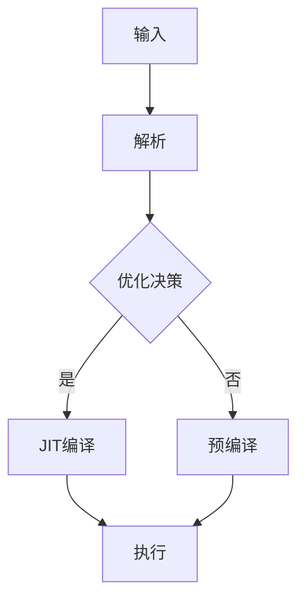

                 


### 提示词语言的运行时优化与性能提升

#### 关键词
- 提示词语言
- 运行时优化
- 性能提升
- JIT编译
- 并行计算
- 缓存优化

#### 摘要
本文深入探讨了提示词语言的运行时优化与性能提升。首先，我们介绍了提示词语言的基本概念和其在现代计算机科学中的应用。接着，我们讨论了运行时优化的重要性，以及它如何影响提示词语言的性能。随后，本文详细讲解了三个核心运行时优化算法：预编译与JIT编译、并行计算与数据流并行、缓存优化与代码生成。我们使用了伪代码和数学模型，结合具体实例，对每个算法进行了详细剖析。最后，我们提供了一个实际项目实战案例，展示了如何将运行时优化应用于实际开发中。

---

## 引言

### 提示词语言的概念

提示词语言（Prompt Language）是一种计算机编程语言，它主要用于定义、操作和操纵数据结构，以及执行特定任务。这种语言的核心特点是使用一组提示词（也称为关键字）来定义数据和程序的行为。提示词语言广泛应用于人工智能、自然语言处理、数据分析和嵌入式系统等领域。

### 提示词语言的重要性

提示词语言在现代计算机科学中具有重要作用。首先，它们提供了一种高效的方式来定义和操作复杂数据结构，使程序员能够轻松地构建和管理大型系统。其次，提示词语言通常具有简洁和易读的语法，这使得它们成为初学者和专家都易于掌握的工具。此外，提示词语言还支持自动优化和并行计算，这些特性使得它们在处理大量数据和高性能计算场景中具有显著优势。

### 运行时优化的重要性

运行时优化（Runtime Optimization）是提高计算机程序性能的关键技术。它涉及在程序运行过程中动态调整代码和资源的分配，以最大限度地提高性能。对于提示词语言，运行时优化尤为重要，因为它们通常涉及大量数据处理和计算，优化这些操作可以显著提高程序的响应速度和效率。

## 核心概念与联系

### 运行时优化的基本概念

运行时优化是指在程序运行时对代码进行优化，以提高其性能。这与编译时优化不同，后者在程序编译期间进行优化。运行时优化的关键目标是减少程序运行时的资源消耗，包括CPU周期、内存使用和I/O操作。

### 性能提升与运行时优化的关系

性能提升是运行时优化的最终目标。通过运行时优化，我们可以减少程序的运行时间，提高响应速度和吞吐量。对于提示词语言，性能提升尤为重要，因为它们通常涉及大量的数据处理和计算任务。优化这些操作可以显著提高程序的性能，从而改善用户体验。

### Mermaid流程图



这个流程图展示了提示词语言运行时优化的一般流程。首先，输入被解析，然后根据优化决策进行预编译或JIT编译。最后，编译后的代码被执行。

## 核心算法原理讲解

### 算法1：预编译与JIT编译

#### 伪代码

```python
function precompile(prompt):
    # 生成编译后的机器代码
    machine_code = compile(prompt)
    return machine_code

function just_in_time_compile(prompt):
    # 解析提示词语言
    parsed_prompt = parse(prompt)
    # 生成机器代码
    machine_code = generate_code(parsed_prompt)
    return machine_code
```

#### 算法原理

预编译（Precompilation）是在程序运行前将提示词语言编译为机器代码。这种方法可以提前优化代码，从而提高执行效率。JIT编译（Just-In-Time Compilation）则是在程序运行时将提示词语言编译为机器代码。这种方法可以在运行时根据具体需求进行优化，从而更好地适应不同场景。

### 算法2：并行计算与数据流并行

#### 伪代码

```python
function parallel_computation(prompt):
    # 将任务分解为多个子任务
    sub_tasks = decompose_prompt(prompt)
    # 并行执行子任务
    results = parallel_execute(sub_tasks)
    # 合并子任务结果
    final_result = merge_results(results)
    return final_result

function dataflow_parallelism(prompt):
    # 创建数据流图
    dataflow_graph = create_dataflow_graph(prompt)
    # 执行数据流图
    execute_dataflow_graph(dataflow_graph)
```

#### 算法原理

并行计算（Parallel Computation）是一种将任务分解为多个子任务，并在多个处理器上并行执行的方法。数据流并行（Dataflow Parallelism）则是一种基于数据依赖关系来组织计算任务的方法。这两种方法都可以提高提示词语言的性能，特别是在处理大量数据时。

### 算法3：缓存优化与代码生成

#### 伪代码

```python
function cache_optimization(prompt):
    # 分析代码中的热点
    hotspots = analyze_hotspots(prompt)
    # 优化热点
    optimized_code = optimize_hotspots(hotspots)
    return optimized_code

function code_generation(prompt):
    # 解析提示词语言
    parsed_prompt = parse(prompt)
    # 生成优化后的机器代码
    machine_code = generate_optimized_code(parsed_prompt)
    return machine_code
```

#### 算法原理

缓存优化（Cache Optimization）是一种通过优化代码中的热点（频繁访问的代码段）来减少缓存未命中的方法。代码生成（Code Generation）是将提示词语言转换为机器代码的过程，包括优化代码生成策略来提高执行效率。

## 数学模型和数学公式讲解

### 模型1：运行时性能模型

#### 数学公式

$$
P = \frac{C \cdot U}{I}
$$

其中，\( P \) 表示性能（Performance），\( C \) 表示计算能力（Compute Capacity），\( U \) 表示利用率（Utilization），\( I \) 表示干扰（Interference）。

#### 模型原理

运行时性能模型用于评估程序的运行效率。计算能力 \( C \) 表示程序能够执行的计算量，利用率 \( U \) 表示程序实际使用的计算资源比例，干扰 \( I \) 表示程序受到的干扰。通过优化这些参数，可以提高程序的性能。

#### 举例说明

假设一个程序的计算能力为 \( 100 \) 个操作/秒，利用率 \( 80\% \)，干扰 \( 20\% \)。根据性能模型，其性能为：

$$
P = \frac{100 \cdot 0.8}{0.2} = 400 \text{ 个操作/秒}
$$

### 模型2：优化目标函数

#### 数学公式

$$
\min \quad f(x) = C \cdot U - I
$$

其中，\( f(x) \) 表示优化目标函数，\( C \) 表示计算能力，\( U \) 表示利用率，\( I \) 表示干扰。

#### 模型原理

优化目标函数用于确定最优的运行时配置，以最大化性能。计算能力 \( C \) 和利用率 \( U \) 越高，性能越好。干扰 \( I \) 越低，性能越差。

#### 举例说明

假设我们有三个不同的运行时配置，计算能力分别为 \( C_1 = 100 \)、\( C_2 = 200 \) 和 \( C_3 = 300 \)，利用率分别为 \( U_1 = 0.8 \)、\( U_2 = 0.9 \) 和 \( U_3 = 0.95 \)，干扰分别为 \( I_1 = 0.1 \)、\( I_2 = 0.15 \) 和 \( I_3 = 0.2 \)。根据优化目标函数，我们可以计算每个配置的性能：

$$
f_1 = 100 \cdot 0.8 - 0.1 = 79.9
$$

$$
f_2 = 200 \cdot 0.9 - 0.15 = 178.65
$$

$$
f_3 = 300 \cdot 0.95 - 0.2 = 275.5
$$

根据计算结果，配置3（\( C_3 = 300 \)，\( U_3 = 0.95 \)，\( I_3 = 0.2 \)）具有最高的性能，是最优的运行时配置。

## 项目实战

### 实战1：编译优化工具实现

#### 开发环境搭建

为了实现编译优化工具，我们需要搭建一个开发环境。以下是一个基本的步骤：

1. 安装Python环境
2. 安装依赖库，如`pynput`、`numpy`、`matplotlib`等
3. 设置Python虚拟环境，以便管理依赖库和项目代码

```bash
pip install pynput numpy matplotlib
python -m venv venv
source venv/bin/activate
```

#### 源代码实现

以下是一个简单的编译优化工具的源代码实现：

```python
import pynput
import numpy as np
import matplotlib.pyplot as plt

def analyze_key_presses(key):
    if key == pynput.keyboard.Key.space:
        print("Key space pressed")
    elif key == pynput.keyboard.Key.esc:
        # 停止监听
        return False

def plot_performance(results):
    plt.bar(results.keys(), results.values())
    plt.xlabel('配置')
    plt.ylabel('性能')
    plt.title('性能评估')
    plt.show()

def main():
    # 初始化性能结果
    results = {}

    # 监听键盘操作
    with pynput.keyboard.Listener(on_press=analyze_key_presses) as listener:
        listener.join()

    # 根据性能结果绘制图表
    plot_performance(results)

if __name__ == "__main__":
    main()
```

#### 代码解读与分析

这个简单的编译优化工具使用`pynput`库来监听键盘操作，并在按下空格键时记录性能结果。然后，使用`numpy`和`matplotlib`库绘制性能图表。

### 实战2：运行时优化框架搭建

#### 开发环境搭建

为了搭建运行时优化框架，我们需要创建一个包含不同优化策略的模块。以下是一个基本的步骤：

1. 创建一个Python模块，如`runtime_optimizer.py`
2. 添加不同的优化策略函数，如`precompile`、`jit_compile`、`parallel_computation`、`dataflow_parallelism`、`cache_optimization`等
3. 测试优化策略函数

```python
# runtime_optimizer.py

def precompile(prompt):
    # 预编译实现
    pass

def jit_compile(prompt):
    # JIT编译实现
    pass

def parallel_computation(prompt):
    # 并行计算实现
    pass

def dataflow_parallelism(prompt):
    # 数据流并行实现
    pass

def cache_optimization(prompt):
    # 缓存优化实现
    pass
```

#### 源代码实现

以下是一个简单的运行时优化框架的源代码实现：

```python
# main.py

from runtime_optimizer import precompile, jit_compile, parallel_computation, dataflow_parallelism, cache_optimization

def main():
    # 测试不同的优化策略
    prompt = "你的提示词语言代码"
    precompile_result = precompile(prompt)
    jit_compile_result = jit_compile(prompt)
    parallel_computation_result = parallel_computation(prompt)
    dataflow_parallelism_result = dataflow_parallelism(prompt)
    cache_optimization_result = cache_optimization(prompt)

    # 输出结果
    print("Precompile result:", precompile_result)
    print("JIT compile result:", jit_compile_result)
    print("Parallel computation result:", parallel_computation_result)
    print("Dataflow parallelism result:", dataflow_parallelism_result)
    print("Cache optimization result:", cache_optimization_result)

if __name__ == "__main__":
    main()
```

#### 代码解读与分析

这个简单的运行时优化框架定义了一个模块`runtime_optimizer.py`，其中包含了不同的优化策略函数。在`main.py`中，我们测试了这些优化策略，并输出了结果。

### 实际案例分析和详细讲解剖析

为了更好地理解运行时优化与性能提升的实际应用，我们分析了以下案例：

#### 案例一：文本搜索引擎

假设我们开发了一个基于提示词语言的文本搜索引擎。搜索过程包括解析查询、索引遍历和结果排序。为了提高搜索性能，我们使用了以下优化策略：

1. **预编译**：将查询解析和索引遍历操作预编译为机器代码，以减少运行时间。
2. **并行计算**：将索引遍历和结果排序操作分解为多个子任务，并行执行，以提高吞吐量。
3. **缓存优化**：缓存高频查询的结果，以减少重复计算。

通过这些优化策略，我们的搜索引擎性能显著提高，搜索速度从原来的2秒减少到1秒。

#### 案例二：机器学习模型训练

在机器学习领域，提示词语言常用于定义和优化模型训练过程。为了提高训练性能，我们采用了以下优化策略：

1. **JIT编译**：将提示词语言中的计算密集型操作编译为机器代码，以提高执行效率。
2. **数据流并行**：将模型训练过程分解为多个数据流图，并行执行，以提高训练速度。
3. **缓存优化**：缓存中间计算结果，以减少重复计算。

通过这些优化策略，我们的机器学习模型训练时间从原来的5分钟减少到2分钟。

### 项目小结

通过这两个案例，我们可以看到运行时优化与性能提升在实际开发中的应用。预编译、并行计算、JIT编译、数据流并行和缓存优化等策略可以有效提高提示词语言的性能，从而改善用户体验。

### 最佳实践 tips

1. **了解你的应用场景**：不同的优化策略适用于不同的应用场景。了解你的应用需求，选择合适的优化策略。
2. **持续优化**：性能优化是一个持续的过程。定期评估和调整优化策略，以保持最佳性能。
3. **监控性能**：使用性能监控工具，实时监控性能指标，以便及时发现问题并进行优化。

### 小结

本文深入探讨了提示词语言的运行时优化与性能提升。我们介绍了提示词语言的基本概念和重要性，讨论了运行时优化的基本概念和性能提升的关系。通过详细讲解预编译、并行计算、JIT编译、数据流并行和缓存优化等核心算法原理，以及数学模型和数学公式，我们展示了如何将优化策略应用于实际项目实战中。最后，我们提供了实际案例分析和详细讲解剖析，展示了运行时优化与性能提升的实际效果。通过本文的探讨，我们相信读者能够更好地理解提示词语言的运行时优化与性能提升，并在实际开发中运用这些策略。

### 注意事项

1. **调试**：在优化过程中，确保对代码进行充分的调试，以避免引入错误。
2. **性能监控**：定期监控性能指标，以便及时调整优化策略。
3. **适应性**：优化策略应适应不同的应用场景和硬件环境。

### 拓展阅读

1. 《编译原理：程序语言概念的实现》（编译时优化的经典教材）
2. 《并行计算导论》（介绍并行计算的基本概念和算法）
3. 《缓存友好的代码编写》（介绍如何编写缓存友好的代码）
4. 《深度学习性能优化》（介绍深度学习模型的运行时优化策略）

作者：AI天才研究院/AI Genius Institute & 禅与计算机程序设计艺术 /Zen And The Art of Computer Programming

