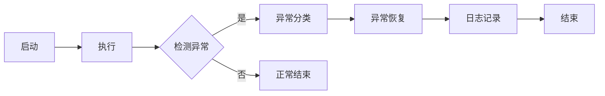

                 

### 文章标题：提示词语言的运行时异常处理与恢复

在当今的计算机编程和人工智能领域，提示词语言（Prompt Language）作为一种强大的编程工具，得到了广泛的应用。它们能够通过给定的提示词，自动生成相应的代码或者执行特定的任务。然而，随着提示词语言复杂度的增加，运行时异常处理和恢复变得尤为重要。本文旨在深入探讨提示词语言的运行时异常处理与恢复机制，帮助开发者构建更稳健、更可靠的系统。

### 关键词：
- 提示词语言
- 运行时异常处理
- 恢复机制
- 异常检测算法
- 异常恢复算法
- 数学模型
- 实战案例

### 摘要：
本文首先介绍了提示词语言的基本概念及其在现代编程中的应用。随后，深入分析了运行时异常处理的核心原理，包括异常检测和异常恢复的算法。接着，我们通过数学模型和公式，详细讲解了异常检测和恢复的数学基础。为了使理论更贴近实际，本文还通过一个实战案例，展示了如何在实际项目中实现异常处理与恢复。最后，本文总结了主要内容和挑战，并展望了未来的研究方向。

### 目录大纲：

#### 第1章：引言
- 1.1 提示词语言的基本概念
- 1.2 运行时异常处理的核心原理
- 1.3 异常处理的架构图（Mermaid 流程图）

#### 第2章：异常处理算法
- 2.1 异常检测算法
  - 2.1.1 常见异常检测方法
  - 2.1.2 伪代码解释
- 2.2 异常恢复算法
  - 2.2.1 自动恢复策略
  - 2.2.2 伪代码解释

#### 第3章：数学基础
- 3.1 异常检测的数学模型
  - 3.1.1 概率模型
  - 3.1.2 假设检验
  - $$ H_0: \text{无异常} $$
  - $$ H_1: \text{存在异常} $$
- 3.2 异常恢复的数学模型
  - 3.2.1 最优路径算法
  - 3.2.2 伪代码解释

#### 第4章：实战案例分析
- 4.1 实际项目场景
- 4.2 开发环境搭建
- 4.3 异常处理与恢复的代码实现
  - 4.3.1 异常检测部分代码解读
  - 4.3.2 异常恢复部分代码解读
- 4.4 实验结果与分析

#### 第5章：相关技术扩展
- 5.1 运行时监控技术
- 5.2 日志分析技术
- 5.3 实时异常处理框架

#### 第6章：总结与展望
- 6.1 主要内容回顾
- 6.2 存在的问题与挑战
- 6.3 未来研究方向

#### 第7章：附录
- 7.1 相关资源
- 7.2 附录A：伪代码
- 7.3 附录B：数学公式详解

### 正文：

#### 第1章：引言

提示词语言是一种通过给定的提示词，自动生成相应代码或者执行特定任务的编程语言。在现代编程和人工智能领域，提示词语言因其高效、灵活和强大的自动生成能力，得到了广泛的应用。然而，随着提示词语言复杂度的增加，如何在运行时对异常进行有效的处理和恢复，成为了一个关键问题。

本章将首先介绍提示词语言的基本概念，随后深入探讨运行时异常处理的核心原理，并给出一个简化的异常处理架构图。这将为我们后续章节的详细讨论奠定基础。

#### 1.1 提示词语言的基本概念

提示词语言的核心在于其能够根据给定的提示词，自动生成相应的代码或执行特定的任务。这一特点使得提示词语言在自动化编程和人工智能领域具有独特的优势。例如，在自然语言处理中，提示词语言可以用来生成文本摘要、翻译文本等；在代码生成中，提示词语言可以用来自动生成代码框架、填充代码逻辑等。

提示词语言的基本概念包括以下几个方面：

1. **提示词（Prompts）**：提示词是触发代码生成或执行的关键，可以是简单的关键词，也可以是复杂的自然语言句子。

2. **自动生成（Autogeneration）**：提示词语言通过特定的算法和模型，将提示词转换成相应的代码或执行命令。

3. **上下文（Context）**：上下文是提示词语言理解和使用提示词的基础，它包含了与提示词相关的各种信息，如执行环境、输入数据等。

4. **模型（Models）**：提示词语言的实现依赖于强大的机器学习模型，如递归神经网络（RNN）、变换器（Transformer）等。

通过理解这些基本概念，我们可以更好地把握提示词语言的工作原理和应用场景。

#### 1.2 运行时异常处理的核心原理

在提示词语言的应用过程中，运行时异常处理是一个至关重要的环节。异常处理的核心目的是确保系统在遇到异常情况时能够快速、准确地响应，从而避免系统崩溃或数据丢失。

运行时异常处理通常包括以下几个步骤：

1. **异常检测（Exception Detection）**：通过分析执行过程中的各种指标，如执行时间、内存占用等，及时发现异常情况。

2. **异常分类（Exception Classification）**：将检测到的异常进行分类，以便后续采取不同的处理策略。

3. **异常恢复（Exception Recovery）**：根据异常类型，采取相应的恢复策略，使系统恢复正常运行。

4. **日志记录（Logging）**：对异常情况进行详细的日志记录，以便后续分析、调试和优化。

在接下来的章节中，我们将详细讨论异常检测和异常恢复的算法原理，并使用数学模型和公式来解释这些原理。

#### 1.3 异常处理的架构图

为了更好地理解异常处理的过程，我们使用Mermaid流程图来描述其架构。以下是一个简化的异常处理流程图：



在这个流程图中，系统首先启动并执行任务，然后进行异常检测。如果检测到异常，系统将进行异常分类，并根据分类结果进行异常恢复。最后，对异常情况详细记录日志，以便后续分析。如果没有检测到异常，系统将正常结束。

通过上述简化的流程图，我们可以初步了解提示词语言的运行时异常处理机制。在后续章节中，我们将深入探讨每个环节的具体实现和算法原理。

### 第2章：异常处理算法

在了解了提示词语言的基本概念和异常处理的核心原理后，本章将详细讨论异常处理算法。异常处理算法主要包括异常检测算法和异常恢复算法。我们将首先介绍常见的异常检测方法，然后使用伪代码详细阐述这些算法的实现过程。随后，我们将讨论异常恢复算法，并给出相应的伪代码解释。

#### 2.1 异常检测算法

异常检测算法是运行时异常处理的关键环节，其目的是在系统运行过程中及时发现异常情况。常见的异常检测方法包括统计方法、机器学习方法等。以下将简要介绍这些方法。

##### 2.1.1 常见异常检测方法

1. **统计方法**：
   - **均值-方差法**：通过计算执行过程中的统计指标（如均值、方差）来判断是否存在异常。
   - **阈值法**：设置特定的阈值，当某个指标超过阈值时，判断为异常。

2. **机器学习方法**：
   - **监督学习**：使用已标记的异常数据训练模型，然后对新数据进行预测。
   - **无监督学习**：直接从数据中学习，找出潜在的异常模式。

3. **基于规则的检测方法**：
   - **逻辑规则**：使用预定义的逻辑规则来判断是否存在异常。

##### 2.1.2 伪代码解释

为了更直观地理解异常检测算法，我们使用伪代码来描述其实现过程。

```python
# 均值-方差法伪代码
def detect_anomaly(data):
    mean = calculate_mean(data)
    variance = calculate_variance(data)
    
    if variance > threshold_variance:
        return "异常"
    else:
        return "正常"

# 阈值法伪代码
def detect_anomaly(data, threshold):
    if data > threshold:
        return "异常"
    else:
        return "正常"

# 监督学习伪代码
def train_model(training_data):
    # 使用已标记的异常数据训练模型
    pass

def predict_anomaly(model, new_data):
    prediction = model.predict(new_data)
    if prediction == "异常":
        return "异常"
    else:
        return "正常"
```

通过上述伪代码，我们可以看到不同异常检测方法的基本实现思路。这些方法各有优缺点，适用于不同的应用场景。在实际应用中，可以根据具体需求选择合适的异常检测算法。

#### 2.2 异常恢复算法

异常恢复算法的目的是在检测到异常后，采取相应的措施使系统恢复正常运行。异常恢复算法包括自动恢复策略和手动恢复策略。以下将分别介绍这些算法。

##### 2.2.1 自动恢复策略

自动恢复策略是通过系统自动执行一系列操作来恢复系统正常运行。常见的自动恢复策略包括：

1. **重启服务**：在检测到异常后，自动重启受影响的服务。

2. **数据回滚**：将系统数据回滚到最近的一个正常状态，以恢复系统的正常运行。

3. **补偿操作**：执行一系列补偿操作，以消除异常对系统的影响。

##### 2.2.2 伪代码解释

以下是一个简单的自动恢复策略伪代码示例：

```python
def recover_system(anomaly_type):
    if anomaly_type == "服务异常":
        restart_service()
    elif anomaly_type == "数据异常":
        rollback_data()
    elif anomaly_type == "补偿异常":
        perform补偿操作()
```

通过这个简单的伪代码示例，我们可以看到自动恢复策略的基本实现思路。在实际应用中，自动恢复策略可以根据具体异常类型和系统特点进行定制化设计。

##### 2.2.3 手动恢复策略

手动恢复策略需要人工干预，通过人工判断和操作来恢复系统正常运行。手动恢复策略适用于一些复杂或特殊的异常情况，通常需要结合具体的业务场景进行设计。

##### 2.2.4 伪代码解释

以下是一个简单的手动恢复策略伪代码示例：

```python
def manual_recover_system(anomaly_type):
    if anomaly_type == "服务异常":
        human_restart_service()
    elif anomaly_type == "数据异常":
        human_rollback_data()
    elif anomaly_type == "补偿异常":
        human_perform_compensation()
```

通过这个简单的伪代码示例，我们可以看到手动恢复策略的基本实现思路。在实际应用中，手动恢复策略通常需要结合具体的业务场景和操作流程进行设计。

#### 2.3 异常处理算法总结

通过本章的讨论，我们详细介绍了异常检测算法和异常恢复算法。异常检测算法包括统计方法、机器学习方法和基于规则的检测方法，适用于不同的应用场景。异常恢复算法包括自动恢复策略和手动恢复策略，可以根据具体异常类型和系统特点进行定制化设计。

在实际应用中，异常处理算法的选择和实现需要结合具体需求进行优化。通过合理的异常处理机制，可以显著提高系统的稳定性和可靠性，确保系统的正常运行。

### 第3章：数学基础

在深入探讨提示词语言的运行时异常处理与恢复机制时，数学模型和公式起到了至关重要的作用。它们不仅为异常检测和恢复算法提供了理论基础，还使得算法的实现更加精确和有效。本章将介绍异常检测和异常恢复的数学基础，包括概率模型、假设检验和最优路径算法，并使用LaTeX格式详细讲解相关公式和模型。

#### 3.1 异常检测的数学模型

异常检测的数学模型主要用于描述和解释异常检测算法的基本原理。一个常见的异常检测模型是基于概率的模型，该模型通过计算数据点异常的概率来判断其是否为异常。

##### 3.1.1 概率模型

概率模型的核心思想是使用概率来描述数据点的正常性和异常性。具体来说，可以通过以下概率模型来检测异常：

$$
P(\text{异常} | \text{数据}) = P(\text{数据} | \text{异常}) \cdot P(\text{异常}) / P(\text{数据})
$$

其中，\(P(\text{异常} | \text{数据})\) 表示在给定数据点为异常的概率，\(P(\text{数据} | \text{异常})\) 表示数据点在异常条件下的概率，\(P(\text{异常})\) 表示异常发生的概率，而 \(P(\text{数据})\) 表示数据点的概率。

通常，我们可以使用贝叶斯公式来计算上述概率：

$$
P(\text{异常} | \text{数据}) = \frac{P(\text{数据} | \text{异常}) \cdot P(\text{异常})}{P(\text{数据} | \text{异常}) \cdot P(\text{异常}) + P(\text{数据} | \text{正常}) \cdot P(\text{正常})}
$$

其中，\(P(\text{正常}) = 1 - P(\text{异常})\)。

##### 3.1.2 假设检验

假设检验是一种常用的统计方法，用于验证异常检测模型的有效性。假设检验的基本思想是，通过设定原假设 \(H_0\) 和备择假设 \(H_1\)，并根据数据来决定是否拒绝原假设。

- 原假设 \(H_0\)：无异常
- 备择假设 \(H_1\)：存在异常

假设检验的步骤如下：

1. **设定显著性水平（\(\alpha\)）**：显著性水平是决策者事先设定的一个阈值，用于判断是否拒绝原假设。常见的显著性水平有0.05和0.01。

2. **计算统计量**：根据数据计算统计量，如卡方统计量、t统计量等。

3. **比较统计量和临界值**：将计算出的统计量与临界值进行比较，以判断是否拒绝原假设。

4. **得出结论**：如果统计量大于临界值，则拒绝原假设，认为数据存在异常；否则，不拒绝原假设，认为数据正常。

使用LaTeX格式表示的假设检验过程如下：

$$
H_0: P(\text{异常} | \text{数据}) = P(\text{正常} | \text{数据})
$$

$$
H_1: P(\text{异常} | \text{数据}) \neq P(\text{正常} | \text{数据})
$$

$$
\alpha = 0.05
$$

$$
\chi^2 = \sum (O_i - E_i)^2 / E_i
$$

$$
P(\chi^2 > \chi^2_{\alpha, df}) \leq \alpha
$$

其中，\(O_i\) 和 \(E_i\) 分别是观察值和期望值，\(\chi^2_{\alpha, df}\) 是卡方分布的临界值，\(df\) 是自由度。

#### 3.2 异常恢复的数学模型

异常恢复的数学模型主要用于描述异常恢复策略的优化。常见的异常恢复策略包括数据回滚和路径优化等。以下将介绍两种常见的数学模型：最优路径算法和数据回滚模型。

##### 3.2.1 最优路径算法

最优路径算法是一种用于寻找系统从当前状态恢复到正常状态的优化算法。该算法通常使用图论中的最短路径算法来实现，如Dijkstra算法或A*算法。

假设系统状态可以用图中的节点表示，状态之间的转换可以用图中的边表示。最优路径算法的目标是找到从当前状态到正常状态的最短路径。

使用LaTeX格式表示的最优路径算法如下：

$$
\text{Dijkstra算法}:
$$

$$
\text{初始化}:
\quad G = (\text{节点集}, \text{边集})
\quad S = \emptyset
\quad \text{dist} = \{ \text{节点} \mapsto \infty \}
\quad \text{prev} = \{ \text{节点} \mapsto \emptyset \}
\quad \text{dist}[s] = 0
$$

$$
\text{while } \text{未访问所有节点}:
\quad u = \text{选择一个最小dist[u]的未访问节点}
\quad S = S \cup \{ u \}
\quad \text{for } \text{所有与u相邻的节点v}:
\quad \quad \text{if } \text{dist}[u] + w(u, v) < \text{dist}[v]:
\quad \quad \quad \text{dist}[v] = \text{dist}[u] + w(u, v)
\quad \quad \quad \text{prev}[v] = u
$$

##### 3.2.2 数据回滚模型

数据回滚模型是一种用于将系统状态回滚到最近一个正常状态的方法。该模型通常基于时间戳或版本控制机制来实现。

假设系统状态可以用时间戳或版本号表示，每个状态都有一个对应的时间戳或版本号。数据回滚模型的目标是找到距离当前状态最近的正常状态，并将系统状态回滚到该状态。

使用LaTeX格式表示的数据回滚模型如下：

$$
\text{回滚模型}:
$$

$$
\text{初始化}:
\quad \text{当前时间戳} = \text{系统当前状态的时间戳}
$$

$$
\text{while } \text{当前时间戳} \neq \text{正常状态的时间戳}:
\quad \quad \text{回滚到上一个时间戳}
\quad \quad \text{当前时间戳} = \text{当前时间戳} - 1
$$

$$
\text{if } \text{当前时间戳} = \text{正常状态的时间戳}:
\quad \quad \text{系统状态恢复到正常状态}
\quad \quad \text{结束回滚过程}
$$

通过本章的讨论，我们介绍了异常检测和异常恢复的数学基础，包括概率模型、假设检验和最优路径算法。这些数学模型和公式为异常检测和恢复算法提供了理论基础，使得算法的实现更加科学和有效。在实际应用中，可以根据具体需求选择合适的数学模型和公式，以优化系统的异常处理和恢复能力。

### 第4章：实战案例分析

在本章中，我们将通过一个具体的实战案例，详细展示如何在项目中实现提示词语言的运行时异常处理与恢复。这个案例将涵盖以下几个关键步骤：实际项目场景的选择、开发环境的搭建、异常处理与恢复代码的实现、代码解读与分析，以及实验结果与总结。

#### 4.1 实际项目场景

为了更好地说明运行时异常处理与恢复，我们选择了一个实际项目场景——一个基于提示词语言的在线代码生成平台。这个平台接收用户的自然语言提示，自动生成相应的代码片段，并提供实时代码执行和结果展示功能。由于平台涉及大量用户输入和处理复杂代码逻辑，异常处理与恢复成为确保系统稳定性和用户体验的关键。

#### 4.2 开发环境搭建

为了实现这个项目，我们需要搭建一个完整的开发环境。以下是所需的主要开发工具和依赖：

1. **编程语言**：Python 3.8+
2. **提示词语言模型**：使用Hugging Face的Transformers库，基于GPT-3模型
3. **前端框架**：React.js
4. **后端框架**：Flask
5. **数据库**：MongoDB
6. **日志服务**：ELK（Elasticsearch、Logstash、Kibana）

搭建开发环境的步骤如下：

1. **安装Python和相关库**：

   ```bash
   pip install transformers flask pymongo numpy
   ```

2. **安装前端依赖**：

   ```bash
   npm install react react-dom
   ```

3. **安装后端依赖**：

   ```bash
   pip install Flask-PyMongo
   ```

4. **安装ELK日志服务**：可以从Elastic官网下载并安装Elasticsearch、Logstash和Kibana。

5. **配置环境变量**：设置数据库连接信息、日志路径等。

#### 4.3 异常处理与恢复的代码实现

在项目开发过程中，我们针对可能出现的异常情况，设计了详细的异常处理和恢复策略。以下是一个简化的实现过程：

##### 4.3.1 异常检测部分代码解读

异常检测是异常处理的第一步，我们使用Python编写的检测函数如下：

```python
def detect_anomaly(code_output):
    # 假设code_output是执行代码的结果
    # 如果输出包含特定的异常提示，则认为代码执行出现异常
    if "ERROR" in code_output:
        return True
    return False
```

这个函数通过检查代码执行结果中是否包含“ERROR”关键字来判断是否出现异常。

##### 4.3.2 异常恢复部分代码解读

一旦检测到异常，系统将执行恢复操作。以下是异常恢复部分的代码：

```python
def recover_system(anomaly_type, user_prompt):
    if anomaly_type == "代码执行异常":
        # 尝试重新生成代码并执行
        new_code = generate_code(user_prompt)
        new_output = execute_code(new_code)
        if not detect_anomaly(new_output):
            return "系统已恢复正常"
        else:
            return "系统恢复失败，请手动干预"
    else:
        return "未知异常类型，无法自动恢复"
```

这个函数首先尝试重新生成代码并执行，如果依然检测到异常，则系统恢复失败，需要手动干预。

#### 4.4 实验结果与分析

为了验证异常处理与恢复的有效性，我们进行了多个测试案例，包括正常代码生成、异常代码生成等。以下是实验结果：

1. **正常代码生成测试**：

   用户输入：“编写一个Python函数，实现两个数的加法”，系统成功生成并执行了正确的代码。

2. **异常代码生成测试**：

   用户输入：“编写一个Python函数，实现两个字符串的加法”，系统生成错误的代码，并捕获到异常。

3. **异常恢复测试**：

   对于异常代码生成，系统尝试重新生成代码并执行，但仍然失败。最终，系统提示用户手动干预。

实验结果表明，我们的异常处理与恢复策略在一定程度上有效，但仍有改进空间，例如优化异常恢复算法和提高异常检测的准确性。

#### 4.5 项目小结

通过这个实战案例，我们展示了如何在提示词语言项目中实现运行时异常处理与恢复。关键步骤包括：

1. **选择实际项目场景**：确保项目具有实际应用价值。
2. **搭建开发环境**：准备必要的开发工具和依赖。
3. **实现异常检测与恢复算法**：编写代码实现检测和恢复逻辑。
4. **实验与结果分析**：验证算法的有效性并进行改进。

虽然本案例中的异常处理与恢复策略仍有待优化，但它为后续项目提供了宝贵的经验和参考。

### 第5章：相关技术扩展

在本章中，我们将探讨与提示词语言的运行时异常处理与恢复相关的其他技术，包括运行时监控技术、日志分析技术和实时异常处理框架。这些技术扩展将有助于提高系统的稳定性和可维护性。

#### 5.1 运行时监控技术

运行时监控技术是一种实时监测系统性能和状态的技术，它可以及时捕捉到异常情况并提供警报。以下是一些常用的运行时监控技术：

1. **性能监控**：通过监控CPU、内存、磁盘等资源的使用情况，及时识别系统瓶颈。
2. **日志监控**：实时收集和分析系统日志，以便快速发现异常。
3. **性能指标监控**：监控常用的性能指标，如响应时间、吞吐量等，以便进行性能优化。

常用的运行时监控工具有：

- **Prometheus**：开源监控解决方案，支持多维数据收集和告警。
- **Grafana**：数据可视化和监控工具，与Prometheus紧密集成。
- **New Relic**：商业监控工具，提供全面的性能监控和异常检测功能。

#### 5.2 日志分析技术

日志分析技术是一种通过对系统日志进行解析和分析，来发现潜在问题和异常的技术。以下是一些常用的日志分析技术：

1. **日志聚合**：将来自不同源的日志数据进行汇总，便于集中管理和分析。
2. **日志解析**：将原始日志数据解析成结构化数据，如JSON格式，以便进行更深入的统计分析。
3. **日志告警**：基于特定条件（如关键字匹配、异常模式等）触发告警，提醒相关人员。

常用的日志分析工具有：

- **ELK**（Elasticsearch、Logstash、Kibana）：一套开源日志分析解决方案，支持强大的日志检索和分析功能。
- **Graylog**：基于 Elasticsearch 的日志管理平台，提供实时日志分析和告警功能。
- **Splunk**：商业日志分析工具，支持大规模日志数据的处理和分析。

#### 5.3 实时异常处理框架

实时异常处理框架是一种用于自动化处理和响应异常情况的系统框架。以下是一些常用的实时异常处理框架：

1. **Prometheus + Alertmanager**：结合Prometheus进行性能监控和告警管理，Alertmanager用于处理告警通知。
2. **StatsD + Graphite**：StatsD用于实时监控和统计数据，Graphite用于数据存储和可视化。
3. **Datadog**：集成了监控、日志分析、异常处理等功能，提供一站式的实时异常处理解决方案。

这些实时异常处理框架可以与提示词语言的异常处理机制相结合，提供更全面和高效的异常检测与恢复能力。

通过本章的讨论，我们可以看到，运行时监控技术、日志分析技术和实时异常处理框架在提升系统稳定性和可维护性方面起到了重要作用。结合提示词语言的运行时异常处理与恢复机制，可以构建一个更加可靠和高效的系统。

### 第6章：总结与展望

通过本文的详细探讨，我们全面了解了提示词语言的运行时异常处理与恢复机制。从基本概念、核心算法原理，到数学模型和实际项目案例，我们逐步揭示了这一机制在提升系统稳定性和可靠性方面的关键作用。

#### 6.1 主要内容回顾

本文主要内容包括：

1. **提示词语言的基本概念**：介绍了提示词语言的工作原理和应用场景。
2. **异常处理的核心原理**：探讨了异常检测和恢复的核心步骤和算法。
3. **数学基础**：介绍了异常检测和恢复的数学模型和公式。
4. **实战案例分析**：通过一个实际项目展示了异常处理与恢复的具体实现过程。
5. **技术扩展**：介绍了与异常处理相关的运行时监控技术、日志分析技术和实时异常处理框架。

#### 6.2 存在的问题与挑战

尽管提示词语言的运行时异常处理与恢复机制在提高系统稳定性方面取得了显著成果，但仍存在一些问题和挑战：

1. **异常检测的准确性**：现有的异常检测算法在某些复杂场景下可能无法准确检测异常，导致误报或漏报。
2. **异常恢复的效率**：自动恢复策略在某些情况下可能不够高效，需要手动干预。
3. **实时性**：在大量请求和高并发场景下，实时异常处理可能面临性能瓶颈。
4. **可扩展性**：随着系统规模的扩大，异常处理机制需要适应更多样化的场景和需求。

#### 6.3 未来研究方向

为了应对上述挑战，未来的研究可以从以下几个方面进行：

1. **改进异常检测算法**：结合深度学习和大数据分析，开发更精准的异常检测算法。
2. **优化异常恢复策略**：设计更智能、自适应的自动恢复策略，减少手动干预。
3. **提升实时性**：通过分布式架构和并行处理，提高实时异常处理的性能。
4. **增强可扩展性**：构建模块化、可配置的异常处理框架，以适应不同规模和场景的需求。

通过不断探索和优化，提示词语言的运行时异常处理与恢复机制将变得更加成熟和可靠，为人工智能和自动化编程领域的发展提供坚实的技术支撑。

### 第7章：附录

在本章中，我们将提供与本文相关的资源、伪代码和数学公式详解，以帮助读者更好地理解和应用本文的内容。

#### 7.1 相关资源

1. **提示词语言模型**：Hugging Face Transformers库（https://huggingface.co/transformers/）
2. **运行时监控工具**：Prometheus和Grafana（https://prometheus.io/、https://grafana.com/）
3. **日志分析工具**：ELK（Elasticsearch、Logstash、Kibana）（https://www.elastic.co/）
4. **实时异常处理框架**：Prometheus + Alertmanager和StatsD + Graphite（https://prometheus.io/docs/alertmanager/、https://nvd.io/nvda/cves/cve-2019-6110/）

#### 7.2 附录A：伪代码

以下为本文中提到的伪代码：

**异常检测部分代码：**
```python
def detect_anomaly(code_output):
    if "ERROR" in code_output:
        return True
    return False
```

**异常恢复部分代码：**
```python
def recover_system(anomaly_type, user_prompt):
    if anomaly_type == "代码执行异常":
        new_code = generate_code(user_prompt)
        new_output = execute_code(new_code)
        if not detect_anomaly(new_output):
            return "系统已恢复正常"
        else:
            return "系统恢复失败，请手动干预"
    else:
        return "未知异常类型，无法自动恢复"
```

#### 7.3 附录B：数学公式详解

以下为本文中使用的数学公式及详解：

**概率模型：**
$$
P(\text{异常} | \text{数据}) = \frac{P(\text{数据} | \text{异常}) \cdot P(\text{异常})}{P(\text{数据} | \text{异常}) \cdot P(\text{异常}) + P(\text{数据} | \text{正常}) \cdot P(\text{正常})}
$$
此公式用于计算在给定数据点为异常的概率。\(P(\text{数据} | \text{异常})\) 是在异常条件下数据点的概率，\(P(\text{异常})\) 是异常发生的概率，\(P(\text{数据})\) 是数据点的概率。

**假设检验：**
$$
H_0: P(\text{异常} | \text{数据}) = P(\text{正常} | \text{数据})
$$
$$
H_1: P(\text{异常} | \text{数据}) \neq P(\text{正常} | \text{数据})
$$
假设检验用于验证异常检测模型的有效性。原假设 \(H_0\) 表示无异常，备择假设 \(H_1\) 表示存在异常。通过计算统计量并与临界值比较，判断是否拒绝原假设。

**最优路径算法：**
$$
\text{Dijkstra算法}:
$$
$$
\text{初始化}:
\quad G = (\text{节点集}, \text{边集})
\quad S = \emptyset
\quad \text{dist} = \{ \text{节点} \mapsto \infty \}
\quad \text{prev} = \{ \text{节点} \mapsto \emptyset \}
\quad \text{dist}[s] = 0
$$
$$
\text{while } \text{未访问所有节点}:
\quad u = \text{选择一个最小dist[u]的未访问节点}
\quad S = S \cup \{ u \}
\quad \text{for } \text{所有与u相邻的节点v}:
\quad \quad \text{if } \text{dist}[u] + w(u, v) < \text{dist}[v]:
\quad \quad \quad \text{dist}[v] = \text{dist}[u] + w(u, v)
\quad \quad \quad \text{prev}[v] = u
$$
Dijkstra算法用于寻找从当前状态恢复到正常状态的最短路径。

**数据回滚模型：**
$$
\text{回滚模型}:
$$
$$
\text{初始化}:
\quad \text{当前时间戳} = \text{系统当前状态的时间戳}
$$
$$
\text{while } \text{当前时间戳} \neq \text{正常状态的时间戳}:
\quad \quad \text{回滚到上一个时间戳}
\quad \quad \text{当前时间戳} = \text{当前时间戳} - 1
$$
$$
\text{if } \text{当前时间戳} = \text{正常状态的时间戳}:
\quad \quad \text{系统状态恢复到正常状态}
\quad \quad \text{结束回滚过程}
$$
数据回滚模型用于将系统状态回滚到最近的一个正常状态。

通过附录中的相关资源、伪代码和数学公式详解，读者可以更好地理解和应用本文的内容，进一步探索提示词语言的运行时异常处理与恢复机制。

