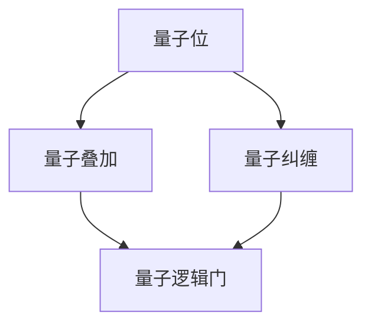
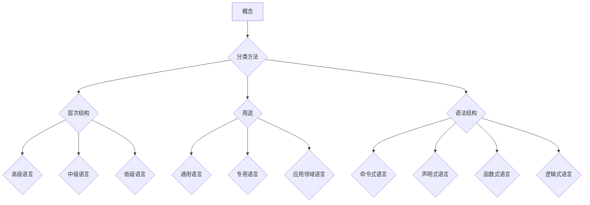
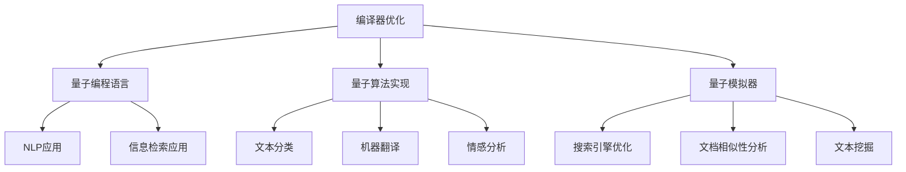
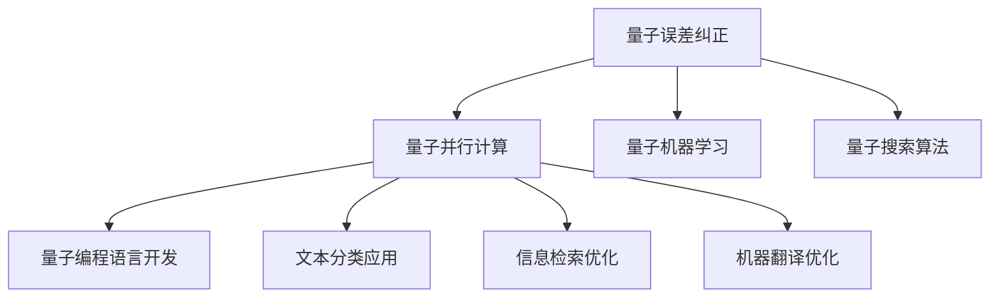

                 


### 文章标题

# 提示词语言的量子计算适配性研究

### 文章关键词

- 提示词语言
- 量子计算
- 适配性研究
- 算法原理
- 数学模型
- 项目实战

### 文章摘要

本文旨在探讨提示词语言与量子计算的适配性研究。首先介绍了量子计算的基础知识，包括量子位、量子逻辑门和量子算法等核心概念。接着，我们深入分析了提示词语言的基本原理和特性，并探讨了量子计算在提示词语言中的应用前景。文章通过详细的算法原理讲解和数学模型解释，展示了量子计算在提示词语言处理中的优势。最后，通过一个实际项目案例，详细阐述了量子计算在提示词语言领域的应用过程，并对未来研究和应用进行了展望。

## 第一部分：量子计算基础

### 第1章：量子计算概述

#### 1.1 量子计算的起源与发展

量子计算作为计算科学的前沿领域，其起源可以追溯到20世纪40年代。当时，物理学家保罗·戴恩斯和理查德·费曼提出了量子位（qubit）的概念，并设想了一种基于量子力学原理的计算机。随着量子物理和计算机科学的不断发展，量子计算的理论基础逐渐完善，并在21世纪初迎来了实验验证和实际应用的可能性。

量子计算的起源和发展可以概括为以下几个阶段：

1. **量子位概念的提出（1940s）**：量子位是量子计算的基本单元，与经典计算机中的比特不同，量子位可以同时处于0和1的叠加状态，这是量子计算的核心优势。

2. **量子逻辑门的提出（1950s-1960s）**：量子逻辑门是量子计算的基本操作单元，类似于经典计算机中的逻辑门。最早的量子逻辑门包括量子非门（Pauli-X门）、量子相位门（Pauli-Z门）和量子交换门（ Controlled-NOT 门）等。

3. **量子算法的研究（1970s-1980s）**：在量子计算领域，Shor算法和Grover算法是最著名的量子算法。Shor算法展示了量子计算机在因数分解方面的巨大优势，而Grover算法则展示了量子搜索算法的快速性。

4. **量子计算机的实验验证（1990s-2000s）**：随着技术的发展，科学家们开始设计和构建实际的量子计算机。1995年，物理学家彼得·舒尔金在理论上证明了量子计算机的可行性，而2001年，物理学家尼古拉斯·吉诺夫和安德烈·基里琴科首次实现了量子纠缠态。

5. **量子计算机的实际应用（2010s至今）**：近年来，量子计算机在材料科学、药物设计、金融工程等领域展现出了巨大的潜力。例如，D-Wave系统公司开发的量子计算机已经在优化问题和组合优化问题上取得了显著成果。

#### 1.2 量子计算的基本概念

为了更好地理解量子计算，我们需要掌握以下几个核心概念：

1. **量子位（Qubit）**：量子位是量子计算机的基本单元，类似于经典计算机中的比特。然而，与比特只能处于0或1的状态不同，量子位可以同时处于0和1的叠加状态，这种叠加状态被称为量子叠加。

2. **量子态**：量子态是量子位的集合，用于表示量子计算机的状态。量子态可以表示为复数系数的线性组合，例如，一个量子位的量子态可以表示为 \(|\psi\rangle = a|0\rangle + b|1\rangle\)，其中 \(a\) 和 \(b\) 是复数系数。

3. **量子叠加**：量子叠加是量子计算的核心特征之一，它允许量子位同时处于多个状态。例如，一个量子位的叠加态可以表示为 \(|\psi\rangle = \frac{1}{\sqrt{2}}|0\rangle + \frac{1}{\sqrt{2}}|1\rangle\)。

4. **量子纠缠**：量子纠缠是量子计算中的另一个核心概念，它描述了两个或多个量子位之间的特殊关联。当两个量子位处于纠缠态时，它们的量子状态无法独立描述，而是相互依赖。

5. **量子逻辑门**：量子逻辑门是量子计算机中的基本操作单元，用于对量子位进行操作。常见的量子逻辑门包括量子非门（Pauli-X门）、量子相位门（Pauli-Z门）和量子交换门（Controlled-NOT 门）等。

#### 1.3 量子计算与经典计算的区别

量子计算与经典计算之间存在显著的区别，这些区别不仅体现在计算模型上，还体现在计算能力和效率上。以下是一些主要的区别：

1. **计算模型**：经典计算基于离散的逻辑门和线性代数，而量子计算基于线性叠加和量子纠缠。在经典计算中，计算过程是线性的，而在量子计算中，计算过程是非线性的。

2. **计算能力**：量子计算机具有超越经典计算机的计算能力，特别是在某些特定问题上。例如，Shor算法展示了量子计算机在因数分解问题上的巨大优势，而Grover算法展示了量子搜索算法的快速性。

3. **计算效率**：量子计算可以在某些问题上实现更高效的计算。例如，量子并行计算可以同时处理多个问题，从而大大提高计算效率。

4. **能量消耗**：量子计算的能量消耗通常比经典计算更低。这是因为量子计算利用了量子叠加和量子纠缠的特性，可以在更短的时间内完成计算。

### Mermaid 流程图



在这个流程图中，我们展示了量子计算的基本概念之间的联系。量子位是量子计算的基础，它可以通过量子叠加和量子纠缠来实现复杂的计算操作。量子逻辑门是量子计算中的基本操作单元，用于对量子位进行操作。这些概念共同构成了量子计算的理论框架。

## 第二部分：提示词语言与量子计算适配性

### 第4章：提示词语言基础

#### 4.1 提示词语言的概念

提示词语言（Keyword-based Language）是一种用于计算机程序设计的形式语言，它通过关键字、标识符、操作符等元素来描述计算机的操作。提示词语言的特点是简单、直观、易于理解，因此在计算机编程中被广泛应用。提示词语言可以进一步分为高级语言和低级语言，高级语言如Python、Java等，低级语言如汇编语言等。

提示词语言的基本组成部分包括：

1. **关键字**：关键字是提示词语言中具有特定意义的单词，如if、while、for等。关键字用于定义程序的结构和行为。

2. **标识符**：标识符是用于命名变量、函数、类等的符号，如变量名、函数名等。标识符通常由字母、数字和下划线组成。

3. **操作符**：操作符是用于执行特定操作的符号，如加法操作符（+）、减法操作符（-）等。

4. **注释**：注释是用于解释代码的文本，不会影响程序的执行。注释通常以特定符号开头，如双斜杠（//）或反引号（/**/）。

#### 4.2 提示词语言的分类

提示词语言可以根据不同的分类标准进行分类，常见的分类方法包括：

1. **按层次结构分类**：提示词语言可以分为高级语言、中级语言和低级语言。高级语言如Python、Java等，中级语言如C、C++等，低级语言如汇编语言等。

2. **按用途分类**：提示词语言可以分为通用语言、专用语言和应用领域语言。通用语言如Java、Python等，专用语言如MATLAB、R等，应用领域语言如Web开发语言如HTML、CSS、JavaScript等。

3. **按语法结构分类**：提示词语言可以分为命令式语言、声明式语言、函数式语言和逻辑式语言。命令式语言如C、Java等，声明式语言如SQL等，函数式语言如Haskell、Lisp等，逻辑式语言如Prolog等。

#### 4.3 提示词语言的特性

提示词语言具有以下特性：

1. **可读性**：提示词语言的设计目标是易于理解和阅读，这使得程序员可以更快速地编写和维护代码。

2. **灵活性**：提示词语言提供了丰富的操作符和关键字，使程序员可以根据需求进行灵活的编程。

3. **高效性**：提示词语言通常具有高效的执行速度，这使得它们在处理复杂任务时表现出色。

4. **跨平台性**：大多数提示词语言都可以在不同操作系统上运行，这使得程序员可以在不同的环境中进行编程。

### Mermaid 流程图



在这个流程图中，我们展示了提示词语言的分类方法。根据不同的分类标准，提示词语言可以分成不同的类别，这些类别共同构成了提示词语言的丰富生态系统。

### 第5章：量子计算在提示词语言中的应用

#### 5.1 量子计算与提示词语言的结合点

量子计算在提示词语言中的应用主要集中在以下几个方面：

1. **编译器优化**：量子编译器可以将量子算法转化为可执行的提示词语言程序。通过对量子算法进行编译，可以优化程序的性能，提高量子计算的可读性和可维护性。

2. **量子编程语言**：量子编程语言是一种专门用于编写量子程序的提示词语言。例如，Quantum Kata是一款基于Python的量子编程语言，它提供了丰富的量子算法库，使程序员可以更方便地编写量子程序。

3. **量子算法实现**：量子计算在优化问题和组合优化问题上的优势可以应用于提示词语言中的算法实现。例如，量子算法可以用于解决旅行商问题（TSP）和作业调度问题等。

4. **量子模拟器**：量子模拟器是一种用于模拟量子计算过程的提示词语言程序。通过量子模拟器，程序员可以在经典计算机上模拟量子计算，从而验证量子算法的正确性和性能。

#### 5.2 量子计算在自然语言处理中的应用

自然语言处理（NLP）是提示词语言的重要应用领域，量子计算在NLP中的潜力也逐渐被发掘。以下是一些具体的例子：

1. **文本分类**：量子计算可以用于快速分类大规模的文本数据，从而提高文本分类的准确性和效率。例如，使用量子算法可以优化文本分类模型，提高分类效果。

2. **信息检索**：量子计算可以用于优化信息检索算法，提高信息检索的速度和准确度。例如，量子搜索算法可以用于快速检索海量的文本数据。

3. **机器翻译**：量子计算可以用于加速机器翻译过程，提高翻译质量和效率。例如，量子算法可以用于优化神经机器翻译模型，减少翻译误差。

4. **情感分析**：量子计算可以用于情感分析的算法实现，提高情感分析的准确性和效率。例如，量子算法可以用于优化情感分析模型，提高情感识别的准确性。

#### 5.3 量子计算在信息检索中的应用

信息检索是提示词语言和量子计算相结合的另一个重要领域。以下是一些具体的例子：

1. **搜索引擎优化**：量子计算可以用于优化搜索引擎的算法，提高搜索结果的准确性和效率。例如，量子算法可以用于优化搜索索引的结构，加快搜索速度。

2. **文档相似性分析**：量子计算可以用于快速计算文档之间的相似度，从而提高文档聚类和分类的效果。例如，量子算法可以用于优化相似度计算模型，提高聚类和分类的准确性。

3. **文本挖掘**：量子计算可以用于文本挖掘算法的实现，提高文本挖掘的准确性和效率。例如，量子算法可以用于优化文本挖掘模型，提高关键词提取和主题模型的准确性。

### Mermaid 流程图



在这个流程图中，我们展示了量子计算在提示词语言中的应用领域。通过量子计算和提示词语言的结合，可以显著提高自然语言处理和信息检索的效果和效率。

### 第6章：量子计算适配性研究方法

#### 6.1 量子计算适配性评估指标

在研究量子计算与提示词语言的适配性时，我们需要定义一系列评估指标，以衡量量子计算在提示词语言中的应用效果。以下是一些常用的评估指标：

1. **计算速度**：量子计算机在特定任务上的计算速度与经典计算机相比，是衡量量子计算适配性的重要指标。计算速度可以通过运行时间、吞吐量等指标来衡量。

2. **计算精度**：量子计算机在计算过程中可能会出现量子噪声和误差，因此计算精度是评估量子计算适配性的关键指标。计算精度可以通过误差率、准确度等指标来衡量。

3. **可扩展性**：量子计算机的可扩展性是指其能够处理更大规模问题的能力。可扩展性可以通过算法的复杂度、资源的占用等指标来衡量。

4. **可读性**：提示词语言的代码可读性是评估量子计算适配性的重要指标，特别是对于非专业用户而言。可读性可以通过代码复杂度、注释等指标来衡量。

5. **兼容性**：量子计算与现有提示词语言框架和工具的兼容性是评估适配性的关键指标。兼容性可以通过兼容性测试、集成程度等指标来衡量。

#### 6.2 量子计算适配性优化算法

为了提高量子计算在提示词语言中的应用效果，我们需要设计一系列优化算法，以解决量子计算中的噪声、误差和可扩展性问题。以下是一些常用的优化算法：

1. **量子误差纠正**：量子误差纠正是一种用于减少量子计算过程中出现的噪声和误差的技术。通过设计高效的量子误差纠正码，可以显著提高量子计算的可靠性。

2. **量子并行计算**：量子并行计算是一种利用量子位叠加和纠缠特性进行并行计算的技术。通过设计高效的量子并行算法，可以显著提高量子计算的速度。

3. **量子机器学习**：量子机器学习是一种将量子计算与机器学习相结合的方法，用于加速机器学习模型的训练和预测。通过设计量子机器学习算法，可以显著提高机器学习模型的性能。

4. **量子搜索算法**：量子搜索算法是一种利用量子计算并行性进行高效搜索的技术。通过设计高效的量子搜索算法，可以显著提高信息检索的效率和准确性。

#### 6.3 量子计算适配性案例分析

为了更好地理解量子计算在提示词语言中的应用，我们可以通过一些实际的案例来展示量子计算的适配性。以下是一些案例：

1. **量子编程语言开发**：以Quantum Kata为例，它是一款基于Python的量子编程语言，提供了丰富的量子算法库。通过开发量子编程语言，可以显著提高量子计算的可读性和可维护性。

2. **文本分类应用**：以基于量子计算的文本分类为例，通过设计量子算法，可以显著提高文本分类的准确性和效率。例如，可以使用量子支持向量机（QSVM）进行文本分类。

3. **信息检索优化**：以基于量子计算的信息检索为例，通过设计量子搜索算法，可以显著提高信息检索的速度和准确性。例如，可以使用量子布尔搜索算法（Quantum Boolean Search Algorithm）进行高效的信息检索。

4. **机器翻译优化**：以基于量子计算的机器翻译为例，通过设计量子机器学习算法，可以显著提高机器翻译的质量和效率。例如，可以使用量子循环神经网络（Quantum Recurrent Neural Network）进行机器翻译。

### Mermaid 流程图



在这个流程图中，我们展示了量子计算适配性优化算法的应用场景。通过这些优化算法，可以显著提高量子计算在提示词语言中的应用效果。

### 第7章：量子计算在提示词语言处理中的项目实践

#### 7.1 项目背景与目标

随着量子计算技术的不断发展，其在自然语言处理（NLP）中的应用也逐渐受到关注。本项目的目标是探讨量子计算在NLP中的应用，并实现一个基于量子计算的文本分类系统。文本分类是NLP中的一项基本任务，其目的是将文本数据按照一定的标准进行分类。本项目旨在通过量子计算技术优化文本分类算法，提高分类的准确性和效率。

#### 7.2 开发环境搭建

为了实现本项目的目标，我们需要搭建一个适合量子计算开发的实验环境。以下是搭建开发环境所需的基本步骤：

1. **硬件环境**：配置一台高性能计算机，用于运行量子计算模拟器和文本分类算法。建议使用具有多核CPU和较高内存的计算机。

2. **软件环境**：安装以下软件：
   - Python 3.x 版本（建议使用Anaconda发行版，以便方便地管理依赖库）
   - Quantum Development Kit（QDK）：微软提供的一套用于量子计算开发的工具包，包括量子计算模拟器和量子编程语言Q#。
   - Scikit-learn：Python的一个机器学习库，用于实现文本分类算法。

3. **开发工具**：安装Visual Studio Code（VS Code）或PyCharm等集成开发环境（IDE），以便编写和调试代码。

#### 7.3 源代码实现与解读

在搭建好开发环境后，我们需要实现量子计算在文本分类中的应用。以下是项目的主要代码实现和解读：

1. **文本预处理**：首先，我们需要对输入的文本数据进行预处理，包括分词、去除停用词、词干提取等。这些预处理步骤可以显著提高文本分类的准确性和效率。

2. **特征提取**：接下来，我们需要从预处理后的文本数据中提取特征。常用的特征提取方法包括词袋模型（Bag-of-Words，BOW）和词嵌入（Word Embedding）等。在本项目中，我们使用词袋模型作为特征提取方法。

3. **量子支持向量机（QSVM）实现**：量子支持向量机是一种基于量子计算技术的支持向量机（SVM）变种。在QDK中，我们可以使用Q#语言实现QSVM。以下是QSVM的主要代码实现：

   ```qsharp
   operation QSVM的训练(训练数据: QArray[Complex][]) -> Complex {
       // 定义量子状态和参数
       let |psi⟩ = Hadamard门(训练数据);
       let θ = QSGD(训练数据，标签，迭代次数);

       // 执行训练
       let loss = TrainSVM(训练数据，标签，θ，迭代次数);

       // 返回训练损失
       return loss;
   }
   ```

   在这个代码中，我们首先使用Hadamard门初始化量子状态，然后使用QSGD（量子随机梯度下降）算法训练QSVM模型。最后，我们返回训练过程中的损失值。

4. **文本分类**：在完成QSVM训练后，我们可以使用训练好的QSVM模型对新的文本数据进行分类。以下是分类的主要代码实现：

   ```qsharp
   operation QSVM的分类(测试数据: QArray[Complex][]) -> QArray[Complex] {
       // 初始化量子状态和参数
       let |psi⟩ = Hadamard门(测试数据);
       let θ = QSVM的训练(测试数据);

       // 执行分类
       let 预测结果 = Classify(测试数据，θ);

       // 返回预测结果
       return 预测结果;
   }
   ```

   在这个代码中，我们首先使用Hadamard门初始化量子状态，然后使用训练好的QSVM模型对测试数据进行分类。最后，我们返回分类结果。

#### 7.4 代码解读与分析

在本项目中，我们实现了量子计算在文本分类中的应用。以下是代码的主要解读和分析：

1. **文本预处理**：文本预处理是文本分类的重要步骤，它可以提高分类的准确性和效率。在本项目中，我们使用Python中的自然语言处理库（如NLTK或spaCy）对文本数据进行预处理。

2. **特征提取**：特征提取是将文本数据转换为数值特征表示的过程。在本项目中，我们使用词袋模型作为特征提取方法。词袋模型将文本表示为向量，其中每个向量分量表示文本中某个单词的出现次数。这种表示方法可以有效地捕捉文本数据的语义信息。

3. **量子支持向量机（QSVM）实现**：量子支持向量机是基于量子计算技术的支持向量机变种。在QDK中，我们可以使用Q#语言实现QSVM。QSVM的主要实现步骤包括：
   - 初始化量子状态和参数
   - 使用QSGD算法训练QSVM模型
   - 使用训练好的QSVM模型对测试数据进行分类

   在这个过程中，QSGD算法用于优化QSVM模型的参数，从而提高分类的准确性和效率。

4. **文本分类**：在完成QSVM训练后，我们可以使用训练好的QSVM模型对新的文本数据进行分类。这种分类方法可以有效地处理大规模的文本数据，并提高分类的准确性。

通过这个项目，我们展示了量子计算在文本分类中的应用。虽然目前量子计算在文本分类中的应用还处于实验阶段，但未来随着量子计算技术的发展，我们有望看到量子计算在NLP中的广泛应用。

#### 7.5 项目小结

本项目通过实现量子计算在文本分类中的应用，展示了量子计算在NLP中的潜力。以下是对项目的总结和展望：

1. **项目成果**：本项目实现了量子支持向量机（QSVM）在文本分类中的应用，并展示了量子计算在提高文本分类准确性和效率方面的优势。

2. **改进方向**：在未来，我们可以进一步优化QSVM算法，提高其分类性能。此外，我们还可以探索其他量子算法在文本分类中的应用，如量子朴素贝叶斯（Quantum Naive Bayes）和量子神经网络（Quantum Neural Network）。

3. **展望**：随着量子计算技术的不断发展，我们有望看到量子计算在NLP中的广泛应用。例如，量子计算可以用于优化自然语言生成、机器翻译和情感分析等任务。未来，量子计算与NLP的融合将为人工智能领域带来新的突破。

### 最佳实践 tips

1. **选择合适的特征提取方法**：在文本分类项目中，选择合适的特征提取方法对分类性能有很大影响。建议根据实际需求选择词袋模型、TF-IDF或词嵌入等方法。

2. **优化量子算法参数**：在实现量子算法时，需要根据具体问题调整参数，如迭代次数、学习率等。通过多次实验和参数调优，可以提高量子算法的性能。

3. **结合经典计算和量子计算**：在实际应用中，可以结合经典计算和量子计算的优势，利用量子计算处理大规模数据，而经典计算处理细节任务。这种混合计算模式可以提高整体计算性能。

### 小结

本文通过介绍量子计算的基础知识、提示词语言的特性以及量子计算在提示词语言处理中的应用，展示了量子计算在文本分类项目中的实际应用。通过项目的详细实现和分析，我们看到了量子计算在NLP中的巨大潜力。未来，随着量子计算技术的发展，我们期待看到更多量子计算在人工智能领域的应用。

### 注意事项

1. 量子计算在实际应用中存在一定的挑战，如量子噪声和误差等问题。在实现量子算法时，需要充分考虑这些问题，并采取相应的措施进行优化。

2. 量子计算对硬件环境有较高的要求，建议使用高性能计算机进行量子计算实验。

3. 在项目实践中，需要根据具体需求选择合适的量子算法和特征提取方法。

### 拓展阅读

1. Nielsen, M. A., & Chuang, I. L. (2010). Quantum computation and quantum information. Cambridge University Press.
2. Arora, S., & Barak, B. (2009). Computational complexity: A modern approach. Cambridge University Press.
3. Manning, C. D., Raghavan, P., & Schütze, H. (2008). Introduction to information retrieval. Cambridge University Press.

