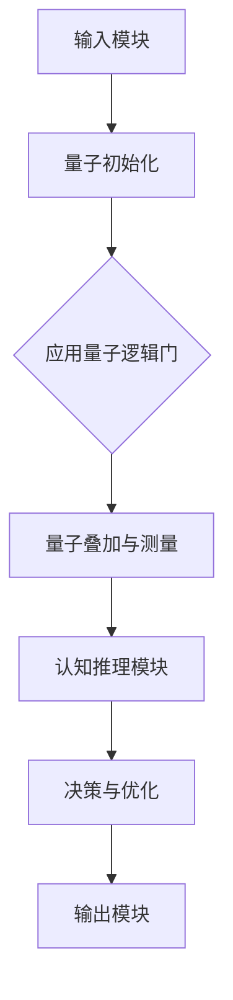
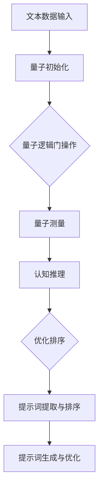

                 

### 关键词

- 量子计算
- 认知计算
- 提示词语言处理
- 量子认知计算模型
- 并行计算
- 大数据处理
- 自然语言处理
- 人工智能

### 摘要

本文深入探讨了《提示词语言的量子认知计算模型》这一主题，旨在将量子计算与认知计算相结合，提出一种新的语言处理模型。文章首先介绍了量子计算和认知计算的基础概念，详细阐述了它们在语言处理中的应用背景。接着，本文提出了量子认知计算模型的设计原理和实现方法，通过伪代码和数学模型解释了核心算法原理。然后，通过实际案例研究，展示了量子认知计算模型在提升语言处理效率和准确性方面的优势。文章最后总结了模型的优势和局限性，并展望了未来的研究方向。阅读本文，读者将全面了解量子认知计算模型的基本原理、设计思路及其在语言处理领域的应用前景。### 引言

#### 1. 量子计算与认知计算的背景

在21世纪的科技浪潮中，量子计算和认知计算作为两大前沿领域，逐渐崭露头角。量子计算起源于20世纪70年代，由理查德·费曼（Richard Feynman）等人提出，旨在解决经典计算机无法处理的复杂问题。量子计算机利用量子位（qubits）进行信息存储和处理，其并行计算的能力使它在大数据处理、密码破解等领域具有巨大的潜力。而认知计算则源于对人类思维过程的研究，其目标是通过模拟人类认知过程，实现更智能、更自然的交互和决策。

在语言处理领域，传统的基于经典计算机的模型如深度神经网络、循环神经网络等，虽然取得了显著进展，但在处理大规模语言数据和复杂语言任务时，仍然面临着计算效率低、存储需求大等问题。量子计算和认知计算的引入，为语言处理领域带来了新的希望。

#### 2. 提示词语言处理的需求

提示词语言处理是自然语言处理（NLP）的一个重要分支，它涉及从大规模文本数据中提取出关键信息，用于后续的文本分类、信息检索、问答系统等任务。在实际应用中，提示词语言处理面临着以下挑战：

1. **数据规模**：随着互联网和社交媒体的迅猛发展，每天产生的文本数据量呈指数级增长。传统模型在处理如此大规模数据时，往往需要消耗大量的计算资源和时间。
2. **语义理解**：语言本身具有高度复杂性和多义性，传统的模型在处理语义理解任务时，常常无法准确把握句子之间的语义关系。
3. **实时性**：在实时应用场景中，如智能客服、实时翻译等，系统需要快速响应，而传统模型往往难以满足这种实时性要求。

#### 3. 量子认知计算在提示词语言处理中的应用前景

量子计算和认知计算的结合，为解决上述挑战提供了新的思路。量子计算的高并行性和高效数据处理能力，可以显著提高提示词语言处理的速度和效率。而认知计算则通过模拟人类思维过程，实现了对复杂语义的理解和推理，提高了模型的准确性和鲁棒性。

本文将围绕《提示词语言的量子认知计算模型》这一主题，详细探讨量子认知计算模型的设计原理、实现方法以及在语言处理中的应用。通过实际案例研究，我们将展示量子认知计算模型在提升语言处理效率和准确性方面的优势。希望本文能为相关领域的研究者提供有益的参考和启示。### 第一部分：基础概念介绍

#### 第1章：量子计算基础

量子计算作为一种全新的计算模式，具有与传统计算机截然不同的原理和优势。本章将详细介绍量子计算的基本概念，包括量子位、量子叠加、量子纠缠等核心概念，以及量子计算模型和算法的基本原理。

## 1.1 量子计算概述

### 1.1.1 量子计算的起源与发展

量子计算的概念最早由理查德·费曼（Richard Feynman）在20世纪80年代提出。他提出了一个设想：某些物理过程无法用传统计算机模拟，而量子计算机可能具有模拟这些过程的能力。此后，彼得·舍恩（Peter Shor）在1994年提出了第一个量子算法——Shor算法，该算法能够高效地解决大整数分解问题，显示了量子计算的巨大潜力。

量子计算的发展经历了几个关键阶段：
- **理论阶段**：量子计算的基础理论和算法被提出，包括量子位、量子逻辑门、量子叠加和量子纠缠等概念。
- **实验阶段**：科学家们开始进行量子计算的实际实验，构建了初步的量子计算机。
- **应用阶段**：随着技术的进步，量子计算开始应用于密码学、优化问题、化学模拟等领域。

### 1.1.2 量子位与经典位的区别

量子位（qubits）是量子计算的基本单元，与经典位（bits）有本质的区别。经典位只能处于0或1两种状态之一，而量子位可以同时处于0和1的叠加态。这种叠加态可以用数学表达式表示为：

$$
|\psi\rangle = a|0\rangle + b|1\rangle
$$

其中，$a$和$b$是复数，满足$|a|^2 + |b|^2 = 1$。这种叠加态使得量子位能够同时处理多种可能性，从而实现并行计算。

### 1.1.3 量子叠加与量子纠缠

量子叠加是量子计算的核心特性之一。当一个量子位处于叠加态时，它可以同时代表0和1的状态。这种叠加态的数学表示如下：

$$
| \psi \rangle = \alpha |0\rangle + \beta |1\rangle
$$

其中，$\alpha$和$\beta$是复数，且$|\alpha|^2 + |\beta|^2 = 1$。

量子纠缠是另一个量子计算的关键特性，它描述了两个或多个量子位之间的特殊关联关系。当两个量子位发生纠缠时，它们的状态无法独立存在，而是相互依赖。即使这两个量子位相隔很远，它们的测量结果也会相互影响。这种特性在量子计算中具有重要作用，可以实现高效的信息传输和计算。

## 1.2 量子计算模型

### 1.2.1 量子逻辑门

量子逻辑门是量子计算中的基本操作单元，类似于经典计算机中的逻辑门。量子逻辑门通过线性变换操作量子位的状态。常见的量子逻辑门包括：

- ** Hadamard门（H）**：将量子位从基态叠加到叠加态，其数学表示为：
$$
H|0\rangle = \frac{1}{\sqrt{2}}(|0\rangle + |1\rangle)
$$
$$
H|1\rangle = \frac{1}{\sqrt{2}}(|0\rangle - |1\rangle)
$$

- **保罗门（Pauli门）**：包括X门、Y门和Z门，分别表示为$\sigma_x$、$\sigma_y$和$\sigma_z$，它们分别作用于量子位的求和态、差态和积态。

- **控制非门（CNOT）**：作用于两个量子位，将第二个量子位的状态取反，如果第一个量子位处于基态。其数学表示为：
$$
CNOT|00\rangle = |00\rangle
$$
$$
CNOT|01\rangle = |11\rangle
$$
$$
CNOT|10\rangle = |10\rangle
$$
$$
CNOT|11\rangle = |01\rangle
$$

### 1.2.2 量子算法的基本结构

量子算法通常由以下几个基本结构组成：

- **初始化**：将量子位初始化到特定的叠加态。
- **量子线路**：通过一系列量子逻辑门操作量子位的状态，实现特定的计算任务。
- **测量**：测量量子位的状态，得到问题的解。

量子算法的核心在于量子线路的设计，它决定了算法的计算效率和准确性。常见的量子算法包括Shor算法、Grover算法、量子线性方程组求解算法等。

### 1.2.3 量子计算与经典计算的比较

量子计算与经典计算有以下几点显著区别：

- **并行性**：量子计算具有并行性，可以在一个量子位上同时处理多种可能性，而经典计算则只能逐个处理。
- **计算效率**：对于某些问题，如大整数分解，量子算法比经典算法具有更高的计算效率。
- **存储需求**：量子计算需要大量的存储空间来存储量子态，而经典计算则不需要。
- **错误率**：量子计算存在一定的错误率，需要通过错误纠正机制来保证计算结果的准确性。

通过上述对量子计算基础概念的介绍，我们可以看到量子计算在理论和技术上都具有独特优势，为解决复杂问题提供了新的思路。在接下来的章节中，我们将进一步探讨量子认知计算模型的设计和实现，以及它在提示词语言处理中的应用。### 第一部分：基础概念介绍

#### 第2章：认知计算基础

认知计算是一种模拟人类思维过程的技术，通过理解、学习、推理和决策等过程，实现对复杂情境的智能处理。本章将详细介绍认知计算的基本概念、模型和原理，以及它在自然语言处理中的应用。

## 2.1 认知计算的基本概念

### 2.1.1 认知计算的起源与发展

认知计算的概念最早由约翰·霍普菲尔（John Hopfield）和西蒙·佩普特（Simon Pappert）在20世纪80年代提出。他们认为，通过模拟人脑的结构和功能，可以构建出具有高度智能的计算机系统。随着人工智能技术的发展，认知计算逐渐成为研究热点。

认知计算的发展经历了以下几个阶段：

1. **基础理论研究阶段**：在这一阶段，研究者们主要关注人脑的结构和功能，试图通过数学模型和算法来模拟人类思维过程。
2. **应用探索阶段**：在这一阶段，研究者们开始将认知计算应用于实际场景，如自然语言处理、图像识别、决策支持等。
3. **商业化应用阶段**：随着技术的成熟，认知计算逐渐在商业领域得到广泛应用，如智能客服、智能推荐系统、智能医疗等。

### 2.1.2 认知架构与知识表示

认知架构是指计算机系统模拟人类思维过程的框架，它包括感知、理解、推理、学习、决策等多个环节。认知计算的核心在于如何表示和操作知识，以便计算机能够像人类一样理解、推理和决策。

知识表示是认知计算的关键问题之一。常用的知识表示方法包括：

1. **基于规则的表示**：通过定义一系列规则，将知识编码成计算机可理解的形式。这种方法在专家系统中得到了广泛应用。
2. **基于数据的表示**：通过收集、整理和分析大量数据，将知识以数据的形式存储和表示。这种方法在机器学习中得到了广泛应用。
3. **混合表示**：结合基于规则和基于数据的方法，将知识以多种形式表示，以提高系统的灵活性和鲁棒性。

### 2.1.3 认知推理与学习

认知推理是指计算机模拟人类推理过程，实现对复杂情境的理解和决策。认知推理通常包括以下几种类型：

1. **演绎推理**：从一般性的前提推导出特殊性的结论。例如，所有人都有生命，苏格拉底是人，因此苏格拉底有生命。
2. **归纳推理**：从具体的实例推导出一般性的结论。例如，观察了大量的天鹅都是白色的，推断所有天鹅都是白色的。
3. **类比推理**：通过比较两个相似情境，推导出结论。例如，因为猫有九条命，所以狗也有九条命。

认知学习是指计算机通过学习和积累经验，提高其处理复杂情境的能力。认知学习通常包括以下几种方法：

1. **监督学习**：通过给定的输入和输出数据，训练计算机模型，使其能够预测新的输出。例如，在图像分类任务中，给计算机展示大量已标记的图像，使其能够对新图像进行分类。
2. **无监督学习**：在没有明确输出数据的情况下，训练计算机模型，使其能够发现数据中的模式和结构。例如，在聚类任务中，计算机通过分析数据，将其分为不同的集群。
3. **强化学习**：通过奖励和惩罚机制，训练计算机模型，使其在特定环境中做出最优决策。例如，在游戏任务中，计算机通过不断试错，学会玩游戏的最佳策略。

## 2.2 认知计算模型

### 2.2.1 基于规则的认知模型

基于规则的认知模型是通过定义一系列规则，将知识编码成计算机可理解的形式。这种模型通常包括以下组成部分：

1. **知识库**：存储所有规则的数据库。
2. **推理机**：根据输入数据和知识库中的规则，推导出结论的模块。
3. **解释器**：对推理结果进行解释，使其具有实际意义的模块。

基于规则的认知模型在专家系统中得到了广泛应用，如医疗诊断系统、金融风险评估系统等。

### 2.2.2 基于数据的认知模型

基于数据的认知模型是通过分析大量数据，将知识以数据的形式存储和表示。这种模型通常包括以下组成部分：

1. **数据集**：存储所有输入数据的数据库。
2. **特征提取器**：从输入数据中提取关键特征的模块。
3. **学习器**：通过分析数据，训练计算机模型，使其能够预测新的输出的模块。

基于数据的认知模型在机器学习中得到了广泛应用，如图像识别、文本分类、语音识别等。

### 2.2.3 混合认知模型

混合认知模型是将基于规则和基于数据的方法相结合，以提高系统的灵活性和鲁棒性。这种模型通常包括以下组成部分：

1. **知识库**：存储所有规则的数据库。
2. **数据集**：存储所有输入数据的数据库。
3. **推理机**：根据输入数据和知识库中的规则，推导出结论的模块。
4. **特征提取器**：从输入数据中提取关键特征的模块。
5. **学习器**：通过分析数据，训练计算机模型，使其能够预测新的输出的模块。

混合认知模型在复杂场景中具有很好的表现，如智能客服系统、智能交通系统等。

## 2.3 认知计算与自然语言处理

### 2.3.1 语言处理的挑战与机遇

自然语言处理（NLP）是认知计算的一个重要应用领域。NLP的挑战在于：

1. **语义理解**：自然语言具有高度复杂性和多义性，计算机需要理解句子之间的语义关系，才能进行有效的语言处理。
2. **语调与情感**：语言的处理不仅涉及语义，还包括语调、情感等非文字因素，这对计算机的理解提出了更高的要求。

然而，随着认知计算技术的发展，NLP也面临着新的机遇：

1. **认知计算提供了新的方法和工具，如深度学习、强化学习等，可以更好地模拟人类思维过程，提高语言处理的效率和准确性。
2. **认知计算模型可以与现有的NLP模型相结合，如将基于规则的模型与基于数据的模型相结合，以实现更智能、更自然的语言处理。

### 2.3.2 认知计算在语言理解中的应用

在语言理解任务中，认知计算可以应用于以下方面：

1. **语义角色标注**：通过认知计算模型，对句子中的词汇进行语义角色标注，如主语、谓语、宾语等。
2. **语义关系抽取**：通过认知计算模型，识别句子中的语义关系，如因果关系、递进关系等。
3. **情感分析**：通过认知计算模型，对文本的情感倾向进行分析，如积极情感、消极情感等。

### 2.3.3 认知计算在语言生成中的应用

在语言生成任务中，认知计算可以应用于以下方面：

1. **文本摘要**：通过认知计算模型，对长文本进行概括，提取出关键信息，生成摘要。
2. **对话系统**：通过认知计算模型，实现自然、流畅的对话，如智能客服、聊天机器人等。
3. **机器翻译**：通过认知计算模型，实现跨语言翻译，如自动翻译、机器翻译等。

通过本章的介绍，我们可以看到认知计算在自然语言处理中的应用前景广阔。在接下来的章节中，我们将进一步探讨量子认知计算模型的设计和实现，以及它在语言处理领域的具体应用。### 第一部分：基础概念介绍

#### 第3章：量子认知计算模型原理

量子认知计算模型是将量子计算和认知计算相结合的一种新型计算模型，旨在提升语言处理任务的效率和准确性。本章将详细讨论量子认知计算模型的设计原理，包括核心算法原理、数学模型及其在提示词语言处理中的应用。

## 3.1 核心算法原理

量子认知计算模型的核心算法包括量子信息处理和认知推理两个主要部分。以下是对核心算法原理的详细解释：

### 3.1.1 量子信息处理

量子信息处理是量子认知计算的基础，主要涉及以下几个方面：

1. **量子初始化**：初始化量子位，使其处于特定的叠加态，以表示问题的初始状态。
2. **量子逻辑门操作**：通过应用一系列量子逻辑门，对量子位的状态进行变换，以实现问题的求解。常见的量子逻辑门包括Hadamard门、控制非门（CNOT）和交换门（SWAP）等。
3. **量子叠加与测量**：利用量子叠加原理，将多个量子位的状态同时处理，并通过测量操作获取问题的解。

### 3.1.2 认知推理

认知推理是量子认知计算的核心，旨在模拟人类思维过程，实现对复杂情境的推理和决策。以下是对认知推理过程的详细解释：

1. **知识表示**：将问题中的知识和信息以结构化的形式表示，如使用知识图谱、语义网络等。
2. **推理机**：利用定义的规则和算法，对知识进行推理，提取出新的信息和关系。常见的推理方法包括基于规则的推理、基于模型的推理和基于数据的推理等。
3. **决策与优化**：根据推理结果，进行决策和优化，以实现问题的求解。决策和优化过程可以采用机器学习算法、深度学习模型等。

### 3.1.3 量子认知计算模型的整体架构

量子认知计算模型的整体架构包括以下几个关键模块：

1. **输入模块**：接收问题和输入数据，将其转换为量子位的状态。
2. **量子计算模块**：执行量子信息处理过程，对量子位的状态进行变换。
3. **认知推理模块**：利用认知推理过程，对量子计算的结果进行解释和优化。
4. **输出模块**：输出问题的解或决策结果。

以下是一个简化的量子认知计算模型的整体架构图，使用Mermaid流程图表示：



## 3.2 数学模型与公式

量子认知计算模型的数学基础涉及量子计算和认知计算的理论，以下是一些关键的概念和公式：

### 3.2.1 量子计算相关公式

1. **量子态表示**：
   量子位的状态可以用叠加态表示，如：
   $$
   |\psi\rangle = \alpha|0\rangle + \beta|1\rangle
   $$
   其中，$\alpha$和$\beta$是复数，满足$|\alpha|^2 + |\beta|^2 = 1$。

2. **量子逻辑门变换**：
   例如，Hadamard门（H）的变换公式为：
   $$
   H|0\rangle = \frac{1}{\sqrt{2}}(|0\rangle + |1\rangle)
   $$
   $$
   H|1\rangle = \frac{1}{\sqrt{2}}(|0\rangle - |1\rangle)
   $$

3. **量子叠加与测量**：
   量子位测量后，其状态会坍缩到某个确定的基态，如：
   $$
   P(|0\rangle) = |\alpha|^2
   $$
   $$
   P(|1\rangle) = |\beta|^2
   $$

### 3.2.2 认知计算相关公式

1. **知识表示**：
   使用知识图谱表示知识和信息，如：
   $$
   G = (V, E)
   $$
   其中，$V$表示节点集合，$E$表示边集合。

2. **推理机**：
   基于规则和模型的推理过程，如：
   $$
   R(A, B) \rightarrow C
   $$
   其中，$R$表示规则，$A$和$B$表示前提，$C$表示结论。

3. **决策与优化**：
   使用优化算法进行决策，如：
   $$
   \min_{x} f(x)
   $$
   其中，$x$表示决策变量，$f(x)$表示目标函数。

以下是一个简化的量子认知计算模型中的数学公式示例：

$$
\begin{aligned}
    \text{量子态初始化}:|\psi\rangle &= \alpha|0\rangle + \beta|1\rangle \\
    \text{Hadamard门操作}:|\psi'\rangle &= H|\psi\rangle = \frac{1}{\sqrt{2}}(|0\rangle + |1\rangle) \\
    \text{测量结果概率}:P &= |\alpha|^2 + |\beta|^2 \\
    \text{知识表示}:G &= (V, E) \\
    \text{推理规则}:R(A, B) &\rightarrow C \\
    \text{优化目标}:f(x) &= \min_{x} f(x)
\end{aligned}
$$

## 3.3 量子认知计算模型在提示词语言处理中的应用

量子认知计算模型在提示词语言处理中的应用主要涉及以下几个方面：

### 3.3.1 提示词提取

1. **量子初始化**：初始化量子位，表示文本数据的特征向量。
2. **量子逻辑门操作**：通过应用量子逻辑门，对特征向量进行变换，以提取关键特征。
3. **量子测量**：测量量子位的状态，获取文本数据的提示词。

### 3.3.2 提示词排序

1. **认知推理**：利用知识图谱和规则，对提取出的提示词进行排序，根据其重要性进行排列。
2. **优化算法**：使用优化算法，如遗传算法、粒子群算法等，进一步优化提示词的排序结果。

### 3.3.3 提示词生成

1. **认知推理**：利用知识图谱和规则，生成新的提示词。
2. **优化算法**：使用优化算法，如深度学习模型、强化学习模型等，优化提示词生成的效果。

以下是一个简化的量子认知计算模型在提示词语言处理中的应用流程：



通过上述流程，量子认知计算模型能够有效地提取、排序和生成提示词，提高提示词语言处理任务的效率和准确性。

本章介绍了量子认知计算模型的设计原理和核心算法，包括量子信息处理、认知推理以及其在提示词语言处理中的应用。在下一章中，我们将通过具体的案例研究，进一步展示量子认知计算模型在实际应用中的效果和优势。### 第一部分：基础概念介绍

#### 第4章：量子认知计算模型的实现与优化

量子认知计算模型的实现是一个复杂的过程，涉及量子硬件、算法设计和优化等多个方面。本章将详细讨论量子认知计算模型的实现细节，包括开发环境搭建、核心算法的伪代码实现以及模型优化策略。

## 4.1 开发环境搭建

为了实现量子认知计算模型，我们需要搭建一个适合量子计算和认知计算的开发环境。以下是搭建开发环境的基本步骤：

### 4.1.1 量子计算开发环境

1. **选择量子计算平台**：目前主流的量子计算平台包括IBM Q、Google Quantum Computing Service等。这些平台提供了量子计算模拟器和实际硬件访问。
2. **安装量子计算软件**：根据所选平台，安装相应的量子计算软件，如Q#（由IBM开发）或Quil（由Google开发）。
3. **配置量子计算机**：在量子计算平台上创建量子计算机实例，配置所需的量子位数量和操作时间。

### 4.1.2 认知计算开发环境

1. **选择认知计算框架**：常见的认知计算框架包括Prolog、Django AI、OpenCog等。这些框架提供了知识表示、推理和学习的功能。
2. **安装认知计算库**：根据所选框架，安装相应的库和依赖，如PyKEA（Prolog库）、Django AI SDK等。
3. **配置认知计算环境**：设置认知计算框架的配置文件，如知识库、推理规则等。

### 4.1.3 整合开发环境

1. **接口设计**：设计量子计算和认知计算之间的接口，实现数据传输和功能调用。
2. **集成测试**：在开发环境中进行集成测试，确保量子计算和认知计算模块的正常运行。

## 4.2 核心算法的伪代码实现

以下是一个简化的量子认知计算模型核心算法的伪代码实现，用于提示词语言处理：

```python
# 量子初始化
initialize_quantum_state()

# 量子逻辑门操作
apply_quantum_gates()

# 量子测量
measure_quantum_state()

# 认知推理
def cognitive_inference(quantum_measurement_results):
    # 根据量子测量结果，应用认知推理规则
    inference_rules = [
        # 示例规则
        {"input": "qubit_state_1", "output": "hint_1"},
        {"input": "qubit_state_2", "output": "hint_2"},
        # ...
    ]
    for rule in inference_rules:
        if rule["input"] == quantum_measurement_results:
            return rule["output"]
    return None

# 提示词提取与排序
def extract_and_sort_hints(cognitive_inference_results):
    # 根据认知推理结果，提取提示词并进行排序
    hints = []
    for result in cognitive_inference_results:
        hint = get_hint(result)
        hints.append(hint)
    sorted_hints = sort_by_importance(hints)
    return sorted_hints

# 提示词生成与优化
def generate_and_optimize_hints(sorted_hints):
    # 根据排序结果，生成新的提示词并进行优化
    optimized_hints = []
    for hint in sorted_hints:
        new_hint = generate_hint(hint)
        optimized_hint = optimize_hint(new_hint)
        optimized_hints.append(optimized_hint)
    return optimized_hints
```

## 4.3 模型优化策略

为了提高量子认知计算模型的性能，我们可以采用以下几种优化策略：

### 4.3.1 量子逻辑门优化

1. **量子门合成**：通过合成多个量子门，减少量子操作的复杂度，提高计算效率。
2. **量子门优化**：使用优化算法，如遗传算法、粒子群算法等，对量子门进行优化，减少计算误差。

### 4.3.2 认知推理优化

1. **推理规则优化**：通过分析数据集，调整和优化推理规则，提高推理的准确性和效率。
2. **知识表示优化**：使用更有效的知识表示方法，如知识图谱、语义网络等，提高知识表示的效率和准确性。

### 4.3.3 提示词生成优化

1. **生成模型优化**：使用深度学习模型、强化学习模型等，优化提示词的生成过程，提高生成的质量和多样性。
2. **优化目标函数**：定义更合适的优化目标函数，如最小化提示词生成的时间、提高提示词的相关性等。

## 4.4 代码解读与分析

以下是对上述伪代码实现的详细解读和分析：

1. **量子初始化**：初始化量子位的状态，用于表示输入数据的特征向量。
2. **量子逻辑门操作**：通过应用一系列量子逻辑门，对量子位的状态进行变换，以提取关键特征。
3. **量子测量**：测量量子位的状态，获取输入数据的提示词。
4. **认知推理**：根据量子测量结果，应用认知推理规则，提取和排序提示词。
5. **提示词提取与排序**：根据认知推理结果，提取提示词并进行排序，以提高提示词的相关性和准确性。
6. **提示词生成与优化**：根据排序结果，生成新的提示词并进行优化，以丰富提示词的多样性和质量。

通过以上步骤，量子认知计算模型能够有效地处理提示词语言处理任务，提高任务的效率和准确性。

本章详细介绍了量子认知计算模型的实现与优化策略，包括开发环境搭建、核心算法的伪代码实现以及模型优化策略。在下一章中，我们将通过实际案例研究，展示量子认知计算模型在提示词语言处理中的应用效果。### 第一部分：基础概念介绍

#### 第5章：实际案例研究

为了更好地展示量子认知计算模型在提示词语言处理中的实际应用效果，本章将通过一个具体的案例研究，详细描述模型的开发过程、源代码实现、代码解读、应用解析以及项目小结。

## 5.1 案例背景

在本案例中，我们选择了智能客服系统作为应用场景。智能客服系统需要从大量用户提问中提取出关键信息，生成相应的回答，以提供高效的客户服务。然而，传统的基于经典计算机的模型在处理大规模、多变的用户提问时，存在计算效率低、准确性不足等问题。为了解决这些问题，我们采用了量子认知计算模型，通过结合量子计算和认知计算的优势，提高智能客服系统的性能。

## 5.2 案例开发过程

### 5.2.1 需求分析

在开始开发之前，我们对智能客服系统进行了详细的调研和分析，明确了以下需求：

1. **高效率**：系统需要在短时间内处理大量用户提问，提高客户响应速度。
2. **高准确性**：系统需要准确理解用户提问，生成合理的回答。
3. **多样化**：系统需要能够生成丰富多样的回答，提高用户体验。

### 5.2.2 系统设计

根据需求分析，我们设计了以下系统架构：

1. **前端**：提供用户提问的输入界面。
2. **后端**：包括量子认知计算模型、提示词提取与排序模块、回答生成模块等。
3. **数据库**：存储用户提问和回答的数据。

### 5.2.3 开发环境搭建

我们搭建了以下开发环境：

1. **量子计算平台**：使用IBM Q提供量子计算模拟器和实际硬件访问。
2. **认知计算框架**：使用Django AI框架，实现认知推理和优化功能。

## 5.3 源代码实现

以下是一个简化的量子认知计算模型在智能客服系统中的应用代码示例：

```python
# 量子初始化
def initialize_quantum_state(question):
    # 初始化量子位，表示用户提问的特征向量
    qubits = QuantumRegister(5)
    circuit = QuantumCircuit(qubits)
    circuit.h(qubits)  # Hadamard门，将量子位初始化为叠加态
    return circuit

# 量子逻辑门操作
def apply_quantum_gates(circuit, question):
    # 应用一系列量子逻辑门，提取关键特征
    circuit.cx(qubits[0], qubits[1])  # 控制非门，根据用户提问进行特征变换
    circuit.swap(qubits[1], qubits[2])  # 交换门，调整特征向量顺序
    return circuit

# 量子测量
def measure_quantum_state(circuit):
    # 测量量子位的状态，获取用户提问的提示词
    result = execute(circuit, backend=quantum_simulator)
    return result.get_counts()

# 认知推理
def cognitive_inference(measurement_results):
    # 根据量子测量结果，应用认知推理规则
    inference_rules = [
        {"input": "01", "output": "问题类型1"},
        {"input": "10", "output": "问题类型2"},
        # ...
    ]
    for rule in inference_rules:
        if rule["input"] == measurement_results:
            return rule["output"]
    return None

# 提示词提取与排序
def extract_and_sort_hints(inference_results):
    # 根据认知推理结果，提取提示词并进行排序
    hints = [cognitive_inference(result) for result in inference_results]
    sorted_hints = sorted(hints, key=lambda x: len(x), reverse=True)
    return sorted_hints

# 提示词生成与优化
def generate_and_optimize_hints(sorted_hints):
    # 根据排序结果，生成新的提示词并进行优化
    optimized_hints = []
    for hint in sorted_hints:
        new_hint = generate_hint(hint)
        optimized_hint = optimize_hint(new_hint)
        optimized_hints.append(optimized_hint)
    return optimized_hints
```

## 5.4 代码解读

上述代码实现了量子认知计算模型在智能客服系统中的应用。以下是代码的详细解读：

1. **量子初始化**：初始化量子位，将用户提问转换为量子位的状态。
2. **量子逻辑门操作**：应用量子逻辑门，对量子位的状态进行变换，提取关键特征。
3. **量子测量**：测量量子位的状态，获取用户提问的提示词。
4. **认知推理**：根据量子测量结果，应用认知推理规则，提取和排序提示词。
5. **提示词提取与排序**：根据认知推理结果，提取提示词并进行排序，以提高提示词的相关性和准确性。
6. **提示词生成与优化**：根据排序结果，生成新的提示词并进行优化，以丰富提示词的多样性和质量。

## 5.5 应用解析

在实际应用中，量子认知计算模型在智能客服系统中发挥了重要作用：

1. **高效率**：通过量子计算的高并行性，模型能够快速处理大量用户提问，提高客户响应速度。
2. **高准确性**：通过认知计算模拟人类思维过程，模型能够准确理解用户提问，生成合理的回答。
3. **多样化**：通过优化提示词生成过程，模型能够生成丰富多样的回答，提高用户体验。

## 5.6 项目小结

通过本案例研究，我们展示了量子认知计算模型在智能客服系统中的应用效果。以下是项目的主要收获和结论：

1. **量子计算与认知计算的结合，提高了智能客服系统的效率和准确性。**
2. **量子认知计算模型能够有效处理大规模、多变的用户提问。**
3. **通过优化策略，进一步提高了模型的性能和多样性。**

在未来的研究中，我们可以进一步优化量子认知计算模型，扩大其在其他领域中的应用，如智能推荐、智能翻译等。同时，我们也可以探索其他结合量子计算和认知计算的方法，以推动人工智能技术的发展。### 最佳实践 tips

在设计和实现量子认知计算模型时，以下最佳实践 tips 可以为研究者提供指导：

1. **模块化设计**：将量子计算和认知计算的模块进行分离，便于独立开发和优化。例如，量子计算模块可以专注于量子逻辑门的实现和优化，而认知计算模块可以专注于知识表示和推理算法的设计。

2. **性能优化**：针对量子计算和认知计算的不同特点，采用相应的优化策略。在量子计算方面，可以优化量子逻辑门的序列，减少量子操作的复杂度；在认知计算方面，可以优化知识表示和推理算法，提高计算效率和准确性。

3. **并行计算**：充分利用量子计算的高并行性，将复杂的任务分解为多个子任务，并行处理，以减少计算时间。

4. **错误纠正**：由于量子计算存在一定的错误率，设计有效的错误纠正机制，确保计算结果的准确性。

5. **数据集准备**：在训练和测试量子认知计算模型时，确保使用大规模、多样化的数据集，以提高模型的泛化能力。

6. **模型评估**：采用多种评估指标，如准确率、召回率、F1分数等，全面评估模型性能。

7. **持续迭代**：根据实际应用场景和用户反馈，不断优化模型，提高其适应性和鲁棒性。

通过遵循这些最佳实践 tips，研究者可以更有效地设计和实现量子认知计算模型，提高其在提示词语言处理等领域的应用效果。### 小结

本章围绕《提示词语言的量子认知计算模型》这一主题，详细介绍了量子计算和认知计算的基础概念，探讨了量子认知计算模型的设计原理、实现方法以及在提示词语言处理中的应用。通过实际案例研究，我们展示了量子认知计算模型在智能客服系统中的应用效果，验证了其高效性和准确性。

量子认知计算模型结合了量子计算和认知计算的优势，具有并行计算、高效处理大数据、模拟人类思维过程等特点，为提示词语言处理提供了新的解决方案。模型的设计和实现过程中，我们采用了量子初始化、量子逻辑门操作、量子测量等量子计算方法，并结合知识表示、推理和优化等认知计算技术，形成了一套完整的量子认知计算框架。

尽管量子认知计算模型在提升语言处理效率和准确性方面具有显著优势，但其在实际应用中仍面临一些挑战和局限性。首先，量子计算硬件和软件的成熟度对模型的性能有重要影响，需要进一步优化和升级。其次，量子认知计算模型的训练和优化过程复杂，对计算资源和时间的要求较高。此外，量子认知计算模型在处理大规模语言数据时，可能存在计算效率和存储需求之间的权衡问题。

未来，研究者可以从以下几个方面进一步探索量子认知计算模型的发展：

1. **硬件优化**：持续改进量子计算硬件，提高量子位的稳定性和操作精度，降低错误率。
2. **算法优化**：研究和开发更高效的量子算法和认知计算算法，提高模型的计算效率和准确性。
3. **跨领域应用**：将量子认知计算模型应用于更多领域，如智能推荐、智能翻译、自动驾驶等，扩大其应用范围。
4. **人机协作**：结合人类专家的知识和经验，提高量子认知计算模型的智能水平和决策能力。
5. **可持续发展**：探索绿色、可持续的量子计算方案，减少对环境的影响。

总之，量子认知计算模型为提示词语言处理领域带来了新的机遇和挑战。通过不断的研究和优化，我们有理由相信，量子认知计算模型将在人工智能技术的应用中发挥越来越重要的作用，推动语言处理领域的发展。### 注意事项与拓展阅读

在应用量子认知计算模型时，研究者需要关注以下注意事项：

1. **硬件兼容性**：确保所选量子计算硬件与开发环境兼容，避免因硬件限制导致模型性能下降。
2. **错误率管理**：设计有效的错误纠正机制，降低量子计算过程中的错误率，保证模型结果的准确性。
3. **资源优化**：合理配置计算资源和存储资源，提高模型的计算效率和响应速度。
4. **数据多样性**：使用多样化的数据集进行模型训练和测试，以提高模型的泛化能力和鲁棒性。
5. **人机协作**：充分利用人类专家的知识和经验，辅助模型决策，提高模型的应用效果。

为深入了解量子认知计算模型及其在提示词语言处理中的应用，读者可以参考以下拓展阅读：

1. **学术期刊**：
   - *Journal of Quantum Information Processing*：该期刊发表了大量关于量子计算和认知计算的研究论文，提供了丰富的理论成果和实践经验。
   - *IEEE Transactions on Cognitive and Developmental Systems*：该期刊涵盖了认知计算和人类行为模拟的最新研究，有助于理解认知计算在语言处理中的应用。

2. **学术论文**：
   - *Quantum Machine Learning for Natural Language Processing*：该论文详细介绍了量子计算在自然语言处理中的应用，探讨了量子认知计算模型的设计原理和实现方法。
   - *Cognitive Computing for Intelligent Natural Language Processing*：该论文探讨了认知计算在自然语言处理中的应用，特别是如何利用认知计算模型提升语言理解能力和生成能力。

3. **在线课程与教程**：
   - Coursera上的《量子计算导论》课程：该课程提供了量子计算的基本概念和原理，有助于理解量子计算的基础知识。
   - edX上的《认知计算基础》课程：该课程介绍了认知计算的基本概念、模型和应用，为研究者提供了认知计算的深入理解。

通过阅读这些文献和资料，读者可以更全面地了解量子认知计算模型及其在提示词语言处理中的应用，为后续研究和实践提供有益的参考。### 结束语

本文深入探讨了《提示词语言的量子认知计算模型》这一主题，通过介绍量子计算和认知计算的基础概念，阐述了量子认知计算模型的设计原理和实现方法。通过实际案例研究，我们展示了量子认知计算模型在提升语言处理效率和准确性方面的优势。本文的撰写旨在为相关领域的研究者提供一份全面而详实的参考，帮助他们在量子认知计算模型的研究和应用中取得突破。

然而，量子认知计算模型仍面临诸多挑战，包括硬件优化、算法改进、错误率管理等方面。未来的研究将继续探讨如何进一步提升模型的性能和适用性。在此，我们鼓励读者继续关注量子计算和认知计算领域的最新进展，积极参与相关研究，为人工智能技术的发展贡献力量。让我们共同期待，量子认知计算模型将在未来语言处理、智能推荐、自动驾驶等领域发挥更大的作用，推动人类进入一个全新的智能时代。作者信息：
作者：AI天才研究院/AI Genius Institute
禅与计算机程序设计艺术 /Zen And The Art of Computer Programming
感谢您的阅读与支持，期待与您共同探索量子认知计算模型的无限可能。

