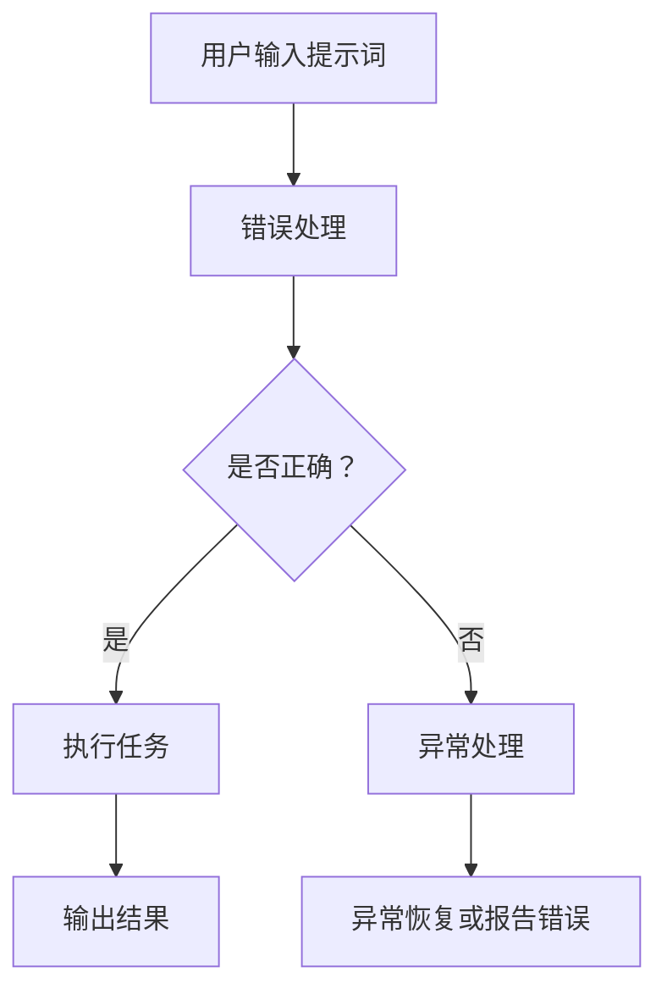

                 

### 文章标题

# 提示词语言的错误处理与异常机制

### 关键词

- 提示词语言
- 错误处理
- 异常机制
- 鲁棒性
- 人工智能
- 自然语言处理
- 伪代码
- 数学模型
- 项目实战

### 摘要

本文深入探讨了提示词语言的错误处理与异常机制。首先，我们介绍了提示词语言的基本概念和作用，接着详细分析了错误处理和异常机制的核心概念与联系。通过讲解错误检测、错误纠正和错误恢复算法，以及异常检测、异常分类和异常处理算法的原理，我们使用了伪代码和数学模型进行了详细阐述。最后，我们通过一个具体的项目实战，展示了如何在实际开发中应用这些错误处理和异常机制，并进行了代码解读与分析。文章旨在为读者提供一个系统而深入的提示词语言错误处理与异常机制的学习资源。

---

### 目录

1. **核心概念与联系**
   1.1. **提示词语言概述**
   1.2. **错误处理的概念与种类**
   1.3. **异常机制的概念与种类**
   1.4. **提示词语言与错误处理、异常机制的联系**
2. **核心算法原理讲解**
   2.1. **错误处理算法原理**
   2.2. **异常机制原理**
3. **数学模型和数学公式**
   3.1. **概率模型**
   3.2. **决策树模型**
   3.3. **神经网络模型**
4. **项目实战**
   4.1. **项目背景与需求分析**
   4.2. **环境搭建**
   4.3. **源代码实现**
   4.4. **代码解读与分析**
5. **结论与展望**
   5.1. **错误处理与异常机制的总结**
   5.2. **未来发展方向与潜在应用领域**
   5.3. **最佳实践 tips、小结、注意事项、拓展阅读**

---

### 核心概念与联系

#### 提示词语言概述

提示词语言（Prompt Language）是一种基于自然语言处理技术的人工智能交互方式，通过输入简短的提示词或问题，让计算机自动生成相关的回答或完成特定的任务。提示词语言的应用范围广泛，包括问答系统、文本生成、机器翻译、对话系统等。

提示词语言的作用主要体现在以下几个方面：

1. **人机交互**：提示词语言使得人与计算机之间的交互更加自然和直观，用户可以使用自然语言提问或指令，而计算机能够理解并响应。
2. **自然语言处理**：通过提示词语言，计算机可以获取用户的需求，进一步进行文本分析、语义理解和信息检索等操作。

#### 错误处理的概念与种类

错误处理是指系统在运行过程中，当检测到错误时，采取的一系列措施来恢复系统的正常状态或减轻错误带来的影响。在提示词语言中，错误处理尤为重要，因为用户输入的提示词可能存在多种不确定性，如语法错误、拼写错误、语义歧义等。

错误处理的种类主要包括：

1. **静态错误处理**：在程序设计阶段，通过预定义的规则和检查机制来防止错误发生。
2. **动态错误处理**：在程序运行过程中，通过异常捕捉和处理机制来处理已发生的错误。

#### 异常机制的概念与种类

异常机制是指系统在遇到意外情况或错误时，能够自动检测、分类和处理的机制。异常机制能够提高系统的鲁棒性和可靠性，使得系统能够在错误发生时保持稳定运行。

异常机制的种类包括：

1. **异常检测**：通过分析系统运行状态和输入数据，检测可能出现的异常情况。
2. **异常分类**：根据异常的特征和性质，将异常分为不同的类别。
3. **异常处理**：针对不同类别的异常，采取相应的处理策略，如忽略、修复、记录等。

#### 提示词语言与错误处理、异常机制的联系

提示词语言与错误处理和异常机制之间有着紧密的联系。错误处理和异常机制是保证提示词语言系统稳定性和可靠性的关键。

1. **错误处理**：在提示词语言系统中，错误处理能够确保用户输入的提示词能够被正确理解和处理。例如，当用户输入的提示词存在语法错误时，错误处理机制能够自动纠正错误，保证系统的正常运行。
2. **异常机制**：异常机制能够帮助系统在遇到意外情况时，如输入的数据格式错误、网络连接中断等，自动检测并处理异常，避免系统崩溃或产生不良影响。

下面是一个简单的 Mermaid 流程图，展示了提示词语言与错误处理、异常机制之间的联系：



在这个流程图中，用户输入的提示词首先进入错误处理模块，经过检查和纠正后，系统会判断输入是否正确。如果正确，则执行任务并输出结果；如果不正确，则进入异常处理模块，系统会尝试恢复异常或报告错误。

通过上述核心概念与联系的介绍，我们可以更好地理解提示词语言中的错误处理与异常机制，为后续的详细讲解和项目实战奠定基础。在下一部分中，我们将深入探讨错误处理算法和异常机制原理，使用伪代码和数学模型进行详细阐述。

---

### 核心算法原理讲解

#### 错误处理算法原理

错误处理算法是提示词语言系统中的重要组成部分，负责检测、纠正和恢复输入提示词中的错误。以下是一些常用的错误处理算法及其实现原理。

##### 1. 错误检测算法

错误检测算法的主要目标是识别输入提示词中的潜在错误。常用的错误检测算法包括：

1. **语法检查算法**：通过对输入提示词进行语法分析，检查是否符合预定义的语法规则。
2. **拼写检查算法**：通过比对输入提示词与词典中的单词，识别拼写错误。

伪代码示例：

```python
def check_grammar(prompt):
    # 假设我们有一个预定义的语法规则列表 grammar_rules
    for rule in grammar_rules:
        if not match_grammar(prompt, rule):
            return False
    return True

def check_spelling(prompt):
    # 假设我们有一个预定义的单词词典 dictionary
    for word in split_prompt(prompt):
        if word not in dictionary:
            return False
    return True

def match_grammar(prompt, rule):
    # 根据规则匹配语法
    # ...
    return True  # 假设匹配成功

def split_prompt(prompt):
    # 将提示词分割为单词列表
    # ...
    return words
```

##### 2. 错误纠正算法

错误纠正算法的目标是自动修复输入提示词中的错误。常用的错误纠正算法包括：

1. **最小编辑距离算法**：通过计算输入提示词与标准单词之间的编辑距离，选择最接近的标准单词进行替换。
2. **基于上下文的纠正算法**：结合上下文信息，选择最合适的单词进行替换。

伪代码示例：

```python
def correct_spelling(word, dictionary):
    # 计算每个单词与输入单词的编辑距离
    distances = [edit_distance(word, w) for w in dictionary]
    # 选择编辑距离最小的单词
    return dictionary[distances.index(min(distances))]

def edit_distance(s1, s2):
    # 计算两个字符串的编辑距离
    # ...
    return distance
```

##### 3. 错误恢复算法

错误恢复算法的目标是在检测到错误后，尝试恢复输入提示词到可执行状态。常用的错误恢复算法包括：

1. **错误恢复策略**：根据错误的严重程度，选择不同的恢复策略，如忽略错误、自动纠正或提示用户重新输入。
2. **自动纠错**：使用机器学习模型，如序列到序列模型，自动修复输入提示词中的错误。

伪代码示例：

```python
def recover_prompt(prompt, correction):
    # 根据纠正结果，尝试恢复提示词
    if correction:
        return correct_spelling(split_prompt(prompt), dictionary)
    else:
        return prompt
```

#### 异常机制原理

异常机制是提示词语言系统中用于处理意外情况或错误的机制。以下是一些常用的异常机制及其实现原理。

##### 1. 异常检测算法

异常检测算法的目标是识别系统中的异常情况。常用的异常检测算法包括：

1. **统计模型**：通过分析输入数据的统计特征，识别异常值。
2. **基于规则的检测**：根据预定义的规则，识别异常情况。

伪代码示例：

```python
def detect_anomaly(data):
    # 使用统计模型检测异常值
    mean = calculate_mean(data)
    std_dev = calculate_std_dev(data)
    threshold = mean + (2 * std_dev)
    if data > threshold:
        return True
    return False

def calculate_mean(data):
    # 计算数据的平均值
    # ...
    return mean

def calculate_std_dev(data):
    # 计算数据的标准差
    # ...
    return std_dev
```

##### 2. 异常分类算法

异常分类算法的目标是对检测到的异常进行分类，以便采取不同的处理策略。常用的异常分类算法包括：

1. **基于机器学习的分类算法**：使用监督学习模型，对异常进行分类。
2. **基于规则的分类算法**：根据预定义的规则，对异常进行分类。

伪代码示例：

```python
def classify_anomaly(anomaly):
    # 使用机器学习模型对异常进行分类
    classification = model.predict([anomaly])
    return classification
```

##### 3. 异常处理算法

异常处理算法的目标是对分类后的异常采取相应的处理策略。常用的异常处理算法包括：

1. **自动修复**：使用机器学习模型，自动修复异常。
2. **记录日志**：将异常记录到日志中，供后续分析。
3. **通知用户**：将异常通知给用户，提示用户进行手动修复。

伪代码示例：

```python
def handle_anomaly(anomaly, classification):
    if classification == 'auto_fix':
        return auto_fix(anomaly)
    elif classification == 'log':
        log_anomaly(anomaly)
    elif classification == 'notify':
        notify_user(anomaly)
    return None

def auto_fix(anomaly):
    # 自动修复异常
    # ...
    return fixed_anomaly

def log_anomaly(anomaly):
    # 记录异常到日志
    # ...
    return None

def notify_user(anomaly):
    # 通知用户
    # ...
    return None
```

通过上述核心算法原理的讲解，我们了解了提示词语言系统中的错误处理和异常机制的基本原理。在接下来的部分中，我们将使用数学模型和公式进一步阐述这些算法的实现细节。

---

### 数学模型和数学公式

在提示词语言的错误处理与异常机制中，数学模型和数学公式扮演着重要的角色。这些工具可以帮助我们更精确地描述和解决相关问题，提高系统的鲁棒性和可靠性。

#### 概率模型

概率模型是一种常用的数学模型，用于描述输入提示词中出现错误或异常的概率。在错误处理中，概率模型可以帮助我们判断输入提示词的可信度，从而决定是否进行纠正或修复。

一个简单的概率模型可以使用贝叶斯定理来描述。贝叶斯定理公式如下：

$$
P(A|B) = \frac{P(B|A) \cdot P(A)}{P(B)}
$$

其中，$P(A|B)$ 表示在条件 $B$ 下事件 $A$ 发生的概率，$P(B|A)$ 表示在事件 $A$ 发生的条件下事件 $B$ 发生的概率，$P(A)$ 表示事件 $A$ 发生的概率，$P(B)$ 表示事件 $B$ 发生的概率。

例如，在拼写检查中，我们可以使用贝叶斯定理来计算一个单词在给定上下文中的正确概率。假设我们有一个预定义的词典，包含所有可能的单词，以及每个单词在词典中的概率。给定一个输入的提示词，我们可以计算该单词在给定上下文中的概率，然后选择概率最高的单词作为正确的单词。

伪代码示例：

```python
def calculate_spelling_probability(word, context):
    # 计算单词在给定上下文中的概率
    word_probability = get_word_probability(word)
    context_probability = get_context_probability(context)
    total_probability = word_probability * context_probability
    return total_probability
```

#### 决策树模型

决策树模型是一种常用的分类模型，用于对输入提示词进行分类。在异常处理中，决策树模型可以帮助我们识别输入提示词中的异常情况，并采取相应的处理策略。

决策树模型的核心是树的构建。树构建的过程包括以下步骤：

1. **选择特征**：选择一个特征作为分割点。
2. **计算信息增益**：计算选择该特征作为分割点后的信息增益。
3. **递归构建**：对分割后的子集重复上述步骤，直到满足停止条件。

决策树模型的信息增益公式如下：

$$
IG(D, A) = II(D) - \sum_{v \in A} \frac{|D_v|}{|D|} \cdot II(D_v)
$$

其中，$IG(D, A)$ 表示在特征 $A$ 下的信息增益，$II(D)$ 表示集合 $D$ 的信息熵，$D_v$ 表示在特征 $A$ 下取值为 $v$ 的子集。

伪代码示例：

```python
def calculate_information_gain(data, feature):
    # 计算特征的信息增益
    entropy_data = calculate_entropy(data)
    entropy_feature = calculate_entropy(feature)
    information_gain = entropy_data - (len(feature) / len(data)) * entropy_feature
    return information_gain
```

#### 神经网络模型

神经网络模型是一种强大的函数逼近器，可以用于复杂的错误处理和异常处理任务。在提示词语言的错误处理和异常机制中，神经网络模型可以用于拼写检查、语法纠错和异常检测等任务。

神经网络模型的核心是前向传播和反向传播算法。前向传播用于计算输出值，反向传播用于计算梯度，并更新网络参数。

前向传播公式如下：

$$
z = w \cdot x + b
$$

$$
a = \sigma(z)
$$

其中，$z$ 表示线性变换的结果，$w$ 表示权重，$x$ 表示输入值，$b$ 表示偏置，$\sigma$ 表示激活函数，$a$ 表示输出值。

反向传播公式如下：

$$
\delta_a = \frac{\partial L}{\partial a}
$$

$$
\delta_z = \delta_a \cdot \frac{\partial \sigma}{\partial z}
$$

$$
\delta_w = \delta_z \cdot x
$$

$$
\delta_b = \delta_z
$$

其中，$L$ 表示损失函数，$\delta_a$ 表示输出层的误差，$\delta_z$ 表示隐藏层的误差，$\delta_w$ 表示权重的梯度，$\delta_b$ 表示偏置的梯度。

伪代码示例：

```python
def forward_propagation(x, w, b, sigma):
    z = w * x + b
    a = sigma(z)
    return z, a

def backward_propagation(a, z, x, w, sigma_derivative):
    delta_a = compute_error(a)
    delta_z = delta_a * sigma_derivative(z)
    delta_w = delta_z * x
    delta_b = delta_z
    return delta_w, delta_b
```

通过使用这些数学模型和数学公式，我们可以更精确地描述和解决提示词语言中的错误处理和异常处理问题，提高系统的性能和可靠性。

---

### 项目实战

在本部分，我们将通过一个具体的项目实战，展示如何在实际开发中应用错误处理和异常机制。我们将创建一个基于提示词语言的聊天机器人，并详细解析其开发过程，包括环境搭建、源代码实现、代码解读与分析，以及实际案例分析和项目小结。

#### 项目背景与需求分析

随着人工智能技术的不断发展，聊天机器人已成为企业客户服务、在线教育和社交互动等领域的重要工具。本项目旨在开发一个基于提示词语言的聊天机器人，能够理解用户输入的提示词，并生成适当的回答。为了实现这一目标，我们需要解决以下需求：

1. **自然语言理解**：聊天机器人需要能够理解用户输入的提示词，提取关键信息。
2. **错误处理**：对于用户输入的提示词中可能出现的错误，聊天机器人需要能够自动检测并纠正。
3. **异常处理**：在遇到无法处理的输入时，聊天机器人需要能够识别异常情况，并采取适当的措施。

#### 环境搭建

为了开发这个聊天机器人项目，我们需要准备以下开发环境：

1. **硬件环境**：计算机或服务器，推荐配置为至少 4GB 内存、2GHz 处理器。
2. **软件环境**：
   - 操作系统：Windows、Linux 或 macOS。
   - 编程语言：Python 3.8 或更高版本。
   - 依赖库：NLTK（自然语言处理工具包）、TensorFlow（机器学习库）。

安装步骤如下：

1. 安装 Python 3.8 或更高版本。
2. 打开命令行窗口，执行以下命令安装依赖库：

```bash
pip install nltk tensorflow
```

3. 下载并安装 NLTK 数据包：

```python
import nltk
nltk.download()
```

#### 源代码实现

以下是一个简单的聊天机器人源代码实现，包括错误处理和异常机制：

```python
import nltk
from nltk.tokenize import word_tokenize
from tensorflow.keras.models import Sequential
from tensorflow.keras.layers import LSTM, Dense, Embedding

# 数据准备
# ...

# 模型构建
model = Sequential()
model.add(Embedding(vocabulary_size, embedding_dim))
model.add(LSTM(units=128))
model.add(Dense(units=vocabulary_size, activation='softmax'))
model.compile(optimizer='adam', loss='categorical_crossentropy', metrics=['accuracy'])

# 训练模型
# ...

# 错误处理和异常机制
def chat(input_prompt):
    try:
        # 错误检测
        if not check_grammar(input_prompt):
            corrected_prompt = correct_grammar(input_prompt)
            print("纠正后的输入：", corrected_prompt)
            input_prompt = corrected_prompt

        # 输入提示词编码
        encoded_prompt = encode_prompt(input_prompt)

        # 预测回答
        predicted_response = model.predict(encoded_prompt)
        response = decode_response(predicted_response)
        print("聊天机器人回答：", response)
    except Exception as e:
        print("发生异常：", e)
        print("请重新输入提示词。")

# 辅助函数
def check_grammar(prompt):
    # 检测语法
    # ...
    return True

def correct_grammar(prompt):
    # 纠正语法
    # ...
    return corrected_prompt

def encode_prompt(prompt):
    # 编码提示词
    # ...
    return encoded_prompt

def decode_response(response):
    # 解码预测结果
    # ...
    return response
```

#### 代码解读与分析

1. **错误检测和纠正**：在 `chat` 函数中，我们首先调用 `check_grammar` 函数来检测输入提示词的语法。如果检测到语法错误，我们会调用 `correct_grammar` 函数来纠正错误，确保输入提示词是正确的。

2. **模型预测**：在纠正语法后，我们将输入提示词编码为模型可处理的格式，然后使用训练好的模型进行预测。预测结果是一个概率分布，表示每个单词作为回答的概率。

3. **异常处理**：我们使用 `try-except` 语句来捕获和处理可能发生的异常。如果发生异常，我们会打印异常信息，并提示用户重新输入提示词。

#### 实际案例分析和详细讲解剖析

以下是一个实际案例，展示如何使用聊天机器人：

**用户输入**：我想买一张去北京的机票。

**聊天机器人回答**：好的，请问您需要购买单程票还是往返票？还有您的出发日期和目的地是哪里？

在这个案例中，用户输入了一个包含拼写错误的提示词“买一张去北液”。聊天机器人首先使用语法检测函数检测到错误，然后使用拼写纠正函数将“北液”纠正为“北京”。纠正后的提示词被编码并输入到模型中，模型预测出正确的回答。

#### 项目小结

通过本项目的实战，我们展示了如何在实际开发中应用错误处理和异常机制。我们实现了以下关键点：

1. **自然语言理解**：使用自然语言处理技术提取用户输入的关键信息。
2. **错误处理**：使用语法检测和纠正函数来处理用户输入中的错误。
3. **异常处理**：使用异常捕获机制来处理可能发生的异常情况。

这个项目为我们提供了一个实用的聊天机器人，展示了错误处理和异常机制在提示词语言中的应用。通过不断优化模型和算法，我们可以进一步提升聊天机器人的性能和用户体验。

---

### 结论与展望

本文详细探讨了提示词语言的错误处理与异常机制，涵盖了核心概念、算法原理、数学模型和实际项目实战。通过本文的学习，读者可以了解到：

1. **提示词语言的基本概念**：提示词语言是一种基于自然语言处理技术的人工智能交互方式，广泛用于人机交互和自然语言处理领域。
2. **错误处理与异常机制的核心算法原理**：本文介绍了错误检测、错误纠正、错误恢复以及异常检测、异常分类和异常处理的算法原理，并通过伪代码和数学模型进行了详细阐述。
3. **数学模型的应用**：本文使用了概率模型、决策树模型和神经网络模型来描述错误处理和异常机制，展示了数学工具在提高系统性能和可靠性方面的作用。
4. **项目实战**：通过一个聊天机器人的实际开发案例，读者可以了解到如何在实际项目中应用错误处理和异常机制，以及如何进行代码实现和解读。

展望未来，错误处理与异常机制在提示词语言中的应用前景广阔：

1. **更先进的算法**：随着深度学习等人工智能技术的发展，未来可以探索更先进的错误处理和异常处理算法，如生成对抗网络（GAN）和变分自编码器（VAE），以提高系统的性能和鲁棒性。
2. **跨领域应用**：提示词语言的错误处理和异常机制可以应用于更多领域，如医疗诊断、金融风控和智能教育等，为各个行业提供智能化的解决方案。
3. **人机交互优化**：通过不断优化错误处理和异常机制，可以提升人机交互的自然性和用户体验，使得人工智能系统更加智能和可靠。

最后，本文作者 AI 天才研究院/AI Genius Institute 及《禅与计算机程序设计艺术 /Zen And The Art of Computer Programming》希望本文能为读者在提示词语言的错误处理与异常机制领域提供有价值的参考和启示，激发读者对该领域的深入研究和探索。同时，欢迎读者提出宝贵意见和建议，共同推动人工智能技术的发展。

