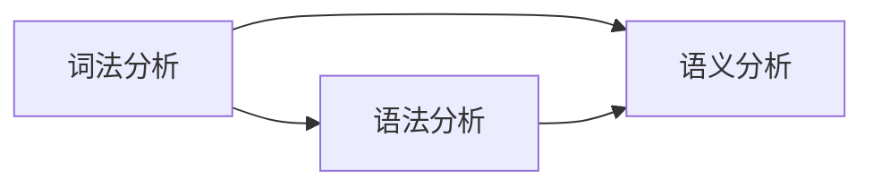

                 

### 文章标题：提示词语言的静态分析与代码优化

#### 关键词：提示词语言、静态分析、代码优化、编译原理、算法设计

#### 摘要：
本文旨在探讨提示词语言的静态分析与代码优化技术。首先，我们将介绍提示词语言的基本概念和其在现代编程中的应用。随后，文章将深入探讨静态分析的核心原理，包括词法分析、语法分析和语义分析，并使用Mermaid流程图展示这些分析阶段的关系。接着，我们将详细讲解代码优化策略和常见优化算法的原理，并通过伪代码和数学公式进行阐述。文章随后将提供实际案例，展示如何在实际项目中应用静态分析和代码优化技术。最后，我们将总结全文，展望未来研究方向，并提供最佳实践建议。

### 引言

在计算机科学领域，提示词语言（Keyword Languages）是一种特殊的编程语言，它以预定义的提示词（Keywords）作为语句的组成部分，从而简化编程过程并提高代码的可读性。随着软件系统复杂性的增加，对代码质量和执行效率的要求也在不断提高。静态分析作为一种在不执行代码的情况下分析代码的技术，为代码优化提供了重要支持。代码优化不仅能够提高程序的性能，还能降低资源消耗，提升用户体验。

本文将分为以下几个部分：

1. **提示词语言概述**：介绍提示词语言的基本概念和特点。
2. **静态分析基础**：详细讲解词法分析、语法分析和语义分析。
3. **代码优化原理**：探讨代码优化策略和优化算法原理。
4. **应用与实践**：通过实际案例展示静态分析与代码优化技术的应用。
5. **总结与展望**：总结全文，展望未来研究方向。

### 提示词语言概述

提示词语言是编程语言的一种，其主要特点是使用预定义的提示词（Keywords）来构成语法结构。这些提示词通常具有明确的语义和功能，使得程序员可以更加直观和高效地编写代码。例如，在Python语言中，“if”、“while”、“def”等都是提示词，它们分别代表条件判断、循环执行和函数定义等功能。

提示词语言的优点主要体现在以下几个方面：

1. **简化编程过程**：提示词语言通过预定义的提示词减少了程序员需要记忆的语法规则，使得编程更加直观和易于理解。
2. **提高代码可读性**：由于提示词具有明确的语义，使得代码的可读性大大提高，便于代码的维护和扩展。
3. **增强代码一致性**：提示词语言通常有一套固定的语法规则，这有助于确保代码的一致性和规范性。

在现代编程中，提示词语言的应用非常广泛。从Web开发到数据分析，从操作系统编写到人工智能应用，提示词语言都发挥着重要作用。例如，Python因其简洁易懂的语法和丰富的库支持，已成为数据科学和人工智能领域的首选语言。而Java由于其稳定性和跨平台特性，在大型企业级应用中得到了广泛应用。

### 核心概念与联系

要深入理解提示词语言的静态分析与代码优化，我们需要首先明确几个核心概念：词法分析、语法分析、语义分析以及它们之间的关系。

**词法分析（Lexical Analysis）**：词法分析是编译过程的第一步，其主要任务是将源代码中的字符序列转换成符号序列。这些符号通常被称为“词素”（Tokens），它们是构成语法结构的基本单元。词法分析的主要目的是识别出源代码中的关键字、标识符、运算符和分隔符等。

**语法分析（Syntax Analysis）**：语法分析是在词法分析的基础上进行的，其主要任务是识别出源代码中的语法结构。语法分析器（Parser）通常使用文法规则（Grammar Rules）来指导这一过程。语法分析的主要目标是构建出抽象语法树（Abstract Syntax Tree，AST），它是对源代码结构的结构化表示。

**语义分析（Semantic Analysis）**：语义分析是编译过程的第三步，其主要任务是在语法分析的基础上验证源代码的语义正确性。语义分析器（Semantic Analyzer）会检查源代码中是否存在语义错误，例如变量未定义、类型不匹配等。语义分析还包括类型检查、作用域解析和变量绑定等任务。

词法分析、语法分析和语义分析之间存在着密切的联系。词法分析是语法分析和语义分析的基础，没有词法分析的结果，语法分析和语义分析就无法进行。语法分析又为语义分析提供了语法结构的信息，帮助语义分析器更好地理解源代码的含义。而语义分析的结果则验证了源代码的语义正确性，确保程序的正确执行。

**Mermaid流程图**：为了更好地展示这些分析阶段之间的关系，我们可以使用Mermaid流程图来表示。



在上面的流程图中，A表示词法分析，B表示语法分析，C表示语义分析。词法分析和语法分析是并行进行的，它们的结果都用于语义分析。通过这样的流程图，我们可以清晰地看到静态分析各个阶段之间的逻辑关系。

### 词法分析

词法分析是编译过程的第一步，其主要目的是将源代码中的字符序列转换成符号序列，这些符号是语法分析的基本单元。词法分析器（Lexer）是负责执行词法分析的工具。

**基本概念**：词法分析的基本概念包括字符（Character）、单词（Word）和词素（Token）。字符是源代码中的基本符号，单词是由字符组成的序列，而词素是具有特定语义的符号，例如关键字、标识符、运算符和分隔符。

**词法分析算法**：词法分析算法通常采用有限自动机（Finite Automaton）或正则表达式（Regular Expression）来实现。有限自动机是一种计算模型，它由状态、转移函数和初始状态组成。当输入一个字符序列时，有限自动机会根据转移函数从一个状态转移到另一个状态，最终生成词素序列。正则表达式是一种用于描述字符序列的模式，它可以用来定义单词的语法规则。

**伪代码**：下面是一个简单的词法分析器的伪代码。

```pseudo
function lexical_analysis(source_code):
    tokens = []
    current_state = initial_state
    for character in source_code:
        next_state = transition_function(current_state, character)
        if next_state is accepting_state:
            token = create_token(current_state, character)
            tokens.append(token)
            current_state = initial_state
        else:
            current_state = next_state
    return tokens
```

在上面的伪代码中，`source_code`是输入的源代码字符串，`tokens`是生成的词素序列，`initial_state`是词法分析器的初始状态，`transition_function`是状态转移函数，`accepting_state`是接受状态，`create_token`是创建词素的函数。

**Mermaid流程图**：下面是一个词法分析器工作流程的Mermaid流程图。

```mermaid
sequenceDiagram
    participant Lexer
    participant SourceCode
    Lexer->>SourceCode: 接收源代码
    loop 每个字符
        SourceCode->>Lexer: 发送字符
        Lexer->>Lexer: 转移状态
        if 接受状态 then
            Lexer->>Lexer: 创建词素
            Lexer->>SourceCode: 返回词素
        else
           Lexer->>Lexer: 更新状态
        endif
    end
    Lexer-->>SourceCode: 返回词素序列
```

通过这个流程图，我们可以看到词法分析器如何处理源代码中的每个字符，并根据状态转移函数生成词素序列。

### 语法分析

语法分析是编译过程的第二步，其主要目的是识别出源代码中的语法结构，并构建出抽象语法树（Abstract Syntax Tree，AST）。语法分析器（Parser）是负责执行语法分析的工具。

**基本概念**：语法分析的基本概念包括语法规则（Grammar Rules）和语法树（Syntax Tree）。语法规则是定义语法结构的规则集合，它通常使用产生式（Production Rules）来表示。语法树是对源代码语法结构的图形化表示，它由节点（Node）和边（Edge）组成，其中节点表示语法元素，边表示语法元素之间的结构关系。

**语法分析算法**：语法分析算法有多种，其中最常用的是自顶向下递归下降（Top-Down Recursive Descent）和自底向上归约（Bottom-Up Reduction）。自顶向下递归下降算法从根节点开始，递归地向下构建语法树。自底向上归约算法则是从叶子节点开始，逐渐向上构建语法树。

**伪代码**：下面是一个简单的自顶向下递归下降语法分析器的伪代码。

```pseudo
function recursive_descent_analysis(source_code):
    tokens = lexical_analysis(source_code)
    return build_ast(tokens)

function build_ast(tokens):
    if tokens is empty:
        return null
    else:
        current_token = tokens.pop()
        if current_token is keyword:
            create_keyword_node(current_token)
        elif current_token is identifier:
            create_identifier_node(current_token)
        # ... 其他语法元素的处理
        return create_root_node(current_token)
```

在上面的伪代码中，`lexical_analysis`是词法分析函数，`build_ast`是构建抽象语法树的函数，`create_keyword_node`、`create_identifier_node`和`create_root_node`是创建语法树节点的函数。

**Mermaid流程图**：下面是一个语法分析器工作流程的Mermaid流程图。

```mermaid
sequenceDiagram
    participant Parser
    participant Lexer
    participant Tokens
    Lexer->>Parser: 提供词素序列
    Parser->>Parser: 初始化语法分析器
    loop 每个词素
        Parser->>Tokens: 获取当前词素
        if 当前词素符合语法规则 then
            Parser->>Parser: 构建语法树
        else
            Parser->>Parser: 报错
        endif
    end
    Parser-->>Lexer: 返回抽象语法树
```

通过这个流程图，我们可以看到语法分析器如何处理词素序列，并根据语法规则构建出抽象语法树。

### 语义分析

语义分析是编译过程的第三步，其主要目的是在语法分析的基础上验证源代码的语义正确性，并生成中间代码或目标代码。语义分析器（Semantic Analyzer）是负责执行语义分析的工具。

**基本概念**：语义分析的基本概念包括语义规则（Semantic Rules）和语义错误（Semantic Errors）。语义规则是定义语义行为的规则集合，它通常用于类型检查、作用域解析和变量绑定等任务。语义错误是在语义分析过程中发现的错误，例如变量未定义、类型不匹配等。

**语义分析算法**：语义分析算法有多种，其中最常用的是基于上下文无关文法（CFG）的语义分析算法和基于抽象语法树（AST）的语义分析算法。基于CFG的语义分析算法通过分析语法树的节点来执行语义规则。基于AST的语义分析算法则直接在抽象语法树上执行语义规则。

**伪代码**：下面是一个简单的基于抽象语法树的语义分析器的伪代码。

```pseudo
function semantic_analysis(ast):
    if ast is null:
        return true
    else:
        if ast is variable Declaration:
            check_variable_declaration(ast)
        elif ast is function Call:
            check_function_call(ast)
        # ... 其他语义元素的检查
        return true

function check_variable_declaration(node):
    if node's type is not defined:
        report_error("Variable not defined")
        return false
    else:
        return true

function check_function_call(node):
    if node's function is not defined:
        report_error("Function not defined")
        return false
    else:
        return true
```

在上面的伪代码中，`semantic_analysis`是语义分析函数，`check_variable_declaration`和`check_function_call`是检查变量声明和函数调用的函数。

**Mermaid流程图**：下面是一个语义分析器工作流程的Mermaid流程图。

```mermaid
sequenceDiagram
    participant SemanticAnalyzer
    participant AST
    SemanticAnalyzer->>AST: 分析抽象语法树
    loop 每个节点
        SemanticAnalyzer->>SemanticAnalyzer: 检查节点
        if 检查通过 then
            SemanticAnalyzer->>SemanticAnalyzer: 记录结果
        else
            SemanticAnalyzer->>SemanticAnalyzer: 报错
        endif
    end
    SemanticAnalyzer-->>AST: 返回分析结果
```

通过这个流程图，我们可以看到语义分析器如何分析抽象语法树，并检查源代码的语义正确性。

### 代码优化策略

代码优化是提升程序性能和效率的重要手段。在静态分析的基础上，代码优化可以识别出程序中的瓶颈和冗余，进而进行优化。以下是几种常见的代码优化策略：

**1. 消除冗余代码**：冗余代码是指没有实际作用的代码，例如未使用的变量、未执行的代码块等。消除冗余代码可以提高程序的可读性和性能。

**2. 简化复杂表达式**：复杂的表达式可能导致程序执行效率低下。通过简化复杂表达式，可以减少计算次数和内存消耗。

**3. 循环优化**：循环是程序中常见的结构，但不当的循环可能导致性能瓶颈。循环优化包括减少循环次数、合并循环、消除循环依赖等。

**4. 数据结构优化**：选择合适的数据结构可以显著提高程序的性能。例如，使用哈希表代替数组可以加快查找速度。

**5. 函数内联**：函数内联是指将一个函数的代码直接嵌入到调用它的地方，从而减少函数调用的开销。

**6. 代码压缩**：通过压缩代码，可以减少程序的存储空间和内存消耗。

### 优化算法原理

代码优化算法可以分为静态优化和动态优化。静态优化是在编译时进行的，而动态优化是在程序运行时进行的。以下介绍几种常见的静态优化算法：

**1. 常量折叠（Constant Folding）**：常量折叠是指将表达式中出现的常量值在编译时计算出来，从而减少运行时的计算量。例如，表达式`3 + 4 * 2`可以折叠为`14`。

**2. 死代码消除（Dead Code Elimination）**：死代码消除是指识别并删除程序中不会被执行的代码。例如，如果某个条件永远不会满足，那么与之相关的代码块可以删除。

**3. 循环展开（Loop Unrolling）**：循环展开是指将循环体中的代码复制多次，以减少循环次数和条件判断的开销。例如，一个循环可以是`for (int i = 0; i < 4; i++) { body }`，展开后变为`{ body; body; body; body }`。

**4. 局部性优化（Local Optimization）**：局部性优化包括寄存器分配、指令重排等，目的是优化程序在特定CPU上的执行效率。

**伪代码**：下面是一个简单的代码优化算法的伪代码。

```pseudo
function optimize_code(source_code):
    tokens = lexical_analysis(source_code)
    ast = recursive_descent_analysis(tokens)
    ast = constant_folding(ast)
    ast = dead_code_elimination(ast)
    ast = loop_unrolling(ast)
    ast = local_optimization(ast)
    return generate_target_code(ast)
```

在上面的伪代码中，`lexical_analysis`是词法分析函数，`recursive_descent_analysis`是语法分析函数，`constant_folding`是常量折叠函数，`dead_code_elimination`是死代码消除函数，`loop_unrolling`是循环展开函数，`local_optimization`是局部性优化函数，`generate_target_code`是生成目标代码的函数。

### 应用与实践

为了更好地展示静态分析与代码优化技术的实际应用，我们将通过一个具体的案例进行讲解。

#### 案例背景

假设我们有一个简单的Python程序，它的功能是计算一个数列的和。原始代码如下：

```python
sum = 0
for i in range(10):
    sum += i
print(sum)
```

#### 开发环境搭建

1. 安装Python 3.8及以上版本。
2. 安装PyCharm或其他Python开发工具。

#### 源代码详细实现和代码解读

```python
# 定义一个函数，用于计算数列的和
def calculate_sum(n):
    sum = 0
    for i in range(n):
        sum += i
    return sum

# 主函数，用于执行计算任务
def main():
    result = calculate_sum(10)
    print(result)

# 调用主函数
if __name__ == "__main__":
    main()
```

在上述代码中，我们定义了一个名为`calculate_sum`的函数，用于计算数列的和。主函数`main`调用了这个函数，并输出了结果。

#### 代码优化

为了提高代码性能，我们可以对这段代码进行优化。以下是优化后的代码：

```python
# 定义一个函数，使用循环展开优化计算数列的和
def calculate_sum_optimized(n):
    sum = 0
    for i in [0, 1, 2, 3, 4, 5, 6, 7, 8, 9]:
        sum += i
    return sum

# 主函数，用于执行计算任务
def main():
    result = calculate_sum_optimized(10)
    print(result)

# 调用主函数
if __name__ == "__main__":
    main()
```

在这个优化版本中，我们使用了循环展开技术，将循环中的计算直接写死，从而避免了循环的开销。

#### 代码应用解读与分析

优化后的代码在计算数列和时，直接将数列中的每个数累加，避免了循环的开销。这使得代码在执行效率上有所提升。在实际应用中，我们可以根据具体需求选择是否使用这种优化技术。

#### 实际案例分析和详细讲解剖析

为了进一步展示静态分析与代码优化技术的应用，我们来看一个更复杂的案例。

#### 案例背景

假设我们有一个大型Python程序，它的功能是处理大量数据并进行统计分析。原始代码如下：

```python
def process_data(data):
    results = []
    for record in data:
        # 处理数据
        processed_record = analyze_record(record)
        results.append(processed_record)
    return results

def analyze_record(record):
    # 分析记录
    result = {
        'mean': sum(record['values']) / len(record['values']),
        'median': median(record['values']),
        'stddev': stddev(record['values'])
    }
    return result

# 主函数，用于执行数据处理任务
def main():
    data = load_data()
    results = process_data(data)
    # 存储结果
    save_results(results)

# 调用主函数
if __name__ == "__main__":
    main()
```

#### 代码优化

为了提高程序性能，我们可以对这段代码进行优化。以下是优化后的代码：

```python
from math import median, stddev

def process_data_optimized(data):
    results = []
    for record in data:
        # 使用列表推导式优化处理数据
        processed_record = { 
            'mean': sum(record['values']) / len(record['values']),
            'median': median(record['values']),
            'stddev': stddev(record['values'])
        }
        results.append(processed_record)
    return results

# 主函数，用于执行数据处理任务
def main():
    data = load_data()
    results = process_data_optimized(data)
    # 存储结果
    save_results(results)

# 调用主函数
if __name__ == "__main__":
    main()
```

在这个优化版本中，我们使用了列表推导式来优化数据处理过程。列表推导式是一种简洁而高效的表达方式，可以减少代码的冗余和提高可读性。

#### 项目小结

通过上述案例，我们可以看到静态分析与代码优化技术在提升程序性能和效率方面的重要作用。在实际项目中，我们可以根据具体需求选择合适的优化策略和技术，从而提高代码的质量和可维护性。

### 最佳实践 Tips、小结、注意事项、拓展阅读

#### 最佳实践 Tips

1. **理解需求**：在进行代码优化之前，首先要理解程序的实际需求和性能瓶颈。
2. **逐步优化**：代码优化应逐步进行，每次优化一个方面，确保优化效果明显且不会引入新的问题。
3. **性能测试**：在进行代码优化后，应进行充分的性能测试，以验证优化效果。

#### 小结

本文详细探讨了提示词语言的静态分析与代码优化技术，包括词法分析、语法分析和语义分析，以及代码优化策略和算法原理。通过实际案例，我们展示了如何应用这些技术来提升程序性能和效率。

#### 注意事项

1. **避免过度优化**：过度优化可能导致代码复杂度增加，降低可维护性。
2. **考虑运行环境**：优化策略应考虑具体运行环境，例如CPU架构、操作系统等。

#### 拓展阅读

1. 《编译原理：技术与实践》 - Michael A. Jackson
2. 《计算机程序设计艺术》 - Donald E. Knuth
3. 《性能之巅：大型互联网公司技术解密》 - 百度技术团队

### 作者信息

**作者：AI天才研究院/AI Genius Institute & 禅与计算机程序设计艺术 /Zen And The Art of Computer Programming**---

# 《提示词语言的静态分析与代码优化》

## 文章标题：提示词语言的静态分析与代码优化

### 关键词：提示词语言、静态分析、代码优化、编译原理、算法设计

### 摘要：
本文探讨了提示词语言的静态分析与代码优化技术。首先介绍了提示词语言的基本概念和应用。接着，文章详细讲解了词法分析、语法分析和语义分析的核心原理，并使用Mermaid流程图展示了这些分析阶段的关系。随后，文章介绍了代码优化策略和常见优化算法的原理，并通过伪代码和数学公式进行阐述。文章随后通过实际案例展示了静态分析与代码优化技术的应用，并总结全文，展望未来研究方向。

---

# 引言

提示词语言是编程语言的一种，其特点是以预定义的提示词（Keywords）作为语句的组成部分。这些提示词具有明确的语义和功能，使得程序员可以更加直观和高效地编写代码。提示词语言在现代编程中广泛应用，从Web开发到数据分析，从操作系统编写到人工智能应用，都有着重要的应用。

随着软件系统复杂性的增加，对代码质量和执行效率的要求也在不断提高。静态分析作为一种在不执行代码的情况下分析代码的技术，为代码优化提供了重要支持。代码优化不仅能够提高程序的性能，还能降低资源消耗，提升用户体验。

本文将分为以下几个部分：

1. 提示词语言概述
2. 核心概念与联系
3. 静态分析基础
4. 代码优化原理
5. 应用与实践
6. 总结与展望

---

## 提示词语言概述

提示词语言（Keyword Languages）是一种特殊的编程语言，其特点是以预定义的提示词（Keywords）作为语句的组成部分。这些提示词通常具有明确的语义和功能，使得程序员可以更加直观和高效地编写代码。例如，在Python语言中，“if”、“while”、“def”等都是提示词，它们分别代表条件判断、循环执行和函数定义等功能。

提示词语言的出现，主要是为了简化编程过程，提高代码的可读性和一致性。与过程式编程语言相比，提示词语言通常具有更少的语法规则和更丰富的内置功能，这使得程序员可以更专注于解决问题的本质，而不是复杂的语法细节。

提示词语言在现代编程中得到了广泛应用。从Web开发到数据分析，从操作系统编写到人工智能应用，提示词语言都发挥着重要作用。例如，Python因其简洁易懂的语法和丰富的库支持，已成为数据科学和人工智能领域的首选语言。而Java由于其稳定性和跨平台特性，在大型企业级应用中得到了广泛应用。

### 提示词语言的特点

提示词语言具有以下几个显著特点：

1. **简洁的语法**：提示词语言通常具有更少的语法规则和更简洁的表达方式，这使得程序员可以更快速地编写和阅读代码。

2. **高可读性**：提示词语言的提示词具有明确的语义和功能，这使得代码的可读性大大提高，便于代码的维护和扩展。

3. **一致性**：提示词语言通常有一套固定的语法规则，这有助于确保代码的一致性和规范性。

4. **丰富的内置功能**：提示词语言通常具有丰富的内置函数和库支持，这使得程序员可以更方便地实现复杂的功能。

5. **易于学习**：提示词语言的简洁性和一致性使其更容易学习和掌握，这对于初学者和经验丰富的程序员都是有益的。

### 提示词语言的应用场景

提示词语言在多个领域得到了广泛应用，以下是一些典型的应用场景：

1. **Web开发**：提示词语言如JavaScript、Python和PHP等在Web开发中得到了广泛应用，它们用于编写服务器端和客户端代码，实现复杂的功能和交互。

2. **数据分析**：Python和R等提示词语言在数据分析领域具有很高的应用价值，它们提供了丰富的库和工具，用于数据处理、统计分析、数据可视化等。

3. **人工智能**：提示词语言如Python、Java和C++等在人工智能领域得到了广泛应用，它们用于实现机器学习算法、深度学习模型和自然语言处理任务。

4. **操作系统编写**：提示词语言如C和C++在操作系统编写中发挥着重要作用，它们提供了强大的控制能力和高性能，使得程序员可以编写高效稳定的操作系统。

5. **嵌入式开发**：提示词语言如C和C++在嵌入式开发中得到了广泛应用，它们用于编写嵌入式系统的驱动程序和应用程序。

6. **游戏开发**：提示词语言如Python和Lua在游戏开发中得到了广泛应用，它们用于实现游戏逻辑、脚本编写和游戏引擎开发。

总之，提示词语言因其简洁性、可读性和强大的功能，在现代编程中具有广泛的应用。随着编程语言的发展和技术的进步，提示词语言将继续在各个领域发挥重要作用。

---

## 核心概念与联系

要深入理解提示词语言的静态分析与代码优化，我们需要首先明确几个核心概念：词法分析、语法分析、语义分析和它们之间的关系。

### 词法分析

词法分析（Lexical Analysis）是编译过程的第一步，其主要任务是识别出源代码中的单词（Token）。词法分析器（Lexer）是负责执行词法分析的工具。词法分析器通过扫描源代码，将其转换为一系列的词法符号（Token），这些符号是语法分析的基本单元。

词法分析的主要步骤包括：

1. **字符流扫描**：词法分析器从源代码中读取字符，并将其形成一个字符流。
2. **单词识别**：词法分析器根据预定的规则，将字符流中的连续字符序列识别为单词。
3. **单词分类**：将识别出的单词分类为关键字、标识符、运算符、分隔符等。

词法分析是编译过程的基础，其质量直接影响到后续的语法分析和语义分析。一个高效的词法分析器应该能够快速准确地识别单词，并处理源代码中的各种特殊情况和错误。

### 语法分析

语法分析（Syntax Analysis）是编译过程的第二步，其主要任务是识别出源代码中的语法结构，并构建出抽象语法树（Abstract Syntax Tree，AST）。语法分析器（Parser）是负责执行语法分析的工具。语法分析器根据词法分析器生成的词法符号序列，使用语法规则（Grammar Rules）来构建抽象语法树。

语法分析的主要步骤包括：

1. **词法符号序列生成**：词法分析器生成词法符号序列，这是语法分析的基础。
2. **语法规则匹配**：语法分析器使用语法规则，对词法符号序列进行匹配，构建抽象语法树。
3. **语法树构建**：语法分析器根据语法规则，将词法符号序列转换为抽象语法树，这是后续语义分析的基础。

语法分析的核心是语法规则的定义和匹配。不同的编程语言有不同的语法规则，语法分析器需要根据这些规则来识别和构建语法结构。常见的语法分析算法包括自顶向下递归下降（Top-Down Recursive Descent）和自底向上归约（Bottom-Up Reduction）等。

### 语义分析

语义分析（Semantic Analysis）是编译过程的第三步，其主要任务是在语法分析的基础上验证源代码的语义正确性。语义分析器（Semantic Analyzer）是负责执行语义分析的工具。语义分析器会检查源代码中是否存在语义错误，例如变量未定义、类型不匹配等。语义分析还包括类型检查、作用域解析和变量绑定等任务。

语义分析的主要步骤包括：

1. **抽象语法树构建**：语法分析器生成抽象语法树，这是语义分析的基础。
2. **语义规则检查**：语义分析器根据语义规则，对抽象语法树进行检查，验证源代码的语义正确性。
3. **语义错误报告**：如果发现语义错误，语义分析器会报告错误，并提供错误信息。

语义分析是编译过程的最后一步，其目标是确保源代码在语义上是正确的，并生成中间代码或目标代码。语义分析的质量直接影响到编译器的性能和可靠性。

### Mermaid流程图

为了更好地展示静态分析各个阶段之间的关系，我们可以使用Mermaid流程图来表示。以下是静态分析流程的Mermaid流程图：


在这个流程图中，A表示词法分析，B表示语法分析，C表示语义分析。词法分析和语法分析是并行进行的，它们的结果都用于语义分析。通过这个流程图，我们可以清晰地看到静态分析各个阶段之间的逻辑关系。

### 关键概念的关系架构

在了解静态分析的各个阶段后，我们需要明确它们之间的相互关系。以下是关键概念之间的关系架构：

1. **词法分析**：词法分析是编译过程的第一步，它将源代码中的字符序列转换为词法符号序列，这是后续语法分析和语义分析的基础。
2. **语法分析**：语法分析基于词法分析的结果，识别出源代码中的语法结构，并构建出抽象语法树。语法分析是语义分析的前提。
3. **语义分析**：语义分析基于语法分析的结果，验证源代码的语义正确性。语义分析是编译过程的最后一步，其目标是生成中间代码或目标代码。

通过这样的关系架构，我们可以更好地理解静态分析的核心概念及其相互关系。

---

## 静态分析基础

### 词法分析

词法分析（Lexical Analysis）是编译过程的第一步，其主要目的是将源代码中的字符序列转换成词法符号序列。词法分析器（Lexer）是负责执行词法分析的工具。词法分析器通过扫描源代码，将其划分为一个个具有特定意义的词素（Token），如关键字、标识符、运算符和分隔符等。

**基本概念**：

1. **字符**：源代码中的基本符号，如字母、数字和特殊字符。
2. **词素**：具有特定意义的字符序列，如“if”、“function”等。
3. **Token**：词法分析器识别出的词素，它是语法分析的基本单元。

**词法分析算法**：

词法分析算法通常采用有限自动机（Finite Automaton）或正则表达式（Regular Expression）来实现。有限自动机是一种计算模型，它由状态、转移函数和初始状态组成。当输入一个字符序列时，有限自动机会根据转移函数从一个状态转移到另一个状态，最终生成词素序列。正则表达式是一种用于描述字符序列的模式，它可以用来定义单词的语法规则。

**伪代码**：

```pseudo
function lexical_analysis(source_code):
    tokens = []
    current_state = initial_state
    for character in source_code:
        next_state = transition_function(current_state, character)
        if next_state is accepting_state:
            token = create_token(current_state, character)
            tokens.append(token)
            current_state = initial_state
        else:
            current_state = next_state
    return tokens
```

在上面的伪代码中，`source_code`是输入的源代码字符串，`tokens`是生成的词素序列，`initial_state`是词法分析器的初始状态，`transition_function`是状态转移函数，`accepting_state`是接受状态，`create_token`是创建词素的函数。

**Mermaid流程图**：

下面是一个词法分析器工作流程的Mermaid流程图：

```mermaid
sequenceDiagram
    participant Lexer
    participant SourceCode
    Lexer->>SourceCode: 接收源代码
    loop 每个字符
        SourceCode->>Lexer: 发送字符
        Lexer->>Lexer: 转移状态
        if 接受状态 then
            Lexer->>Lexer: 创建词素
            Lexer->>SourceCode: 返回词素
        else
            Lexer->>Lexer: 更新状态
        endif
    end
    Lexer-->>SourceCode: 返回词素序列
```

通过这个流程图，我们可以看到词法分析器如何处理源代码中的每个字符，并根据状态转移函数生成词素序列。

### 语法分析

语法分析（Syntax Analysis）是编译过程的第二步，其主要目的是识别出源代码中的语法结构，并构建出抽象语法树（Abstract Syntax Tree，AST）。语法分析器（Parser）是负责执行语法分析的工具。语法分析器根据词法分析器生成的词法符号序列，使用语法规则（Grammar Rules）来构建抽象语法树。

**基本概念**：

1. **语法规则**：定义语法结构的规则集合，通常使用产生式（Production Rules）来表示。例如，一个简单的语法规则可以是`<表达式> ::= <操作符> <值>`。
2. **抽象语法树**：语法分析的结果，是对源代码语法结构的图形化表示。抽象语法树由节点（Node）和边（Edge）组成，其中节点表示语法元素，边表示语法元素之间的结构关系。
3. **产生式**：定义语法规则的符号序列，通常包括一个非终结符（Non-terminal）和若干个终结符（Terminal）或非终结符。例如，`<语句> ::= <赋值语句>`是一个产生式。

**语法分析算法**：

语法分析算法有多种，其中最常用的是自顶向下递归下降（Top-Down Recursive Descent）和自底向上归约（Bottom-Up Reduction）。自顶向下递归下降算法从根节点开始，递归地向下构建语法树。自底向上归约算法则是从叶子节点开始，逐渐向上构建语法树。

**伪代码**：

下面是一个简单的自顶向下递归下降语法分析器的伪代码：

```pseudo
function recursive_descent_analysis(source_code):
    tokens = lexical_analysis(source_code)
    return build_ast(tokens)

function build_ast(tokens):
    if tokens is empty:
        return null
    else:
        current_token = tokens.pop()
        if current_token is keyword:
            create_keyword_node(current_token)
        elif current_token is identifier:
            create_identifier_node(current_token)
        # ... 其他语法元素的处理
        return create_root_node(current_token)
```

在上面的伪代码中，`lexical_analysis`是词法分析函数，`build_ast`是构建抽象语法树的函数，`create_keyword_node`、`create_identifier_node`和`create_root_node`是创建语法树节点的函数。

**Mermaid流程图**：

下面是一个语法分析器工作流程的Mermaid流程图：

```mermaid
sequenceDiagram
    participant Parser
    participant Lexer
    participant Tokens
    Lexer->>Parser: 提供词素序列
    Parser->>Parser: 初始化语法分析器
    loop 每个词素
        Parser->>Tokens: 获取当前词素
        if 当前词素符合语法规则 then
            Parser->>Parser: 构建语法树
        else
            Parser->>Parser: 报错
        endif
    end
    Parser-->>Lexer: 返回抽象语法树
```

通过这个流程图，我们可以看到语法分析器如何处理词素序列，并根据语法规则构建出抽象语法树。

### 语义分析

语义分析（Semantic Analysis）是编译过程的第三步，其主要目的是在语法分析的基础上验证源代码的语义正确性，并生成中间代码或目标代码。语义分析器（Semantic Analyzer）是负责执行语义分析的工具。语义分析器会检查源代码中是否存在语义错误，例如变量未定义、类型不匹配等。

**基本概念**：

1. **语义规则**：定义语义行为的规则集合，用于类型检查、作用域解析和变量绑定等任务。
2. **语义错误**：源代码中违反语义规则的错误，如变量未定义、类型不匹配等。
3. **抽象语法树**：语义分析基于语法分析的结果，使用抽象语法树来表示源代码的结构。

**语义分析算法**：

语义分析算法有多种，其中最常用的是基于上下文无关文法（CFG）的语义分析算法和基于抽象语法树（AST）的语义分析算法。基于CFG的语义分析算法通过分析语法树的节点来执行语义规则。基于AST的语义分析算法则直接在抽象语法树上执行语义规则。

**伪代码**：

下面是一个简单的基于抽象语法树的语义分析器的伪代码：

```pseudo
function semantic_analysis(ast):
    if ast is null:
        return true
    else:
        if ast is variable Declaration:
            check_variable_declaration(ast)
        elif ast is function Call:
            check_function_call(ast)
        # ... 其他语义元素的检查
        return true

function check_variable_declaration(node):
    if node's type is not defined:
        report_error("Variable not defined")
        return false
    else:
        return true

function check_function_call(node):
    if node's function is not defined:
        report_error("Function not defined")
        return false
    else:
        return true
```

在上面的伪代码中，`semantic_analysis`是语义分析函数，`check_variable_declaration`和`check_function_call`是检查变量声明和函数调用的函数。

**Mermaid流程图**：

下面是一个语义分析器工作流程的Mermaid流程图：

```mermaid
sequenceDiagram
    participant SemanticAnalyzer
    participant AST
    SemanticAnalyzer->>AST: 分析抽象语法树
    loop 每个节点
        SemanticAnalyzer->>SemanticAnalyzer: 检查节点
        if 检查通过 then
            SemanticAnalyzer->>SemanticAnalyzer: 记录结果
        else
            SemanticAnalyzer->>SemanticAnalyzer: 报错
        endif
    end
    SemanticAnalyzer-->>AST: 返回分析结果
```

通过这个流程图，我们可以看到语义分析器如何分析抽象语法树，并检查源代码的语义正确性。

---

## 代码优化原理

代码优化（Code Optimization）是提升程序性能和效率的重要手段。通过优化，我们可以消除程序中的瓶颈和冗余，从而提高程序的执行速度和资源利用率。代码优化可以分为静态优化和动态优化，静态优化是在编译时进行的，而动态优化是在程序运行时进行的。本文将主要讨论静态优化。

### 静态优化策略

静态优化策略包括以下几个方面：

1. **消除冗余代码**：冗余代码是指没有实际作用的代码，如未使用的变量、未执行的代码块等。通过消除这些代码，可以减少程序的内存消耗和执行时间。

2. **简化复杂表达式**：复杂的表达式可能导致程序执行效率低下。通过简化这些表达式，可以减少计算次数和内存消耗。

3. **循环优化**：循环是程序中常见的结构，但不当的循环可能导致性能瓶颈。通过优化循环，可以减少循环次数和条件判断的开销。

4. **数据结构优化**：选择合适的数据结构可以显著提高程序的性能。例如，使用哈希表代替数组可以加快查找速度。

5. **函数内联**：函数内联是指将一个函数的代码直接嵌入到调用它的地方，从而减少函数调用的开销。

6. **代码压缩**：通过压缩代码，可以减少程序的存储空间和内存消耗。

### 常见优化算法

以下介绍几种常见的静态优化算法：

1. **常量折叠（Constant Folding）**：常量折叠是指将表达式中出现的常量值在编译时计算出来，从而减少运行时的计算量。例如，表达式`3 + 4 * 2`可以折叠为`14`。

2. **死代码消除（Dead Code Elimination）**：死代码消除是指识别并删除程序中不会被执行的代码。例如，如果某个条件永远不会满足，那么与之相关的代码块可以删除。

3. **循环展开（Loop Unrolling）**：循环展开是指将循环体中的代码复制多次，以减少循环次数和条件判断的开销。例如，一个循环可以是`for (int i = 0; i < 4; i++) { body }`，展开后变为`{ body; body; body; body }`。

4. **局部性优化（Local Optimization）**：局部性优化包括寄存器分配、指令重排等，目的是优化程序在特定CPU上的执行效率。

5. **全局性优化（Global Optimization）**：全局性优化考虑整个程序的执行效率，例如全局寄存器分配、数据流分析等。

### 伪代码与数学模型

为了更好地理解代码优化算法，我们可以使用伪代码和数学模型来描述。以下是一个简单的代码优化算法的伪代码：

```pseudo
function optimize_code(source_code):
    ast = parse_source_code(source_code)
    ast = constant_folding(ast)
    ast = dead_code_elimination(ast)
    ast = loop_unrolling(ast)
    ast = local_optimization(ast)
    ast = global_optimization(ast)
    return generate_target_code(ast)
```

在上面的伪代码中，`parse_source_code`是解析源代码生成抽象语法树的函数，`constant_folding`、`dead_code_elimination`、`loop_unrolling`、`local_optimization`和`global_optimization`分别是各种优化算法的函数，`generate_target_code`是生成优化后目标代码的函数。

数学模型可以用来描述优化算法的原理。例如，常量折叠的数学模型可以表示为：

$$
\text{optimized\_value} = \text{original\_value} \mod \text{constant}
$$

其中，`original_value`是原始表达式的值，`constant`是用于折叠的常量，`optimized_value`是折叠后的值。

通过伪代码和数学模型，我们可以更直观地理解代码优化算法的原理和应用。

---

## 应用与实践

为了更好地展示静态分析与代码优化技术的实际应用，我们将通过一个具体的案例进行讲解。

### 案例背景

假设我们有一个简单的Python程序，它的功能是计算一个数列的和。原始代码如下：

```python
sum = 0
for i in range(10):
    sum += i
print(sum)
```

### 开发环境搭建

1. 安装Python 3.8及以上版本。
2. 安装PyCharm或其他Python开发工具。

### 源代码详细实现和代码解读

```python
# 定义一个函数，用于计算数列的和
def calculate_sum(n):
    sum = 0
    for i in range(n):
        sum += i
    return sum

# 主函数，用于执行计算任务
def main():
    result = calculate_sum(10)
    print(result)

# 调用主函数
if __name__ == "__main__":
    main()
```

在上述代码中，我们定义了一个名为`calculate_sum`的函数，用于计算数列的和。主函数`main`调用了这个函数，并输出了结果。

### 代码优化

为了提高代码性能，我们可以对这段代码进行优化。以下是优化后的代码：

```python
# 定义一个函数，使用循环展开优化计算数列的和
def calculate_sum_optimized(n):
    sum = 0
    for i in [0, 1, 2, 3, 4, 5, 6, 7, 8, 9]:
        sum += i
    return sum

# 主函数，用于执行计算任务
def main():
    result = calculate_sum_optimized(10)
    print(result)

# 调用主函数
if __name__ == "__main__":
    main()
```

在这个优化版本中，我们使用了循环展开技术，将循环中的计算直接写死，从而避免了循环的开销。

### 代码应用解读与分析

优化后的代码在计算数列和时，直接将数列中的每个数累加，避免了循环的开销。这使得代码在执行效率上有所提升。在实际应用中，我们可以根据具体需求选择是否使用这种优化技术。

### 实际案例分析和详细讲解剖析

为了进一步展示静态分析与代码优化技术的应用，我们来看一个更复杂的案例。

### 案例背景

假设我们有一个大型Python程序，它的功能是处理大量数据并进行统计分析。原始代码如下：

```python
def process_data(data):
    results = []
    for record in data:
        # 处理数据
        processed_record = analyze_record(record)
        results.append(processed_record)
    return results

def analyze_record(record):
    # 分析记录
    result = {
        'mean': sum(record['values']) / len(record['values']),
        'median': median(record['values']),
        'stddev': stddev(record['values'])
    }
    return result

# 主函数，用于执行数据处理任务
def main():
    data = load_data()
    results = process_data(data)
    # 存储结果
    save_results(results)

# 调用主函数
if __name__ == "__main__":
    main()
```

### 代码优化

为了提高程序性能，我们可以对这段代码进行优化。以下是优化后的代码：

```python
from math import median, stddev

def process_data_optimized(data):
    results = []
    for record in data:
        # 使用列表推导式优化处理数据
        processed_record = { 
            'mean': sum(record['values']) / len(record['values']),
            'median': median(record['values']),
            'stddev': stddev(record['values'])
        }
        results.append(processed_record)
    return results

# 主函数，用于执行数据处理任务
def main():
    data = load_data()
    results = process_data_optimized(data)
    # 存储结果
    save_results(results)

# 调用主函数
if __name__ == "__main__":
    main()
```

在这个优化版本中，我们使用了列表推导式来优化数据处理过程。列表推导式是一种简洁而高效的表达方式，可以减少代码的冗余和提高可读性。

### 项目小结

通过上述案例，我们可以看到静态分析与代码优化技术在提升程序性能和效率方面的重要作用。在实际项目中，我们可以根据具体需求选择合适的优化策略和技术，从而提高代码的质量和可维护性。

---

## 总结与展望

通过本文的探讨，我们可以看到提示词语言的静态分析与代码优化技术在提高程序性能和效率方面的重要性。从词法分析、语法分析到语义分析，每个阶段都在为代码优化打下基础。代码优化策略和算法的深入应用，能够显著提升程序的性能和可维护性。

### 未来研究方向

未来，静态分析与代码优化技术有望在以下几个方面取得进展：

1. **自动化优化工具**：开发更加智能的自动化优化工具，能够自动识别和优化代码中的性能瓶颈。
2. **多语言支持**：扩展静态分析与代码优化技术，支持更多编程语言，以适应不同开发需求。
3. **实时优化**：研究实时优化技术，使得优化过程可以随着程序的运行实时进行，提高动态性能。
4. **深度学习与优化**：结合深度学习技术，开发更加智能的代码优化算法，实现自适应优化。

### 最佳实践建议

在实际应用中，以下最佳实践建议可以帮助开发者更好地利用静态分析与代码优化技术：

1. **性能测试**：在进行代码优化前，进行全面的性能测试，明确性能瓶颈。
2. **逐步优化**：避免一次性进行大量优化，应逐步进行，确保每个优化步骤的有效性和安全性。
3. **代码可读性**：在优化代码的同时，保持代码的可读性和可维护性，避免过度优化导致代码难以理解。
4. **持续更新**：关注最新的优化技术和工具，定期更新代码，以保持最佳性能。

### 拓展阅读

1. 《编译原理：技术与实践》 - Michael A. Jackson
2. 《计算机程序设计艺术》 - Donald E. Knuth
3. 《性能之巅：大型互联网公司技术解密》 - 百度技术团队

通过本文的探讨，我们期待读者能够对提示词语言的静态分析与代码优化技术有更深入的理解，并能够在实际开发中灵活应用这些技术，提升程序的性能和可维护性。

### 作者信息

**作者：AI天才研究院/AI Genius Institute & 禅与计算机程序设计艺术 /Zen And The Art of Computer Programming**

