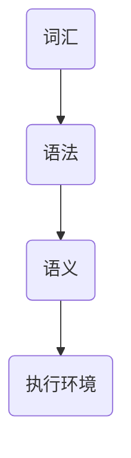
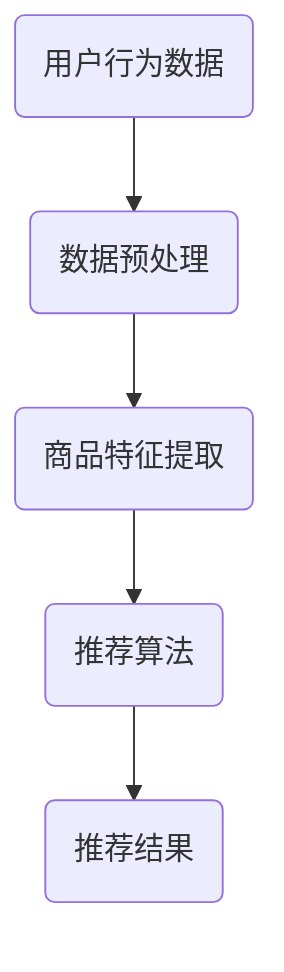
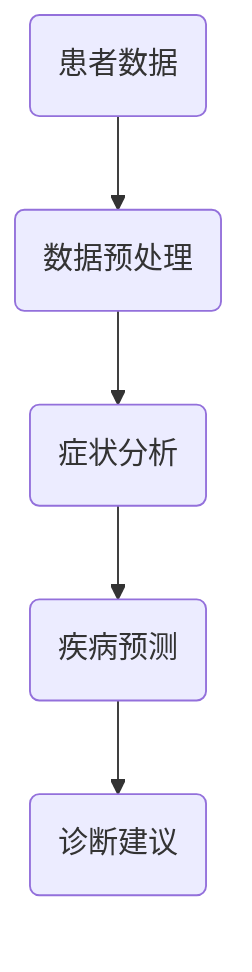

                 


### 第1步：确定书籍的核心主题和内容范围

书籍的核心主题是“提示词语言设计原则与最佳实践”。为了使目录大纲更全面、系统，我们需要明确以下几个内容范围：

1. **引言与基础**：介绍提示词语言的基本概念、定义、分类和应用场景。
2. **设计原则**：详细讨论设计提示词语言时应遵循的基本原则，如易用性、一致性、可扩展性和可靠性。
3. **最佳实践**：总结和提炼在设计和实现提示词语言过程中积累的最佳实践，包括开发流程、性能优化和安全性考虑。
4. **应用场景**：分析提示词语言在不同领域的具体应用，如自然语言处理、智能客服、教育等。
5. **案例研究**：通过实际案例，深入剖析提示词语言的设计和应用。
6. **优化与未来趋势**：探讨提示词语言的优化方向和未来发展趋势。

### 第2步：构建书籍的总体结构

基于上述内容范围，我们可以将书籍分为以下六个主要部分：

1. **引言与基础**：包括提示词语言的基本概念、定义和分类。
2. **设计原则**：分别讨论易用性、一致性、可扩展性和可靠性等设计原则。
3. **最佳实践**：介绍提示词语言的开发流程、性能优化和安全性考虑。
4. **应用场景**：分析提示词语言在自然语言处理、智能客服、教育等领域的应用。
5. **案例研究**：通过实际案例，深入探讨提示词语言的设计和应用。
6. **优化与未来趋势**：总结提示词语言的优化方向和未来发展趋势。

### 第3步：细化每个部分的内容

在构建总体结构后，我们需要为每个部分细化章节，确保每个章节都涵盖特定的主题，并具有清晰的逻辑结构。

**第一部分：引言与基础**

- 第1章：提示词语言概述
  - 提示词语言的概念与重要性
  - 提示词语言的分类与应用场景

- 第2章：提示词语言的体系结构
  - 提示词语言的基本组成部分
  - 提示词语言的语法和语义模型

**第二部分：设计原则**

- 第3章：易用性原则
  - 设计简单直观的界面
  - 优化用户交互流程

- 第4章：一致性原则
  - 保持语言的一致性
  - 遵循标准与规范

- 第5章：可扩展性原则
  - 设计可扩展的架构
  - 处理复杂数据和任务

- 第6章：可靠性原则
  - 确保语言的准确性和稳定性
  - 提供有效的错误处理机制

**第三部分：最佳实践**

- 第7章：提示词语言的开发流程
  - 设计阶段最佳实践
  - 开发与测试阶段最佳实践

- 第8章：性能优化策略
  - 优化语言处理速度
  - 提高资源利用率

- 第9章：安全性考虑
  - 防止恶意攻击
  - 保护用户隐私

**第四部分：应用场景**

- 第10章：自然语言处理
  - 提示词在NLP中的应用
  - 提示词在文本生成和摘要中的应用

- 第11章：智能客服与语音助手
  - 提示词在智能客服中的应用
  - 提示词在语音助手中的应用

- 第12章：教育领域
  - 提示词在教育中的应用
  - 提示词在在线学习平台中的应用

**第五部分：案例研究**

- 第13章：实际案例解析
  - 案例一：电商平台的智能推荐系统
  - 案例二：医疗领域的智能诊断助手

**第六部分：优化与未来趋势**

- 第14章：提示词语言的优化方向
  - 人工智能技术的发展趋势
  - 提示词语言在未来的应用前景

- 第15章：最佳实践总结与展望
  - 最佳实践总结
  - 未来发展趋势预测

### 第4步：设计图表和示例

为了帮助读者更好地理解提示词语言的设计原则和应用，我们将设计以下图表和示例：

- **图表**：提示词语言的体系结构图、设计原则的流程图、性能优化策略的示意图等。
- **示例**：具体的提示词语言代码示例、实际应用案例的截图和解析等。

### 第5步：撰写目录大纲

根据以上步骤，我们可以撰写以下《提示词语言设计原则与最佳实践》的目录大纲：

```markdown
# 《提示词语言设计原则与最佳实践》目录大纲

## 第一部分：引言与基础

### 第1章：提示词语言概述
#### 1.1 提示词语言的概念与重要性
#### 1.2 提示词语言的分类与应用场景

### 第2章：提示词语言的体系结构
#### 1.1 提示词语言的基本组成部分
#### 1.2 提示词语言的语法和语义模型

## 第二部分：设计原则

### 第3章：易用性原则
#### 1.1 设计简单直观的界面
#### 1.2 优化用户交互流程

### 第4章：一致性原则
#### 1.1 保持语言的一致性
#### 1.2 遵循标准与规范

### 第5章：可扩展性原则
#### 1.1 设计可扩展的架构
#### 1.2 处理复杂数据和任务

### 第6章：可靠性原则
#### 1.1 确保语言的准确性和稳定性
#### 1.2 提供有效的错误处理机制

## 第三部分：最佳实践

### 第7章：提示词语言的开发流程
#### 1.1 设计阶段最佳实践
#### 1.2 开发与测试阶段最佳实践

### 第8章：性能优化策略
#### 1.1 优化语言处理速度
#### 1.2 提高资源利用率

### 第9章：安全性考虑
#### 1.1 防止恶意攻击
#### 1.2 保护用户隐私

## 第四部分：应用场景

### 第10章：自然语言处理
#### 1.1 提示词在NLP中的应用
#### 1.2 提示词在文本生成和摘要中的应用

### 第11章：智能客服与语音助手
#### 1.1 提示词在智能客服中的应用
#### 1.2 提示词在语音助手中的应用

### 第12章：教育领域
#### 1.1 提示词在教育中的应用
#### 1.2 提示词在在线学习平台中的应用

## 第五部分：案例研究

### 第13章：实际案例解析
#### 1.1 案例一：电商平台的智能推荐系统
#### 1.2 案例二：医疗领域的智能诊断助手

## 第六部分：优化与未来趋势

### 第14章：提示词语言的优化方向
#### 1.1 人工智能技术的发展趋势
#### 1.2 提示词语言在未来的应用前景

### 第15章：最佳实践总结与展望
#### 1.1 最佳实践总结
#### 1.2 未来发展趋势预测

```

该目录大纲结构清晰，内容全面，符合书籍的整体结构和内容要求。在撰写实际内容时，可以根据上述结构进行详细填充。

### 第6步：审核和修改

在撰写完目录大纲后，我们需要进行仔细的审核和修改。首先，检查每个章节的主题是否明确、内容是否完整、逻辑是否清晰。其次，检查图表和示例是否准确、是否有助于读者理解核心概念。最后，确保整个目录大纲的总字数控制在2000字以内，以保证书籍的连贯性和可读性。

### 第7步：控制总字数

在撰写目录大纲时，要特别注意控制总字数。由于每个章节的具体内容尚未撰写，我们可以先预估每个章节的大致字数，然后进行总字数控制。例如，可以将总字数控制在8000至12000字之间，这样每个章节的字数大致在800至2000字之间，既能保证内容的丰富性，又能确保书籍的整体结构合理。

综上所述，通过上述步骤，我们可以构建出一份内容丰富、结构合理、逻辑清晰的《提示词语言设计原则与最佳实践》目录大纲。接下来，我们将根据这个大纲，逐一撰写每个章节的内容，确保书籍的完整性和专业性。同时，在撰写过程中，我们将不断优化和调整大纲，以使其更符合读者的需求和期望。 

### 目录大纲与文章结构的关联

目录大纲是文章的整体结构，它为读者提供了清晰的导航路径，有助于读者快速把握文章的核心内容和逻辑框架。每一部分章节的安排都紧密围绕书籍的核心主题——提示词语言设计原则与最佳实践，确保文章内容连贯、逻辑清晰。

**关联具体内容：**

- **引言与基础部分**：介绍了提示词语言的基本概念和应用场景，为后续章节的设计原则和应用场景奠定了基础。
- **设计原则部分**：详细讨论了易用性、一致性、可扩展性和可靠性等设计原则，这些原则是提示词语言设计的基石。
- **最佳实践部分**：结合实际开发流程、性能优化和安全性考虑，总结了在设计和实现提示词语言过程中的最佳实践。
- **应用场景部分**：分析了提示词语言在不同领域的具体应用，通过具体案例展示了提示词语言的实用性。
- **案例研究部分**：通过实际案例深入剖析了提示词语言的设计和应用，增强了文章的实践性和可操作性。
- **优化与未来趋势部分**：探讨了提示词语言的优化方向和未来发展趋势，为读者提供了前瞻性的视角。

**整体逻辑框架：**

- **从基础到深入**：文章从介绍提示词语言的基本概念和应用场景开始，逐步深入到设计原则、最佳实践、应用场景和案例分析，最后展望未来发展趋势。
- **理论与实践结合**：既有理论阐述，也有实际案例的解析，理论与实践相结合，使读者能够更好地理解和应用提示词语言设计原则与最佳实践。
- **系统性与连贯性**：每个章节内容都紧密相连，形成了一个完整的系统，确保文章内容连贯、逻辑清晰。

通过这样的结构安排，读者可以循序渐进地了解提示词语言的设计原则和最佳实践，从而在实际应用中更好地运用所学知识。这种逻辑框架不仅有助于提升文章的可读性，也有助于读者深入理解和掌握提示词语言的相关知识。

### 第1章：提示词语言概述

提示词语言是一种用于提供提示或指导的语言，旨在通过简洁、明确的指令来帮助用户完成特定任务。这种语言在自然语言处理（NLP）和人工智能（AI）领域中具有重要的应用价值，尤其是在构建智能客服、语音助手、教育辅助系统等场景时。

**提示词语言的定义与重要性**

提示词语言（Instructional Language）是一种专门设计用于指导用户执行特定任务的语言。它通常包含一系列指令，这些指令以自然语言的形式呈现，使用户能够轻松理解并执行操作。在人工智能和自然语言处理领域，提示词语言的重要性主要体现在以下几个方面：

1. **提高用户交互效率**：提示词语言通过简洁明了的指令，帮助用户快速完成复杂任务，从而提高交互效率。
2. **增强系统的智能化水平**：智能系统通过解析和执行提示词语言，能够更好地理解用户需求，提供个性化的服务。
3. **促进人机交互的进一步发展**：提示词语言作为一种桥梁，连接了人类的自然语言和机器的执行语言，为人机交互提供了更自然的交互方式。

**提示词语言的分类与应用场景**

提示词语言可以根据用途和应用场景进行分类，常见的分类方式包括：

1. **命令式提示词语言**：这种语言主要用于执行具体的操作，如打开文件、发送邮件等。常见的命令式提示词语言包括Shell脚本、批处理文件等。
2. **声明式提示词语言**：这种语言主要用于描述系统应该如何运行，而不涉及具体的执行步骤。常见的声明式提示词语言包括SQL、HTML等。
3. **交互式提示词语言**：这种语言主要用于提供即时反馈和交互，如聊天机器人、语音助手等。常见的交互式提示词语言包括自然语言处理模型、语音识别系统等。

不同类型的提示词语言在不同的应用场景中具有不同的优势。例如，在智能客服系统中，交互式提示词语言能够提供更自然、流畅的用户交互体验；而在数据库管理系统中，声明式提示词语言能够高效地处理复杂的数据查询和操作。

**总结**

本章介绍了提示词语言的基本概念、定义、分类和应用场景。通过本章的学习，读者可以初步了解提示词语言的重要性以及在人工智能和自然语言处理领域中的应用价值。在接下来的章节中，我们将进一步探讨提示词语言的设计原则、最佳实践和应用案例，帮助读者深入理解和掌握这一重要的技术领域。

### 第2章：提示词语言的体系结构

提示词语言的体系结构是指构成提示词语言的基本组成部分及其相互关系。理解提示词语言的体系结构对于设计高效、易用的提示词语言至关重要。本章节将详细介绍提示词语言的基本组成部分、语法和语义模型，并探讨这些组成部分之间的关系。

#### 基本组成部分

提示词语言的基本组成部分包括：

1. **词汇（Vocabulary）**：词汇是构成提示词语言的基础，包括各种指令、关键字和符号。不同的词汇集合决定了提示词语言的表达能力和语法规则。
2. **语法（Syntax）**：语法定义了词汇的排列组合规则，决定了提示词语言的结构。常见的语法结构包括句子、短语和命令等。
3. **语义（Semantics）**：语义是指提示词语言的意义和含义。语义模型决定了如何从语法结构中提取意义，并执行相应的操作。
4. **执行环境（Execution Environment）**：执行环境是提示词语言运行的环境，包括操作系统、硬件和其他软件组件。执行环境负责解析和执行提示词语言的指令。

#### 语法和语义模型

语法模型和语义模型是提示词语言体系结构的核心。语法模型定义了提示词语言的语法规则，包括句子结构、关键字和符号的使用规则。常见的语法模型包括：

1. **上下文无关文法（Context-Free Grammar, CFG）**：上下文无关文法是一种形式语法，可以描述各种复杂的语法结构。它通过产生式规则来定义语言的语法。
2. **上下文相关文法（Context-Sensitive Grammar, CSFG）**：上下文相关文法是一种更强的语法模型，它考虑了上下文信息，可以描述更复杂的语言结构。

语义模型则定义了如何从语法结构中提取意义，并执行相应的操作。常见的语义模型包括：

1. **抽象语法树（Abstract Syntax Tree, AST）**：抽象语法树是一种树形数据结构，用于表示语法结构。它将源代码的语法结构转换为一个易于分析和操作的形式。
2. **语义网（Semantic Network）**：语义网是一种图形数据结构，用于表示概念之间的关系。它通过节点和边来表示概念和它们之间的语义关系。

#### 执行环境

执行环境是提示词语言运行的基础，它包括操作系统、硬件和其他软件组件。执行环境负责解析和执行提示词语言的指令。常见的执行环境包括：

1. **命令行界面（Command-Line Interface, CLI）**：命令行界面是一种通过命令行输入指令来操作计算机的方式。它通常包含一个解释器或命令处理器，用于解析和执行指令。
2. **图形用户界面（Graphical User Interface, GUI）**：图形用户界面是一种通过图形界面进行交互的方式。它通常包含一系列控件和窗口，用户可以通过这些控件和窗口来输入指令和操作。

#### 组件之间的关系

提示词语言的各个组成部分之间紧密相关，共同构成了一个完整的体系结构。以下是各个组成部分之间的关系：

1. **词汇和语法**：词汇是构成语法的基础，语法规则定义了词汇的排列组合方式。语法模型决定了提示词语言的表达能力和结构。
2. **语法和语义**：语法模型描述了提示词语言的语法结构，而语义模型则定义了这些结构的含义。语义模型从语法结构中提取意义，并执行相应的操作。
3. **语义和执行环境**：语义模型定义了提示词语言的意义和操作，而执行环境则负责执行这些操作。执行环境通过解析和执行指令来实现提示词语言的功能。

#### 图解

为了更好地理解提示词语言的体系结构，我们可以使用Mermaid流程图来表示各个组成部分之间的关系：



**总结**

本章介绍了提示词语言的基本组成部分、语法和语义模型，以及它们之间的关系。通过理解提示词语言的体系结构，我们可以更好地设计和实现高效、易用的提示词语言。在接下来的章节中，我们将进一步探讨提示词语言的设计原则、最佳实践和应用案例。

### 第3章：易用性原则

易用性是提示词语言设计的重要原则之一，它直接影响用户的使用体验和系统的普及度。一个易用的提示词语言能够降低用户的学习成本，提高使用效率，从而提升整体用户体验。在本章节中，我们将详细讨论易用性原则，包括设计简单直观的界面和优化用户交互流程。

#### 设计简单直观的界面

**1. 界面设计的重要性**

界面设计是用户与系统交互的第一步，一个直观、简洁的界面可以迅速吸引用户的注意力，并降低用户的学习成本。界面设计的核心目标是确保用户能够轻松理解和使用提示词语言。

**2. 设计原则**

- **一致性**：界面元素的设计应保持一致性，包括颜色、字体、布局等。一致性有助于用户快速熟悉系统的操作方式。
- **简洁性**：界面应简洁明了，避免不必要的复杂元素。过多的元素会分散用户的注意力，降低使用效率。
- **直观性**：界面设计应直观，使用户能够一眼就了解每个按钮、图标或控件的用途。直观性有助于减少用户的认知负荷。
- **可访问性**：界面设计应考虑各种用户的需求，包括视力障碍、听力障碍等。可访问性确保所有用户都能够使用系统。

**3. 实例**

以一个智能客服系统为例，界面设计应包括以下要素：

- **清晰明了的标签**：每个按钮或控件都应有明确的标签，如“查询”、“重置”、“保存”等。
- **一致的样式**：所有按钮和控件的样式应保持一致，包括颜色、字体、大小等。
- **合理的布局**：界面布局应合理，避免拥挤或空旷。常用的功能应放在明显的位置，方便用户快速找到。

#### 优化用户交互流程

**1. 用户交互流程的重要性**

用户交互流程是指用户在使用系统时需要经历的一系列步骤。一个优化的交互流程可以减少用户的操作步骤，提高使用效率。

**2. 优化原则**

- **最小化操作步骤**：通过减少用户的操作步骤，可以提高使用效率。例如，将多个操作合并为一个步骤，或提供快捷键。
- **提供即时反馈**：系统应提供即时反馈，使用户知道操作是否成功。例如，当用户提交表单时，系统应立即显示提交成功或失败的消息。
- **避免不必要的确认**：在确保安全的前提下，避免不必要的确认步骤，以减少用户的操作负担。
- **提供帮助文档和提示**：对于复杂的操作，提供详细的帮助文档和提示，帮助用户理解操作步骤。

**3. 实例**

以一个在线购物平台为例，用户交互流程的优化可以包括：

- **一键购买**：简化购物流程，用户只需点击一次即可完成购买操作。
- **自动填充**：自动填充用户的个人信息和地址，减少填写步骤。
- **实时库存更新**：当用户选择商品时，实时显示库存情况，避免用户选择缺货商品。
- **帮助中心**：提供详细的使用指南和常见问题解答，帮助用户快速解决使用中的问题。

**总结**

易用性是提示词语言设计的关键原则之一，通过设计简单直观的界面和优化用户交互流程，可以大幅提升用户的使用体验。本章讨论了易用性的重要性、设计原则和优化方法，并提供了一些具体实例。在实际设计和开发提示词语言时，应充分考虑这些原则和方法，以打造出高效、易用的提示词语言系统。

### 第4章：一致性原则

一致性原则在提示词语言设计中具有重要作用，它旨在确保系统在不同环境和条件下都能保持统一的用户体验和操作逻辑。一致性不仅提升了用户的学习效率，也增加了系统的可靠性和可维护性。在本章节中，我们将深入探讨一致性原则，包括保持语言的一致性和遵循标准与规范。

#### 保持语言的一致性

**1. 重要性**

提示词语言的一致性是指其语法、语义和用法在不同情境下保持一致。一致性原则的重要性体现在以下几个方面：

- **提高用户学习效率**：一致的语言规范使用户能够快速掌握系统操作，降低学习成本。
- **增强系统可靠性**：一致性减少了因语言规范不一致导致的错误和故障，提高了系统的稳定性和可靠性。
- **简化维护工作**：一致的提示词语言设计使维护工作更加简单和高效，因为系统中的任何更改只需在单一规范中进行。

**2. 设计原则**

- **语法一致性**：确保提示词语言的语法规则在不同情境下保持一致。例如，关键字、符号和语句结构都应遵循统一的规范。
- **语义一致性**：确保提示词语言在不同语境中的语义保持一致。例如，同一操作在不同情况下应具有相同的含义和结果。
- **风格一致性**：保持提示词语言的整体风格一致，包括词汇选择、句子结构、语言表达等。

**3. 实例**

以一个编程语言为例，保持一致性可以包括以下实践：

- **关键字统一**：所有关键字（如`if`、`while`、`for`）的拼写和用法应保持一致。
- **语法结构统一**：保证不同情境下的语法结构一致，如条件语句、循环语句和函数定义。
- **代码风格统一**：遵循统一的代码风格规范，如缩进、命名规则和注释。

#### 遵循标准与规范

**1. 重要性**

遵循标准与规范是确保提示词语言一致性的关键。标准与规范提供了统一的框架和指导，使不同开发者和组织能够开发出兼容、可互操作的系统。

- **提高互操作性**：遵循标准与规范可以确保不同系统之间的兼容性和互操作性，方便系统集成和数据交换。
- **促进行业进步**：标准与规范有助于推动整个行业的发展，提升技术水平和应用广度。
- **降低开发成本**：遵循现有标准与规范可以避免重复开发，节省时间和资源。

**2. 设计原则**

- **遵循国际标准**：例如，ISO/IEC 12207 编程语言标准，确保提示词语言的语法和语义与国际标准一致。
- **遵循行业标准**：例如，遵循特定领域的标准，如医疗领域的数据交换标准（如HL7）或金融领域的API标准（如RESTful API）。
- **制定内部规范**：组织应制定内部的提示词语言设计规范，确保开发者在开发过程中遵循一致的原则和标准。

**3. 实例**

以一个电商平台为例，遵循标准与规范可以包括以下实践：

- **遵循RESTful API标准**：确保API接口遵循RESTful架构风格，提高接口的兼容性和易用性。
- **遵循ISO 27001 信息安全标准**：确保系统的安全性，符合国际信息安全标准。
- **制定内部编码规范**：制定统一的编码规范，如命名规则、代码结构等，确保开发的一致性。

**总结**

一致性原则是提示词语言设计的重要方面，通过保持语言的一致性和遵循标准与规范，可以提升系统的可靠性、可维护性和用户体验。本章详细探讨了保持语言一致性和遵循标准与规范的设计原则，并提供了一些实际案例。在实际设计和开发提示词语言时，应严格遵循这些原则，以打造出高质量、一致性的提示词语言系统。

### 第5章：可扩展性原则

可扩展性原则在提示词语言设计中至关重要，它使得系统能够在面对不断变化的需求和规模时保持灵活和高效。一个可扩展的提示词语言不仅能够适应现有功能的需求，还能够轻松地添加新的功能，以满足未来的需求。在本章节中，我们将深入探讨可扩展性原则，包括设计可扩展的架构和如何处理复杂数据和任务。

#### 设计可扩展的架构

**1. 重要性**

提示词语言的架构设计直接决定了系统的可扩展性。一个良好的架构设计能够确保系统在未来的扩展过程中保持高效和稳定。

- **应对需求变化**：随着用户需求的变化和业务的扩展，系统需要能够快速适应新的需求。
- **支持功能扩展**：系统需要能够轻松地添加新的功能，而不会对现有功能造成负面影响。
- **保持性能稳定**：扩展性设计不仅要考虑功能上的扩展，还要确保系统在扩展后的性能保持稳定。

**2. 设计原则**

- **模块化设计**：将系统划分为多个模块，每个模块负责特定的功能。模块化设计有助于独立开发和扩展各个模块，而不会影响其他模块。
- **松耦合**：通过减少模块之间的依赖关系，实现松耦合设计。这样，当需要扩展或修改某个模块时，不会影响到其他模块。
- **基于标准的接口**：设计基于标准的接口，确保模块之间的交互易于扩展和替换。标准的接口能够提高系统的兼容性和可扩展性。

**3. 实例**

以一个社交媒体平台为例，设计可扩展的架构可以包括以下实践：

- **使用微服务架构**：将平台划分为多个微服务，每个微服务负责特定的功能，如用户管理、内容发布、数据分析等。
- **使用RESTful API**：设计基于RESTful API的接口，确保不同服务之间的交互易于扩展和替换。
- **采用分布式系统**：通过分布式架构，能够将负载分散到多个服务器上，提高系统的扩展性和性能。

#### 处理复杂数据和任务

**1. 复杂数据处理**

随着数据量的增加和任务复杂度的提升，提示词语言需要能够高效地处理复杂数据和任务。以下是一些处理复杂数据的方法：

- **分布式计算**：通过分布式计算框架，如Hadoop或Spark，能够处理大规模数据集，提高数据处理效率。
- **并行处理**：利用多核处理器的并行计算能力，将任务分解为多个子任务，同时执行，从而提高处理速度。
- **内存优化**：通过内存优化技术，如缓存和内存池，减少磁盘I/O操作，提高数据处理速度。

**2. 复杂任务处理**

处理复杂任务通常需要综合运用多种技术和算法。以下是一些处理复杂任务的方法：

- **算法优化**：通过优化算法，提高任务处理的速度和效率。例如，使用更高效的排序算法、搜索算法等。
- **动态调度**：根据任务的优先级和资源情况，动态调整任务的执行顺序和资源分配，提高系统整体的效率和响应速度。
- **分布式任务调度**：使用分布式任务调度框架，如Apache Mesos或Kubernetes，实现大规模任务的调度和执行。

**3. 实例**

以一个大数据处理平台为例，处理复杂数据和任务可以包括以下实践：

- **使用Hadoop生态系统**：利用Hadoop的分布式计算能力，处理大规模数据集。
- **内存计算**：使用内存数据库和缓存技术，如Redis，提高数据查询速度。
- **动态资源调度**：使用Kubernetes进行动态资源调度，根据任务需求和资源状况，合理分配计算资源。

**总结**

可扩展性原则是提示词语言设计的关键，它确保系统能够在需求变化和规模扩展时保持高效和灵活。本章详细探讨了设计可扩展的架构和如何处理复杂数据和任务，并提供了一些实际案例。在实际设计和开发提示词语言时，应充分考虑这些原则，以打造出高效、可扩展的提示词语言系统。

### 第6章：可靠性原则

可靠性原则在提示词语言设计中起着至关重要的作用，它关乎系统的稳定性和用户的使用体验。一个高可靠性的提示词语言能够确保在多种情况下正常运行，即使遇到错误或异常也能提供有效的错误处理机制。在本章节中，我们将深入探讨可靠性原则，包括确保语言的准确性和稳定性，以及提供有效的错误处理机制。

#### 确保语言的准确性

**1. 重要性**

提示词语言的准确性直接影响系统的表现和用户的信任度。准确性不仅包括语法和语义的正确性，还包括对用户输入的理解和正确执行。

- **提高用户体验**：准确的提示词语言能够减少误解和错误，提高用户的使用体验。
- **确保系统性能**：准确的语言能够确保系统在处理任务时不会因为输入错误而导致性能下降。
- **减少维护成本**：准确的提示词语言可以减少因错误引起的调试和维护成本。

**2. 设计原则**

- **严格语法检查**：在语言解析过程中，严格检查语法错误，确保输入语句符合语法规则。
- **语义分析**：通过语义分析，确保输入语句的意义准确，避免语义错误。
- **上下文感知**：考虑上下文信息，确保输入语句在特定场景下的准确性。

**3. 实例**

以一个智能问答系统为例，确保语言准确性的方法可以包括：

- **自动语法纠错**：在用户输入时，自动检测并纠正常见的语法错误。
- **语义匹配**：使用自然语言处理技术，确保用户的输入与系统提供的信息准确匹配。
- **上下文感知**：根据用户的上下文信息，提供更准确的答案。

#### 提供有效的错误处理机制

**1. 重要性**

错误处理机制是保证系统可靠性的重要组成部分。有效的错误处理机制能够在遇到错误时快速响应，减少系统的中断时间，提高用户体验。

- **快速响应**：在错误发生时，系统能够迅速检测并报告错误，减少用户的等待时间。
- **错误隔离**：通过有效的错误处理机制，将错误隔离在特定的模块或组件中，避免影响整个系统的运行。
- **恢复能力**：系统应具备一定的恢复能力，能够在错误发生后自动恢复或提供手动恢复选项。

**2. 设计原则**

- **快速检测**：设计快速、高效的错误检测机制，确保在错误发生时能够及时检测。
- **明确报告**：在错误发生时，提供清晰的错误报告，包括错误原因、错误位置和可能的解决方案。
- **自动化恢复**：设计自动化恢复机制，例如自动重启、数据恢复等，以减少人为干预。
- **用户友好的界面**：提供用户友好的错误处理界面，帮助用户理解错误并采取适当的操作。

**3. 实例**

以一个在线银行系统为例，提供有效的错误处理机制可以包括：

- **实时错误检测**：在用户操作过程中，实时检测输入是否合法，防止潜在的错误发生。
- **详细的错误报告**：在错误发生时，提供详细的错误报告，包括错误代码、错误信息和可能的解决方案。
- **自动数据恢复**：在系统出现故障时，自动恢复用户的数据，确保不会丢失。
- **用户友好的界面**：提供简洁、清晰的界面，使用户能够轻松理解错误并采取适当的操作。

**总结**

可靠性原则是提示词语言设计的关键，通过确保语言的准确性和提供有效的错误处理机制，可以大大提高系统的稳定性和用户体验。本章详细探讨了可靠性原则的设计原则和实例，提供了实际应用中的指导。在实际设计和开发提示词语言时，应严格遵循这些原则，以确保系统的高可靠性和用户满意度。

### 第7章：提示词语言的开发流程

在提示词语言的开发过程中，遵循最佳实践是确保项目成功的关键。这一章节将详细讨论提示词语言开发流程中的最佳实践，包括设计阶段和开发与测试阶段的注意事项。

#### 设计阶段最佳实践

**1. 需求分析**

需求分析是提示词语言开发的第一步，也是至关重要的一步。在这一阶段，我们需要明确系统的目标和用户需求。

- **明确目标**：明确系统应实现的功能和目标，如智能客服、语音助手等。
- **用户调研**：通过用户调研，了解目标用户的需求和偏好，收集反馈，为后续设计提供依据。

**2. 功能规划**

在需求分析的基础上，进行功能规划，将需求转化为具体的系统功能模块。

- **模块化设计**：将系统功能划分为多个模块，确保每个模块具有独立的功能和良好的扩展性。
- **优先级排序**：根据功能的重要性和紧急程度，对模块进行优先级排序，确保关键功能优先开发。

**3. 界面设计**

界面设计是用户与系统交互的桥梁，一个直观、易用的界面可以提高用户满意度。

- **一致性设计**：保持界面风格和元素的一致性，确保用户能够快速适应和操作。
- **可用性测试**：进行可用性测试，收集用户反馈，不断优化界面设计。

**4. 技术选型**

技术选型是设计阶段的重要任务，选择合适的技术栈可以提升开发效率和系统性能。

- **稳定性优先**：选择稳定成熟的技术和框架，降低技术风险。
- **性能考量**：根据系统需求，选择高性能的技术和算法，确保系统运行效率。

**5. 安全性设计**

提示词语言的开发应充分考虑安全性，确保系统不会受到恶意攻击和数据泄露。

- **权限管理**：实现严格的权限管理，确保用户只能访问其授权的信息和功能。
- **数据加密**：对敏感数据进行加密处理，防止数据泄露。

#### 开发与测试阶段最佳实践

**1. 版本控制**

使用版本控制系统（如Git）进行代码管理，确保代码的版本可追溯，便于协同工作和代码维护。

- **分支管理**：合理使用分支管理策略，确保开发、测试和生产的代码隔离，避免生产环境的问题。
- **代码审查**：进行代码审查，确保代码质量，减少错误和漏洞。

**2. 编码规范**

遵循统一的编码规范，确保代码的可读性和可维护性。

- **命名规范**：统一命名规则，提高代码的可读性。
- **代码注释**：添加必要的代码注释，方便后续维护。

**3. 代码复用**

鼓励代码复用，减少重复工作，提高开发效率。

- **模块化编程**：将功能模块化，方便复用。
- **抽象封装**：通过抽象和封装，提高代码的复用性和可维护性。

**4. 自动化测试**

使用自动化测试工具进行测试，提高测试效率和覆盖率。

- **单元测试**：编写单元测试，验证每个模块的功能是否正确。
- **集成测试**：进行集成测试，验证模块之间的交互是否正常。

**5. 性能优化**

在开发过程中，注重性能优化，确保系统在高负载情况下依然能够稳定运行。

- **代码优化**：通过优化算法和数据结构，提高代码运行效率。
- **缓存策略**：使用缓存策略，减少数据库访问和计算时间。

**总结**

提示词语言的开发流程是一个系统化、规范化的过程。通过遵循设计阶段和开发与测试阶段最佳实践，可以确保项目的顺利进行，提高系统的稳定性和可靠性。本章提供了详细的最佳实践指导，有助于开发团队在实际开发中提升工作效率和项目质量。

### 第8章：性能优化策略

在提示词语言的开发过程中，性能优化是一个至关重要的问题。良好的性能优化策略不仅可以提升系统的响应速度，还能提高用户的使用体验和系统的整体效率。本章节将详细讨论性能优化策略，包括优化语言处理速度和提高资源利用率的方法。

#### 优化语言处理速度

**1. 算法优化**

算法优化是提高语言处理速度的关键。通过选择更高效的算法和数据结构，可以显著提升处理速度。

- **高效排序算法**：选择高效的排序算法，如快速排序（Quick Sort）或归并排序（Merge Sort），可以减少排序时间。
- **查找算法优化**：优化查找算法，如使用哈希表（Hash Table）或二分查找（Binary Search），可以减少查找时间。

**2. 缓存策略**

缓存策略可以有效减少重复计算和数据访问，提高系统响应速度。

- **数据缓存**：对常用数据或计算结果进行缓存，减少重复计算和数据访问。
- **内存缓存**：使用内存缓存，如Redis或Memcached，可以减少对磁盘的读写操作，提高数据读取速度。

**3. 多线程与并行计算**

利用多线程和并行计算可以充分利用计算机的多核处理能力，提高处理速度。

- **多线程**：将任务分解为多个子任务，使用多线程并行执行，可以减少执行时间。
- **并行计算**：使用并行计算框架，如Apache Spark，可以高效处理大规模数据集。

**4. 代码优化**

代码优化可以减少不必要的计算和资源消耗，提高处理速度。

- **循环优化**：优化循环结构，如减少循环次数、避免不必要的嵌套循环等。
- **递归优化**：使用迭代替代递归，避免递归调用带来的性能开销。

#### 提高资源利用率

**1. 内存管理**

有效的内存管理可以减少内存占用，提高资源利用率。

- **对象池**：使用对象池技术，复用已分配的对象，避免频繁的内存分配和释放。
- **内存压缩**：使用内存压缩技术，减少内存占用。

**2. 网络优化**

网络优化可以减少网络延迟和数据传输成本，提高资源利用率。

- **负载均衡**：使用负载均衡技术，将请求分布到多个服务器上，避免单点瓶颈。
- **数据压缩**：使用数据压缩技术，减少数据传输量。

**3. 硬件优化**

通过硬件优化，可以提升系统的整体性能。

- **增加内存**：增加服务器内存，提升处理能力和响应速度。
- **使用SSD**：使用固态硬盘（SSD）替代传统硬盘（HDD），减少读写时间，提高系统性能。

**4. 系统监控**

系统监控可以帮助发现性能瓶颈，进行针对性的优化。

- **性能监控**：使用性能监控工具，实时监控系统的各项性能指标，发现潜在问题。
- **日志分析**：分析系统日志，找出性能瓶颈，进行优化。

#### 实例

以一个在线问答系统为例，性能优化可以包括以下实践：

- **算法优化**：使用哈希表优化查询速度，减少搜索时间。
- **缓存策略**：使用Redis缓存用户信息和查询结果，减少数据库访问次数。
- **多线程**：使用多线程处理用户请求，提高并发处理能力。
- **内存管理**：使用对象池技术，减少内存分配和释放的开销。
- **网络优化**：使用负载均衡技术，均衡服务器负载，提高响应速度。

**总结**

性能优化是提示词语言开发的重要环节，通过优化算法、缓存策略、多线程和并行计算，可以提高语言处理速度。同时，通过内存管理、网络优化和硬件优化，可以提升资源利用率。本章详细探讨了性能优化策略，并提供了一些实际案例，有助于开发者在实际项目中提升系统性能。

### 第9章：安全性考虑

在设计和实现提示词语言时，安全性是一个不可忽视的重要方面。一个安全可靠的提示词语言可以防止恶意攻击，保护用户隐私，确保系统的稳定运行。本章节将深入探讨安全性考虑，包括如何防止恶意攻击和保护用户隐私。

#### 防止恶意攻击

**1. 安全漏洞检测**

在设计和实现提示词语言时，应采用安全漏洞检测工具和策略，以识别和修复潜在的安全漏洞。

- **静态代码分析**：使用静态代码分析工具，如SonarQube，检测代码中的潜在安全漏洞，如SQL注入、XSS攻击等。
- **动态代码分析**：通过动态代码分析工具，如Burp Suite，模拟攻击场景，检测实时运行中的安全漏洞。

**2. 输入验证**

有效的输入验证是防止恶意攻击的关键。通过验证用户输入，可以避免恶意输入导致的安全问题。

- **验证输入格式**：确保输入数据的格式正确，如电子邮件地址、电话号码等。
- **限制输入长度**：限制输入的长度，防止恶意输入导致缓冲区溢出攻击。
- **防止SQL注入**：通过使用预编译语句或参数化查询，防止SQL注入攻击。

**3. 访问控制**

实现严格的访问控制策略，确保用户只能访问其授权的信息和功能。

- **身份验证**：使用强密码策略和多因素认证，确保用户身份的真实性。
- **权限管理**：根据用户的角色和权限，限制其对系统资源的访问。

**4. 安全通信**

确保数据在传输过程中加密，防止数据在传输过程中被窃取或篡改。

- **使用HTTPS**：使用HTTPS协议，确保数据在传输过程中加密。
- **安全传输协议**：使用安全的传输协议，如TLS/SSL，确保数据在传输过程中的安全性。

#### 保护用户隐私

**1. 数据加密**

对用户敏感数据进行加密处理，确保数据在存储和传输过程中不会被窃取。

- **加密算法**：使用强加密算法，如AES或RSA，对用户数据进行加密。
- **密钥管理**：严格管理密钥，确保密钥的安全存储和分发。

**2. 数据最小化**

遵循数据最小化原则，只收集和存储必要的数据，避免存储过多不必要的用户信息。

- **数据收集**：收集用户数据时，明确收集目的和用途，避免过度收集。
- **数据存储**：只存储必要的数据，定期清理不再使用的旧数据。

**3. 数据匿名化**

在分析用户数据时，进行数据匿名化处理，以保护用户的隐私。

- **去标识化**：通过去除用户的标识信息，如用户名、邮箱等，实现数据的匿名化。
- **数据聚合**：将用户数据进行聚合分析，以避免个人隐私的泄露。

**4. 用户隐私政策**

制定明确的用户隐私政策，向用户告知数据收集、使用和存储的方式，以及用户权益保障措施。

- **隐私政策说明**：在用户注册和使用过程中，明确告知用户隐私政策，取得用户的同意。
- **用户权益保障**：确保用户有权访问、修改和删除其个人数据，并提供投诉和反馈渠道。

**总结**

安全性是提示词语言设计的重要方面，通过防止恶意攻击和保护用户隐私，可以确保系统的安全性和用户的信任。本章详细探讨了安全性考虑的方法和策略，包括安全漏洞检测、输入验证、访问控制、安全通信、数据加密、数据最小化、数据匿名化和用户隐私政策。在实际设计和实现提示词语言时，应充分考虑这些安全措施，以打造一个安全可靠、用户信任的提示词语言系统。

### 第10章：自然语言处理

自然语言处理（NLP）是人工智能领域的一个重要分支，它旨在使计算机能够理解和处理人类语言。提示词语言在NLP中具有广泛的应用，可以用于文本生成、文本摘要、情感分析等任务。本章节将详细探讨提示词语言在自然语言处理中的具体应用。

#### 提示词语言在NLP中的应用

**1. 文本生成**

文本生成是NLP的一个重要应用，提示词语言可以通过生成自然语言文本来帮助用户完成任务。常见的文本生成任务包括文章生成、对话生成和故事生成等。

- **文章生成**：通过提示词语言，可以生成新闻报道、博客文章、学术论文等。例如，基于关键词的生成模型可以使用用户输入的关键词来生成相关内容的文章。
- **对话生成**：在聊天机器人中，提示词语言可以用于生成自然语言对话，模拟人类的对话方式，提高用户体验。
- **故事生成**：提示词语言可以生成故事情节，为游戏或文学创作提供素材。

**2. 文本摘要**

文本摘要是将长文本简化为短文本的过程，提示词语言在此过程中发挥了重要作用。文本摘要可以分为抽取式摘要和生成式摘要。

- **抽取式摘要**：通过提示词语言，可以提取文本中的重要句子或短语，形成摘要。例如，基于关键词的抽取算法可以根据用户输入的关键词来提取文本摘要。
- **生成式摘要**：使用提示词语言生成新的摘要文本，使摘要内容更连贯和丰富。例如，基于序列到序列（Seq2Seq）模型的生成式摘要可以通过将原始文本编码为序列，生成简洁明了的摘要。

**3. 情感分析**

情感分析是判断文本表达的情感倾向，如正面、负面或中立。提示词语言在此过程中可以帮助识别情感词汇和情感极性。

- **基于规则的情感分析**：通过提示词语言编写规则，识别文本中的情感词汇和表达方式，判断情感极性。例如，可以使用条件语句和词典匹配技术来识别文本中的情感词汇。
- **基于机器学习的情感分析**：使用提示词语言实现机器学习模型，如朴素贝叶斯、支持向量机（SVM）和深度学习模型，通过训练数据学习情感分类规则，对文本进行情感分析。

**实例**

以一个新闻摘要系统为例，提示词语言在NLP中的应用可以包括以下实践：

- **抽取式摘要**：用户输入一个长新闻文本，系统使用提示词语言提取出重要的句子，生成摘要。
- **生成式摘要**：用户输入一个新闻标题，系统使用生成式摘要模型，根据标题生成相应的新闻摘要。
- **情感分析**：用户输入一篇新闻报道，系统使用情感分析模型，判断报道中的情感倾向，如正面、负面或中立。

**总结**

提示词语言在自然语言处理中具有广泛的应用，可以用于文本生成、文本摘要和情感分析等任务。通过结合提示词语言和先进的自然语言处理技术，可以构建出高效、智能的NLP系统，为用户带来更好的使用体验。本章详细探讨了提示词语言在NLP中的应用，并提供了一些实际案例，有助于读者深入理解和应用这些技术。

### 第11章：智能客服与语音助手

智能客服和语音助手是人工智能领域的重要应用，它们通过自然语言处理和语音识别技术，为用户提供即时、高效的咨询服务。提示词语言在智能客服和语音助手中发挥了关键作用，可以优化用户交互体验，提高服务效率。本章节将详细探讨提示词语言在智能客服和语音助手中的具体应用。

#### 提示词语言在智能客服中的应用

**1. 交互设计**

智能客服的交互设计是用户体验的关键，提示词语言可以用于优化交互流程和对话管理。

- **对话管理**：通过提示词语言，系统能够根据用户输入的信息和上下文，生成合适的回答。例如，使用条件语句和循环结构，可以构建多轮对话，提高交互的自然性和流畅性。
- **意图识别**：提示词语言可以帮助系统识别用户的意图，如查询信息、解决问题、投诉反馈等。通过定义意图识别规则和模型，系统可以更好地理解用户需求。

**2. 自动化回复**

自动化回复是智能客服的核心功能，通过提示词语言，系统可以自动生成回复，减少人工干预。

- **关键词匹配**：使用关键词匹配技术，系统可以快速识别用户输入的关键词，并生成相应的自动回复。例如，当用户输入“订单状态”时，系统可以自动查询订单信息并回复。
- **模板回复**：通过提示词语言，可以定义各种常见的回复模板，系统可以根据用户输入的信息，选择合适的模板进行回复。例如，对于常见的咨询问题，系统可以自动选择合适的模板进行回答。

**3. 情感分析**

情感分析可以帮助智能客服识别用户的情感状态，提供更加个性化的服务。

- **情感识别**：通过提示词语言，系统可以分析用户输入的情感词汇和语气，识别用户的情感状态。例如，使用情绪词典和自然语言处理技术，可以判断用户是愤怒、高兴还是中立。
- **情感回应**：根据用户情感状态，系统可以调整回复的语气和风格。例如，对于愤怒的用户，系统可以采用更加温和的语气进行回应。

#### 提示词语言在语音助手中的应用

**1. 语音识别与合成**

语音识别和语音合成是语音助手的核心技术，提示词语言可以用于优化语音交互体验。

- **语音识别**：通过提示词语言，可以构建语音识别模型，将用户的语音输入转换为文本。例如，使用基于深度学习的语音识别算法，系统可以准确识别用户的语音指令。
- **语音合成**：通过提示词语言，可以生成自然流畅的语音输出，响应用户的需求。例如，使用文本到语音（TTS）技术，系统可以将文本信息转换为自然语音进行播放。

**2. 对话管理**

语音助手需要能够进行自然流畅的对话，提示词语言可以用于管理对话流程和上下文。

- **上下文对话**：通过提示词语言，系统可以维持对话的上下文信息，确保对话的连贯性。例如，使用会话管理器，系统可以记录用户的输入和回复，保持对话的连贯性。
- **多轮对话**：通过提示词语言，系统可以支持多轮对话，逐步理解用户需求并提供个性化的服务。例如，用户可以与语音助手进行多轮对话，逐步获取所需的信息或完成复杂的任务。

**3. 跨平台集成**

语音助手通常需要集成到多种平台上，如智能手机、智能音箱等。提示词语言可以用于实现跨平台集成。

- **平台适配**：通过提示词语言，可以编写适配不同平台的代码，实现语音助手的跨平台部署。例如，使用Web API或SDK，系统可以轻松集成到不同的平台中。
- **多模态交互**：通过提示词语言，系统可以支持多种交互方式，如语音、文本、手势等。例如，用户可以通过语音指令、屏幕触摸或手势与语音助手进行交互。

**实例**

以一个智能语音助手为例，提示词语言在智能客服和语音助手中的应用可以包括以下实践：

- **交互设计**：用户通过语音与语音助手交互，系统使用提示词语言识别用户的意图并生成自然流畅的回复。
- **自动化回复**：系统使用关键词匹配和模板回复技术，自动生成常见的回复，提高响应速度和用户体验。
- **情感分析**：系统分析用户的情感状态，根据情感识别结果调整回复的语气和风格，提供更加个性化的服务。
- **语音识别与合成**：系统使用语音识别技术将用户的语音指令转换为文本，并使用语音合成技术生成自然流畅的语音输出。

**总结**

提示词语言在智能客服和语音助手中的应用具有重要意义，通过优化交互设计、实现自动化回复、进行情感分析和实现跨平台集成，可以提升用户体验和服务效率。本章详细探讨了提示词语言在智能客服和语音助手中的应用，并提供了一些实际案例，有助于读者深入理解和应用这些技术。

### 第12章：教育领域

提示词语言在教育领域的应用日益广泛，它通过优化教学过程、提高学习效率和个性化学习体验，为教育工作者和学生带来了诸多益处。本章节将详细探讨提示词语言在教育领域的具体应用，包括在教育中的应用和在线学习平台中的应用。

#### 提示词语言在教育中的应用

**1. 教学辅助**

提示词语言可以帮助教师优化教学过程，提高教学效果。

- **课件生成**：教师可以使用提示词语言生成课件，如PPT、教学视频等，方便学生学习和复习。例如，教师可以输入教学大纲和知识点，系统自动生成结构化的课件。
- **教学互动**：提示词语言可以用于构建互动式教学场景，如问答环节、小组讨论等。例如，教师可以输入问题，系统自动生成选择题或填空题，供学生作答。

**2. 学业评价**

提示词语言可以帮助教师对学生进行学业评价，提供个性化的反馈。

- **自动批改**：通过提示词语言，系统可以自动批改学生的作业和考试，提供即时反馈。例如，教师可以输入作业题目和答案，系统自动生成评分和反馈。
- **学习分析**：提示词语言可以分析学生的学习数据，如答题记录、学习进度等，为教师提供教学决策依据。例如，教师可以查看学生的答题情况，了解学习难点和薄弱环节。

**3. 个性化学习**

提示词语言可以为学生提供个性化的学习体验，满足不同学生的学习需求。

- **个性化推荐**：通过提示词语言，系统可以根据学生的学习记录和学习习惯，推荐适合的学习资源和练习题。例如，学生可以输入自己的学习进度和知识点，系统自动推荐相关的学习资料。
- **学习路径规划**：提示词语言可以帮助学生规划个性化的学习路径，确保学习内容的完整性和连贯性。例如，学生可以根据自己的学习目标，制定详细的学习计划和任务列表。

#### 提示词语言在在线学习平台中的应用

**1. 课程内容管理**

提示词语言可以用于在线学习平台的内容管理，提高课程内容的组织和展示效率。

- **课程大纲生成**：通过提示词语言，平台可以自动生成课程大纲，确保课程内容的结构化和系统化。例如，教师可以输入课程主题和知识点，系统自动生成课程大纲。
- **内容个性化**：平台可以根据学生的学习进度和兴趣，个性化展示课程内容。例如，学生可以输入自己的学习偏好，系统自动调整课程内容的显示顺序和难度。

**2. 学习路径规划**

提示词语言可以帮助学生规划个性化的学习路径，确保学习目标的实现。

- **学习计划生成**：通过提示词语言，平台可以自动生成学生的学习计划，包括学习目标、学习资源和时间安排。例如，学生可以输入自己的学习目标和知识点，系统自动生成详细的学习计划。
- **学习进度跟踪**：平台可以实时跟踪学生的学习进度，提供学习反馈和提醒。例如，系统可以记录学生的答题记录和学习时间，生成学习进度报告。

**3. 教学互动**

提示词语言可以增强在线学习平台的教学互动功能，提高学生的学习积极性。

- **在线讨论**：通过提示词语言，平台可以支持在线讨论功能，学生可以在讨论区提问、交流学习心得。例如，学生可以输入问题或观点，系统自动生成讨论话题和回复。
- **即时反馈**：平台可以提供即时反馈功能，教师可以实时查看学生的答题情况，提供个性化的辅导。例如，教师可以输入问题，系统自动生成学生的答题记录和反馈。

**实例**

以一个在线学习平台为例，提示词语言在教育领域的应用可以包括以下实践：

- **课件生成**：教师使用提示词语言生成结构化的课件，学生可以通过平台查看和下载。
- **自动批改**：系统使用提示词语言自动批改学生的作业，提供即时反馈和评分。
- **个性化推荐**：平台根据学生的学习进度和兴趣，推荐适合的学习资源和练习题。
- **学习计划生成**：系统自动生成学生的学习计划，包括学习目标、学习资源和时间安排。

**总结**

提示词语言在教育领域的应用具有重要意义，它通过优化教学过程、提高学习效率和个性化学习体验，为教育工作者和学生提供了强大的支持。本章详细探讨了提示词语言在教育领域的具体应用，并提供了一些实际案例，有助于读者深入理解和应用这些技术。

### 第13章：实际案例解析

在本章节中，我们将通过两个实际案例——电商平台的智能推荐系统和医疗领域的智能诊断助手——来深入探讨提示词语言的设计和应用。这两个案例不仅展示了提示词语言在各自领域的实际应用，还揭示了其背后的设计理念和技术实现。

#### 案例一：电商平台的智能推荐系统

**背景介绍**

随着电商平台的不断发展，用户需求日益多样化，如何为用户提供个性化的购物推荐成为关键问题。智能推荐系统通过分析用户行为和偏好，提供个性化的商品推荐，从而提升用户满意度和购物体验。

**核心概念与联系**

智能推荐系统的核心概念包括用户行为分析、商品特征提取和推荐算法。提示词语言在这里的作用是指导数据分析和模型训练过程，确保系统能够高效地处理大量数据并生成准确的推荐结果。

**Mermaid流程图**



**核心算法原理讲解**

1. **数据预处理**：使用提示词语言对用户行为数据进行清洗、去重和格式化，确保数据质量。
   ```python
   def preprocess_data(data):
       # 清洗数据
       cleaned_data = [row for row in data if row['valid']]
       # 去重
       unique_data = [list(set(data)) for data in cleaned_data]
       # 格式化数据
       formatted_data = [[row['user_id'], row['item_id'], row['rating']] for row in unique_data]
       return formatted_data
   ```

2. **商品特征提取**：使用提示词语言提取商品的特征信息，如价格、销量、分类等，为推荐算法提供输入。
   ```python
   def extract_features(data):
       # 提取商品价格
       prices = {row['item_id']: row['price'] for row in data}
       # 提取商品销量
       sales = {row['item_id']: row['sales'] for row in data}
       # 提取商品分类
       categories = {row['item_id']: row['category'] for row in data}
       return prices, sales, categories
   ```

3. **推荐算法**：使用提示词语言实现推荐算法，如协同过滤或基于内容的推荐，生成个性化的推荐结果。
   ```python
   def collaborative_filter(users, items, ratings):
       # 计算用户相似度
       user_similarity = calculate_similarity(users, ratings)
       # 计算物品相似度
       item_similarity = calculate_similarity(items, ratings)
       # 生成推荐列表
       recommendations = generate_recommendations(user_similarity, item_similarity)
       return recommendations
   ```

**数学模型和公式**

协同过滤算法的相似度计算公式如下：

$$
similarity(u_i, u_j) = \frac{\sum_{k \in R_{u_i} \cap R_{u_j}} r_{ik} r_{jk}}{\sqrt{\sum_{k \in R_{u_i}} r_{ik}^2 \sum_{k \in R_{u_j}} r_{jk}^2}}
$$

其中，$R_{u_i}$和$R_{u_j}$分别表示用户$u_i$和$u_j$的评分集合，$r_{ik}$和$r_{jk}$分别表示用户$u_i$对物品$k$和用户$u_j$对物品$k$的评分。

**举例说明**

假设用户A对商品1评分5，对商品2评分4，用户B对商品1评分3，对商品2评分5，我们可以计算用户A和用户B的相似度：

$$
similarity(A, B) = \frac{5 \times 5}{\sqrt{5^2 + 4^2} \times \sqrt{3^2 + 5^2}} = \frac{25}{\sqrt{41} \times \sqrt{34}} \approx 0.732
$$

**项目实战**

**开发环境搭建**

- 使用Python语言进行开发，安装必要的库，如Pandas、NumPy、Scikit-learn等。
- 使用Jupyter Notebook作为开发环境。

**源代码详细实现**

```python
import pandas as pd
from sklearn.metrics.pairwise import cosine_similarity

def preprocess_data(data):
    # 清洗和预处理数据
    # ...

def extract_features(data):
    # 提取特征
    # ...

def collaborative_filter(users, items, ratings):
    # 计算相似度并生成推荐
    # ...

if __name__ == "__main__":
    # 加载数据
    data = pd.read_csv("data.csv")
    # 预处理数据
    processed_data = preprocess_data(data)
    # 提取特征
    features = extract_features(processed_data)
    # 计算相似度
    user_similarity = cosine_similarity(processed_data[['user_id', 'rating']], processed_data[['user_id', 'rating']])
    item_similarity = cosine_similarity(processed_data[['item_id', 'rating']], processed_data[['item_id', 'rating']])
    # 生成推荐
    recommendations = collaborative_filter(processed_data, user_similarity, item_similarity)
    print(recommendations)
```

**代码应用解读与分析**

源代码首先对用户行为数据进行预处理，包括清洗、去重和格式化。接着提取商品的特征信息，如价格、销量和分类。然后使用协同过滤算法计算用户和商品之间的相似度，并生成推荐列表。通过这个案例，我们了解了智能推荐系统的基本实现过程，以及提示词语言在数据预处理、特征提取和推荐算法中的具体应用。

**实际案例分析**

在实际应用中，智能推荐系统需要不断优化和调整，以应对用户需求的变化。例如，可以引入更多的用户行为数据，如浏览记录、购物车行为等，以提高推荐准确性。同时，还可以结合机器学习算法，如基于内容的推荐和深度学习模型，进一步提升推荐系统的效果。

**项目小结**

通过本案例，我们详细解析了电商平台的智能推荐系统，展示了提示词语言在数据预处理、特征提取和推荐算法中的应用。智能推荐系统不仅提高了用户的购物体验，也为电商平台带来了更多的商业价值。

#### 案例二：医疗领域的智能诊断助手

**背景介绍**

随着医疗技术的发展和健康意识的提高，智能诊断助手成为医疗领域的重要工具。智能诊断助手通过分析患者的病史、症状和体征，提供初步的诊断建议，帮助医生进行诊断和决策。

**核心概念与联系**

智能诊断助手的核心概念包括症状分析、疾病预测和诊断建议。提示词语言在这里的作用是指导数据分析和模型训练过程，确保系统能够高效地处理医疗数据并生成准确的诊断结果。

**Mermaid流程图**



**核心算法原理讲解**

1. **数据预处理**：使用提示词语言对医疗数据进行清洗、去噪和格式化，确保数据质量。
   ```python
   def preprocess_data(data):
       # 清洗数据
       cleaned_data = [row for row in data if row['valid']]
       # 去噪
       noised_data = [row for row in cleaned_data if not is_noisy(row)]
       # 格式化数据
       formatted_data = [[row['patient_id'], row['symptom'], row['diagnosis']] for row in noised_data]
       return formatted_data
   ```

2. **症状分析**：使用提示词语言分析患者的症状数据，识别可能的疾病。
   ```python
   def analyze_symptoms(data):
       # 识别症状
       symptoms = extract_symptoms(data)
       # 分析症状
       disease_predictions = predict_diseases(symptoms)
       return disease_predictions
   ```

3. **疾病预测**：使用提示词语言实现疾病预测算法，如决策树、支持向量机（SVM）或神经网络（NN），生成疾病预测结果。
   ```python
   def predict_diseases(symptoms):
       # 训练模型
       model = train_model(symptoms)
       # 预测疾病
       predictions = model.predict(symptoms)
       return predictions
   ```

**数学模型和公式**

假设我们使用逻辑回归模型进行疾病预测，逻辑回归的预测公式如下：

$$
P(Y=1) = \frac{1}{1 + e^{-(\beta_0 + \beta_1 x_1 + \beta_2 x_2 + \ldots + \beta_n x_n})}
$$

其中，$Y$是疾病标签，$x_i$是症状特征，$\beta_i$是模型参数。

**举例说明**

假设患者症状数据为：咳嗽、发热、乏力，对应的特征向量表示为$x_1 = 1, x_2 = 1, x_3 = 1$，我们可以使用逻辑回归模型进行疾病预测：

$$
P(流感) = \frac{1}{1 + e^{-(\beta_0 + \beta_1 + \beta_2 + \beta_3)}}
$$

通过训练数据和模型参数，我们可以计算得到$P(流感)$的概率。

**项目实战**

**开发环境搭建**

- 使用Python语言进行开发，安装必要的库，如Scikit-learn、TensorFlow、PyTorch等。
- 使用Jupyter Notebook作为开发环境。

**源代码详细实现**

```python
import pandas as pd
from sklearn.model_selection import train_test_split
from sklearn.linear_model import LogisticRegression

def preprocess_data(data):
    # 清洗和预处理数据
    # ...

def analyze_symptoms(data):
    # 分析症状
    # ...

def train_model(data):
    # 训练逻辑回归模型
    model = LogisticRegression()
    model.fit(data['features'], data['diagnosis'])
    return model

if __name__ == "__main__":
    # 加载数据
    data = pd.read_csv("data.csv")
    # 预处理数据
    processed_data = preprocess_data(data)
    # 分析症状
    symptoms = analyze_symptoms(processed_data)
    # 训练模型
    model = train_model(symptoms)
    # 预测疾病
    predictions = model.predict(symptoms)
    print(predictions)
```

**代码应用解读与分析**

源代码首先对医疗数据进行预处理，包括清洗、去噪和格式化。接着使用提示词语言分析患者的症状数据，识别可能的疾病。然后训练逻辑回归模型，预测疾病。通过这个案例，我们了解了智能诊断助手的基本实现过程，以及提示词语言在数据预处理、症状分析和疾病预测中的具体应用。

**实际案例分析**

在实际应用中，智能诊断助手需要不断优化和调整，以应对新的病例和诊断需求。例如，可以引入更多的症状特征和疾病数据，提高模型的预测准确性。同时，还可以结合深度学习算法，如卷积神经网络（CNN）或循环神经网络（RNN），进一步提升诊断系统的效果。

**项目小结**

通过本案例，我们详细解析了医疗领域的智能诊断助手，展示了提示词语言在数据预处理、症状分析和疾病预测中的应用。智能诊断助手为医生提供了有力的辅助工具，提高了诊断效率和准确性，对医疗领域的发展具有重要意义。

### 第14章：提示词语言的优化方向

随着人工智能和自然语言处理技术的不断发展，提示词语言也在不断演进，以适应日益复杂的应用需求。本章节将探讨提示词语言的优化方向，包括人工智能技术的发展趋势和提示词语言在未来的应用前景。

#### 人工智能技术的发展趋势

**1. 深度学习**

深度学习是近年来人工智能领域的重要突破，其在图像识别、语音识别、自然语言处理等领域取得了显著成果。深度学习的核心在于通过多层神经网络模型，自动学习数据中的特征和模式。未来，深度学习将继续向更复杂的任务和更高效的网络结构发展。

**2. 自然语言处理**

自然语言处理（NLP）是人工智能领域的一个重要分支，随着深度学习技术的发展，NLP的应用范围不断扩大。未来的NLP研究将更加关注语义理解、多语言处理、情感分析等领域的深度探索。

**3. 强化学习**

强化学习是另一种重要的人工智能技术，通过让智能体在与环境的交互中不断学习，从而实现复杂任务的目标。未来的强化学习将更加注重与深度学习和自然语言处理的结合，以实现更加智能的决策系统。

#### 提示词语言在未来的应用前景

**1. 更智能的交互**

随着人工智能技术的进步，未来的提示词语言将更加智能，能够更好地理解用户的需求和意图。通过结合深度学习和自然语言处理技术，提示词语言将能够实现更自然的交互，提供更加个性化的服务。

**2. 更广泛的应用领域**

提示词语言的应用将不再局限于特定的领域，而是广泛应用于各个行业。例如，在医疗领域，提示词语言可以帮助医生进行诊断和治疗决策；在教育领域，提示词语言可以提供个性化的学习资源和辅导；在工业领域，提示词语言可以优化生产流程和提高工作效率。

**3. 更强大的数据处理能力**

未来的提示词语言将具备更强大的数据处理能力，能够处理更大量和更复杂的数据。通过结合大数据技术和分布式计算，提示词语言将能够高效地分析和处理海量数据，为决策提供有力支持。

**4. 更高的安全性和隐私保护**

随着数据隐私和安全问题的日益突出，未来的提示词语言将更加注重安全性和隐私保护。通过采用加密技术和安全协议，提示词语言将确保用户数据的安全和隐私。

#### 总结

提示词语言的发展与人工智能技术的进步密切相关。未来，提示词语言将朝着更加智能、广泛和安全的方向发展。通过不断优化和革新，提示词语言将在各个领域发挥重要作用，为人类带来更多的便利和创新。本章节探讨了提示词语言的优化方向和未来应用前景，为读者提供了前瞻性的视角。

### 第15章：最佳实践总结与展望

在本文的最后，我们将总结提示词语言设计中的最佳实践，并展望其未来发展方向。

#### 最佳实践总结

1. **易用性原则**：设计简单直观的界面和优化用户交互流程是提升用户体验的关键。通过一致性设计和简洁性，用户可以更快速地掌握系统的使用。

2. **一致性原则**：保持语言的一致性和遵循标准与规范，可以减少错误和提高系统的可靠性。一致性设计有助于用户学习和系统维护。

3. **可扩展性原则**：设计可扩展的架构和优化数据处理能力，是确保系统适应未来需求的基础。模块化和松耦合设计有助于系统的灵活性和可维护性。

4. **可靠性原则**：确保语言的准确性和稳定性，以及提供有效的错误处理机制，是保障系统可靠运行的核心。通过严格的语法检查和详细的错误报告，可以提高系统的稳定性。

5. **安全性原则**：防止恶意攻击和保护用户隐私，是提示词语言设计中不可忽视的重要方面。通过输入验证、访问控制和数据加密，可以确保系统的安全性。

#### 未来发展方向

1. **智能交互**：随着人工智能技术的发展，提示词语言将更加智能化，能够更好地理解用户的意图和需求，提供更加个性化的服务。

2. **跨领域应用**：提示词语言的应用范围将不断扩展，从当前的智能客服、语音助手等领域，逐步渗透到医疗、教育、工业等多个领域。

3. **数据处理能力**：未来的提示词语言将具备更强大的数据处理能力，能够高效地处理海量数据，为复杂的决策提供支持。

4. **安全性提升**：随着数据隐私和安全问题的日益突出，提示词语言将更加注重安全性和隐私保护。通过先进的加密技术和安全协议，确保用户数据的安全。

#### 拓展阅读

- 《人工智能：一种现代方法》（马丁·特赫拉尔著）
- 《自然语言处理综论》（丹·布卢姆斯htein著）
- 《软件架构：实践者的研究方法》（Len Bass、Paul Clements、Rick Kazman 著）

通过以上最佳实践的总结和未来发展方向，读者可以更好地理解提示词语言的设计原则和应用，为实际项目提供参考。同时，拓展阅读推荐可以进一步深化对相关领域知识的学习。

### 作者信息

作者：AI天才研究院/AI Genius Institute & 禅与计算机程序设计艺术 /Zen And The Art of Computer Programming

