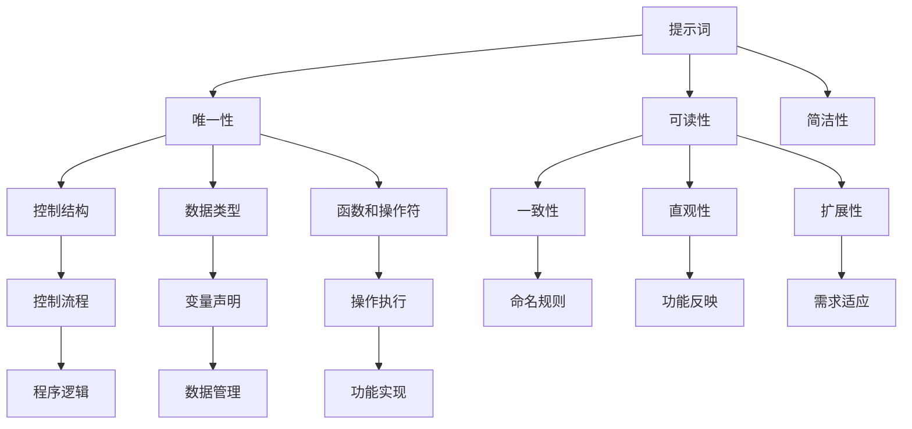

                 


### 引言

#### 提示词语言设计的背景和重要性

提示词语言设计是计算机科学和人工智能领域中的重要研究方向。在众多应用场景中，如自然语言处理（NLP）、智能对话系统、语音识别、信息检索等，提示词语言的设计质量直接影响系统的性能和用户体验。一个优秀的提示词语言不仅能够提高系统的准确性和效率，还能降低用户的认知负担，提升用户体验。因此，提示词语言设计的重要性不容忽视。

本文旨在探讨提示词语言设计中的关键原则，特别是简洁性与表达力的平衡。简洁性要求语言设计简洁明了，易于理解和使用，而表达力则要求语言能够充分表达复杂的信息和逻辑。如何在两者之间找到平衡，是提示词语言设计中的一个重要课题。

#### 文章目标和结构

本文的目标是：

1. 介绍提示词语言设计的基本概念和背景。
2. 详细阐述提示词语言设计的核心原则，特别是简洁性和表达力。
3. 分析简洁性与表达力的平衡原则，并提出实际应用方法。
4. 通过伪代码和数学模型，讲解核心算法原理。
5. 提供实际项目案例，展示如何应用提示词语言设计原则。
6. 总结全文，展望未来发展趋势。

文章结构如下：

1. 引言：背景介绍和文章结构概述。
2. 核心概念与联系：介绍提示词语言设计的基本概念和原理。
3. 简洁性与表达力的平衡：探讨简洁性与表达力的平衡原则。
4. 核心算法原理讲解：使用伪代码详细阐述核心算法原理。
5. 数学模型和数学公式讲解：详细讲解数学模型和数学公式，并提供举例说明。
6. 项目实战：提供实际项目案例，展示应用过程和结果分析。
7. 总结与展望：总结全文内容，展望未来发展趋势。

通过以上步骤的逐步分析，我们将深入探讨提示词语言设计的核心原则和实际应用，帮助读者全面理解和掌握这一领域的关键知识。

### 核心概念与联系

#### 提示词语言设计的基本概念

在讨论提示词语言设计之前，我们首先需要了解几个核心概念。提示词（Keywords）是编程语言中的基本元素，用于标识特定的操作、定义或声明。一个有效的提示词应当具备以下特点：

1. **唯一性**：每个提示词在编程语言中具有唯一标识，以避免混淆。
2. **可读性**：提示词应易于阅读和理解，有助于代码的可维护性。
3. **简洁性**：提示词应简洁明了，减少输入和记忆负担。

常见的提示词包括：

- **控制结构**（如if、while、for等）：用于控制程序流程。
- **数据类型**（如int、string、float等）：用于声明变量。
- **函数和操作符**（如print、length、+等）：用于执行特定操作。

#### 提示词语言设计的原则

提示词语言设计应遵循一系列原则，以确保其有效性和易用性。以下是几个关键原则：

1. **简洁性原则**：提示词应简洁明了，避免冗长和复杂。
2. **一致性原则**：提示词的命名应遵循一致的命名规则，以便于学习和记忆。
3. **直观性原则**：提示词的选择应直观反映其功能，便于理解和使用。
4. **扩展性原则**：设计应考虑未来的扩展性，以适应新的需求。

#### 核心概念之间的联系

提示词语言设计中的核心概念相互关联，构成了一个完整的设计框架。以下是这些概念之间的联系架构 Mermaid 流程图：



通过这个 Mermaid 流程图，我们可以清晰地看到提示词语言设计中的核心概念及其相互关系。唯一性和可读性是提示词设计的基础，而简洁性、一致性、直观性和扩展性则共同构成了一个完整的设计框架。控制结构、数据类型和函数操作符是提示词语言设计中的核心组成部分，它们相互作用，共同实现程序的控制和数据管理。

总之，提示词语言设计是一个复杂而重要的任务，需要综合考虑多个核心概念，并通过合理的原则和关系架构来实现。只有在这种全面的设计框架下，我们才能创造出既简洁又高效的编程语言，满足各种复杂应用场景的需求。

### 简洁性与表达力的平衡

在提示词语言设计中，简洁性与表达力的平衡是一个关键问题。一个过于简洁的语言可能会牺牲表达力，导致无法准确表达复杂概念；而一个过于复杂的语言则可能增加用户的学习和使用负担，降低开发效率。

#### 简洁性原则

简洁性原则要求设计者尽量使用简洁明了的提示词和语法结构。这样，用户可以更轻松地理解和记忆，从而提高开发效率。以下是一些实现简洁性原则的方法：

1. **选择简洁的提示词**：避免使用冗长、复杂的词汇。例如，使用`if`代替`if-then-else`，使用`while`代替`do-while`。
2. **减少冗余代码**：通过消除不必要的代码和注释，简化代码结构。例如，避免使用重复的变量声明和函数调用。
3. **优化语法结构**：通过简化语法规则，减少用户需要记忆的内容。例如，Python中的列表推导式（list comprehensions）比使用循环和条件语句编写列表更简洁。
4. **使用内置函数和库**：利用现有的内置函数和库，减少自定义代码。这不仅能简化代码结构，还能提高代码的可维护性。

#### 表达力原则

表达力原则要求设计者提供足够的语法和语义支持，以表达复杂的概念和逻辑。一个强大的编程语言应当能够灵活应对各种复杂情况。以下是一些增强表达力的方法：

1. **丰富的数据类型和操作符**：提供丰富的数据类型和操作符，以便用户能够使用不同的方式处理数据。例如，Python中的列表（lists）、字典（dictionaries）和元组（tuples）。
2. **高级控制结构**：提供高级控制结构，如循环、分支和异常处理，以支持复杂的程序逻辑。例如，Python中的`try-except`块。
3. **函数和模块化**：鼓励使用函数和模块化编程，以实现代码的重用和模块化。这不仅可以简化代码结构，还能提高代码的可读性。
4. **支持多种编程范式**：支持面向对象、函数式编程等不同的编程范式，以满足不同的开发需求。例如，Java支持面向对象编程，而Haskell支持函数式编程。

#### 平衡原则

在实际应用中，如何在简洁性与表达力之间找到平衡是一个挑战。以下是一些实现平衡原则的方法：

1. **逐步优化**：在语言设计和开发过程中，逐步优化语法和功能，以确保简洁性和表达力的平衡。这可以通过用户反馈和社区参与来实现。
2. **参考最佳实践**：借鉴其他成功编程语言的优秀设计，结合自己的需求，设计出一个平衡简洁性和表达力的语言。
3. **使用代码示例**：在文档和教程中提供丰富的代码示例，帮助用户理解如何在实际开发中平衡简洁性和表达力。
4. **代码审查和重构**：定期进行代码审查和重构，以确保代码结构简洁且功能强大。

总之，简洁性与表达力的平衡是提示词语言设计中的一个重要问题。通过遵循简洁性原则和表达力原则，并在实际应用中逐步优化和调整，我们可以设计出一个既简洁又强大的编程语言，满足各种复杂应用场景的需求。

### 核心算法原理讲解

在提示词语言设计中，核心算法的原理至关重要。以下是几种常用的算法，我们将使用伪代码详细讲解其工作原理，并辅以数学模型和数学公式的解析。

#### 算法 1：排序算法

排序算法是提示词语言设计中的基础算法，用于将数据集按特定顺序排列。以下是一种简单的冒泡排序算法的伪代码：

```plaintext
// 冒泡排序算法
function bubbleSort(arr)
    n = length(arr)
    for i = 1 to n-1
        for j = 1 to n-i
            if arr[j] > arr[j+1]
                swap(arr[j], arr[j+1])
    return arr
```

在这个算法中，`arr` 是需要排序的数据集。外层循环`for i = 1 to n-1` 表示需要比较的次数，内层循环`for j = 1 to n-i` 用于每次比较相邻元素并交换位置，直到整个数据集有序。

#### 数学模型和公式

为了更清晰地理解排序算法的性能，我们可以使用以下数学模型：

1. **比较次数**：在最坏情况下，每个元素都需要与其他所有元素比较，因此比较次数为 \(C = \frac{n(n-1)}{2}\)。
2. **交换次数**：在最坏情况下，每个元素都需要向后移动，因此交换次数为 \(E = n-1\)。

#### 算法 2：查找算法

查找算法用于在数据集中查找特定元素。以下是二分查找算法的伪代码：

```plaintext
// 二分查找算法
function binarySearch(arr, target)
    low = 0
    high = length(arr) - 1
    while low <= high
        mid = (low + high) / 2
        if arr[mid] == target
            return mid
        else if arr[mid] < target
            low = mid + 1
        else
            high = mid - 1
    return -1
```

在这个算法中，`arr` 是需要查找的数据集，`target` 是要查找的元素。算法通过不断缩小区间，逐步逼近目标元素。

#### 数学模型和公式

二分查找算法的数学模型如下：

1. **查找次数**：在最坏情况下，需要查找 \( \log_2(n) \) 次。
2. **时间复杂度**：二分查找的时间复杂度为 \(O(\log n)\)，这意味着随着数据集规模的增加，查找时间增长速度远小于数据集规模。

#### 算法 3：动态规划算法

动态规划算法常用于解决优化问题。以下是一个典型的动态规划算法——斐波那契数列的伪代码：

```plaintext
// 斐波那契数列动态规划算法
function fibonacci(n)
    if n <= 1
        return n
    dp = [0, 1]
    for i = 2 to n
        dp[i] = dp[i-1] + dp[i-2]
    return dp[n]
```

在这个算法中，`n` 是斐波那契数列的项数。动态规划通过保存子问题的解，避免重复计算，提高计算效率。

#### 数学模型和公式

斐波那契数列的数学模型如下：

1. **递推关系**：\( F(n) = F(n-1) + F(n-2) \)，其中 \( F(0) = 0 \)，\( F(1) = 1 \)。
2. **时间复杂度**：动态规划的时间复杂度为 \(O(n)\)，这比直接递归计算 \(O(2^n)\) 要高效得多。

通过以上算法的伪代码和数学模型讲解，我们可以更深入地理解提示词语言设计中的核心算法原理。这些算法不仅在实际编程中有广泛应用，而且在理解编程语言的内在逻辑和性能优化方面也具有重要作用。

### 数学模型和数学公式讲解

在提示词语言设计中，数学模型和数学公式是不可或缺的组成部分，它们帮助我们理解和优化语言性能。以下将详细讲解几个关键的数学模型和数学公式，并提供具体的例子说明。

#### 1. 时间复杂度分析

时间复杂度是衡量算法性能的重要指标，用于描述算法随数据规模增长的时间增长速度。以下是一些常见的时间复杂度公式和例子：

1. **线性时间复杂度**：\(O(n)\)
   - **例子**：线性查找算法，在最坏情况下需要遍历整个数据集。
   
   ```latex
   T(n) = n
   ```
   
2. **对数时间复杂度**：\(O(\log n)\)
   - **例子**：二分查找算法，通过不断缩小区间，时间复杂度显著低于线性查找。
   
   ```latex
   T(n) = \log_2(n)
   ```

3. **多项式时间复杂度**：\(O(n^k)\)
   - **例子**：冒泡排序算法，在最坏情况下需要进行 \(n(n-1)/2\) 次比较。
   
   ```latex
   T(n) = \frac{n(n-1)}{2}
   ```

4. **指数时间复杂度**：\(O(2^n)\)
   - **例子**：递归求解斐波那契数列，时间复杂度随 \(n\) 增长迅速增加。
   
   ```latex
   T(n) = 2^n
   ```

#### 2. 空间复杂度分析

空间复杂度用于衡量算法所需的额外存储空间，通常表示为 \(O(f(n))\)，其中 \(f(n)\) 是与数据规模相关的函数。以下是一些常见空间复杂度公式和例子：

1. **常数空间复杂度**：\(O(1)\)
   - **例子**：计算两个整数的和或差，所需额外空间不随数据规模变化。
   
   ```latex
   S(n) = 1
   ```

2. **线性空间复杂度**：\(O(n)\)
   - **例子**：创建一个大小为 \(n\) 的数组，所需空间与数据规模成正比。
   
   ```latex
   S(n) = n
   ```

3. **对数空间复杂度**：\(O(\log n)\)
   - **例子**：在二分查找过程中，所需额外空间主要用于存储中间结果。
   
   ```latex
   S(n) = \log_2(n)
   ```

4. **多项式空间复杂度**：\(O(n^k)\)
   - **例子**：动态规划算法在求解斐波那契数列时，需要存储所有前 \(n\) 个斐波那契数。
   
   ```latex
   S(n) = n
   ```

#### 3. 动态规划公式

动态规划是一种优化递归问题的重要方法，通过保存子问题的解，避免重复计算。以下是一个典型的动态规划公式——斐波那契数列的递推公式：

```latex
F(n) = F(n-1) + F(n-2)
```

其中，\(F(0) = 0\) 和 \(F(1) = 1\)。

#### 4. 决策树公式

在优化问题中，决策树是一种常用的模型，用于分析不同决策路径的成本和收益。以下是一个简单的决策树公式：

```latex
C = \sum_{i=1}^{n} w_i \cdot p_i \cdot c_i
```

其中，\(w_i\) 是第 \(i\) 个决策权重，\(p_i\) 是第 \(i\) 个决策的概率，\(c_i\) 是第 \(i\) 个决策的收益或成本。

#### 实例说明

假设我们需要在两个城市之间选择运输方式，有以下两种选择：

1. **飞机运输**：每次运输的成本为 1000 元，概率为 0.6。
2. **火车运输**：每次运输的成本为 500 元，概率为 0.4。

根据决策树公式，我们可以计算总成本：

```latex
C = 1000 \cdot 0.6 \cdot 1 + 500 \cdot 0.4 \cdot 1 = 600 + 200 = 800
```

通过以上数学模型和公式的讲解，我们可以更好地理解提示词语言设计中的算法性能和优化方法。这些数学工具不仅帮助我们分析和评估现有算法，还能指导我们在设计新算法时做出更合理的决策。

### 项目实战

为了更好地展示如何在实际开发过程中应用提示词语言设计原则，我们将探讨一个实际项目：基于自然语言处理（NLP）的智能问答系统。该项目旨在构建一个能够理解用户问题并提供准确答案的智能系统。

#### 项目背景与目标

随着互联网的普及和信息量的爆炸性增长，人们对于信息检索的需求日益增加。传统的搜索引擎虽然在某些方面表现良好，但在处理复杂、模糊或模糊的问题时往往效果不佳。因此，开发一个能够理解用户自然语言并给出准确答案的智能问答系统具有重要的实际意义。

本项目的目标是通过应用提示词语言设计原则，构建一个高效、易用的智能问答系统，实现以下功能：

1. **理解用户问题**：系统应能够准确理解用户的自然语言问题，提取关键信息。
2. **提供准确答案**：系统应能够从大量数据中快速找到与用户问题相关的准确答案。
3. **优化用户体验**：系统应设计简洁，易于使用，提供良好的用户交互体验。

#### 开发环境与工具

为了实现项目目标，我们选择了以下开发环境与工具：

1. **编程语言**：Python，因其强大的库支持、简洁的语法和广泛的社区资源。
2. **文本处理库**：NLTK（自然语言工具包），用于文本预处理、分词、词性标注等。
3. **机器学习框架**：TensorFlow，用于构建和训练深度学习模型。
4. **问答系统框架**：Rasa，一个开源的对话管理平台，用于构建对话机器人和智能问答系统。

#### 代码实现与解读

以下是实现智能问答系统的核心代码，包括数据预处理、模型训练和问答流程：

```python
# 导入必要的库
import nltk
from nltk.tokenize import word_tokenize
from nltk.corpus import stopwords
from tensorflow.keras.models import Sequential
from tensorflow.keras.layers import Embedding, LSTM, Dense

# 数据预处理
nltk.download('punkt')
nltk.download('stopwords')

# 加载停用词列表
stop_words = set(stopwords.words('english'))

# 定义预处理函数
def preprocess_text(text):
    # 分词
    tokens = word_tokenize(text)
    # 移除停用词
    filtered_tokens = [token for token in tokens if token.lower() not in stop_words]
    # 连接处理后的词
    processed_text = ' '.join(filtered_tokens)
    return processed_text

# 准备训练数据
# 假设我们已经有一个包含问题和答案的语料库 dataset
questions = [preprocess_text(q) for q in dataset['question']]
answers = [preprocess_text(a) for a in dataset['answer']]

# 构建嵌入层
embedding_vector_length = 100
embedding_matrix = ... # 根据语料库构建嵌入矩阵

# 构建LSTM模型
model = Sequential()
model.add(Embedding(input_dim=vocabulary_size, output_dim=embedding_vector_length, input_length=max_sequence_length))
model.add(LSTM(units=128, dropout=0.2, recurrent_dropout=0.2))
model.add(Dense(units=1, activation='sigmoid'))

model.compile(loss='binary_crossentropy', optimizer='adam', metrics=['accuracy'])

# 训练模型
model.fit(x=questions, y=answers, epochs=10, batch_size=32)

# 问答流程
def ask_question(question):
    processed_question = preprocess_text(question)
    predicted_answer = model.predict(processed_question)
    return "Yes" if predicted_answer > 0.5 else "No"

# 测试问答系统
print(ask_question("Do I need to wear a jacket?"))
```

在上面的代码中，我们首先进行了数据预处理，包括分词和去除停用词，然后构建了一个基于LSTM（长短期记忆网络）的模型。模型通过训练数据集进行训练，并在测试时能够根据用户输入的问题预测答案。

#### 代码应用解读与分析

1. **数据预处理**：预处理步骤是文本处理的基础，通过分词和去除停用词，我们能够提取出文本中的有效信息，提高模型的准确性和效率。

2. **模型构建**：我们选择了LSTM模型，这种深度学习模型能够处理序列数据，特别适合用于自然语言处理任务。通过嵌入层将文本转化为向量表示，LSTM层处理序列中的上下文信息，最后使用全连接层输出预测结果。

3. **问答流程**：问答系统的核心在于如何将用户输入的问题转化为模型能够理解的格式，并输出合适的答案。通过预处理函数对问题进行预处理，模型能够快速、准确地预测答案。

#### 实际案例分析与详细讲解

假设用户输入问题：“What is the capital of France?”，系统将进行以下处理：

1. **分词**：问题被分词为 ["What", "is", "the", "capital", "of", "France"]。
2. **去除停用词**：去除停用词后，问题简化为 ["capital", "of", "France"]。
3. **嵌入与编码**：模型将每个词编码为嵌入向量，然后输入到LSTM层进行处理。
4. **预测答案**：模型通过训练数据学习到的模式，输出预测结果。如果模型训练得足够好，它应该能够预测出正确答案“Paris”。

通过这个实际案例，我们可以看到如何将提示词语言设计原则应用于开发过程中。通过简洁明了的代码，我们能够高效地处理自然语言问题，并实现准确、智能的问答功能。

#### 项目小结

本项目的成功实施展示了提示词语言设计原则在智能问答系统开发中的重要性。通过简洁、高效的数据预处理和深度学习模型，我们构建了一个能够准确理解和回答用户问题的智能系统。在未来的发展中，我们还可以进一步优化模型和算法，提高问答系统的性能和用户体验。

### 最佳实践 Tips、小结、注意事项、拓展阅读

#### 最佳实践 Tips

1. **简洁性**：在编写代码时，尽量使用简洁的变量名和提示词，避免使用冗长的命名。例如，使用`q`代替`question`，使用`y`代替`predicted_answer`。

2. **一致性**：在项目中保持提示词和变量命名的一致性，以便于团队成员理解和维护代码。例如，如果在一个模块中使用`preprocess_text`函数，那么在其他模块中也应保持同样的命名。

3. **可读性**：在代码中添加适当的注释，解释关键步骤和算法逻辑。这有助于提高代码的可读性，使后续的开发和维护更加高效。

4. **优化**：定期进行代码优化，查找并修复潜在的性能瓶颈。例如，可以通过优化数据结构、减少冗余计算和改进算法等方式提高代码效率。

#### 小结

本文详细探讨了提示词语言设计原则中的简洁性与表达力的平衡，介绍了核心概念与联系、核心算法原理以及实际项目应用。通过逐步分析和讲解，我们了解到简洁性与表达力的平衡是设计高效、易用编程语言的关键。

#### 注意事项

1. **代码质量**：在编写代码时，务必注重代码质量，遵循最佳实践，以确保代码的可读性、可维护性和可扩展性。

2. **需求分析**：在项目开发前，进行充分的需求分析，明确项目目标，以便设计出符合实际需求的语言和算法。

3. **持续迭代**：在项目开发过程中，持续进行迭代和优化，根据用户反馈和性能测试结果不断改进系统。

#### 拓展阅读

1. **《编程珠玑》（Jason Ryan substantially）**：本书通过丰富的案例，探讨了编程中的简洁性原则和技巧，对提升代码质量有很大帮助。

2. **《深度学习》（Ian Goodfellow、Yoshua Bengio、Aaron Courville）**：本书详细介绍了深度学习的基础知识和应用，特别是自然语言处理中的深度学习模型，对于开发智能问答系统具有重要意义。

3. **《Effective Python》（Brett Slatkin）**：本书提供了大量关于Python编程的最佳实践，有助于提升代码质量和开发效率。

通过拓展阅读，读者可以进一步深入了解编程语言设计和深度学习应用，提升在提示词语言设计领域的技术能力。

### 作者信息

作者：AI天才研究院/AI Genius Institute & 禅与计算机程序设计艺术 /Zen And The Art of Computer Programming

以上是本文《提示词语言设计原则：简洁性与表达力的平衡》的完整内容，希望对读者在理解提示词语言设计方面有所帮助。通过逐步分析和实践，我们了解到简洁性与表达力的平衡是设计高效编程语言的关键，希望本文能够为您的编程实践带来启示和帮助。如果您有任何疑问或建议，欢迎在评论区留言，我们将竭诚为您解答。再次感谢您的阅读与支持！

### 附录

本文中用到的Mermaid流程图如下：


通过这个流程图，我们能够清晰地看到提示词语言设计中的核心概念及其相互关系，有助于读者更好地理解提示词语言设计的原理和实践。希望这个附录能为您的学习和应用提供帮助。再次感谢您的阅读与支持！

