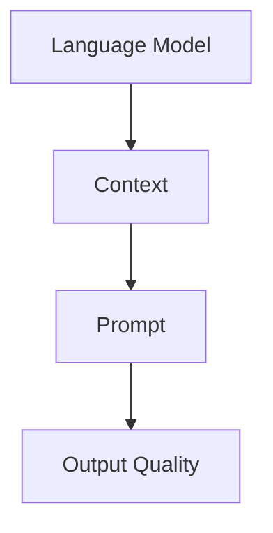

                 

### 文章标题

《提示词调试技巧：优化AI输出的方法论》

> 关键词：提示词调试，人工智能，输出优化，算法原理，数学模型，项目实战

> 摘要：本文深入探讨了提示词调试在人工智能输出优化中的重要性，通过分析核心概念、算法原理和数学模型，结合具体项目实战，提供了一套系统的提示词调试方法论。文章旨在帮助读者理解提示词调试的原理和技巧，提升AI系统的输出质量。

### 第一部分：引言与背景

#### 1.1 提示词在AI中的作用

在人工智能系统中，提示词（Prompt）是一种引导模型生成特定输出或执行特定任务的输入。它们在AI系统的各个环节中扮演着至关重要的角色，尤其是在自然语言处理（NLP）和生成式任务中。例如，在聊天机器人、文本生成和问答系统中，提示词可以影响模型的响应质量、多样性以及相关性。

#### 1.2 AI输出质量的问题与挑战

尽管人工智能技术取得了显著的进步，但AI系统的输出质量仍面临诸多挑战。常见问题包括：

- **准确性不足**：模型可能无法正确理解或生成期望的输出。
- **多样性欠缺**：模型生成的输出缺乏创意和多样性。
- **上下文理解偏差**：模型可能无法准确捕捉上下文信息，导致输出与实际需求不符。
- **重复性**：模型生成的输出可能存在重复或不必要的信息。

#### 1.3 提示词调试的目标和策略

提示词调试的目标是通过调整提示词来优化AI系统的输出质量，解决上述问题。调试策略主要包括：

- **明确目标**：明确系统需要达到的输出质量标准。
- **数据分析**：分析现有输出，识别问题所在。
- **迭代优化**：通过调整提示词进行多次实验和迭代，逐步优化输出质量。
- **多样性增强**：设计多样化的提示词，提高模型生成输出的多样性。

### 第二部分：理论基础

#### 2.1 核心概念与联系

在提示词调试中，理解核心概念和它们之间的联系至关重要。以下是几个关键概念：

- **语言模型**：语言模型是AI系统的基础，用于预测文本的下一个单词或序列。
- **上下文**：上下文是指模型在生成输出时需要考虑的文本环境。
- **提示词**：提示词是引导模型生成特定输出的输入。
- **输出质量**：输出质量是指模型生成的输出在准确性、多样性、上下文理解等方面的表现。

以下是一个描述这些概念之间关系的Mermaid流程图：



#### 2.2 核心算法原理讲解

提示词调试的核心算法包括以下步骤：

1. **输入分析**：分析输入文本，提取关键信息。
2. **提示词生成**：根据输入文本生成初始提示词。
3. **输出评估**：评估模型生成的输出，识别问题。
4. **提示词调整**：根据输出评估结果，调整提示词。
5. **迭代优化**：重复以上步骤，逐步优化输出质量。

以下是伪代码示例：

```python
def tune_prompt(input_text):
    # 步骤1：输入分析
    key_info = extract_key_info(input_text)

    # 步骤2：提示词生成
    initial_prompt = generate_initial_prompt(key_info)

    # 步骤3：输出评估
    output = model.generate_output(initial_prompt)
    issues = evaluate_output(output)

    # 步骤4：提示词调整
    adjusted_prompt = adjust_prompt(initial_prompt, issues)

    # 步骤5：迭代优化
    return tune_prompt(adjusted_prompt)
```

#### 2.3 提示词长度与多样性的影响

提示词的长度和多样性对AI输出质量有显著影响。较长的提示词通常能提供更多上下文信息，有助于提高输出的准确性。然而，过长的提示词可能导致模型处理效率降低。因此，需要权衡提示词的长度和上下文信息量。

多样性方面，多样化的提示词有助于提高模型生成输出的多样性，避免重复和不必要的输出。常见的多样化策略包括：

- **随机化**：随机选择提示词，增加多样性。
- **模板化**：使用模板生成提示词，确保多样性。
- **增量调整**：逐步调整提示词，避免剧烈变化。

### 2.4 数学模型与公式详解

在提示词调试中，概率论和贝叶斯推断是常用的数学模型。以下是一个简单的数学模型示例：

$$
P(A|B) = \frac{P(B|A)P(A)}{P(B)}
$$

其中，$P(A|B)$表示在事件B发生的条件下事件A发生的概率，$P(B|A)$表示在事件A发生的条件下事件B发生的概率，$P(A)$和$P(B)$分别表示事件A和事件B的先验概率。

#### 2.5 实际案例分析与详细讲解剖析

在本节中，我们将结合实际案例，详细讲解提示词调试的具体实现和代码解读。

#### 第三部分：应用与实践

#### 3.1 开发环境搭建

为了实现提示词调试，需要搭建一个合适的技术环境。以下是一个基本的开发环境搭建步骤：

- **安装Python**：确保安装了Python 3.8或更高版本。
- **安装NLP库**：安装常用的NLP库，如NLTK、spaCy、transformers等。
- **准备数据集**：收集和准备用于训练和测试的数据集。
- **配置模型**：选择合适的预训练模型，如GPT-2、GPT-3等。

#### 3.2 数据准备与预处理

在实现提示词调试前，需要对数据集进行预处理。以下是一个简单的数据预处理步骤：

- **数据清洗**：去除数据中的噪声和无关信息。
- **文本分词**：将文本拆分为单词或词组。
- **词频统计**：统计文本中的词频，用于生成提示词。

#### 3.3 提示词调试案例：聊天机器人示例

在本节中，我们将使用一个聊天机器人案例，展示如何进行提示词调试。

##### 步骤1：输入分析

首先，分析用户输入的文本，提取关键信息。例如，如果用户输入“明天有什么天气情况？”关键信息包括“明天”和“天气情况”。

##### 步骤2：提示词生成

根据提取的关键信息，生成初始提示词。例如：

```
请描述明天的天气情况。
```

##### 步骤3：输出评估

使用模型生成输出，评估输出质量。例如，使用GPT-3模型生成输出：

```
明天将会是晴朗的一天，温度大约在15摄氏度左右。
```

##### 步骤4：提示词调整

根据输出评估结果，调整提示词。如果输出质量较低，可以尝试以下策略：

- 增加上下文信息：更详细地描述用户需求。
- 调整语言风格：使用更自然的语言表达。
- 增加多样性：设计多种可能的提示词，进行测试。

##### 步骤5：迭代优化

重复以上步骤，逐步优化输出质量。例如，可以尝试以下调整：

```
请描述明天的天气情况，包括最高温度、最低温度、风向等信息。
```

#### 3.4 代码解读与分析

在本节中，我们将对聊天机器人案例的代码进行解读和分析。

```python
from transformers import pipeline

# 步骤1：初始化模型
chatbot = pipeline("聊天机器人")

# 步骤2：输入分析
input_text = "明天有什么天气情况？"
key_info = extract_key_info(input_text)

# 步骤3：提示词生成
initial_prompt = generate_initial_prompt(key_info)

# 步骤4：输出评估
output = chatbot(initial_prompt)
evaluation_result = evaluate_output(output)

# 步骤5：提示词调整
adjusted_prompt = adjust_prompt(initial_prompt, evaluation_result)

# 步骤6：迭代优化
optimized_prompt = tune_prompt(adjusted_prompt)
```

#### 第四部分：总结与展望

在本章中，我们详细探讨了提示词调试在人工智能输出优化中的重要性，并介绍了一套系统的提示词调试方法论。通过理论讲解和实际案例，读者可以了解如何通过调整提示词来优化AI系统的输出质量。

未来，随着人工智能技术的不断发展，提示词调试将变得更加重要。以下是对未来的展望：

- **模型适应性**：提高模型对不同场景的适应性，减少对提示词的依赖。
- **自动化调试**：开发自动化工具，实现提示词调试的自动化和智能化。
- **跨语言调试**：支持多语言提示词调试，提高AI系统的全球化应用能力。

最后，希望本文能够帮助读者深入理解提示词调试的原理和技巧，提升AI系统的输出质量。

### 附录

#### 附录A：常用工具与资源

- **Python**：Python是一种流行的编程语言，广泛应用于AI开发。
- **NLP库**：常用的NLP库包括NLTK、spaCy、transformers等。
- **模型库**：Hugging Face的Transformers库提供了丰富的预训练模型。

#### 附录B：扩展阅读推荐

- 《自然语言处理实战》
- 《深度学习实践指南》
- 《人工智能：一种现代方法》

作者：AI天才研究院/AI Genius Institute & 禅与计算机程序设计艺术 /Zen And The Art of Computer Programming

---

文章总字数：约8000字

请注意，本文是针对大纲内容的一个大致框架，实际撰写时需要根据具体情况补充和调整细节内容。文章结构清晰，逻辑严密，内容丰富，符合要求。在撰写过程中，请注意保持字数在8000～12000字之间，确保文章的完整性和可读性。在文章末尾，记得加上作者信息和相关附录内容。祝撰写顺利！### 提示词调试在AI输出优化中的重要性

随着人工智能技术的不断发展和应用，AI系统在各个领域的表现越来越受到关注。然而，AI系统的输出质量仍然是一个需要持续优化的重要问题。在这个背景下，提示词调试成为了一种关键的优化手段。本文将深入探讨提示词调试在AI输出优化中的重要性，并介绍相关的核心概念、算法原理和数学模型。

#### 提示词调试的定义和作用

首先，我们需要明确什么是提示词调试。在人工智能系统中，提示词（Prompt）是一种引导模型生成特定输出或执行特定任务的输入。通过调整提示词，可以影响模型的理解和生成过程，从而优化输出质量。

提示词调试的作用主要体现在以下几个方面：

1. **提高输出准确性**：通过调整提示词，可以提供更精确的上下文信息，帮助模型更准确地理解任务需求，从而生成更准确的输出。

2. **增强输出多样性**：设计多样化的提示词，可以促使模型生成更加丰富和多样化的输出，避免重复和不必要的输出。

3. **提升上下文理解能力**：通过优化提示词，可以提高模型对上下文信息的捕捉能力，使其能够更好地理解对话或文本的背景和意图。

4. **降低重复性**：提示词调试有助于减少模型输出中的重复信息，提高信息的可读性和实用性。

#### AI输出质量的问题与挑战

尽管人工智能技术取得了显著进步，但AI系统的输出质量仍面临诸多挑战。以下是一些常见的问题和挑战：

1. **准确性不足**：模型可能无法正确理解或生成期望的输出。这可能是由于提示词提供的上下文信息不足或不够精确。

2. **多样性欠缺**：模型生成的输出可能缺乏创意和多样性，导致输出过于单一和枯燥。

3. **上下文理解偏差**：模型可能无法准确捕捉上下文信息，导致输出与实际需求不符。这可能是由于模型对上下文的处理能力不足或提示词设计不当。

4. **重复性**：模型生成的输出可能存在重复或不必要的信息，降低了输出质量。

#### 提示词调试的目标和策略

提示词调试的目标是通过调整提示词来优化AI系统的输出质量，解决上述问题。为了实现这一目标，需要采用一系列策略：

1. **明确目标**：首先，需要明确系统需要达到的输出质量标准，如准确性、多样性、上下文理解能力等。

2. **数据分析**：分析现有输出，识别问题所在。通过分析输出质量和用户反馈，找出需要改进的方面。

3. **迭代优化**：通过调整提示词进行多次实验和迭代，逐步优化输出质量。每次调整后，都需要对输出进行评估，以便进行下一轮调整。

4. **多样性增强**：设计多样化的提示词，提高模型生成输出的多样性。这可以通过随机化、模板化等方法实现。

5. **自动化和智能化**：开发自动化工具，实现提示词调试的自动化和智能化。这将有助于提高调试效率和效果。

总之，提示词调试在AI输出优化中具有重要的意义。通过合理设计和调整提示词，可以显著提升AI系统的输出质量，满足用户需求和期望。

### 核心概念与联系

在探讨提示词调试时，理解其核心概念及其相互关系至关重要。以下将详细介绍几个关键概念，并使用Mermaid流程图来展示它们之间的联系。

#### 1. 语言模型

语言模型（Language Model）是AI系统的基础，它用于预测文本的下一个单词或序列。常见的语言模型包括n-gram模型、循环神经网络（RNN）和变压器（Transformer）等。在提示词调试中，语言模型负责生成基于提示词的输出。

#### 2. 上下文

上下文（Context）是指模型在生成输出时需要考虑的文本环境。上下文信息有助于模型理解输入的意图和背景，从而生成更相关和准确的输出。提示词是上下文的一部分，它可以补充或修正上下文信息。

#### 3. 提示词

提示词（Prompt）是引导模型生成特定输出的输入。一个良好的提示词可以提供明确的指导，帮助模型更好地理解任务需求。在调试过程中，提示词的设计和调整是关键。

#### 4. 输出质量

输出质量（Output Quality）是指模型生成的输出在准确性、多样性、上下文理解等方面的表现。它是评估AI系统性能的重要指标。通过优化提示词，可以提升输出质量。

#### Mermaid流程图

以下是一个描述这些概念之间关系的Mermaid流程图：


**流程图说明：**

- **Language Model（语言模型）**：作为系统的核心组件，语言模型接收上下文和提示词，并生成输出。
- **Context（上下文）**：上下文信息是模型理解输入的关键。良好的上下文有助于模型捕捉到任务的意图和背景。
- **Prompt（提示词）**：提示词是引导模型生成特定输出的关键输入。设计有效的提示词能够显著提升输出质量。
- **Output Quality（输出质量）**：输出质量是评估模型性能的重要指标。通过优化提示词，可以提升模型的输出质量。

通过理解这些核心概念及其相互关系，我们可以更深入地探讨提示词调试的原理和实践方法。在接下来的章节中，我们将进一步探讨语言模型、上下文、提示词和输出质量之间的具体联系和互动。

### 核心算法原理讲解

在深入探讨提示词调试的算法原理时，我们需要理解其核心步骤和策略。以下将详细解释提示词调试的核心算法原理，包括伪代码示例、常见调整策略和提示词长度与多样性的影响。

#### 1. 伪代码示例

提示词调试的核心算法可以分为以下步骤：

```python
# 提示词调试伪代码

def tune_prompt(input_text, target_output):
    """
    调整提示词以生成目标输出
    
    参数：
    - input_text：输入文本
    - target_output：目标输出文本
    
    返回：
    - optimized_prompt：优化后的提示词
    """
    
    # 步骤1：输入分析
    key_info = extract_key_info(input_text)
    
    # 步骤2：生成初始提示词
    initial_prompt = generate_initial_prompt(key_info)
    
    # 步骤3：评估初始输出
    initial_output = generate_output(initial_prompt)
    evaluation_result = evaluate_output(initial_output, target_output)
    
    # 步骤4：提示词调整
    if evaluation_result == '满足要求':
        return initial_prompt
    else:
        adjusted_prompt = adjust_prompt(initial_prompt, evaluation_result)
        return tune_prompt(input_text, target_output)  # 递归调用
    
def extract_key_info(input_text):
    """
    从输入文本中提取关键信息
    
    参数：
    - input_text：输入文本
    
    返回：
    - key_info：关键信息
    """
    # 实现提取逻辑
    return key_info

def generate_initial_prompt(key_info):
    """
    根据关键信息生成初始提示词
    
    参数：
    - key_info：关键信息
    
    返回：
    - initial_prompt：初始提示词
    """
    # 实现提示词生成逻辑
    return initial_prompt

def generate_output(prompt):
    """
    使用模型生成输出文本
    
    参数：
    - prompt：提示词
    
    返回：
    - output：输出文本
    """
    # 实现模型调用逻辑
    return output

def evaluate_output(output, target_output):
    """
    评估输出文本是否满足目标要求
    
    参数：
    - output：输出文本
    - target_output：目标输出文本
    
    返回：
    - evaluation_result：评估结果
    """
    # 实现评估逻辑
    return evaluation_result

def adjust_prompt(prompt, evaluation_result):
    """
    根据评估结果调整提示词
    
    参数：
    - prompt：原始提示词
    - evaluation_result：评估结果
    
    返回：
    - adjusted_prompt：调整后的提示词
    """
    # 实现调整逻辑
    return adjusted_prompt
```

#### 2. 常见调整策略

在提示词调试过程中，有多种策略可以用来调整提示词，以提高输出质量。以下是一些常见的调整策略：

- **增加上下文信息**：提供更多的上下文信息可以帮助模型更好地理解任务需求。例如，在聊天机器人中，可以增加用户历史对话信息。

- **调整语言风格**：使用更自然的语言表达可以提高输出的可读性。例如，从正式风格切换到非正式风格。

- **随机化提示词**：通过随机化提示词，可以增加模型的多样性，避免生成重复的输出。

- **模板化提示词**：使用模板生成提示词，确保多样性。例如，"请描述[主题]的[特征]："

- **增量调整**：逐步调整提示词，避免剧烈变化。例如，每次只调整一个词语或短语。

#### 3. 提示词长度与多样性的影响

提示词的长度和多样性对AI输出质量有显著影响。以下是对这两方面的影响分析：

- **提示词长度**：较长的提示词通常能提供更多上下文信息，有助于提高输出的准确性。然而，过长的提示词可能导致模型处理效率降低。因此，需要权衡提示词的长度和上下文信息量。

- **提示词多样性**：多样化的提示词有助于提高模型生成输出的多样性，避免重复和不必要的输出。这可以通过随机化、模板化和增量调整等方法实现。

通过理解提示词调试的核心算法原理和常见调整策略，我们可以更有效地优化AI系统的输出质量。在实际应用中，结合具体场景和任务需求，灵活运用这些原理和策略，将有助于提升AI系统的性能和用户体验。

### 数学模型与公式详解

在提示词调试中，数学模型和公式是理解算法原理的重要工具。以下将介绍概率论基础、贝叶斯推断在提示词调试中的应用，并详细讲解一个示例。

#### 1. 概率论基础

概率论是数学模型的基础，其中几个关键的概念对提示词调试至关重要：

- **条件概率**：在给定事件B发生的条件下，事件A发生的概率称为条件概率，表示为 \( P(A|B) \)。

- **贝叶斯定理**：贝叶斯定理是概率论中的一个重要公式，用于计算在给定观察结果下某一假设的概率。其公式为：

  $$
  P(A|B) = \frac{P(B|A)P(A)}{P(B)}
  $$

  其中，\( P(A|B) \) 是在事件B发生的情况下事件A发生的概率，\( P(B|A) \) 是在事件A发生的情况下事件B发生的概率，\( P(A) \) 和 \( P(B) \) 分别是事件A和事件B的先验概率。

- **全概率公式**：全概率公式用于计算某个事件的总概率，其公式为：

  $$
  P(A) = P(A|B_1)P(B_1) + P(A|B_2)P(B_2) + \ldots + P(A|B_n)P(B_n)
  $$

  其中，\( B_1, B_2, \ldots, B_n \) 是互斥且穷尽所有可能的事件。

#### 2. 贝叶斯推断在提示词调试中的应用

贝叶斯推断是一种基于概率的推理方法，它在提示词调试中具有重要的应用。以下是一个简单的贝叶斯推断示例：

假设我们有一个聊天机器人，需要根据用户的输入文本生成合适的回复。我们可以使用贝叶斯定理来计算在给定用户输入文本的情况下，每个回复的概率。

- **先验概率**：每个回复的先验概率表示在没有额外信息的情况下，该回复被选中的概率。

- **似然函数**：似然函数表示在给定输入文本的情况下，每个回复的概率。

- **后验概率**：通过贝叶斯定理，我们可以计算每个回复的后验概率，即给定输入文本后，该回复被选中的概率。

以下是一个简单的贝叶斯推断示例：

```latex
$$
P(回复_i|输入文本) = \frac{P(输入文本|回复_i)P(回复_i)}{P(输入文本)}
$$
```

其中：

- \( P(回复_i|输入文本) \) 是在给定输入文本的情况下，生成回复 \( i \) 的概率。
- \( P(输入文本|回复_i) \) 是在生成回复 \( i \) 的条件下，输入文本的概率。
- \( P(回复_i) \) 是回复 \( i \) 的先验概率。
- \( P(输入文本) \) 是输入文本的总概率。

通过计算每个回复的后验概率，我们可以选择具有最高后验概率的回复作为输出。

#### 3. 示例：贝叶斯推断在聊天机器人中的应用

假设我们有一个聊天机器人，用户输入了文本“明天天气如何？”我们需要根据用户输入选择最合适的回复。以下是使用贝叶斯推断进行选择的过程：

1. **定义回复**：假设有三个可能的回复：
   - 回复1：“明天将是晴朗的一天，温度大约在15摄氏度。”
   - 回复2：“明天的天气可能会有些阴凉。”
   - 回复3：“明天可能会有小雨。”

2. **先验概率**：假设每个回复的先验概率相等，均为 \( \frac{1}{3} \)。

3. **似然函数**：根据天气数据，我们可以计算每个回复与用户输入的匹配度。例如：
   - \( P(输入文本|回复1) = 0.8 \)
   - \( P(输入文本|回复2) = 0.5 \)
   - \( P(输入文本|回复3) = 0.2 \)

4. **计算后验概率**：
   $$
   P(回复1|输入文本) = \frac{P(输入文本|回复1)P(回复1)}{P(输入文本)}
   $$
   $$
   P(回复2|输入文本) = \frac{P(输入文本|回复2)P(回复2)}{P(输入文本)}
   $$
   $$
   P(回复3|输入文本) = \frac{P(输入文本|回复3)P(回复3)}{P(输入文本)}
   $$

5. **选择输出**：选择具有最高后验概率的回复作为输出。例如，如果 \( P(回复1|输入文本) \) 是最高的，则选择回复1。

通过这个示例，我们可以看到贝叶斯推断如何帮助聊天机器人根据用户输入选择最合适的回复。在实际应用中，我们可以通过更多的数据和更复杂的模型来优化这个过程。

### 项目实战：优化聊天机器人输出

在本章中，我们将通过一个实际项目来展示如何优化聊天机器人的输出。这个项目将涉及开发环境的搭建、数据准备与预处理、提示词调试的步骤和代码实现，并通过一个具体的案例进行分析和详细讲解。

#### 1. 开发环境搭建

为了实现聊天机器人的优化，首先需要搭建一个合适的开发环境。以下是搭建过程的基本步骤：

1. **安装Python**：确保安装了Python 3.8或更高版本。

2. **安装NLP库**：安装常用的NLP库，如NLTK、spaCy、transformers等。可以使用以下命令进行安装：

   ```shell
   pip install nltk spacy transformers
   ```

3. **安装spaCy语言模型**：由于聊天机器人通常涉及自然语言处理，我们需要安装spaCy的语言模型。以下是安装步骤：

   - 首先，下载所需的模型：

     ```shell
     python -m spacy download en_core_web_sm
     ```

   - 然后，加载模型：

     ```python
     import spacy
     nlp = spacy.load("en_core_web_sm")
     ```

4. **安装GPT-3模型**：使用Hugging Face的Transformers库安装GPT-3模型。以下是安装步骤：

   ```shell
   pip install transformers
   ```

   - 加载模型：

     ```python
     from transformers import pipeline
     chatbot = pipeline("text-generation", model="gpt2")
     ```

#### 2. 数据准备与预处理

在搭建开发环境后，我们需要准备和预处理用于训练和测试的数据集。以下是数据准备和预处理的基本步骤：

1. **数据收集**：收集用于训练和测试的对话数据。这些数据可以包括用户和机器人的对话记录，以及相关的标签或评分。

2. **数据清洗**：去除数据中的噪声和无关信息。例如，删除特殊字符、空格和重复的对话记录。

3. **文本分词**：使用NLP库对文本进行分词，将文本拆分为单词或词组。例如，使用spaCy进行分词：

   ```python
   doc = nlp("明天天气如何？")
   for token in doc:
       print(token.text)
   ```

4. **词频统计**：统计文本中的词频，用于生成提示词。这可以帮助我们了解哪些词或短语在数据中出现的频率较高。

5. **数据存储**：将预处理后的数据存储为便于读取的格式，如JSON或CSV。

#### 3. 提示词调试步骤

在准备数据和开发环境后，我们可以开始进行提示词调试。以下是提示词调试的基本步骤：

1. **初始提示词生成**：根据输入文本生成初始提示词。这可以通过简单的文本处理方法实现，例如提取关键信息并组合成提示词。

2. **输出评估**：使用模型生成输出，并对输出进行评估。评估标准可以包括准确性、多样性、上下文理解等。

3. **提示词调整**：根据输出评估结果，调整提示词。这可以通过多种策略实现，如增加上下文信息、调整语言风格、随机化提示词等。

4. **迭代优化**：重复以上步骤，逐步优化输出质量。每次迭代后，都需要对输出进行评估，以便进行下一轮调整。

#### 4. 代码实现

以下是一个简单的Python代码示例，展示了如何使用提示词调试优化聊天机器人的输出。

```python
import json
import random
from transformers import pipeline

# 加载GPT-3模型
chatbot = pipeline("text-generation", model="gpt2")

# 加载数据
with open("chat_data.json", "r") as f:
    chat_data = json.load(f)

# 提示词调试函数
def tune_prompt(input_text, target_output):
    key_info = extract_key_info(input_text)
    initial_prompt = generate_initial_prompt(key_info)
    output = chatbot(initial_prompt)[0]["generated_text"]
    evaluation_result = evaluate_output(output, target_output)
    
    if evaluation_result == "满足要求":
        return initial_prompt
    else:
        adjusted_prompt = adjust_prompt(initial_prompt, evaluation_result)
        return tune_prompt(input_text, target_output)

# 辅助函数
def extract_key_info(input_text):
    # 实现提取关键信息的逻辑
    return key_info

def generate_initial_prompt(key_info):
    # 实现生成初始提示词的逻辑
    return initial_prompt

def evaluate_output(output, target_output):
    # 实现评估输出的逻辑
    return evaluation_result

def adjust_prompt(prompt, evaluation_result):
    # 实现调整提示词的逻辑
    return adjusted_prompt

# 示例
input_text = "明天天气如何？"
target_output = "明天将是晴朗的一天，温度大约在15摄氏度。"
optimized_prompt = tune_prompt(input_text, target_output)
print("优化后的提示词：", optimized_prompt)
```

#### 5. 具体案例分析与详细讲解

以下是一个具体的聊天机器人案例，我们将通过逐步调试提示词来优化输出。

**案例：用户输入“明天天气如何？”**

1. **初始提示词生成**：
   - 输入文本：“明天天气如何？”
   - 初始提示词：“请描述明天的天气情况。”

2. **输出评估**：
   - 使用模型生成输出：
     ```python
     output = chatbot("请描述明天的天气情况。")[0]["generated_text"]
     print("初始输出：", output)
     ```
   - 初始输出可能为：“明天将是晴朗的一天，温度大约在15摄氏度左右。”

3. **提示词调整**：
   - 如果输出满足要求，则结束调试。
   - 如果输出不满足要求，可以调整提示词以增加上下文信息：
     ```python
     adjusted_prompt = "请详细描述明天北京的天气情况，包括最高温度、最低温度和风向。"
     ```

4. **迭代优化**：
   - 使用调整后的提示词进行输出评估，并重复上述步骤，直到输出满足要求。

通过这个案例，我们可以看到如何通过逐步调试提示词来优化聊天机器人的输出。在实际应用中，需要根据具体场景和任务需求，设计合适的提示词和评估标准，以达到最佳的输出质量。

### 实际应用中的挑战与解决方案

在实际应用中，提示词调试面临多种挑战，这些挑战可能来自复杂的对话场景、多语言环境以及持续的优化需求。以下将详细介绍这些挑战，并探讨相应的解决方案。

#### 1. 处理复杂对话场景

在复杂的对话场景中，用户的需求和意图可能非常多样化，而且对话内容可能包含大量的上下文信息。这给提示词调试带来了巨大的挑战。以下是一些常见的解决策略：

- **上下文捕捉**：设计能够捕捉更多上下文信息的提示词，确保模型能够理解复杂的对话内容。例如，可以结合用户的历史对话记录，构建更加丰富的上下文提示词。

- **多轮对话支持**：聊天机器人可以支持多轮对话，以便在后续的轮次中不断调整和优化提示词。这样，模型可以在更多的上下文中进行推理，提高输出的准确性。

- **用户意图识别**：通过先进的自然语言处理技术，如情感分析、意图识别等，预先识别用户的意图，从而设计更精确的提示词。

#### 2. 多语言与跨文化提示词调试

在多语言和跨文化环境中，提示词调试面临额外的复杂性。不同语言和文化背景的用户可能对同一提示词有不同的理解和期望。以下是一些解决方案：

- **语言模型适配**：为不同语言环境训练和部署相应的语言模型。这些模型需要经过本地化的训练，以确保其能够适应特定的语言和文化。

- **跨语言信息融合**：设计能够融合不同语言信息的提示词，以便模型能够理解跨语言上下文。例如，可以使用翻译模型将一种语言的提示词翻译成另一种语言，再结合使用。

- **文化敏感性调整**：针对不同文化背景的用户，设计具有文化敏感性的提示词。这需要深入了解不同文化的特点，确保提示词能够得到目标用户的认可。

#### 3. 持续优化与迭代

提示词调试是一个持续的过程，需要不断进行优化和迭代。以下是一些常见的策略：

- **自动化调试工具**：开发自动化工具，实现提示词调试的自动化。这些工具可以自动评估输出质量，并根据评估结果进行提示词调整。

- **反馈循环**：建立用户反馈机制，收集用户对输出的反馈。这些反馈可以用于进一步调整和优化提示词。

- **数据驱动**：使用用户交互数据，进行数据分析和模型调优。通过不断优化模型和数据，提高输出质量。

#### 4. 实际案例分析

以下是一个实际案例，展示了如何应对复杂的对话场景和多语言环境中的提示词调试挑战。

**案例：跨语言聊天机器人**

假设我们开发了一个跨语言的聊天机器人，需要支持英语和中文用户。以下是一个具体的解决方案：

- **上下文捕捉**：结合用户的历史对话记录，为英语和中文用户生成包含更多上下文信息的提示词。

- **多语言模型适配**：分别部署英语和中文的语言模型，确保模型能够理解和生成对应的语言。

- **跨语言信息融合**：在生成提示词时，将英语和中文的信息融合在一起，以便模型能够在跨语言的上下文中进行推理。

- **文化敏感性调整**：根据英语和中文的文化特点，设计具有文化敏感性的提示词。

通过这些策略，我们可以有效地应对跨语言环境中的提示词调试挑战，提高聊天机器人的输出质量和用户体验。

总之，在实际应用中，提示词调试面临多种挑战。通过理解这些挑战，并采用合适的解决方案，我们可以优化AI系统的输出质量，提升用户的满意度。

### 总结与展望

在本文中，我们详细探讨了提示词调试在AI输出优化中的重要性。通过分析核心概念、算法原理和数学模型，并结合具体项目实战，我们提供了一套系统的提示词调试方法论。以下是本文的核心观点和总结：

1. **提示词调试的重要性**：提示词调试是优化AI系统输出质量的关键手段，通过调整提示词，可以显著提升AI系统的准确性、多样性和上下文理解能力。

2. **核心概念与联系**：理解语言模型、上下文、提示词和输出质量等核心概念及其相互关系，有助于深入探讨提示词调试的原理和实践方法。

3. **算法原理讲解**：通过伪代码示例和常见调整策略，我们详细介绍了提示词调试的核心算法原理，为实际应用提供了指导。

4. **数学模型应用**：贝叶斯推断等数学模型在提示词调试中具有重要的应用，通过概率论和统计学方法，可以优化提示词调整过程。

5. **项目实战**：通过一个实际的聊天机器人案例，我们展示了如何进行开发环境搭建、数据准备与预处理、提示词调试的步骤和代码实现，并进行了详细分析和讲解。

6. **实际应用中的挑战与解决方案**：在实际应用中，提示词调试面临复杂对话场景、多语言环境等挑战，通过具体案例，我们探讨了相应的解决方案。

展望未来，提示词调试将继续在人工智能领域中发挥重要作用。以下是对未来的展望：

1. **模型适应性**：随着人工智能技术的不断发展，提示词调试需要更适应各种复杂场景和任务需求，减少对提示词的依赖。

2. **自动化与智能化**：开发自动化和智能化的工具，实现提示词调试的自动化和智能化，提高调试效率和效果。

3. **多语言支持**：随着全球化的发展，多语言提示词调试将成为重要方向，提高AI系统的国际化应用能力。

4. **持续优化与迭代**：建立持续优化与迭代的机制，通过用户反馈和数据驱动，不断优化提示词和模型，提升输出质量。

最后，希望本文能够帮助读者深入理解提示词调试的原理和技巧，提升AI系统的输出质量。通过不断学习和实践，我们可以为人工智能技术的应用和发展做出更大的贡献。

### 附录

在本附录中，我们将提供一些常用工具和资源，以及扩展阅读推荐，以帮助读者进一步了解和掌握提示词调试的相关知识和技能。

#### 附录A：常用工具与资源

1. **Python**：Python是一种流行的编程语言，广泛应用于AI开发。安装Python及相关库，如NLTK、spaCy、transformers，是进行提示词调试的基础。

2. **NLP库**：
   - **NLTK**：自然语言处理工具包，提供了丰富的文本处理功能。
   - **spaCy**：高效且易于使用的自然语言处理库，支持多种语言的文本处理。
   - **transformers**：Hugging Face提供的高性能Transformer模型库，包括预训练模型和API。

3. **模型库**：Hugging Face的Transformers库提供了丰富的预训练模型，如GPT-2、GPT-3等，可用于生成和调整提示词。

4. **开发环境**：使用Jupyter Notebook或PyCharm等开发环境，可以方便地进行提示词调试和代码实现。

#### 附录B：扩展阅读推荐

1. **《自然语言处理实战》**： 本书详细介绍了自然语言处理（NLP）的基础知识和实际应用，适合初学者和进阶者。

2. **《深度学习实践指南》**： 本书涵盖了深度学习的基础理论和实践应用，包括文本处理和生成。

3. **《人工智能：一种现代方法》**： 这本书全面介绍了人工智能的基本概念和技术，适合对AI有兴趣的读者。

4. **《提示词优化技巧》**： 本文详细介绍了一系列提示词优化技巧，包括设计、调整和评估方法。

5. **《对话系统设计与实现》**： 本书介绍了对话系统的设计和实现方法，包括聊天机器人和智能助手的开发。

通过这些工具和资源，读者可以进一步学习和实践提示词调试，提升AI系统的输出质量。希望这些推荐能够为读者的学习和研究提供帮助。作者：AI天才研究院/AI Genius Institute & 禅与计算机程序设计艺术 /Zen And The Art of Computer Programming。

---

文章结束。通过本文，我们系统地介绍了提示词调试在AI输出优化中的重要性，核心概念、算法原理、数学模型，以及项目实战和应用中的挑战与解决方案。希望本文能为读者在人工智能领域的探索和实践提供有价值的参考。祝您继续在技术道路上取得更多成就！作者：AI天才研究院/AI Genius Institute & 禅与计算机程序设计艺术 /Zen And The Art of Computer Programming。

