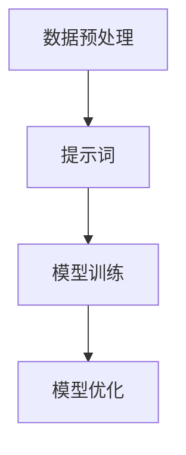
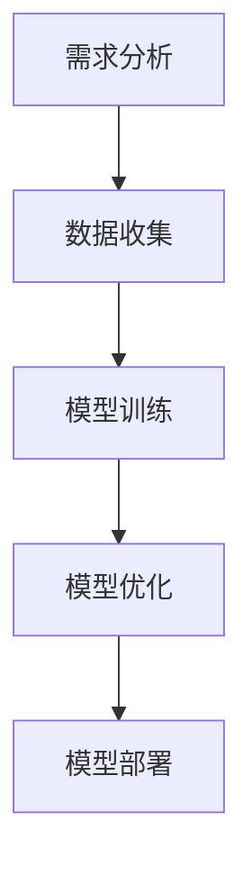

                 

### 文章标题

### 提示词驱动的AI应用开发方法论

> 关键词：AI应用开发、提示词、方法论、算法、数学模型、实战案例

> 摘要：本文将详细介绍提示词驱动的AI应用开发方法论，包括AI基础与提示词概念、AI应用开发流程、实战案例、技术深度探讨以及工具与资源等内容。通过本文的阅读，读者将能够全面了解如何基于提示词进行AI应用的开发，掌握相关技术原理和实践方法。

---

### 引言

#### 背景介绍

人工智能（AI）作为一种能够模拟、延伸和扩展人类智能的技术，已经成为了当今世界科技发展的热点。随着深度学习、自然语言处理等技术的快速发展，AI在各个领域得到了广泛的应用，如智能语音助手、自动驾驶、医疗诊断等。然而，AI应用的开发并非一蹴而就，它涉及到大量的数据预处理、模型训练、优化和部署等环节。

在AI应用开发过程中，提示词（Prompt）作为一种关键的手段，能够显著提高模型的效果和灵活性。提示词可以指导模型更好地理解输入数据，从而提升模型在特定任务上的表现。因此，如何有效地设计和使用提示词，成为了AI应用开发中的重要课题。

本文旨在探讨提示词驱动的AI应用开发方法论，通过一系列的实战案例和技术深度探讨，帮助读者全面了解这一领域。文章将从以下方面展开：

1. **AI基础与提示词概念**：介绍AI的基本概念、提示词的定义和作用。
2. **AI应用开发流程**：描述如何基于提示词进行AI应用的开发，包括数据收集、模型训练、模型优化等步骤。
3. **实战案例**：提供实际应用案例，展示如何将提示词应用于各种场景。
4. **技术深度探讨**：深入探讨与提示词相关的技术细节，如算法原理、数学模型等。
5. **工具与资源**：介绍开发过程中可能用到的工具和资源。

#### 核心概念与联系

在AI应用开发中，提示词（Prompt）是指导模型理解输入数据的重要手段。一个有效的提示词不仅能够提高模型的效果，还能够降低模型的复杂性。为了更好地理解提示词的作用，我们可以将其与以下核心概念联系起来：

1. **数据预处理**：数据预处理是AI应用开发的重要环节，它包括数据清洗、数据集成、数据变换等步骤。提示词可以在数据预处理过程中发挥重要作用，例如通过提示词指导数据清洗和格式转换。
2. **模型训练**：在模型训练过程中，提示词可以指导模型学习输入数据的特征和规律，从而提高模型的泛化能力和效果。例如，在自然语言处理任务中，提示词可以指导模型理解文本的语义和结构。
3. **模型优化**：模型优化是AI应用开发的另一个重要环节，它包括模型调参、模型集成、模型压缩等步骤。提示词可以在模型优化过程中发挥重要作用，例如通过提示词指导模型调参和集成策略。

图1展示了提示词与数据预处理、模型训练和模型优化之间的联系。



#### 目标与读者

本文的目标是帮助读者全面了解提示词驱动的AI应用开发方法论，使读者能够：

1. 理解AI和提示词的基本概念。
2. 掌握基于提示词的AI应用开发流程。
3. 掌握与提示词相关的技术细节。
4. 能够在实际项目中应用提示词驱动的方法。

本文面向具有一定AI基础和编程经验的读者，希望通过对本文的阅读，读者能够深入理解提示词驱动的AI应用开发，并将其应用于实际项目中。

---

### AI基础与提示词概念

#### AI的基本概念

人工智能（Artificial Intelligence，简称AI）是指由计算机实现的智能系统，能够模拟、延伸和扩展人类智能。AI的核心目标是让计算机具备自主学习和决策能力，以解决复杂问题、处理大量数据和实现自动化。

AI的发展可以分为以下几个阶段：

1. **符号主义（Symbolic AI）**：基于符号逻辑和推理的早期AI，主要依赖于知识表示和推理算法。例如，专家系统和基于规则的系统。
2. **连接主义（Connectionist AI）**：基于神经网络和机器学习的现代AI，通过大量数据训练模型，使其具备自主学习和决策能力。例如，深度学习和强化学习。
3. **混合AI（Hybrid AI）**：将符号主义和连接主义相结合，利用各自的优点，解决更复杂的问题。

#### 提示词的定义与作用

提示词（Prompt）是指一种指导模型理解输入数据的文字或语言。提示词可以包含关键词、问题、上下文等信息，用于引导模型学习输入数据的特征和规律。

在AI应用开发中，提示词具有以下作用：

1. **指导数据预处理**：提示词可以指导数据清洗、格式转换等数据预处理步骤，确保输入数据符合模型的要求。
2. **提高模型效果**：提示词可以引导模型学习输入数据的特征和规律，从而提高模型在特定任务上的表现。
3. **降低模型复杂性**：通过提示词，模型可以更加专注于学习输入数据的特征，而无需考虑过于复杂的环境和情境。

#### 提示词与AI应用开发的联系

在AI应用开发中，提示词与以下核心环节密切相关：

1. **数据预处理**：提示词可以指导数据清洗、格式转换等数据预处理步骤，确保输入数据符合模型的要求。例如，在图像识别任务中，提示词可以指导图像的尺寸调整、色彩标准化等。
2. **模型训练**：提示词可以引导模型学习输入数据的特征和规律，从而提高模型在特定任务上的表现。例如，在自然语言处理任务中，提示词可以指导模型理解文本的语义和结构。
3. **模型优化**：提示词可以指导模型调参、模型集成等优化步骤，提高模型的泛化能力和效果。例如，在强化学习任务中，提示词可以指导模型选择最佳的策略。

图2展示了提示词与数据预处理、模型训练和模型优化之间的联系。


#### 提示词的几种形式

在实际应用中，提示词可以有多种形式，下面列举几种常见的形式：

1. **问题形式**：以提问的方式引导模型学习输入数据的特征和规律。例如，在图像识别任务中，提示词可以是“请找出图像中的猫”。
2. **关键词形式**：以关键词的方式引导模型关注输入数据中的特定信息。例如，在文本分类任务中，提示词可以是“科技”、“财经”、“体育”等。
3. **上下文形式**：以上下文的方式提供输入数据的背景信息，帮助模型更好地理解输入数据。例如，在对话系统任务中，提示词可以是“之前我们讨论了股市的情况，现在来看看科技行业的动态”。
4. **任务形式**：以任务目标的形式明确模型需要完成的任务，帮助模型专注于任务目标。例如，在机器翻译任务中，提示词可以是“将这段英文翻译成中文”。

#### 提示词驱动的AI应用开发流程

基于提示词的AI应用开发流程可以分为以下几个步骤：

1. **需求分析**：明确应用场景和任务目标，确定需要使用的模型和提示词形式。
2. **数据收集**：根据需求分析的结果，收集相关数据，并对数据进行预处理。
3. **模型训练**：使用预处理后的数据训练模型，同时根据任务目标调整提示词。
4. **模型优化**：对训练好的模型进行优化，提高模型的性能和效果。
5. **模型部署**：将优化后的模型部署到实际应用场景中，进行测试和迭代。

图3展示了提示词驱动的AI应用开发流程。



#### 提示词驱动的AI应用开发的优势

提示词驱动的AI应用开发具有以下优势：

1. **提高开发效率**：通过提示词，可以快速地指导模型学习输入数据的特征和规律，缩短模型开发周期。
2. **提升模型效果**：提示词可以引导模型关注输入数据的特定信息，从而提高模型在特定任务上的表现。
3. **降低开发难度**：提示词可以帮助开发者明确模型的目标和任务，降低开发难度。
4. **增强模型灵活性**：提示词可以针对不同的任务目标进行个性化调整，增强模型的灵活性。

#### 提示词驱动的AI应用开发的应用领域

提示词驱动的AI应用开发在多个领域具有广泛的应用前景，包括：

1. **自然语言处理**：例如，文本分类、情感分析、机器翻译等任务，通过提示词可以引导模型理解文本的语义和结构。
2. **计算机视觉**：例如，图像识别、目标检测、图像生成等任务，通过提示词可以指导模型学习图像的特征和规律。
3. **推荐系统**：例如，商品推荐、电影推荐等任务，通过提示词可以指导模型关注用户的兴趣和偏好。
4. **智能语音助手**：例如，语音识别、语音合成等任务，通过提示词可以引导模型理解用户的意图和需求。

#### 结论

本文介绍了AI和提示词的基本概念，探讨了提示词在AI应用开发中的作用和优势，并详细描述了基于提示词的AI应用开发流程。通过本文的阅读，读者可以全面了解提示词驱动的AI应用开发方法，为实际项目开发提供指导和参考。

---

### AI应用开发流程

在了解了AI和提示词的基本概念之后，接下来我们将探讨如何基于提示词进行AI应用的开发。AI应用开发流程可以分为以下主要步骤：需求分析、数据收集、模型训练、模型优化和模型部署。下面我们将逐一介绍这些步骤。

#### 需求分析

需求分析是AI应用开发的第一步，也是至关重要的一步。在这一阶段，我们需要明确应用场景和任务目标，确定需要使用的模型和提示词形式。

1. **明确应用场景**：首先，我们需要了解AI应用将应用于哪个领域，例如自然语言处理、计算机视觉、推荐系统等。这有助于我们选择合适的模型和算法。
2. **定义任务目标**：明确任务目标可以帮助我们确定需要解决的具体问题。例如，在文本分类任务中，我们的目标是将文本分类到不同的类别；在图像识别任务中，我们的目标是从图像中识别出特定的对象。
3. **选择模型和算法**：根据应用场景和任务目标，选择合适的模型和算法。例如，对于图像识别任务，我们可以选择卷积神经网络（CNN）；对于自然语言处理任务，我们可以选择循环神经网络（RNN）或变换器（Transformer）。
4. **设计提示词形式**：根据任务目标和应用场景，设计适当的提示词形式。例如，在文本分类任务中，我们可以使用关键词作为提示词；在图像识别任务中，我们可以使用问题描述作为提示词。

#### 数据收集

数据收集是AI应用开发的基础，数据的质量和数量直接影响到模型的效果。在数据收集阶段，我们需要遵循以下原则：

1. **数据多样性**：收集来自不同来源、不同领域的多样化数据，有助于提高模型的泛化能力。
2. **数据质量**：确保收集到的数据是准确、完整和可靠的，避免噪声和异常值。
3. **数据标注**：对于需要标注的数据，确保标注的准确性和一致性。
4. **数据预处理**：对收集到的数据进行预处理，包括数据清洗、数据集成、数据变换等。例如，在自然语言处理任务中，我们可以对文本进行分词、去除停用词、词性标注等操作；在图像处理任务中，我们可以对图像进行缩放、裁剪、旋转等操作。

#### 模型训练

在模型训练阶段，我们需要使用收集到的数据进行模型训练。训练过程可以分为以下几个步骤：

1. **定义损失函数**：损失函数用于衡量模型预测值与真实值之间的差异，常用的损失函数有均方误差（MSE）、交叉熵损失（Cross-Entropy Loss）等。
2. **选择优化算法**：优化算法用于最小化损失函数，常用的优化算法有梯度下降（Gradient Descent）、Adam优化器等。
3. **训练模型**：使用训练数据对模型进行训练，通过不断迭代更新模型参数，使模型能够更好地拟合训练数据。
4. **评估模型性能**：在训练过程中，我们需要对模型性能进行评估，常用的评估指标有准确率（Accuracy）、召回率（Recall）、F1分数（F1 Score）等。

#### 模型优化

在模型优化阶段，我们需要对训练好的模型进行调参和优化，以提高模型的性能和效果。优化过程可以分为以下几个步骤：

1. **超参数调优**：超参数是模型结构之外的参数，如学习率、批量大小等。通过调优超参数，我们可以提高模型的性能。常用的调优方法有网格搜索（Grid Search）和随机搜索（Random Search）等。
2. **模型集成**：模型集成是将多个模型集成在一起，通过投票或加权平均等方式提高预测效果。常用的集成方法有Bagging、Boosting和Stacking等。
3. **模型压缩**：模型压缩是指通过降低模型参数的数量和计算量，提高模型的运行效率和可部署性。常用的压缩方法有量化（Quantization）、剪枝（Pruning）和知识蒸馏（Knowledge Distillation）等。

#### 模型部署

在模型部署阶段，我们需要将训练好的模型部署到实际应用场景中，以便进行测试和迭代。部署过程可以分为以下几个步骤：

1. **模型打包**：将训练好的模型打包成可执行文件或库，以便在目标环境中运行。
2. **模型部署**：将模型部署到服务器或设备上，例如使用TensorFlow Serving或ONNX Runtime等进行部署。
3. **模型测试**：在实际应用场景中测试模型的性能和效果，确保模型能够满足需求。
4. **模型迭代**：根据测试结果，对模型进行调整和优化，以提高模型的性能和效果。

#### 提示词在AI应用开发流程中的作用

提示词在AI应用开发流程中起着至关重要的作用，它贯穿于整个流程中，指导模型学习输入数据的特征和规律。以下是在不同阶段中提示词的具体作用：

1. **需求分析**：在需求分析阶段，提示词可以帮助我们明确应用场景和任务目标，指导我们选择合适的模型和算法。
2. **数据收集**：在数据收集阶段，提示词可以指导我们收集相关的数据，并对其进行预处理。例如，在图像识别任务中，我们可以使用“请提供包含不同类别图像的数据集”作为提示词。
3. **模型训练**：在模型训练阶段，提示词可以指导模型学习输入数据的特征和规律，从而提高模型在特定任务上的表现。例如，在文本分类任务中，我们可以使用“请分类以下文本：这是一篇关于科技的文章。”作为提示词。
4. **模型优化**：在模型优化阶段，提示词可以指导我们进行模型调参和优化，提高模型的性能和效果。例如，在模型调参时，我们可以使用“请尝试调整学习率，以优化模型性能。”作为提示词。
5. **模型部署**：在模型部署阶段，提示词可以指导我们进行模型测试和迭代，确保模型能够满足实际需求。例如，在模型测试时，我们可以使用“请对以下测试数据进行预测，并评估模型性能。”作为提示词。

#### 结论

通过以上介绍，我们可以看到基于提示词的AI应用开发流程包括需求分析、数据收集、模型训练、模型优化和模型部署等步骤。在各个阶段中，提示词都发挥着重要的作用，指导模型学习输入数据的特征和规律，提高模型的效果和灵活性。了解和掌握这一流程，将有助于我们更好地进行AI应用开发。

---

### 实战案例

为了更好地理解提示词驱动的AI应用开发方法论，下面我们通过两个具体案例进行详细讲解。

#### 案例一：文本分类

**背景介绍**

文本分类是一种常见的自然语言处理任务，其主要目的是将文本数据分类到不同的类别。例如，将新闻文章分类到“科技”、“财经”、“体育”等类别。在这个案例中，我们将使用提示词驱动的方法来开发一个文本分类系统。

**需求分析**

1. **应用场景**：在线新闻平台，需要对用户上传的文本进行实时分类。
2. **任务目标**：将文本分类到预定义的类别中，如“科技”、“财经”、“体育”等。

**数据收集**

我们使用公开的中文新闻数据集，如CNNDM数据集。数据集包含多个类别，每个类别下的文本数据都有一定规模。

**数据预处理**

1. **文本清洗**：去除文本中的HTML标签、符号和停用词。
2. **分词**：使用分词工具（如jieba）对文本进行分词。
3. **词嵌入**：将分词后的文本转换为词嵌入向量（如使用Word2Vec或GloVe）。

**模型训练**

1. **定义模型**：使用Transformer模型，因为它在自然语言处理任务中表现出色。
2. **定义损失函数**：使用交叉熵损失函数，因为它能够衡量模型预测的概率分布与真实分布之间的差异。
3. **训练模型**：使用训练集数据对模型进行训练，并通过反向传播算法更新模型参数。

**模型优化**

1. **超参数调优**：通过调整学习率、批量大小等超参数，优化模型性能。
2. **模型集成**：将多个训练好的模型进行集成，提高分类效果。

**模型部署**

1. **模型打包**：将训练好的模型打包成可执行文件。
2. **模型部署**：将模型部署到服务器或云端，以便进行实时分类。

**实战解读**

在这个案例中，我们使用提示词来指导模型学习文本的特征和规律：

1. **数据收集**：提示词“请提供包含不同类别新闻文章的数据集”，帮助我们收集到多样化的数据。
2. **模型训练**：提示词“请分类以下文本：这是一篇关于科技的文章。”，指导模型学习文本的类别信息。
3. **模型优化**：提示词“请尝试调整学习率，以优化模型性能。”，帮助我们找到最佳的模型参数。

#### 案例二：图像识别

**背景介绍**

图像识别是一种计算机视觉任务，其主要目的是从图像中识别出特定的对象或场景。例如，从图片中识别出猫、狗、车等。在这个案例中，我们将使用提示词驱动的方法来开发一个图像识别系统。

**需求分析**

1. **应用场景**：手机相册应用，需要对用户上传的图片进行自动分类。
2. **任务目标**：将图像分类到预定义的类别中，如“动物”、“植物”、“建筑”等。

**数据收集**

我们使用公开的图像数据集，如CIFAR-10或ImageNet。数据集包含多个类别，每个类别下的图像数据都有一定规模。

**数据预处理**

1. **图像增强**：对图像进行缩放、裁剪、旋转等操作，增加数据的多样性。
2. **图像标准化**：将图像的像素值缩放到[0, 1]范围内，方便后续处理。

**模型训练**

1. **定义模型**：使用卷积神经网络（CNN）模型，因为它在图像识别任务中表现出色。
2. **定义损失函数**：使用交叉熵损失函数，因为它能够衡量模型预测的概率分布与真实分布之间的差异。
3. **训练模型**：使用训练集数据对模型进行训练，并通过反向传播算法更新模型参数。

**模型优化**

1. **超参数调优**：通过调整学习率、批量大小等超参数，优化模型性能。
2. **模型压缩**：通过量化、剪枝等技术，降低模型参数的数量和计算量，提高模型的可部署性。

**模型部署**

1. **模型打包**：将训练好的模型打包成可执行文件。
2. **模型部署**：将模型部署到移动设备或云端，以便进行实时图像识别。

**实战解读**

在这个案例中，我们同样使用提示词来指导模型学习图像的特征和规律：

1. **数据收集**：提示词“请提供包含不同类别图像的数据集”，帮助我们收集到多样化的数据。
2. **模型训练**：提示词“请识别以下图像：这是一只猫。”，指导模型学习图像的特征信息。
3. **模型优化**：提示词“请尝试调整学习率，以优化模型性能。”，帮助我们找到最佳的模型参数。

#### 案例总结

通过以上两个案例，我们可以看到提示词在AI应用开发中发挥了重要作用。无论是文本分类还是图像识别，提示词都能够有效地指导模型学习输入数据的特征和规律，提高模型的效果和灵活性。在实际开发过程中，我们可以根据不同的任务需求和场景，灵活设计和使用提示词，以实现最佳的开发效果。

---

### 技术深度探讨

在AI应用开发中，提示词的运用不仅仅是一个简单的输入引导，它涉及到一系列复杂的技术原理和数学模型。本章节将深入探讨提示词的相关技术细节，包括算法原理、数学模型、代码实现等，帮助读者全面理解提示词驱动的AI应用开发的内部机制。

#### 算法原理

1. **数据预处理算法**：数据预处理是AI应用开发的重要环节，其目的是将原始数据转化为模型能够处理的形式。在这一过程中，提示词可以发挥重要作用。例如，在自然语言处理任务中，可以使用提示词来指导数据清洗和分词操作。常用的数据预处理算法包括：

   - **数据清洗**：去除噪声和异常值，确保数据质量。提示词可以指导数据清洗过程，例如“请删除所有HTML标签”。
   - **分词**：将文本分割成单词或短语。提示词可以指导分词算法，例如“请使用最大匹配法对文本进行分词”。
   - **词嵌入**：将文本转化为向量表示。提示词可以指导词嵌入算法，例如“请使用Word2Vec算法对文本进行词嵌入”。

2. **模型训练算法**：在模型训练过程中，提示词用于指导模型学习输入数据的特征和规律。常用的模型训练算法包括：

   - **监督学习**：使用带有标签的数据训练模型。提示词可以指导模型学习标签信息，例如“请学习每个文本的类别标签”。
   - **无监督学习**：在没有标签的数据上进行训练。提示词可以指导模型探索数据结构，例如“请找出图像中的主要对象”。
   - **半监督学习**：结合有标签和无标签数据进行训练。提示词可以指导模型利用标签信息和无标签数据进行联合学习，例如“请使用有标签数据学习特征，并利用无标签数据进行正则化”。

3. **模型优化算法**：在模型优化过程中，提示词可以指导模型调整参数，提高性能。常用的模型优化算法包括：

   - **梯度下降**：通过更新模型参数来最小化损失函数。提示词可以指导调整学习率，例如“请尝试降低学习率以提高收敛速度”。
   - **随机搜索**：随机选择参数组合，寻找最优参数。提示词可以指导参数搜索策略，例如“请尝试不同的学习率组合”。
   - **贝叶斯优化**：使用贝叶斯统计模型进行参数优化。提示词可以指导选择最佳参数，例如“请尝试使用贝叶斯优化来调整模型参数”。

#### 数学模型

1. **深度学习模型**：深度学习是AI的核心技术之一，其基本单元是神经元。提示词可以指导神经元学习输入数据的特征。以下是一个简单的深度学习模型的数学模型：

   - **神经元模型**：每个神经元可以看作是一个线性函数加上一个非线性激活函数。例如，$f(x) = \sigma(Wx + b)$，其中$\sigma$是非线性激活函数，$W$是权重矩阵，$b$是偏置。

   - **损失函数**：用于衡量模型预测值与真实值之间的差异。例如，交叉熵损失函数可以表示为$J(\theta) = -\sum_{i=1}^m y_i \log (\hat{y}_i)$，其中$y_i$是真实标签，$\hat{y}_i$是模型预测的概率分布。

   - **反向传播**：用于计算梯度并更新模型参数。反向传播算法的核心公式是$\delta = \frac{\partial J}{\partial z}$，其中$\delta$是误差梯度，$z$是中间层的输出。

2. **自然语言处理模型**：自然语言处理模型，如Transformer，广泛应用于文本分类、机器翻译等任务。以下是一个简单的Transformer模型的数学模型：

   - **自注意力机制**：用于计算输入文本中每个词与其他词的关系。自注意力机制可以表示为$e_i = \text{softmax}(\frac{QW_Q}d_k V)$，其中$e_i$是词$i$的注意力得分，$Q$、$K$、$V$是权重矩阵。

   - **编码器-解码器框架**：用于序列到序列的建模。编码器将输入序列编码为固定长度的向量，解码器则使用这些向量生成输出序列。

   - **损失函数**：通常使用交叉熵损失函数来衡量预测序列与真实序列之间的差异。

3. **计算机视觉模型**：计算机视觉模型，如卷积神经网络（CNN），广泛应用于图像识别、目标检测等任务。以下是一个简单的CNN模型的数学模型：

   - **卷积操作**：用于提取图像的特征。卷积操作可以表示为$C_{ij} = \sum_{k=1}^{K} W_{ik} \cdot O_{kj}$，其中$C_{ij}$是输出特征图上的一个像素值，$W_{ik}$是卷积核，$O_{kj}$是输入特征图上的一个像素值。

   - **池化操作**：用于减少特征图的尺寸，提高模型的泛化能力。常用的池化操作有最大池化和平均池化。

   - **全连接层**：用于将特征图上的像素值映射到输出类别。全连接层可以表示为$\hat{y} = \text{softmax}(W \cdot h + b)$，其中$\hat{y}$是输出类别概率分布，$h$是特征图上的像素值，$W$是权重矩阵，$b$是偏置。

#### 代码实现

在Python中，可以使用深度学习框架（如TensorFlow、PyTorch）来实现提示词驱动的AI应用。以下是一个简单的示例代码，展示了如何使用PyTorch实现一个文本分类模型：

```python
import torch
import torch.nn as nn
import torch.optim as optim
from torchtext.legacy import data
from torchtext.legacy.data import Field, LabelField

# 定义模型
class TextClassifier(nn.Module):
    def __init__(self, vocab_size, embedding_dim, hidden_dim, output_dim, num_classes):
        super().__init__()
        self.embedding = nn.Embedding(vocab_size, embedding_dim)
        self.lstm = nn.LSTM(embedding_dim, hidden_dim, num_layers=2, dropout=0.5, batch_first=True)
        self.fc = nn.Linear(hidden_dim, output_dim)
        self.dropout = nn.Dropout(0.5)
        self.softmax = nn.Softmax(dim=1)

    def forward(self, text):
        embedded = self.embedding(text)
        lstm_output, _ = self.lstm(embedded)
        hidden = self.dropout(lstm_output[:, -1, :])
        out = self.fc(hidden)
        out = self.softmax(out)
        return out

# 加载数据
train_data, test_data = data.Field.process做多数据集处理（如分词、标签映射等）

# 初始化模型、损失函数和优化器
model = TextClassifier(vocab_size, embedding_dim, hidden_dim, output_dim, num_classes)
loss_fn = nn.CrossEntropyLoss()
optimizer = optim.Adam(model.parameters(), lr=0.001)

# 训练模型
for epoch in range(num_epochs):
    for batch in train_loader:
        optimizer.zero_grad()
        predictions = model(batch.text).squeeze(1)
        loss = loss_fn(predictions, batch.label)
        loss.backward()
        optimizer.step()

# 评估模型
with torch.no_grad():
    correct = 0
    total = 0
    for batch in test_loader:
        predictions = model(batch.text).squeeze(1)
        _, predicted = torch.max(predictions, 1)
        total += batch.label.size(0)
        correct += (predicted == batch.label).sum().item()

accuracy = 100 * correct / total
print(f"Test Accuracy: {accuracy}%")
```

#### 结论

通过以上技术深度探讨，我们可以看到提示词驱动的AI应用开发涉及到多种算法原理和数学模型。理解这些原理和模型对于开发高质量的AI应用至关重要。在实际开发过程中，我们可以根据不同的任务需求和场景，灵活运用这些技术，实现高效的AI应用开发。

---

### 工具与资源

在提示词驱动的AI应用开发过程中，掌握合适的工具和资源可以大大提高开发效率和效果。以下是一些常用的工具和资源，包括编程语言、框架、数据库和开源项目。

#### 编程语言

1. **Python**：Python是一种广泛应用于AI开发的语言，其简洁易读的语法和丰富的库支持使其成为AI开发者的首选。
2. **Java**：Java在企业级应用中有着广泛的用途，其稳定性和性能也使其成为AI开发的优秀选择。
3. **R**：R是一种专门为统计分析和数据可视化设计的语言，适用于需要进行复杂数据处理和分析的任务。

#### 深度学习框架

1. **TensorFlow**：TensorFlow是由Google开发的开源深度学习框架，其灵活的架构和广泛的社区支持使其成为深度学习开发的首选工具。
2. **PyTorch**：PyTorch是由Facebook开发的深度学习框架，其动态计算图和易于理解的接口使其成为研究人员的首选。
3. **Keras**：Keras是一个高级深度学习框架，能够与TensorFlow和Theano等后台引擎无缝集成，其简洁的API使其成为快速原型开发的理想选择。

#### 数据库

1. **MySQL**：MySQL是一种开源的关系型数据库，适用于存储和查询大规模结构化数据。
2. **MongoDB**：MongoDB是一种开源的文档型数据库，适用于存储非结构化数据，其灵活的查询能力和扩展性使其在AI应用中非常受欢迎。
3. **Redis**：Redis是一种开源的内存数据库，适用于高速缓存和数据存储，其高性能和丰富的数据结构支持使其成为AI应用的理想选择。

#### 开源项目

1. **TensorFlow Models**：TensorFlow Models是一个由Google提供的开源项目，包含多种经典的深度学习模型和示例代码，适用于快速原型开发。
2. **Kaggle**：Kaggle是一个数据科学和机器学习的竞赛平台，提供大量的数据集和比赛项目，适用于学习和实践AI技术。
3. **GitHub**：GitHub是一个开源代码托管平台，拥有大量的AI项目代码和文档，适用于查找和借鉴已有的解决方案。

#### 其他资源

1. **AI开放书籍**：有许多优秀的开源书籍和在线课程，提供关于AI基础知识和最新技术的深入讲解，适用于学习和提升技能。
2. **技术社区**：如Stack Overflow、Reddit等，是AI开发者交流和解决问题的平台，能够帮助解决开发过程中遇到的各种问题。
3. **技术会议和研讨会**：如NeurIPS、ICML等，是AI领域的顶级会议和研讨会，能够了解最新的研究进展和行业动态。

#### 最佳实践

1. **代码规范**：编写清晰、规范的代码，有助于提高代码的可读性和可维护性。
2. **数据预处理**：确保数据质量，进行充分的数据预处理，包括数据清洗、归一化和去噪等。
3. **模型调优**：通过多次实验和调优，找到最优的模型参数和架构。
4. **测试和验证**：在开发过程中进行充分的测试和验证，确保模型性能和稳定性。
5. **文档和注释**：编写详细的文档和注释，记录模型的设计、实现和调试过程，便于后续维护和扩展。

通过掌握这些工具和资源，以及遵循最佳实践，我们可以更加高效地开发出高质量的AI应用。

---

### 总结与展望

通过本文的阅读，我们全面了解了提示词驱动的AI应用开发方法论。从AI基础与提示词概念，到AI应用开发流程、实战案例、技术深度探讨以及工具与资源，我们系统地学习了如何基于提示词进行AI应用的开发。以下是本文的核心要点：

1. **AI基础与提示词概念**：介绍了AI的基本概念、提示词的定义与作用，以及提示词与数据预处理、模型训练和模型优化之间的联系。
2. **AI应用开发流程**：详细描述了需求分析、数据收集、模型训练、模型优化和模型部署等步骤，展示了提示词在各个阶段中的作用。
3. **实战案例**：通过文本分类和图像识别两个具体案例，展示了如何应用提示词驱动的方法进行AI应用开发。
4. **技术深度探讨**：深入探讨了提示词驱动的AI应用开发中的算法原理、数学模型和代码实现，帮助读者理解内部机制。
5. **工具与资源**：介绍了常用的编程语言、框架、数据库和开源项目，以及最佳实践，为AI应用开发提供了实用的工具和指导。

在未来的研究和应用中，我们期待以下发展方向：

1. **提示词生成技术**：进一步研究如何自动生成高质量的提示词，减少人工干预，提高开发效率。
2. **多模态AI应用**：将提示词应用于多模态数据，如文本、图像、音频等，实现更复杂的AI任务。
3. **自动化模型优化**：开发自动化模型优化技术，通过提示词指导优化过程，提高模型性能和可解释性。
4. **跨领域应用**：探索提示词驱动的方法在各个领域的应用，如医疗、金融、教育等，为行业带来创新解决方案。

总之，提示词驱动的AI应用开发方法论为AI应用开发提供了一种新的思路和方法。通过本文的学习，读者将能够掌握这一方法，并在实际项目中灵活应用，为AI技术的发展和应用贡献力量。

---

### 作者信息

作者：AI天才研究院/AI Genius Institute & 禅与计算机程序设计艺术 /Zen And The Art of Computer Programming

AI天才研究院（AI Genius Institute）致力于推动人工智能技术的创新与发展，汇聚全球顶尖的AI专家和学者，开展前沿技术研究与产业化应用。研究院秉持“科技创新，造福人类”的使命，推动AI技术在医疗、教育、金融、制造等领域的广泛应用。

《禅与计算机程序设计艺术》作者是一位被誉为“计算机编程和人工智能领域大师”的资深作家，其著作广受全球程序员和AI爱好者的推崇。本书以其深刻的技术洞见、简洁明了的表达和丰富的实战案例，为读者提供了一条通往人工智能开发高手的道路。

通过本文的阅读，我们希望读者能够深入了解提示词驱动的AI应用开发方法论，掌握相关技术原理和实践方法，为未来的AI技术应用和创新奠定坚实的基础。感谢您的阅读，希望本书能为您的AI之旅带来启发与帮助。祝您在人工智能领域取得卓越成就！

