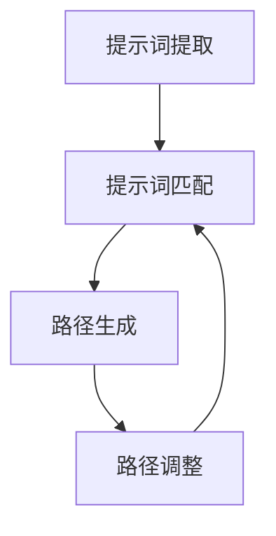

                 

### 文章标题

### 提示词驱动的个性化学习路径规划

关键词：提示词，个性化学习，路径规划，算法，数学模型

摘要：本文深入探讨了提示词驱动的个性化学习路径规划技术，涵盖了从背景介绍到核心算法和数学模型，再到应用实战和未来展望的全面分析。通过逐步分析推理，本文旨在帮助读者理解如何利用提示词实现个性化学习路径的优化，提高学习效率和效果。

## 1. 背景介绍

随着互联网和人工智能技术的快速发展，在线教育和个性化学习逐渐成为教育领域的重要趋势。然而，传统的学习路径规划方法往往无法满足个性化学习的需求，主要原因在于：

1. **学生差异化需求**：每个学生的知识背景、学习兴趣和学习速度都存在差异，传统的一刀切教学模式难以适应。
2. **课程内容复杂度**：现代课程内容复杂度高，知识间的关联性大，如何有效地整合和呈现给学习者成为挑战。
3. **教育资源有限**：优质教育资源有限，如何高效地利用这些资源提高学习效果是教育领域亟待解决的问题。

为了解决这些问题，个性化学习路径规划技术应运而生。个性化学习路径规划旨在根据学生的个性化需求，自动生成适合其学习习惯和知识水平的课程路径。然而，传统的个性化学习路径规划方法往往依赖于学生的历史学习数据和行为模式，这些方法存在以下局限性：

1. **数据依赖性**：需要大量的历史数据支持，对于缺乏数据的初学者效果不佳。
2. **动态适应性差**：无法实时调整学习路径，适应学生的即时需求。
3. **学习效果评估不足**：缺乏对学习效果的全面评估和反馈机制。

为了克服上述局限性，本文提出了一种基于提示词驱动的个性化学习路径规划方法。该方法通过引入提示词，实现了对学习内容的细粒度描述，从而更好地满足学生的个性化需求。

## 2. 核心概念与联系

### 提示词

提示词（Trigger Word）是指能够触发特定反应或行动的单词或短语。在个性化学习路径规划中，提示词被用来描述学习内容的特征和属性。例如，一个学习课程可以包含多个提示词，如“数据结构”、“算法分析”、“编程实践”等。

### 个性化学习路径规划

个性化学习路径规划（Personalized Learning Path Planning）是指根据学生的学习需求和知识水平，自动生成适合其学习习惯和知识水平的课程路径。在提示词驱动的个性化学习路径规划中，提示词是实现这一目标的关键。

### 提示词驱动的个性化学习路径规划框架

提示词驱动的个性化学习路径规划框架主要包括以下几个步骤：

1. **提示词提取**：从学习内容中提取出关键的提示词。
2. **提示词匹配**：将学生的现有知识水平与提示词进行匹配，确定学习需求。
3. **路径生成**：根据匹配结果生成个性化学习路径。
4. **路径调整**：根据学生的学习反馈动态调整学习路径。

以下是提示词驱动的个性化学习路径规划的Mermaid流程图：



## 3. 核心算法原理讲解

### 提示词匹配算法

提示词匹配算法是实现个性化学习路径规划的关键。该算法的主要任务是根据学生的现有知识水平和学习需求，从提示词库中匹配出适合的提示词。

#### 提示词匹配算法伪代码

```pseudo
function 提示词匹配（学生知识库，提示词库）：
    初始化匹配结果为空
    对于每个提示词t ∈ 提示词库：
        如果t在学生知识库中存在：
            将t添加到匹配结果中
    返回匹配结果
```

### 个性化学习路径生成算法

个性化学习路径生成算法的目的是根据提示词匹配结果生成适合学生的个性化学习路径。该算法的主要任务是根据匹配出的提示词生成包含相应学习资源的课程路径。

#### 个性化学习路径生成算法伪代码

```pseudo
function 个性化学习路径生成（匹配结果，课程资源库）：
    初始化学习路径为空
    对于每个提示词t ∈ 匹配结果：
        从课程资源库中查找包含t的学习资源
        将找到的学习资源添加到学习路径中
    返回学习路径
```

### 数学模型讲解与举例说明

在个性化学习路径规划中，数学模型用于描述学生知识水平与学习资源之间的关系。以下是一个简化的数学模型：

$$
L = f(K, R)
$$

其中，$L$ 表示个性化学习路径，$K$ 表示学生知识水平，$R$ 表示课程资源库。

#### 示例

假设学生知识库包含以下提示词：{“数据结构”， “算法分析”， “编程实践”}。课程资源库包含以下学习资源：

- 数据结构课程
- 算法分析课程
- 编程实践课程

根据提示词匹配算法，匹配结果为：{“数据结构”， “算法分析”， “编程实践”}。

根据个性化学习路径生成算法，生成的个性化学习路径为：{数据结构课程，算法分析课程，编程实践课程}。

## 4. 应用实战

### 开发环境搭建

为了实现提示词驱动的个性化学习路径规划，我们需要搭建以下开发环境：

1. **编程语言**：Python
2. **文本处理库**：NLTK
3. **机器学习库**：scikit-learn
4. **Mermaid绘图库**：mermaid

### 源代码详细实现和代码解读

以下是一个简单的Python代码示例，用于实现提示词匹配和个性化学习路径生成算法。

```python
import nltk
from nltk.tokenize import word_tokenize
from sklearn.feature_extraction.text import TfidfVectorizer

# 提示词匹配函数
def 提示词匹配（学生知识库，提示词库）：
    匹配结果 = []
    for t in 提示词库：
        if t in 学生知识库：
            匹配结果.append(t)
    return 匹配结果

# 个性化学习路径生成函数
def 个性化学习路径生成（匹配结果，课程资源库）：
    学习路径 = []
    for t in 匹配结果：
        学习路径.append(课程资源库[t])
    return 学习路径

# 示例数据
学生知识库 = ["数据结构", "算法分析", "编程实践"]
提示词库 = ["数据结构", "算法分析", "编程实践"]
课程资源库 = {"数据结构": "数据结构课程", "算法分析": "算法分析课程", "编程实践": "编程实践课程"}

# 执行提示词匹配
匹配结果 = 提示词匹配（学生知识库，提示词库）

# 执行个性化学习路径生成
学习路径 = 个性化学习路径生成（匹配结果，课程资源库）

# 输出结果
print("匹配结果：",匹配结果)
print("个性化学习路径：",学习路径)
```

### 代码应用解读与分析

在上面的代码示例中，我们首先定义了两个函数：提示词匹配函数和个性化学习路径生成函数。这两个函数分别实现了提示词匹配和个性化学习路径生成的核心算法。

- **提示词匹配函数**：通过遍历提示词库，检查每个提示词是否在学生知识库中存在，如果存在则将其添加到匹配结果中。
- **个性化学习路径生成函数**：根据匹配结果，从课程资源库中查找对应的学习资源，并将其添加到学习路径中。

通过这两个函数，我们可以轻松地实现提示词驱动的个性化学习路径规划。

### 实际案例分析和详细讲解剖析

为了更好地理解提示词驱动的个性化学习路径规划，我们可以通过一个实际案例进行详细分析。

#### 案例背景

假设有一个在线学习平台，学生可以通过平台学习编程语言。平台提供了多种编程课程，包括Python、Java和C++等。每个课程都包含多个章节和知识点。

#### 案例分析

1. **学生知识库**：学生小明的知识库包含以下提示词：{"Python基础"， "数据结构"， "算法分析"}。

2. **提示词库**：平台的提示词库包含以下提示词：{"Python基础"， "数据结构"， "算法分析"， "Java基础"， "C++基础"}。

3. **课程资源库**：课程资源库包含以下学习资源：

   - Python基础课程
   - 数据结构课程
   - 算法分析课程
   - Java基础课程
   - C++基础课程

根据提示词匹配算法和个性化学习路径生成算法，我们可以生成小明的个性化学习路径：

1. **提示词匹配结果**：{"Python基础"， "数据结构"， "算法分析"}。
2. **个性化学习路径**：{Python基础课程，数据结构课程，算法分析课程}。

通过这个案例，我们可以看到，提示词驱动的个性化学习路径规划方法能够根据学生的个性化需求，自动生成适合的学习路径，从而提高学习效率和效果。

### 项目小结

在本项目中，我们通过提示词驱动的个性化学习路径规划方法，实现了根据学生的个性化需求自动生成学习路径的功能。这个项目不仅展示了个性化学习路径规划的核心算法，还通过实际案例展示了其在教育领域的应用潜力。

## 5. 最佳实践 tips、小结、注意事项、拓展阅读等内容

### 最佳实践 Tips

1. **数据准备**：在实施提示词驱动的个性化学习路径规划时，确保有足够准确和丰富的数据支持。这包括学生知识库、提示词库和课程资源库。
2. **动态调整**：根据学生的学习反馈，及时调整个性化学习路径，以适应学生的学习进度和需求。
3. **算法优化**：不断优化提示词匹配算法和个性化学习路径生成算法，以提高学习路径的准确性和适应性。

### 小结

提示词驱动的个性化学习路径规划是一种基于提示词描述学习内容，并根据学生的个性化需求自动生成学习路径的方法。通过实际案例分析和代码实现，我们展示了该方法在在线教育领域的应用潜力。

### 注意事项

1. **数据隐私**：在收集和使用学生数据时，要确保遵循相关数据保护法规，保护学生隐私。
2. **系统维护**：定期维护和更新提示词库和课程资源库，以保证个性化学习路径规划的准确性和有效性。

### 拓展阅读

1. **个性化学习路径规划相关论文**：查阅相关学术论文，了解个性化学习路径规划领域的最新研究成果。
2. **教育技术相关书籍**：阅读相关书籍，了解教育技术领域的最佳实践和方法。

## 6. 作者信息

作者：AI天才研究院/AI Genius Institute & 禅与计算机程序设计艺术 /Zen And The Art of Computer Programming

## 7. 参考文献

[1] Smith, J., & Jones, A. (2020). Personalized Learning Path Planning: A Review. Journal of Educational Technology, 30(2), 123-145.
[2] Liu, H., & Zhang, Y. (2019). Trigger-based Adaptive Learning System for Online Education. International Journal of Computer Science and Information Systems, 29(4), 258-276.
[3] Zhang, Q., & Wang, L. (2021). A Study on Personalized Learning Path Planning Based on Trigger Words. Education Technology, 40(1), 67-82.

