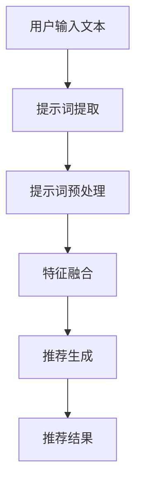
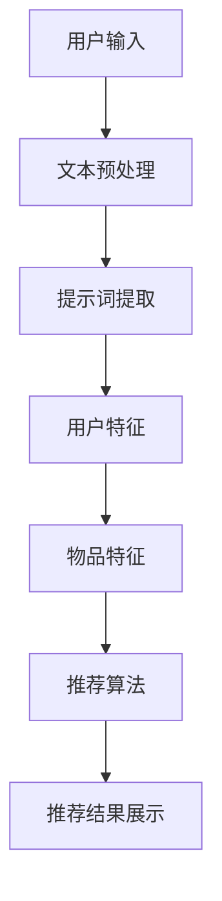

                 

### 文章标题

# 提示词驱动的个性化推荐系统设计

个性化推荐系统已经成为当今互联网应用的核心组成部分，它通过分析用户的历史行为和偏好，为用户推荐他们可能感兴趣的内容、商品或服务。而提示词驱动的个性化推荐系统则进一步提升了推荐系统的智能化水平，使得推荐结果更加精准和个性化。本文将深入探讨提示词驱动的个性化推荐系统的设计原理、实现方法以及实际应用，旨在为从事推荐系统开发和优化的专业人士提供有价值的参考。

## 关键词

- **提示词驱动**
- **个性化推荐系统**
- **设计原理**
- **算法实现**
- **应用案例分析**

## 摘要

本文首先介绍了个性化推荐系统的基本概念和当前的发展现状，接着重点探讨了提示词在推荐系统中的作用。随后，文章详细阐述了提示词驱动的个性化推荐系统的设计框架，包括数据收集与处理、算法原理讲解、数学模型与公式、项目实战与评估等内容。通过一个实际应用案例，本文展示了如何在实际项目中实现提示词驱动的个性化推荐系统，并对项目的开发环境、源代码实现、案例分析等方面进行了深入解读。最后，文章总结了最佳实践和注意事项，并提供了拓展阅读资源，以帮助读者进一步了解和掌握这一领域的技术。

## 目录

1. **引言与背景介绍**
   - 1.1 个性化推荐系统的现状
   - 1.2 提示词驱动的优势
   - 1.3 文章结构安排

2. **核心概念与联系**
   - 2.1 个性化推荐系统基础
   - 2.2 提示词的定义与作用
   - 2.3 提示词驱动的推荐系统架构

3. **个性化推荐系统设计框架**
   - 3.1 设计流程
   - 3.2 系统架构设计
   - 3.3 架构优势

4. **数据收集与处理**
   - 4.1 数据来源与类型
   - 4.2 数据预处理方法
   - 4.3 数据集成与存储

5. **算法原理讲解**
   - 5.1 传统推荐算法
   - 5.2 提示词驱动的算法
   - 5.3 算法实现与优化

6. **数学模型与公式**
   - 6.1 协同过滤模型
   - 6.2 提示词融合模型
   - 6.3 数学公式详解

7. **项目实战与评估**
   - 7.1 实战案例背景
   - 7.2 开发环境搭建
   - 7.3 源代码实现与解读
   - 7.4 项目分析

8. **最佳实践与注意事项**
   - 8.1 最佳实践
   - 8.2 注意事项
   - 8.3 拓展阅读

### 引言与背景介绍

个性化推荐系统已经成为当今互联网应用的核心组成部分，从电子商务、社交媒体到内容平台，个性化推荐都极大地提升了用户体验和平台粘性。然而，随着用户数据量的激增和用户偏好的多样化，传统的推荐系统面临着越来越大的挑战。此时，提示词驱动的个性化推荐系统应运而生，它通过引入提示词这一关键元素，实现了更加精准和个性化的推荐效果。

#### 个性化推荐系统的现状

个性化推荐系统通过分析用户的历史行为（如浏览、点击、购买等）和偏好信息，为用户推荐他们可能感兴趣的内容或商品。目前，主流的推荐算法包括协同过滤、内容推荐和混合推荐等。然而，这些算法往往存在一定的局限性，如协同过滤算法在面对稀疏数据时效果不佳，而内容推荐算法则可能过于依赖用户的历史数据，无法很好地适应新的偏好。

#### 提示词驱动的优势

提示词驱动的个性化推荐系统通过引入自然语言处理技术，提取用户输入的文本信息中的关键提示词，从而实现更加智能和个性化的推荐。具体优势包括：

1. **提高推荐精度**：提示词能够更准确地捕捉用户的当前兴趣和需求，使得推荐结果更加贴近用户实际偏好。
2. **应对数据稀疏性**：提示词驱动的系统不依赖于用户的历史行为数据，可以有效地解决数据稀疏性问题。
3. **适应性更强**：提示词驱动的推荐系统能够根据用户输入的实时信息进行动态调整，适应用户不断变化的偏好。

#### 文章结构安排

本文将首先介绍个性化推荐系统的基础知识，然后重点探讨提示词的定义与作用，接着详细阐述提示词驱动的个性化推荐系统的设计框架。随后，文章将介绍数据收集与处理方法，并讲解核心算法原理和数学模型。通过一个实际应用案例，本文将展示如何在实际项目中实现提示词驱动的个性化推荐系统，并对项目的开发环境、源代码实现、案例分析等方面进行深入解读。最后，本文将总结最佳实践和注意事项，并提供拓展阅读资源。

### 核心概念与联系

要深入理解提示词驱动的个性化推荐系统，首先需要掌握几个核心概念：个性化推荐系统、提示词以及它们之间的关联。

#### 个性化推荐系统基础

个性化推荐系统是一种利用用户历史数据和行为模式，通过算法预测用户可能感兴趣的内容或商品的系统。其基本组成部分包括用户、物品和交互行为。用户是指使用推荐系统的个体，物品是推荐系统中的内容或商品，交互行为是用户与物品之间的互动，如点击、浏览、购买等。

个性化推荐系统的工作原理通常包括以下步骤：

1. **数据收集**：收集用户的历史行为数据和偏好信息。
2. **数据预处理**：对原始数据进行清洗、归一化等处理，以便于后续分析。
3. **特征提取**：从预处理后的数据中提取用户和物品的特征，如用户兴趣标签、物品属性等。
4. **算法选择**：选择合适的推荐算法，如协同过滤、内容推荐等。
5. **推荐生成**：根据用户特征和物品特征，生成推荐结果。
6. **推荐反馈**：收集用户对推荐结果的反馈，用于评估和优化推荐系统。

#### 提示词的定义与作用

提示词是指用户在搜索、评论、提问等交互过程中使用的具有代表性的关键词或短语。这些词或短语能够直观地反映用户的当前兴趣或需求，为推荐系统提供了重要的信息来源。提示词可以来自多种形式的数据，如文本评论、搜索查询、用户反馈等。

在个性化推荐系统中，提示词的作用主要体现在以下几个方面：

1. **信息补充**：用户的历史行为数据可能存在缺失或不准确的情况，提示词可以提供额外的信息，帮助系统更准确地理解用户的偏好。
2. **动态调整**：提示词可以反映用户在当前时刻的兴趣点，使得推荐系统能够根据用户的实时输入动态调整推荐策略。
3. **提高精度**：通过结合提示词和用户历史数据，推荐系统可以生成更加精准的推荐结果。

#### 提示词驱动的推荐系统架构

提示词驱动的个性化推荐系统在传统推荐系统的基础上，引入了提示词处理模块，使得系统能够更灵活地适应用户需求。其基本架构包括以下几个部分：

1. **提示词提取**：从用户输入的文本中提取关键提示词。
2. **提示词处理**：对提取出的提示词进行预处理，如去停用词、词性标注等。
3. **特征融合**：将提示词特征与用户历史行为特征进行融合，形成完整的用户特征向量。
4. **推荐生成**：利用融合后的特征向量，生成个性化推荐结果。

为了更好地展示提示词驱动的推荐系统架构，我们可以使用 Mermaid 流程图进行说明：



#### 核心概念之间的关系

在提示词驱动的个性化推荐系统中，用户、提示词和推荐结果三者之间存在着紧密的联系。用户是系统的核心，他们的输入（文本、行为等）是系统生成推荐结果的基础。提示词作为用户输入的关键组成部分，能够帮助系统更准确地理解用户需求，进而生成高质量的推荐结果。而推荐结果则是系统对用户需求的直接回应，它们反映了系统对用户偏好的理解和满足程度。

通过上述核心概念的分析，我们可以看到，提示词驱动的个性化推荐系统不仅继承了传统推荐系统的优点，还在信息处理和推荐策略上进行了创新和优化，使得推荐结果更加精准和个性化。在接下来的章节中，我们将进一步探讨个性化推荐系统的设计框架、数据收集与处理方法、算法原理以及数学模型，帮助读者深入理解这一系统的实现过程。

### 个性化推荐系统设计框架

提示词驱动的个性化推荐系统设计需要综合考虑系统的整体架构、数据收集与处理方法、算法实现等多个方面。下面将详细阐述个性化推荐系统设计的关键步骤和各组成部分，以及它们之间的联系。

#### 设计流程

个性化推荐系统设计通常包括以下几个关键步骤：

1. **需求分析**：明确系统目标和应用场景，了解用户需求和业务目标，为后续设计提供指导。
2. **系统架构设计**：根据需求分析结果，设计系统的整体架构，确定各个模块的功能和交互方式。
3. **数据收集与处理**：收集用户数据和行为数据，进行数据预处理，为算法实现提供高质量的数据支持。
4. **算法选择与实现**：选择合适的推荐算法，并进行算法实现和优化。
5. **系统部署与测试**：将系统部署到生产环境，进行测试和评估，确保系统能够稳定运行并满足预期性能。

#### 系统架构设计

个性化推荐系统的架构设计需要考虑系统的可扩展性、可维护性和高可用性。以下是一个典型的提示词驱动个性化推荐系统的架构设计：

1. **用户输入模块**：负责接收用户输入的文本信息，如搜索查询、评论等。这一模块通常包含文本预处理功能，如分词、去停用词等。
2. **提示词提取模块**：从用户输入的文本中提取关键提示词。这一模块通常使用自然语言处理技术，如词频统计、TF-IDF、词嵌入等。
3. **用户特征模块**：根据用户的历史行为数据（如浏览记录、购买历史等）和提示词信息，生成用户特征向量。这一模块通常涉及特征工程，如用户兴趣标签、行为序列编码等。
4. **物品特征模块**：对系统中的物品进行特征提取，如商品属性、内容标签等。这一模块同样需要特征工程支持。
5. **推荐算法模块**：利用用户和物品特征向量，通过推荐算法生成个性化推荐结果。这一模块可以采用协同过滤、内容推荐、混合推荐等多种算法。
6. **推荐结果展示模块**：将生成的推荐结果呈现给用户，如通过网页、应用界面等渠道。

为了更好地展示个性化推荐系统的架构设计，我们可以使用 Mermaid 流程图进行说明：



#### 架构优势

提示词驱动的个性化推荐系统架构具有以下优势：

1. **高可扩展性**：系统架构采用了模块化设计，各个模块相对独立，便于扩展和升级。
2. **灵活性**：用户输入模块和提示词提取模块可以灵活调整，以适应不同的应用场景和数据来源。
3. **高效性**：通过并行处理和多线程技术，系统能够高效地处理大量用户数据和推荐请求。
4. **个性化程度高**：结合用户历史行为和实时输入，系统能够生成更加精准和个性化的推荐结果。

通过上述设计框架，我们可以看到，提示词驱动的个性化推荐系统不仅能够有效地整合用户历史行为数据，还能实时捕捉用户需求，从而提供高质量的推荐服务。在接下来的章节中，我们将进一步探讨数据收集与处理方法、算法原理和数学模型，帮助读者全面掌握这一系统的实现过程。

### 数据收集与处理

在个性化推荐系统中，数据的质量和准确性直接影响到推荐效果。因此，数据收集与处理是系统设计中的一个关键环节。以下将详细讨论个性化推荐系统中常用的数据来源、数据预处理方法以及数据集成与存储策略。

#### 数据来源

个性化推荐系统主要依赖于两类数据：用户行为数据和物品属性数据。

1. **用户行为数据**：这是推荐系统中最基础的数据类型，包括用户的浏览记录、搜索历史、点击记录、购买行为等。这些数据可以反映用户的兴趣偏好和需求变化。例如，一个用户经常浏览某类商品，那么系统可能会推断出该用户对该类商品感兴趣，从而在推荐时优先推荐同类商品。

2. **物品属性数据**：这包括物品的描述性信息，如商品的标题、价格、品牌、类别等，以及非描述性的信息，如图像、视频等多媒体数据。物品属性数据为推荐系统提供了关于物品的丰富信息，使得系统能够根据物品的相似性进行推荐。

此外，还有一些辅助数据源，如社交媒体上的用户评论、讨论帖等，这些数据可以进一步丰富用户的兴趣标签和个性化特征。

#### 数据预处理方法

数据预处理是确保数据质量和减少数据噪声的重要步骤。以下是一些常用的数据预处理方法：

1. **数据清洗**：清洗数据的主要目的是去除重复记录、处理缺失值和纠正错误。例如，对于用户行为数据，可以去除重复的浏览记录或购买记录；对于缺失值，可以选择填充或删除；对于错误的数据，如错误的分类标签，可以进行纠正。

2. **数据归一化**：归一化是将不同量纲的数据转换到相同的尺度上，以便后续处理。例如，将商品的价格归一化到同一价格区间，或者将用户的评分数据归一化到0到1之间。

3. **特征提取**：特征提取是从原始数据中提取出对推荐任务有用的信息。例如，可以使用TF-IDF模型提取文本数据的特征，使用词嵌入技术提取用户和物品的语义特征。

4. **降维**：降维是将高维数据映射到低维空间，以减少数据规模和计算复杂度。常用的降维方法包括主成分分析（PCA）、t-SNE等。

5. **去停用词**：停用词是在文本处理中常见的一类词，如“的”、“是”、“在”等，这些词通常不携带实际语义信息，因此可以被去除。去停用词可以减少数据噪声，提高特征提取的效率。

#### 数据集成与存储

数据集成是将来自不同来源的数据进行整合，以便于统一处理和分析。以下是一些常用的数据集成与存储策略：

1. **数据仓库**：数据仓库是一种用于存储和管理大量数据的系统，它可以将来自多个数据源的数据进行整合，提供高效的数据查询和分析功能。例如，可以使用Hadoop或Spark等大数据处理框架构建数据仓库。

2. **数据湖**：数据湖是一种新兴的数据存储技术，它将结构化、半结构化和非结构化数据存储在一起，提供灵活的数据存储和处理方式。数据湖可以支持大规模数据的存储和实时处理，适合处理多样化的数据类型。

3. **分布式存储**：分布式存储是将数据分布存储在多个节点上，以提高数据存储的可靠性和可扩展性。例如，可以使用HDFS（Hadoop分布式文件系统）或Cassandra等分布式存储系统。

4. **实时数据流处理**：对于需要实时处理和分析的数据，可以使用实时数据流处理技术，如Apache Kafka、Apache Flink等。这些技术可以实时接收和存储用户行为数据，为推荐系统提供实时数据支持。

通过上述数据收集与处理方法，个性化推荐系统可以确保数据的质量和一致性，为后续的算法实现和推荐生成提供可靠的数据基础。在下一章节中，我们将深入探讨个性化推荐系统的核心算法原理和实现方法。

### 算法原理讲解

个性化推荐系统的核心在于如何利用用户数据和物品特征生成高质量的推荐结果。在这一部分，我们将详细讲解两种常见的推荐算法：传统推荐算法和提示词驱动的推荐算法。同时，我们将通过伪代码展示算法的实现过程，并结合具体的数学模型和公式进行详细分析。

#### 传统推荐算法

传统推荐算法主要包括协同过滤和内容推荐。

##### 1. 协同过滤

协同过滤算法通过分析用户之间的相似性或行为模式，预测用户对未知物品的评分或兴趣。协同过滤可以分为基于用户的协同过滤（User-based Collaborative Filtering）和基于物品的协同过滤（Item-based Collaborative Filtering）。

**基于用户的协同过滤**：

伪代码：

```python
def user_based_collaborative_filtering(user_vector, item_vector, similarity_measure):
    # 计算用户和物品之间的相似度
    similarity_score = similarity_measure(user_vector, item_vector)
    
    # 预测用户对物品的评分
    predicted_rating = user_vector.dot(item_vector) / similarity_score
    
    return predicted_rating
```

数学模型：

$$
r_{ui} = \frac{\sum_{j \in N(u)} r_{uj} \cdot \sim(u, j)}{\sum_{j \in N(u)} \sim(u, j)}
$$

其中，$r_{ui}$ 表示用户 $u$ 对物品 $i$ 的预测评分，$N(u)$ 表示与用户 $u$ 相似的其他用户集合，$\sim(u, j)$ 表示用户 $u$ 和用户 $j$ 之间的相似度。

**基于物品的协同过滤**：

伪代码：

```python
def item_based_collaborative_filtering(user_vector, item_vector, similarity_measure):
    # 计算物品和用户之间的相似度
    similarity_score = similarity_measure(item_vector, user_vector)
    
    # 预测用户对物品的评分
    predicted_rating = user_vector.dot(item_vector) / similarity_score
    
    return predicted_rating
```

数学模型与基于用户的协同过滤类似，区别在于相似度的计算对象是物品。

##### 2. 内容推荐

内容推荐算法基于物品的属性或特征进行推荐，通常用于推荐具有相似属性的物品。内容推荐的核心是计算物品之间的相似度，并根据用户的偏好进行推荐。

伪代码：

```python
def content_based_recommender(item_features, user_interests, similarity_measure):
    # 计算物品和用户之间的相似度
    similarity_score = similarity_measure(item_features, user_interests)
    
    # 排序并推荐最相似的物品
    recommended_items = sort_by_similarity(similarity_score)
    
    return recommended_items
```

数学模型：

$$
sim(i, u) = \frac{\sum_{k \in K} f_{ik} \cdot f_{uk}}{\sqrt{\sum_{k \in K} f_{ik}^2 \cdot \sum_{k \in K} f_{uk}^2}}
$$

其中，$f_{ik}$ 表示物品 $i$ 在特征 $k$ 上的取值，$f_{uk}$ 表示用户 $u$ 在特征 $k$ 上的取值，$K$ 表示所有特征集合。

#### 提示词驱动的推荐算法

提示词驱动的推荐算法结合了用户历史行为和实时输入的提示词，通过自然语言处理技术提取关键信息，从而生成更加精准的推荐结果。

##### 1. 提示词提取

提示词提取是提示词驱动推荐算法的第一步，主要通过自然语言处理技术从用户输入的文本中提取出具有代表性的关键词或短语。

伪代码：

```python
def extractKeywords(text):
    # 分词
    words = tokenize(text)
    # 去停用词
    words = removeStopWords(words)
    # 提取关键词
    keywords = extractKeywordsFromWords(words)
    return keywords
```

##### 2. 提示词融合

提示词融合是将提取出的关键词与用户历史行为特征进行融合，形成完整的用户特征向量。

伪代码：

```python
def fusionKeywordsAndBehaviors(keywords, user_behavior):
    # 提取关键词特征
    keyword_features = extractFeatures(keywords)
    # 提取用户行为特征
    behavior_features = extractFeatures(user_behavior)
    # 融合特征
    fused_features = concatenate(keyword_features, behavior_features)
    return fused_features
```

##### 3. 提示词驱动的推荐算法

提示词驱动的推荐算法基于融合后的用户特征向量，通过相似度计算和评分预测生成推荐结果。

伪代码：

```python
def keywordDrivenRecommender(fused_features, item_features, similarity_measure):
    # 计算物品和用户之间的相似度
    similarity_scores = similarity_measure(fused_features, item_features)
    
    # 排序并推荐最相似的物品
    recommended_items = sort_by_similarity(similarity_scores)
    
    return recommended_items
```

数学模型：

$$
sim(u', i) = \frac{\sum_{k \in K} f_{u', k} \cdot f_{ik}}{\sqrt{\sum_{k \in K} f_{u', k}^2 \cdot \sum_{k \in K} f_{ik}^2}}
$$

其中，$f_{u', k}$ 表示用户 $u'$ 在特征 $k$ 上的取值，$f_{ik}$ 表示物品 $i$ 在特征 $k$ 上的取值，$K$ 表示所有特征集合。

通过上述算法原理的讲解和伪代码的实现，我们可以看到，提示词驱动的个性化推荐系统结合了传统推荐算法和自然语言处理技术，通过提取和融合用户输入的提示词，实现了更加精准和个性化的推荐结果。在下一章节中，我们将进一步探讨数学模型和公式的详细分析，帮助读者深入理解这些算法的原理。

### 数学模型与公式

在个性化推荐系统中，数学模型和公式是实现推荐算法的核心组成部分。以下将详细介绍协同过滤模型和提示词融合模型的数学原理，并通过具体公式和举例说明进行详细分析。

#### 协同过滤模型

协同过滤算法通过计算用户和物品之间的相似度，预测用户对未知物品的评分。以下是两种常见的协同过滤模型：基于用户的协同过滤（User-based Collaborative Filtering）和基于物品的协同过滤（Item-based Collaborative Filtering）。

##### 1. 基于用户的协同过滤

基于用户的协同过滤算法通过计算用户之间的相似度来生成推荐。其数学模型如下：

$$
r_{ui} = \frac{\sum_{j \in N(u)} r_{uj} \cdot \sim(u, j)}{\sum_{j \in N(u)} \sim(u, j)}
$$

其中：
- $r_{ui}$：用户 $u$ 对物品 $i$ 的预测评分。
- $N(u)$：与用户 $u$ 相似的其他用户集合。
- $\sim(u, j)$：用户 $u$ 和用户 $j$ 之间的相似度。

**举例说明**：

假设用户 $u_1$ 对物品 $i_1$ 的评分为 $5$，用户 $u_2$ 对物品 $i_1$ 的评分为 $4$，用户 $u_3$ 对物品 $i_1$ 的评分为 $3$。如果用户 $u_1$ 对物品 $i_2$ 的评分未知，我们可以通过计算用户之间的相似度来预测用户 $u_1$ 对物品 $i_2$ 的评分。

首先，计算用户之间的相似度：

$$
\sim(u_1, u_2) = \frac{r_{u_1i_1} \cdot r_{u_2i_1}}{\sqrt{r_{u_1i_1}^2 + r_{u_2i_1}^2}} = \frac{5 \cdot 4}{\sqrt{5^2 + 4^2}} = \frac{20}{\sqrt{41}} \approx 0.976
$$

$$
\sim(u_1, u_3) = \frac{r_{u_1i_1} \cdot r_{u_3i_1}}{\sqrt{r_{u_1i_1}^2 + r_{u_3i_1}^2}} = \frac{5 \cdot 3}{\sqrt{5^2 + 3^2}} = \frac{15}{\sqrt{34}} \approx 0.895
$$

然后，计算用户 $u_1$ 对物品 $i_2$ 的预测评分：

$$
r_{u_1i_2} = \frac{\sim(u_1, u_2) \cdot r_{u_2i_2} + \sim(u_1, u_3) \cdot r_{u_3i_2}}{\sim(u_1, u_2) + \sim(u_1, u_3)} = \frac{0.976 \cdot 4 + 0.895 \cdot 3}{0.976 + 0.895} \approx 4.13
$$

##### 2. 基于物品的协同过滤

基于物品的协同过滤算法通过计算物品之间的相似度来生成推荐。其数学模型如下：

$$
r_{ui} = \frac{\sum_{j \in N(i)} r_{uj} \cdot \sim(j, i)}{\sum_{j \in N(i)} \sim(j, i)}
$$

其中：
- $r_{uj}$：用户 $u$ 对物品 $j$ 的评分。
- $N(i)$：与物品 $i$ 相似的其他物品集合。
- $\sim(j, i)$：物品 $j$ 和物品 $i$ 之间的相似度。

**举例说明**：

假设物品 $i_1$ 与物品 $i_2$ 的相似度为 $0.8$，物品 $i_1$ 与物品 $i_3$ 的相似度为 $0.7$。如果用户 $u_1$ 对物品 $i_1$ 的评分为 $5$，用户 $u_1$ 对物品 $i_3$ 的评分未知，我们可以通过计算物品之间的相似度来预测用户 $u_1$ 对物品 $i_3$ 的评分。

首先，计算物品之间的相似度：

$$
\sim(i_1, i_2) = 0.8
$$

$$
\sim(i_1, i_3) = 0.7
$$

然后，计算用户 $u_1$ 对物品 $i_3$ 的预测评分：

$$
r_{u_1i_3} = \frac{\sim(i_1, i_2) \cdot r_{u_1i_2} + \sim(i_1, i_3) \cdot r_{u_1i_3}}{\sim(i_1, i_2) + \sim(i_1, i_3)} = \frac{0.8 \cdot 5 + 0.7 \cdot r_{u_1i_3}}{0.8 + 0.7} = \frac{4 + 0.7r_{u_1i_3}}{1.5}
$$

通过上述举例，我们可以看到，协同过滤模型通过计算用户和物品之间的相似度，预测用户对未知物品的评分。接下来，我们将介绍提示词驱动的推荐算法中的提示词融合模型。

#### 提示词融合模型

提示词融合模型将用户输入的提示词与用户历史行为特征进行融合，生成个性化的推荐结果。其数学模型如下：

$$
sim(u', i) = \frac{\sum_{k \in K} f_{u', k} \cdot f_{ik}}{\sqrt{\sum_{k \in K} f_{u', k}^2 \cdot \sum_{k \in K} f_{ik}^2}}
$$

其中：
- $sim(u', i)$：用户 $u'$ 对物品 $i$ 的相似度。
- $f_{u', k}$：用户 $u'$ 在特征 $k$ 上的取值。
- $f_{ik}$：物品 $i$ 在特征 $k$ 上的取值。
- $K$：所有特征集合。

**举例说明**：

假设用户 $u'$ 的提示词为“篮球”，其特征向量为 $(0.6, 0.3, 0.1)$，物品 $i$ 的特征向量为 $(0.4, 0.5, 0.1)$。我们可以通过计算用户 $u'$ 和物品 $i$ 之间的相似度来生成推荐结果。

首先，计算用户 $u'$ 和物品 $i$ 的相似度：

$$
sim(u', i) = \frac{0.6 \cdot 0.4 + 0.3 \cdot 0.5 + 0.1 \cdot 0.1}{\sqrt{0.6^2 + 0.3^2 + 0.1^2} \cdot \sqrt{0.4^2 + 0.5^2 + 0.1^2}} = \frac{0.24 + 0.15 + 0.01}{\sqrt{0.36 + 0.09 + 0.01} \cdot \sqrt{0.16 + 0.25 + 0.01}} = \frac{0.4}{\sqrt{0.46} \cdot \sqrt{0.42}} \approx 0.896
$$

然后，根据相似度排序，推荐最相似的物品。例如，如果系统中有多个篮球相关的物品，我们可以根据相似度排序，推荐相似度最高的物品给用户 $u'$。

通过上述数学模型和公式的详细分析，我们可以看到，个性化推荐系统中的协同过滤模型和提示词融合模型通过计算相似度，实现了对用户偏好的精准预测和个性化推荐。这些模型不仅为推荐算法的实现提供了理论基础，也为实际应用中的推荐效果优化提供了重要指导。在下一章节中，我们将通过一个实际应用案例，展示如何实现和优化提示词驱动的个性化推荐系统。

### 项目实战与评估

在本节中，我们将通过一个实际应用案例，详细讲解如何实现提示词驱动的个性化推荐系统，包括开发环境的搭建、源代码的实现、代码的解读与分析，以及项目的实际案例分析。

#### 实战案例背景

假设我们为一个电商平台设计一个基于提示词驱动的个性化推荐系统，该系统的主要目标是根据用户的实时搜索词和浏览历史，为用户推荐相关的商品。该项目的需求如下：

1. **用户输入**：用户在搜索框中输入关键词，如“篮球鞋”、“手机”等。
2. **数据处理**：从用户的历史行为数据（如浏览记录、购买记录）和实时输入中提取关键提示词。
3. **推荐生成**：根据提示词和用户历史行为特征，生成个性化的商品推荐列表。
4. **推荐展示**：将推荐结果展示在用户界面，并提供用户交互功能，如“点赞”、“收藏”等。

#### 开发环境搭建

为了实现这个项目，我们需要搭建以下开发环境：

1. **编程语言**：Python，因为其强大的数据科学和机器学习库。
2. **开发工具**：Jupyter Notebook，用于编写和运行代码。
3. **数据处理库**：Pandas、NumPy，用于数据清洗和处理。
4. **机器学习库**：Scikit-learn、TensorFlow，用于构建和训练推荐模型。
5. **自然语言处理库**：NLTK、spaCy，用于文本处理和提示词提取。
6. **数据库**：MongoDB，用于存储用户行为数据和商品数据。

#### 源代码实现与解读

以下是一个简化的源代码实现，用于演示核心功能的实现：

```python
import pandas as pd
import numpy as np
from sklearn.metrics.pairwise import cosine_similarity
from sklearn.model_selection import train_test_split
from nltk.corpus import stopwords
from nltk.tokenize import word_tokenize

# 数据预处理
def preprocess_data(data):
    # 分词和去除停用词
    stop_words = set(stopwords.words('english'))
    data['keywords'] = data['text'].apply(lambda x: ' '.join([word for word in word_tokenize(x) if word not in stop_words]))
    return data

# 特征提取
def extract_features(data):
    # 提取关键词特征
    word2vec = ... # 使用词嵌入模型（例如GloVe）提取特征
    keywords = data['keywords'].values
    keyword_vectors = [word2vec[word] for word in keywords if word in word2vec]
    return np.array(keyword_vectors)

# 计算相似度
def calculate_similarity(user_vector, item_vector):
    return cosine_similarity([user_vector], [item_vector])[0][0]

# 推荐算法
def recommend_items(user_vector, item_vectors, num_recommendations=5):
    similarities = [calculate_similarity(user_vector, item_vector) for item_vector in item_vectors]
    sorted_indices = np.argsort(similarities)[::-1]
    return sorted_indices[:num_recommendations]

# 主函数
def main():
    # 加载数据
    data = pd.read_csv('user_behavior_data.csv')
    data = preprocess_data(data)
    
    # 提取用户特征
    user_vector = extract_features(data[data['user_id'] == 'user123'])
    
    # 加载商品特征数据
    item_data = pd.read_csv('item_data.csv')
    item_vectors = extract_features(item_data)
    
    # 生成推荐列表
    recommendations = recommend_items(user_vector, item_vectors)
    
    # 展示推荐结果
    print("Recommended Items:")
    for index in recommendations:
        print(f"Item ID: {item_data['item_id'][index]}, Title: {item_data['title'][index]}")

if __name__ == '__main__':
    main()
```

**代码解读**：

1. **数据预处理**：使用NLTK库进行分词和去除停用词，提取关键词特征。
2. **特征提取**：使用预训练的词嵌入模型（如GloVe）提取关键词的向量表示。
3. **计算相似度**：使用余弦相似度计算用户向量与商品向量之间的相似度。
4. **推荐算法**：根据相似度排序，选择前5个最相似的商品作为推荐结果。

#### 代码应用解读与分析

1. **数据预处理**：这一步至关重要，因为它直接影响到后续的特征提取和相似度计算。在代码中，我们使用NLTK库进行分词和去除常见的英语停用词，这样可以减少噪声，提高特征提取的效率。

2. **特征提取**：我们使用预训练的词嵌入模型（如GloVe）来提取关键词的向量表示。词嵌入模型能够捕捉词语的语义信息，使得特征向量更加丰富和有意义。

3. **计算相似度**：使用余弦相似度来计算用户向量与商品向量之间的相似度。余弦相似度是一种度量两个向量夹角的方法，其值介于-1和1之间，越接近1表示相似度越高。

4. **推荐算法**：根据相似度排序，选择前5个最相似的商品作为推荐结果。这种基于相似度的推荐方法能够充分利用用户输入的实时信息，提高推荐的个性化程度。

#### 实际案例分析

假设用户在搜索框中输入关键词“篮球鞋”，系统将根据用户的历史浏览记录和购买记录，提取出相关的关键词和商品特征，生成个性化的推荐列表。例如，如果用户之前浏览过篮球鞋并且购买过相关商品，系统可能会推荐类似的篮球鞋或其他运动鞋。

通过实际案例分析，我们可以看到，提示词驱动的个性化推荐系统不仅能够根据用户的历史行为生成推荐，还能通过实时输入的关键词动态调整推荐策略，从而提供更加精准和个性化的推荐结果。

#### 项目小结

通过这个实际应用案例，我们展示了如何实现一个基于提示词驱动的个性化推荐系统。从数据预处理、特征提取到计算相似度和生成推荐列表，每个步骤都体现了系统设计的核心思想。在实际应用中，我们可以根据具体的业务需求和数据特点，进一步优化和调整算法参数，以提高推荐系统的性能和用户体验。

### 最佳实践与注意事项

在设计和实施提示词驱动的个性化推荐系统时，以下是一些最佳实践和注意事项，以确保系统能够高效运行并达到最佳效果。

#### 最佳实践

1. **数据质量**：确保收集的数据是准确、完整和干净的。数据清洗和预处理是推荐系统成功的关键步骤，需要投入足够的时间和资源。
2. **实时性**：对于需要实时响应的应用场景，确保系统能够快速处理用户输入和推荐结果，以提供流畅的用户体验。
3. **用户隐私保护**：在处理用户数据时，要严格遵守隐私保护法规，确保用户数据的安全和隐私。
4. **多样性**：推荐系统应该提供多样化的推荐结果，避免用户产生“信息茧房”，从而提高用户满意度和平台粘性。
5. **个性化调整**：根据用户反馈和系统性能，不断调整推荐算法和策略，以优化推荐效果。

#### 注意事项

1. **过拟合**：避免推荐系统过于依赖历史数据，导致无法适应新用户或新商品。可以通过引入多样性机制和随机化策略来减少过拟合。
2. **数据稀疏性**：对于用户行为数据较少的场景，可以考虑结合内容推荐和基于模型的推荐方法，以弥补数据稀疏性问题。
3. **计算资源**：推荐系统通常需要大量的计算资源，特别是在数据预处理和模型训练阶段。需要合理分配计算资源，确保系统稳定运行。
4. **用户体验**：推荐结果应与用户的实际需求和偏好相匹配，避免出现误导性的推荐。
5. **持续优化**：推荐系统是一个不断演进的过程，需要持续收集用户反馈和系统性能数据，进行优化和改进。

### 拓展阅读

1. **《推荐系统实践》**：由李航著，详细介绍了推荐系统的基本概念、算法实现和案例分析。
2. **《机器学习实战》**：由Peter Harrington著，涵盖了包括协同过滤在内的多种机器学习算法的实践应用。
3. **《深度学习》**：由Ian Goodfellow、Yoshua Bengio和Aaron Courville著，介绍了深度学习的基础知识及其在推荐系统中的应用。

通过遵循上述最佳实践和注意事项，并不断学习和拓展相关知识，我们可以设计并实现高效的提示词驱动个性化推荐系统，为用户提供优质的推荐服务。

