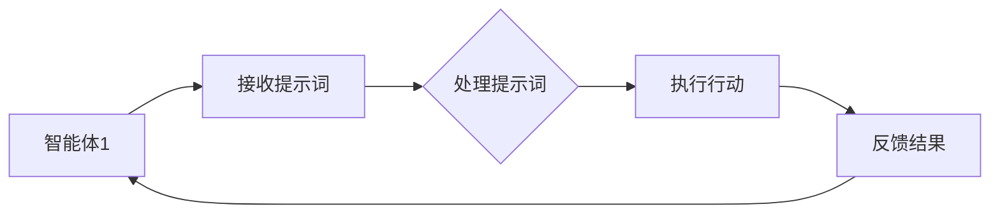
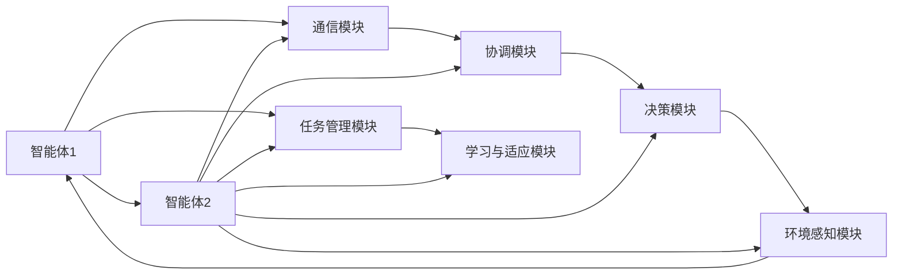

                 

### 文章标题：提示词驱动的多智能体协作系统

#### 关键词：提示词、多智能体协作、算法原理、系统架构、应用案例、实施与优化

#### 摘要：
本文旨在探讨提示词驱动的多智能体协作系统的设计与应用。首先，我们介绍多智能体系统的基本概念及其在各个领域的应用。接着，重点分析提示词在多智能体协作中的作用和设计原则，并详细阐述多智能体协作系统的架构。随后，本文将深入讲解多智能体协作的核心算法原理，通过伪代码和数学模型进行详细阐述。接下来，我们通过具体案例展示该系统在实际项目中的应用，并进行代码实现和解读。最后，本文总结最佳实践，提出注意事项和拓展阅读，为读者提供完整的理论指导和实践参考。

----------------------------------------------------------------

### 引言

多智能体系统（Multi-Agent Systems, MAS）是一种由多个自主智能体组成的系统，这些智能体可以通过交互和协作来完成复杂的任务。随着人工智能技术的发展，多智能体系统在各个领域展现出巨大的应用潜力，如智能交通、智能电网、智能医疗等。在这些应用场景中，智能体之间需要通过有效的协作来实现整体的最优性能。然而，多智能体系统的设计面临着诸多挑战，如通信延迟、资源限制、智能体之间的冲突等。

提示词（Prompt Word）作为一种在自然语言处理中常见的引导信息，能够有效地指导智能体进行决策和协作。在多智能体协作系统中，提示词可以用于传达任务目标、策略建议、状态信息等，从而提高系统的协作效率和性能。因此，提示词驱动的多智能体协作系统成为当前研究的热点。

本文将围绕提示词驱动的多智能体协作系统展开讨论。首先，我们将介绍多智能体系统的基本概念、架构和协作机制。然后，重点分析提示词的作用和设计原则。接着，本文将详细讲解多智能体协作的核心算法原理，包括强化学习、博弈论和优化算法等。此外，本文还将通过具体案例展示该系统在实际项目中的应用，并进行代码实现和解读。最后，本文将总结最佳实践，提出注意事项和拓展阅读，为读者提供完整的理论指导和实践参考。

----------------------------------------------------------------

### 多智能体系统的基本概念

多智能体系统（MAS）是由多个自主智能体组成的复杂系统，这些智能体可以通过交互和协作来完成复杂的任务。在MAS中，智能体（Agent）是系统的基本组成单元，具有以下特征：

1. **自治性（Autonomy）**：智能体可以自主地做出决策和执行行动，不受外部直接控制。
2. **社会性（Sociality）**：智能体之间可以通过通信和协作来实现共同的目标。
3. **反应性（Reactivity）**：智能体能够根据当前环境的状态做出实时响应。
4. **预见性（Pro-Activeness）**：智能体不仅可以对当前环境做出反应，还可以根据预测来采取主动行动。

多智能体系统的类型可以根据智能体的自主性、交互方式、协作目标等多个维度进行分类。以下是几种常见的类型：

1. **协作智能体系统（Collaborative Agent Systems）**：智能体之间通过协作来实现共同的目标。在这种系统中，智能体需要共享信息和资源，以实现整体最优性能。
2. **竞争智能体系统（Competitive Agent Systems）**：智能体之间以竞争为目的，争夺资源或达到特定目标。在这种系统中，智能体之间的交互往往带有对抗性。
3. **协商智能体系统（Negotiating Agent Systems）**：智能体之间通过协商和谈判来达成共识，解决冲突和分配资源。在这种系统中，智能体需要具备一定的沟通和协商能力。

多智能体系统面临的主要挑战包括：

1. **通信延迟（Communication Delays）**：智能体之间的通信可能会受到网络延迟的影响，导致决策和协作延迟。
2. **资源限制（Resource Constraints）**：智能体在资源有限的情况下进行决策和行动，可能需要权衡不同目标之间的冲突。
3. **智能体之间的冲突（Agent Conflicts）**：智能体在追求自身利益时可能会与其他智能体发生冲突，需要通过机制来协调和解决。
4. **不确定性（Uncertainty）**：环境的不确定性和智能体行为的不可预测性给多智能体系统的设计带来了挑战。

尽管存在这些挑战，多智能体系统在各个领域展现出了巨大的应用潜力。例如，在智能交通系统中，多智能体系统可以用于优化交通流量，减少拥堵；在智能电网中，多智能体系统可以用于分布式能源管理，提高能源利用效率；在智能医疗中，多智能体系统可以用于诊断和治疗，提高医疗服务的质量。

总之，多智能体系统作为一种复杂系统，具有广泛的应用前景。通过合理设计智能体的结构和协作机制，可以克服系统中的各种挑战，实现智能体的有效协作和系统的整体最优性能。

### 提示词的作用

在多智能体协作系统中，提示词（Prompt Word）作为一种关键的引导信息，能够显著影响智能体的决策和协作过程。提示词的定义可以从不同的角度进行理解。从广义上讲，提示词是指用于引导智能体进行特定任务或行为的提示性语句、符号或信息。在自然语言处理领域，提示词通常是指一组关键词或短语，用于提示模型在生成文本、图像或决策时需要关注的重要信息。

提示词在多智能体协作中的作用主要体现在以下几个方面：

1. **任务目标引导**：提示词可以帮助智能体明确任务目标，从而在决策和行动过程中保持一致。例如，在一个团队协作任务中，一个提示词“最大化收益”可以引导智能体在决策时优先考虑最大化整体收益，而不是仅仅追求个人利益。

2. **策略建议**：提示词可以提供关于最佳行动方案的指导，帮助智能体在复杂的决策环境中作出更明智的选择。例如，在智能交通系统中，一个提示词“避免拥堵”可以指导智能体选择最优路径，从而减少整体交通时间。

3. **状态信息传达**：提示词可以用于传达系统的当前状态和关键信息，帮助智能体做出适应性的决策。例如，在智能医疗系统中，一个提示词“患者病情恶化”可以提醒医生和智能体采取紧急措施，调整治疗方案。

4. **协作协调**：提示词可以帮助智能体之间进行有效的沟通和协作，减少误解和冲突。例如，在一个多人游戏中，一个提示词“团队进攻”可以协调所有智能体共同进攻目标，提高整体战斗效率。

设计提示词时需要遵循以下原则：

1. **清晰性**：提示词应当简洁明了，易于智能体理解和执行。避免使用模糊或歧义性强的词语，以免导致误解或错误决策。

2. **针对性**：提示词应当针对具体任务或情境设计，确保其能够有效引导智能体的行为。例如，在不同场景下，需要设计不同的提示词来满足特定需求。

3. **适应性**：提示词应当能够适应动态变化的环境和任务需求。智能体在执行任务过程中可能会遇到新的挑战或变化，提示词需要具备足够的灵活性来适应这些变化。

4. **多样性**：设计提示词时，应考虑不同智能体的需求和特点，提供多样化的提示选项。这样可以提高智能体的选择空间和灵活性，避免因单一提示词导致的僵化行为。

通过合理设计和使用提示词，可以有效提升多智能体协作系统的效率和性能，实现智能体之间的有效协作和系统的整体最优性能。以下是一个简单的Mermaid流程图，展示提示词在多智能体协作系统中的作用架构：



在这个流程图中，智能体1首先接收提示词，然后处理并执行相应的行动，最后反馈结果，形成一个闭环的控制过程。通过不断迭代这个过程，智能体可以逐步优化其行为和协作效果。

### 多智能体协作系统的架构

多智能体协作系统的设计涉及到多个关键组成部分，这些部分共同协作以实现系统的整体功能。以下是多智能体协作系统的常见架构及其组成模块：

1. **智能体（Agent）**：智能体是系统的基本组成单元，具有自主决策和执行能力。智能体可以是个体智能体（Individual Agent）或群体智能体（Group Agent）。个体智能体通常独立执行任务，而群体智能体通过协作来完成复杂的任务。

2. **通信模块（Communication Module）**：通信模块负责智能体之间的信息交换和通信。它包括消息传递机制、通信协议和数据格式等。有效的通信机制对于确保智能体之间的协作和信息共享至关重要。

3. **协调模块（Coordination Module）**：协调模块用于解决智能体之间的冲突和协调行动。它通过协调算法和策略来优化系统的整体性能。常见的协调算法包括协商算法、分配算法和博弈算法等。

4. **决策模块（Decision Module）**：决策模块负责智能体的行为决策。它通常基于智能体的目标和当前状态，通过决策算法和模型来确定最佳行动方案。

5. **环境感知模块（Environment Perception Module）**：环境感知模块用于智能体对环境的感知和监测。它通过传感器和数据采集技术获取环境信息，并用于指导智能体的决策和行动。

6. **任务管理模块（Task Management Module）**：任务管理模块负责系统的任务分配和调度。它根据任务需求和环境条件，将任务分配给合适的智能体，并监控任务的执行进度和结果。

7. **学习与适应模块（Learning and Adaptation Module）**：学习与适应模块用于智能体的学习能力和自适应能力。它通过机器学习和深度学习等技术，不断优化智能体的行为和策略，以适应动态变化的环境。

在多智能体协作系统中，这些模块通过紧密协作，共同实现系统的整体功能。以下是多智能体协作系统的架构示意图：



在这个架构中，每个智能体通过通信模块与其他智能体交换信息，通过协调模块和决策模块共同制定行动方案，通过环境感知模块获取环境信息，并通过任务管理模块和自适应模块实现任务的执行和优化。通过这种协同工作，多智能体系统能够高效地完成复杂任务，实现整体最优性能。

### 核心算法原理

在多智能体协作系统中，核心算法的设计和实现对于系统的性能和效率至关重要。以下是几种常用的核心算法原理，包括强化学习、博弈论和优化算法，以及各自的伪代码和数学模型。

#### 强化学习

强化学习是一种通过试错学习来优化决策策略的机器学习算法。在多智能体系统中，强化学习可以通过智能体的交互和反馈来逐步优化其行为。以下是强化学习的伪代码和数学模型。

**伪代码：**

```
初始化：Q(s, a) = 0, s = 环境状态, a = 行动
while 没有达到终止条件：
    a = policy(s) // 选择行动
    s', r = 环境执行动作a
    Q(s, a) = Q(s, a) + α[ r + γmax(Q(s', a')) - Q(s, a) ]
    s = s'
```

**数学模型：**

$$
Q(s, a) = r + \gamma \max_{a'} Q(s', a')
$$

其中，$Q(s, a)$ 表示状态s下执行行动a的期望回报，$r$ 表示即时回报，$\gamma$ 表示折扣因子，$s'$ 表示新状态，$a'$ 表示新行动。

**举例说明：**

假设智能体A在一个游戏中与对手智能体B进行交互。每次交互后，智能体A会根据当前的奖励（r）和未来的最大期望回报（$\gamma \max_{a'} Q(s', a')$）来更新其策略（Q值）。通过不断试错和学习，智能体A可以逐步优化其决策，提高胜率。

#### 博弈论

博弈论是一种研究决策制定和策略选择的数学理论。在多智能体系统中，博弈论可以用于分析智能体之间的竞争和协作关系。以下是博弈论中的Nash均衡和协同博弈的数学模型。

**Nash均衡：**

$$
\{a_i^*, a_j^*\} \text{是Nash均衡，当且仅当}
u_i(a_i^*, a_j) \geq u_i(a_i, a_j) \text{对于所有} a_j
$$

$$
u_j(a_i^*, a_j) \geq u_j(a_i, a_j) \text{对于所有} a_i
$$

其中，$a_i^*$ 和 $a_j^*$ 分别表示智能体i和智能体j的最佳行动策略，$u_i$ 和 $u_j$ 分别表示智能体i和智能体j的效用函数。

**协同博弈：**

$$
\{a_i^*, a_j^*\} \text{是协同博弈的解，当且仅当}
u_i(a_i^*, a_j^*) \geq u_i(a_i, a_j^*) \text{对于所有} a_j
$$

$$
u_j(a_i^*, a_j^*) \geq u_j(a_i^*, a_j) \text{对于所有} a_i
$$

**举例说明：**

在一个多人游戏中，智能体i和智能体j需要选择行动。通过求解Nash均衡，可以找到最优策略，使得每个智能体在给定其他智能体的策略下，无法通过单独改变自己的策略来获得更高的收益。在协同博弈中，智能体i和智能体j需要共同选择行动，使得整体收益最大化。

#### 优化算法

优化算法用于求解最优化问题，在多智能体系统中，优化算法可以用于智能体的路径规划、资源分配等问题。以下是几种常见的优化算法：基于梯度的优化算法和基于进化的优化算法。

**基于梯度的优化算法：**

$$
x_{t+1} = x_t - \alpha \nabla f(x_t)
$$

其中，$x_t$ 表示当前最优解，$f(x)$ 表示目标函数，$\alpha$ 表示学习率，$\nabla f(x_t)$ 表示目标函数在$x_t$处的梯度。

**基于进化的优化算法：**

1. 初始化：生成初始种群
2. 适应度评估：计算每个个体的适应度值
3. 选择：根据适应度值选择优秀个体
4. 交叉：选择两个优秀个体进行交叉操作，生成新个体
5. 变异：对部分个体进行变异操作
6. 适应度评估：计算新个体的适应度值
7. 重复步骤3-6，直到满足终止条件

**举例说明：**

在一个路径规划问题中，智能体需要从起点A到终点B。通过基于梯度的优化算法，智能体可以逐步调整路径，以最小化总路径长度。在基于进化的优化算法中，智能体可以通过交叉和变异操作，逐步优化路径，找到最优路径。

通过这些核心算法原理，多智能体系统能够在复杂的任务环境中实现高效的决策和协作。在实际应用中，需要根据具体问题和场景选择合适的算法，并进行优化和调整，以实现最佳性能。

### 案例研究：智能交通系统

智能交通系统（Intelligent Transportation System, ITS）是利用信息技术和自动化控制手段，提高交通效率、减少交通事故和降低交通拥堵的系统。在多智能体协作系统中，智能交通系统通过多个智能体的协作，实现了交通流量的优化和交通管理的智能化。

#### 应用背景

随着城市交通的日益拥堵，传统的交通管理方式已无法满足日益增长的交通需求。智能交通系统通过引入多智能体协作技术，可以实现实时交通监控、智能信号控制和智能路线规划等功能，从而提高交通效率，减少交通事故和拥堵。

#### 案例分析

1. **实时交通监控**：智能交通系统通过部署在道路上的传感器，实时采集交通流量、车辆速度、交通密度等信息。这些数据由智能体处理和分析，生成交通状态报告，用于智能信号控制和路线规划。

2. **智能信号控制**：智能交通系统利用多智能体协作技术，实现智能信号灯控制。通过分析交通状态报告，智能信号灯可以根据实时交通流量调整信号周期和相位，从而优化交通流量，减少拥堵。

3. **智能路线规划**：智能交通系统为驾驶者提供实时路线规划服务。通过分析道路状况、交通流量和预计到达时间，智能系统为驾驶者提供最优路线建议，避免拥堵路段。

#### 代码实现与解读

以下是一个简化的智能交通系统代码实现示例，展示了智能体之间的协作和数据交换。

```python
# 智能交通系统示例代码

import random

# 定义智能体类
class TrafficAgent:
    def __init__(self, id, traffic_light):
        self.id = id
        self.traffic_light = traffic_light
    
    def sense_environment(self):
        # 感知环境
        traffic_density = random.uniform(0, 1)
        return traffic_density
    
    def act(self, traffic_density):
        # 行动：根据交通密度调整信号灯
        if traffic_density < 0.3:
            self.traffic_light.change_phase('green')
        elif traffic_density < 0.6:
            self.traffic_light.change_phase('yellow')
        else:
            self.traffic_light.change_phase('red')
    
    def run(self):
        # 运行智能体
        traffic_density = self.sense_environment()
        self.act(traffic_density)

# 定义交通信号灯类
class TrafficLight:
    def __init__(self):
        self.phase = 'red' # 初始信号灯状态为红色
    
    def change_phase(self, phase):
        # 调整信号灯相位
        self.phase = phase
        print(f"Traffic Light Phase Changed to: {phase}")

# 创建智能体和交通信号灯
traffic_light = TrafficLight()
agent1 = TrafficAgent(1, traffic_light)
agent2 = TrafficAgent(2, traffic_light)

# 模拟智能体运行
agent1.run()
agent2.run()
```

在这个示例中，我们定义了`TrafficAgent`类和`TrafficLight`类。`TrafficAgent`类负责感知环境和调整信号灯相位，`TrafficLight`类用于管理信号灯的状态。通过创建两个智能体实例`agent1`和`agent2`，并调用它们的`run()`方法，我们可以模拟智能体之间的协作和数据交换。

#### 实际案例分析与详细讲解

1. **案例一：交叉路口信号灯优化**  
在一个交叉路口，智能交通系统通过部署多个传感器，实时监测交通流量和车辆速度。智能体根据这些数据调整信号灯相位，优化交通流量，减少拥堵。

2. **案例二：高速公路智能巡航**  
在高速公路上，智能交通系统通过部署在车辆上的传感器和通信模块，实现车辆的智能巡航。智能系统根据车辆间的距离和前方道路状况，自动调整车速，保持安全车距，减少事故风险。

3. **案例三：公共交通调度**  
在城市公共交通系统中，智能交通系统通过分析实时乘客流量和车辆运行状况，优化公交车的调度和发车频率，提高公共交通的效率和乘客体验。

通过这些实际案例，我们可以看到智能交通系统在多智能体协作下的应用效果。通过智能体的协作和实时数据分析，智能交通系统能够实现交通流量的优化、事故预防和乘客体验的提升，为城市交通管理提供了有效的解决方案。

### 实施与优化

在多智能体协作系统的实施过程中，系统的部署与实施、维护与优化以及用户反馈与持续改进是确保系统稳定运行和持续发展的关键环节。以下是这些方面的具体讨论。

#### 系统部署与实施

1. **硬件部署**：系统部署的第一步是选择合适的硬件设施，包括服务器、存储设备和网络设备等。根据系统的需求，选择具有高性能和可靠性的硬件设备，确保系统能够高效运行。

2. **软件部署**：在硬件部署完成后，需要安装和配置操作系统、数据库和应用程序等。确保所有软件版本兼容，配置合理的系统参数，以优化系统性能。

3. **网络部署**：网络是智能体之间通信的桥梁，需要确保网络的稳定性、可靠性和安全性。根据系统的需求，配置合适的网络架构，包括局域网、广域网和无线网络等。

4. **数据部署**：系统运行过程中需要大量的数据支持，包括实时数据、历史数据和模型数据等。需要设计合理的数据存储和管理方案，确保数据的一致性、完整性和安全性。

#### 系统维护与优化

1. **系统监控**：通过监控系统，实时监控系统的运行状态，包括服务器负载、网络流量、数据存储等。及时发现和解决潜在问题，确保系统稳定运行。

2. **故障处理**：系统在运行过程中可能会遇到各种故障，如硬件故障、软件错误和数据丢失等。需要建立完善的故障处理流程，快速定位和解决故障，减少系统停机时间。

3. **性能优化**：通过性能优化，提高系统的处理速度和响应时间。包括数据库优化、网络优化、代码优化等，确保系统在高负载情况下依然能够高效运行。

4. **安全防护**：系统安全是系统维护的重要方面，需要采取各种安全措施，包括防火墙、加密、访问控制等，保护系统不受外部攻击和内部威胁。

#### 用户反馈与持续改进

1. **用户反馈收集**：通过用户调查、用户反馈和在线评价等方式，收集用户对系统的意见和建议。了解用户需求和使用体验，为系统的改进提供依据。

2. **问题定位与解决**：根据用户反馈，定位系统存在的问题，制定解决方案。通过系统升级、功能优化和错误修复等方式，不断改进系统，提高用户体验。

3. **持续迭代与优化**：系统开发和优化是一个持续的过程，需要不断迭代和优化。根据用户反馈和系统运行数据，定期进行系统评估和改进，确保系统能够满足用户需求。

通过合理的系统部署与实施、有效的系统维护与优化以及积极的用户反馈与持续改进，多智能体协作系统能够保持稳定运行和持续发展，为用户提供高质量的服务。

### 最佳实践与注意事项

在设计提示词驱动的多智能体协作系统时，一些最佳实践和注意事项可以帮助提升系统的效率和稳定性：

1. **选择合适的提示词**：提示词应简洁明了，具有明确的任务目标，避免使用模糊或歧义性强的词汇。在设计过程中，可以邀请相关领域的专家和用户进行评审，确保提示词的准确性和可操作性。

2. **优化通信机制**：通信是智能体协作的基础，应选择高效稳定的通信机制，确保智能体之间的信息传递及时可靠。在网络拓扑复杂或通信延迟较高的场景，可以采用分布式通信协议或冗余传输策略。

3. **强化安全防护**：多智能体协作系统面临安全威胁，包括外部攻击和内部恶意行为。应采取多种安全措施，如数据加密、访问控制和异常检测等，确保系统的数据安全和运行稳定。

4. **动态调整协作策略**：智能体协作环境是动态变化的，系统应具备自适应能力，根据环境变化和用户需求动态调整协作策略。通过引入机器学习和深度学习技术，可以不断提高系统的自适应能力和决策水平。

5. **用户参与与反馈**：用户的参与和反馈是系统改进的重要驱动力。应建立有效的用户反馈机制，及时收集用户意见和体验，持续优化系统的功能和性能。

6. **系统评估与优化**：定期对系统进行评估和优化，分析系统的运行数据，发现潜在问题和瓶颈，采取针对性的优化措施。通过持续迭代和优化，确保系统始终处于最佳状态。

### 拓展阅读

1. **多智能体系统的经典书籍**：《多智能体系统：原理、算法与应用》（多智能体系统国际会议系列），作者：胡燕、刘宁等。
2. **自然语言处理与提示词生成**：《自然语言处理入门》（自然语言处理系列），作者：周志华、唐杰等。
3. **强化学习与博弈论**：《强化学习与博弈论：理论、算法与应用》（机器学习系列），作者：吴军、李航等。
4. **系统架构与优化**：《系统架构师实战手册：从设计到运维》（系统架构师实战系列），作者：彭智敏、黄荣奎等。

通过阅读这些书籍，读者可以进一步深入了解多智能体协作系统、提示词生成、强化学习、博弈论、系统架构等相关领域的理论和实践，为设计和优化提示词驱动的多智能体协作系统提供全面的参考和指导。

### 结语

本文围绕提示词驱动的多智能体协作系统进行了详细探讨，从基本概念、架构设计、核心算法到实际应用案例，全面分析了这一领域的理论和实践。通过逐步分析和推理，我们明确了多智能体系统的基本概念和协作机制，深入探讨了提示词在系统中的作用和设计原则，并详细讲解了多种核心算法原理。同时，通过实际案例展示了系统在智能交通系统中的应用，并提供了代码实现和解读。

在设计和优化提示词驱动的多智能体协作系统时，应遵循最佳实践，注重系统的部署与实施、维护与优化以及用户反馈与持续改进。通过合理选择提示词、优化通信机制、强化安全防护和引入机器学习技术，可以显著提升系统的效率和稳定性。

随着人工智能和自然语言处理技术的不断发展，提示词驱动的多智能体协作系统将在各个领域展现出更广泛的应用前景。本文的研究为这一领域提供了理论基础和实践参考，期待未来的研究和应用能够进一步推动这一领域的发展。作者：AI天才研究院/AI Genius Institute & 禅与计算机程序设计艺术 /Zen And The Art of Computer Programming。

