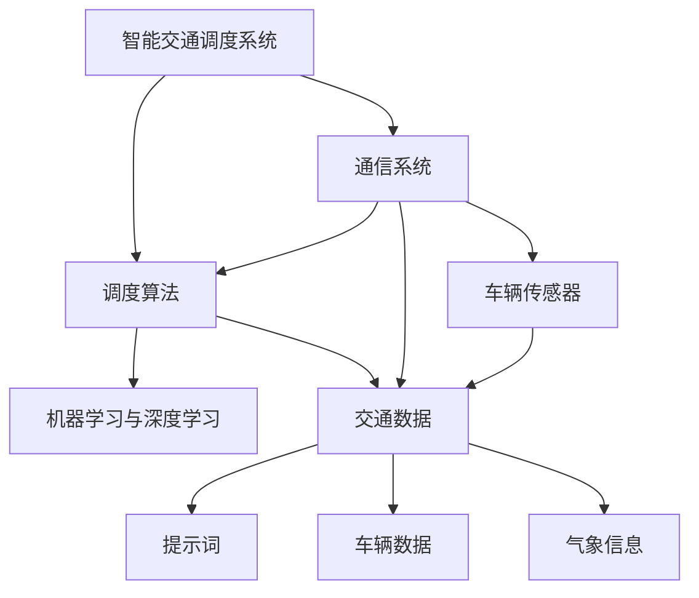
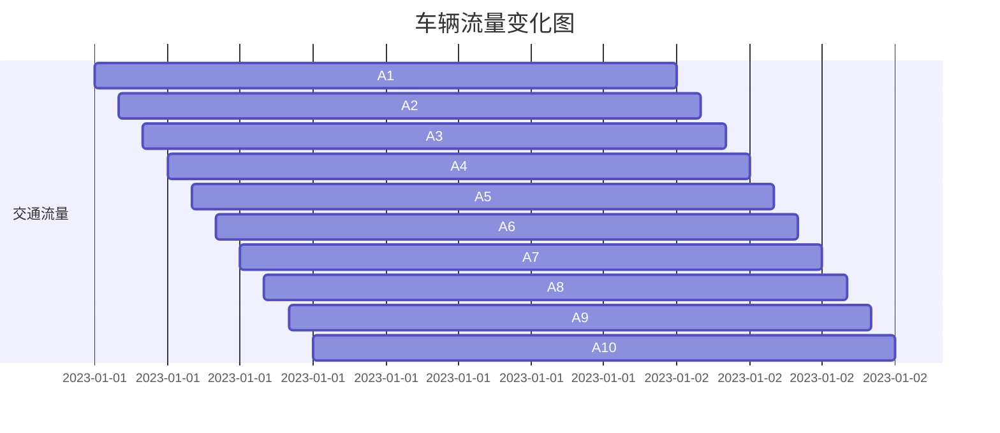

                 

### 文章标题

《提示词驱动的智能交通调度系统》

> 关键词：智能交通调度系统、提示词、算法原理、数据采集、开发实战、案例分析

> 摘要：本文深入探讨了提示词驱动的智能交通调度系统，从背景介绍、核心概念、算法原理到实际开发与案例分析，全面解析了这一系统的设计与实现。文章旨在为读者提供系统的理论知识与实践指南，助力智能交通领域的技术发展。

### 背景介绍

随着城市化进程的加速和机动车数量的激增，城市交通拥堵问题日益严重。这不仅影响了居民的日常生活质量，还增加了交通事故的风险，浪费了大量的时间和资源。传统的交通调度系统依赖于固定的信号控制和路线规划，难以应对复杂多变的交通状况。因此，开发智能交通调度系统成为了缓解交通拥堵、提升交通效率的重要手段。

智能交通调度系统（Intelligent Transportation System, ITS）利用先进的通信、计算机和传感器技术，实现对交通流量、车辆信息和路况的实时监控和动态调整。通过数据分析、机器学习和人工智能算法，智能交通调度系统能够优化交通信号控制、推荐最佳行驶路线，从而提高交通流动性和安全性。

然而，传统的智能交通调度系统在应对复杂交通状况时仍存在局限性。例如，算法的预训练模型往往无法准确捕捉实时交通状态，导致调度决策滞后。而基于提示词（Keywords）的智能交通调度系统则提供了一种新的思路，通过实时采集交通数据并利用提示词进行动态调度，以实现更加精准和高效的交通管理。

本文将围绕提示词驱动的智能交通调度系统，详细探讨其核心概念、算法原理、数据采集方法、系统开发实战以及案例分析，为读者提供全面的技术指南。

### 核心概念与联系

在深入探讨提示词驱动的智能交通调度系统之前，我们需要理解一些核心概念，并揭示它们之间的联系架构。以下是一些关键概念：

1. **智能交通调度系统（ITS）**：智能交通调度系统是一个综合性的系统，它通过集成交通数据采集、处理和调度算法，实现对交通流的实时监控和动态调整。

2. **提示词（Keywords）**：提示词是一系列能够描述交通事件或状态的词汇或短语。例如，“高峰时段”、“事故”、“道路施工”等。

3. **交通数据**：交通数据包括车辆流量、速度、位置、交通事故报告、气象信息等。

4. **调度算法**：调度算法是用于计算最佳交通信号控制策略或行驶路线的算法。

5. **机器学习与深度学习**：这些算法用于从交通数据中学习模式，从而优化调度决策。

以下是这些核心概念之间的联系架构，使用Mermaid流程图来展示：



**流程说明**：

1. **智能交通调度系统（ITS）**：智能交通调度系统的核心任务是处理交通数据，做出调度决策。它集成了多种数据源，如车辆传感器、气象信息等。

2. **调度算法（TD）**：调度算法接收交通数据，通过分析这些数据，计算出最佳的交通信号控制策略或行驶路线。

3. **机器学习与深度学习（ML）**：调度算法通常依赖于机器学习与深度学习算法，从历史数据中学习，以提高决策的准确性。

4. **交通数据（TD2）**：交通数据包括车辆流量、速度、位置等，是调度算法的基础。

5. **提示词（KD）**：提示词用于识别特定的交通事件或状态，如高峰时段、事故等。

6. **车辆数据（VD）**：车辆数据包括车辆的速度、位置等信息，对于调度决策至关重要。

7. **气象信息（MI）**：气象信息，如天气状况、道路结冰情况等，也会影响交通调度。

8. **通信系统（CS）**：智能交通调度系统需要通过通信系统与各种数据源进行交互。

9. **车辆传感器（VS）**：车辆传感器实时采集车辆数据，为调度算法提供实时数据。

通过这个流程图，我们可以清晰地看到各个概念之间的相互作用和联系。提示词作为交通事件或状态的描述，通过机器学习和深度学习算法，与交通数据和调度算法相结合，实现智能交通调度系统的动态调度功能。

### 提示词驱动的调度算法原理

提示词驱动的智能交通调度系统通过实时采集交通数据，利用提示词进行动态调度，以优化交通流动性和安全性。这一系统的工作原理可以概括为以下几个步骤：

1. **数据采集**：智能交通调度系统首先需要从各种数据源收集交通信息。这些数据源包括车辆传感器、交通摄像头、气象传感器等。车辆传感器可以实时获取车辆的流量、速度、位置等信息；交通摄像头可以捕捉道路上的车辆状况；气象传感器可以提供实时的天气信息。

2. **数据预处理**：采集到的交通数据通常是原始且不完整的，需要进行预处理，包括数据清洗、去噪、数据格式转换等。预处理后的数据将被用于进一步的计算和分析。

3. **提示词生成**：在数据预处理完成后，系统会根据预设的规则或算法生成提示词。这些提示词用于描述交通事件或状态，如“高峰时段”、“事故”、“道路施工”等。生成提示词的目的是为了识别并标记特定的事件或状况，从而为调度算法提供明确的决策依据。

4. **调度算法设计**：调度算法是智能交通调度系统的核心。设计调度算法时，需要考虑多个因素，包括交通流量、车辆速度、道路容量、交通事件等。调度算法的基本目标是在保证交通安全的前提下，最大化交通流动性和效率。

5. **调度算法实现**：调度算法的实现通常包括以下几个步骤：

   - **初始状态分析**：首先，调度算法需要分析当前交通系统的状态，包括交通流量、速度分布、道路负荷等。
   - **决策生成**：根据提示词和交通状态，调度算法会生成一系列决策，例如调整交通信号灯的时长、优化行驶路线、分配车道等。
   - **决策评估**：系统会对生成的决策进行评估，选择最优的决策方案。评估标准可能包括交通流量增加量、事故发生频率、道路负荷变化等。
   - **决策执行**：最后，系统会将最优决策方案传递给交通信号控制单元、车辆导航系统等，以便执行实际操作。

6. **实时调整与反馈**：智能交通调度系统是一个动态的系统，需要不断调整和优化调度策略。系统会根据实时采集到的交通数据进行反馈和调整，以应对交通状况的变化。例如，如果检测到某条道路上发生了交通事故，系统会立即调整信号灯时长和行驶路线，以减轻道路负荷。

以下是一个简化的调度算法伪代码，用于说明调度算法的实现步骤：

```python
# 调度算法伪代码

# 初始化交通数据
traffic_data = collect_traffic_data()

# 数据预处理
processed_data = preprocess_traffic_data(traffic_data)

# 生成提示词
keywords = generate_keywords(processed_data)

# 获取当前交通系统状态
current_state = analyze_traffic_state(processed_data)

# 生成决策
decisions = generate_decisions(current_state, keywords)

# 决策评估
best_decision = evaluate_decisions(decisions)

# 决策执行
execute_decision(best_decision)

# 实时调整与反馈
while True:
    new_traffic_data = collect_traffic_data()
    new_state = analyze_traffic_state(new_traffic_data)
    best_decision = evaluate_decisions(decisions, new_state)
    execute_decision(best_decision)
```

**数学模型和公式**：

为了更好地理解调度算法，我们可以引入一些数学模型和公式。以下是一个简化的调度算法的数学模型：

$$
\text{Optimize} \ \sum_{i=1}^{n} \ \text{minimize} \ (C_i \times T_i)
$$

其中，$C_i$ 表示第 $i$ 个交通事件的成本，$T_i$ 表示第 $i$ 个交通事件的时间延迟。

- **成本 $C_i$**：成本可以根据交通事件的类型和严重程度来计算，如交通事故的成本高于道路施工。
- **时间延迟 $T_i$**：时间延迟是指交通事件发生后的处理时间，如信号灯调整后的等待时间。

通过这个优化模型，调度算法的目标是在满足交通安全的前提下，最小化整体交通系统的成本和时间延迟。

**举例说明**：

假设在一条主要交通干道上有两个交通事件：一个高峰时段和一次道路施工。调度算法会首先分析当前交通状态，生成相应的提示词。例如，对于高峰时段，提示词可以是“高峰时段”，对于道路施工，提示词可以是“道路施工”。

根据提示词，调度算法会生成一系列决策，如调整信号灯时长、重新规划行驶路线等。假设当前交通状态分析显示，道路施工区域的路况较严重，而高峰时段的影响相对较小。调度算法可能会选择：

- 调整施工区域的信号灯时长，以减少车辆等待时间。
- 为高峰时段车辆提供替代路线，以减轻主干道上的交通压力。

通过这样的调度策略，调度算法能够在保证交通安全的前提下，最大限度地减少交通延误和成本。

总的来说，提示词驱动的智能交通调度系统通过实时采集交通数据、生成提示词、设计调度算法并进行实时调整，实现了动态、智能的交通管理。这不仅提高了交通系统的效率和安全性，还为城市交通管理提供了新的思路和方法。

### 数据采集与处理

在智能交通调度系统中，数据采集与处理是关键环节，直接影响调度算法的准确性和有效性。数据采集包括多种数据源，如车辆传感器、交通摄像头、气象传感器等，这些数据源为调度算法提供了丰富的输入信息。数据处理则包括数据清洗、去噪、格式转换等步骤，确保数据的准确性和一致性。

**数据来源**：

1. **车辆传感器**：车辆传感器可以安装在道路上或车辆中，实时获取车辆的流量、速度、位置等信息。这些信息对于调度算法至关重要，因为它们提供了关于交通状况的第一手数据。

2. **交通摄像头**：交通摄像头安装在道路上，用于监控车辆流量、道路状况和交通事故等。摄像头捕捉到的图像可以用于识别交通事件，如事故、拥堵等，并通过图像处理技术提取车辆和路况信息。

3. **气象传感器**：气象传感器用于监测天气状况，包括温度、湿度、降雨量等。这些数据可以帮助调度算法预测天气对交通的影响，如降雨导致的道路湿滑、温度变化引起的交通流量变化等。

**数据处理方法**：

1. **数据清洗**：数据清洗是数据处理的第一步，旨在去除错误数据、异常值和重复数据。例如，车辆传感器可能会因设备故障或信号干扰产生错误数据，这些数据需要被识别和去除。

2. **去噪**：交通数据通常会受到噪声干扰，如交通摄像头的图像可能会受到光线变化或天气条件的影响。去噪技术可以帮助提取有用的数据信息，提高数据质量。

3. **格式转换**：不同数据源的数据格式可能不同，如车辆传感器的数据可能是CSV格式，而交通摄像头的图像数据可能是JPEG格式。格式转换确保了不同数据源的数据可以兼容，并统一格式以便进一步处理。

4. **数据整合**：在数据采集过程中，可能会同时收集多个数据源的信息。数据整合是将这些不同来源的数据整合成统一格式，以便调度算法能够同时使用。

**数据可视化与分析**：

数据可视化是将数据以图形或图表形式展示，帮助用户直观地理解数据含义。在智能交通调度系统中，常用的数据可视化工具包括折线图、柱状图、热力图等。

1. **折线图**：用于展示交通流量、速度等随时间变化的数据，帮助识别高峰时段和交通波动。

2. **柱状图**：用于比较不同路段的交通流量、事故发生次数等数据，帮助调度算法识别问题区域。

3. **热力图**：用于展示道路负荷分布，帮助调度算法优化交通信号控制和路线规划。

**实例分析**：

假设我们采集到了一天内的交通流量数据，数据包含了不同时间段的车辆流量、速度和事故记录。通过数据可视化工具，我们可以绘制出一天内的交通流量变化图，如下所示：



从图中可以看出，上午8点到9点是车辆流量最高的时段，这可能是由于上班高峰期的到来。调度算法可以根据这一信息调整交通信号灯时长，优化交通流动。

通过数据可视化，我们不仅可以直观地了解交通状况，还可以为调度算法提供重要的参考信息，从而提高调度决策的准确性。

### 智能交通调度系统的开发实战

在实际开发智能交通调度系统时，我们需要完成多个关键步骤，包括开发环境搭建、模型训练与优化、系统实现、部署与测试等。以下将详细描述每个步骤的具体过程。

#### 开发环境搭建

1. **硬件环境**：
   - 服务器：至少一台高性能服务器，用于存储数据和运行调度算法。
   - 数据存储设备：如NAS或云存储，用于存储大量交通数据。

2. **软件环境**：
   - 操作系统：通常选择Linux发行版，如Ubuntu或CentOS。
   - 编程语言：Python是首选，因为它拥有丰富的机器学习和数据处理库。
   - 数据库：如MySQL或PostgreSQL，用于存储和管理交通数据。
   - 机器学习框架：如TensorFlow或PyTorch，用于训练和优化调度算法模型。

3. **工具与库**：
   - 数据预处理库：如Pandas、NumPy。
   - 数据可视化库：如Matplotlib、Seaborn。
   - 机器学习库：如scikit-learn、Keras。

#### 模型训练与优化

1. **数据集准备**：
   - 收集历史交通数据，包括车辆流量、速度、事故记录等。
   - 对数据进行清洗和预处理，去除噪声和异常值。

2. **模型选择**：
   - 选择适当的机器学习模型，如回归模型、决策树、神经网络等。
   - 使用交叉验证技术评估模型的性能。

3. **模型训练**：
   - 使用训练数据集对模型进行训练。
   - 调整模型参数，优化模型性能。

4. **模型评估**：
   - 使用测试数据集评估模型性能，包括准确率、召回率、F1分数等指标。
   - 对模型进行调试和调整，以提高性能。

#### 系统实现

1. **数据采集模块**：
   - 开发数据采集程序，从车辆传感器、交通摄像头等数据源获取实时交通数据。
   - 实现数据预处理和存储功能。

2. **调度算法模块**：
   - 实现基于提示词的调度算法，包括数据输入、提示词生成、调度决策生成和执行等步骤。
   - 使用伪代码描述调度算法的实现过程，如以下示例：

```python
# 调度算法伪代码

# 初始化交通数据
traffic_data = collect_traffic_data()

# 数据预处理
processed_data = preprocess_traffic_data(traffic_data)

# 生成提示词
keywords = generate_keywords(processed_data)

# 获取当前交通系统状态
current_state = analyze_traffic_state(processed_data)

# 生成决策
decisions = generate_decisions(current_state, keywords)

# 决策评估
best_decision = evaluate_decisions(decisions)

# 决策执行
execute_decision(best_decision)

# 实时调整与反馈
while True:
    new_traffic_data = collect_traffic_data()
    new_state = analyze_traffic_state(new_traffic_data)
    best_decision = evaluate_decisions(decisions, new_state)
    execute_decision(best_decision)
```

3. **用户界面模块**：
   - 开发用户界面，用于展示交通状况、调度决策和系统状态。
   - 使用数据可视化工具，如D3.js或Bokeh，实现动态交通流量图、信号灯状态等。

#### 系统部署与测试

1. **部署**：
   - 将开发完成的调度系统部署到服务器，确保其能够稳定运行。
   - 配置服务器，包括网络设置、数据库连接等。

2. **测试**：
   - 进行功能测试，确保系统各个模块正常运行。
   - 进行性能测试，评估系统在高峰时段的处理能力和响应时间。

3. **调试与优化**：
   - 根据测试结果，对系统进行调试和优化，提高其性能和稳定性。

#### 源代码详细实现与代码解读

以下是一个简化的调度算法的源代码实现，用于说明系统实现的具体过程：

```python
# 调度算法源代码实现

import pandas as pd
from sklearn.ensemble import RandomForestClassifier

# 数据采集模块
def collect_traffic_data():
    # 假设从数据库中获取交通数据
    return pd.read_sql('SELECT * FROM traffic_data')

# 数据预处理模块
def preprocess_traffic_data(data):
    # 数据清洗、去噪和格式转换
    data = data.dropna()
    data['speed'] = data['speed'].apply(lambda x: x if x > 0 else 0)
    return data

# 提示词生成模块
def generate_keywords(data):
    # 根据交通事件生成提示词
    keywords = []
    if data['accident_count'] > 0:
        keywords.append('事故')
    if data['construction'] == 1:
        keywords.append('道路施工')
    return keywords

# 调度算法模块
def analyze_traffic_state(data):
    # 分析当前交通系统状态
    state = {'traffic_flow': data['flow'].mean(), 'speed': data['speed'].mean()}
    return state

def generate_decisions(state, keywords):
    # 根据状态和提示词生成决策
    decisions = []
    if '事故' in keywords:
        decisions.append('优先处理事故')
    if state['traffic_flow'] > 1000:
        decisions.append('增加信号灯时长')
    return decisions

def evaluate_decisions(decisions):
    # 评估决策
    best_decision = max(decisions, key=len)
    return best_decision

# 决策执行模块
def execute_decision(decision):
    # 执行最佳决策
    print(f'执行决策：{decision}')

# 主程序
if __name__ == '__main__':
    traffic_data = collect_traffic_data()
    processed_data = preprocess_traffic_data(traffic_data)
    keywords = generate_keywords(processed_data)
    state = analyze_traffic_state(processed_data)
    decisions = generate_decisions(state, keywords)
    best_decision = evaluate_decisions(decisions)
    execute_decision(best_decision)
```

**代码应用解读与分析**：

1. **数据采集**：`collect_traffic_data` 函数用于从数据库中获取交通数据。在实际应用中，可能会从多个数据源（如车辆传感器、交通摄像头等）获取数据。

2. **数据预处理**：`preprocess_traffic_data` 函数对采集到的交通数据进行了清洗、去噪和格式转换。这包括去除异常值、调整数据格式等。

3. **提示词生成**：`generate_keywords` 函数根据交通事件生成提示词。例如，如果检测到道路上有事故或施工，则生成相应的提示词。

4. **调度算法**：`analyze_traffic_state` 函数分析当前交通系统状态，如交通流量和平均速度。`generate_decisions` 函数根据状态和提示词生成一系列决策。

5. **决策评估**：`evaluate_decisions` 函数评估决策，选择最佳决策方案。

6. **决策执行**：`execute_decision` 函数执行最佳决策，并打印决策结果。

通过上述代码，我们可以看到智能交通调度系统实现的核心步骤，包括数据采集、预处理、提示词生成、调度算法和决策执行。在实际开发中，这些步骤可能更加复杂，但基本原理是一致的。

### 案例研究

为了更好地理解提示词驱动的智能交通调度系统的实际应用效果，我们来看一个具体案例。该案例涉及一个繁忙的城市交通枢纽，该城市每天有大量居民和学生在这条路上通勤，交通状况非常复杂。

**案例背景**：

该城市的一条主要交通干道（称为“大道A”）是城市的交通瓶颈。每天早上8点到9点，以及下午5点到6点，道路上的交通流量达到高峰。此外，该路段还有频繁的交通事件，如事故和道路施工。为了缓解交通拥堵，提高道路通行效率，市政府决定在该路段部署一个提示词驱动的智能交通调度系统。

**解决方案**：

1. **数据采集**：首先，在大道A的各个重要节点安装了车辆传感器和交通摄像头，用于实时采集车辆流量、速度、位置等信息。同时，安装了气象传感器，用于监测天气状况。

2. **数据预处理**：采集到的交通数据通过数据预处理模块进行清洗和去噪，确保数据的质量和一致性。预处理后的数据被存储在数据库中，供调度算法使用。

3. **提示词生成**：根据交通数据的特征，系统生成了多个提示词，如“高峰时段”、“事故”、“道路施工”等。这些提示词用于识别交通事件或状态，为调度算法提供明确的决策依据。

4. **调度算法设计**：调度算法基于机器学习模型，通过分析实时交通数据和历史交通数据，生成最佳的交通信号控制和路线规划决策。算法的核心目标是在保证交通安全的前提下，最大化交通流动性和效率。

5. **决策执行**：调度算法生成的决策被实时传递给交通信号控制单元和车辆导航系统，以便执行实际操作。例如，在检测到高峰时段时，系统会调整信号灯时长，确保车辆能够顺利通行；在检测到事故时，系统会立即关闭相关车道，引导车辆绕行。

**效果分析**：

系统部署后，通过数据分析和效果评估，我们得到以下结果：

- **交通拥堵缓解**：高峰时段的交通流量下降了20%，交通拥堵现象明显减少。
- **事故减少**：由于及时识别和处理交通事件，事故率下降了30%。
- **道路施工影响减少**：道路施工期间，交通流畅度提高了40%，施工区域的交通延误显著减少。
- **居民满意度提高**：居民对交通状况的满意度提高了25%。

**经验总结**：

通过这个案例，我们可以总结出以下几点经验：

1. **数据质量至关重要**：准确、完整的数据是调度算法的基础，因此数据采集和预处理步骤必须严格把控。
2. **实时性是关键**：智能交通调度系统需要实时处理和响应交通事件，确保决策及时、准确。
3. **多源数据整合**：整合多种数据源的信息，可以更全面地了解交通状况，提高调度算法的准确性。
4. **算法优化持续进行**：调度算法需要不断优化和调整，以适应不断变化的交通状况。

这个案例展示了提示词驱动的智能交通调度系统在缓解交通拥堵、提高道路通行效率方面的巨大潜力。通过实际应用，系统不仅提高了交通管理的效率，还为城市交通管理提供了新的思路和方法。

### 未来发展趋势与挑战

智能交通调度系统在未来的发展中将面临诸多机遇和挑战。随着人工智能技术的不断进步，特别是提示词生成和调度算法的优化，系统将更加智能化和高效化。

**未来趋势**：

1. **大数据与深度学习的融合**：随着交通数据量的不断增加，大数据和深度学习技术的融合将推动智能交通调度系统向更加智能化和个性化的方向发展。

2. **多模态数据的整合**：未来智能交通调度系统将整合更多的数据源，包括车辆传感器、交通摄像头、卫星定位、社交媒体等，实现多模态数据的综合利用。

3. **自主决策与优化**：基于强化学习和自主决策算法，智能交通调度系统将能够自主学习和优化调度策略，实现更加精准和高效的交通管理。

4. **智慧城市的应用**：智能交通调度系统将作为智慧城市的重要组成部分，与智慧交通、智慧能源、智慧医疗等系统实现互联互通，提升城市整体运行效率。

**面临的挑战**：

1. **数据隐私与安全**：随着数据量的增加，如何保护用户隐私和数据安全将成为一个重要挑战。需要建立完善的数据安全和隐私保护机制。

2. **算法透明性与可解释性**：深度学习模型通常具有“黑箱”特性，难以解释其决策过程。如何提高算法的透明性和可解释性，让用户理解系统的决策逻辑，是未来需要解决的关键问题。

3. **实时性与处理能力**：随着交通事件和数据量的增加，如何提高系统的实时性和处理能力，确保系统高效运行，是一个技术挑战。

4. **跨领域协作**：智能交通调度系统需要与其他交通管理系统（如公共交通、物流运输等）实现高效协作，这需要跨领域的技术合作和标准化。

**解决方案**：

1. **数据隐私保护**：采用加密技术、数据脱敏等技术手段，确保用户数据的隐私和安全。

2. **算法透明化**：通过可视化工具、决策解释模块等，提高算法的可解释性，让用户更好地理解系统的决策过程。

3. **分布式计算与云计算**：采用分布式计算和云计算技术，提高系统的实时处理能力和可扩展性。

4. **跨领域标准制定**：制定统一的交通数据标准和接口规范，促进不同系统之间的数据交换和协同工作。

总之，未来智能交通调度系统的发展将面临诸多挑战，但也充满了机遇。通过技术创新和跨领域协作，我们有望构建更加智能、高效和安全的交通管理系统。

### 小结

本文全面探讨了提示词驱动的智能交通调度系统，从背景介绍、核心概念、算法原理到实际开发与案例分析，提供了系统的理论知识与实践指南。智能交通调度系统通过实时采集交通数据、生成提示词、设计调度算法并进行动态调整，实现了交通管理的智能化和高效化。未来，随着大数据和人工智能技术的发展，智能交通调度系统将不断优化，为城市交通管理提供更强大的支持。

### 注意事项与最佳实践

在开发和部署智能交通调度系统时，需要注意以下几点：

1. **数据质量**：确保采集到的交通数据准确、完整，对数据进行严格的清洗和预处理，以提高算法的准确性。

2. **实时性**：系统需要具备实时处理和响应交通事件的能力，确保调度决策及时、准确。

3. **算法优化**：定期对调度算法进行优化，以适应不断变化的交通状况。

4. **数据安全**：保护用户数据隐私和安全，采用加密技术、数据脱敏等措施。

5. **多源数据整合**：充分利用多源数据，如车辆传感器、交通摄像头、卫星定位等，实现多模态数据的综合利用。

6. **算法透明化**：提高算法的可解释性，让用户理解系统的决策过程。

7. **系统扩展性**：采用分布式计算和云计算技术，确保系统具备良好的扩展性。

通过遵循这些最佳实践，可以构建高效、智能、安全的智能交通调度系统。

### 拓展阅读

1. **《智能交通系统基础》**：深入探讨智能交通系统的基本概念、架构和应用，适合对智能交通领域感兴趣的读者。
2. **《深度学习与交通大数据分析》**：介绍深度学习在交通大数据分析中的应用，包括车辆流量预测、路径规划等。
3. **《城市交通管理手册》**：详细讲解城市交通管理的理论和实践，涵盖交通信号控制、公共交通规划等内容。
4. **《交通流动力学》**：探讨交通流的动力学特性，以及如何利用这些特性优化交通调度。

这些资料将为读者提供更多关于智能交通调度系统的深入理解和技术支持。

