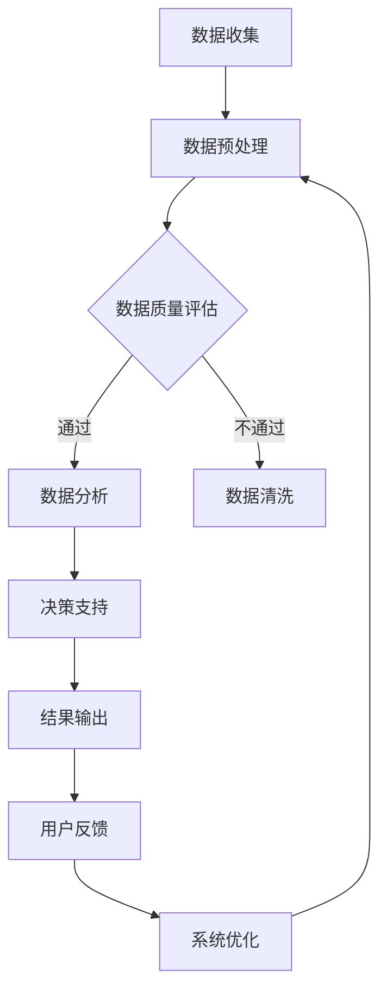

                 

### 第一部分：系统概述

#### 第1章：系统背景与目标

**关键词**：智能人力资源管理，提示词驱动，系统目标，设计理念

在当今快速发展的数字经济时代，企业对于人力资源管理的需求日益增长，尤其是如何在复杂多变的市场环境中实现人力资源的优化配置和高效管理。传统的HR管理系统在处理大量数据、应对多样化需求时，常常显得力不从心。这就迫切需要一种新的管理模式，以应对未来人力资源管理的挑战。

**核心概念与联系**

智能人力资源管理（Smart Human Resource Management）指的是利用人工智能、大数据、机器学习等先进技术，对人力资源进行自动化、智能化管理。而提示词驱动（Keyword-Driven）机制则是智能人力资源管理的一种核心思想，通过输入特定的关键词来触发相应的分析和决策。

**系统目标**

智能人力资源管理系统的主要目标有以下几点：

1. **自动化数据处理**：通过人工智能技术自动处理大量的HR数据，减少人工工作量。
2. **优化决策支持**：利用机器学习算法，为企业提供数据驱动的决策支持。
3. **提升管理效率**：通过智能化手段，提高HR管理的效率，降低管理成本。
4. **个性化服务**：根据员工的个性化需求，提供定制化的服务和支持。

**设计理念**

智能人力资源管理系统设计遵循以下理念：

1. **灵活性**：系统应能够灵活应对不同企业的需求，具备高度可定制性。
2. **可扩展性**：系统架构应支持未来的技术升级和功能扩展。
3. **用户体验**：注重用户交互体验，确保系统易用、直观。
4. **数据安全**：严格保护用户数据安全，确保系统稳定可靠。

**Mermaid 流程图**

以下是智能人力资源管理系统的一个简化的流程图，展示了系统的主要模块和流程：

通过这张流程图，我们可以看到数据从收集到最终输出结果的全过程，以及各环节之间的逻辑关系。

**结论**

本章介绍了智能人力资源管理系统的发展背景、目标与设计理念。下一章将详细探讨系统的架构设计，包括核心组件和技术选型。在理解了系统的总体架构之后，读者将能够更深入地理解后续章节的内容。

---

在接下来的章节中，我们将逐步深入探讨智能人力资源管理系统中的核心模块设计、实现细节、算法原理以及实际应用案例。希望读者能够通过逐步推理和分析，对系统的整体框架和实现方法有更加清晰的认识。请继续关注下一章的内容。

