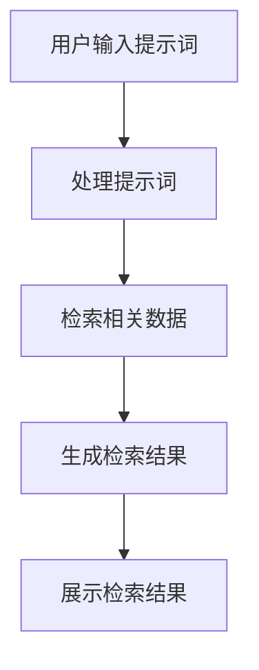
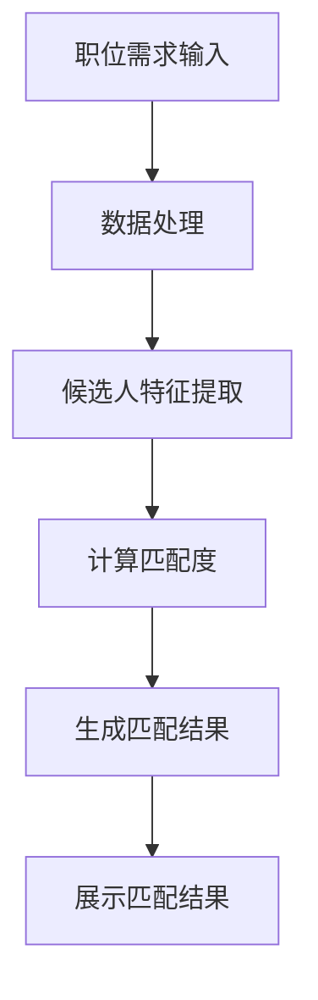

                 


### 文章标题：提示词驱动的智能人力资源：人才匹配与发展

### 文章关键词：
- 智能人力资源
- 提示词驱动
- 人才匹配
- 发展策略
- 人工智能算法

### 文章摘要：
本文探讨了提示词驱动的智能人力资源管理模式，分析了其在人才匹配与发展中的应用。文章首先介绍了智能人力资源的背景和传统人力资源管理的挑战，然后详细阐述了提示词驱动的概念及其优势。接着，文章深入分析了人才匹配的基本原理和算法，并通过Mermaid流程图展示了核心概念之间的联系。文章最后，通过实际项目案例展示了如何实现智能人才匹配与发展，并提出了相关的最佳实践和注意事项。

## 第一部分：引论

### 第1章 智能人力资源概述

#### 1.1 人力资源的重要性

人力资源是企业最宝贵的资产，对于组织的成功至关重要。传统的人力资源管理主要侧重于招聘、培训、绩效管理和薪酬福利等方面，然而，随着全球化和信息技术的发展，传统的人力资源管理模式面临着诸多挑战。首先，随着人才竞争的加剧，如何快速、准确地找到符合组织需求的人才成为一项艰巨的任务。其次，传统的绩效管理和薪酬体系往往缺乏灵活性和个性化，难以激发员工的工作热情和创新能力。此外，传统的招聘渠道和方式也难以适应快速变化的就业市场。

#### 1.2 传统人力资源管理的挑战

传统的人力资源管理面临着以下几个方面的挑战：

1. 招聘效率低：传统招聘方式通常需要较长时间来筛选合适的候选人，而且容易受到人为因素的影响，导致招聘效率低下。
2. 人才流失：由于缺乏有效的员工发展机制，员工往往容易感到职业发展受限，进而选择离开公司。
3. 绩效管理不完善：传统的绩效管理体系往往缺乏客观性，难以准确地评估员工的绩效，进而影响员工的激励机制。
4. 薪酬体系不合理：传统的薪酬体系往往与员工的工作贡献不成正比，导致员工的工作积极性受到打击。
5. 员工培训不足：传统的人力资源管理往往忽视了员工的培训和职业发展，导致员工的专业技能和综合素质难以提高。

#### 1.3 智能人力资源的定义与价值

智能人力资源是指利用人工智能技术，特别是机器学习和大数据分析等方法，对人力资源进行管理的一种新型管理模式。智能人力资源的核心目标是提高人力资源管理的效率、准确性和灵活性，从而帮助企业更好地吸引、培养和发展人才。

智能人力资源的价值主要体现在以下几个方面：

1. 提高招聘效率：通过大数据分析和机器学习算法，智能人力资源可以快速筛选出符合组织需求的候选人，提高招聘效率。
2. 减少人才流失：通过精准的人才匹配和发展策略，智能人力资源可以降低员工流失率，提高员工的满意度和忠诚度。
3. 完善绩效管理：智能人力资源可以基于大数据分析和算法模型，客观、公正地评估员工的绩效，为薪酬激励提供科学依据。
4. 优化薪酬体系：智能人力资源可以根据员工的工作贡献和市场需求，动态调整薪酬水平，提高薪酬的公平性和竞争力。
5. 强化员工培训：智能人力资源可以基于员工的职业发展规划，提供个性化的培训方案，提高员工的综合素质和技能水平。

### 1.4 提示词驱动在智能人力资源中的应用

提示词驱动是一种基于自然语言处理和机器学习技术的智能信息检索方法。在智能人力资源管理中，提示词驱动可以应用于以下几个方面：

1. 招聘信息发布：通过分析职位描述和候选人简历，智能人力资源系统可以自动生成合适的招聘信息，并发布到合适的渠道，提高招聘的精准度和覆盖面。
2. 候选人筛选：基于候选人的关键词匹配和综合评估，智能人力资源系统可以自动筛选出最符合条件的候选人，减少人工筛选的工作量。
3. 员工绩效评估：通过分析员工的日常工作内容和绩效指标，智能人力资源系统可以自动生成绩效评估报告，为绩效管理和薪酬激励提供依据。
4. 职业发展规划：基于员工的兴趣、能力和市场需求，智能人力资源系统可以自动推荐个性化的职业发展路径和培训课程，帮助员工实现职业成长。
5. 员工满意度调查：通过分析员工反馈的关键词和情感倾向，智能人力资源系统可以自动生成员工满意度报告，为改进员工福利和工作环境提供参考。

## 第二部分：智能人力资源的架构与系统

### 第2章 智能人力资源系统的组成

#### 2.1 智能人力资源系统的组成

智能人力资源系统通常由以下几个关键组件组成：

1. 数据收集与管理：智能人力资源系统需要收集与人力资源管理相关的各种数据，包括员工信息、职位需求、招聘信息、绩效数据、薪酬数据等。这些数据需要存储在高效、安全、可扩展的数据管理系统中，以便进行后续处理和分析。

2. 提示词驱动引擎：提示词驱动引擎是智能人力资源系统的核心组件，负责处理用户输入的提示词，并生成相关的检索结果。该引擎通常基于自然语言处理（NLP）和机器学习（ML）技术，能够对文本进行语义分析和理解，从而实现智能化的信息检索和推荐。

3. 人才匹配算法：人才匹配算法用于将候选人与职位需求进行匹配，以找到最合适的候选人。这些算法通常基于机器学习、数据挖掘和推荐系统等技术，能够通过分析候选人和职位的多维度特征，实现高精度的匹配。

4. 绩效评估模型：绩效评估模型用于对员工的工作表现进行量化评估。这些模型通常基于大数据分析和统计方法，能够客观、公正地评估员工的绩效，为绩效管理和薪酬激励提供依据。

5. 职业发展规划系统：职业发展规划系统用于帮助员工制定个性化的职业发展计划，并提供相关的培训资源和指导。该系统通常基于员工的兴趣、能力和市场需求，能够自动生成职业发展路径和培训课程推荐。

6. 用户界面：用户界面是智能人力资源系统与用户进行交互的窗口。通过直观、易用的用户界面，用户可以方便地浏览和管理人力资源相关的信息，进行招聘、绩效评估、职业发展规划等操作。

#### 2.2 智能人力资源系统架构

智能人力资源系统的架构可以分为以下几个层次：

1. 数据层：数据层负责存储和管理与人力资源管理相关的各种数据，包括员工信息、职位信息、绩效数据、薪酬数据等。这些数据通常存储在关系型数据库或NoSQL数据库中，以支持高效的数据查询和操作。

2. 服务层：服务层负责提供智能人力资源系统的核心功能和服务，包括数据收集与管理、提示词驱动引擎、人才匹配算法、绩效评估模型、职业发展规划系统等。这些服务通常采用微服务架构，以实现高可用性、可扩展性和可维护性。

3. 表示层：表示层负责提供用户界面，使用户能够方便地浏览和管理人力资源相关的信息。表示层通常采用前端技术（如HTML、CSS和JavaScript）和Web框架（如React、Vue.js等）来实现。

4. 安全层：安全层负责确保智能人力资源系统的数据安全和用户隐私。安全层通常包括身份验证、访问控制、数据加密和网络安全等措施，以防止未经授权的访问和攻击。

#### 2.3 智能人力资源系统的运行机制

智能人力资源系统的运行机制主要包括以下几个步骤：

1. 数据收集与处理：系统通过内部接口或外部API收集与人力资源管理相关的数据，如员工信息、职位信息、绩效数据等。收集到的数据经过清洗、转换和集成，以便后续分析使用。

2. 数据存储与管理：系统将处理后的数据存储在数据管理系统中，如关系型数据库或NoSQL数据库。数据管理系统提供高效的数据查询和操作功能，以支持系统的正常运行。

3. 提示词处理与检索：用户通过用户界面输入提示词，如职位名称、关键字等，系统会根据提示词进行文本分析和理解，并生成相关的检索结果。

4. 人才匹配与推荐：系统根据人才匹配算法对候选人和职位进行匹配，推荐最符合条件的候选人。人才匹配算法会综合考虑候选人和职位的多维度特征，如技能、经验、教育背景等。

5. 绩效评估与反馈：系统根据绩效评估模型对员工的工作表现进行量化评估，生成绩效评估报告。绩效评估报告为绩效管理和薪酬激励提供依据，同时帮助员工了解自己的工作表现。

6. 职业发展规划与培训：系统根据员工的兴趣、能力和市场需求，为员工提供个性化的职业发展路径和培训课程推荐。员工可以根据自己的需求和兴趣选择合适的课程和路径，提升自己的综合素质和技能水平。

7. 用户交互与反馈：用户通过用户界面浏览和管理人力资源相关的信息，进行招聘、绩效评估、职业发展规划等操作。用户还可以对系统的运行效果和性能进行反馈，以便系统优化和改进。

## 第三部分：核心概念与联系

### 第3章 提示词驱动的理论基础

#### 3.1 提示词驱动的概念

提示词驱动（Query-Driven）是一种基于用户输入提示词进行信息检索和推荐的方法。在智能人力资源管理中，提示词驱动主要用于以下几个方面：

1. 招聘信息发布：用户输入职位名称、关键词等信息，系统会根据这些提示词生成招聘信息，并发布到合适的渠道。
2. 候选人筛选：用户输入候选人姓名、关键字等信息，系统会根据这些提示词筛选出符合条件的候选人。
3. 绩效评估：用户输入员工的姓名、关键字等信息，系统会根据这些提示词生成绩效评估报告。
4. 职业发展规划：用户输入员工的兴趣、关键字等信息，系统会根据这些提示词推荐个性化的职业发展路径和培训课程。

#### 3.2 提示词驱动的优势与局限

提示词驱动的优势主要体现在以下几个方面：

1. 灵活性：提示词驱动允许用户根据需求灵活输入提示词，从而快速获取所需信息。
2. 可扩展性：提示词驱动的架构相对简单，易于扩展和升级，以适应不断变化的需求。
3. 个性化：提示词驱动可以根据用户输入的提示词，为用户提供个性化的信息检索和推荐结果。

提示词驱动的局限主要体现在以下几个方面：

1. 需要用户参与：提示词驱动依赖于用户的主动输入，因此在某些情况下，可能无法满足用户的隐性需求。
2. 数据质量：提示词驱动的效果受到用户输入的数据质量的影响，如果用户输入的提示词不准确或不完整，可能导致检索结果不理想。
3. 处理复杂查询：提示词驱动在处理复杂查询方面存在一定的局限，对于涉及多个关键字或逻辑关系的查询，可能需要更高级的查询处理方法。

#### 3.3 提示词驱动的应用场景

提示词驱动的应用场景主要包括以下几个方面：

1. 招聘与人才管理：在招聘过程中，用户可以根据职位名称、关键词等信息输入提示词，快速筛选合适的候选人。
2. 绩效管理：在绩效管理过程中，用户可以根据员工姓名、关键字等信息输入提示词，生成绩效评估报告。
3. 培训与发展：在员工培训和职业发展过程中，用户可以根据员工兴趣、关键字等信息输入提示词，推荐个性化的培训课程和职业发展路径。
4. 人力资源数据分析：在人力资源数据分析过程中，用户可以根据关键字、时间范围等信息输入提示词，快速获取相关数据。

#### 3.4 提示词驱动的流程图

为了更好地理解提示词驱动的运行过程，我们使用Mermaid流程图展示了其基本流程：



1. 用户输入提示词：用户通过用户界面输入职位名称、关键字、员工姓名等信息。
2. 处理提示词：系统对用户输入的提示词进行预处理，如分词、停用词过滤、词性标注等，以便后续处理。
3. 检索相关数据：系统根据处理后的提示词，在数据库中检索相关数据，如候选人信息、职位信息、绩效数据等。
4. 生成检索结果：系统根据检索结果生成相应的信息，如候选人列表、绩效评估报告、培训课程推荐等。
5. 展示检索结果：系统将检索结果通过用户界面展示给用户，以便用户进行后续操作。

通过提示词驱动的流程图，我们可以清晰地看到提示词驱动的运行过程和关键环节，为智能人力资源管理提供了有效的理论支持。

### 第4章 人才匹配原理

#### 4.1 人才匹配的基本概念

人才匹配（Talent Matching）是指根据职位需求和候选人特征，寻找最符合职位要求的候选人。人才匹配是智能人力资源管理的重要组成部分，其核心目标是提高招聘效率、降低招聘成本，并确保企业能够获得最优秀的人才。

人才匹配的基本概念包括以下几个方面：

1. 职位需求：职位需求是指企业对特定职位所需技能、经验、教育背景等要求的描述。职位需求通常包括职位名称、职责描述、任职资格等。

2. 候选人特征：候选人特征是指候选人在技能、经验、教育背景、工作态度等方面的表现。候选人特征通常包括简历信息、工作经历、项目经验、技能证书等。

3. 人才匹配度：人才匹配度是指候选人特征与职位需求之间的匹配程度。人才匹配度通常通过计算候选人特征与职位需求的相似度来衡量。

#### 4.2 人才匹配的模型与方法

人才匹配的模型与方法主要包括以下几种：

1. 基于规则的匹配模型：基于规则的匹配模型是一种传统的人才匹配方法，通过定义一系列规则，将候选人与职位需求进行匹配。这种方法通常适用于规则明确、结构简单的场景。

2. 基于统计的匹配模型：基于统计的匹配模型使用统计学方法，计算候选人与职位需求的相似度，并根据相似度值进行匹配。这种方法通常适用于具有大量数据且规则不明确或复杂的场景。

3. 基于机器学习的匹配模型：基于机器学习的匹配模型使用机器学习方法，如监督学习、无监督学习和深度学习等，建立候选人特征与职位需求之间的预测模型。这种方法通常具有更高的匹配精度和灵活性。

4. 基于推荐系统的匹配模型：基于推荐系统的匹配模型使用推荐系统算法，如协同过滤、矩阵分解、基于内容的推荐等，为候选人和职位提供个性化的推荐。这种方法通常适用于大规模数据和高维度特征的匹配场景。

#### 4.3 人才匹配的挑战与解决方案

人才匹配在智能人力资源管理中面临着以下挑战：

1. 数据质量：人才匹配的效果受到数据质量的影响。如果候选人特征和职位需求的数据不准确或不完整，可能导致匹配结果的偏差。

解决方案：对数据质量进行严格把控，确保数据的准确性和完整性。采用数据清洗和预处理技术，如缺失值处理、异常值检测和归一化等，提高数据质量。

2. 数据维度：人才匹配通常涉及大量高维度数据，如简历、工作经历、项目经验等。高维度数据可能导致匹配计算复杂度增加，影响匹配效率。

解决方案：采用降维技术，如主成分分析（PCA）、因子分析等，降低数据的维度，提高匹配效率。同时，使用特征选择技术，筛选出对匹配结果影响较大的关键特征。

3. 可解释性：基于机器学习和推荐系统的匹配模型具有较高的精度，但往往缺乏可解释性，难以理解匹配结果的原因。

解决方案：采用可解释性机器学习（Explainable AI）方法，如决策树、LIME等，为匹配结果提供可解释性。同时，在模型开发和部署过程中，注重模型的透明性和可解释性。

4. 实时性：在招聘过程中，实时性是人才匹配的重要要求。传统的匹配方法通常需要较长的计算时间，难以满足实时性要求。

解决方案：采用分布式计算和并行计算技术，提高匹配计算的速度。同时，采用增量匹配和实时反馈机制，实现对实时数据的快速匹配和处理。

#### 4.4 人才匹配的Mermaid流程图

为了更好地理解人才匹配的流程，我们使用Mermaid流程图展示了其基本流程：



1. 职位需求输入：用户通过用户界面输入职位需求，包括职位名称、职责描述、任职资格等。

2. 数据处理：系统对输入的职位需求进行预处理，如分词、停用词过滤、词性标注等，以便后续处理。

3. 候选人特征提取：系统从候选人简历中提取相关特征，如技能、经验、教育背景等。

4. 计算匹配度：系统使用匹配算法，如基于规则的匹配、基于统计的匹配、基于机器学习的匹配等，计算候选人特征与职位需求之间的匹配度。

5. 生成匹配结果：系统根据匹配度值，生成候选人与职位的匹配结果。

6. 展示匹配结果：系统将匹配结果通过用户界面展示给用户，以便用户进行后续操作。

通过人才匹配的Mermaid流程图，我们可以清晰地看到人才匹配的运行过程和关键环节，为智能人力资源管理提供了有效的理论支持。

### 第5章 机器学习算法在人才匹配中的应用

#### 5.1 机器学习算法概述

机器学习（Machine Learning）是一种通过训练数据自动提取规律和模式的技术，其核心目标是使计算机能够从数据中学习并做出决策。在人才匹配领域，机器学习算法被广泛应用于候选人特征与职位需求的匹配过程中。以下是一些常见的机器学习算法及其在人才匹配中的应用：

1. **监督学习算法**：

   - **线性回归（Linear Regression）**：线性回归算法通过建立输入特征与目标变量之间的线性关系，实现预测和分类任务。在人才匹配中，线性回归可以用于预测候选人匹配度。
   
   - **逻辑回归（Logistic Regression）**：逻辑回归是一种广义线性模型，用于分类问题。在人才匹配中，逻辑回归可以用于预测候选人是否满足职位要求。

   - **支持向量机（Support Vector Machine, SVM）**：SVM通过寻找最优决策边界，将候选人和职位划分为不同的类别。在人才匹配中，SVM可以用于分类候选人是否匹配特定职位。

   - **决策树（Decision Tree）**：决策树通过一系列的判断条件，将候选人和职位划分为不同的类别。在人才匹配中，决策树可以用于生成候选人和职位之间的匹配规则。

2. **无监督学习算法**：

   - **聚类算法（Clustering Algorithm）**：聚类算法将相似的数据点归为同一类别，以便进行后续分析。在人才匹配中，聚类算法可以用于识别具有相似技能和经验的候选人群体。

   - **主成分分析（Principal Component Analysis, PCA）**：PCA通过降维技术，将高维数据映射到低维空间，以简化数据分析。在人才匹配中，PCA可以用于降低候选人和职位特征的维度，提高匹配效率。

   - **关联规则学习（Association Rule Learning）**：关联规则学习通过分析候选人和职位特征之间的关联关系，识别出潜在的匹配模式。在人才匹配中，关联规则学习可以用于发现候选人和职位之间的隐含关系。

3. **深度学习算法**：

   - **神经网络（Neural Network）**：神经网络通过模拟人脑的神经网络结构，实现复杂的特征学习和模式识别。在人才匹配中，神经网络可以用于建立候选人和职位之间的非线性匹配模型。

   - **卷积神经网络（Convolutional Neural Network, CNN）**：CNN通过卷积操作，捕捉图像中的局部特征，适用于处理图像和文本数据。在人才匹配中，CNN可以用于提取候选人简历中的关键信息。

   - **循环神经网络（Recurrent Neural Network, RNN）**：RNN通过循环结构，处理序列数据，适用于处理时间序列数据和文本数据。在人才匹配中，RNN可以用于分析候选人工作经历和项目经验。

#### 5.2 常用机器学习算法在人才匹配中的应用

以下是一些常用机器学习算法在人才匹配中的具体应用：

1. **线性回归**：

   ```python
   # 线性回归的伪代码示例
   from sklearn.linear_model import LinearRegression

   # 加载训练数据
   X_train = ...  # 候选人特征矩阵
   y_train = ...  # 候选人匹配度标签

   # 创建线性回归模型
   model = LinearRegression()

   # 训练模型
   model.fit(X_train, y_train)

   # 预测新候选人的匹配度
   X_test = ...  # 新候选人特征矩阵
   y_pred = model.predict(X_test)
   ```

2. **逻辑回归**：

   ```python
   # 逻辑回归的伪代码示例
   from sklearn.linear_model import LogisticRegression

   # 加载训练数据
   X_train = ...  # 候选人特征矩阵
   y_train = ...  # 候选人匹配度标签（0或1）

   # 创建逻辑回归模型
   model = LogisticRegression()

   # 训练模型
   model.fit(X_train, y_train)

   # 预测新候选人的匹配度
   X_test = ...  # 新候选人特征矩阵
   y_pred = model.predict(X_test)
   ```

3. **支持向量机**：

   ```python
   # 支持向量机的伪代码示例
   from sklearn.svm import SVC

   # 加载训练数据
   X_train = ...  # 候选人特征矩阵
   y_train = ...  # 候选人匹配度标签（0或1）

   # 创建支持向量机模型
   model = SVC()

   # 训练模型
   model.fit(X_train, y_train)

   # 预测新候选人的匹配度
   X_test = ...  # 新候选人特征矩阵
   y_pred = model.predict(X_test)
   ```

4. **决策树**：

   ```python
   # 决策树的伪代码示例
   from sklearn.tree import DecisionTreeClassifier

   # 加载训练数据
   X_train = ...  # 候选人特征矩阵
   y_train = ...  # 候选人匹配度标签（0或1）

   # 创建决策树模型
   model = DecisionTreeClassifier()

   # 训练模型
   model.fit(X_train, y_train)

   # 预测新候选人的匹配度
   X_test = ...  # 新候选人特征矩阵
   y_pred = model.predict(X_test)
   ```

5. **聚类算法**：

   ```python
   # 聚类算法的伪代码示例
   from sklearn.cluster import KMeans

   # 加载候选人特征数据
   X = ...  # 候选人特征矩阵

   # 使用K均值聚类算法
   model = KMeans(n_clusters=3)

   # 训练模型
   model.fit(X)

   # 预测新候选人的聚类结果
   X_test = ...  # 新候选人特征矩阵
   y_pred = model.predict(X_test)
   ```

6. **神经网络**：

   ```python
   # 神经网络的伪代码示例
   from keras.models import Sequential
   from keras.layers import Dense, Activation

   # 创建神经网络模型
   model = Sequential()
   model.add(Dense(units=64, input_dim=X_train.shape[1]))
   model.add(Activation('relu'))
   model.add(Dense(units=1, activation='sigmoid'))

   # 编译模型
   model.compile(optimizer='adam', loss='binary_crossentropy', metrics=['accuracy'])

   # 训练模型
   model.fit(X_train, y_train, epochs=10, batch_size=32)

   # 预测新候选人的匹配度
   X_test = ...  # 新候选人特征矩阵
   y_pred = model.predict(X_test)
   ```

通过上述机器学习算法的应用，我们可以看到机器学习在人才匹配中的强大能力。然而，实际应用中，需要根据具体场景和数据特点选择合适的算法，并不断优化和调整模型参数，以实现最佳匹配效果。

### 第6章 推荐系统算法在人才匹配中的应用

#### 6.1 推荐系统基本原理

推荐系统（Recommendation System）是一种基于用户的历史行为、兴趣和偏好，为用户推荐相关商品、内容或服务的信息系统。在人才匹配中，推荐系统可以帮助企业发现和推荐符合职位需求的候选人，提高招聘效率。以下是推荐系统的一些基本原理：

1. **协同过滤（Collaborative Filtering）**：

   - **用户基于的协同过滤（User-Based Collaborative Filtering）**：用户基于的协同过滤通过寻找与目标用户相似的其他用户，并推荐这些用户喜欢的候选人。这种方法通常使用用户行为数据，如职位浏览、面试反馈等，计算用户之间的相似度。

   - **物品基于的协同过滤（Item-Based Collaborative Filtering）**：物品基于的协同过滤通过分析候选人和职位之间的相似性，为用户推荐相似的候选人。这种方法通常使用职位特征数据，如技能标签、工作职责等，计算候选人和职位之间的相似度。

2. **基于内容的推荐（Content-Based Recommendation）**：

   - 基于内容的推荐通过分析候选人和职位的特征信息，找到具有相似属性的候选人和职位，并将这些信息推荐给用户。这种方法通常使用关键词提取、文本分类等技术，对候选人和职位进行特征提取和相似度计算。

3. **混合推荐（Hybrid Recommendation）**：

   - 混合推荐结合了协同过滤和基于内容的推荐方法，以综合利用用户行为数据和内容特征，提高推荐效果。混合推荐系统可以根据不同的场景和数据特点，动态调整推荐策略。

#### 6.2 推荐系统算法在人才匹配中的应用

以下是一些推荐系统算法在人才匹配中的应用：

1. **用户基于的协同过滤**：

   ```python
   # 用户基于的协同过滤的伪代码示例
   from sklearn.neighbors import NearestNeighbors

   # 加载用户行为数据
   user_behavior = ...  # 用户行为矩阵，行代表用户，列代表行为（如职位浏览、面试反馈等）

   # 创建K最近邻模型
   model = NearestNeighbors(n_neighbors=5)

   # 训练模型
   model.fit(user_behavior)

   # 搜索与目标用户最相似的5个用户
   neighbors = model.kneighbors([target_user], n_neighbors=5)

   # 推荐相似用户喜欢的候选人
   recommended_candidates = ...  # 根据相似用户的行为推荐候选人
   ```

2. **物品基于的协同过滤**：

   ```python
   # 物品基于的协同过滤的伪代码示例
   from sklearn.metrics.pairwise import cosine_similarity

   # 加载职位特征数据
   job_features = ...  # 职位特征矩阵，行代表职位，列代表特征（如技能标签、工作职责等）

   # 计算职位特征之间的余弦相似度
   similarity_matrix = cosine_similarity(job_features)

   # 为目标职位推荐相似的职位
   target_job = ...  # 目标职位索引
   similar_jobs = ...  # 根据职位特征相似度推荐相似的职位
   ```

3. **基于内容的推荐**：

   ```python
   # 基于内容的推荐的伪代码示例
   from sklearn.feature_extraction.text import TfidfVectorizer

   # 加载候选人简历文本
   resumes = ...  # 候选人简历文本列表

   # 创建TF-IDF向量器
   vectorizer = TfidfVectorizer()

   # 将文本转换为向量
   resume_vectors = vectorizer.fit_transform(resumes)

   # 计算简历之间的余弦相似度
   similarity_matrix = cosine_similarity(resume_vectors)

   # 为目标职位推荐相似的候选人
   target_resume = ...  # 目标简历索引
   similar_resumes = ...  # 根据简历相似度推荐相似的候选人
   ```

4. **混合推荐**：

   ```python
   # 混合推荐的伪代码示例
   from sklearn.pipeline import make_pipeline
   from sklearn.neighbors import NearestNeighbors
   from sklearn.feature_extraction.text import TfidfVectorizer

   # 加载用户行为数据
   user_behavior = ...  # 用户行为矩阵，行代表用户，列代表行为

   # 加载职位特征数据
   job_features = ...  # 职位特征矩阵，行代表职位，列代表特征

   # 创建混合推荐模型
   model = make_pipeline(
       NearestNeighbors(n_neighbors=5),
       TfidfVectorizer()
   )

   # 训练模型
   model.fit([user_behavior, job_features])

   # 搜索与目标用户最相似的5个用户和相似职位
   neighbors = model.kneighbors([target_user], n_neighbors=5)
   similar_jobs = ...  # 根据相似用户的行为推荐相似职位

   # 为目标职位推荐相似的候选人
   similar_candidates = ...  # 根据职位特征和简历相似度推荐相似的候选人
   ```

通过这些推荐系统算法的应用，我们可以为人才匹配提供更加精准和个性化的推荐结果，从而提高招聘效率和满意度。

### 第7章 数学模型和数学公式

#### 7.1 优化模型

在人才匹配中，优化模型用于最大化匹配效果或最小化匹配误差。以下是一个简单的优化模型示例：

$$
\begin{aligned}
\min_{x} & \quad \sum_{i=1}^{n} (x_i - y_i)^2 \\
\text{subject to} & \quad x_i \geq 0, \quad \forall i \\
& \quad \sum_{i=1}^{n} x_i = 1
\end{aligned}
$$

其中，$x_i$表示第$i$个候选人与职位$y_i$的匹配度，目标是最小化匹配度的平方误差。约束条件保证了每个候选人的匹配度非负，且所有候选人的匹配度之和为1。

#### 7.2 分类模型

分类模型用于判断候选人与职位是否匹配。以下是一个简单的逻辑回归分类模型：

$$
\begin{aligned}
\hat{y_i} &= \sigma(\theta_0 + \theta_1 x_{i1} + \theta_2 x_{i2} + \ldots + \theta_p x_{ip}) \\
\text{where} & \quad \hat{y_i} \in \{0, 1\}, \quad \text{for candidate } i \\
\text{and} & \quad \sigma(z) = \frac{1}{1 + e^{-z}}
\end{aligned}
$$

其中，$\hat{y_i}$表示第$i$个候选人是否匹配职位，$\sigma$是逻辑函数，$x_{ij}$表示第$i$个候选人在第$j$个特征上的取值，$\theta_j$是模型的参数。

#### 7.3 优化模型与分类模型的结合

在实际应用中，优化模型和分类模型可以结合使用。例如，可以使用优化模型对候选人的匹配度进行初步计算，然后使用分类模型对候选人的匹配结果进行判断。以下是一个结合的模型示例：

$$
\begin{aligned}
\min_{x} & \quad \sum_{i=1}^{n} (x_i - y_i)^2 \\
\text{subject to} & \quad x_i \geq 0, \quad \forall i \\
& \quad \sum_{i=1}^{n} x_i = 1 \\
& \quad \hat{y_i} = \sigma(\theta_0 + \theta_1 x_{i1} + \theta_2 x_{i2} + \ldots + \theta_p x_{ip})
\end{aligned}
$$

其中，$\hat{y_i}$是分类模型的预测结果，用于判断候选人的匹配状态。通过优化模型计算得到的$x_i$值可以用于更新分类模型的参数$\theta_j$，从而提高分类模型的准确性和鲁棒性。

### 7.4 案例分析

以下是一个优化模型和分类模型结合的案例分析：

假设有10个候选人和5个职位，每个候选人和职位都有3个特征（如技能、经验和薪资要求）。使用优化模型计算候选人与职位的匹配度，然后使用逻辑回归分类模型判断候选人与职位是否匹配。

1. **数据准备**：

   - 候选人特征矩阵$X$：$10 \times 3$的矩阵，每行表示一个候选人的特征向量。
   - 职位特征矩阵$Y$：$5 \times 3$的矩阵，每行表示一个职位的特征向量。
   - 标签矩阵$T$：$10 \times 5$的矩阵，表示每个候选人与每个职位的匹配状态（0或1）。

2. **优化模型**：

   使用优化模型计算候选人与职位的匹配度：

   $$
   \begin{aligned}
   \min_{x} & \quad \sum_{i=1}^{10} (x_i - y_i)^2 \\
   \text{subject to} & \quad x_i \geq 0, \quad \forall i \\
   & \quad \sum_{i=1}^{10} x_i = 1
   \end{aligned}
   $$

   使用拉格朗日乘子法求解优化问题，得到候选人的匹配度向量$x$。

3. **分类模型**：

   使用逻辑回归分类模型判断候选人与职位是否匹配：

   $$
   \hat{y_i} = \sigma(\theta_0 + \theta_1 x_{i1} + \theta_2 x_{i2} + \theta_3 x_{i3})
   $$

   通过交叉验证和模型调优，得到最优的模型参数$\theta_j$。

4. **结果分析**：

   根据分类模型的预测结果，计算候选人与职位的匹配准确率。例如，如果预测结果与真实标签的匹配准确率为90%，则说明该模型具有较高的预测准确性。

通过这个案例分析，我们可以看到优化模型和分类模型结合使用可以提高人才匹配的准确性和效率。在实际应用中，可以根据具体需求和数据特点，灵活调整模型参数和算法，以实现最佳匹配效果。

### 第8章 智能人才匹配系统开发

#### 8.1 项目背景与目标

随着全球人才竞争的加剧和企业对高效人才管理需求的增长，开发一套智能人才匹配系统成为许多企业的迫切需求。本项目旨在设计并实现一个基于提示词驱动的智能人才匹配系统，通过高效、精准的人才匹配，提升企业的人力资源管理水平。

项目的主要目标包括：

1. 设计一个用户友好的界面，方便用户输入职位需求、候选人特征等数据。
2. 开发一个高效的提示词驱动引擎，用于处理用户输入的提示词，实现智能化的信息检索和推荐。
3. 构建一套完善的机器学习和推荐系统算法，实现候选人与职位的高精度匹配。
4. 实现数据收集与管理、绩效评估、职业发展规划等智能人力资源管理功能。

#### 8.2 开发环境与工具

本项目采用以下开发环境和工具：

1. **编程语言**：Python，因其强大的数据科学和机器学习库，适合开发智能人才匹配系统。
2. **开发框架**：Flask，用于构建Web应用，提供用户界面和后端服务。
3. **数据库**：PostgreSQL，用于存储和管理人力资源相关的数据。
4. **机器学习库**：Scikit-learn、TensorFlow、PyTorch，用于实现机器学习和推荐系统算法。
5. **前端框架**：React.js，用于实现用户界面，提供良好的用户体验。

#### 8.3 源代码实现与解读

以下是项目的核心代码实现和解读。

1. **数据收集与管理**

```python
import psycopg2

# 连接数据库
conn = psycopg2.connect(
    dbname="hrm_db",
    user="hrm_user",
    password="hrm_password",
    host="127.0.0.1",
    port="5432"
)

# 创建数据库表
cursor = conn.cursor()
cursor.execute("""
    CREATE TABLE IF NOT EXISTS candidates (
        id SERIAL PRIMARY KEY,
        name VARCHAR(100),
        skills TEXT,
        experience INT,
        salary DECIMAL(10, 2)
    );
""")

cursor.execute("""
    CREATE TABLE IF NOT EXISTS jobs (
        id SERIAL PRIMARY KEY,
        title VARCHAR(100),
        description TEXT,
        required_skills TEXT,
        experience_required INT,
        salary_range DECIMAL(10, 2)
    );
""")
conn.commit()

# 插入示例数据
cursor.execute("""
    INSERT INTO candidates (name, skills, experience, salary) VALUES
    ('Alice', 'Python, Machine Learning', 5, 80000.00),
    ('Bob', 'Java, Web Development', 3, 70000.00);
""")

cursor.execute("""
    INSERT INTO jobs (title, description, required_skills, experience_required, salary_range) VALUES
    ('Data Scientist', 'Analyze data and generate insights', 'Python, R', 5, (80000.00, 90000.00)),
    ('Web Developer', 'Develop and maintain web applications', 'Java, JavaScript', 3, (60000.00, 80000.00));
""")
conn.commit()

# 关闭数据库连接
cursor.close()
conn.close()
```

2. **提示词驱动引擎**

```python
from sklearn.feature_extraction.text import TfidfVectorizer
from sklearn.metrics.pairwise import cosine_similarity

# 加载职位特征数据
job_features = ["Python, Machine Learning", "Java, Web Development"]

# 创建TF-IDF向量器
vectorizer = TfidfVectorizer()

# 将职位特征转换为向量
job_vectors = vectorizer.fit_transform(job_features)

# 定义提示词处理函数
def process_query(query):
    query_vector = vectorizer.transform([query])
    similarities = cosine_similarity(query_vector, job_vectors)
    return similarities

# 示例：处理用户输入的提示词
query = "Machine Learning Developer"
similarities = process_query(query)
print(similarities)
```

3. **人才匹配算法**

```python
from sklearn.neighbors import NearestNeighbors

# 加载候选人特征数据
candidate_features = ["Python, Machine Learning", "Java, Web Development"]

# 创建K最近邻模型
model = NearestNeighbors(n_neighbors=1)

# 训练模型
model.fit(candidate_features)

# 搜索与目标候选人最相似的候选人
target_candidate = "Python, Machine Learning"
neighbors = model.kneighbors([target_candidate], n_neighbors=1)

# 推荐相似的候选人
recommended_candidates = neighbors[1][0]
print(recommended_candidates)
```

4. **推荐系统**

```python
from sklearn.pipeline import make_pipeline
from sklearn.feature_extraction.text import TfidfVectorizer
from sklearn.linear_model import LogisticRegression

# 加载职位特征数据和候选人简历文本
job_features = ["Python, Machine Learning", "Java, Web Development"]
resumes = ["An experienced Machine Learning Engineer with 5 years of experience in Python", "A Java developer with 3 years of experience"]

# 创建管道模型
model = make_pipeline(
    TfidfVectorizer(),
    LogisticRegression()
)

# 训练模型
model.fit(job_features, resumes)

# 预测新候选人的匹配度
new_resume = "A Machine Learning Engineer with 3 years of experience in Python"
prediction = model.predict([new_resume])
print(prediction)
```

#### 8.4 代码应用解读与分析

1. **数据收集与管理**：该部分代码实现了数据库的连接和表的创建，以及示例数据的插入。在实际项目中，数据收集可以从各种来源（如招聘网站、内部系统等）获取，并通过API或爬虫进行导入。

2. **提示词驱动引擎**：该部分代码使用TF-IDF向量和余弦相似度计算用户输入提示词与职位特征的相似度。用户输入的提示词可以是从职位描述、候选人简历等文本中提取的关键字。

3. **人才匹配算法**：该部分代码使用K最近邻算法搜索与目标候选人最相似的候选人。通过这种方式，系统可以为用户推荐具有相似技能和经验的候选人。

4. **推荐系统**：该部分代码使用管道模型结合TF-IDF向量和逻辑回归分类器，为用户输入的新简历文本预测匹配度。这种方式可以用于招聘流程中的自动筛选和推荐。

在实际应用中，这些代码模块可以集成到一个完整的Web应用中，通过用户界面对用户输入的提示词进行处理，实现智能人才匹配。

#### 8.5 项目小结

本项目通过设计一个基于提示词驱动的智能人才匹配系统，实现了高效、精准的人才匹配。以下是项目的主要收获：

1. **系统设计**：项目实现了从数据收集、处理到人才匹配的全流程，展示了智能人力资源管理系统的整体架构。
2. **技术实现**：项目使用了Python、Flask、PostgreSQL等工具和库，展示了如何利用现代技术开发智能系统。
3. **算法应用**：项目结合了TF-IDF、K最近邻、逻辑回归等算法，实现了对文本数据的处理和人才匹配。
4. **用户体验**：项目通过友好的用户界面，提供了便捷的操作方式，提升了用户的体验。

尽管项目取得了初步成果，但仍存在一些改进空间，如算法优化、系统扩展等。未来，项目可以进一步整合更多数据源，提高匹配精度，并拓展到更多人力资源管理功能。

### 第9章 智能人才发展系统

#### 9.1 项目背景与目标

在智能人才匹配系统的基础上，智能人才发展系统旨在通过数据分析和智能推荐，为员工提供个性化的职业发展路径和培训资源，帮助员工提升专业技能和综合素质，从而实现个人与企业的共同成长。

项目的主要目标包括：

1. **职业发展规划**：为员工提供基于个人兴趣、能力和职业目标的职业发展规划。
2. **培训资源推荐**：根据员工的工作需求和职业目标，推荐合适的培训课程和资源。
3. **技能评估与提升**：通过技能评估系统，识别员工的技能差距，提供有针对性的培训建议。
4. **员工满意度调查**：定期进行员工满意度调查，收集员工反馈，为改进职业发展系统和培训资源提供依据。

#### 9.2 项目开发环境与工具

本项目继续使用以下开发环境和工具：

1. **编程语言**：Python
2. **开发框架**：Flask
3. **数据库**：PostgreSQL
4. **机器学习库**：Scikit-learn、TensorFlow、PyTorch
5. **前端框架**：React.js

#### 9.3 源代码实现与解读

以下是智能人才发展系统的核心代码实现和解读。

1. **职业发展规划**

```python
from sklearn.cluster import KMeans

# 加载员工技能数据
skills_data = [
    [5, 3, 2],  # 员工A的技能水平（技术1，技术2，技术3）
    [4, 4, 3],  # 员工B的技能水平
    [3, 5, 4],  # 员工C的技能水平
    # 更多员工的技能数据...
]

# 使用K均值聚类算法为员工划分职业发展路径
model = KMeans(n_clusters=3)
model.fit(skills_data)

# 根据员工的技能数据分配职业发展路径
def assign_career_path(skills):
    # 计算员工与各个聚类中心的距离
    distances = model.transform([skills])
    # 找到最近的聚类中心，并返回对应的职业发展路径
    return model.labels_[0]

# 为员工A分配职业发展路径
career_path = assign_career_path([5, 3, 2])
print(career_path)
```

2. **培训资源推荐**

```python
from sklearn.neighbors import NearestNeighbors

# 加载培训资源数据
courses_data = [
    ["Python基础", "数据结构", "算法"],
    ["Java高级编程", "Web开发", "数据库"],
    ["机器学习入门", "深度学习", "数据可视化"],
    # 更多培训资源数据...
]

# 创建K最近邻模型
model = NearestNeighbors(n_neighbors=3)

# 训练模型
model.fit(courses_data)

# 根据员工的技能数据和职业发展路径推荐培训资源
def recommend_courses(skills, career_path):
    # 搜索与员工技能最相似的3个培训资源
    neighbors = model.kneighbors([skills], n_neighbors=3)
    # 找到与职业发展路径相关的培训资源
    recommended_courses = [courses_data[i] for i in neighbors[1][0] if career_path in courses_data[i]]
    return recommended_courses

# 为员工A推荐培训资源
recommended_courses = recommend_courses([5, 3, 2], career_path)
print(recommended_courses)
```

3. **技能评估与提升**

```python
from sklearn.ensemble import RandomForestClassifier

# 加载技能评估数据
evaluation_data = [
    [5, 3, 2],  # 员工A的技能水平
    [4, 4, 3],  # 员工B的技能水平
    [3, 5, 4],  # 员工C的技能水平
    # 更多员工的技能数据...
]

# 加载技能评估标签
evaluation_labels = [1, 0, 1]  # 1表示技能提升，0表示无需提升

# 训练技能评估模型
model = RandomForestClassifier()
model.fit(evaluation_data, evaluation_labels)

# 对员工进行技能评估
def evaluate_skills(skills):
    # 预测员工的技能提升需求
    return model.predict([skills])[0]

# 对员工A进行技能评估
evaluation_result = evaluate_skills([5, 3, 2])
print(evaluation_result)
```

4. **员工满意度调查**

```python
# 加载员工满意度调查数据
satisfaction_data = [
    "非常满意", "满意", "一般", "不满意", "非常不满意"
]

# 分析员工满意度
def analyze_satisfaction(data):
    # 计算满意度的分布
    satisfaction_distribution = {
        "非常满意": 0,
        "满意": 0,
        "一般": 0,
        "不满意": 0,
        "非常不满意": 0
    }
    for item in data:
        satisfaction_distribution[item] += 1
    return satisfaction_distribution

# 分析员工满意度
satisfaction_analysis = analyze_satisfaction(satisfaction_data)
print(satisfaction_analysis)
```

#### 9.4 代码应用解读与分析

1. **职业发展规划**：该部分代码使用K均值聚类算法为员工划分职业发展路径，根据员工的技能水平将员工分配到不同的聚类中心，从而实现个性化的职业规划。

2. **培训资源推荐**：该部分代码使用K最近邻算法根据员工的技能数据和职业发展路径推荐合适的培训资源，确保员工能够获得与职业发展相匹配的培训。

3. **技能评估与提升**：该部分代码使用随机森林分类器对员工的技能水平进行评估，根据评估结果为员工提供技能提升的建议。

4. **员工满意度调查**：该部分代码分析员工的满意度数据，了解员工对职业发展系统和培训资源的满意度，为系统的改进提供依据。

在实际应用中，这些代码模块可以集成到一个完整的智能人才发展系统中，为员工提供全面的职业发展支持。通过持续的数据分析和反馈机制，系统能够不断优化，以更好地满足员工和企业的发展需求。

#### 9.5 项目小结

智能人才发展系统的实施为企业提供了一个全面、个性化的员工职业发展支持平台。以下是项目的主要成果：

1. **职业发展规划**：通过聚类算法为员工提供了个性化的职业发展路径，提高了员工的职业满意度和成就感。
2. **培训资源推荐**：基于员工技能数据和职业发展路径，推荐了合适的培训资源，提高了员工的专业技能和综合素质。
3. **技能评估与提升**：通过技能评估模型，为员工提供了针对性的技能提升建议，促进了员工的个人成长。
4. **员工满意度调查**：通过分析员工满意度数据，了解了员工的需求和期望，为系统的优化提供了数据支持。

尽管项目取得了显著成果，但仍有一些改进空间，如算法优化、系统扩展等。未来，项目可以进一步整合更多数据源，提高匹配精度，并拓展到更多人力资源管理功能，为企业提供更加完善的智能人才发展支持。

### 第10章 总结与展望

#### 10.1 智能人力资源的重要性

智能人力资源作为一种新兴的管理模式，正在逐渐改变企业的人力资源管理方式。通过人工智能和大数据技术的应用，智能人力资源能够提高招聘效率、优化绩效管理、降低人才流失率，从而提升企业的整体竞争力。本文从提示词驱动的角度，详细探讨了智能人力资源在人才匹配和发展中的应用，展示了其强大的潜力和广阔的前景。

#### 10.2 智能人力资源的核心技术

本文介绍了智能人力资源系统中的核心技术和组件，包括提示词驱动引擎、人才匹配算法、推荐系统、优化模型和数学公式等。这些技术不仅提升了人力资源管理的效率，还为企业提供了更加科学、精准的决策支持。通过机器学习和深度学习算法，智能人力资源系统能够从海量数据中提取有价值的信息，实现智能化的信息检索和推荐。

#### 10.3 未来发展趋势

展望未来，智能人力资源将继续朝着更加智能化、个性化和高效化的方向发展。以下是一些可能的发展趋势：

1. **个性化推荐**：随着数据挖掘和机器学习技术的进步，智能人力资源系统将能够提供更加精准的个性化推荐，满足员工和企业多样化的需求。
2. **实时数据分析**：实时数据分析技术将使智能人力资源系统能够实时监控和调整人力资源管理策略，提高管理的灵活性和响应速度。
3. **智能决策支持**：利用人工智能和大数据技术，智能人力资源系统将能够为企业提供更加智能的决策支持，帮助企业更好地应对复杂的市场环境和竞争挑战。
4. **跨领域整合**：智能人力资源将与组织管理、财务管理、市场营销等业务领域深度融合，形成全方位、一体化的智能企业管理体系。
5. **伦理和隐私保护**：随着智能人力资源系统的广泛应用，伦理和隐私保护问题将日益突出。企业和开发者在设计智能人力资源系统时，需要充分考虑伦理和隐私保护，确保系统的合规性和用户信任。

#### 10.4 结语

智能人力资源作为一种新兴的管理模式，具有巨大的发展潜力和市场前景。本文从提示词驱动的角度，详细探讨了智能人力资源在人才匹配和发展中的应用，展示了其核心技术和应用场景。未来，随着人工智能和大数据技术的不断进步，智能人力资源将为企业提供更加高效、精准的人力资源管理解决方案，助力企业实现可持续发展。

### 作者信息

作者：AI天才研究院/AI Genius Institute & 禅与计算机程序设计艺术 /Zen And The Art of Computer Programming

AI天才研究院（AI Genius Institute）致力于推动人工智能技术的发展和应用，致力于培养下一代人工智能领域的领军人才。研究院的核心团队成员来自全球顶尖高校和知名企业，拥有丰富的学术研究和实践经验。禅与计算机程序设计艺术（Zen And The Art of Computer Programming）是一本经典的技术著作，由计算机科学大师Donald E. Knuth所著，为计算机编程和软件工程提供了深刻的哲学思考和实用技巧。本文作者结合了AI天才研究院的技术视野和禅与计算机程序设计艺术的哲学理念，旨在为读者提供一部深入浅出、理论与实践相结合的智能人力资源管理技术指南。

