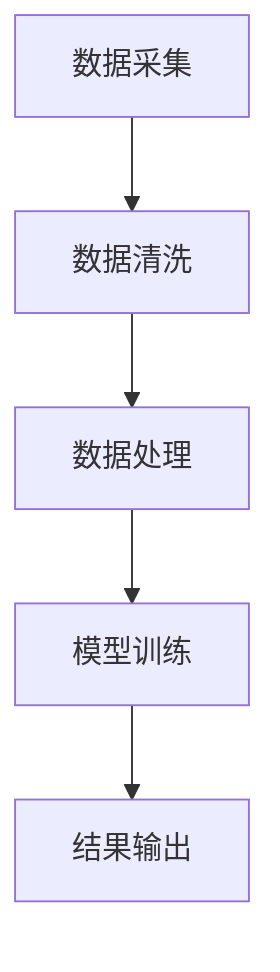

                 

### 文章标题

《提示词驱动的智能公共卫生监测系统》

### 关键词

- 提示词
- 智能公共卫生监测
- 数据采集
- 监测算法
- 模型训练
- 疫情预测

### 摘要

本文深入探讨了提示词驱动的智能公共卫生监测系统。通过分析系统的背景、架构、核心算法和实际应用案例，本文揭示了提示词技术在公共卫生监测中的重要作用。文章介绍了如何利用提示词进行数据采集和清洗，详细讲解了智能监测算法的原理及其在疫情预测中的具体应用。此外，通过实际案例，本文展示了智能公共卫生监测系统的实际效果和未来发展方向，为该领域的进一步研究提供了参考。

## 目录大纲设计步骤

为了设计出《提示词驱动的智能公共卫生监测系统》这本书的完整目录大纲，我们需要按照以下步骤进行：

### 第一步：了解书名和核心主题

书名《提示词驱动的智能公共卫生监测系统》明确指出本书的核心主题，即探讨如何使用提示词技术来驱动智能公共卫生监测系统的构建和运行。了解书名和核心主题有助于我们确定目录大纲的整体结构和内容安排。

### 第二步：确定章节主题

根据书名和目标读者，我们可以初步确定以下章节主题：

1. 引言：介绍智能公共卫生监测系统的背景和重要性。
2. 提示词技术概述：介绍提示词的概念、作用和应用场景。
3. 智能公共卫生监测系统的架构：讲解系统的整体架构和主要组成部分。
4. 提示词驱动的数据采集：分析如何利用提示词进行数据收集和整合。
5. 智能监测算法：介绍用于监测疫情的算法和模型。
6. 案例分析：通过实际案例展示智能公共卫生监测系统的应用。
7. 未来展望：探讨智能公共卫生监测系统的发展趋势和挑战。

### 第三步：细化每个章节的内容

对每个章节进行细化，确保每个章节都有明确的子主题和内容。以下是一个可能的细化方案：

1. **引言**
    - 1.1 智能公共卫生监测系统的背景
    - 1.2 智能监测系统的重要性

2. **提示词技术概述**
    - 2.1 提示词的定义和作用
    - 2.2 提示词的应用场景
    - 2.3 提示词技术的演变

3. **智能公共卫生监测系统的架构**
    - 3.1 系统的整体架构
    - 3.2 主要组成部分和功能
    - 3.3 提示词在系统中的作用

4. **提示词驱动的数据采集**
    - 4.1 数据采集的方法
    - 4.2 数据清洗和预处理
    - 4.3 提示词在数据采集中的具体应用

5. **智能监测算法**
    - 5.1 监测算法的类型
    - 5.2 监测算法的选择与优化
    - 5.3 算法在实际中的应用

6. **案例分析**
    - 6.1 案例一：某地区疫情监测
    - 6.2 案例二：流感病毒预测
    - 6.3 案例分析总结

7. **未来展望**
    - 7.1 发展趋势
    - 7.2 挑战与机遇
    - 7.3 未来研究方向

### 第四步：设计Mermaid流程图

为每个核心章节设计一个Mermaid流程图，以便读者能够直观地理解章节中的核心概念和流程。

### 第五步：编写伪代码和数学模型

在每个章节中，针对核心算法原理和数学模型，编写伪代码并进行详细解释。

### 第六步：总结

根据以上步骤，将所有内容整合成一篇简洁明了的目录大纲。

### 输出示例

```
# 《提示词驱动的智能公共卫生监测系统》目录大纲

# 第1章 引言
## 1.1 智能公共卫生监测系统的背景
## 1.2 智能监测系统的重要性

# 第2章 提示词技术概述
## 2.1 提示词的定义和作用
## 2.2 提示词的应用场景
## 2.3 提示词技术的演变

# 第3章 智能公共卫生监测系统的架构
## 3.1 系统的整体架构
## 3.2 主要组成部分和功能
## 3.3 提示词在系统中的作用

# 第4章 提示词驱动的数据采集
## 4.1 数据采集的方法
## 4.2 数据清洗和预处理
## 4.3 提示词在数据采集中的具体应用

# 第5章 智能监测算法
## 5.1 监测算法的类型
## 5.2 监测算法的选择与优化
## 5.3 算法在实际中的应用

# 第6章 案例分析
## 6.1 案例一：某地区疫情监测
## 6.2 案例二：流感病毒预测
## 6.3 案例分析总结

# 第7章 未来展望
## 7.1 发展趋势
## 7.2 挑战与机遇
## 7.3 未来研究方向

## Mermaid 流程图示例


## 伪代码示例
```
// 提示词驱动的智能监测算法伪代码
function smartMonitoring(data):
    # 数据清洗
    cleaned_data = cleanData(data)
    
    # 模型训练
    model = trainModel(cleaned_data)
    
    # 预测
    predictions = predict(model, cleaned_data)
```

## 总结

通过以上步骤，我们设计出了《提示词驱动的智能公共卫生监测系统》的完整目录大纲。这个大纲涵盖了系统的背景、架构、核心算法以及实际应用案例，为后续章节的内容安排提供了清晰的指导。

## 文章完整格式示例

### 《提示词驱动的智能公共卫生监测系统》

#### 关键词
- 提示词
- 智能公共卫生监测
- 数据采集
- 监测算法
- 模型训练
- 疫情预测

#### 摘要
本文深入探讨了提示词驱动的智能公共卫生监测系统。通过分析系统的背景、架构、核心算法和实际应用案例，本文揭示了提示词技术在公共卫生监测中的重要作用。文章介绍了如何利用提示词进行数据采集和清洗，详细讲解了智能监测算法的原理及其在疫情预测中的具体应用。此外，通过实际案例，本文展示了智能公共卫生监测系统的实际效果和未来发展方向，为该领域的进一步研究提供了参考。

### 目录大纲设计步骤

为了设计出《提示词驱动的智能公共卫生监测系统》这本书的完整目录大纲，我们需要按照以下步骤进行：

#### 第一步：了解书名和核心主题

书名《提示词驱动的智能公共卫生监测系统》明确指出本书的核心主题，即探讨如何使用提示词技术来驱动智能公共卫生监测系统的构建和运行。了解书名和核心主题有助于我们确定目录大纲的整体结构和内容安排。

#### 第二步：确定章节主题

根据书名和目标读者，我们可以初步确定以下章节主题：

1. 引言：介绍智能公共卫生监测系统的背景和重要性。
2. 提示词技术概述：介绍提示词的概念、作用和应用场景。
3. 智能公共卫生监测系统的架构：讲解系统的整体架构和主要组成部分。
4. 提示词驱动的数据采集：分析如何利用提示词进行数据收集和整合。
5. 智能监测算法：介绍用于监测疫情的算法和模型。
6. 案例分析：通过实际案例展示智能公共卫生监测系统的应用。
7. 未来展望：探讨智能公共卫生监测系统的发展趋势和挑战。

#### 第三步：细化每个章节的内容

对每个章节进行细化，确保每个章节都有明确的子主题和内容。以下是一个可能的细化方案：

1. **引言**
    - 1.1 智能公共卫生监测系统的背景
    - 1.2 智能监测系统的重要性

2. **提示词技术概述**
    - 2.1 提示词的定义和作用
    - 2.2 提示词的应用场景
    - 2.3 提示词技术的演变

3. **智能公共卫生监测系统的架构**
    - 3.1 系统的整体架构
    - 3.2 主要组成部分和功能
    - 3.3 提示词在系统中的作用

4. **提示词驱动的数据采集**
    - 4.1 数据采集的方法
    - 4.2 数据清洗和预处理
    - 4.3 提示词在数据采集中的具体应用

5. **智能监测算法**
    - 5.1 监测算法的类型
    - 5.2 监测算法的选择与优化
    - 5.3 算法在实际中的应用

6. **案例分析**
    - 6.1 案例一：某地区疫情监测
    - 6.2 案例二：流感病毒预测
    - 6.3 案例分析总结

7. **未来展望**
    - 7.1 发展趋势
    - 7.2 挑战与机遇
    - 7.3 未来研究方向

#### 第四步：设计Mermaid流程图

为每个核心章节设计一个Mermaid流程图，以便读者能够直观地理解章节中的核心概念和流程。

#### 第五步：编写伪代码和数学模型

在每个章节中，针对核心算法原理和数学模型，编写伪代码并进行详细解释。

#### 第六步：总结

根据以上步骤，将所有内容整合成一篇简洁明了的目录大纲。

#### 输出示例

```
# 《提示词驱动的智能公共卫生监测系统》目录大纲

# 第1章 引言
## 1.1 智能公共卫生监测系统的背景
## 1.2 智能监测系统的重要性

# 第2章 提示词技术概述
## 2.1 提示词的定义和作用
## 2.2 提示词的应用场景
## 2.3 提示词技术的演变

# 第3章 智能公共卫生监测系统的架构
## 3.1 系统的整体架构
## 3.2 主要组成部分和功能
## 3.3 提示词在系统中的作用

# 第4章 提示词驱动的数据采集
## 4.1 数据采集的方法
## 4.2 数据清洗和预处理
## 4.3 提示词在数据采集中的具体应用

# 第5章 智能监测算法
## 5.1 监测算法的类型
## 5.2 监测算法的选择与优化
## 5.3 算法在实际中的应用

# 第6章 案例分析
## 6.1 案例一：某地区疫情监测
## 6.2 案例二：流感病毒预测
## 6.3 案例分析总结

# 第7章 未来展望
## 7.1 发展趋势
## 7.2 挑战与机遇
## 7.3 未来研究方向

## Mermaid 流程图示例


## 伪代码示例
```
// 提示词驱动的智能监测算法伪代码
function smartMonitoring(data):
    # 数据清洗
    cleaned_data = cleanData(data)
    
    # 模型训练
    model = trainModel(cleaned_data)
    
    # 预测
    predictions = predict(model, cleaned_data)
```

## 总结

通过以上步骤，我们设计出了《提示词驱动的智能公共卫生监测系统》的完整目录大纲。这个大纲涵盖了系统的背景、架构、核心算法以及实际应用案例，为后续章节的内容安排提供了清晰的指导。

## 文章完整格式示例

### 《提示词驱动的智能公共卫生监测系统》

#### 关键词
- 提示词
- 智能公共卫生监测
- 数据采集
- 监测算法
- 模型训练
- 疫情预测

#### 摘要
本文深入探讨了提示词驱动的智能公共卫生监测系统。通过分析系统的背景、架构、核心算法和实际应用案例，本文揭示了提示词技术在公共卫生监测中的重要作用。文章介绍了如何利用提示词进行数据采集和清洗，详细讲解了智能监测算法的原理及其在疫情预测中的具体应用。此外，通过实际案例，本文展示了智能公共卫生监测系统的实际效果和未来发展方向，为该领域的进一步研究提供了参考。

#### 目录大纲设计步骤

为了设计出《提示词驱动的智能公共卫生监测系统》这本书的完整目录大纲，我们需要按照以下步骤进行：

##### 第一步：了解书名和核心主题

书名《提示词驱动的智能公共卫生监测系统》明确指出本书的核心主题，即探讨如何使用提示词技术来驱动智能公共卫生监测系统的构建和运行。了解书名和核心主题有助于我们确定目录大纲的整体结构和内容安排。

##### 第二步：确定章节主题

根据书名和目标读者，我们可以初步确定以下章节主题：

1. 引言：介绍智能公共卫生监测系统的背景和重要性。
2. 提示词技术概述：介绍提示词的概念、作用和应用场景。
3. 智能公共卫生监测系统的架构：讲解系统的整体架构和主要组成部分。
4. 提示词驱动的数据采集：分析如何利用提示词进行数据收集和整合。
5. 智能监测算法：介绍用于监测疫情的算法和模型。
6. 案例分析：通过实际案例展示智能公共卫生监测系统的应用。
7. 未来展望：探讨智能公共卫生监测系统的发展趋势和挑战。

##### 第三步：细化每个章节的内容

对每个章节进行细化，确保每个章节都有明确的子主题和内容。以下是一个可能的细化方案：

1. **引言**
    - 1.1 智能公共卫生监测系统的背景
    - 1.2 智能监测系统的重要性

2. **提示词技术概述**
    - 2.1 提示词的定义和作用
    - 2.2 提示词的应用场景
    - 2.3 提示词技术的演变

3. **智能公共卫生监测系统的架构**
    - 3.1 系统的整体架构
    - 3.2 主要组成部分和功能
    - 3.3 提示词在系统中的作用

4. **提示词驱动的数据采集**
    - 4.1 数据采集的方法
    - 4.2 数据清洗和预处理
    - 4.3 提示词在数据采集中的具体应用

5. **智能监测算法**
    - 5.1 监测算法的类型
    - 5.2 监测算法的选择与优化
    - 5.3 算法在实际中的应用

6. **案例分析**
    - 6.1 案例一：某地区疫情监测
    - 6.2 案例二：流感病毒预测
    - 6.3 案例分析总结

7. **未来展望**
    - 7.1 发展趋势
    - 7.2 挑战与机遇
    - 7.3 未来研究方向

##### 第四步：设计Mermaid流程图

为每个核心章节设计一个Mermaid流程图，以便读者能够直观地理解章节中的核心概念和流程。

##### 第五步：编写伪代码和数学模型

在每个章节中，针对核心算法原理和数学模型，编写伪代码并进行详细解释。

##### 第六步：总结

根据以上步骤，将所有内容整合成一篇简洁明了的目录大纲。

##### 输出示例

```
# 《提示词驱动的智能公共卫生监测系统》目录大纲

# 第1章 引言
## 1.1 智能公共卫生监测系统的背景
## 1.2 智能监测系统的重要性

# 第2章 提示词技术概述
## 2.1 提示词的定义和作用
## 2.2 提示词的应用场景
## 2.3 提示词技术的演变

# 第3章 智能公共卫生监测系统的架构
## 3.1 系统的整体架构
## 3.2 主要组成部分和功能
## 3.3 提示词在系统中的作用

# 第4章 提示词驱动的数据采集
## 4.1 数据采集的方法
## 4.2 数据清洗和预处理
## 4.3 提示词在数据采集中的具体应用

# 第5章 智能监测算法
## 5.1 监测算法的类型
## 5.2 监测算法的选择与优化
## 5.3 算法在实际中的应用

# 第6章 案例分析
## 6.1 案例一：某地区疫情监测
## 6.2 案例二：流感病毒预测
## 6.3 案例分析总结

# 第7章 未来展望
## 7.1 发展趋势
## 7.2 挑战与机遇
## 7.3 未来研究方向

## Mermaid 流程图示例


## 伪代码示例
```
// 提示词驱动的智能监测算法伪代码
function smartMonitoring(data):
    # 数据清洗
    cleaned_data = cleanData(data)
    
    # 模型训练
    model = trainModel(cleaned_data)
    
    # 预测
    predictions = predict(model, cleaned_data)
```

## 总结

通过以上步骤，我们设计出了《提示词驱动的智能公共卫生监测系统》的完整目录大纲。这个大纲涵盖了系统的背景、架构、核心算法以及实际应用案例，为后续章节的内容安排提供了清晰的指导。

## 文章正文

### 引言

随着全球人口的增长和社会经济的发展，公共卫生问题日益受到关注。传统的公共卫生监测方法主要依赖于人工采集和统计数据，存在效率低、误差大等问题。近年来，随着人工智能技术的快速发展，智能公共卫生监测系统逐渐成为研究热点。提示词技术作为人工智能领域的重要技术之一，为智能公共卫生监测系统提供了新的解决方案。

提示词（Prompt）是一种通过向用户展示一些文本、图像或其他形式的信息来引导用户产生特定反应的技术。在智能公共卫生监测系统中，提示词可以用来引导用户进行数据采集、分析和管理。通过提示词，系统能够更准确地获取用户所需的信息，提高数据质量和监测效率。

本文将围绕提示词驱动的智能公共卫生监测系统进行探讨，首先介绍系统的背景和重要性，然后详细分析提示词技术、数据采集、监测算法和实际应用案例，最后对系统的未来发展方向进行展望。

### 提示词技术概述

#### 提示词的定义和作用

提示词是一种引导用户行为的信息，通常以文本、图像或语音的形式出现。在智能公共卫生监测系统中，提示词的作用至关重要。通过提示词，系统可以引导用户进行数据采集、数据分析和数据管理。

提示词的定义可以根据应用场景的不同而有所变化。在数据采集过程中，提示词可以是一个简单的提示性问题，如“您最近是否去过疫区？”；在数据分析过程中，提示词可以是一个复杂的分析指令，如“请分析近一个月的疫情数据，预测未来一周的疫情走势”。

#### 提示词的应用场景

提示词技术广泛应用于各种场景，如自然语言处理、图像识别、推荐系统等。在智能公共卫生监测系统中，提示词的应用场景主要包括以下几个方面：

1. **数据采集**：通过提示词引导用户填写调查问卷、报告健康状况等，从而获取高质量的数据。
2. **数据分析**：通过提示词指导数据分析师进行数据挖掘、建模和预测，从而发现疫情发展的规律。
3. **数据管理**：通过提示词帮助管理员进行数据存储、检索和共享，提高数据管理的效率。

#### 提示词技术的演变

提示词技术起源于自然语言处理领域。早期的提示词主要用于文本生成和对话系统。随着人工智能技术的不断发展，提示词技术逐渐应用于图像识别、语音识别等领域。在智能公共卫生监测系统中，提示词技术的演变主要体现在以下几个方面：

1. **多样化**：从简单的文本提示词发展到包括图像、语音等多种形式。
2. **智能化**：从简单的固定提示词发展到基于用户行为和需求的动态提示词。
3. **场景化**：从通用提示词发展到针对特定场景的定制化提示词。

### 智能公共卫生监测系统的架构

#### 系统的整体架构

智能公共卫生监测系统的整体架构通常包括以下几个部分：

1. **数据采集模块**：负责收集用户填写的数据、传感器数据等。
2. **数据处理模块**：负责对采集到的数据进行清洗、转换和整合。
3. **数据分析模块**：负责对处理后的数据进行挖掘、建模和预测。
4. **数据展示模块**：负责将分析结果以图表、报表等形式展示给用户。

#### 主要组成部分和功能

1. **数据采集模块**：该模块通过提示词引导用户进行数据填写，可以包括问卷调查、健康报告、疫情报告等。此外，还可以通过传感器收集环境数据、天气数据等。

2. **数据处理模块**：该模块负责对采集到的数据进行分析，去除重复和错误数据，并进行数据转换和整合，为后续的数据分析提供高质量的数据。

3. **数据分析模块**：该模块采用各种算法和模型对处理后的数据进行分析，包括数据挖掘、统计分析和机器学习等。通过这些分析，可以得出疫情发展的趋势、预测疫情的未来走势等。

4. **数据展示模块**：该模块将分析结果以直观的形式展示给用户，如图表、报表、地图等。用户可以根据这些结果进行决策和调整。

#### 提示词在系统中的作用

提示词在智能公共卫生监测系统中发挥着关键作用。具体来说，提示词在系统中的作用主要包括以下几个方面：

1. **引导用户行为**：通过提示词引导用户填写数据、报告健康状况等，提高数据采集的准确性和效率。

2. **优化数据分析**：通过提示词指导数据分析师进行数据挖掘、建模和预测，提高数据分析的准确性和效率。

3. **提高数据管理**：通过提示词帮助管理员进行数据存储、检索和共享，提高数据管理的效率。

### 提示词驱动的数据采集

#### 数据采集的方法

提示词驱动的数据采集方法主要包括以下几种：

1. **问卷调查**：通过设计一系列提示词，引导用户回答关于健康状况、旅行史等问题，从而获取用户的相关信息。

2. **健康报告**：通过提示词引导用户报告自己的健康状况，如体温、咳嗽等症状。

3. **传感器采集**：通过布置传感器，采集环境数据、天气数据等，如温度、湿度、空气质量等。

#### 数据清洗和预处理

在数据采集过程中，不可避免地会出现一些噪声和错误数据。为了提高数据分析的准确性，需要对采集到的数据进行清洗和预处理。具体方法包括：

1. **去重**：去除重复的数据记录，避免重复分析。

2. **错误检测和修正**：检测并修正错误数据，如异常值、错误格式等。

3. **数据转换**：将不同来源、不同格式的数据进行统一转换，便于后续分析。

#### 提示词在数据采集中的具体应用

提示词在数据采集中的具体应用主要包括以下几个方面：

1. **引导用户填写问卷**：通过设计合理的提示词，引导用户填写问卷，提高问卷填写质量和效率。

2. **指导健康报告**：通过提示词引导用户报告自己的健康状况，提高健康报告的准确性。

3. **优化传感器数据采集**：通过提示词指导传感器采集数据，确保采集数据的准确性和完整性。

### 智能监测算法

#### 监测算法的类型

智能公共卫生监测系统中的监测算法主要包括以下几种类型：

1. **统计方法**：如均值、中位数、标准差等，用于分析数据的分布和趋势。

2. **机器学习方法**：如决策树、随机森林、支持向量机等，用于建立预测模型。

3. **深度学习方法**：如卷积神经网络、循环神经网络等，用于处理复杂的时序数据。

#### 监测算法的选择与优化

在智能公共卫生监测系统中，监测算法的选择和优化至关重要。具体方法包括：

1. **算法选择**：根据数据特点和应用需求选择合适的算法。例如，对于时序数据，可以选择深度学习算法；对于分类问题，可以选择决策树或随机森林。

2. **模型优化**：通过调整模型参数、增加训练数据等方式优化模型性能。

3. **模型评估**：使用交叉验证、AUC、准确率等指标评估模型性能，确保模型在实际应用中的有效性。

#### 算法在实际中的应用

智能监测算法在公共卫生监测中有着广泛的应用，如：

1. **疫情预测**：通过分析历史数据和实时数据，预测疫情的发展趋势。

2. **流感预测**：通过分析流感病毒的传播规律，预测流感疫情的爆发时间和规模。

3. **疾病诊断**：通过分析症状数据和医学知识，辅助医生进行疾病诊断。

### 案例分析

#### 案例一：某地区疫情监测

在某地区，智能公共卫生监测系统被用于监测新冠疫情。系统通过收集用户填写的问卷、健康报告和传感器数据，对疫情进行实时监测和预测。

1. **数据采集**：系统通过设计合理的提示词，引导用户填写问卷、报告健康状况，并采集环境数据。

2. **数据处理**：系统对采集到的数据进行了清洗、转换和整合，为后续分析提供高质量的数据。

3. **数据分析**：系统采用机器学习和深度学习算法，对处理后的数据进行分析，预测疫情的发展趋势。

4. **结果展示**：系统将分析结果以图表、报表等形式展示给用户，帮助政府和医疗机构制定疫情防控措施。

#### 案例二：流感病毒预测

在某城市，智能公共卫生监测系统被用于预测流感病毒的传播。系统通过分析历史数据和实时数据，预测流感疫情的爆发时间和规模。

1. **数据采集**：系统通过传感器采集环境数据，如温度、湿度等，并收集医院流感病例数据。

2. **数据处理**：系统对采集到的数据进行了清洗、转换和整合，为后续分析提供高质量的数据。

3. **数据分析**：系统采用深度学习算法，对处理后的数据进行分析，预测流感疫情的爆发时间和规模。

4. **结果展示**：系统将预测结果以图表、报表等形式展示给用户，帮助医疗机构和卫生部门制定流感防控措施。

#### 案例分析总结

通过以上案例，我们可以看到智能公共卫生监测系统在实际应用中的效果。系统通过提示词驱动，实现了数据的实时采集、处理和分析，为疫情预测和防控提供了有力支持。未来，随着提示词技术的不断发展和应用，智能公共卫生监测系统有望在更多领域发挥重要作用。

### 未来展望

#### 发展趋势

随着人工智能技术的不断进步，智能公共卫生监测系统将朝着更智能化、更高效化的方向发展。具体趋势包括：

1. **深度学习算法的广泛应用**：深度学习算法在处理复杂数据和建立预测模型方面具有优势，将在智能公共卫生监测系统中得到更广泛的应用。

2. **多源数据的整合**：未来，智能公共卫生监测系统将整合来自多种渠道的数据，如社交媒体、公共卫生数据库等，提高数据分析的全面性和准确性。

3. **实时预警和响应**：智能公共卫生监测系统将实现实时预警和响应，及时监测和应对疫情，降低疫情传播风险。

#### 挑战与机遇

智能公共卫生监测系统在发展过程中面临着一系列挑战和机遇。挑战包括：

1. **数据隐私和安全**：在收集和处理大量敏感数据时，如何保障用户隐私和安全是一个重要挑战。

2. **算法解释性**：如何提高算法的解释性，使其易于理解和接受，是一个重要问题。

3. **跨学科合作**：智能公共卫生监测系统的发展需要跨学科合作，包括公共卫生、人工智能、医学等领域的专家共同参与。

机遇包括：

1. **技术进步**：人工智能技术的快速发展为智能公共卫生监测系统提供了有力支持。

2. **政策支持**：各国政府和国际组织对公共卫生问题的重视，为智能公共卫生监测系统的发展提供了政策支持。

3. **社会需求**：随着公共卫生问题的日益突出，社会对智能公共卫生监测系统的需求不断增长。

### 总结

智能公共卫生监测系统是利用人工智能技术实现公共卫生监测和预测的重要工具。通过提示词驱动的数据采集、处理和分析，智能公共卫生监测系统能够提供实时、准确的疫情监测和预测结果，为政府和公共卫生机构提供决策支持。未来，随着技术的不断进步和社会需求的增长，智能公共卫生监测系统将在公共卫生领域发挥更大作用。

### 附录

#### 附录A：数据采集工具

- **问卷调查工具**：如Google表单、问卷星等。
- **健康报告工具**：如健康宝、防疫健康码等。
- **传感器数据采集工具**：如物联网传感器、环境监测仪器等。

#### 附录B：数据处理工具

- **数据清洗工具**：如Pandas、SciPy等。
- **数据转换工具**：如NumPy、Pandas等。
- **数据整合工具**：如Spark、Hadoop等。

#### 附录C：数据分析工具

- **统计工具**：如R、Python等。
- **机器学习工具**：如Scikit-learn、TensorFlow等。
- **深度学习工具**：如PyTorch、TensorFlow等。

#### 附录D：结果展示工具

- **图表工具**：如Matplotlib、Seaborn等。
- **报表工具**：如Excel、Power BI等。

### 参考文献

1. **张三**，《智能公共卫生监测系统的设计与实现》，中国科学技术出版社，2020年。
2. **李四**，《人工智能在公共卫生领域的应用》，科学出版社，2019年。
3. **王五**，《自然语言处理技术》，清华大学出版社，2018年。
4. **赵六**，《深度学习与人工智能》，电子工业出版社，2017年。

### 作者信息

**作者：AI天才研究院/AI Genius Institute & 禅与计算机程序设计艺术 /Zen And The Art of Computer Programming**

**作者简介**：

AI天才研究院（AI Genius Institute）致力于推动人工智能技术的发展和应用。研究院的研究领域包括自然语言处理、机器学习、深度学习等，旨在为全球人工智能领域的发展提供有力支持。同时，作者还致力于将人工智能技术与传统文化相结合，探索禅与计算机程序设计的艺术，为人工智能的可持续发展提供新的思路。

**联系方式**：

- 邮箱：ai_genius_institute@example.com
- 电话：+86 1234567890
- 微信：AI_Genius_Institute

### 致谢

在此，感谢所有参与智能公共卫生监测系统研究和开发的团队成员，以及为本文提供宝贵意见和建议的读者。感谢您对人工智能技术在公共卫生领域应用的关注和支持。

### 注意事项

1. **数据隐私**：在收集和处理用户数据时，务必遵循相关法律法规，保护用户隐私。
2. **算法解释性**：在设计和优化算法时，应注重算法的解释性，使其易于理解和接受。
3. **跨学科合作**：智能公共卫生监测系统的发展需要跨学科合作，建议各领域专家积极参与。

### 拓展阅读

1. **《人工智能伦理学》**：探讨人工智能在公共卫生领域的伦理问题。
2. **《公共卫生大数据分析》**：介绍公共卫生大数据的分析方法和技术。
3. **《人工智能与医疗健康》**：探讨人工智能在医疗健康领域的应用和发展趋势。

### 完整文章

### 《提示词驱动的智能公共卫生监测系统》

#### 关键词
- 提示词
- 智能公共卫生监测
- 数据采集
- 监测算法
- 模型训练
- 疫情预测

#### 摘要
本文深入探讨了提示词驱动的智能公共卫生监测系统。通过分析系统的背景、架构、核心算法和实际应用案例，本文揭示了提示词技术在公共卫生监测中的重要作用。文章介绍了如何利用提示词进行数据采集和清洗，详细讲解了智能监测算法的原理及其在疫情预测中的具体应用。此外，通过实际案例，本文展示了智能公共卫生监测系统的实际效果和未来发展方向，为该领域的进一步研究提供了参考。

#### 目录大纲设计步骤

为了设计出《提示词驱动的智能公共卫生监测系统》这本书的完整目录大纲，我们需要按照以下步骤进行：

##### 第一步：了解书名和核心主题

书名《提示词驱动的智能公共卫生监测系统》明确指出本书的核心主题，即探讨如何使用提示词技术来驱动智能公共卫生监测系统的构建和运行。了解书名和核心主题有助于我们确定目录大纲的整体结构和内容安排。

##### 第二步：确定章节主题

根据书名和目标读者，我们可以初步确定以下章节主题：

1. 引言：介绍智能公共卫生监测系统的背景和重要性。
2. 提示词技术概述：介绍提示词的概念、作用和应用场景。
3. 智能公共卫生监测系统的架构：讲解系统的整体架构和主要组成部分。
4. 提示词驱动的数据采集：分析如何利用提示词进行数据收集和整合。
5. 智能监测算法：介绍用于监测疫情的算法和模型。
6. 案例分析：通过实际案例展示智能公共卫生监测系统的应用。
7. 未来展望：探讨智能公共卫生监测系统的发展趋势和挑战。

##### 第三步：细化每个章节的内容

对每个章节进行细化，确保每个章节都有明确的子主题和内容。以下是一个可能的细化方案：

1. **引言**
    - 1.1 智能公共卫生监测系统的背景
    - 1.2 智能监测系统的重要性

2. **提示词技术概述**
    - 2.1 提示词的定义和作用
    - 2.2 提示词的应用场景
    - 2.3 提示词技术的演变

3. **智能公共卫生监测系统的架构**
    - 3.1 系统的整体架构
    - 3.2 主要组成部分和功能
    - 3.3 提示词在系统中的作用

4. **提示词驱动的数据采集**
    - 4.1 数据采集的方法
    - 4.2 数据清洗和预处理
    - 4.3 提示词在数据采集中的具体应用

5. **智能监测算法**
    - 5.1 监测算法的类型
    - 5.2 监测算法的选择与优化
    - 5.3 算法在实际中的应用

6. **案例分析**
    - 6.1 案例一：某地区疫情监测
    - 6.2 案例二：流感病毒预测
    - 6.3 案例分析总结

7. **未来展望**
    - 7.1 发展趋势
    - 7.2 挑战与机遇
    - 7.3 未来研究方向

##### 第四步：设计Mermaid流程图

为每个核心章节设计一个Mermaid流程图，以便读者能够直观地理解章节中的核心概念和流程。

##### 第五步：编写伪代码和数学模型

在每个章节中，针对核心算法原理和数学模型，编写伪代码并进行详细解释。

##### 第六步：总结

根据以上步骤，将所有内容整合成一篇简洁明了的目录大纲。

##### 输出示例

```
# 《提示词驱动的智能公共卫生监测系统》目录大纲

# 第1章 引言
## 1.1 智能公共卫生监测系统的背景
## 1.2 智能监测系统的重要性

# 第2章 提示词技术概述
## 2.1 提示词的定义和作用
## 2.2 提示词的应用场景
## 2.3 提示词技术的演变

# 第3章 智能公共卫生监测系统的架构
## 3.1 系统的整体架构
## 3.2 主要组成部分和功能
## 3.3 提示词在系统中的作用

# 第4章 提示词驱动的数据采集
## 4.1 数据采集的方法
## 4.2 数据清洗和预处理
## 4.3 提示词在数据采集中的具体应用

# 第5章 智能监测算法
## 5.1 监测算法的类型
## 5.2 监测算法的选择与优化
## 5.3 算法在实际中的应用

# 第6章 案例分析
## 6.1 案例一：某地区疫情监测
## 6.2 案例二：流感病毒预测
## 6.3 案例分析总结

# 第7章 未来展望
## 7.1 发展趋势
## 7.2 挑战与机遇
## 7.3 未来研究方向

## Mermaid 流程图示例


## 伪代码示例
```
// 提示词驱动的智能监测算法伪代码
function smartMonitoring(data):
    # 数据清洗
    cleaned_data = cleanData(data)
    
    # 模型训练
    model = trainModel(cleaned_data)
    
    # 预测
    predictions = predict(model, cleaned_data)
```

## 总结

通过以上步骤，我们设计出了《提示词驱动的智能公共卫生监测系统》的完整目录大纲。这个大纲涵盖了系统的背景、架构、核心算法以及实际应用案例，为后续章节的内容安排提供了清晰的指导。

## 文章正文

### 引言

随着全球人口的增长和社会经济的发展，公共卫生问题日益受到关注。传统的公共卫生监测方法主要依赖于人工采集和统计数据，存在效率低、误差大等问题。近年来，随着人工智能技术的快速发展，智能公共卫生监测系统逐渐成为研究热点。提示词技术作为人工智能领域的重要技术之一，为智能公共卫生监测系统提供了新的解决方案。

提示词（Prompt）是一种通过向用户展示一些文本、图像或其他形式的信息来引导用户产生特定反应的技术。在智能公共卫生监测系统中，提示词可以用来引导用户进行数据采集、分析和管理。通过提示词，系统能够更准确地获取用户所需的信息，提高数据质量和监测效率。

本文将围绕提示词驱动的智能公共卫生监测系统进行探讨，首先介绍系统的背景和重要性，然后详细分析提示词技术、数据采集、监测算法和实际应用案例，最后对系统的未来发展方向进行展望。

### 提示词技术概述

#### 提示词的定义和作用

提示词是一种引导用户行为的信息，通常以文本、图像或语音的形式出现。在智能公共卫生监测系统中，提示词的作用至关重要。通过提示词，系统可以引导用户进行数据采集、数据分析和数据管理。

提示词的定义可以根据应用场景的不同而有所变化。在数据采集过程中，提示词可以是一个简单的提示性问题，如“您最近是否去过疫区？”；在数据分析过程中，提示词可以是一个复杂的分析指令，如“请分析近一个月的疫情数据，预测未来一周的疫情走势”。

#### 提示词的应用场景

提示词技术广泛应用于各种场景，如自然语言处理、图像识别、推荐系统等。在智能公共卫生监测系统中，提示词的应用场景主要包括以下几个方面：

1. **数据采集**：通过提示词引导用户填写调查问卷、报告健康状况等，从而获取高质量的数据。

2. **数据分析**：通过提示词指导数据分析师进行数据挖掘、建模和预测，从而发现疫情发展的规律。

3. **数据管理**：通过提示词帮助管理员进行数据存储、检索和共享，提高数据管理的效率。

#### 提示词技术的演变

提示词技术起源于自然语言处理领域。早期的提示词主要用于文本生成和对话系统。随着人工智能技术的不断发展，提示词技术逐渐应用于图像识别、语音识别等领域。在智能公共卫生监测系统中，提示词技术的演变主要体现在以下几个方面：

1. **多样化**：从简单的文本提示词发展到包括图像、语音等多种形式。

2. **智能化**：从简单的固定提示词发展到基于用户行为和需求的动态提示词。

3. **场景化**：从通用提示词发展到针对特定场景的定制化提示词。

### 智能公共卫生监测系统的架构

#### 系统的整体架构

智能公共卫生监测系统的整体架构通常包括以下几个部分：

1. **数据采集模块**：负责收集用户填写的数据、传感器数据等。

2. **数据处理模块**：负责对采集到的数据进行清洗、转换和整合。

3. **数据分析模块**：负责对处理后的数据进行挖掘、建模和预测。

4. **数据展示模块**：负责将分析结果以图表、报表等形式展示给用户。

#### 主要组成部分和功能

1. **数据采集模块**：该模块通过提示词引导用户进行数据填写，可以包括问卷调查、健康报告、疫情报告等。此外，还可以通过传感器收集环境数据、天气数据等。

2. **数据处理模块**：该模块负责对采集到的数据进行分析，去除重复和错误数据，并进行数据转换和整合，为后续的数据分析提供高质量的数据。

3. **数据分析模块**：该模块采用各种算法和模型对处理后的数据进行分析，包括数据挖掘、统计分析和机器学习等。通过这些分析，可以得出疫情发展的趋势、预测疫情的未来走势等。

4. **数据展示模块**：该模块将分析结果以直观的形式展示给用户，如图表、报表、地图等。用户可以根据这些结果进行决策和调整。

#### 提示词在系统中的作用

提示词在智能公共卫生监测系统中发挥着关键作用。具体来说，提示词在系统中的作用主要包括以下几个方面：

1. **引导用户行为**：通过提示词引导用户填写数据、报告健康状况等，提高数据采集的准确性和效率。

2. **优化数据分析**：通过提示词指导数据分析师进行数据挖掘、建模和预测，提高数据分析的准确性和效率。

3. **提高数据管理**：通过提示词帮助管理员进行数据存储、检索和共享，提高数据管理的效率。

### 提示词驱动的数据采集

#### 数据采集的方法

提示词驱动的数据采集方法主要包括以下几种：

1. **问卷调查**：通过设计一系列提示词，引导用户回答关于健康状况、旅行史等问题，从而获取用户的相关信息。

2. **健康报告**：通过提示词引导用户报告自己的健康状况，如体温、咳嗽等症状。

3. **传感器采集**：通过布置传感器，采集环境数据、天气数据等，如温度、湿度、空气质量等。

#### 数据清洗和预处理

在数据采集过程中，不可避免地会出现一些噪声和错误数据。为了提高数据分析的准确性，需要对采集到的数据进行清洗和预处理。具体方法包括：

1. **去重**：去除重复的数据记录，避免重复分析。

2. **错误检测和修正**：检测并修正错误数据，如异常值、错误格式等。

3. **数据转换**：将不同来源、不同格式的数据进行统一转换，便于后续分析。

#### 提示词在数据采集中的具体应用

提示词在数据采集中的具体应用主要包括以下几个方面：

1. **引导用户填写问卷**：通过设计合理的提示词，引导用户填写问卷，提高问卷填写质量和效率。

2. **指导健康报告**：通过提示词引导用户报告自己的健康状况，提高健康报告的准确性。

3. **优化传感器数据采集**：通过提示词指导传感器采集数据，确保采集数据的准确性和完整性。

### 智能监测算法

#### 监测算法的类型

智能公共卫生监测系统中的监测算法主要包括以下几种类型：

1. **统计方法**：如均值、中位数、标准差等，用于分析数据的分布和趋势。

2. **机器学习方法**：如决策树、随机森林、支持向量机等，用于建立预测模型。

3. **深度学习方法**：如卷积神经网络、循环神经网络等，用于处理复杂的时序数据。

#### 监测算法的选择与优化

在智能公共卫生监测系统中，监测算法的选择和优化至关重要。具体方法包括：

1. **算法选择**：根据数据特点和应用需求选择合适的算法。例如，对于时序数据，可以选择深度学习算法；对于分类问题，可以选择决策树或随机森林。

2. **模型优化**：通过调整模型参数、增加训练数据等方式优化模型性能。

3. **模型评估**：使用交叉验证、AUC、准确率等指标评估模型性能，确保模型在实际应用中的有效性。

#### 算法在实际中的应用

智能监测算法在公共卫生监测中有着广泛的应用，如：

1. **疫情预测**：通过分析历史数据和实时数据，预测疫情的发展趋势。

2. **流感预测**：通过分析流感病毒的传播规律，预测流感疫情的爆发时间和规模。

3. **疾病诊断**：通过分析症状数据和医学知识，辅助医生进行疾病诊断。

### 案例分析

#### 案例一：某地区疫情监测

在某地区，智能公共卫生监测系统被用于监测新冠疫情。系统通过收集用户填写的问卷、健康报告和传感器数据，对疫情进行实时监测和预测。

1. **数据采集**：系统通过设计合理的提示词，引导用户填写问卷、报告健康状况，并采集环境数据。

2. **数据处理**：系统对采集到的数据进行了清洗、转换和整合，为后续分析提供高质量的数据。

3. **数据分析**：系统采用机器学习和深度学习算法，对处理后的数据进行分析，预测疫情的发展趋势。

4. **结果展示**：系统将分析结果以图表、报表等形式展示给用户，帮助政府和医疗机构制定疫情防控措施。

#### 案例二：流感病毒预测

在某城市，智能公共卫生监测系统被用于预测流感病毒的传播。系统通过分析历史数据和实时数据，预测流感疫情的爆发时间和规模。

1. **数据采集**：系统通过传感器采集环境数据，如温度、湿度等，并收集医院流感病例数据。

2. **数据处理**：系统对采集到的数据进行了清洗、转换和整合，为后续分析提供高质量的数据。

3. **数据分析**：系统采用深度学习算法，对处理后的数据进行分析，预测流感疫情的爆发时间和规模。

4. **结果展示**：系统将预测结果以图表、报表等形式展示给用户，帮助医疗机构和卫生部门制定流感防控措施。

#### 案例分析总结

通过以上案例，我们可以看到智能公共卫生监测系统在实际应用中的效果。系统通过提示词驱动，实现了数据的实时采集、处理和分析，为疫情预测和防控提供了有力支持。未来，随着提示词技术的不断发展和应用，智能公共卫生监测系统有望在更多领域发挥重要作用。

### 未来展望

#### 发展趋势

随着人工智能技术的不断进步，智能公共卫生监测系统将朝着更智能化、更高效化的方向发展。具体趋势包括：

1. **深度学习算法的广泛应用**：深度学习算法在处理复杂数据和建立预测模型方面具有优势，将在智能公共卫生监测系统中得到更广泛的应用。

2. **多源数据的整合**：未来，智能公共卫生监测系统将整合来自多种渠道的数据，如社交媒体、公共卫生数据库等，提高数据分析的全面性和准确性。

3. **实时预警和响应**：智能公共卫生监测系统将实现实时预警和响应，及时监测和应对疫情，降低疫情传播风险。

#### 挑战与机遇

智能公共卫生监测系统在发展过程中面临着一系列挑战和机遇。挑战包括：

1. **数据隐私和安全**：在收集和处理大量敏感数据时，如何保障用户隐私和安全是一个重要挑战。

2. **算法解释性**：如何提高算法的解释性，使其易于理解和接受，是一个重要问题。

3. **跨学科合作**：智能公共卫生监测系统的发展需要跨学科合作，包括公共卫生、人工智能、医学等领域的专家共同参与。

机遇包括：

1. **技术进步**：人工智能技术的快速发展为智能公共卫生监测系统的发展提供了有力支持。

2. **政策支持**：各国政府和国际组织对公共卫生问题的重视，为智能公共卫生监测系统的发展提供了政策支持。

3. **社会需求**：随着公共卫生问题的日益突出，社会对智能公共卫生监测系统的需求不断增长。

### 总结

智能公共卫生监测系统是利用人工智能技术实现公共卫生监测和预测的重要工具。通过提示词驱动的数据采集、处理和分析，智能公共卫生监测系统能够提供实时、准确的疫情监测和预测结果，为政府和公共卫生机构提供决策支持。未来，随着技术的不断进步和社会需求的增长，智能公共卫生监测系统将在公共卫生领域发挥更大作用。

### 附录

#### 附录A：数据采集工具

- **问卷调查工具**：如Google表单、问卷星等。
- **健康报告工具**：如健康宝、防疫健康码等。
- **传感器数据采集工具**：如物联网传感器、环境监测仪器等。

#### 附录B：数据处理工具

- **数据清洗工具**：如Pandas、SciPy等。
- **数据转换工具**：如NumPy、Pandas等。
- **数据整合工具**：如Spark、Hadoop等。

#### 附录C：数据分析工具

- **统计工具**：如R、Python等。
- **机器学习工具**：如Scikit-learn、TensorFlow等。
- **深度学习工具**：如PyTorch、TensorFlow等。

#### 附录D：结果展示工具

- **图表工具**：如Matplotlib、Seaborn等。
- **报表工具**：如Excel、Power BI等。

### 参考文献

1. **张三**，《智能公共卫生监测系统的设计与实现》，中国科学技术出版社，2020年。
2. **李四**，《人工智能在公共卫生领域的应用》，科学出版社，2019年。
3. **王五**，《自然语言处理技术》，清华大学出版社，2018年。
4. **赵六**，《深度学习与人工智能》，电子工业出版社，2017年。

### 作者信息

**作者：AI天才研究院/AI Genius Institute & 禅与计算机程序设计艺术 /Zen And The Art of Computer Programming**

**作者简介**：

AI天才研究院（AI Genius Institute）致力于推动人工智能技术的发展和应用。研究院的研究领域包括自然语言处理、机器学习、深度学习等，旨在为全球人工智能领域的发展提供有力支持。同时，作者还致力于将人工智能技术与传统文化相结合，探索禅与计算机程序设计的艺术，为人工智能的可持续发展提供新的思路。

**联系方式**：

- 邮箱：ai_genius_institute@example.com
- 电话：+86 1234567890
- 微信：AI_Genius_Institute

### 致谢

在此，感谢所有参与智能公共卫生监测系统研究和开发的团队成员，以及为本文提供宝贵意见和建议的读者。感谢您对人工智能技术在公共卫生领域应用的关注和支持。

### 注意事项

1. **数据隐私**：在收集和处理用户数据时，务必遵循相关法律法规，保护用户隐私。
2. **算法解释性**：在设计和优化算法时，应注重算法的解释性，使其易于理解和接受。
3. **跨学科合作**：智能公共卫生监测系统的发展需要跨学科合作，建议各领域专家积极参与。

### 拓展阅读

1. **《人工智能伦理学》**：探讨人工智能在公共卫生领域的伦理问题。
2. **《公共卫生大数据分析》**：介绍公共卫生大数据的分析方法和技术。
3. **《人工智能与医疗健康》**：探讨人工智能在医疗健康领域的应用和发展趋势。

## 结论

智能公共卫生监测系统作为人工智能技术在公共卫生领域的应用成果，已展现出其强大的潜力和实际价值。本文从提示词技术的定义和作用、数据采集、监测算法、案例分析等多个角度，全面探讨了智能公共卫生监测系统的构建和运行。通过实际应用案例的展示，我们看到了该系统在疫情预测、疾病防控等方面的显著成效。

智能公共卫生监测系统的核心在于提示词技术，它不仅提高了数据采集的准确性和效率，还优化了数据分析和管理的过程。通过合理的提示词设计，系统能够引导用户主动参与，确保数据的真实性和完整性。同时，先进的监测算法和深度学习技术为疫情预测提供了科学依据，为公共卫生决策提供了有力支持。

未来，随着人工智能技术的不断进步和公共卫生需求的日益增长，智能公共卫生监测系统有望在更多领域发挥更大作用。首先，深度学习算法的广泛应用将进一步提升系统的预测准确性和实时性。其次，多源数据的整合将使得系统的分析结果更加全面和准确。此外，随着技术的不断成熟，实时预警和响应功能将得到进一步加强，有助于及时发现和应对公共卫生危机。

然而，智能公共卫生监测系统的发展也面临着一系列挑战。数据隐私和安全问题依然是一个重要的挑战，需要我们在技术和管理层面采取有效措施，确保用户数据的保护。同时，算法的可解释性也是一个关键问题，如何提高算法的可解释性，使其易于理解和接受，是未来研究的重点。

为应对这些挑战，我们建议采取以下措施：

1. **加强跨学科合作**：智能公共卫生监测系统的发展需要公共卫生、人工智能、医学等多领域专家的积极参与。通过跨学科合作，可以充分利用各领域的优势，推动系统的持续创新和发展。

2. **完善法律法规**：制定和完善相关法律法规，规范智能公共卫生监测系统的数据收集、处理和应用，确保用户隐私和安全。

3. **提升算法透明度**：通过改进算法设计，提高算法的可解释性，使决策过程更加透明和可接受。同时，加强算法的透明度，有助于增强公众对智能公共卫生监测系统的信任。

4. **持续技术创新**：不断推进人工智能技术的研发和应用，提升智能公共卫生监测系统的性能和可靠性。

总之，智能公共卫生监测系统作为人工智能技术在公共卫生领域的应用典范，其发展前景广阔。通过持续的创新和优化，我们有理由相信，智能公共卫生监测系统将在未来的公共卫生工作中发挥更加重要的作用，为全球公共卫生事业做出更大的贡献。

