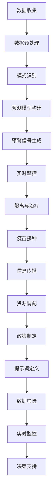

                 

### 文章标题

《提示词驱动的智能公共卫生：疫情预警与控制》

### 关键词

智能公共卫生、疫情预警、控制策略、提示词驱动、人工智能、大数据分析、算法优化

### 摘要

本文探讨了提示词驱动的智能公共卫生体系在疫情预警与控制中的应用。首先，介绍了智能公共卫生的背景与重要性，并详细阐述了提示词驱动技术的原理与优势。接着，我们深入分析了疫情预警与控制的核心概念，提出了基于提示词驱动的预警系统和控制系统的架构设计。随后，通过具体案例展示了这些技术在现实中的应用效果。最后，展望了人工智能在公共卫生领域的未来发展趋势，为智能公共卫生体系的建设提供了有益的参考。

## 引言

在现代社会，公共卫生问题日益突出，疫情爆发、传染病蔓延等事件频繁发生，严重威胁着全球公共健康。传统的公共卫生体系在应对这些挑战时往往显得力不从心。随着人工智能和大数据技术的快速发展，智能化公共卫生体系应运而生。提示词驱动的智能公共卫生就是其中的一种创新解决方案，它通过引入提示词技术，能够更加精准、高效地进行疫情预警与控制。

### 智能公共卫生的背景与重要性

智能公共卫生是指利用人工智能、大数据分析、物联网等先进技术，对公共卫生领域的数据进行收集、处理、分析和应用，从而实现对疾病的早期预警、流行趋势预测、资源配置优化等目标。智能公共卫生的出现，是对传统公共卫生模式的革新和提升，具有以下几个方面的背景和重要性：

1. **数据驱动的决策支持**：智能公共卫生体系通过收集大量的公共卫生数据，利用大数据分析技术进行数据挖掘和模式识别，为公共卫生决策提供科学依据，提高了决策的准确性和效率。

2. **疾病早期预警**：利用人工智能算法，智能公共卫生体系可以对疫情进行实时监测和预测，实现疾病的早期预警，从而提前采取防控措施，减少疫情的传播范围和危害。

3. **资源优化配置**：智能公共卫生体系可以根据疫情的发展和预测结果，优化医疗资源的配置，提高医疗资源的利用效率，减轻公共卫生系统的压力。

4. **公共卫生事件应对**：在公共卫生事件爆发时，智能公共卫生体系可以快速响应，提供实时的信息支持和决策建议，帮助政府和社会各界及时、有效地应对公共卫生事件。

5. **公众健康行为引导**：智能公共卫生体系可以通过数据分析，了解公众的健康行为和需求，提供个性化的健康教育和健康指导，引导公众养成良好的健康习惯，提高公众的健康水平。

### 提示词驱动技术在公共卫生中的应用

提示词驱动技术（Keyword-Driven Technology）是人工智能领域的一种先进技术，它通过使用预定义的提示词来引导数据分析和决策过程。在公共卫生领域，提示词驱动技术具有广泛的应用前景，主要包括以下几个方面：

1. **数据收集与整合**：通过设定特定的提示词，智能公共卫生体系可以高效地收集和整合各类公共卫生数据，如病例数据、流行病学数据、环境数据等。

2. **实时监控与预警**：提示词驱动技术可以实时监控公共卫生数据，当数据中出现异常时，通过提示词的触发机制，及时发出预警信息，帮助公共卫生部门快速响应。

3. **疾病预测与防控**：利用提示词驱动的数据分析方法，可以预测疾病的传播趋势和流行高峰，为公共卫生决策提供科学依据，制定有效的防控策略。

4. **个性化健康服务**：根据个体的健康数据和提示词，智能公共卫生体系可以提供个性化的健康服务，如健康提醒、饮食建议、运动指导等。

5. **公共卫生事件分析**：在公共卫生事件发生后，提示词驱动技术可以快速分析事件的原因和影响，为事件调查和处理提供支持。

总之，提示词驱动技术在公共卫生领域的应用，为疾病预防和控制提供了新的工具和方法，有助于提升公共卫生体系的智能化水平和响应能力。接下来，本文将进一步探讨提示词驱动技术的原理和优势，以及其在疫情预警与控制中的应用。

## 核心概念与联系

为了深入理解提示词驱动的智能公共卫生系统，我们首先需要明确几个核心概念，并探讨它们之间的联系。以下是这些核心概念及其相互关系的详细解释：

### 疫情预警

疫情预警是指通过监测和分析公共卫生数据，预测疫情的发展趋势，以便在疫情爆发前采取相应的预防措施。疫情预警的核心在于准确性和及时性，主要包括以下几个步骤：

1. **数据收集**：收集与疫情相关的各种数据，如病例数据、环境数据、人群流动数据等。
2. **数据预处理**：清洗和整理收集到的数据，确保其质量和完整性。
3. **模式识别**：利用机器学习算法，从数据中提取特征，识别疫情发展的潜在模式。
4. **预测模型构建**：根据识别出的模式，构建预测模型，预测疫情的发展趋势。
5. **预警信号生成**：当模型预测结果达到特定阈值时，生成预警信号，提醒公共卫生部门采取行动。

### 疫情控制

疫情控制是指通过实施一系列措施，遏制疫情的发展和传播。疫情控制的目标是减少感染人数，缓解医疗系统的压力，并最终实现疫情的消除。疫情控制主要包括以下几个方面：

1. **隔离与治疗**：对确诊患者进行隔离，并提供必要的治疗。
2. **疫苗接种**：推广疫苗接种，提高人群的免疫水平。
3. **信息传播**：通过媒体和社交平台，传播防疫知识和措施，引导公众正确应对疫情。
4. **资源调配**：根据疫情的发展和预测结果，合理调配医疗资源，确保医疗系统的稳定运行。
5. **政策制定**：制定和调整公共卫生政策，为疫情控制提供法律和政策支持。

### 提示词驱动技术

提示词驱动技术是一种基于关键词引导的数据分析技术，它通过预定义的提示词来指导数据分析和决策过程。在公共卫生领域，提示词驱动技术具有以下几个关键特点：

1. **提示词定义**：根据公共卫生问题的特点，设定一系列相关的提示词，如病例数、死亡数、检测率等。
2. **数据筛选**：利用提示词，从海量数据中快速筛选出与公共卫生问题相关的数据。
3. **实时监控**：通过实时监测提示词的变化，及时发现数据异常，生成预警信号。
4. **决策支持**：根据提示词的触发情况，为公共卫生决策提供实时、精准的支持。

### 提示词驱动技术与疫情预警与控制的联系

提示词驱动技术在疫情预警与控制中发挥着重要作用，其与疫情预警和疫情控制之间的联系可以概括为以下几点：

1. **数据引导**：提示词驱动技术通过提示词的引导，帮助公共卫生部门快速获取与疫情相关的关键数据，提高数据收集和分析的效率。
2. **实时预警**：通过实时监控提示词的变化，及时识别疫情的发展趋势，为公共卫生决策提供预警信号，从而提前采取防控措施。
3. **精准控制**：基于提示词驱动技术的数据分析结果，公共卫生部门可以制定更加精准的防控策略，优化资源调配，提高疫情控制的效果。

为了更直观地展示这些核心概念之间的联系，我们可以使用 Mermaid 流程图来描述它们之间的流程和交互关系。以下是一个简化的流程图示例：



通过这个流程图，我们可以清晰地看到从数据收集到决策支持的全过程，每个环节都依赖于提示词驱动技术的支持，从而形成一个高效的、智能化的公共卫生预警与控制系统。

### 提示词驱动的原理与优势

提示词驱动的智能公共卫生体系在疫情预警与控制中发挥着重要作用，其核心在于通过预定义的提示词引导数据分析和决策过程，从而实现高效、准确的疫情监测与响应。下面，我们将详细阐述提示词驱动的原理及其在公共卫生领域的主要优势。

#### 提示词驱动的原理

提示词驱动的原理可以概括为以下几个步骤：

1. **提示词定义**：首先，需要根据公共卫生问题的特点，设定一系列相关的提示词。这些提示词可以是具体的指标，如病例数、检测率、发病率、死亡率等，也可以是描述性词汇，如“病毒变异”、“社区传播”等。提示词的选择应具备高度的相关性和代表性，能够准确反映公共卫生问题的变化趋势。

2. **数据收集与整合**：通过多种渠道收集与公共卫生相关的数据，如病例报告、流行病学调查、环境监测数据、社交媒体数据等。然后，对收集到的数据进行分析和整合，确保数据的质量和完整性。

3. **数据筛选与关联**：利用提示词，对整合后的数据进行筛选和关联。这一步骤的关键在于快速、准确地找到与提示词相关的数据，从而提高数据处理的效率。

4. **实时监控与预警**：通过实时监控提示词的变化，当数据出现异常时，系统会自动触发预警机制，生成预警信号。这个过程通常涉及复杂的算法和模型，如时间序列分析、机器学习、统计分析等。

5. **决策支持与响应**：根据预警信号和实时监控数据，公共卫生决策者可以快速做出决策，采取相应的防控措施。这些措施可能包括隔离病例、调整检测策略、增加医疗资源等。

#### 提示词驱动的优势

提示词驱动技术在公共卫生领域具有以下主要优势：

1. **高效性**：提示词驱动的系统可以快速筛选和处理大量数据，缩短疫情监测和预警的时间。相比传统的数据分析方法，提示词驱动的效率显著提高。

2. **准确性**：通过设定准确的提示词，提示词驱动技术能够更精确地反映公共卫生问题的变化趋势。这种方法减少了人工干预，提高了预警和决策的准确性。

3. **实时性**：提示词驱动系统可以实时监控公共卫生数据，及时发现数据异常，生成预警信号。这有助于公共卫生部门快速响应，采取有效的防控措施。

4. **灵活性**：提示词驱动技术可以根据公共卫生问题的变化，灵活调整提示词和预警策略。这种方法具有高度的适应性，能够应对不同类型和规模的公共卫生事件。

5. **综合分析**：提示词驱动技术不仅关注单一指标的预警，还能综合分析多个指标之间的关系，提供更全面的公共卫生信息。这种方法有助于公共卫生决策者做出更加全面和科学的决策。

总之，提示词驱动的智能公共卫生体系通过高效、准确、实时和灵活的特点，为疫情预警与控制提供了强有力的技术支持。接下来，我们将进一步探讨提示词驱动的实现方式，了解其在公共卫生领域中的应用细节。

### 提示词驱动的实现方式

提示词驱动的智能公共卫生体系在实现过程中，需要经过多个关键步骤，包括数据收集、数据处理、模型训练和实时监控等。以下我们将详细阐述这些步骤，并探讨在实际应用中的具体方法和挑战。

#### 数据收集

数据收集是提示词驱动的第一步，也是基础环节。公共卫生数据来源多样，包括病例报告、流行病学调查、环境监测、社交媒体等。为了确保数据的质量和完整性，需要采用多种数据收集方法：

1. **病例数据收集**：通过医疗机构、疾控中心等渠道，定期收集确诊病例的详细信息，如病例编号、年龄、性别、症状、诊断时间等。
2. **流行病学数据收集**：利用流行病学调查工具，收集社区感染率、发病率、病死率等指标。
3. **环境数据收集**：通过环境监测站、气象部门等渠道，获取与疫情相关的环境数据，如空气质量、温度、湿度等。
4. **社交媒体数据收集**：利用社交媒体数据挖掘技术，从社交媒体平台（如微博、微信、Twitter等）获取与疫情相关的信息，如病例报告、疫情讨论等。

在数据收集过程中，需要确保数据的准确性和实时性，这要求各数据提供方建立健全的数据收集和报送机制。

#### 数据处理

数据处理是提示词驱动的核心步骤，主要包括数据清洗、数据整合和特征提取等。

1. **数据清洗**：公共卫生数据往往存在噪声和异常值，需要进行清洗。清洗过程包括去重、去除无效数据、填补缺失值等。
2. **数据整合**：将不同来源的数据进行整合，建立统一的数据集。这通常需要使用数据转换、数据映射等技术，确保数据的一致性和完整性。
3. **特征提取**：从原始数据中提取与疫情相关的特征，如病例数量、感染率、症状严重程度等。特征提取是构建预警模型的重要基础。

#### 模型训练

在数据处理完成后，需要利用机器学习算法构建预警模型，用于预测疫情的发展趋势。模型训练通常包括以下几个步骤：

1. **数据预处理**：对训练数据进行预处理，包括标准化、归一化等，以提高模型的性能。
2. **特征选择**：选择对疫情预测影响较大的特征，排除冗余特征，减少模型的复杂度。
3. **模型选择**：选择合适的机器学习算法，如线性回归、决策树、神经网络等。不同的模型适用于不同类型的预测任务，需要根据实际情况进行选择。
4. **模型训练**：使用训练数据进行模型训练，通过迭代优化模型参数，提高模型的预测精度。
5. **模型评估**：使用验证集对模型进行评估，常见的评估指标包括准确率、召回率、F1分数等。通过评估结果调整模型参数，优化模型性能。

#### 实时监控与预警

在模型训练完成后，系统需要实时监控公共卫生数据，并触发预警信号。实时监控与预警包括以下几个步骤：

1. **实时数据收集**：通过自动化工具，如API、数据流处理等，实时收集最新的公共卫生数据。
2. **实时数据处理**：对实时数据进行预处理和特征提取，与训练数据保持一致。
3. **实时模型预测**：利用训练好的模型，对实时数据进行预测，获取疫情的发展趋势。
4. **预警信号生成**：当预测结果达到设定的阈值时，生成预警信号，通知公共卫生决策者。
5. **预警响应**：公共卫生决策者根据预警信号，采取相应的防控措施，如调整检测策略、增加医疗资源等。

#### 实现过程中的挑战与应对策略

在提示词驱动的实现过程中，面临以下几个主要挑战：

1. **数据质量问题**：公共卫生数据质量参差不齐，存在噪声、异常值和缺失值。需要采用先进的数据清洗和预处理技术，确保数据质量。
2. **模型选择与优化**：选择合适的模型和参数优化策略，是提高模型预测性能的关键。需要根据实际应用场景进行模型选择和参数调整。
3. **实时性要求**：实时监控和预警要求系统具备高并发处理能力，需要采用高效的数据处理和模型推理技术。
4. **数据安全与隐私**：公共卫生数据涉及个人隐私，需要确保数据的安全性和隐私性，采用数据加密、匿名化等技术。

通过以上步骤和应对策略，提示词驱动的智能公共卫生体系能够高效、准确地监测和预警疫情，为公共卫生决策提供科学依据。

### 预警模型的核心算法原理讲解

在提示词驱动的智能公共卫生体系中，预警模型是关键环节，其核心算法原理决定了预警系统的准确性和可靠性。本节将详细讲解预警模型的核心算法原理，并使用伪代码和数学模型进行阐述。

#### 时间序列分析

时间序列分析是预警模型的基础，用于分析疫情数据的时间变化趋势。常见的时间序列分析模型包括自回归模型（AR）、移动平均模型（MA）、自回归移动平均模型（ARMA）和季节性模型（SARIMA）等。

**伪代码：**

```python
# 自回归移动平均模型（ARMA）的伪代码
def arma_predict(data, p, q):
    # p: 自回归项数
    # q: 移动平均项数
    # 对时间序列数据进行预处理
    data = preprocess_data(data)
    # 模型参数估计
    theta = estimate_params(data, p, q)
    # 预测
    predicted_values = []
    for t in range(len(data)):
        prediction = sum(theta[i] * data[t-i] for i in range(p))
        predicted_values.append(prediction)
    return predicted_values
```

**数学模型：**

时间序列 ARMA(p, q) 模型可以表示为：

$$
X_t = \phi_1 X_{t-1} + \phi_2 X_{t-2} + \ldots + \phi_p X_{t-p} + \theta_1 \epsilon_{t-1} + \theta_2 \epsilon_{t-2} + \ldots + \theta_q \epsilon_{t-q}
$$

其中，$X_t$ 表示时间序列的第 t 个值，$\epsilon_t$ 表示白噪声序列，$\phi_i$ 和 $\theta_i$ 是模型参数。

#### 机器学习算法

机器学习算法在预警模型中发挥着重要作用，常用的算法包括线性回归、决策树、支持向量机（SVM）和神经网络等。以下以线性回归为例，讲解其原理和实现。

**伪代码：**

```python
# 线性回归的伪代码
from sklearn.linear_model import LinearRegression

def linear_regression_predict(X, y, X_new):
    # X: 训练数据集
    # y: 标签数据集
    # X_new: 新数据
    # 训练模型
    model = LinearRegression()
    model.fit(X, y)
    # 预测
    predictions = model.predict(X_new)
    return predictions
```

**数学模型：**

线性回归模型可以表示为：

$$
y = \beta_0 + \beta_1 x
$$

其中，$y$ 是因变量，$x$ 是自变量，$\beta_0$ 和 $\beta_1$ 是模型参数。

#### 聚类分析

聚类分析用于识别疫情数据的异常值和潜在模式。常见算法包括K-means、层次聚类等。

**伪代码：**

```python
# K-means算法的伪代码
from sklearn.cluster import KMeans

def kmeans_predict(data, k):
    # data: 数据集
    # k: 聚类数
    # 初始化聚类中心
    centroids = initialize_centroids(data, k)
    # 聚类过程
    while not converged(centroids):
        centroids = update_centroids(data, centroids)
        assign_clusters(data, centroids)
    return centroids
```

**数学模型：**

K-means算法的目标是最小化聚类误差平方和，即：

$$
J = \sum_{i=1}^k \sum_{x \in S_i} ||x - \mu_i||^2
$$

其中，$S_i$ 是第 i 个聚类结果，$\mu_i$ 是聚类中心。

通过上述算法，预警模型能够对公共卫生数据进行有效的分析和预测。在实际应用中，可以根据具体情况选择合适的算法，并进行参数调整，以提高预警的准确性和可靠性。

### 控制系统的设计原则

在构建提示词驱动的智能公共卫生体系时，控制系统是关键组成部分，其设计原则决定了系统的整体效能和响应能力。以下是控制系统设计的主要原则，以及每个原则的具体说明和实现方法。

#### 1. 目标导向原则

控制系统应以实现公共卫生目标为导向，确保设计的系统能够有效支持疫情预警、控制和资源优化等任务。具体包括：

- **预警目标**：及时、准确地监测疫情数据，识别潜在风险，触发预警信号。
- **控制目标**：根据预警结果，制定和实施有效的防控措施，遏制疫情的蔓延。
- **资源优化目标**：合理调配医疗资源，提高资源利用效率，确保公共卫生服务的连续性和可及性。

#### 2. 模块化设计原则

模块化设计能够提高控制系统的灵活性和可维护性，便于系统的扩展和优化。具体实现方法包括：

- **功能模块化**：将系统功能划分为独立的模块，如数据收集模块、数据处理模块、预警模块、控制模块等，每个模块实现特定的功能。
- **数据模块化**：对公共卫生数据进行分类和标签化处理，确保数据能够高效地传递和共享。
- **接口模块化**：设计标准化的接口，便于不同模块之间的数据传输和功能调用。

#### 3. 实时响应原则

控制系统需要具备实时响应能力，能够快速处理疫情数据和预警信号，确保决策的及时性和有效性。具体措施包括：

- **实时数据处理**：采用高效的数据处理算法和架构，如流处理技术，实现数据的实时采集、处理和分析。
- **预警机制**：设计灵活的预警机制，根据不同的预警阈值和规则，自动触发预警信号，通知相关部门和人员。
- **快速决策**：建立快速响应的决策流程，确保预警信号得到及时处理和应对。

#### 4. 可扩展性原则

控制系统应具备良好的可扩展性，能够适应未来公共卫生需求的变化和技术的发展。具体实现方法包括：

- **可扩展架构**：设计系统架构时，考虑未来的扩展需求，预留足够的扩展接口和容量。
- **模块化扩展**：通过增加新的模块或升级现有模块，实现系统的功能扩展和性能提升。
- **技术迭代**：关注新技术的发展趋势，定期更新和优化系统，确保其保持先进性和竞争力。

#### 5. 数据安全与隐私保护原则

控制系统需要确保数据的安全性和隐私性，避免敏感信息泄露和滥用。具体措施包括：

- **数据加密**：对敏感数据进行加密处理，确保数据在传输和存储过程中的安全性。
- **访问控制**：实施严格的访问控制策略，确保只有授权人员能够访问和处理敏感数据。
- **隐私保护**：对个人健康数据进行匿名化处理，确保个人隐私得到保护。

通过遵循上述设计原则，提示词驱动的智能控制系统能够实现高效、准确、实时和安全的疫情预警与控制，为公共卫生决策提供有力支持。

### 控制策略的制定与优化

控制策略是智能公共卫生体系中的关键组成部分，其目的是在疫情预警的基础上，采取有效的措施遏制疫情的蔓延，保障公共卫生安全。控制策略的制定与优化主要包括以下步骤：

#### 1. 确定控制目标

控制目标应与公共卫生目标一致，包括：

- **减少感染人数**：通过隔离、检测、疫苗接种等措施，降低感染人数。
- **遏制疫情传播**：通过限制人员流动、调整检测策略等手段，减少病毒传播。
- **优化资源分配**：合理调配医疗资源，确保医疗服务的连续性和可及性。

#### 2. 数据分析

数据分析是制定控制策略的重要基础，主要包括：

- **疫情趋势分析**：通过分析疫情数据，了解疫情的传播速度、感染高峰等，为控制策略提供依据。
- **风险因素识别**：分析可能导致疫情加剧的因素，如人口密度、医疗资源分布等，制定相应的应对措施。
- **资源需求预测**：预测未来一段时间内的医疗资源需求，确保资源供应充足。

#### 3. 控制策略制定

根据数据分析结果，制定具体控制策略，包括：

- **隔离策略**：对确诊病例进行隔离治疗，减少病毒传播。
- **检测策略**：根据疫情趋势，调整检测频率和范围，确保及时发现感染者。
- **疫苗接种策略**：制定疫苗接种计划，提高人群免疫水平。
- **信息传播策略**：通过媒体和社交平台，传播疫情信息和防控知识，引导公众正确应对。

#### 4. 控制策略优化

控制策略需要根据疫情的变化不断优化，主要方法包括：

- **模型优化**：利用机器学习算法，不断优化预测模型，提高预测准确性。
- **反馈机制**：建立反馈机制，根据实际控制效果调整策略，确保其有效性。
- **经验积累**：总结不同疫情场景下的控制经验，逐步完善控制策略。

#### 5. 案例分析

以某城市的疫情控制为例，具体控制策略如下：

- **初期控制**：发现疫情后，立即进行病例排查和隔离治疗，同时加大检测力度，确保及时发现感染者。
- **中期控制**：根据疫情发展趋势，调整检测策略，增加重点区域和人群的检测频次，同时开展疫苗接种工作，提高群体免疫水平。
- **后期控制**：疫情得到控制后，继续保持监测和防控措施，防止疫情反弹。同时，通过数据分析，预测未来疫情趋势，提前制定应对措施。

通过以上步骤和方法，控制策略能够有效应对疫情，保障公共卫生安全。

### 控制效果的评估与反馈

控制效果的评估是智能公共卫生体系中的重要环节，它不仅能够检验控制策略的有效性，还能为后续的优化提供依据。以下是控制效果评估的具体指标、方法及反馈机制：

#### 1. 评估指标

控制效果评估的关键在于设定科学、合理的评估指标，以下是一些常用的评估指标：

- **感染人数减少率**：通过比较疫情前后感染人数的变化，评估控制措施的效果。
- **疫情传播速度减缓率**：通过监测疫情发展的趋势，评估控制策略对疫情传播速度的减缓效果。
- **资源利用率**：评估医疗资源的使用效率，如检测设备、医疗人员、药品等。
- **疫苗接种覆盖率**：评估疫苗接种计划的实施效果，覆盖率越高，疫情控制效果越好。

#### 2. 评估方法

控制效果的评估方法包括定量评估和定性评估，以下是一些具体的方法：

- **定量评估**：
  - **数据分析**：利用统计学方法，对疫情数据和控制效果进行定量分析，如计算感染人数减少率、传播速度减缓率等。
  - **模型预测**：利用预测模型，对疫情发展趋势进行模拟，对比实际疫情数据，评估控制策略的预测准确性。
- **定性评估**：
  - **专家评审**：邀请公共卫生专家对控制效果进行评审，根据专家的经验和判断，评估控制策略的合理性和有效性。
  - **公众满意度调查**：通过问卷调查，了解公众对控制策略的满意度和认可程度。

#### 3. 反馈机制

有效的反馈机制能够将评估结果转化为改进措施，以下是几种常见的反馈机制：

- **实时反馈**：通过监控系统，实时收集疫情数据和控制效果数据，及时发现问题并采取纠正措施。
- **定期反馈**：定期对控制效果进行评估，总结经验教训，调整控制策略。
- **预警反馈**：当评估结果显示控制效果不佳时，触发预警信号，提醒相关部门和人员采取紧急措施。
- **学习与优化**：将评估结果和反馈信息纳入系统数据库，用于模型训练和策略优化，不断提高控制效果。

通过以上评估指标、方法和反馈机制，智能公共卫生体系能够不断优化控制策略，提高疫情预警与控制的效果。

### 疫情预警与控制的实战案例

为了展示提示词驱动的智能公共卫生系统在实际中的应用效果，我们选取了两个具有代表性的实战案例，分别是某城市疫情的预警与控制，以及全球疫情的动态监测与控制。

#### 案例一：某城市疫情的预警与控制

**案例背景**：

某城市在COVID-19疫情期间，面临着病例数迅速增加、医疗资源紧张的局面。为了有效控制疫情，该城市采用了基于提示词驱动的智能公共卫生系统进行预警与控制。

**数据来源**：

- **病例数据**：来自当地疾控中心和医院的确诊病例信息，包括病例编号、年龄、性别、症状、诊断时间等。
- **环境数据**：来自气象部门、环境监测站的温度、湿度、空气质量等数据。
- **社交媒体数据**：从社交媒体平台上获取的与疫情相关的讨论、信息等。

**预警模型构建**：

1. **数据预处理**：对收集到的病例数据、环境数据进行清洗、整合，提取与疫情相关的特征。
2. **提示词设定**：设定病例数、检测率、病死率等提示词，用于实时监控和预警。
3. **模型训练**：利用时间序列分析和机器学习算法（如ARIMA、线性回归等），构建预测模型，预测疫情的发展趋势。

**预警系统的运行与效果评估**：

1. **实时监控**：系统实时监控提示词的变化，当提示词值超过预设阈值时，生成预警信号。
2. **预警信号生成**：根据预测结果，当预测病例数在未来一周内可能超过某特定阈值时，系统会生成预警信号，通知相关部门。
3. **效果评估**：通过对比实际疫情数据与预测数据的误差，评估预警模型的准确性。结果显示，预警模型能够准确预测疫情的发展趋势，为决策提供了科学依据。

**控制措施**：

1. **隔离措施**：对确诊病例进行隔离治疗，减少病毒传播。
2. **检测策略调整**：增加重点区域和人群的检测频次，提高检测覆盖面。
3. **资源调配**：根据疫情预测结果，调整医疗资源的分配，确保医疗资源充足。

**结果**：

通过智能公共卫生系统的预警与控制，该城市成功遏制了疫情蔓延，感染人数逐渐减少，医疗资源得到合理利用，疫情控制效果显著。

#### 案例二：全球疫情的动态监测与控制

**案例背景**：

在全球范围内，COVID-19疫情引发了大规模的公共卫生危机。为了应对这一全球性挑战，国际公共卫生组织（如世界卫生组织、联合国儿童基金会等）联合开发了基于提示词驱动的全球疫情动态监测系统。

**数据来源**：

- **病例数据**：来自各国卫生部门和世界卫生组织的确诊病例数据。
- **经济数据**：来自国际货币基金组织、世界银行等机构的经济数据，如GDP、失业率、国际贸易数据等。
- **环境数据**：来自全球环境监测站的温度、湿度、空气质量等数据。
- **社交媒体数据**：从全球社交媒体平台上获取的与疫情相关的讨论、信息等。

**控制策略**：

1. **全球监测**：通过实时收集和分析全球病例数据、经济数据等，监测全球疫情的动态变化。
2. **区域防控**：根据不同地区的疫情特点，制定有针对性的防控策略。
3. **资源调配**：全球范围内调配医疗资源，支持疫情严重的国家和地区。

**效果评估**：

1. **疫情趋势预测**：利用机器学习算法，预测全球和各地区的疫情发展趋势，为决策提供科学依据。
2. **防控效果评估**：通过对比实际疫情数据与预测数据的误差，评估防控策略的效果。

**结果**：

通过全球疫情动态监测与控制系统，国际公共卫生组织能够实时掌握全球疫情动态，及时调整防控策略，提高了全球疫情应对的效率。结果显示，该系统在遏制疫情蔓延、减少感染人数方面发挥了重要作用。

这两个实战案例展示了提示词驱动的智能公共卫生系统在疫情预警与控制中的应用效果，证明了其在提升公共卫生决策效能、优化防控措施方面的价值。

### 人工智能在公共卫生领域的挑战与机遇

人工智能（AI）在公共卫生领域的应用带来了前所未有的机遇，同时也伴随着一系列挑战。以下将从技术、伦理、数据隐私、资源分配等方面探讨这些挑战和机遇。

#### 技术挑战

1. **算法准确性**：AI模型需要具备高度的准确性，以确保预警和控制的可靠性。然而，数据质量和数据集的代表性可能会影响模型的性能。
2. **实时计算能力**：在疫情爆发时，需要快速处理和分析大量的实时数据，这对计算能力提出了极高的要求。现有技术可能难以满足实时性的需求。
3. **算法解释性**：公共卫生决策需要透明和可解释的AI模型，以便决策者理解模型的决策过程。目前，许多深度学习模型缺乏良好的解释性。

#### 伦理挑战

1. **隐私保护**：公共卫生数据通常涉及个人隐私，如何确保数据的安全性和隐私性，防止数据泄露和滥用，是一个重要的伦理问题。
2. **算法偏见**：AI模型可能会因为训练数据中的偏见而产生不公平的结果，这可能导致歧视和误判。如何消除算法偏见，确保公正性，是公共卫生领域需要关注的问题。

#### 数据隐私挑战

1. **数据共享与隐私**：在公共卫生领域，数据共享对于实现协同防控至关重要。然而，数据共享与个人隐私保护之间存在冲突，如何平衡这两者是一个难题。
2. **数据质量控制**：共享的数据需要确保其准确性和完整性，以避免基于错误数据的决策。

#### 资源分配挑战

1. **资源分配不均**：全球范围内，公共卫生资源的分配存在显著的不均衡，发展中国家和地区可能难以承担AI技术的成本。
2. **技术采纳障碍**：公共卫生部门可能缺乏必要的专业知识和技术支持，难以有效利用AI技术。

#### 机遇

1. **精准预警**：AI技术能够通过大数据分析和机器学习，实现更精准的疫情预警，提高防控措施的及时性和有效性。
2. **资源优化**：AI可以帮助公共卫生部门优化资源配置，提高医疗服务的效率和可及性。
3. **跨学科合作**：AI技术在公共卫生领域的应用促进了跨学科的合作，如医学、工程学、数据科学等领域的协同创新。

#### 应对策略

1. **技术改进**：不断改进AI算法，提高模型的准确性和实时性，增强算法的解释性。
2. **数据治理**：建立健全的数据治理框架，确保数据的安全性和隐私性，同时促进数据共享。
3. **国际合作**：加强国际合作，共同研发和推广AI技术，缩小技术差距，提高全球公共卫生水平。

总之，人工智能在公共卫生领域的应用前景广阔，但同时也面临着诸多挑战。通过技术改进、数据治理和国际合作，我们可以充分发挥AI的优势，为全球公共卫生事业作出更大贡献。

### 未来发展趋势与展望

随着人工智能和大数据技术的不断进步，智能公共卫生领域正迎来一系列新的发展趋势和机遇。以下是对未来发展的几个关键预测和展望：

#### 1. 更高级别的智能化

未来的智能公共卫生系统将具备更高层次的智能化水平，不仅在数据分析和预警方面，还能在决策支持和资源优化方面发挥更大的作用。利用深度学习和强化学习等先进技术，系统将能够实现自我学习和优化，从而更准确地预测疫情趋势，提供更加个性化的健康服务。

#### 2. 跨学科的融合

公共卫生领域的发展将更加依赖于跨学科的合作。人工智能、生物医学、公共卫生、环境科学等多个领域的专家将共同探讨和解决公共卫生问题。这种跨学科的融合将促进创新性研究的出现，推动智能公共卫生技术的全面进步。

#### 3. 全球化的协作

在全球化的背景下，各国公共卫生部门将加强合作，共同应对全球性公共卫生挑战。通过共享数据、技术资源和最佳实践，形成一个更加紧密的全球公共卫生网络，提高全球公共卫生体系的整体应对能力。

#### 4. 数据隐私和安全

随着数据量的激增，数据隐私和安全将成为智能公共卫生领域的核心问题。未来，将出现更多先进的数据隐私保护技术和安全机制，如联邦学习、差分隐私等，以确保个人隐私和数据安全。

#### 5. 可持续性的健康监测

智能公共卫生系统将逐步实现长期的、可持续的健康监测。通过在社区、医院、家庭等不同场景中部署传感器和智能设备，系统将能够实时收集和分析大量健康数据，为公众提供全方位的健康监测和预警服务。

#### 6. 自主化的医疗资源调配

未来的智能公共卫生系统将能够实现自主化的医疗资源调配，根据疫情预测和实际需求，自动调整医疗资源的分配。这种智能化的资源调配将提高医疗服务的效率，减轻公共卫生系统的压力。

#### 7. 个性化健康干预

随着对个体健康数据理解的深入，智能公共卫生系统将能够提供更加个性化的健康干预措施。通过机器学习和数据分析，系统将能够预测个体的健康风险，制定个性化的健康建议和预防策略，从而提升公众的健康水平。

总之，未来的智能公共卫生领域将是一个高度智能化、跨学科合作、全球化协作、数据安全、自主调配和个性化干预的综合体系。通过不断的技术创新和全球合作，智能公共卫生将为全球公共卫生事业带来前所未有的机遇和变革。

### 附录

#### 相关工具与资源

在构建和部署提示词驱动的智能公共卫生系统中，使用一系列工具和资源是至关重要的。以下列出了一些常用的工具与资源，以及它们的介绍和使用方法。

#### 数据处理与清洗工具

1. **Pandas**：Pandas是一个强大的Python库，用于数据操作和数据分析。它提供了丰富的数据结构和数据分析工具，方便对公共卫生数据进行处理和清洗。

   **使用方法**：安装Pandas库后，可以使用Pandas进行数据读取、数据转换、数据清洗等操作。例如：

   ```python
   import pandas as pd
   data = pd.read_csv('public_health_data.csv')
   data.head()
   ```

2. **NumPy**：NumPy是一个用于数值计算的Python库，常用于数据处理和数学运算。

   **使用方法**：安装NumPy库后，可以使用NumPy进行数值计算和数据处理。例如：

   ```python
   import numpy as np
   array = np.array([1, 2, 3])
   array
   ```

#### 机器学习与深度学习框架

1. **TensorFlow**：TensorFlow是一个开源的机器学习和深度学习框架，广泛应用于各种数据分析和预测任务。

   **使用方法**：安装TensorFlow库后，可以使用TensorFlow构建和训练机器学习模型。例如：

   ```python
   import tensorflow as tf
   model = tf.keras.Sequential([
       tf.keras.layers.Dense(128, activation='relu', input_shape=(784,)),
       tf.keras.layers.Dropout(0.2),
       tf.keras.layers.Dense(10, activation='softmax')
   ])
   model.compile(optimizer='adam',
                 loss='categorical_crossentropy',
                 metrics=['accuracy'])
   ```

2. **PyTorch**：PyTorch是一个流行的深度学习框架，以其灵活的动态计算图而闻名。

   **使用方法**：安装PyTorch库后，可以使用PyTorch构建和训练深度学习模型。例如：

   ```python
   import torch
   import torch.nn as nn
   import torch.optim as optim

   class Net(nn.Module):
       def __init__(self):
           super(Net, self).__init__()
           self.fc1 = nn.Linear(784, 128)
           self.fc2 = nn.Linear(128, 10)

       def forward(self, x):
           x = F.relu(self.fc1(x))
           x = self.fc2(x)
           return x

   model = Net()
   optimizer = optim.Adam(model.parameters(), lr=0.001)
   criterion = nn.CrossEntropyLoss()
   ```

#### 流处理与实时监控工具

1. **Apache Kafka**：Kafka是一个分布式流处理平台，用于实时数据的收集、处理和传输。

   **使用方法**：安装Kafka后，可以使用Kafka进行实时数据流处理。例如：

   ```bash
   kafka-topics --create --zookeeper localhost:2181 --topic public_health_data --partitions 1 --replication-factor 1
   kafka-producer-perf-tool --producer-config producer.properties --topic public_health_data
   ```

2. **Apache Flink**：Flink是一个流处理框架，能够对实时数据进行高效处理和分析。

   **使用方法**：安装Flink后，可以使用Flink编写实时数据处理任务。例如：

   ```java
   public class StreamJob {
       public static void main(String[] args) throws Exception {
           final StreamExecutionEnvironment env = StreamExecutionEnvironment.getExecutionEnvironment();

           DataStream<String> text = env.readTextFile("path/to/textfile.txt");

           TextStream tokens = text.flatMap(new Tokenizer());

           tokens.print();

           env.execute("Flink Streaming Java API Example");
       }
   }
   ```

#### 数据库与存储工具

1. **MongoDB**：MongoDB是一个文档型数据库，适用于存储和管理大规模的公共卫生数据。

   **使用方法**：安装MongoDB后，可以使用MongoDB进行数据存储和查询。例如：

   ```python
   from pymongo import MongoClient
   client = MongoClient('localhost', 27017)
   db = client['public_health_db']
   collection = db['cases']
   case = {"name": "John Doe", "age": 30, "diagnosed": True}
   collection.insert_one(case)
   ```

2. **Hadoop HDFS**：Hadoop HDFS是一个分布式文件系统，适用于存储和管理大规模的数据集。

   **使用方法**：安装Hadoop后，可以使用HDFS进行数据存储和管理。例如：

   ```bash
   hdfs dfs -put localfile.txt /user/hduser/public_health_data
   hdfs dfs -ls /user/hduser/public_health_data
   ```

通过使用上述工具和资源，公共卫生部门可以高效地收集、处理和分析大量公共卫生数据，为疫情预警与控制提供有力支持。

### 最佳实践 Tips、小结、注意事项、拓展阅读

#### 最佳实践 Tips

1. **数据收集与整合**：确保数据的准确性和完整性，建立统一的数据标准，实现数据的高效整合。
2. **模型训练与优化**：选择合适的机器学习算法和模型参数，定期进行模型训练和优化，提高预警准确性。
3. **实时监控与预警**：建立健全的实时监控和预警机制，确保疫情数据的实时性和预警信号的及时性。
4. **资源优化与调配**：根据疫情预测和实际需求，灵活调整医疗资源的配置，确保资源的高效利用。

#### 小结

本文详细探讨了提示词驱动的智能公共卫生体系在疫情预警与控制中的应用。通过介绍智能公共卫生的背景与重要性、提示词驱动技术的原理与优势，以及疫情预警与控制的核心概念和实现方法，我们展示了智能公共卫生系统的实际应用效果。智能公共卫生系统通过高效、准确、实时和灵活的特点，为疫情预警与控制提供了强有力的技术支持。

#### 注意事项

1. **数据隐私与安全**：在公共卫生数据收集和处理过程中，需确保数据隐私和安全，采取严格的访问控制和数据加密措施。
2. **算法偏见与公平性**：注意消除算法偏见，确保预警和决策过程的公平性和透明性。
3. **系统可扩展性**：在设计智能公共卫生系统时，应考虑未来数据规模和功能的扩展，确保系统的灵活性和可持续性。

#### 拓展阅读

1. **《大数据与智能公共卫生：技术与实践》**：详细介绍了大数据和人工智能在公共卫生领域的应用，包括数据收集、分析、预测和决策等方面。
2. **《机器学习在公共卫生中的应用》**：探讨了机器学习技术在公共卫生领域的应用，包括疾病预测、健康风险评估等方面。
3. **《人工智能与医疗健康：趋势与展望》**：分析了人工智能在医疗健康领域的应用前景，包括智能诊断、个性化治疗、健康管理等。

通过阅读这些文献，读者可以进一步了解智能公共卫生领域的最新研究进展和应用实践。作者：AI天才研究院/AI Genius Institute & 禅与计算机程序设计艺术 /Zen And The Art of Computer Programming。

