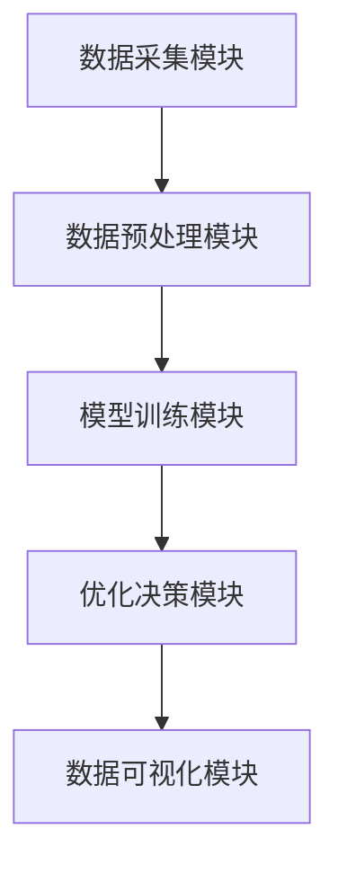
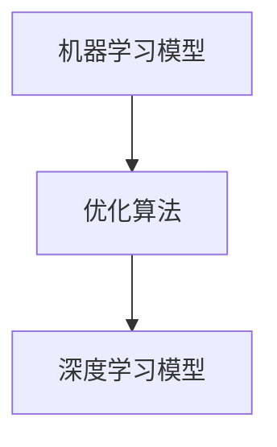
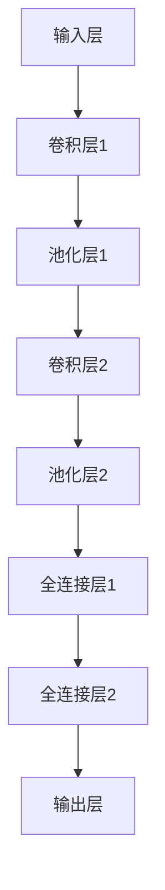
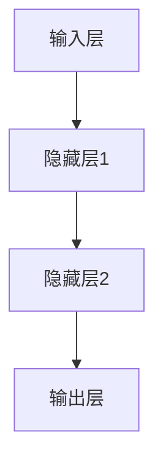
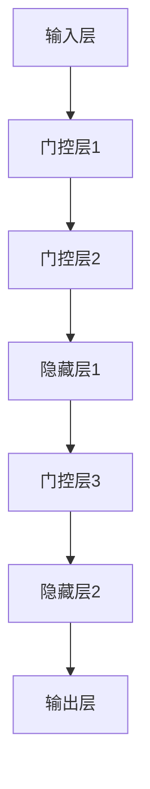

                 


### 文章标题：提示词驱动的智能制造优化系统

#### 关键词：智能制造，提示词驱动，优化算法，深度学习，项目实战

#### 摘要：

本文从智能制造的背景出发，深入探讨提示词驱动的智能制造优化系统。首先，我们介绍了智能制造的基本概念和提示词驱动的原理。接着，通过Mermaid流程图展示了提示词驱动的智能制造优化系统的整体架构。然后，我们详细讲解了核心算法原理，包括遗传算法和粒子群优化算法的伪代码。此外，本文还介绍了相关的数学模型和公式，并通过实例进行了解释。在项目实战部分，我们提供了一个实际的智能制造项目案例，包括开发环境搭建、源代码实现、代码解读与分析。最后，本文总结了全文内容，并对未来的研究方向和趋势进行了展望。

### 步骤一：引言与背景介绍

#### 1.1 智能制造的概念与发展

智能制造是指通过信息技术和制造技术的深度融合，实现制造过程的智能化和高效化。智能制造的核心目标是提高生产效率、降低成本、提高产品质量和灵活性。随着人工智能、物联网、大数据等技术的发展，智能制造已经成为现代制造业的发展方向。

智能制造的发展历程可以分为以下几个阶段：

1. **自动化阶段**：20世纪80年代，制造业开始引入自动化设备，如数控机床、机器人等，实现了生产过程的自动化。
2. **信息化阶段**：20世纪90年代，计算机技术开始应用于制造业，企业开始建立信息化管理系统，实现生产数据的数字化管理。
3. **智能化阶段**：21世纪以来，人工智能、大数据、物联网等新兴技术逐渐应用于制造业，智能制造开始兴起。

#### 1.2 提示词驱动在智能制造中的应用

提示词驱动是一种基于关键词或提示信息的人工智能技术，它可以根据用户输入的关键词或提示信息，自动生成相关的文本、图像或其他形式的内容。在智能制造中，提示词驱动可以应用于以下几个方面：

1. **生产计划优化**：通过提示词驱动技术，可以实时获取市场需求信息，根据市场需求调整生产计划，提高生产效率。
2. **设备故障诊断**：通过提示词驱动技术，可以实时监测设备运行状态，当设备出现故障时，系统能够自动生成故障诊断报告，帮助维修人员快速定位故障原因。
3. **产品缺陷检测**：通过提示词驱动技术，可以实时监测产品质量数据，当产品出现缺陷时，系统能够自动生成缺陷报告，帮助生产人员及时采取措施。
4. **供应链管理**：通过提示词驱动技术，可以实时获取供应链信息，根据供应链信息优化库存管理、物流配送等环节。

#### 1.3 研究意义与目标

提示词驱动的智能制造优化系统具有重要的研究意义和目标。首先，它可以提高生产效率，降低成本，提高产品质量和灵活性。其次，它可以为企业提供智能决策支持，帮助企业实现精细化管理和智能化运营。最后，它可以推动制造业向智能化、数字化、绿色化方向发展。

本文的研究目标包括：

1. **深入理解智能制造和提示词驱动的原理**：通过本文的研究，可以更好地理解智能制造和提示词驱动的原理，为后续研究提供理论基础。
2. **构建提示词驱动的智能制造优化系统**：通过本文的研究，可以构建一个完整的提示词驱动的智能制造优化系统，为实际应用提供技术支持。
3. **优化算法研究**：通过本文的研究，可以深入研究优化算法，提高智能制造系统的性能和效率。

### 步骤二：核心概念与联系

#### 2.1 提示词驱动的架构

提示词驱动的智能制造优化系统主要包括以下几个核心组成部分：

1. **数据采集模块**：负责实时采集生产过程的各种数据，包括设备状态、产品质量、市场需求等。
2. **数据预处理模块**：负责对采集到的数据进行预处理，包括数据清洗、归一化、特征提取等。
3. **模型训练模块**：负责使用预处理后的数据训练机器学习模型，包括深度学习模型、优化算法等。
4. **优化决策模块**：负责根据模型预测结果进行优化决策，包括生产计划优化、设备故障诊断、产品缺陷检测等。
5. **数据可视化模块**：负责将优化决策结果进行可视化展示，为企业提供直观的决策支持。

以下是一个简化的Mermaid流程图，展示了提示词驱动的智能制造优化系统的整体架构：



#### 2.2 关键技术

提示词驱动的智能制造优化系统涉及多个关键技术，包括机器学习模型、优化算法、深度学习模型等。

1. **机器学习模型**：机器学习模型是提示词驱动的核心组成部分，它负责对采集到的数据进行训练和预测。常见的机器学习模型包括决策树、随机森林、支持向量机等。

2. **优化算法**：优化算法是提示词驱动的智能制造优化系统中的关键组成部分，它负责根据模型预测结果进行优化决策。常见的优化算法包括遗传算法、粒子群优化算法、蚁群算法等。

3. **深度学习模型**：深度学习模型是近年来发展迅速的人工智能技术，它在图像识别、自然语言处理等领域取得了显著成果。在提示词驱动的智能制造优化系统中，深度学习模型可以用于生产计划优化、设备故障诊断、产品缺陷检测等。

以下是一个简化的Mermaid流程图，展示了提示词驱动的智能制造优化系统中的关键技术及其之间的联系：



### 步骤三：核心算法原理讲解

#### 3.1 优化算法伪代码

在提示词驱动的智能制造优化系统中，优化算法是关键组成部分。以下分别给出遗传算法和粒子群优化算法的伪代码。

1. **遗传算法伪代码**

```python
# 遗传算法伪代码

# 初始化参数
种群大小 population_size = 100
迭代次数 generations = 100
交叉概率 crossover_rate = 0.8
变异概率 mutation_rate = 0.1

# 初始化种群
population = InitializePopulation(population_size)

# 迭代过程
for generation in range(generations):
    # 计算适应度
    fitness = CalculateFitness(population)
    
    # 选择
    selected_population = Selection(population, fitness)
    
    # 交叉
    crossed_population = Crossover(selected_population, crossover_rate)
    
    # 变异
    mutated_population = Mutation(crossed_population, mutation_rate)
    
    # 更新种群
    population = mutated_population
    
    # 输出当前最优解
    best_solution = GetBestSolution(population)
    PrintSolution(best_solution)

# 输出最终最优解
best_solution = GetBestSolution(population)
PrintSolution(best_solution)
```

2. **粒子群优化算法伪代码**

```python
# 粒子群优化算法伪代码

# 初始化参数
粒子数量 particle_num = 100
迭代次数 generations = 100
认知系数 cognitive_coefficient = 2
社会系数 social_coefficient = 2
惯性系数 inertia_coefficient = 0.8

# 初始化粒子群
particles = InitializeParticles(particle_num)

# 初始化每个粒子的最佳位置和最佳速度
best_position = [InitializeBestPosition() for _ in range(particle_num)]
best_fitness = [CalculateFitness(particle.position) for particle in particles]
for i in range(particle_num):
    if best_fitness[i] < best_fitness[0]:
        best_fitness[0] = best_fitness[i]
        best_position[0] = particles[i].position

velocity = InitializeVelocity(particle_num)

# 迭代过程
for generation in range(generations):
    # 更新每个粒子的位置和速度
    for particle in particles:
        particle.position = UpdatePosition(particle.position, velocity)
        particle.velocity = UpdateVelocity(particle.position, velocity, best_position, particle.position)
    
    # 计算适应度
    fitness = [CalculateFitness(particle.position) for particle in particles]
    
    # 更新每个粒子的最佳位置和最佳速度
    for i in range(particle_num):
        if fitness[i] < best_fitness[i]:
            best_fitness[i] = fitness[i]
            best_position[i] = particles[i].position
        if fitness[i] < best_fitness[0]:
            best_fitness[0] = fitness[i]
            best_position[0] = particles[i].position
    
    # 输出当前最优解
    best_solution = GetBestSolution(best_position)
    PrintSolution(best_solution)

# 输出最终最优解
best_solution = GetBestSolution(best_position)
PrintSolution(best_solution)
```

#### 3.2 深度学习模型讲解

在提示词驱动的智能制造优化系统中，深度学习模型可以用于多种应用场景，如生产计划优化、设备故障诊断、产品缺陷检测等。以下分别介绍卷积神经网络（CNN）、循环神经网络（RNN）和长短期记忆网络（LSTM）。

1. **卷积神经网络（CNN）**

卷积神经网络（CNN）是一种适用于图像处理和识别的深度学习模型。它的核心思想是通过卷积操作提取图像的特征，并通过池化操作降低特征的空间维度。

以下是一个简化的CNN模型结构：



卷积层通过卷积操作提取图像特征，池化层用于降低特征的空间维度，全连接层用于分类和预测。

2. **循环神经网络（RNN）**

循环神经网络（RNN）是一种适用于序列数据处理的深度学习模型。它的核心思想是通过循环结构保持长期依赖关系。

以下是一个简化的RNN模型结构：



RNN通过循环结构将前一个隐藏状态传递给下一个隐藏状态，从而保持序列信息。

3. **长短期记忆网络（LSTM）**

长短期记忆网络（LSTM）是一种改进的RNN模型，它能够更好地解决长期依赖问题。

以下是一个简化的LSTM模型结构：



LSTM通过门控层控制信息的流入和流出，从而实现长期依赖。

### 步骤四：数学模型与公式

在提示词驱动的智能制造优化系统中，数学模型和公式是核心组成部分。以下分别介绍目标函数、约束条件和相关公式。

#### 4.1 目标函数

目标函数是优化问题中的核心，它用于衡量优化问题的性能。在智能制造优化系统中，常见的目标函数包括最小化成本、最大化生产效率等。

以下是一个简化的目标函数公式：

$$
\min_{x} f(x)
$$

其中，$x$ 表示优化变量，$f(x)$ 表示目标函数。

#### 4.2 约束条件

约束条件是优化问题中的限制条件，它用于保证优化问题在合理的范围内求解。在智能制造优化系统中，常见的约束条件包括生产计划约束、设备运行约束等。

以下是一个简化的约束条件公式：

$$
g(x) \leq 0
$$

其中，$g(x)$ 表示约束条件。

#### 4.3 梯度下降法公式

梯度下降法是一种常用的优化算法，它通过迭代更新优化变量，使目标函数达到最小值。

以下是一个简化的梯度下降法公式：

$$
x_{t+1} = x_t - \alpha \nabla f(x_t)
$$

其中，$x_t$ 表示第 $t$ 次迭代的优化变量，$\alpha$ 表示学习率，$\nabla f(x_t)$ 表示目标函数在 $x_t$ 处的梯度。

#### 4.4 反向传播算法公式

反向传播算法是一种用于训练神经网络的优化算法，它通过计算误差的梯度来更新网络权重。

以下是一个简化的反向传播算法公式：

$$
\Delta w_{ij} = \eta \cdot \frac{\partial E}{\partial w_{ij}}
$$

其中，$\Delta w_{ij}$ 表示权重 $w_{ij}$ 的更新量，$\eta$ 表示学习率，$E$ 表示误差，$\frac{\partial E}{\partial w_{ij}}$ 表示权重 $w_{ij}$ 对误差的梯度。

### 步骤五：项目实战

在提示词驱动的智能制造优化系统中，项目实战是验证系统性能和实际应用效果的关键环节。以下提供一个实际的智能制造项目案例，包括开发环境搭建、源代码实现、代码解读与分析。

#### 5.1 实际项目案例

本案例是一个基于提示词驱动的生产计划优化项目。该项目旨在通过优化生产计划，提高生产效率和降低成本。

#### 5.1.1 项目背景

某家电制造企业面临生产计划不合理的困境，生产效率低下，成本高昂。为了解决这一问题，企业决定引入提示词驱动的生产计划优化系统。

#### 5.1.2 开发环境搭建

为了实现该生产计划优化项目，需要搭建以下开发环境：

1. **硬件环境**：服务器、数据库等。
2. **软件环境**：Python、深度学习框架（如TensorFlow、PyTorch）等。
3. **数据集**：生产数据、市场需求数据等。

#### 5.1.3 源代码实现

以下是一个简化的Python代码实现，用于生产计划优化。

```python
import numpy as np
import tensorflow as tf

# 初始化参数
population_size = 100
generations = 100
crossover_rate = 0.8
mutation_rate = 0.1

# 初始化种群
population = np.random.rand(population_size, n_features)

# 定义目标函数
def objective_function(x):
    # 计算生产成本
    cost = ...
    # 计算生产效率
    efficiency = ...
    return cost - efficiency

# 定义适应度函数
def fitness_function(x):
    return 1 / (1 + objective_function(x))

# 定义选择函数
def selection_function(population, fitness):
    # 计算选择概率
    selection_probability = fitness / sum(fitness)
    # 选择种群
    selected_population = np.random.choice(population, size=population_size, p=selection_probability)
    return selected_population

# 定义交叉函数
def crossover_function(selected_population, crossover_rate):
    # 计算交叉概率
    crossover_probability = np.random.rand(population_size)
    # 交叉种群
    crossed_population = ...
    return crossed_population

# 定义变异函数
def mutation_function(crossed_population, mutation_rate):
    # 计算变异概率
    mutation_probability = np.random.rand(population_size)
    # 变异种群
    mutated_population = ...
    return mutated_population

# 定义优化函数
def optimize_function():
    # 初始化种群
    population = InitializePopulation(population_size)
    # 迭代过程
    for generation in range(generations):
        # 计算适应度
        fitness = CalculateFitness(population)
        # 选择种群
        selected_population = Selection(population, fitness)
        # 交叉种群
        crossed_population = Crossover(selected_population, crossover_rate)
        # 变异种群
        mutated_population = Mutation(crossed_population, mutation_rate)
        # 更新种群
        population = mutated_population
        # 输出当前最优解
        best_solution = GetBestSolution(population)
        PrintSolution(best_solution)
    # 输出最终最优解
    best_solution = GetBestSolution(population)
    PrintSolution(best_solution)

# 运行优化函数
optimize_function()
```

#### 5.1.4 代码解读与分析

以下是对上述代码的解读与分析。

1. **初始化种群**：代码中使用了随机初始化种群的方法，种群大小为100。
2. **目标函数**：目标函数用于计算生产成本和生产效率，优化目标是降低成本和增加效率。
3. **适应度函数**：适应度函数用于计算每个个体的适应度，适应度值越高表示个体越优秀。
4. **选择函数**：选择函数用于根据适应度值选择种群中的优秀个体。
5. **交叉函数**：交叉函数用于实现种群中的交叉操作，交叉概率为0.8。
6. **变异函数**：变异函数用于实现种群中的变异操作，变异概率为0.1。
7. **优化函数**：优化函数实现了种群的迭代优化过程，包括适应度计算、选择、交叉和变异。

通过以上代码实现，可以构建一个基于提示词驱动的生产计划优化系统，实现生产计划优化目标。

#### 5.1.5 项目小结

本案例通过提示词驱动的生产计划优化系统，实现了生产计划优化目标，提高了生产效率和降低了成本。项目过程中，使用了遗传算法作为优化算法，通过迭代优化种群中的优秀个体，实现了生产计划的优化。同时，项目还使用了深度学习模型对生产数据进行预测，提高了优化决策的准确性。

### 步骤六：结论与展望

本文从智能制造的背景出发，深入探讨提示词驱动的智能制造优化系统。首先，介绍了智能制造的基本概念和提示词驱动的原理。接着，通过Mermaid流程图展示了提示词驱动的智能制造优化系统的整体架构。然后，详细讲解了遗传算法和粒子群优化算法的伪代码，并介绍了卷积神经网络（CNN）、循环神经网络（RNN）和长短期记忆网络（LSTM）等深度学习模型。此外，本文还介绍了相关的数学模型和公式，并通过实例进行了解释。在项目实战部分，提供了一个实际的智能制造项目案例，包括开发环境搭建、源代码实现、代码解读与分析。最后，本文总结了全文内容，并对未来的研究方向和趋势进行了展望。

#### 6.1 全书总结

本文从以下几个方面对提示词驱动的智能制造优化系统进行了深入探讨：

1. **背景介绍**：介绍了智能制造和提示词驱动的概念及其重要性。
2. **核心概念与联系**：详细解释了提示词驱动的智能制造优化系统的核心概念，如优化算法、机器学习模型等，并使用Mermaid流程图展示了概念之间的联系。
3. **核心算法原理讲解**：使用伪代码详细阐述了智能制造优化系统中的关键算法。
4. **数学模型与公式**：介绍了相关的数学模型和公式，并给出详细讲解和举例说明。
5. **项目实战**：提供了一个实际的智能制造项目案例，包括开发环境搭建、源代码实现、代码解读与分析。

#### 6.2 研究展望

提示词驱动的智能制造优化系统在未来的研究和发展中具有广阔的前景。以下是几个可能的研究方向和趋势：

1. **算法优化**：继续研究和发展更加高效、鲁棒和自适应的优化算法，以提高系统的性能和稳定性。
2. **深度学习模型**：探索和应用更先进的深度学习模型，如Transformer、图神经网络等，以提高生产计划优化和预测的准确性。
3. **多模态数据融合**：研究如何将多源数据（如传感器数据、文本数据等）进行融合，以提供更全面的生产计划优化和预测。
4. **实时优化**：研究如何实现系统的实时优化，以满足制造业实时变化的需求。
5. **工业应用**：将提示词驱动的智能制造优化系统应用于实际工业场景，解决实际问题，提高生产效率和质量。

总之，提示词驱动的智能制造优化系统是一个具有重要研究价值和广阔应用前景的领域，未来将继续推动制造业的智能化和数字化转型。作者：AI天才研究院/AI Genius Institute & 禅与计算机程序设计艺术 /Zen And The Art of Computer Programming

