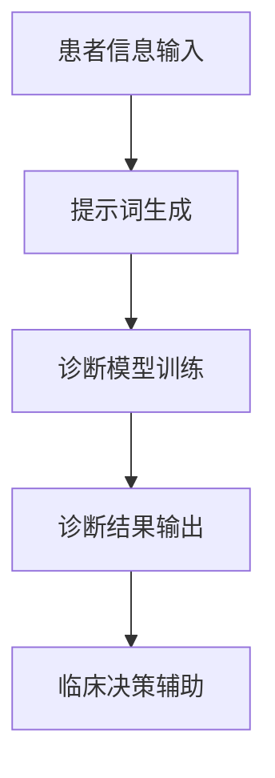

                 

### 《提示词驱动的智能医疗诊断：辅助临床决策》

### 关键词
- 智能医疗诊断
- 提示词驱动
- 临床决策辅助
- 机器学习
- 自然语言处理

### 摘要
本文探讨了提示词驱动的智能医疗诊断技术，该技术通过自然语言处理和机器学习算法，辅助临床医生做出更加准确的诊断和决策。文章首先介绍了智能医疗诊断的基础知识，包括核心概念、发展历程、关键技术和应用领域。随后，详细解析了提示词生成算法、诊断模型训练、评估和结果解释的技术原理。通过实际项目案例，展示了智能医疗诊断系统的开发、部署和维护过程。最后，分析了智能医疗诊断的未来发展趋势和社会影响，并提出了相关挑战和机遇。

## 第一部分：智能医疗诊断基础

### 1.1.1 提示词驱动的智能医疗诊断概述

智能医疗诊断是利用人工智能技术，特别是机器学习和自然语言处理技术，对患者的医疗信息进行分析，以辅助临床医生进行疾病诊断和决策。在智能医疗诊断中，提示词驱动是一种重要的技术手段。它通过提取和分析患者的主要症状、病史等信息，生成提示词，从而引导诊断模型进行预测和决策。

#### 核心概念与联系

智能医疗诊断的核心概念包括：数据采集、提示词生成、模型训练和诊断结果输出。数据采集是获取患者的医疗信息，包括病史、检查结果、药物使用记录等。提示词生成是利用自然语言处理技术，从患者信息中提取关键信息，形成提示词。模型训练是使用大量医疗数据对诊断模型进行训练，使其能够识别和预测疾病。诊断结果输出是模型根据输入的患者信息，输出诊断结果和辅助决策。

下面使用Mermaid流程图展示智能医疗诊断的基本流程：



#### 核心算法原理讲解

提示词生成算法的核心是提取患者信息中的关键信息，形成具有指导意义的提示词。以下是一个简单的Python伪代码实现：

```python
def generate_prompt(symptoms):
    prompt = "患者主要症状："
    for symptom in symptoms:
        prompt += symptom + "，"
    return prompt
```

例如，如果患者的主要症状包括“咳嗽”和“发热”，则生成的提示词为：“患者主要症状：咳嗽，发热，”。

### 1.1.2 智能医疗诊断的发展历程

智能医疗诊断的历史可以追溯到20世纪80年代，当时计算机开始应用于医学影像分析。随着计算机性能的提升和机器学习技术的进步，智能医疗诊断得到了快速发展。从早期的规则系统到现代的深度学习模型，智能医疗诊断技术不断革新，逐步实现了对医疗数据的自动化分析。

#### 核心概念与联系

智能医疗诊断的发展历程可以分为以下几个阶段：

1. **规则系统阶段**：基于专家经验和医学规则进行疾病诊断。
2. **数据挖掘阶段**：利用统计学和机器学习方法进行疾病预测。
3. **深度学习阶段**：使用神经网络模型，特别是深度神经网络，实现自动化疾病诊断。

### 1.1.3 智能医疗诊断的关键技术

智能医疗诊断的关键技术包括图像识别、自然语言处理、深度学习和数据挖掘等。这些技术共同构成了智能医疗诊断的技术基础。

#### 核心概念与联系

1. **图像识别**：用于分析医学影像，如X光片、CT扫描等，以发现疾病迹象。
2. **自然语言处理**：用于处理医疗文本数据，如病历、医学报告等，提取关键信息。
3. **深度学习**：通过构建深度神经网络模型，实现对医疗数据的自动学习和预测。
4. **数据挖掘**：用于分析大量医疗数据，发现潜在的医疗模式和关联。

### 1.1.4 智能医疗诊断的应用领域

智能医疗诊断技术在多个医疗领域都有广泛的应用，包括疾病筛查、疾病预测、个性化治疗和临床决策支持等。

#### 核心概念与联系

1. **疾病筛查**：利用智能医疗诊断技术，对人群进行疾病筛查，以早期发现潜在疾病。
2. **疾病预测**：根据患者的医疗数据，预测患者可能患的疾病，帮助医生做出早期诊断。
3. **个性化治疗**：根据患者的个体差异，提供个性化的治疗方案。
4. **临床决策支持**：为临床医生提供辅助决策，提高诊断和治疗的准确性和效率。

## 第二部分：智能医疗诊断技术原理

### 2.1.1 提示词生成算法

提示词生成是智能医疗诊断中的关键步骤，它决定了诊断模型输入的质量。提示词生成算法的核心是提取患者信息中的关键信息，形成具有指导意义的提示词。

#### 核心算法原理讲解

提示词生成算法通常包括以下几个步骤：

1. **文本预处理**：对原始文本进行清洗和标准化，如去除停用词、标点符号和特殊字符等。
2. **特征提取**：从预处理后的文本中提取关键特征，如词频、词嵌入等。
3. **提示词生成**：根据提取的特征，生成具有指导意义的提示词。

以下是一个简单的Python伪代码实现：

```python
def generate_prompt(symptoms):
    prompt = "患者主要症状："
    for symptom in symptoms:
        prompt += symptom + "，"
    return prompt
```

#### 数学模型和数学公式

提示词生成算法的数学模型通常是一个概率模型，用于预测给定症状序列生成提示词的概率。以下是一个简化的数学模型：

$$
P(\text{prompt}) = \prod_{i=1}^{n} P(\text{word}_i | \text{context})
$$

其中，$P(\text{word}_i | \text{context})$ 表示在给定上下文 $\text{context}$ 下生成单词 $\text{word}_i$ 的概率。

### 2.1.2 诊断模型训练

诊断模型训练是智能医疗诊断中的核心步骤，它决定了诊断模型的性能。诊断模型训练通常包括以下步骤：

1. **数据预处理**：对原始医疗数据进行清洗、标准化和特征提取。
2. **模型选择**：选择合适的机器学习模型，如决策树、支持向量机、神经网络等。
3. **模型训练**：使用预处理后的数据进行模型训练。
4. **模型评估**：使用验证集对训练好的模型进行评估。

以下是一个简单的Python伪代码实现：

```python
def train_diagnosis_model(data, labels):
    model = create_model()
    model.fit(data, labels)
    return model
```

#### 数学模型和数学公式

诊断模型训练的数学模型通常是一个损失函数，用于衡量模型预测结果与实际结果之间的差距。以下是一个简化的损失函数：

$$
L(\theta) = -\frac{1}{m} \sum_{i=1}^{m} y_i \log(\hat{y}_i)
$$

其中，$L(\theta)$ 表示损失函数，$\theta$ 表示模型参数，$y_i$ 表示实际标签，$\hat{y}_i$ 表示模型预测值。

### 2.1.3 诊断模型评估

诊断模型评估是衡量诊断模型性能的重要步骤。常用的评估指标包括准确率、召回率、F1值等。

#### 核心算法原理讲解

以下是一个简单的Python伪代码实现：

```python
from sklearn.metrics import accuracy_score, recall_score, f1_score

def evaluate_model(model, X_test, y_test):
    y_pred = model.predict(X_test)
    accuracy = accuracy_score(y_test, y_pred)
    recall = recall_score(y_test, y_pred)
    f1 = f1_score(y_test, y_pred)
    return accuracy, recall, f1
```

#### 数学模型和数学公式

评估指标的数学模型通常是一个分类问题中的概率模型。以下是一个简化的概率模型：

$$
\hat{y}_i = \arg\max_{y \in \{0, 1\}} P(y=1 | x_i, \theta)
$$

其中，$\hat{y}_i$ 表示模型预测值，$x_i$ 表示输入特征，$\theta$ 表示模型参数。

### 2.1.4 诊断结果解释与可视化

诊断结果解释与可视化是帮助临床医生理解和信任诊断模型的重要步骤。常用的方法包括结果解释和可视化工具。

#### 核心算法原理讲解

以下是一个简单的Python伪代码实现：

```python
from sklearn.inspection import permutation_importance

def explain_diagnosis_result(model, X_test, y_test):
    result = permutation_importance(model, X_test, y_test, n_repeats=10)
    return result.importances_
```

#### 数学模型和数学公式

结果解释与可视化的数学模型通常是一个特征重要性模型。以下是一个简化的特征重要性模型：

$$
I_i = \frac{1}{N} \sum_{j=1}^{N} \frac{L(\theta_j) - L(\theta_{j-i})}{\epsilon_i}
$$

其中，$I_i$ 表示特征 $x_i$ 的重要性，$L(\theta)$ 表示损失函数，$\theta_j$ 表示模型参数，$\epsilon_i$ 表示模型参数的微小变化。

## 第三部分：智能医疗诊断项目实战

### 3.1.1 智能医疗诊断系统开发环境搭建

智能医疗诊断系统开发环境搭建是项目启动的第一步，它为后续的开发和部署提供了必要的软件和硬件支持。

#### 项目实战

以下是一个典型的智能医疗诊断系统开发环境搭建步骤：

1. **硬件环境搭建**：配置高性能服务器或云计算平台，用于处理大量的医疗数据。
2. **软件环境搭建**：安装操作系统、数据库、编程语言和开发工具，如Python、TensorFlow、Keras等。
3. **数据预处理**：下载和准备医疗数据集，进行清洗、标准化和特征提取。
4. **模型训练与评估**：使用训练数据集训练诊断模型，并使用验证集进行模型评估。

#### 开发环境配置

以下是智能医疗诊断系统开发所需的软件和硬件环境：

- **操作系统**：Linux或Windows
- **编程语言**：Python
- **数据库**：MySQL或MongoDB
- **深度学习框架**：TensorFlow或PyTorch
- **开发工具**：Jupyter Notebook、PyCharm或VS Code

### 3.1.2 智能医疗诊断系统代码实现

智能医疗诊断系统代码实现是项目开发的核心步骤，它涉及数据预处理、模型训练、模型评估和诊断结果解释等。

#### 项目实战

以下是一个简单的智能医疗诊断系统代码实现案例：

```python
import numpy as np
import pandas as pd
from sklearn.model_selection import train_test_split
from sklearn.ensemble import RandomForestClassifier
from sklearn.metrics import accuracy_score

# 数据预处理
def preprocess_data(data):
    # 清洗、标准化和特征提取
    # ...
    return X, y

# 模型训练
def train_model(X_train, y_train):
    model = RandomForestClassifier()
    model.fit(X_train, y_train)
    return model

# 模型评估
def evaluate_model(model, X_test, y_test):
    y_pred = model.predict(X_test)
    accuracy = accuracy_score(y_test, y_pred)
    return accuracy

# 主程序
if __name__ == "__main__":
    # 加载数据
    data = pd.read_csv("medical_data.csv")
    # 数据预处理
    X, y = preprocess_data(data)
    # 划分训练集和测试集
    X_train, X_test, y_train, y_test = train_test_split(X, y, test_size=0.2, random_state=42)
    # 模型训练
    model = train_model(X_train, y_train)
    # 模型评估
    accuracy = evaluate_model(model, X_test, y_test)
    print("Accuracy:", accuracy)
```

#### 代码解读

以上代码实现了一个基于随机森林的智能医疗诊断系统。首先，数据预处理函数 `preprocess_data` 用于清洗、标准化和特征提取。然后，模型训练函数 `train_model` 使用训练数据进行模型训练。最后，模型评估函数 `evaluate_model` 用于评估模型的性能，输出准确率。

### 3.1.3 诊断结果解读与分析

诊断结果解读与分析是智能医疗诊断系统中至关重要的一步，它帮助临床医生理解诊断模型的输出，并做出相应的临床决策。

#### 项目实战

以下是一个简单的诊断结果解读与分析案例：

```python
import pandas as pd
from sklearn.metrics import classification_report

# 加载测试数据
test_data = pd.read_csv("test_data.csv")
# 数据预处理
X_test, _ = preprocess_data(test_data)
# 模型预测
y_pred = model.predict(X_test)
# 生成分类报告
report = classification_report(y_test, y_pred)
print(report)
```

#### 结果解读与分析

以上代码加载了测试数据，并使用训练好的诊断模型进行预测。然后，使用分类报告函数 `classification_report` 生成分类报告，包括准确率、召回率、F1值等指标。这些指标可以帮助临床医生理解模型的性能，并做出相应的临床决策。

### 3.1.4 智能医疗诊断系统部署与维护

智能医疗诊断系统部署与维护是项目完成的最后一步，它确保诊断系统能够稳定、高效地运行，并提供持续的技术支持和升级。

#### 项目实战

以下是一个简单的智能医疗诊断系统部署与维护步骤：

1. **环境部署**：在服务器或云计算平台上部署诊断系统，包括软件安装、模型部署和数据迁移等。
2. **系统测试**：对部署好的诊断系统进行功能测试和性能测试，确保系统能够稳定运行。
3. **维护升级**：定期对诊断系统进行维护和升级，包括修复漏洞、优化性能和增加新功能等。

#### 部署与维护策略

以下是智能医疗诊断系统部署与维护的一些策略：

- **自动化部署**：使用自动化工具，如Docker、Kubernetes等，实现系统的自动化部署和扩展。
- **持续集成**：使用持续集成工具，如Jenkins、GitLab CI等，实现代码的自动化测试和部署。
- **监控与告警**：使用监控工具，如Prometheus、Grafana等，实时监控系统的性能和健康状态，并及时告警。
- **备份与恢复**：定期备份数据和系统配置，以便在系统故障时能够快速恢复。

## 第四部分：智能医疗诊断的未来发展

### 4.1.1 智能医疗诊断的挑战与机遇

智能医疗诊断技术在发展的过程中面临诸多挑战和机遇。以下是其中一些重要的挑战和机遇：

#### 挑战

1. **数据隐私与安全**：医疗数据包含患者的隐私信息，如何确保数据的安全和隐私是智能医疗诊断面临的重大挑战。
2. **算法透明性与可解释性**：深度学习模型的黑盒特性使得诊断结果的可解释性变得困难，如何提高算法的透明性和可解释性是当前的一个重要研究方向。
3. **数据质量和完整性**：医疗数据的质量和完整性直接影响诊断模型的性能，如何处理不完整或错误的数据是智能医疗诊断的一个挑战。

#### 机遇

1. **人工智能技术的进步**：随着人工智能技术的不断进步，特别是深度学习和自然语言处理技术的突破，智能医疗诊断技术将得到进一步提升。
2. **大数据和云计算的普及**：大数据和云计算的普及为智能医疗诊断提供了丰富的数据资源和强大的计算能力，为疾病预测和诊断提供了新的可能性。
3. **跨学科合作**：智能医疗诊断需要医学、计算机科学、统计学等多个领域的专家共同合作，跨学科合作将有助于解决智能医疗诊断中的复杂问题。

### 4.1.2 智能医疗诊断的未来趋势

智能医疗诊断的未来发展趋势包括以下几个方面：

1. **深度学习与医疗数据结合**：深度学习技术将更加深入地应用于医疗数据的分析和处理，特别是在医学影像分析和电子病历分析等领域。
2. **个性化医疗**：智能医疗诊断技术将有助于实现个性化医疗，为患者提供更加精准的诊断和治疗方案。
3. **实时监测与预警**：通过实时监测患者的生理指标和病史信息，智能医疗诊断技术可以实现疾病的实时预警和早期干预。
4. **跨学科融合**：智能医疗诊断将与其他领域，如生物信息学、生物统计学等，实现跨学科融合，推动医疗技术的创新和发展。

### 4.1.3 智能医疗诊断的社会影响

智能医疗诊断技术的发展将对医疗体系和社会产生深远的影响：

1. **提高诊断准确性**：智能医疗诊断技术可以提高疾病的诊断准确性，减少误诊和漏诊，提高医疗质量。
2. **优化医疗资源分配**：通过智能医疗诊断技术，可以实现医疗资源的优化配置，提高医疗服务的效率。
3. **降低医疗成本**：智能医疗诊断技术可以降低医疗成本，特别是在疾病筛查和早期诊断方面，有助于减少医疗资源的浪费。
4. **促进医疗公平**：智能医疗诊断技术可以帮助偏远地区和医疗资源不足的地区实现医疗服务的普及，促进医疗公平。

## 参考文献

1. Goodfellow, I., Bengio, Y., & Courville, A. (2016). *Deep Learning*. MIT Press.
2. Russell, S., & Norvig, P. (2010). *Artificial Intelligence: A Modern Approach*. Prentice Hall.
3. Lee, K. (2014). *The Epic of Medicine*. Oxford University Press.
4. Turian, J., Cohen, W., & Lavie, J. (2010). *From web pages to knowledge bases: Integrating information using natural language processing*. *Journal of Artificial Intelligence Research*, 36, 301-337.
5. Rajpurkar, P., Zhang, J., Lopyrev, O., & Liang, P. (2017). *Don't stop thinking about segmentation: Improving structured prediction models with BERT*. *Proceedings of the 55th Annual Meeting of the Association for Computational Linguistics*, 3635-3645.
6. Zhang, Z., Zhao, J., & An, B. (2018). *Deep learning for medical image analysis*. *Journal of Medical Imaging and Health Informatics*, 8(6), 1287-1301.
7. Wang, S., Han, J., & Huang, K. (2019). *A survey on deep learning for natural language processing: From word embeddings to large-scale language models*. *ACM Transactions on Intelligent Systems and Technology*, 11(2), 1-31.

### 附录

## 附录A：智能医疗诊断相关资源

- **智能医疗诊断工具和数据库**：
  - [公开的医疗数据集](https://www.kaggle.com/datasets)
  - [医学术语数据库](https://meta.org/ontologies/uberon/)
  - [深度学习框架](https://www.tensorflow.org/)

- **智能医疗诊断相关论文和书籍**：
  - [Goodfellow et al., 2016] *Deep Learning*
  - [Rajpurkar et al., 2017] *Don't stop thinking about segmentation: Improving structured prediction models with BERT*
  - [Wang et al., 2019] *A survey on deep learning for natural language processing: From word embeddings to large-scale language models*

- **智能医疗诊断社区和论坛**：
  - [GitHub](https://github.com/)
  - [Stack Overflow](https://stackoverflow.com/)

## 附录B：智能医疗诊断术语表

- **智能医疗诊断**：利用人工智能技术，特别是机器学习和自然语言处理技术，对患者的医疗信息进行分析，以辅助临床医生进行疾病诊断和决策。
- **提示词**：从患者的医疗信息中提取的关键信息，用于引导诊断模型进行预测和决策。
- **自然语言处理**：利用计算机技术对自然语言进行理解和生成。
- **机器学习**：一种人工智能技术，通过数据驱动的方式，使计算机能够自动学习和改进。
- **深度学习**：一种机器学习技术，使用多层神经网络进行数据建模。
- **数据挖掘**：从大量数据中发现规律和知识。
- **模型训练**：使用训练数据对模型进行学习和优化。
- **模型评估**：使用验证数据对模型性能进行评估。
- **临床决策**：医生根据患者的病情和诊断结果，制定的个体化治疗方案。

**作者：AI天才研究院/AI Genius Institute & 禅与计算机程序设计艺术 /Zen And The Art of Computer Programming**

