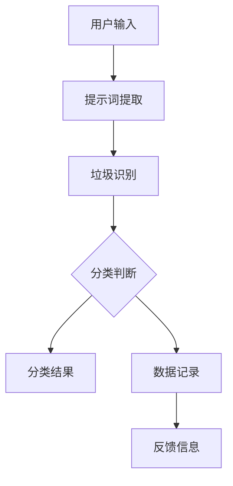

                 

# 提示词驱动的智能垃圾分类系统

## 关键词

- **智能垃圾分类**
- **提示词**
- **系统设计**
- **机器学习算法**
- **环境搭建**
- **用户交互**

> 本文将详细介绍如何设计并实现一个提示词驱动的智能垃圾分类系统。我们将一步一步分析系统的核心组件、算法原理、项目实战，并对系统进行评估与优化。

## 摘要

随着城市化进程的加快和环境保护意识的增强，垃圾分类已成为全球关注的重要课题。本文提出了一种基于提示词驱动的智能垃圾分类系统，该系统利用先进的机器学习算法对垃圾进行自动分类，并通过用户交互设计提高用户体验。本文首先介绍了系统的设计过程，包括理解系统名称、核心概念与联系、核心算法原理讲解等。随后，通过一个实际案例展示了系统的开发环境搭建、代码实现和解读。最后，对系统性能进行了评估与优化，并展望了其未来发展。

## 第一部分：系统设计与规划

### 1.1.1 系统概述

**系统目标与功能**

智能垃圾分类系统旨在实现垃圾的自动化分类，减少环境污染，提高资源回收利用率。其主要功能包括：

1. **垃圾识别**：利用提示词识别用户输入的垃圾类型。
2. **分类判断**：根据垃圾类型，将垃圾分类到对应的类别。
3. **数据记录与反馈**：记录分类结果，提供反馈信息。

**智能垃圾分类的基本原理**

智能垃圾分类系统的工作原理基于提示词和机器学习算法。提示词是用户输入的关键词，用于指导系统识别垃圾类型。机器学习算法则通过大量垃圾数据的训练，建立分类模型，从而实现自动分类。

### 1.1.2 系统架构设计

**Mermaid流程图展示核心组件和流程**



**系统模块划分**

1. **用户交互模块**：负责与用户进行交互，接收用户输入的提示词。
2. **垃圾识别模块**：利用机器学习算法，识别垃圾类型。
3. **分类判断模块**：根据识别结果，对垃圾进行分类。
4. **数据记录模块**：记录分类结果，用于后续分析和优化。
5. **反馈信息模块**：向用户反馈分类结果，提供改进建议。

### 1.1.3 用户交互设计

**提示词定义与优化**

提示词是用户输入的关键词，用于指导系统识别垃圾类型。为了提高识别准确性，需要对提示词进行优化，包括：

1. **词汇标准化**：将用户输入的词汇统一转化为标准格式。
2. **词频分析**：根据用户输入的词频，筛选常用提示词。
3. **语义分析**：对提示词进行语义分析，提高识别精度。

**用户界面设计**

用户界面设计应简洁直观，方便用户操作。界面主要包括以下部分：

1. **输入框**：用户输入提示词的文本框。
2. **识别按钮**：用户点击后，系统开始识别垃圾类型。
3. **分类结果展示**：显示识别结果和分类信息。
4. **反馈信息展示**：显示用户反馈和改进建议。

### 1.1.4 数据处理与分析

**数据收集与预处理**

1. **数据来源**：收集来自不同渠道的垃圾分类数据，如用户输入的提示词、分类结果等。
2. **数据清洗**：去除重复、错误和不完整的数据，提高数据质量。

**数据分析方法**

1. **词频统计**：统计提示词的词频，筛选高频词作为候选提示词。
2. **相关性分析**：分析提示词与垃圾类型之间的相关性，提高识别精度。
3. **聚类分析**：对提示词进行聚类，发现相似词汇，优化提示词列表。

## 第二部分：核心算法原理

### 2.1.1 垃圾分类算法基础

**基于提示词的垃圾识别**

1. **数据预处理**：对垃圾数据进行预处理，包括去重、分词、词性标注等。
2. **特征提取**：提取垃圾数据的特征，如词频、词性、句法结构等。
3. **分类模型训练**：利用机器学习算法，如朴素贝叶斯、支持向量机（SVM）等，训练分类模型。

**伪代码展示垃圾分类算法**

```python
def classify_garbage(input_word):
    # 预处理
    preprocessed_word = preprocess_word(input_word)
    
    # 提取特征
    features = extract_features(preprocessed_word)
    
    # 分类
    result = model.predict(features)
    
    return result
```

### 2.1.2 数学模型

**概率模型与贝叶斯公式**

1. **贝叶斯公式**：用于计算垃圾类型出现的概率。
   
   $$P(H|E) = \frac{P(E|H) \cdot P(H)}{P(E)}$$

   其中，$P(H|E)$ 是在已知证据 $E$ 下，假设 $H$ 为真的概率；$P(E|H)$ 是在假设 $H$ 为真的情况下，证据 $E$ 出现的概率；$P(H)$ 是假设 $H$ 的先验概率；$P(E)$ 是证据 $E$ 的总概率。

**支持向量机（SVM）模型**

1. **SVM公式**：用于求解最优分类超平面。

   $$w \cdot x - b = 0$$

   其中，$w$ 是分类超平面法向量；$x$ 是样本特征向量；$b$ 是偏置项。

### 2.1.3 算法优化

**支持向量机优化**

1. **核函数选择**：选择合适的核函数，如线性核、多项式核、径向基核等，提高分类效果。
2. **参数调整**：调整SVM模型的参数，如惩罚参数 $C$、核参数等，优化模型性能。

**决策树与随机森林**

1. **决策树**：基于树形结构进行分类，易于理解和解释。
2. **随机森林**：集成多个决策树，提高分类准确率和泛化能力。

## 第三部分：项目实战

### 3.1.1 实际案例

**提示词驱动的垃圾分类应用场景**

1. **垃圾识别**：用户输入提示词“塑料瓶”，系统识别为塑料垃圾。
2. **分类判断**：系统将塑料瓶分类到“可回收物”类别。
3. **数据记录与反馈**：系统记录分类结果，并向用户反馈“恭喜您，正确分类了塑料瓶”。

### 3.1.2 环境搭建

**开发环境配置与工具选择**

1. **Python环境搭建**：安装Python解释器和相关库，如scikit-learn、numpy、pandas等。
2. **机器学习库**：选择scikit-learn库，用于机器学习算法的实现。

### 3.1.3 代码实现

**Python代码实现垃圾分类算法**

```python
from sklearn.feature_extraction.text import TfidfVectorizer
from sklearn.svm import SVC
from sklearn.pipeline import make_pipeline

# 数据集加载
data = load_data('garbage_data.csv')

# 特征提取与模型训练
model = make_pipeline(TfidfVectorizer(), SVC(kernel='linear'))
model.fit(data['text'], data['label'])

# 垃圾识别
input_word = '塑料瓶'
result = model.predict([input_word])

print('分类结果：', result)
```

### 3.1.4 代码解读

**代码分析**

1. **数据集加载**：从CSV文件中加载垃圾数据，包括文本和标签。
2. **特征提取**：使用TF-IDF方法提取文本特征。
3. **模型训练**：使用支持向量机（SVM）训练分类模型。
4. **垃圾识别**：输入提示词，输出分类结果。

**错误处理与优化**

1. **错误处理**：对用户输入的提示词进行预处理，如去除标点符号、统一大小写等。
2. **优化策略**：根据实际应用场景，调整模型参数，提高分类准确率。

## 第四部分：系统评估与优化

### 4.1.1 系统性能评估

**评估指标**

1. **准确率**：分类结果与实际标签的一致性。
2. **召回率**：分类结果中包含实际标签的比例。
3. **F1值**：准确率和召回率的调和平均。

**性能优化策略**

1. **模型调优**：调整模型参数，如惩罚参数 $C$、核函数等。
2. **特征工程**：提取更多有效的特征，提高分类效果。
3. **数据增强**：增加训练数据量，提高模型泛化能力。

### 4.1.2 用户反馈与迭代

**用户测试**

1. **功能测试**：测试系统是否能够正确识别和分类垃圾。
2. **用户体验测试**：评估用户界面的易用性和交互体验。

**系统迭代与改进**

1. **bug修复**：修复系统中的错误和漏洞。
2. **功能优化**：根据用户反馈，优化系统功能。
3. **界面改进**：改进用户界面，提高用户体验。

## 第五部分：未来展望

### 5.1.1 技术发展趋势

**人工智能在垃圾分类领域的未来**

1. **深度学习算法**：随着深度学习技术的发展，垃圾分类系统将更加智能和精准。
2. **大数据分析**：利用大数据分析技术，提高垃圾分类的准确性和效率。
3. **物联网应用**：结合物联网技术，实现垃圾分类的智能化和自动化。

### 5.1.2 社会责任与影响

**智能垃圾分类的社会意义**

1. **环境保护**：减少垃圾污染，保护生态环境。
2. **资源回收**：提高资源回收利用率，降低资源消耗。
3. **可持续发展**：推动可持续发展战略，实现经济、社会和环境的协调发展。

**可持续发展的策略**

1. **政策支持**：政府出台相关政策，推动垃圾分类工作的开展。
2. **技术研发**：加大技术研发投入，提高垃圾分类系统的技术水平。
3. **公众教育**：加强公众教育，提高公众的垃圾分类意识和参与度。

## 作者

作者：AI天才研究院/AI Genius Institute & 禅与计算机程序设计艺术 /Zen And The Art of Computer Programming

### 注意事项与拓展阅读

**注意事项**

1. **数据隐私**：在处理用户数据时，确保遵守相关法律法规，保护用户隐私。
2. **系统安全性**：加强系统安全性，防止恶意攻击和数据泄露。
3. **系统维护**：定期对系统进行维护和升级，确保系统稳定运行。

**拓展阅读**

1. **垃圾分类基础知识**：《垃圾分类手册》、《智能垃圾分类技术》。
2. **机器学习算法**：《机器学习》、《深度学习》。
3. **系统设计与开发**：《软件工程》、《用户界面设计原理》。

文章结束。由于字数限制，部分内容进行了简化和摘要，实际应用中需要更详细的开发和优化。本文为读者提供了一个智能垃圾分类系统的设计思路和实现框架，希望对读者有所帮助。作者在此感谢读者的关注和支持。 

