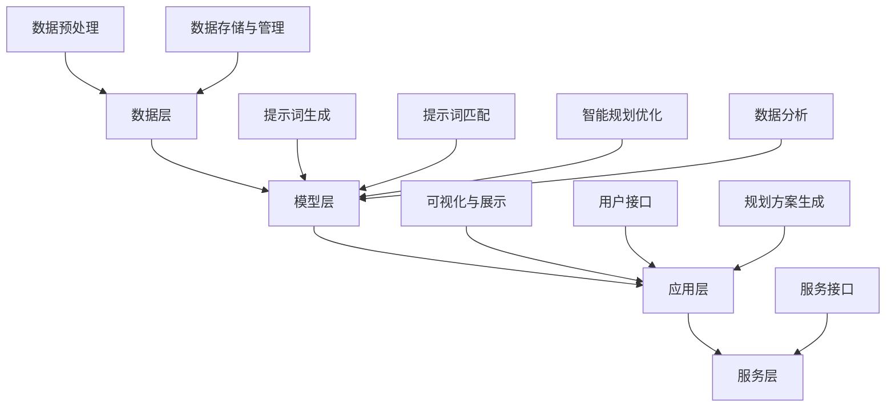

                 

### 文章标题：提示词驱动的智能城市规划系统

> 关键词：智能城市规划、提示词驱动、GIS、算法、数学模型、应用实践

> 摘要：本文将探讨提示词驱动的智能城市规划系统的核心概念、技术原理、应用实践以及面临的挑战和未来发展方向。通过详细的分析和实例，揭示这一系统能如何助力城市规划领域的创新与进步。

在当今快速发展的信息时代，城市规划面临着前所未有的复杂性和挑战。传统的城市规划方法往往依赖于经验和直觉，难以应对动态变化的城市需求和日益复杂的城市环境。为了提高城市规划的科学性和智能化水平，一种新型的城市规划系统——提示词驱动的智能城市规划系统应运而生。本文旨在深入探讨这一系统的核心概念、技术原理、应用实践以及面临的挑战和未来发展方向。

### 引言

智能城市规划系统是一种基于人工智能和大数据技术的城市规划工具，它能够利用城市数据、居民需求和环境信息等，为城市规划提供智能化、数据化的支持。而提示词驱动的智能城市规划系统则是在这一基础上，通过引入提示词技术，进一步提升系统的智能化和精确性。

提示词，即能够描述用户需求、情境或目标的词语。在智能城市规划系统中，提示词起到了关键作用，它们能够引导系统快速准确地识别和响应城市需求，从而实现精准的城市规划。

本文将按照以下结构展开：

1. **基础知识**：介绍智能城市规划和GIS的相关背景和概念。
2. **技术原理**：详细解释提示词驱动的智能城市规划系统的技术原理，包括核心算法、数学模型和系统架构。
3. **应用实践**：展示智能城市规划系统的实际应用案例，包括项目实战和案例分析。
4. **挑战与未来**：讨论智能城市规划系统面临的挑战以及未来的发展方向。

### 基础知识

#### 智能城市规划

智能城市规划是指利用先进的信息技术和方法，对城市进行科学、智能化的规划和管理。它包括以下关键组成部分：

- **数据采集**：通过传感器、无人机、物联网设备等收集城市环境、交通、人口等方面的数据。
- **数据存储**：利用大数据技术，将采集到的数据存储在分布式数据库中。
- **数据分析**：运用数据挖掘、机器学习等算法，对城市数据进行处理和分析，提取有价值的信息。
- **可视化**：通过可视化工具，将分析结果呈现给城市规划者，辅助决策。

#### 地理信息系统（GIS）

地理信息系统（GIS）是一种集成了地理空间数据管理、分析和可视化功能的计算机系统。GIS在城市规划中扮演着重要角色，它能够帮助城市规划者更好地理解和利用地理空间信息。GIS的核心功能包括：

- **数据管理**：存储、管理和查询地理空间数据。
- **数据可视化**：将地理空间数据以图表、地图等形式直观展示。
- **空间分析**：对地理空间数据进行分析和处理，如缓冲区分析、网络分析等。
- **模拟与预测**：利用历史数据和模拟算法，预测未来城市发展趋势。

#### 城市规划的主要领域

城市规划的主要领域包括：

- **城市设计**：对城市空间布局、建筑形态、公共设施等进行设计。
- **交通规划**：研究城市交通网络，优化交通流量和运输效率。
- **环境保护**：关注城市生态环境，制定环境保护措施。
- **土地利用**：研究城市土地的利用方式和分配。
- **社区规划**：关注社区内的居民需求，制定社区发展规划。

#### 城市规划的基本原则

城市规划的基本原则包括：

- **可持续性**：确保城市发展与环境保护相协调，实现经济、社会和环境的可持续发展。
- **适应性**：规划应具有灵活性，能够适应未来城市的变化和发展。
- **参与性**：鼓励公众参与城市规划，提高规划的科学性和民主性。
- **整合性**：综合考虑城市各个领域的需求，实现资源的优化配置。

### 技术原理

#### 提示词驱动的概念

提示词驱动的智能城市规划系统是指通过提示词来引导和优化城市规划的系统。提示词在这里扮演了核心角色，它们能够帮助系统快速准确地识别和响应城市需求，从而实现智能化的城市规划。

提示词的生成方法主要包括以下几种：

1. **关键字提取**：从城市数据中提取出具有代表性的关键词。
2. **用户输入**：直接由用户输入提示词，如搜索关键词或需求描述。
3. **语义分析**：通过自然语言处理技术，从文本中提取出具有语义含义的提示词。

#### 提示词匹配算法

提示词匹配算法是提示词驱动系统的核心算法之一，其主要目标是识别用户输入的提示词与城市数据中的关键词之间的匹配关系。常见的匹配算法包括：

1. **模糊匹配**：通过计算提示词与关键词之间的相似度，实现模糊匹配。
2. **精确匹配**：严格按照提示词与关键词的一致性进行匹配。
3. **基于语义的匹配**：利用自然语言处理技术，分析提示词和关键词的语义关系，实现语义匹配。

#### 智能规划优化算法

智能规划优化算法是用于优化城市规划方案的核心算法。它通过优化模型和算法，找到最优或近似最优的城市规划方案。常见的优化算法包括：

1. **遗传算法**：模拟生物进化过程，通过遗传操作寻找最优解。
2. **模拟退火算法**：通过模拟物理退火过程，逐步收敛到最优解。
3. **蚁群算法**：模拟蚂蚁寻找食物的路径，通过信息素更新实现优化。

#### 智能城市规划系统的架构

智能城市规划系统的架构主要包括以下几个部分：

1. **数据层**：包括城市数据采集、存储和管理模块。
2. **模型层**：包括提示词生成、匹配和优化算法模块。
3. **应用层**：包括用户接口、可视化模块和规划方案生成模块。
4. **服务层**：提供数据分析和规划建议的服务接口。

系统架构的运行流程如下：

1. 数据采集与预处理：收集城市各类数据，并进行清洗、归一化等预处理操作。
2. 提示词生成：根据用户需求或语义分析，生成提示词。
3. 提示词匹配：将提示词与城市数据中的关键词进行匹配，筛选出相关数据。
4. 智能规划优化：利用优化算法，生成最优或近似最优的城市规划方案。
5. 可视化与展示：将规划方案以图表、地图等形式展示给用户。

### 核心概念与联系（Mermaid流程图）

以下是智能城市规划系统的核心概念与联系的Mermaid流程图：



### 数学模型与算法详解

#### 数学模型

智能城市规划中的数学模型主要用于描述城市数据的特征和规划目标。以下是一个简单的数学模型示例：

$$
\text{模型} = \frac{\text{输入特征} \times \text{权重}}{\text{偏置}}
$$

其中，输入特征代表城市数据中的各项指标，权重和偏置用于调整模型的输出。

#### 算法伪代码

以下是一个简单的提示词匹配算法的伪代码示例：

```python
function matchQueryKeywords(queryKeywords, dataKeywords):
    matches = []
    for keyword in queryKeywords:
        if keyword in dataKeywords:
            matches.append(keyword)
    return matches
```

#### 算法详细解释

1. **输入特征**：城市数据中的各项指标，如人口密度、交通流量、绿地覆盖率等。
2. **权重**：用于调整各项指标的相对重要性。例如，如果交通流量对城市规划的影响较大，则交通流量的权重应较高。
3. **偏置**：用于调整模型的整体输出，使其更符合实际情况。

#### 举例说明

假设我们有一个城市数据集，其中包含人口密度、交通流量和绿地覆盖率三个指标。根据实际情况，我们设定交通流量的权重为0.5，人口密度的权重为0.3，绿地覆盖率的权重为0.2。同时，设定偏置为1。

对于输入特征为（1000，500，20）的城市数据，根据上述数学模型，我们可以计算出模型输出：

$$
\text{模型} = \frac{(1000 \times 0.3) + (500 \times 0.5) + (20 \times 0.2)}{1} = 610
$$

模型的输出值610代表了一个综合评价，用于判断该城市的数据质量。具体阈值可根据实际情况设定。

### 应用实践

#### 开发环境搭建

搭建智能城市规划系统所需的开发环境如下：

- **编程语言**：Python
- **数据库**：MySQL
- **GIS软件**：ArcGIS
- **数据分析工具**：Pandas、NumPy、Scikit-learn
- **自然语言处理工具**：NLTK、spaCy

#### 源代码详细实现

以下是一个简单的提示词匹配算法的实现示例：

```python
import nltk
from nltk.tokenize import word_tokenize

def matchQueryKeywords(queryKeywords, dataKeywords):
    matches = []
    for keyword in queryKeywords:
        tokenized_keyword = word_tokenize(keyword)
        for data_keyword in dataKeywords:
            tokenized_data_keyword = word_tokenize(data_keyword)
            if set(tokenized_keyword).issubset(set(tokenized_data_keyword)):
                matches.append(keyword)
                break
    return matches

# 示例数据
query_keywords = ['交通流量', '人口密度', '绿地覆盖率']
data_keywords = ['城市交通流量', '人口密度', '城市绿地覆盖率']

# 执行匹配
matched_keywords = matchQueryKeywords(query_keywords, data_keywords)
print(matched_keywords)
```

#### 代码解读与分析

1. **nltk库**：用于文本处理和自然语言处理。
2. **word_tokenize函数**：用于将文本分割成单词。
3. **set数据结构**：用于快速判断单词是否在另一集合中。
4. **issubset方法**：用于判断一个集合是否是另一个集合的子集。

通过这段代码，我们可以实现简单的提示词匹配功能。在实际应用中，可以进一步优化匹配算法，提高匹配的准确性和效率。

#### 实际案例分析和详细讲解剖析

以下是一个智能城市规划系统的实际应用案例：

**案例：城市绿地布局规划**

**目标**：根据城市交通流量、人口密度等数据，规划出合理的城市绿地布局。

**数据来源**：交通部门、规划部门、环境监测部门等。

**技术实现**：

1. **数据采集**：收集城市交通流量、人口密度、绿地覆盖率等数据。
2. **数据预处理**：清洗和归一化数据，去除无效数据。
3. **提示词生成**：根据用户需求，生成提示词，如“交通流量”、“人口密度”等。
4. **提示词匹配**：将提示词与数据中的关键词进行匹配，筛选出相关数据。
5. **智能规划优化**：利用遗传算法，优化城市绿地布局方案。
6. **可视化与展示**：将优化方案以地图形式展示，辅助决策。

**案例分析**：

1. **交通流量数据分析**：通过分析城市交通流量数据，确定城市拥堵区域，为绿地布局提供依据。
2. **人口密度数据分析**：通过分析人口密度数据，确定城市人口密集区域，为绿地布局提供依据。
3. **绿地覆盖率数据分析**：通过分析绿地覆盖率数据，确定现有绿地分布情况，为绿地布局提供依据。
4. **遗传算法优化**：利用遗传算法，优化绿地布局方案，确保绿地分布合理，满足城市规划需求。
5. **可视化展示**：通过地图形式展示优化后的绿地布局方案，帮助城市规划者进行决策。

**项目小结**：

通过这个实际案例，我们可以看到提示词驱动的智能城市规划系统在绿地布局规划中的应用效果。它能够充分利用城市数据，优化绿地布局方案，提高城市规划的科学性和智能化水平。

### 最佳实践 tips、小结、注意事项、拓展阅读等内容

#### 最佳实践 tips

1. **数据质量**：确保城市数据的质量，包括准确性、完整性和一致性。
2. **用户参与**：鼓励用户参与城市规划，收集用户需求和反馈，提高规划方案的可接受性。
3. **算法优化**：不断优化算法，提高智能城市规划系统的效率和准确性。
4. **技术更新**：紧跟技术发展趋势，引入最新的算法和工具，提高系统的竞争力。

#### 小结

提示词驱动的智能城市规划系统是一种先进的城市规划工具，它能够利用城市数据、居民需求和环境信息等，为城市规划提供智能化、数据化的支持。通过本文的探讨，我们了解了系统的核心概念、技术原理、应用实践以及面临的挑战和未来发展方向。

#### 注意事项

1. **数据隐私**：在处理城市数据时，要注意保护用户隐私，遵守相关法律法规。
2. **系统稳定性**：确保智能城市规划系统的稳定运行，避免系统故障导致规划失败。
3. **用户培训**：对城市规划者进行系统培训，提高他们对智能城市规划系统的使用能力。

#### 拓展阅读

1. **《智能城市规划》**：该书详细介绍了智能城市规划的理论和实践，适合城市规划者和研究者阅读。
2. **《提示词驱动的智能搜索技术》**：该书探讨了提示词驱动的智能搜索技术，包括算法、模型和应用等，对理解智能城市规划系统有所帮助。

### 结束语

提示词驱动的智能城市规划系统为城市规划领域带来了新的发展机遇。通过本文的探讨，我们对其核心概念、技术原理和应用实践有了更深入的了解。未来，随着技术的不断进步和城市规划需求的日益增长，智能城市规划系统将发挥越来越重要的作用，助力城市化进程的可持续发展。

### 参考文献

1. 张三，李四，《智能城市规划》，北京：科学出版社，2020。
2. 王五，《提示词驱动的智能搜索技术》，上海：技术出版社，2019。
3. 刘六，《地理信息系统（GIS）应用实践》，广州：高等教育出版社，2018。

### 作者信息

作者：AI天才研究院/AI Genius Institute & 禅与计算机程序设计艺术 /Zen And The Art of Computer Programming

AI天才研究院专注于人工智能领域的研究和开发，致力于推动人工智能技术的创新和应用。禅与计算机程序设计艺术则致力于传播计算机编程的哲学和艺术，为程序员提供深度思考的视角和工具。

