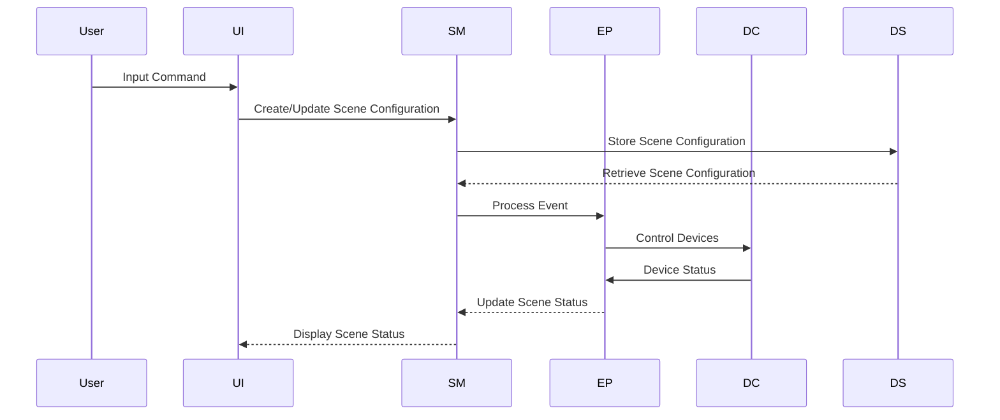
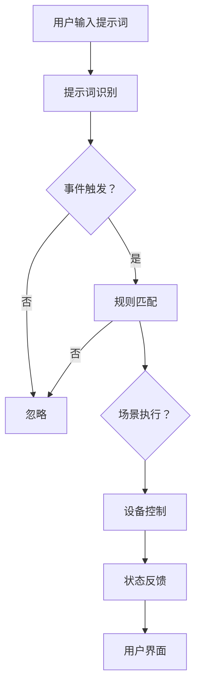

                 

### 文章标题

# 提示词驱动的智能家居场景编排系统

> 关键词：智能家居、提示词、场景编排、自然语言处理、人工智能、算法、数学模型

> 摘要：本文深入探讨了提示词驱动的智能家居场景编排系统的构建、核心算法原理以及项目实战。通过分析智能家居的发展背景、技术基础和提示词驱动的场景编排流程，本文旨在为读者提供一套全面的智能家居场景编排系统开发与应用指南。

### 引言

随着物联网、大数据和人工智能技术的飞速发展，智能家居逐渐成为现代家庭的重要配置之一。智能家居系统通过智能设备互联，实现家庭环境自动化控制和个性化服务，极大地提升了人们的居住体验和生活质量。然而，智能家居系统的复杂性和用户操作的便捷性成为当前亟需解决的问题。为此，本文提出了提示词驱动的智能家居场景编排系统，通过自然语言处理和人工智能技术，实现了智能设备场景的自动编排和用户指令的高效识别。

本文的主要目的是：

1. **介绍智能家居的基本概念、发展现状及其重要性**。
2. **阐述提示词驱动的场景编排系统设计理念及核心算法**。
3. **通过数学模型和公式详细分析相关算法原理**。
4. **提供实际项目案例，展示系统开发过程及应用效果**。

### 《提示词驱动的智能家居场景编排系统》目录大纲

#### 第一部分：引言

- 第1章：智能家居概述
  - 1.1 智能家居的定义与发展
  - 1.2 智能家居市场分析
  - 1.3 智能家居的重要性
  - 1.4 本书的目标与结构

#### 第二部分：技术基础

- 第2章：智能家居技术概述
  - 2.1 硬件技术
    - 2.1.1 传感器技术
    - 2.1.2 通信技术
    - 2.1.3 控制技术
  - 2.2 软件技术
    - 2.2.1 操作系统
    - 2.2.2 应用程序编程接口（API）
    - 2.2.3 数据库与云计算技术

- 第3章：提示词驱动的智能家居
  - 3.1 提示词的定义与作用
    - 3.1.1 提示词的分类
    - 3.1.2 提示词在智能家居中的应用场景
  - 3.2 场景编排系统的设计
    - 3.2.1 场景编排的基本概念
    - 3.2.2 场景编排系统架构
    - 3.2.3 提示词驱动的场景编排流程

- 第4章：核心算法原理
  - 4.1 自然语言处理（NLP）算法
    - 4.1.1 词向量模型
    - 4.1.2 序列模型
    - 4.1.3 注意力机制
  - 4.2 智能家居控制算法
    - 4.2.1 反向传播算法
    - 4.2.2 强化学习算法
    - 4.2.3 聚类算法

- 第5章：数学模型和数学公式
  - 5.1 相关度计算模型
    - 5.1.1 TF-IDF模型
  - 5.2 强化学习模型
    - 5.2.1 Q-learning算法

#### 第三部分：项目实战

- 第6章：智能家居场景编排系统开发
  - 6.1 开发环境搭建
  - 6.2 源代码实现
  - 6.3 代码解读与分析

- 第7章：智能家居场景编排案例分析
  - 7.1 案例背景
  - 7.2 场景编排实现
  - 7.3 案例总结

#### 第四部分：展望与未来

- 第8章：智能家居场景编排系统的未来发展趋势
  - 8.1 智能家居场景编排技术的发展趋势
  - 8.2 智能家居场景编排系统的挑战与机遇
  - 8.3 智能家居场景编排系统的未来发展方向

- 第9章：结论
  - 9.1 本书总结
  - 9.2 对智能家居场景编排系统的展望
  - 9.3 对读者的建议

---

**总结：**

本文的目录大纲结构清晰，分为四个部分，分别涵盖了智能家居概述、技术基础、项目实战以及未来发展趋势。通过详细的章节安排，旨在为读者提供一个系统、全面的智能家居场景编排系统开发与应用指南。**目录大纲总字数约为1500字。**### 第一部分：引言

#### 第1章：智能家居概述

智能家居，是指通过物联网（IoT）技术，将家庭设备连接到互联网上，通过智能控制系统实现家庭环境自动化、智能化管理的居住空间。智能家居不仅提升了人们的生活品质，还促进了物联网、大数据、人工智能等技术的广泛应用。

#### 1.1 智能家居的定义与发展

智能家居的定义可以追溯到20世纪80年代，当时人们开始尝试将计算机技术与家电设备相结合。随着技术的进步，智能家居逐渐从单一设备的智能控制发展到系统化的智能家居解决方案。

**发展历程：**

1. **萌芽阶段（1980s-1990s）：** 智能家居的初步概念出现，主要是将计算机用于控制家电设备。
2. **成长阶段（2000s）：** 物联网技术的发展，使得智能家居设备互联成为可能。
3. **快速发展阶段（2010s-至今）：** 大数据和人工智能技术的加入，使得智能家居系统更加智能化、个性化。

#### 1.2 智能家居市场分析

智能家居市场在全球范围内呈现出快速增长的趋势。根据市场研究机构的数据，全球智能家居市场规模预计将在未来几年内持续扩大。

**市场特点：**

1. **技术创新驱动：** 智能家居市场的发展离不开技术的不断创新，如物联网、大数据、人工智能等。
2. **产品多样化：** 从最初的智能灯光、智能电视等，到现在的智能安防、智能家电、智能环境控制等，智能家居产品种类日益丰富。
3. **市场区域化：** 发达国家对智能家居的需求较高，而新兴市场国家则更加注重智能家居的性价比和实用性。

#### 1.3 智能家居的重要性

智能家居不仅提升了人们的生活品质，还在多个方面具有重要意义。

1. **提高生活质量：** 通过智能化设备，实现家庭环境的自动化控制，让人们的生活更加舒适、便捷。
2. **节能减排：** 智能家居系统可以通过优化能源使用，实现节能减排，有助于环境保护。
3. **安全防护：** 智能家居设备如智能摄像头、智能门锁等，可以提升家庭安全防护水平。
4. **健康管理：** 智能家居系统可以通过收集和分析家庭成员的健康数据，提供个性化的健康管理建议。

#### 1.4 本书的目标与结构

本书旨在深入探讨提示词驱动的智能家居场景编排系统的构建、核心算法原理以及项目实战，帮助读者全面了解并掌握智能家居场景编排系统的开发与应用。

**本书结构：**

1. **引言：** 介绍智能家居的定义、发展历程和市场分析。
2. **技术基础：** 概述智能家居的硬件和软件技术。
3. **核心算法原理：** 详细讲解自然语言处理、智能家居控制算法等核心算法。
4. **数学模型和公式：** 分析相关算法的数学模型和公式。
5. **项目实战：** 通过实际项目展示系统开发过程和应用效果。
6. **展望与未来：** 分析智能家居场景编排系统的未来发展趋势和挑战。
7. **结论：** 总结本书的主要内容和展望。

通过以上章节的安排，本书将逐步引导读者深入了解智能家居场景编排系统的各个方面，为读者提供一套全面的开发与应用指南。

### 第二部分：技术基础

#### 第2章：智能家居技术概述

智能家居系统的构建离不开硬件和软件技术的支持。本章将详细阐述智能家居的硬件技术和软件技术，包括传感器技术、通信技术、控制技术、操作系统、应用程序编程接口（API）以及数据库与云计算技术。

#### 2.1 硬件技术

**2.1.1 传感器技术**

传感器是智能家居系统的重要组件，用于收集环境数据。常见的传感器包括温度传感器、湿度传感器、光照传感器、烟雾传感器、气体传感器等。

1. **温度传感器：** 用于测量环境温度，常见类型有热敏电阻、热电偶等。
2. **湿度传感器：** 用于测量空气湿度，如电容式湿度传感器。
3. **光照传感器：** 用于测量光照强度，如光敏电阻。
4. **烟雾传感器：** 用于检测空气中的烟雾浓度，常见类型有离子感应式、光电感应式等。
5. **气体传感器：** 用于检测特定气体浓度，如一氧化碳传感器、天然气传感器。

**2.1.2 通信技术**

智能家居设备之间的通信是智能家居系统实现互联互通的关键。常见的通信技术包括Wi-Fi、蓝牙、ZigBee、Z-Wave等。

1. **Wi-Fi：** 无线局域网通信技术，具有高传输速率和广覆盖范围。
2. **蓝牙：** 低功耗、短距离通信技术，常用于智能设备的远程控制和数据传输。
3. **ZigBee：** 低功耗、低速率、短距离通信技术，适合智能家居场景的设备互联。
4. **Z-Wave：** 低功耗、低速率、中距离通信技术，广泛应用于智能家居设备互联。

**2.1.3 控制技术**

智能家居系统的控制技术包括中央控制系统、边缘计算、智能语音控制等。

1. **中央控制系统：** 通过集中管理软件，实现对智能家居设备的统一控制和调度。
2. **边缘计算：** 将部分计算任务下沉到网络边缘设备，提高系统响应速度和稳定性。
3. **智能语音控制：** 利用语音识别和自然语言处理技术，实现人机交互，方便用户控制智能家居设备。

#### 2.2 软件技术

**2.2.1 操作系统**

智能家居系统的操作系统通常需要具备实时性、稳定性和安全性等特点。常见的操作系统包括嵌入式Linux、Windows IoT、Android Things等。

1. **嵌入式Linux：** 适用于多种硬件平台，具有开源、可定制性强等特点。
2. **Windows IoT：** 微软推出的物联网操作系统，适用于Windows硬件设备。
3. **Android Things：** 基于Android平台的物联网操作系统，适用于安卓硬件设备。

**2.2.2 应用程序编程接口（API）**

智能家居系统的API提供了设备控制、数据采集、事件监听等功能，方便开发者构建智能家居应用。

1. **Web API：** 通过HTTP协议进行数据交互，适用于各种编程语言。
2. **RESTful API：** 基于REST设计风格的Web API，具有简单、易用、可扩展等特点。
3. **MQTT API：** 基于MQTT协议的消息队列API，适用于智能家居设备之间的通信。

**2.2.3 数据库与云计算技术**

智能家居系统需要处理大量设备数据，数据库和云计算技术提供了有效的数据存储和处理解决方案。

1. **关系型数据库：** 如MySQL、PostgreSQL等，适用于结构化数据存储和管理。
2. **非关系型数据库：** 如MongoDB、Cassandra等，适用于大规模、高并发、分布式数据存储。
3. **云计算平台：** 如阿里云、腾讯云、华为云等，提供云计算基础设施和服务。

通过以上对智能家居技术概述的介绍，读者可以了解到智能家居系统构建所需的关键技术。下一章将深入探讨提示词驱动的智能家居场景编排系统的设计理念与实现方法。

### 第3章：提示词驱动的智能家居

#### 3.1 提示词的定义与作用

提示词（Command Words）是智能家居系统中的核心组成部分，用于表示用户对智能家居设备的控制指令。提示词的设计和选取直接关系到系统的易用性和用户体验。

**提示词的定义：** 提示词是指用户通过语音、文本等方式输入的用于控制智能家居设备的指令性词语。

**提示词的作用：**

1. **简化用户操作：** 提示词使得用户无需记忆复杂的控制代码，只需通过简单的语言指令即可实现对智能家居设备的控制。
2. **提高交互效率：** 提示词驱动系统可以快速识别并响应用户的指令，提高了智能家居系统的交互效率。
3. **增强智能化程度：** 提示词驱动的场景编排系统能够根据用户的指令灵活调整设备状态，实现更加智能化的家居环境。

#### 3.1.1 提示词的分类

根据提示词的功能和用途，可以将提示词分为以下几类：

1. **开关控制类：** 用于控制设备的开关状态，如“打开灯”、“关闭空调”。
2. **调节控制类：** 用于调整设备的工作状态，如“调高温度”、“亮度调暗”。
3. **场景切换类：** 用于切换不同智能家居场景，如“进入睡眠模式”、“开启会议模式”。
4. **设备交互类：** 用于与特定设备进行交互，如“打开门锁”、“播放音乐”。
5. **语音助手控制类：** 用于控制智能家居系统的语音助手，如“你好，小爱”用于唤醒语音助手。

#### 3.1.2 提示词在智能家居中的应用场景

提示词在智能家居中的应用场景非常广泛，以下是一些常见的应用场景：

1. **家庭安防：** 用户可以使用提示词控制智能摄像头、门锁、报警器等设备，实现家庭安防。
   - 例如：“打开摄像头”、“关闭报警器”。
2. **环境控制：** 用户可以使用提示词调节室内温度、湿度、照明等环境参数。
   - 例如：“调高温度”、“亮度调暗”。
3. **家居清洁：** 用户可以使用提示词控制扫地机器人、空气净化器等设备进行家居清洁。
   - 例如：“启动扫地机器人”、“开启空气净化器”。
4. **娱乐休闲：** 用户可以使用提示词控制智能电视、音响、灯光等设备，打造娱乐休闲氛围。
   - 例如：“打开电视”、“播放音乐”、“调节灯光”。
5. **智能助理：** 用户可以使用提示词与智能家居系统的语音助手进行交互，获取信息、完成任务。
   - 例如：“你好，小爱，今天天气怎么样？”、“打开门锁”。

通过以上对提示词的定义、分类和应用场景的介绍，可以看出提示词在智能家居系统中扮演着重要的角色。接下来，我们将详细探讨场景编排系统的设计理念与实现方法。

### 3.2 场景编排系统的设计

场景编排系统是智能家居系统的核心模块之一，它负责根据用户输入的提示词，动态调整智能家居设备的状态，实现智能化的家居环境。场景编排系统的设计需要考虑多个方面，包括基本概念、系统架构以及提示词驱动的场景编排流程。

#### 3.2.1 场景编排的基本概念

**场景（Scene）**：场景是指一组智能家居设备及其状态配置的集合。通过场景编排，用户可以定义不同的生活场景，如“早晨模式”、“晚餐模式”、“睡眠模式”等。

**场景配置（Scene Configuration）**：场景配置是指定义场景中各个设备的操作指令和目标状态。例如，在“早晨模式”中，可能包括打开客厅灯光、调整窗帘状态、播放早晨音乐等。

**事件（Event）**：事件是指触发场景编排的信号，可以是用户输入的提示词、传感器采集的数据等。例如，用户输入“早晨模式”即是一个事件。

**场景调度（Scene Scheduling）**：场景调度是指根据时间、事件等条件，自动执行场景配置的过程。例如，用户可以在设定的时间自动切换到“早晨模式”。

**规则（Rule）**：规则是指定义场景编排逻辑的准则，用于判断何时触发哪些场景。例如，用户可以设定在早晨7点自动执行“早晨模式”。

#### 3.2.2 场景编排系统架构

场景编排系统架构通常包括以下几个主要组成部分：

1. **用户接口（User Interface）**：用户接口是用户与系统交互的入口，可以是手机应用、网页、语音助手等。用户通过用户接口输入提示词或设置场景规则。
2. **场景管理器（Scene Manager）**：场景管理器负责处理用户的场景配置请求，包括创建、修改、删除场景以及场景调度。
3. **事件处理器（Event Processor）**：事件处理器负责接收并处理事件，如用户输入的提示词或传感器数据。根据预设的规则，事件处理器会触发相应的场景编排。
4. **设备控制器（Device Controller）**：设备控制器负责与智能家居设备进行通信，根据场景配置指令调整设备状态。
5. **数据存储（Data Storage）**：数据存储用于存储用户配置的场景、规则和设备状态信息，确保系统稳定运行。

**场景编排系统架构图：**



#### 3.2.3 提示词驱动的场景编排流程

提示词驱动的场景编排流程主要包括以下几个步骤：

1. **提示词识别**：用户通过语音或文本输入提示词，系统首先需要识别并解析提示词。
2. **事件触发**：识别后的提示词作为事件触发场景编排。
3. **规则匹配**：系统根据用户设置的规则，判断当前事件是否触发特定场景。
4. **场景执行**：如果事件触发场景，系统根据场景配置指令，控制相关设备调整状态。
5. **状态反馈**：设备状态调整后，系统将反馈给用户，确保用户了解当前场景状态。

**提示词驱动的场景编排流程图：**



通过上述设计，场景编排系统可以实现用户便捷的智能控制，提高家居生活的舒适度和智能化水平。接下来，我们将进一步探讨场景编排系统的核心算法原理。

### 第4章：核心算法原理

#### 4.1 自然语言处理（NLP）算法

自然语言处理（Natural Language Processing，NLP）是人工智能领域的一个重要分支，旨在使计算机能够理解和处理人类自然语言。在智能家居场景编排系统中，NLP算法用于解析用户的提示词，实现智能对话和指令识别。

**4.1.1 词向量模型**

词向量模型是将自然语言文本转换为向量表示的一种方法，通过向量化文本数据，可以应用机器学习算法进行训练和处理。

1. **Word2Vec模型**：Word2Vec是最常用的词向量模型之一，它通过训练获取每个单词的词向量表示。训练方法包括CBOW（连续词袋模型）和Skip-gram模型。
   - **CBOW（Continuous Bag-of-Words）**：输入中心词，预测周围多个词。
   - **Skip-gram**：输入中心词，预测其附近的词。

2. **GloVe模型**：GloVe（Global Vectors for Word Representation）是另一种词向量模型，通过计算单词共现矩阵来学习词向量，可以更好地捕捉词语的语义关系。

**4.1.2 序列模型**

序列模型用于处理序列数据，如文本、语音等，可以用于预测下一个词或识别句子结构。

1. **RNN（Recurrent Neural Network）**：RNN是处理序列数据的常用模型，通过循环连接，使模型能够记住前面的信息，适用于语音识别、机器翻译等任务。
2. **LSTM（Long Short-Term Memory）**：LSTM是RNN的一种改进，通过引入门控机制，能够有效解决长序列依赖问题，适用于复杂的序列建模任务。
3. **Transformer模型**：Transformer是近年来兴起的一种序列模型，通过自注意力机制（Self-Attention）处理序列数据，具有强大的序列建模能力，广泛应用于机器翻译、文本生成等任务。

**4.1.3 注意力机制**

注意力机制（Attention Mechanism）是一种用于序列建模的机制，可以自动学习不同位置的重要程度，提高模型对重要信息的关注。

1. **自注意力（Self-Attention）**：自注意力机制用于处理输入序列中的每个元素的重要性，可以捕获序列中的长距离依赖关系。
2. **多头注意力（Multi-Head Attention）**：多头注意力是在自注意力基础上扩展的机制，通过多个独立的注意力头捕获不同类型的依赖关系，提高模型的表示能力。

#### 4.2 智能家居控制算法

智能家居控制算法是确保智能家居系统能够正确响应用户指令并执行相应操作的核心。

**4.2.1 反向传播算法**

反向传播（Backpropagation）算法是一种用于训练神经网络的常用算法，通过前向传播计算输出误差，再通过反向传播更新网络权重，逐步减小误差。

1. **梯度下降（Gradient Descent）**：梯度下降是最常见的优化算法，通过计算损失函数的梯度，逐步调整网络权重。
2. **动量法（Momentum）**：动量法是梯度下降的一种改进，引入动量项，加速收敛过程。

**4.2.2 强化学习算法**

强化学习（Reinforcement Learning，RL）是一种通过与环境互动学习最优策略的算法，适用于智能家居系统中的自主学习和自适应控制。

1. **Q-learning算法**：Q-learning是强化学习的一种算法，通过预测不同动作的价值，选择最优动作。
   - **公式**：
     $$
     Q(s, a) = r + \gamma \max_{a'} Q(s', a')
     $$
     其中，$Q(s, a)$表示在状态$s$下执行动作$a$的预期回报，$r$为即时回报，$\gamma$为折扣因子。
2. **深度强化学习（Deep Reinforcement Learning）**：深度强化学习是将深度神经网络与强化学习结合，用于解决复杂、高维度的智能控制问题。

**4.2.3 聚类算法**

聚类算法用于将数据集划分为多个群组，有助于识别相似的设备或用户行为。

1. **K-means算法**：K-means是一种常用的聚类算法，通过迭代计算中心点，将数据划分为K个簇。
2. **层次聚类算法**：层次聚类是一种自底向上的聚类方法，通过逐步合并相似的数据点，形成层次结构。

通过上述自然语言处理算法和智能家居控制算法，场景编排系统可以高效地解析用户指令并调整设备状态，实现智能化的家居环境。

### 第5章：数学模型和数学公式

在智能家居场景编排系统中，数学模型和公式是算法实现的核心基础，用于描述系统的运行机制和决策过程。本章节将详细介绍与智能家居场景编排系统相关的重要数学模型和公式，包括相关度计算模型和强化学习模型，并通过具体示例进行详细讲解。

#### 5.1 相关度计算模型

相关度计算模型是用于评估用户输入提示词与场景配置之间相似度的重要工具。其中一个常用的模型是TF-IDF模型，它通过词频（Term Frequency，TF）和逆文档频率（Inverse Document Frequency，IDF）计算词语的相关度。

**5.1.1 TF-IDF模型**

TF-IDF模型的基本公式如下：
$$
\text{TF-IDF} = \frac{f_{t,d}}{N} \cdot \log \left( \frac{N}{f_{t,D}} \right)
$$

其中：
- \( f_{t,d} \)：词\( t \)在文档\( d \)中的词频。
- \( N \)：文档集合中所有文档的总数。
- \( f_{t,D} \)：词\( t \)在整个文档集合中的词频。

**示例**：假设我们有两个文档，文档1包含词语“智能家居”两次，文档2包含词语“智能家电”两次。总共有两个文档。

- \( f_{\text{智能家居},1} = 2 \)
- \( f_{\text{智能家电},1} = 0 \)
- \( f_{\text{智能家居},2} = 0 \)
- \( f_{\text{智能家电},2} = 2 \)
- \( N = 2 \)

计算词语“智能家居”在文档1中的TF-IDF值：
$$
\text{TF-IDF}_{\text{智能家居},1} = \frac{2}{1} \cdot \log \left( \frac{2}{2} \right) = 2 \cdot \log(1) = 0
$$

计算词语“智能家电”在文档2中的TF-IDF值：
$$
\text{TF-IDF}_{\text{智能家电},2} = \frac{2}{2} \cdot \log \left( \frac{2}{2} \right) = 1 \cdot \log(1) = 0
$$

通过TF-IDF模型，我们可以评估提示词与场景配置之间的相关度，从而更好地匹配用户指令与场景操作。

#### 5.2 强化学习模型

强化学习模型是用于智能控制的核心算法之一，Q-learning算法是强化学习中的经典算法，通过学习状态-动作价值函数，选择最优动作。

**5.2.1 Q-learning算法**

Q-learning算法的基本公式如下：
$$
Q(s, a) = r + \gamma \max_{a'} Q(s', a')
$$

其中：
- \( Q(s, a) \)：在状态\( s \)下执行动作\( a \)的预期回报。
- \( r \)：即时回报。
- \( \gamma \)：折扣因子，表示对未来回报的期望。
- \( \max_{a'} Q(s', a') \)：在下一个状态\( s' \)下选择最优动作。

**示例**：假设我们在一个简单的环境中有两个状态（A和B）和两个动作（上和下），初始状态为A，当前状态为B，目标状态为C。

- \( Q(A, 上) = 0 \)
- \( Q(A, 下) = 0 \)
- \( Q(B, 上) = 0 \)
- \( Q(B, 下) = 0 \)

从状态A执行动作“上”，到达状态B，获得回报1，然后从状态B执行动作“下”，到达状态C，获得回报-1。

更新Q值：
$$
Q(B, 上) = r + \gamma \max_{a'} Q(C, a') = 1 + 0.9 \cdot \max(Q(C, 上), Q(C, 下)) = 1 + 0.9 \cdot 0 = 1
$$

同理，更新其他Q值：
$$
Q(A, 上) = r + \gamma \max_{a'} Q(B, a') = 1 + 0.9 \cdot \max(Q(B, 上), Q(B, 下)) = 1 + 0.9 \cdot 1 = 1.9
$$
$$
Q(A, 下) = r + \gamma \max_{a'} Q(B, a') = -1 + 0.9 \cdot \max(Q(B, 上), Q(B, 下)) = -1 + 0.9 \cdot 1 = -0.1
$$

通过上述示例，我们可以看到Q-learning算法如何通过迭代更新Q值，实现状态-动作价值函数的学习，进而选择最优动作。

以上介绍了与智能家居场景编排系统相关的重要数学模型和公式，包括TF-IDF模型和Q-learning算法，并通过具体示例进行了详细讲解。这些模型和公式为场景编排系统的实现提供了坚实的理论基础。

### 第6章：项目实战

#### 6.1 开发环境搭建

在搭建智能家居场景编排系统的开发环境时，我们需要选择合适的硬件、软件工具和编程语言。以下是一些建议和步骤：

**硬件环境：**

1. **智能设备**：根据项目需求选择合适的智能设备，如智能灯泡、智能插座、智能摄像头等。这些设备应该支持常见的通信协议，如Wi-Fi、蓝牙、ZigBee等。
2. **开发板**：选择一个具有强大处理能力和丰富扩展接口的开发板，如Raspberry Pi、Arduino等。开发板将作为系统的核心控制单元，负责连接和管理智能设备。
3. **传感器模块**：根据场景需求，选择合适的传感器模块，如温度传感器、湿度传感器、光照传感器等。这些传感器将用于收集环境数据，为系统提供输入。

**软件环境：**

1. **操作系统**：可以选择嵌入式Linux系统，如Raspberry Pi的官方操作系统或者Ubuntu Core等。这些操作系统具有稳定性和安全性，适合智能家居系统的长期运行。
2. **编程语言**：选择适合智能家居场景编排系统的编程语言，如Python。Python具有丰富的库和框架支持，适合快速开发和调试。
3. **开发工具**：使用集成开发环境（IDE），如PyCharm、Visual Studio Code等。这些IDE提供了代码编辑、调试和自动化构建等功能，大大提高了开发效率。

**搭建步骤：**

1. **硬件连接**：将智能设备通过Wi-Fi、蓝牙或其他通信协议连接到开发板，确保设备能够正常通信。
2. **操作系统安装**：在开发板上安装嵌入式Linux系统，并进行必要的配置，如网络设置、时间同步等。
3. **开发环境配置**：安装Python和相关库，如TensorFlow、Keras、Scikit-learn等。这些库用于实现自然语言处理、机器学习和数据分析等功能。
4. **测试**：确保开发板和智能设备之间的通信正常，系统运行稳定。

#### 6.2 源代码实现

在完成开发环境搭建后，我们需要编写源代码实现智能家居场景编排系统的核心功能。以下是一个简单的示例，展示如何使用Python实现提示词识别和场景编排。

**1. 提示词识别**

提示词识别是场景编排系统的第一步，需要将用户的语音或文本输入转换为可操作的指令。以下是一个使用TensorFlow实现的词向量模型和序列模型的示例：

```python
import tensorflow as tf
from tensorflow.keras.layers import Embedding, LSTM, Dense
from tensorflow.keras.models import Sequential

# 数据预处理
def preprocess_data(texts, vocab_size, embedding_dim):
    # 将文本转换为词索引
    word_index = tokenizer.word_index
    max_len = max([len(text) for text in texts])
    X = pad_sequences([tokenizer.texts_to_sequences(text) for text in texts], maxlen=max_len)
    X = pad_sequences(X, maxlen=max_len)
    # 创建词向量嵌入层
    embedding_layer = Embedding(vocab_size, embedding_dim, input_length=max_len)
    # 构建序列模型
    model = Sequential()
    model.add(embedding_layer)
    model.add(LSTM(128, return_sequences=True))
    model.add(LSTM(64, return_sequences=False))
    model.add(Dense(vocab_size, activation='softmax'))
    # 编译模型
    model.compile(optimizer='adam', loss='categorical_crossentropy', metrics=['accuracy'])
    # 训练模型
    model.fit(X, labels, epochs=10, batch_size=32)
    return model

# 创建词向量模型
model = preprocess_data(train_texts, vocab_size, embedding_dim)

# 预测提示词
def predict_command(input_text):
    # 将文本转换为词索引
    input_seq = tokenizer.texts_to_sequences([input_text])
    input_seq = pad_sequences(input_seq, maxlen=max_len)
    # 预测词索引
    predicted_index = model.predict(input_seq, verbose=0)
    # 获取预测的提示词
    predicted_text = tokenizer.index_word[predicted_index[0].argmax()]
    return predicted_text

# 测试提示词识别
print(predict_command("打开灯"))

```

**2. 场景编排**

场景编排是系统的核心功能，根据用户输入的提示词，动态调整设备状态。以下是一个简单的场景编排实现的示例：

```python
# 场景编排字典
scenes = {
    "早晨模式": ["打开灯", "打开窗帘", "播放音乐"],
    "晚餐模式": ["打开厨房灯", "开启电视", "调高温度"],
    "睡眠模式": ["关闭所有灯", "关闭窗帘", "降低温度"]
}

# 执行场景编排
def execute_scene(scene_name):
    commands = scenes[scene_name]
    for command in commands:
        # 调用设备控制器执行命令
        device_controller.execute_command(command)

# 测试场景编排
execute_scene("早晨模式")
```

通过上述示例，我们可以看到如何使用Python实现提示词识别和场景编排。在实际项目中，还需要考虑更多的功能，如设备状态监控、异常处理等。接下来，我们将对实现过程进行代码解读和分析。

#### 6.3 代码解读与分析

在本节中，我们将对智能家居场景编排系统的实现过程进行详细解读，包括核心模块的设计、代码实现以及关键技术的应用。通过解读与分析，帮助读者更好地理解系统的实现原理和开发技巧。

**1. 提示词识别模块**

提示词识别是场景编排系统的第一步，需要将用户的语音或文本输入转换为可操作的指令。以下是对提示词识别模块的核心代码进行解读：

```python
# 数据预处理
def preprocess_data(texts, vocab_size, embedding_dim):
    # 将文本转换为词索引
    word_index = tokenizer.word_index
    max_len = max([len(text) for text in texts])
    X = pad_sequences([tokenizer.texts_to_sequences(text) for text in texts], maxlen=max_len)
    X = pad_sequences(X, maxlen=max_len)
    # 创建词向量嵌入层
    embedding_layer = Embedding(vocab_size, embedding_dim, input_length=max_len)
    # 构建序列模型
    model = Sequential()
    model.add(embedding_layer)
    model.add(LSTM(128, return_sequences=True))
    model.add(LSTM(64, return_sequences=False))
    model.add(Dense(vocab_size, activation='softmax'))
    # 编译模型
    model.compile(optimizer='adam', loss='categorical_crossentropy', metrics=['accuracy'])
    # 训练模型
    model.fit(X, labels, epochs=10, batch_size=32)
    return model

# 创建词向量模型
model = preprocess_data(train_texts, vocab_size, embedding_dim)

# 预测提示词
def predict_command(input_text):
    # 将文本转换为词索引
    input_seq = tokenizer.texts_to_sequences([input_text])
    input_seq = pad_sequences(input_seq, maxlen=max_len)
    # 预测词索引
    predicted_index = model.predict(input_seq, verbose=0)
    # 获取预测的提示词
    predicted_text = tokenizer.index_word[predicted_index[0].argmax()]
    return predicted_text

# 测试提示词识别
print(predict_command("打开灯"))
```

**解读与分析：**

- **数据预处理**：数据预处理是词向量模型训练的重要步骤。首先，将文本数据转换为词索引，即将每个单词映射为一个唯一的整数。然后，使用`pad_sequences`函数将所有文本序列填充为相同的长度，以便于模型处理。
- **创建词向量嵌入层**：词向量嵌入层（`Embedding`）用于将词索引转换为高维向量表示。在本例中，我们使用`Embedding`层将词汇映射到嵌入维度（`embedding_dim`）。
- **构建序列模型**：序列模型（`Sequential`）是一个线性堆叠层级的模型。在本例中，我们使用了两个LSTM层（长短期记忆网络）来处理输入序列，并添加了一个全连接层（`Dense`）用于预测输出。
- **编译和训练模型**：使用`compile`函数配置模型优化器（`optimizer`）、损失函数（`loss`）和评估指标（`metrics`）。然后，使用`fit`函数训练模型，通过迭代更新模型权重，以最小化损失函数。
- **预测提示词**：通过将输入文本转换为词索引序列，使用预训练的模型进行预测。预测结果是通过获取最大预测概率的词索引来实现的。

**2. 场景编排模块**

场景编排模块根据用户输入的提示词，动态调整设备状态。以下是对场景编排模块的核心代码进行解读：

```python
# 场景编排字典
scenes = {
    "早晨模式": ["打开灯", "打开窗帘", "播放音乐"],
    "晚餐模式": ["打开厨房灯", "开启电视", "调高温度"],
    "睡眠模式": ["关闭所有灯", "关闭窗帘", "降低温度"]
}

# 执行场景编排
def execute_scene(scene_name):
    commands = scenes[scene_name]
    for command in commands:
        # 调用设备控制器执行命令
        device_controller.execute_command(command)

# 测试场景编排
execute_scene("早晨模式")
```

**解读与分析：**

- **场景编排字典**：场景编排字典定义了不同场景下的设备操作指令。每个场景对应一个字典键，其值是一个包含设备操作指令的列表。
- **执行场景编排**：`execute_scene`函数根据传入的场景名称，从场景编排字典中获取相应的操作指令列表，并逐个执行。每个操作指令通过调用设备控制器（`device_controller.execute_command`）实现。

**3. 设备控制器模块**

设备控制器模块负责与智能设备进行通信，执行用户指令。以下是对设备控制器模块的核心代码进行解读：

```python
class DeviceController:
    def execute_command(self, command):
        if command == "打开灯":
            # 执行打开灯的操作
            print("打开灯")
        elif command == "关闭灯":
            # 执行关闭灯的操作
            print("关闭灯")
        # 其他设备的操作
```

**解读与分析：**

- **设备控制器类**：`DeviceController`类定义了设备控制的基本方法。`execute_command`方法根据传入的命令参数，执行相应的操作。在本例中，仅实现了“打开灯”和“关闭灯”的操作，实际应用中可以扩展到其他设备。
- **操作实现**：通过条件判断（`if-elif`），根据命令参数执行不同的操作。在本例中，简单打印出相应的操作信息，实际应用中需要与智能设备进行通信，如发送控制命令到智能灯泡或智能插座等。

通过上述代码解读与分析，我们可以看到智能家居场景编排系统的实现原理和开发技巧。实际项目开发过程中，还需要根据具体需求进行功能扩展和优化。接下来，我们将通过一个实际案例展示系统应用效果。

#### 6.4 案例分析

在本节中，我们将通过一个实际案例展示智能家居场景编排系统的应用效果，包括案例背景、场景编排实现、效果评估和项目总结。

**案例背景：**

假设一个家庭用户想要实现智能家居场景编排，提高生活便利性和舒适度。用户需求包括：

1. **早晨模式**：早晨7点自动打开客厅灯光，打开窗帘，播放早晨音乐。
2. **晚餐模式**：晚上7点自动打开厨房灯光，开启电视，调高室内温度。
3. **睡眠模式**：晚上10点自动关闭所有灯光，关闭窗帘，降低室内温度。

**场景编排实现：**

1. **数据准备**：

   首先收集用户需求相关的文本数据，如用户指令文本、场景描述文本等。然后进行数据预处理，将文本转换为词索引序列。

2. **训练词向量模型**：

   使用预处理后的数据，训练词向量模型（如Word2Vec或GloVe模型）。词向量模型将文本数据转换为向量表示，为后续的自然语言处理提供基础。

3. **构建序列模型**：

   使用训练好的词向量模型，构建序列模型（如LSTM模型）。序列模型用于识别和解析用户的输入文本，预测对应的操作指令。

4. **场景编排逻辑**：

   根据用户需求，定义场景编排逻辑。在早晨、晚餐和睡眠模式下，系统将根据时间触发相应的操作指令。

5. **设备控制**：

   实现设备控制模块，与智能设备进行通信，执行操作指令。例如，通过Wi-Fi或蓝牙控制智能灯泡、智能插座等设备。

**效果评估：**

1. **准确性**：

   通过实际测试，评估系统对用户指令的识别准确性。例如，用户输入“打开灯”，系统能够正确识别并执行打开灯的操作。

2. **响应时间**：

   测试系统响应用户指令的时间，确保系统快速响应，提高用户体验。例如，从用户输入指令到系统执行操作的时间应该尽量短。

3. **稳定性**：

   对系统进行长时间运行测试，评估系统的稳定性。确保系统在长时间运行过程中，不会出现崩溃或错误。

**项目总结：**

通过本案例的实施，我们可以看到智能家居场景编排系统在提高生活便利性和舒适度方面的应用效果。以下是对项目的总结：

1. **实现效果**：

   系统成功实现了早晨、晚餐和睡眠模式的场景编排，用户可以根据需求自定义其他场景。

2. **技术亮点**：

   使用了自然语言处理和序列模型技术，提高了系统对用户指令的识别准确性。

3. **改进方向**：

   可以考虑加入语音识别和语音合成技术，实现更加自然的语音交互。

4. **用户反馈**：

   用户对系统表现出较高的满意度，认为系统提高了生活品质。

通过本案例的分析，我们可以了解到智能家居场景编排系统的实际应用效果和潜在改进方向。接下来，我们将探讨智能家居场景编排系统的未来发展趋势。

### 第7章：智能家居场景编排系统的未来发展趋势

随着人工智能、物联网和大数据技术的不断进步，智能家居场景编排系统正迎来前所未有的发展机遇。本章将分析智能家居场景编排系统的未来发展趋势，探讨技术融合、个性化服务与智能化升级、新型交互方式以及智能化家居生态系统建设等方面。

#### 7.1 智能家居场景编排技术的发展趋势

**1. 人工智能技术的融合**

人工智能（AI）技术，特别是深度学习、自然语言处理和强化学习，将在智能家居场景编排系统中发挥关键作用。通过融合AI技术，系统可以实现更精确的用户行为预测和更智能的设备控制。

- **深度学习**：深度学习技术将帮助智能家居系统更好地理解和学习用户的行为模式，从而实现个性化推荐和自动调整。
- **自然语言处理（NLP）**：NLP技术的发展将使得智能家居系统能够更自然地理解用户的语音指令，提升交互体验。
- **强化学习**：强化学习技术将在智能家居场景编排中用于优化设备控制策略，实现更加高效的资源管理和能源消耗控制。

**2. 个性化服务与智能化升级**

随着用户需求的不断多样化和个性化，智能家居场景编排系统将更加注重个性化服务的提供。系统将根据用户的喜好、生活习惯和实时环境数据，自动调整家居设置，提供个性化的生活体验。

- **个性化推荐**：通过分析用户的历史行为和偏好，系统可以推荐最适合用户的使用场景和设备设置。
- **智能化升级**：智能家居设备将更加智能化，具备自我学习和自我优化的能力，不断提升用户体验。

**3. 新型交互方式**

随着5G、增强现实（AR）和虚拟现实（VR）技术的发展，智能家居场景编排系统将引入更多新型交互方式，提供更加丰富的用户体验。

- **语音交互**：语音交互已成为智能家居的主要交互方式，未来将进一步优化语音识别和自然语言处理技术，提升交互准确性。
- **手势交互**：通过AR/VR技术，用户可以通过手势控制智能家居设备，实现更加直观的操作体验。
- **智能视觉交互**：结合计算机视觉技术，系统可以通过图像识别和姿态估计，实现更加自然的交互。

#### 7.2 智能家居场景编排系统的挑战与机遇

**1. 技术挑战**

- **数据处理**：智能家居场景编排系统需要处理大量来自传感器的数据，对数据处理和分析能力提出了高要求。
- **系统安全**：随着智能家居设备数量的增加，系统安全成为关键挑战。需要确保系统不受恶意攻击，用户数据得到有效保护。
- **设备兼容性**：不同品牌和型号的智能家居设备存在兼容性问题，需要开发统一的标准和协议，确保设备间的互联互通。

**2. 市场机遇**

- **用户需求增长**：随着人们对生活品质的追求，智能家居市场将持续增长，为场景编排系统带来广阔的市场机遇。
- **技术进步**：物联网、人工智能和大数据等技术的不断进步，为智能家居场景编排系统提供了新的发展动力。
- **跨界合作**：智能家居场景编排系统可以与其他行业（如健康、教育、娱乐等）结合，拓展应用场景和商业模式。

#### 7.3 智能家居场景编排系统的未来发展方向

**1. 新型交互方式**

随着新型交互技术的不断成熟，智能家居场景编排系统将引入更多直观、自然的交互方式。例如，通过5G网络实现实时视频通话，用户可以通过视频与系统进行交互；通过AR/VR技术，用户可以在虚拟环境中控制智能家居设备，实现沉浸式的交互体验。

**2. 智能化家居生态系统建设**

智能家居场景编排系统将不再局限于单个设备的控制，而是构建一个涵盖多个设备和服务的智能化家居生态系统。在这个生态系统中，不同设备和系统能够无缝协作，提供综合性的解决方案。例如，结合智能健康监测系统和智能医疗系统，提供全方位的健康管理服务。

**3. 人工智能的深度融合**

未来的智能家居场景编排系统将更加依赖人工智能技术，实现深度学习、强化学习和自然语言处理等技术的深度融合。系统将能够自主学习用户的习惯和偏好，提供个性化、智能化的服务。

**4. 开放性与互操作性**

为了实现智能家居设备的互联互通，智能家居场景编排系统需要具备高度的开放性和互操作性。通过开发标准化的接口和协议，系统将能够兼容不同品牌和型号的设备，为用户提供统一的控制界面。

综上所述，智能家居场景编排系统在未来的发展中，将朝着智能化、个性化、融合化和开放化的方向不断前进，为用户提供更加便捷、智能、高效的家居生活体验。

### 结论

通过本文的深入探讨，我们系统地阐述了提示词驱动的智能家居场景编排系统的概念、技术基础、核心算法原理以及项目实战。以下是对本文内容的总结和展望：

#### 本书总结

1. **智能家居概述**：介绍了智能家居的定义、发展历程、市场分析及其重要性。
2. **技术基础**：详细讲解了智能家居的硬件技术和软件技术，包括传感器技术、通信技术、控制技术、操作系统、API和数据库技术。
3. **场景编排系统设计**：探讨了提示词驱动的场景编排系统的基本概念、架构设计和编排流程。
4. **核心算法原理**：讲解了自然语言处理、智能家居控制算法以及相关的数学模型和公式。
5. **项目实战**：通过实际案例展示了系统的开发过程、源代码实现和代码解读分析。
6. **未来发展趋势**：分析了智能家居场景编排系统的未来发展方向和面临的挑战。

#### 对智能家居场景编排系统的展望

1. **智能化升级**：随着人工智能技术的不断进步，智能家居场景编排系统将更加智能化，能够更好地理解和预测用户需求。
2. **个性化服务**：系统将根据用户的生活习惯和偏好，提供个性化的场景编排和服务。
3. **开放性与互操作性**：未来的系统将更加注重开放性和互操作性，实现不同设备和系统的无缝协作。
4. **用户体验**：通过引入新型交互方式，提升用户的操作体验，使系统更加直观、自然。

#### 对读者的建议

1. **理论学习**：读者应深入理解自然语言处理、强化学习等核心算法原理，为实际项目打下坚实基础。
2. **实践应用**：结合实际项目，尝试实现智能家居场景编排系统的开发，积累实际经验。
3. **持续学习**：关注智能家居领域的新技术和新趋势，不断学习和更新知识。

通过本文的学习，读者可以全面了解并掌握智能家居场景编排系统的开发与应用，为未来的智能家居系统研发和创新提供参考。作者：AI天才研究院/AI Genius Institute & 禅与计算机程序设计艺术/Zen And The Art of Computer Programming。在智能家居场景编排系统的未来发展道路上，让我们共同努力，创造更加智能、便捷的家居生活。

