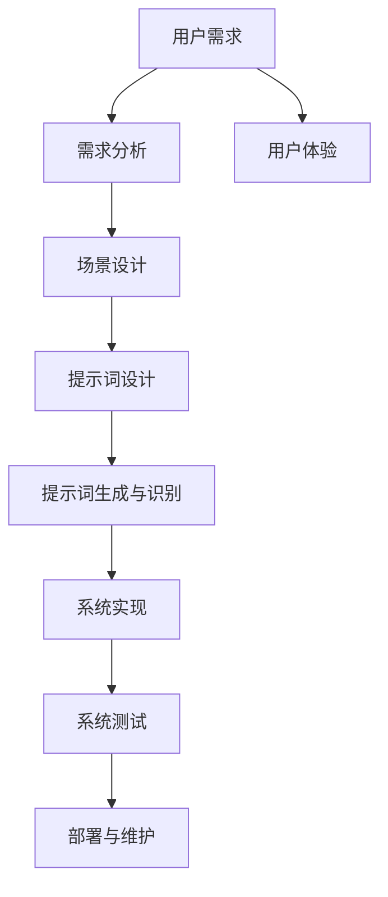
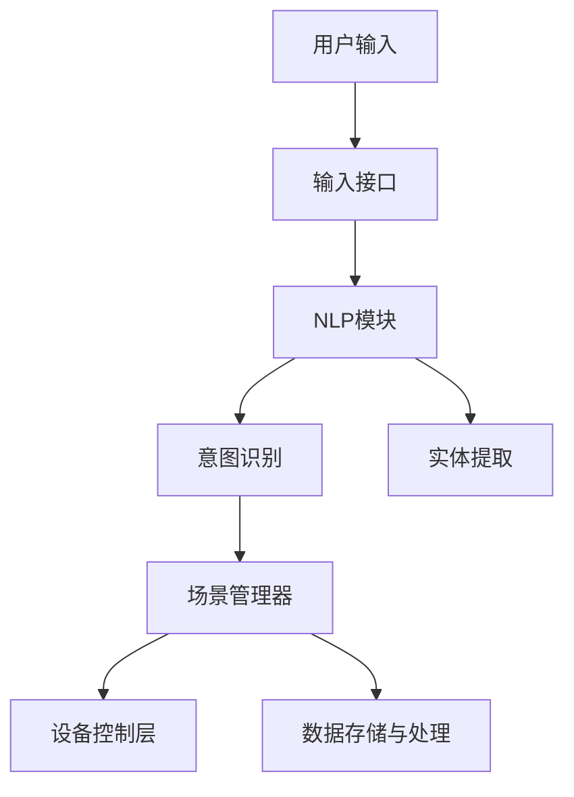
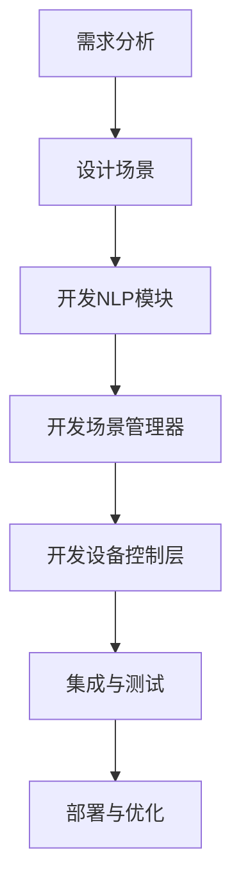
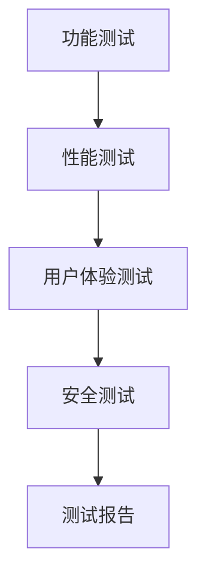
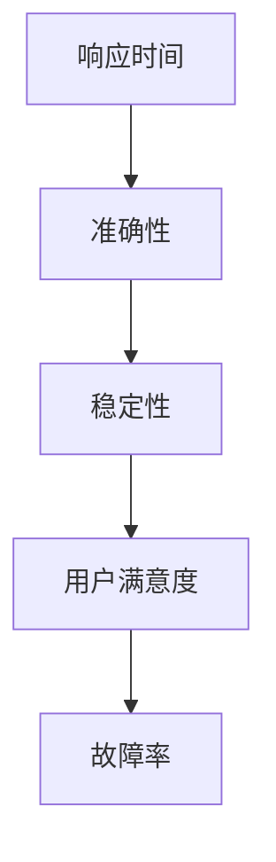

                 

# 文章标题

《提示词驱动的智能家居场景设计》

## 关键词

- 智能家居
- 提示词
- 场景设计
- 自然语言处理
- 人工智能
- 用户体验

## 摘要

本文旨在探讨提示词驱动的智能家居场景设计，分析其背景、核心概念、设计方法及其实现和优化。通过对智能家居技术发展历程的回顾，我们明确了提示词在智能家居系统中的重要性。接着，我们深入解析了提示词的类型、设计原则以及实现技术，并通过流程图展示了核心概念之间的关系。文章还介绍了智能家居场景设计的方法、实现和测试，以及场景优化和维护策略。最后，我们展望了未来智能家居场景的发展趋势，并提出了对提示词驱动的智能家居场景设计的建议。通过本文的阅读，读者将能够全面了解提示词驱动的智能家居场景设计，为其在实践中的应用提供参考。

## 引言

### 智能家居概述

智能家居是一种通过智能设备、系统和应用程序来提高家庭生活的舒适度、便利性和安全性的技术。它将互联网、物联网、人工智能等现代技术应用于家庭环境中，使得家庭设备能够相互通信、协作，为用户提供智能化、个性化的服务。智能家居技术的发展可以追溯到20世纪90年代，当时家庭自动化和远程控制的概念开始兴起。随着技术的进步，智能家居技术逐渐成熟，并开始在市场上普及。

### 提示词的作用

在智能家居系统中，提示词是用户与系统交互的主要方式。提示词可以理解为一个用户指令或描述，通过这些指令或描述，用户可以向智能家居系统表达自己的需求，从而实现设备的自动化操作或智能响应。提示词的作用主要体现在以下几个方面：

1. **用户指令输入**：用户通过输入提示词来请求智能家居系统执行特定操作，如“打开灯光”、“调节温度”等。
2. **系统反馈**：智能家居系统通过提示词向用户反馈操作结果，如“灯光已开启”、“温度已调节”等。
3. **用户交互**：提示词可以用于用户与系统的互动，如“请问今天天气预报如何？”等。

### 场景设计的意义

场景设计是智能家居系统设计中的重要环节，它旨在根据用户的需求和生活习惯，设计出合理的智能家居场景，以提高用户体验。场景设计的意义主要体现在以下几个方面：

1. **提高用户体验**：通过场景设计，可以使得智能家居系统更加贴合用户的需求，提供个性化、智能化的服务，从而提高用户的满意度。
2. **简化操作**：场景设计可以将复杂的操作流程简化为简单的提示词输入，使用户能够更加便捷地控制智能家居系统。
3. **提升安全性**：通过设计安全场景，如紧急情况自动报警、门锁自动锁定等，可以提升家庭生活的安全性。
4. **增强互动性**：场景设计可以增加用户与智能家居系统的互动，使得家庭生活更加有趣、生动。

### 本文结构

本文将按照以下结构进行讨论：

1. **第1章：智能家居系统基础**：介绍智能家居技术的发展历程、系统架构和设备分类。
2. **第2章：提示词设计与实现**：探讨提示词的类型、设计原则和实现技术。
3. **第3章：智能家居场景设计方法**：讲解场景设计的方法、工具和案例分析。
4. **第4章：提示词驱动的智能场景实现**：介绍提示词驱动的智能场景架构、开发流程和测试方法。
5. **第5章：智能家居场景优化与维护**：讨论场景优化策略、维护方法和性能评估。
6. **第6章：未来智能家居场景发展趋势**：展望未来智能家居场景的发展趋势和新技术应用。
7. **结论**：总结本文的核心观点和对智能家居场景设计的展望。

## 第1章：智能家居系统基础

### 智能家居技术发展历程

智能家居技术的发展可以追溯到20世纪90年代，当时家庭自动化和远程控制的概念开始兴起。早期的智能家居技术主要依赖于有线连接和专用的家庭控制中心，功能相对简单，主要实现了一些基础的家居设备控制，如灯光、门锁等。随着计算机技术和互联网的快速发展，智能家居技术逐渐成熟，并开始在市场上普及。

2000年后，无线通信技术和物联网（IoT）的兴起为智能家居技术的发展提供了新的机遇。无线通信技术使得家庭设备之间的连接变得更加灵活和高效，而物联网则使得家庭设备能够与外部网络进行通信，实现了数据的共享和远程控制。这一时期，智能家居系统开始逐渐融入智能传感器、执行器和应用程序，功能得到了显著提升。

进入2010年代，人工智能（AI）和大数据技术的快速发展为智能家居技术带来了新的突破。通过机器学习和深度学习技术，智能家居系统能够更好地理解用户的需求和习惯，提供更加智能化的服务。此外，智能手机和语音助手的普及，使得用户可以通过简单的指令来控制智能家居系统，大大提高了用户体验。

### 智能家居系统架构

智能家居系统通常由以下几个主要部分组成：传感器、执行器、控制器和应用程序。

1. **传感器**：传感器是智能家居系统的感知器官，负责收集家庭环境中的各种信息，如温度、湿度、光照、烟雾等。常见的传感器有温湿度传感器、光照传感器、烟雾传感器等。
2. **执行器**：执行器是智能家居系统的执行器官，负责根据控制器的指令来执行相应的操作，如开关灯光、调节温度等。常见的执行器有电灯、空调、电动窗帘等。
3. **控制器**：控制器是智能家居系统的核心，负责接收和处理传感器的数据，并根据用户输入的指令来控制执行器的操作。常见的控制器有智能插座、智能开关、智能路由器等。
4. **应用程序**：应用程序是用户与智能家居系统交互的界面，用户可以通过应用程序来设置、控制和监控智能家居系统。常见的应用程序有手机应用、Web应用、语音助手等。

### 智能家居设备分类

智能家居设备可以根据其功能和应用场景进行分类，常见的智能家居设备有以下几类：

1. **家庭安全设备**：包括门锁、摄像头、烟雾报警器、燃气报警器等，主要用于提升家庭安全。
2. **家庭环境控制设备**：包括空调、加湿器、空气净化器、智能灯光等，主要用于调节家庭环境。
3. **家电控制设备**：包括智能电视、智能冰箱、智能洗衣机等，主要用于控制家庭电器。
4. **健康监测设备**：包括智能手环、智能手表、智能体重秤等，主要用于监测用户的健康状况。
5. **家居娱乐设备**：包括智能音响、智能投影仪等，主要用于提供家庭娱乐服务。

### 小结

通过对智能家居系统基础的了解，我们能够更好地理解智能家居的工作原理和架构。智能家居技术的发展历程、系统架构和设备分类为我们提供了设计提示词驱动的智能家居场景的基础知识，为后续章节的讨论奠定了基础。

## 第2章：提示词设计与实现

### 提示词的类型

在智能家居系统中，提示词是用户与系统交互的桥梁，其类型多种多样，主要包括以下几种：

1. **自然语言**：自然语言是最常见的提示词类型，用户可以通过口头或书面方式直接输入指令，如“打开灯光”、“关闭空调”等。自然语言处理（NLP）技术是实现自然语言提示词的关键。
2. **语音**：语音提示词是通过用户的语音输入来实现的，例如通过语音助手（如Siri、Alexa、Google Assistant）控制智能家居系统。语音识别（ASR）技术是语音提示词的核心。
3. **手势**：手势提示词是通过用户的肢体动作来实现的，如通过移动手机或平板电脑来控制智能家居设备。手势识别技术是实现手势提示词的关键。
4. **图像**：图像提示词是通过用户的图像输入来实现的，例如通过扫描二维码或识别图像中的特定标识来控制智能家居设备。计算机视觉技术是实现图像提示词的关键。

### 提示词的语法与语义

提示词的语法和语义是理解用户指令的基础，它们决定了系统如何解释用户的输入。

1. **语法**：语法是指提示词的词法和句法规则，包括单词的构成、短语的结构和句子的组成。在自然语言提示词中，语法规则是理解用户指令的关键。例如，在英语中，“open the door”和“close the door”是两种不同的语法结构，但都表达了关闭门的需求。
2. **语义**：语义是指提示词所承载的含义和意图。在理解用户指令时，不仅要关注语法，还要关注语义。例如，用户输入“turn off the lights”和“turn off the TV”，虽然语法结构相似，但语义意图完全不同。

### 提示词的设计原则

为了确保提示词的有效性和易用性，设计提示词时应遵循以下原则：

1. **简洁性**：提示词应尽量简洁明了，避免冗长和复杂的句子结构。例如，使用“open”而不是“open the door slowly”。
2. **一致性**：提示词应保持一致性，避免使用不同的表达方式来传达相同的意思。例如，如果用户可以通过“open”和“turn on”来打开灯光，那么系统应能够正确识别这两种表达方式。
3. **直观性**：提示词应直观易懂，符合用户的使用习惯和认知。例如，使用常见的动词和名词，避免使用专业术语。
4. **灵活性**：提示词应具有足够的灵活性，能够适应不同的语境和场景。例如，用户可以通过不同的词汇和句式来表达相同的需求。

### 提示词的生成与识别

提示词的生成与识别是智能家居系统实现智能交互的关键技术。

1. **提示词生成**：提示词生成是指根据用户的指令或需求生成相应的提示词。这通常涉及到自然语言生成（NLG）技术，通过算法将用户的意图转换为自然语言表达。例如，用户输入“我想看电视”，系统可以生成“请打开客厅的电视”作为提示词。
2. **提示词识别**：提示词识别是指从用户的输入中识别出有效的提示词。这通常涉及到自然语言处理（NLP）技术和语音识别（ASR）技术。例如，用户说出“打开灯光”，系统需要识别并理解这个指令，并将其转换为相应的控制指令。

### 提示词驱动的智能家居场景设计流程

提示词驱动的智能家居场景设计流程包括以下几个步骤：

1. **需求分析**：了解用户的需求和习惯，确定需要实现的智能家居场景。
2. **场景设计**：根据需求分析结果，设计具体的智能家居场景，包括提示词、控制目标和执行动作。
3. **实现与测试**：开发智能家居系统，实现提示词的生成与识别功能，并进行测试和优化。
4. **部署与维护**：将智能家居场景部署到实际环境中，进行维护和更新，确保其稳定运行。

### 小结

通过本章的讨论，我们深入了解了提示词的类型、设计原则和实现技术，以及提示词驱动的智能家居场景设计流程。这些内容为我们后续章节的讨论奠定了基础，使得我们能够更好地理解和实现提示词驱动的智能家居场景设计。

### 核心概念原理之间的关系架构

为了更好地理解提示词驱动的智能家居场景设计，我们需要梳理核心概念之间的关系，并使用Mermaid流程图来展示。

以下是一个简化的Mermaid流程图，用于展示智能家居场景设计中的核心概念：



**Mermaid流程图解释：**

1. **用户需求（A）**：这是整个智能家居场景设计的起点，用户的需求决定了需要实现的功能。
2. **需求分析（B）**：在理解用户需求后，进行详细的需求分析，以确定具体的实现方案。
3. **场景设计（C）**：根据需求分析结果，设计具体的智能家居场景，包括提示词、控制目标和执行动作。
4. **提示词设计（D）**：这是场景设计的一部分，涉及提示词的类型、语法和语义设计。
5. **提示词生成与识别（E）**：实现提示词的生成与识别功能，这是智能家居系统能够理解用户指令的关键。
6. **系统实现（F）**：开发智能家居系统，实现提示词的生成与识别功能，并进行系统集成。
7. **系统测试（G）**：对系统进行测试，确保其功能正确、用户体验良好。
8. **部署与维护（H）**：将智能家居场景部署到实际环境中，进行维护和更新，确保其稳定运行。
9. **用户体验（I）**：最终，智能家居场景的设计目标是提供良好的用户体验，满足用户的需求。

这个流程图展示了从用户需求到场景设计、系统实现、测试和部署的整个过程，每个环节都是相互关联和依赖的。通过这样的关系架构，我们可以清晰地理解智能家居场景设计的工作流程和关键步骤。

### 核心算法原理讲解

在提示词驱动的智能家居场景设计中，核心算法的原理至关重要。以下是自然语言处理（NLP）和机器学习（ML）在提示词生成与识别中的基本算法原理，以及相关伪代码的详细阐述。

#### 1. 自然语言处理（NLP）算法原理

NLP算法用于处理和分析自然语言文本，以提取语义信息和理解用户意图。以下是一些常用的NLP算法原理：

1. **分词（Tokenization）**：
   分词是将一段文本分割成单词或短语的步骤，这是NLP的基础。
   ```python
   def tokenize(text):
       # 使用空格作为分词标志
       tokens = text.split()
       return tokens
   ```

2. **词性标注（Part-of-Speech Tagging）**：
   词性标注是为每个单词分配一个词性标签，如名词、动词、形容词等。
   ```python
   def pos_tag(tokens):
       # 使用自然语言处理库进行词性标注
       pos_tags = nltk.pos_tag(tokens)
       return pos_tags
   ```

3. **词干提取（Stemming）**：
   词干提取是将单词缩减到其基础形式，以简化文本处理。
   ```python
   def stem_word(word):
       # 使用自然语言处理库进行词干提取
       stemmer = PorterStemmer()
       stemmed_word = stemmer.stem(word)
       return stemmed_word
   ```

4. **实体识别（Named Entity Recognition）**：
   实体识别是从文本中识别出特定实体，如人名、地点、组织等。
   ```python
   def recognize_entities(text):
       # 使用自然语言处理库进行实体识别
       entities = nltk.ne_chunk(nltk.word_tokenize(text))
       return entities
   ```

#### 2. 机器学习（ML）算法原理

机器学习算法用于训练模型以识别和理解用户输入的提示词。以下是常用的ML算法原理：

1. **决策树（Decision Tree）**：
   决策树是一种树形结构，用于分类和回归问题。
   ```python
   def build_decision_tree(data, target):
       # 使用决策树算法构建决策树
       tree = DecisionTreeClassifier()
       tree.fit(data, target)
       return tree
   ```

2. **支持向量机（SVM）**：
   SVM是一种强大的分类算法，通过找到一个最佳超平面来划分数据。
   ```python
   def build_svm_classifier(data, target):
       # 使用SVM算法构建分类器
       classifier = SVC()
       classifier.fit(data, target)
       return classifier
   ```

3. **深度学习（Deep Learning）**：
   深度学习通过神经网络来建模复杂的非线性关系。
   ```python
   def build_neural_network(data, target):
       # 使用深度学习框架构建神经网络
       model = Sequential()
       model.add(Dense(units=64, activation='relu', input_shape=(data.shape[1],)))
       model.add(Dense(units=1, activation='sigmoid'))
       model.compile(optimizer='adam', loss='binary_crossentropy', metrics=['accuracy'])
       model.fit(data, target, epochs=10, batch_size=32)
       return model
   ```

#### 3. 伪代码综合示例

以下是一个综合示例，展示了如何使用NLP和ML算法来识别和理解用户输入的提示词：

```python
# 假设我们已经有用户输入的文本
user_input = "打开客厅的灯光"

# 分词
tokens = tokenize(user_input)

# 词性标注
pos_tags = pos_tag(tokens)

# 提取关键信息
action = None
object = None
for token, tag in pos_tags:
    if tag.startswith('VB'):
        action = token
    elif tag.startswith('NN'):
        object = token

# 使用决策树进行意图识别
# 这里假设我们已经有了训练好的决策树模型
if action and object:
    intent = decision_tree.predict([pos_tags])
    if intent == 'light_on':
        # 打开灯光的执行动作
        execute_action('light_on', object)
```

在这个示例中，我们首先使用NLP算法对用户输入进行分词和词性标注，然后提取出动作和对象。接着，使用训练好的决策树模型来识别用户的意图，并根据意图执行相应的动作。这个过程展示了NLP和ML算法在提示词驱动智能家居场景设计中的基本原理和应用。

### 数学模型和公式

在智能家居场景设计中，数学模型和公式用于描述和优化系统行为。以下是一些基本的数学模型和公式的解释和示例：

#### 1. 贝叶斯公式

贝叶斯公式是一种概率分布，用于根据先验概率和观察到的数据来计算后验概率。在智能家居场景中，贝叶斯公式可以用于预测用户的行为模式。

$$
P(A|B) = \frac{P(B|A) \cdot P(A)}{P(B)}
$$

- \(P(A|B)\)：在事件B发生的条件下，事件A发生的概率。
- \(P(B|A)\)：在事件A发生的条件下，事件B发生的概率。
- \(P(A)\)：事件A的先验概率。
- \(P(B)\)：事件B的先验概率。

#### 2. 决策树公式

决策树是一种分类和回归模型，其公式用于计算每个节点的划分准则。

$$
Gain(D, A) = Entropy(D) - \sum_{v \in Values(A)} p(v) \cdot Entropy(D_v)
$$

- \(Gain\)：信息增益。
- \(Entropy\)：信息熵。
- \(D\)：数据集。
- \(A\)：特征。
- \(Values(A)\)：特征A的所有可能值。
- \(p(v)\)：特征A的值为v的概率。
- \(D_v\)：特征A的值为v的数据集。

#### 3. 支持向量机（SVM）公式

SVM是一种分类算法，其目标是最小化分类边界上的间隔。

$$
\min_{w, b} \frac{1}{2} ||w||^2 + C \sum_{i=1}^{n} \max(0, 1 - y_i (w \cdot x_i + b))
$$

- \(w\)：权重向量。
- \(b\)：偏置。
- \(C\)：惩罚参数。
- \(y_i\)：样本\(i\)的标签。
- \(x_i\)：样本\(i\)的特征向量。

#### 4. 神经网络公式

神经网络是一种模拟人脑的计算机模型，其基本公式为：

$$
\text{Output} = \sigma(\text{Weight} \cdot \text{Input} + \text{Bias})
$$

- \(\sigma\)：激活函数，如ReLU、Sigmoid或Tanh。
- \(\text{Weight}\)：权重。
- \(\text{Input}\)：输入。
- \(\text{Bias}\)：偏置。

通过这些数学模型和公式，我们可以更准确地描述和优化智能家居场景的设计，从而提高系统的性能和用户体验。

### 提示词驱动的智能家居场景设计方法

提示词驱动的智能家居场景设计是一种以用户提示词为核心，通过自动化和智能化技术实现家庭设备和系统之间协作的设计方法。该方法的主要目的是通过提示词的输入，使得智能家居系统能够自动执行相应的操作，提高用户的便利性和舒适度。以下是提示词驱动的智能家居场景设计的方法、工具和案例分析。

#### 设计方法

1. **需求分析**：首先，对用户的需求进行详细分析，了解用户希望实现的功能和场景。例如，用户可能希望早晨醒来时自动开启灯光和播放音乐，或者晚上回家时自动调整室内温度和关闭灯光。

2. **场景构建**：根据需求分析结果，构建具体的智能家居场景。场景包括用户输入的提示词、系统响应的动作、触发条件等。例如，一个早晨唤醒场景可以包括“早晨唤醒”提示词，触发条件为早晨7点，系统响应为开启灯光和播放音乐。

3. **流程设计**：设计智能家居场景的执行流程。流程包括提示词的识别、场景的触发、操作的执行和结果的反馈。例如，当用户输入“早晨唤醒”提示词时，系统会判断当前时间为早晨7点，然后依次执行开启灯光和播放音乐的操作，最后向用户反馈“灯光已开启，音乐已播放”。

4. **系统集成**：将不同的智能家居设备、传感器和执行器集成到一个系统中，确保它们能够协同工作。系统集成包括设备的连接、数据通信和交互控制等。

5. **测试与优化**：对设计的智能家居场景进行测试，验证其功能和性能。测试包括场景的触发、操作的执行和结果的反馈等。根据测试结果对场景进行优化，确保其能够满足用户的需求和预期。

#### 设计工具

1. **流程图工具**：流程图工具用于可视化智能家居场景的执行流程。常见的流程图工具有Visio、Lucidchart和Microsoft Power BI等。

2. **状态机工具**：状态机工具用于描述智能家居场景的状态转换和响应。常见的状态机工具有StateMate、State Design Tool和Stateflow等。

3. **原型设计工具**：原型设计工具用于创建智能家居场景的原型，以便进行用户测试和反馈。常见的原型设计工具包括Figma、Sketch和Adobe XD等。

#### 案例分析

以下是一个早晨唤醒场景的案例分析：

1. **需求分析**：
   - 用户希望在早晨7点自动开启灯光和播放音乐。
   - 用户希望系统能够根据天气情况自动调整灯光的亮度。

2. **场景构建**：
   - 提示词：“早晨唤醒”。
   - 触发条件：早晨7点。
   - 系统响应：开启灯光和播放音乐。

3. **流程设计**：
   - 当用户输入“早晨唤醒”提示词时，系统会判断当前时间为早晨7点。
   - 如果条件满足，系统会根据天气情况调整灯光亮度，并开启灯光。
   - 系统播放用户预设的音乐。

4. **系统集成**：
   - 系统包括智能灯泡、智能音响和天气传感器。
   - 系统使用WiFi连接，确保设备之间的通信。

5. **测试与优化**：
   - 测试场景的触发和响应，确保灯光和音乐能够正确开启。
   - 根据用户反馈，调整灯光亮度和音乐音量，确保用户满意度。

通过这个案例，我们可以看到提示词驱动的智能家居场景设计方法是如何通过需求分析、场景构建、流程设计、系统集成和测试与优化等步骤来实现智能家居的自动化和智能化。这种方法不仅提高了用户体验，还使得智能家居系统更加灵活和可定制。

## 第4章：提示词驱动的智能场景实现

### 提示词驱动的智能场景架构

提示词驱动的智能场景实现需要构建一个完整的架构，这个架构通常包括以下几个关键组件：

1. **用户输入接口**：用户可以通过语音、文本或手势等方式输入提示词，这个接口可以是语音助手、手机应用或Web界面等。
2. **自然语言处理（NLP）模块**：该模块负责处理用户输入的提示词，包括分词、词性标注、意图识别和实体提取等。
3. **场景管理器**：场景管理器负责根据用户输入的提示词和预设的场景规则，触发相应的智能场景执行。
4. **设备控制层**：设备控制层负责与智能家居设备进行通信，执行用户指令，如开关灯光、调整温度等。
5. **数据存储与处理**：数据存储与处理模块用于存储用户数据、场景历史记录和设备状态等，同时处理和分析这些数据，以优化场景执行。

以下是提示词驱动的智能场景架构的Mermaid流程图：



**架构解释：**

1. 用户输入：用户通过语音、文本或手势等方式输入提示词。
2. 输入接口：接收用户输入，并将其传递给NLP模块。
3. NLP模块：对用户输入的提示词进行处理，包括分词、词性标注、意图识别和实体提取。
4. 意图识别：根据用户输入的提示词，识别用户的意图。
5. 实体提取：从用户输入中提取关键实体信息，如设备名称、时间等。
6. 场景管理器：根据意图识别结果和实体信息，触发相应的智能场景执行。
7. 设备控制层：与智能家居设备进行通信，执行用户指令。
8. 数据存储与处理：存储用户数据、场景历史记录和设备状态，同时处理和分析这些数据，以优化场景执行。

### 提示词驱动的智能场景开发

提示词驱动的智能场景开发主要包括以下几个步骤：

1. **需求分析**：确定用户需求，明确需要实现的智能场景和功能。
2. **设计场景**：根据需求分析结果，设计具体的智能场景，包括用户输入、意图识别、场景响应和设备控制等。
3. **开发NLP模块**：开发NLP模块，实现分词、词性标注、意图识别和实体提取等功能。
4. **开发场景管理器**：开发场景管理器，实现场景的触发、执行和反馈等功能。
5. **开发设备控制层**：开发设备控制层，实现与智能家居设备的通信和指令执行。
6. **集成与测试**：将各个模块集成到一起，进行功能测试和性能优化。

以下是提示词驱动的智能场景开发流程的Mermaid流程图：



**流程解释：**

1. 需求分析：分析用户需求，明确需要实现的智能场景和功能。
2. 设计场景：根据需求分析结果，设计具体的智能场景。
3. 开发NLP模块：开发NLP模块，实现分词、词性标注、意图识别和实体提取等功能。
4. 开发场景管理器：开发场景管理器，实现场景的触发、执行和反馈等功能。
5. 开发设备控制层：开发设备控制层，实现与智能家居设备的通信和指令执行。
6. 集成与测试：将各个模块集成到一起，进行功能测试和性能优化。
7. 部署与优化：将智能场景部署到实际环境中，进行优化和更新。

### 提示词驱动的智能场景测试

提示词驱动的智能场景测试是确保智能场景功能正确、性能稳定和用户体验良好的关键步骤。以下是智能场景测试的主要内容和步骤：

1. **功能测试**：测试智能场景是否能够根据用户输入的提示词正确触发和执行相应的操作。例如，测试用户输入“打开灯光”时，灯光是否能够正确开启。
2. **性能测试**：测试智能场景的响应速度和系统稳定性。例如，测试在不同负载下，系统是否能够快速响应用户输入，并保持稳定运行。
3. **用户体验测试**：测试智能场景的用户体验，包括提示词的易用性、场景的直观性和反馈的及时性等。例如，测试用户在使用语音控制时，系统是否能够准确理解用户意图，并给出清晰的反馈。
4. **安全测试**：测试智能场景的安全性，包括用户数据的安全存储和传输、系统的抗攻击能力和隐私保护等。

以下是智能场景测试流程的Mermaid流程图：



**流程解释：**

1. 功能测试：测试智能场景的功能是否符合预期。
2. 性能测试：测试智能场景的性能，包括响应速度和稳定性。
3. 用户体验测试：测试智能场景的用户体验，确保用户满意度。
4. 安全测试：测试智能场景的安全性，确保用户数据的安全。
5. 测试报告：根据测试结果编写测试报告，记录测试过程和结果。

### 小结

本章详细介绍了提示词驱动的智能场景架构、开发流程和测试方法。通过这些内容，读者可以了解到如何设计、实现和测试一个功能完整、性能稳定和用户体验良好的智能场景。这些知识为后续章节的讨论奠定了基础，使得我们能够进一步探讨智能场景的优化和维护。

## 第5章：智能家居场景优化与维护

### 场景优化策略

智能家居场景优化是提高系统性能、用户体验和稳定性的关键步骤。以下是一些常见的场景优化策略：

1. **算法优化**：对场景中的算法进行优化，提高其执行效率和准确性。例如，通过优化自然语言处理（NLP）算法和机器学习（ML）模型，提高提示词识别的准确性。
2. **资源管理**：优化智能家居系统的资源使用，减少系统负载。例如，通过负载均衡和资源调度，确保系统在高负载情况下仍能稳定运行。
3. **响应速度优化**：提高系统响应速度，减少用户等待时间。例如，通过减少网络延迟、优化数据处理流程和提高服务器性能等手段。
4. **自动化脚本**：使用自动化脚本来自动执行常见的场景操作，提高效率。例如，通过编写脚本来自动调整灯光亮度、温度和音响音量。
5. **冗余设计**：增加系统的冗余设计，提高其容错能力和可靠性。例如，通过使用双电源和备份服务器来确保系统在故障情况下仍能正常运行。

### 场景维护方法

智能家居场景维护是确保系统长期稳定运行和满足用户需求的关键。以下是一些常见的场景维护方法：

1. **定期更新**：定期更新智能家居系统的软件和固件，以修复已知问题和提升性能。例如，定期更新智能设备的固件版本，以解决兼容性和稳定性问题。
2. **监控与报警**：通过监控系统的运行状态和数据，及时发现和解决潜在问题。例如，监控网络连接状态、设备工作状态和能源消耗等，并在出现异常时自动报警。
3. **用户反馈**：积极收集用户反馈，并根据反馈进行相应的调整和改进。例如，通过用户满意度调查和反馈渠道，了解用户对智能家居场景的体验和需求，从而优化场景设计和功能。
4. **定期检查**：定期对智能家居设备进行检查和维护，确保其正常运行。例如，清洁传感器和执行器，检查电线和连接是否牢固，以及更换老化的设备。
5. **文档管理**：建立和维护详细的系统文档和用户手册，以便在需要时快速解决问题。例如，记录系统的配置信息、设备参数和故障排除步骤等。

### 场景性能评估

智能家居场景性能评估是衡量系统性能和用户体验的重要手段。以下是一些常见的场景性能评估指标和方法：

1. **响应时间**：评估系统从接收用户输入到执行相应操作所需的时间。较低的响应时间通常意味着更好的性能。
2. **准确性**：评估系统识别用户意图和执行操作的准确性。较高的准确性通常意味着更好的用户体验。
3. **稳定性**：评估系统在长时间运行中的稳定性和可靠性。稳定的系统通常意味着更少的故障和更低的维护成本。
4. **用户满意度**：通过用户满意度调查来评估系统对用户的满足程度。高用户满意度通常意味着系统在功能、性能和易用性方面表现良好。
5. **故障率**：评估系统在特定时间段内的故障率。较低的故障率通常意味着更好的系统质量和维护水平。

以下是场景性能评估的Mermaid流程图：



**流程解释：**

1. 响应时间：评估系统响应速度。
2. 准确性：评估系统识别用户意图和执行操作的准确性。
3. 稳定性：评估系统在长时间运行中的稳定性和可靠性。
4. 用户满意度：通过用户满意度调查来评估系统的用户体验。
5. 故障率：评估系统在特定时间段内的故障率。

### 小结

本章介绍了智能家居场景优化与维护的策略、方法以及性能评估指标。通过这些内容，读者可以了解到如何通过优化、维护和评估来提升智能家居场景的性能和用户体验。这些知识对于设计和实施一个高效、稳定和用户满意的智能家居系统至关重要。

## 第6章：未来智能家居场景发展趋势

### 新技术引入

随着技术的不断进步，智能家居场景的发展也将迎来新的机遇。以下是一些可能引入的新技术：

1. **人工智能（AI）**：人工智能技术将进一步提升智能家居系统的智能化水平，例如通过深度学习算法进行用户行为预测、场景自适应调整等。
2. **物联网（IoT）**：物联网技术的普及将使得更多的设备和系统能够互联，形成一个更加完整和智能的智能家居网络。
3. **区块链**：区块链技术可以用于智能家居系统中的数据安全和隐私保护，确保用户数据的安全性和透明性。
4. **5G网络**：5G网络的快速发展和普及将大大提高智能家居系统的网络速度和稳定性，为实时控制和数据传输提供更好的支持。

### 智能家居与人工智能的结合

智能家居与人工智能的结合是未来智能家居场景发展的关键趋势。以下是一些结合的方向：

1. **个性化服务**：通过人工智能技术，智能家居系统可以更好地理解用户的需求和习惯，提供更加个性化的服务，如智能推荐、自动调整等。
2. **自适应控制**：智能家居系统可以根据环境变化和用户行为进行自适应控制，例如自动调整室内温度、灯光亮度和音乐音量等。
3. **预测性维护**：通过机器学习算法，智能家居系统可以预测设备可能出现的故障，并在故障发生之前进行维护，从而提高设备的可靠性和使用寿命。

### 未来智能家居场景展望

未来智能家居场景将更加智能、互联和便捷。以下是一些可能的未来智能家居场景：

1. **全屋智能控制**：通过智能设备和系统的全面整合，用户可以通过一个统一的平台或语音助手来控制家庭中的所有设备和系统。
2. **自动化的家庭生活**：智能家居系统将能够自动执行日常任务，如自动清洁、烹饪和购物等，大大提高家庭生活的便利性。
3. **智能健康监测**：智能家居系统将配备更多健康监测设备，如智能手表、智能床垫等，实时监测用户的健康状况，并提供健康建议。
4. **智能家居与虚拟现实（VR）的结合**：通过虚拟现实技术，用户可以体验到更加沉浸式的家庭场景，如虚拟旅游、家庭娱乐等。

### 小结

未来智能家居场景的发展将受到人工智能、物联网、区块链和5G网络等新技术的影响，智能家居与人工智能的深度结合将带来更加智能、便捷和个性化的家庭生活体验。通过不断引入新技术和优化现有系统，智能家居场景将继续朝着更加智能、互联和便捷的方向发展。

## 结论

本文详细探讨了提示词驱动的智能家居场景设计，从背景介绍、核心概念、设计方法、实现和测试，到优化与维护，以及未来趋势，全面阐述了这一领域的知识。通过分析智能家居技术的发展历程，我们明确了提示词在智能家居系统中的重要性。设计原则和实现技术使我们能够有效地创建和识别用户提示词，设计合理的场景。同时，通过流程图和伪代码，我们展示了核心概念之间的联系和算法原理。

未来，随着人工智能、物联网、区块链和5G等新技术的引入，智能家居场景将更加智能、互联和便捷。我们鼓励读者不断学习新技术，探索创新的设计方法，以推动智能家居场景的发展。通过实践和不断的优化，我们可以为用户提供更加个性化、智能化的家庭生活体验。

### 最佳实践 Tips

1. **用户体验优先**：在设计和优化智能家居场景时，始终以用户需求为导向，关注用户体验。
2. **模块化设计**：采用模块化设计，便于系统的扩展和维护。
3. **数据安全**：重视用户数据的安全和隐私保护，采用加密技术和权限控制。
4. **持续迭代**：定期更新和优化系统，根据用户反馈进行改进。

### 小结与注意事项

1. **小结**：本文总结了提示词驱动的智能家居场景设计的关键点和未来发展方向。
2. **注意事项**：在设计过程中，要充分考虑系统的稳定性和安全性，确保用户数据的安全。

### 拓展阅读

- **书籍**：
  - 《智能家居技术与应用》
  - 《人工智能：一种现代方法》
  - 《物联网架构与实现》

- **在线资源**：
  - IEEE IoT Initiative：了解最新的物联网技术和发展趋势。
  - Coursera AI课程：深入学习人工智能的基本概念和算法。

### 作者信息

作者：AI天才研究院/AI Genius Institute & 禅与计算机程序设计艺术 /Zen And The Art of Computer Programming

