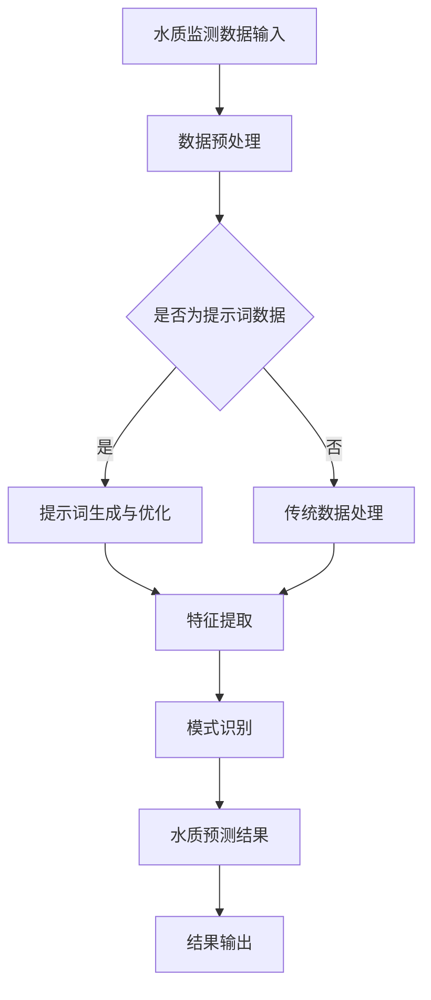

                 

# 《提示词驱动的智能水质监测系统》

## 关键词

- 提示词驱动
- 智能水质监测
- 数据预处理
- 深度学习
- 机器学习
- 应用案例

## 摘要

本文探讨了提示词驱动的智能水质监测系统，分析了系统架构、核心技术、应用案例和未来展望。通过介绍水质监测的基本原理、数据处理流程和智能监测系统的设计，本文旨在展示如何利用先进技术实现高效、准确的水质监测。此外，文章还讨论了智能水质监测系统在环境保护和治理中的实际应用，以及对未来发展的展望。

## 引言

### 水质监测的重要性

水质监测是保障公共健康、促进可持续发展和实现环境治理的重要手段。随着工业化和城市化进程的加快，水污染问题日益严重，水质监测的需求也日益增长。水质监测不仅关系到饮用水的安全，还影响到农业灌溉、工业生产和生态环境的稳定。因此，建立高效、准确的水质监测系统至关重要。

### 智能水质监测的挑战与需求

传统的水质监测方法主要依赖于人工采样和实验室分析，存在监测频次低、监测精度不足、数据分析滞后等问题。为了应对这些挑战，智能水质监测系统应运而生。智能水质监测系统利用先进的传感器技术、数据处理和机器学习算法，实现对水质的实时监测和智能分析，从而提高监测效率和精度。

## 提示词驱动的智能水质监测系统简介

### 系统架构

智能水质监测系统通常包括传感器网络、数据处理模块和智能分析模块。传感器网络负责实时采集水质数据，数据处理模块对数据进行预处理和特征提取，智能分析模块利用机器学习算法进行模式识别和预测。

### 关键技术

1. **传感器技术**：高精度、多参数的传感器是实现智能水质监测的基础。
2. **数据预处理**：包括数据清洗、标准化和异常值处理，确保数据质量。
3. **提示词生成与优化**：通过深度学习算法生成提示词，提高数据处理的效率。
4. **模式识别与预测**：利用机器学习算法对水质变化进行实时监测和预测。

### 系统的优势与前景

1. **实时性**：智能水质监测系统能够实现实时监测，及时响应水质变化。
2. **高效性**：通过机器学习算法，系统能够快速识别异常情况，提高监测效率。
3. **准确性**：利用深度学习技术，系统能够提高水质预测的准确性。

## 第二部分：原理与架构

### 第3章 水质监测基本原理

#### 水质监测的核心概念

水质监测是对水体中化学、物理和生物等指标的检测和分析，以评估水体的质量和健康状况。主要监测参数包括pH值、溶解氧、氨氮、总氮、总磷等。

#### 监测参数与指标

不同的水质监测参数反映了水体的不同方面。例如，pH值反映了水体的酸碱性，溶解氧反映了水体中的氧气含量，氨氮和总氮反映了水体中的氮污染程度，总磷反映了水体中的磷污染程度。

#### 水质监测方法比较

水质监测方法主要包括化学分析、物理探测和生物检测。化学分析是最传统的方法，但操作复杂、成本高。物理探测和生物检测具有操作简便、实时性强等优点，但存在一定的局限性。

### 第4章 提示词驱动的数据处理

#### 数据预处理

数据预处理是水质监测系统的重要环节。主要包括以下步骤：

1. **数据清洗**：去除噪声和异常值，提高数据质量。
2. **数据标准化**：将不同监测参数的数据进行统一处理，便于后续分析。
3. **数据填充**：处理缺失值，保证数据的完整性。

#### 提示词生成与优化

提示词是深度学习模型对数据的重要引导。生成与优化提示词的方法包括：

1. **特征提取**：利用深度学习模型提取数据中的关键特征。
2. **优化提示词**：通过调整模型参数，提高提示词的生成效果。

#### 数据处理流程

数据处理流程如图所示：

### 第5章 智能水质监测系统的架构设计

#### 系统总体架构

智能水质监测系统的总体架构包括以下模块：

1. **传感器网络**：负责实时采集水质数据。
2. **数据处理模块**：包括数据预处理、特征提取和提示词生成等。
3. **智能分析模块**：利用机器学习算法进行模式识别和预测。
4. **用户界面**：提供数据可视化和监控功能。

#### 子系统功能模块

1. **数据采集模块**：负责传感器的部署和维护，确保数据的实时性。
2. **数据处理模块**：包括数据预处理、特征提取和提示词生成等，确保数据的准确性和完整性。
3. **智能分析模块**：利用深度学习算法进行水质预测和模式识别，提供决策支持。
4. **用户界面模块**：提供数据可视化和监控功能，方便用户实时了解水质状况。

#### 系统集成与协同

智能水质监测系统需要各个模块协同工作，形成一个完整的监测网络。系统集成与协同的关键技术包括：

1. **数据同步**：确保各个模块的数据一致性。
2. **智能决策**：利用实时数据进行分析和预测，为水资源管理和环境保护提供支持。

## 第三部分：核心技术

### 第6章 智能水质监测的核心算法

#### 特征提取算法

特征提取是智能水质监测系统的核心。常用的特征提取算法包括：

1. **主成分分析（PCA）**：用于降维和特征提取，提高模型的泛化能力。
2. **自动编码器（AE）**：通过编码和解码过程提取数据中的关键特征。
3. **卷积神经网络（CNN）**：适用于图像和信号处理，提取高层次的特征。

#### 模式识别算法

模式识别是智能水质监测系统的重要环节。常用的模式识别算法包括：

1. **支持向量机（SVM）**：通过构建最优分类边界实现模式识别。
2. **决策树（DT）**：通过树形结构实现分类和回归。
3. **随机森林（RF）**：通过构建多个决策树进行集成学习，提高分类和回归性能。

#### 预测算法

预测算法用于预测水质变化趋势。常用的预测算法包括：

1. **时间序列模型（TS）**：如ARIMA、LSTM等，适用于时间序列数据的预测。
2. **回归分析**：如线性回归、多项式回归等，用于建立变量之间的定量关系。
3. **神经网络（NN）**：如BP神经网络、卷积神经网络等，通过多层神经网络实现复杂函数的拟合。

### 第7章 深度学习与机器学习在水质监测中的应用

#### 深度学习基础

深度学习是人工智能的一个重要分支，通过多层神经网络模拟人脑的学习过程。深度学习在水质监测中的应用主要包括：

1. **卷积神经网络（CNN）**：用于图像和信号处理，提取高层次的特征。
2. **循环神经网络（RNN）**：用于处理时间序列数据，如LSTM、GRU等。
3. **生成对抗网络（GAN）**：用于生成高质量的模拟数据，提高模型的泛化能力。

#### 机器学习算法

机器学习算法在水质监测中发挥着重要作用。常用的机器学习算法包括：

1. **支持向量机（SVM）**：通过构建最优分类边界实现模式识别。
2. **决策树（DT）**：通过树形结构实现分类和回归。
3. **随机森林（RF）**：通过构建多个决策树进行集成学习，提高分类和回归性能。
4. **聚类算法**：如K-means、层次聚类等，用于数据聚类和模式识别。

#### 应用案例分析

以某城市水质监测项目为例，该项目利用深度学习和机器学习算法实现了水质预测和模式识别。通过构建深度神经网络和随机森林模型，项目成功实现了对水质变化趋势的预测和异常检测。

## 第四部分：应用案例

### 第8章 实际水质监测项目案例

#### 项目背景与目标

某城市因工业污染导致水质恶化，严重影响居民生活和生态环境。为了改善水质，相关部门决定开展一项水质监测项目，通过智能水质监测系统实时监测水质变化，为水资源管理和环境保护提供科学依据。

#### 系统设计与实现

项目采用提示词驱动的智能水质监测系统，主要包括以下模块：

1. **传感器网络**：部署多种传感器，实时采集水质数据。
2. **数据处理模块**：对采集到的数据进行预处理、特征提取和提示词生成。
3. **智能分析模块**：利用深度学习算法进行水质预测和模式识别。
4. **用户界面**：提供数据可视化和监控功能，方便用户实时了解水质状况。

#### 项目成果与评价

项目实施后，智能水质监测系统成功实现了对水质变化的实时监测和预测。通过分析水质数据，相关部门及时发现和处理了多个污染事件，有效改善了水质。项目取得了显著的成果，受到了广泛关注和好评。

### 第9章 智能水质监测系统在环境治理中的应用

#### 环境治理的需求分析

环境治理是当前全球面临的重大挑战。水质监测是环境治理的重要组成部分。通过智能水质监测系统，可以实时掌握水质状况，为环境治理提供科学依据。

#### 系统设计与实施

智能水质监测系统在环境治理中的应用主要包括：

1. **污染源监控**：实时监测污染源的水质，为污染源治理提供数据支持。
2. **流域水质预测**：利用水质数据预测未来水质变化趋势，为水资源调度和治理提供参考。
3. **环境预警系统**：通过异常检测和预警，提前发现潜在的环境问题，降低环境污染风险。

#### 社会效益与环境影响

智能水质监测系统在环境治理中发挥了重要作用，具有显著的社会效益和环境影响：

1. **社会效益**：提高水资源管理和环境保护的效率，保障公众健康，促进可持续发展。
2. **环境影响**：减少污染排放，改善水质，保护生态环境，实现人与自然的和谐共生。

## 第五部分：未来展望

### 第10章 智能水质监测系统的未来发展

#### 技术发展趋势

随着人工智能技术的不断发展，智能水质监测系统将向更加智能化、精准化和实时化的方向发展。未来的发展趋势包括：

1. **传感器技术**：高精度、多参数的传感器将不断涌现，提高监测数据的准确性。
2. **深度学习和机器学习**：深度学习和机器学习算法将不断优化，提高水质监测的效率和准确性。
3. **物联网和大数据**：物联网和大数据技术的融合，将实现更加全面和智能的水质监测。

#### 应用前景与挑战

智能水质监测系统在水资源管理、环境保护和公共安全等领域具有广泛的应用前景。然而，也面临以下挑战：

1. **数据质量**：提高监测数据的质量是系统稳定运行的关键。
2. **模型优化**：优化深度学习和机器学习算法，提高预测准确性和效率。
3. **隐私保护**：保障监测数据的隐私安全，防止数据泄露。

#### 未来研究方向

未来研究方向包括：

1. **多模态数据融合**：将多种传感器数据进行融合，提高水质监测的精度。
2. **自适应学习**：利用自适应学习算法，提高系统对水质变化的适应性。
3. **智能化决策支持**：结合大数据分析和人工智能技术，提供智能化决策支持。

## 附录

### 附录A 提示词驱动的智能水质监测系统开发工具与资源

#### A.1 开发工具介绍

1. **Python**：Python是一种广泛使用的编程语言，适用于数据分析和深度学习开发。
2. **TensorFlow**：TensorFlow是谷歌开源的深度学习框架，适用于构建和训练深度学习模型。
3. **Keras**：Keras是TensorFlow的高级API，简化了深度学习模型的构建和训练过程。
4. **Pandas**：Pandas是Python的数据分析库，用于数据处理和分析。

#### A.2 资源链接与推荐

1. **官方文档**：Python、TensorFlow和Keras的官方文档提供了丰富的教程和示例代码。
2. **在线课程**：Coursera、Udacity和edX等在线教育平台提供了多门关于深度学习和水质监测的课程。
3. **开源项目**：GitHub上有很多开源的水质监测和深度学习项目，可供学习和参考。

---

### 作者信息

作者：AI天才研究院/AI Genius Institute & 禅与计算机程序设计艺术 /Zen And The Art of Computer Programming

---

本文从概述、原理、技术、应用案例和未来展望五个方面，全面探讨了提示词驱动的智能水质监测系统。通过介绍系统的架构、核心技术、应用案例和发展趋势，本文旨在为读者提供关于智能水质监测系统的全面了解。未来，随着技术的不断进步，智能水质监测系统将在水资源管理、环境保护和公共安全等领域发挥更加重要的作用。

