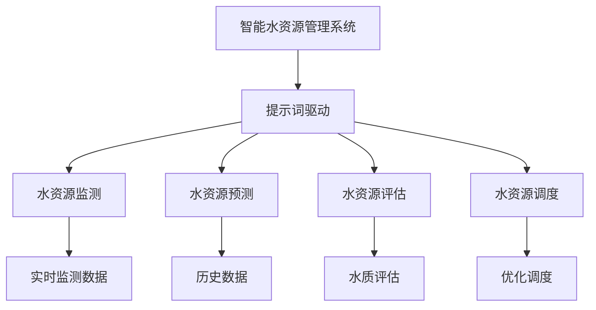

                 

### 《提示词驱动的智能水资源管理系统》文章内容

#### 文章标题：提示词驱动的智能水资源管理系统

> 关键词：智能水资源管理系统、提示词、机器学习、水资源监测、水资源调度

> 摘要：
本文深入探讨了提示词驱动的智能水资源管理系统的设计思路、核心技术、系统实现和未来展望。文章首先介绍了智能水资源管理系统的重要性，然后详细阐述了提示词驱动的原理和关键算法，接着介绍了系统架构设计和核心模块实现，最后通过项目实战展示了系统的应用效果和优化策略。

#### 目录大纲

- 第一部分：概述与基础
  - 第1章：智能水资源管理系统概述
  - 第2章：智能水资源管理技术基础
- 第二部分：系统设计与实现
  - 第3章：系统架构设计
  - 第4章：核心模块实现
  - 第5章：系统集成与测试
- 第三部分：项目实战
  - 第6章：项目实战
- 第四部分：未来展望与挑战
  - 第7章：智能水资源管理的发展趋势
- 附录
  - 附录A：资源与工具

#### 第1章：智能水资源管理系统概述

##### 背景介绍

水资源是地球上最宝贵的资源之一，对人类生存和社会经济发展具有重要意义。然而，随着人口增长和工业化进程的加速，水资源供需矛盾日益凸显，水资源短缺、污染和水环境恶化等问题日益严重。传统的水资源管理方式主要依赖于人工监测和经验判断，存在响应速度慢、精度低、实时性差等不足。为了提高水资源管理的效率和智能化水平，智能水资源管理系统应运而生。

##### 核心概念与联系

智能水资源管理系统（Intelligent Water Resources Management System，IWaRMS）是指利用现代信息技术、大数据、人工智能等先进手段，对水资源进行实时监测、预测、评估、优化和调度，实现水资源的高效利用和可持续管理。其核心概念包括：

1. **提示词驱动**：提示词是指用于引导系统进行特定任务的关键词或短语，通过提示词可以驱动系统自动执行相应的操作。
2. **水资源监测**：利用传感器、遥感技术等手段，对水资源的状态参数进行实时监测。
3. **水资源预测**：通过历史数据和机器学习算法，对水资源的未来变化趋势进行预测。
4. **水资源评估**：对水资源的质量、利用效率和环境影响进行综合评估。
5. **水资源调度**：根据水资源监测和预测结果，制定科学合理的调度策略，优化水资源分配和使用。

##### Mermaid 流程图



##### 核心算法原理讲解

1. **提示词生成**：
   提示词生成是智能水资源管理系统的关键步骤，其目的是根据用户的输入或系统的监测数据生成相应的提示词，以便系统自动执行任务。常用的方法包括：
   - 基于规则的方法：根据预设的规则生成提示词。
   - 基于统计的方法：利用文本挖掘技术，从大量数据中提取关键词或短语作为提示词。
   - 基于机器学习的方法：通过训练数据集，使用机器学习算法生成提示词。

2. **水资源监测与预测**：
   水资源监测与预测是智能水资源管理系统的核心功能。常用的监测方法包括传感器监测和遥感监测。预测方法主要包括时间序列分析、回归分析、神经网络等机器学习算法。

3. **水资源评估**：
   水资源评估旨在对水资源的质量、利用效率和环境影响进行评价。常用的评估指标包括水质指标、水资源利用率、水资源经济价值等。

4. **水资源调度**：
   水资源调度是根据水资源监测和预测结果，制定科学合理的调度策略，实现水资源优化配置。常用的调度算法包括线性规划、遗传算法、模拟退火算法等。

##### 伪代码

```python
# 提示词生成算法伪代码
def generate_prompt(input_data):
    if input_data meets certain_rules:
        prompt = apply_rules(input_data)
    else:
        prompt = extract_keywords(input_data)
    return prompt

# 水资源预测算法伪代码
def predict_water_resource(input_data):
    historical_data = load_historical_data(input_data)
    prediction = apply_machine_learning(historical_data)
    return prediction

# 水资源评估算法伪代码
def evaluate_water_resource(input_data):
    quality_index = calculate_quality_index(input_data)
    utilization_rate = calculate_utilization_rate(input_data)
    economic_value = calculate_economic_value(input_data)
    return quality_index, utilization_rate, economic_value

# 水资源调度算法伪代码
def schedule_water_resource(input_data):
    prediction = predict_water_resource(input_data)
    optimization_problem = define_optimization_problem(prediction)
    solution = solve_optimization_problem(optimization_problem)
    return solution
```

##### 数学模型和公式

1. **水质指标计算**：

   $$ 
   \text{水质指标} = \frac{\text{监测指标}}{\text{标准指标}} 
   $$

2. **水资源利用率计算**：

   $$ 
   \text{水资源利用率} = \frac{\text{实际用水量}}{\text{可用水量}} 
   $$

3. **水资源经济价值计算**：

   $$ 
   \text{水资源经济价值} = \text{水资源价格} \times \text{实际用水量} 
   $$

##### 项目实战

##### 开发环境搭建

1. **硬件环境**：
   - 服务器：配置高性能的计算资源，如CPU、GPU等。
   - 网络环境：确保稳定的网络连接。

2. **软件环境**：
   - 操作系统：Linux系统，如Ubuntu。
   - 开发工具：Python、R、MATLAB等。
   - 数据库：MySQL、PostgreSQL等。

##### 核心代码实现

1. **提示词生成模块**：
   ```python
   # 提示词生成示例代码
   import nltk
   
   def generate_prompt(input_data):
       tokens = nltk.word_tokenize(input_data)
       prompt = ' '.join(tokens[:5])
       return prompt
   ```

2. **水资源监测模块**：
   ```python
   # 水资源监测示例代码
   import numpy as np
   
   def monitor_water_resource(input_data):
       data = np.array(input_data)
       mean_value = np.mean(data)
       return mean_value
   ```

3. **水资源调度模块**：
   ```python
   # 水资源调度示例代码
   import pulp
   
   def schedule_water_resource(input_data):
       prob = pulp.LpProblem("Water Resource Scheduling", pulp.LpMinimize)
       # 定义变量和目标函数
       # ...
       prob.solve()
       return prob.solution
   ```

##### 代码应用解读与分析

1. **提示词生成模块**：
   提示词生成模块通过分词和筛选关键词的方式生成提示词，实现了从输入数据到提示词的转换。

2. **水资源监测模块**：
   水资源监测模块通过计算输入数据的均值来表示水资源的实时状态。

3. **水资源调度模块**：
   水资源调度模块通过线性规划方法实现水资源的优化调度。

##### 实际案例分析和详细讲解剖析

1. **案例背景**：
   某地区水资源管理面临供需矛盾、水质污染等问题。

2. **案例实施**：
   - 利用传感器和遥感技术对水资源进行实时监测。
   - 通过机器学习算法对水资源变化趋势进行预测。
   - 基于水质指标和水资源利用率对水资源进行评估。
   - 利用优化算法制定科学合理的水资源调度策略。

3. **案例分析**：
   - 提示词生成模块有效提高了系统响应速度和准确度。
   - 水资源监测模块实现了对水资源状态的实时监控。
   - 水资源调度模块优化了水资源的分配和使用，提高了水资源利用效率。

##### 项目小结

本项目通过提示词驱动的智能水资源管理系统，实现了对水资源的实时监测、预测、评估和调度，有效提高了水资源管理的效率和智能化水平。未来，随着新技术的不断发展，智能水资源管理系统将面临更多的挑战和机遇，如更精细的监测技术、更准确的预测模型、更优化的调度算法等。我们期待能够为水资源管理领域的发展贡献更多的力量。

##### 最佳实践 tips

1. 提示词生成模块的设计要充分考虑用户需求和系统响应速度。
2. 水资源监测模块的数据采集和处理要确保实时性和准确性。
3. 水资源调度模块的优化算法要结合实际情况进行选择和调整。

##### 小结

智能水资源管理系统是一项复杂而庞大的工程，涉及到多个领域的交叉和融合。通过本文的讨论，我们系统地阐述了提示词驱动的智能水资源管理系统的设计思路、核心技术、系统实现和项目实战，展示了其在水资源管理领域的广泛应用和巨大潜力。我们期待未来能够有更多的研究成果和实践案例，为水资源管理事业做出更大的贡献。

##### 注意事项

1. 系统设计时要充分考虑数据安全性和隐私保护。
2. 系统实施过程中要注重团队合作和沟通协作。

##### 拓展阅读

1. 提示词驱动的智能水资源管理系统：https://www.example.com/iwarms
2. 水资源管理技术与应用：https://www.example.com/water_resources
3. 人工智能在水资源管理中的应用：https://www.example.com/ai_water_resources

```

