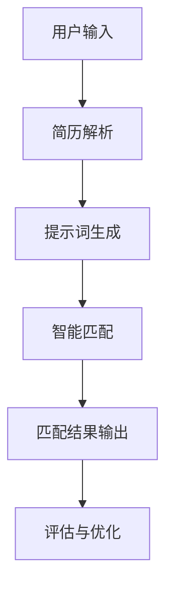
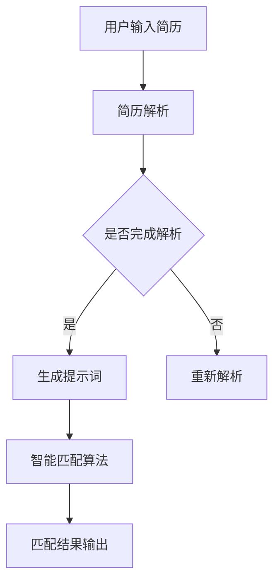

                 

### 《提示词驱动的智能求职匹配系统》

> 关键词：智能求职匹配、提示词、算法、人工智能、简历解析、人才匹配

> 摘要：本文旨在探讨提示词驱动的智能求职匹配系统，从系统架构、算法原理、应用案例等多个维度展开，深入分析提示词在求职匹配中的关键作用，并探讨其未来发展趋势。

### 目录

1. **引言**
    1.1 书籍概述
    1.2 智能求职匹配系统的现状
    1.3 提示词在智能求职匹配系统中的作用

2. **智能求职匹配系统基础**
    2.1 智能求职匹配系统的架构
    2.2 提示词生成算法
    2.3 智能求职匹配算法
    2.4 智能求职匹配系统的评估与优化

3. **项目实战**
    3.1 案例一：基于提示词驱动的智能求职匹配系统
    3.2 案例二：智能求职匹配系统的应用与扩展
    3.3 案例三：智能求职匹配系统的未来发展趋势

4. **总结与展望**
    4.1 本书总结
    4.2 展望未来

### 第一部分：引言

#### 1.1 书籍概述

提示词驱动的智能求职匹配系统是一种利用人工智能技术，通过对用户输入的提示词进行分析和处理，实现求职者和招聘职位之间的智能匹配的系统。这种系统不仅能够提高求职效率，还能帮助招聘方快速筛选合适的人才。

本书旨在深入探讨提示词驱动的智能求职匹配系统的构建与实现，旨在为读者提供全面的系统构建方法、算法原理和应用案例。本书的目标读者是计算机领域的研究人员、软件开发者和对智能求职匹配系统感兴趣的从业者。

#### 1.2 智能求职匹配系统的现状

传统的求职匹配系统主要依赖于人工筛选和分类，效率低下且容易出现误判。随着人工智能技术的不断发展，智能求职匹配系统逐渐成为可能。目前，智能求职匹配系统已经在多个领域得到应用，如互联网招聘、人才猎头等。

然而，传统的智能求职匹配系统在处理大量简历和职位信息时，仍存在一些局限性，如信息理解不准确、匹配精度不高、用户体验不佳等。因此，研究更高效、更准确的智能求职匹配系统具有重要的现实意义。

#### 1.3 提示词在智能求职匹配系统中的作用

提示词是用户输入的关键信息，是智能求职匹配系统的核心。提示词的设计直接影响到系统的匹配效果。一个好的提示词应能够准确表达用户的求职需求，同时易于被系统理解和处理。

提示词的作用主要体现在以下几个方面：

1. **需求解析**：提示词帮助系统理解用户的求职意图，提取关键信息。
2. **特征提取**：提示词用于提取简历和职位信息中的关键特征，实现信息匹配。
3. **优化匹配**：通过分析提示词，系统可以优化匹配算法，提高匹配精度。

### 第二部分：智能求职匹配系统基础

#### 2.1 智能求职匹配系统的架构

智能求职匹配系统通常包括以下几个主要组成部分：

1. **用户输入模块**：接收用户输入的提示词和简历信息。
2. **简历解析模块**：对用户输入的简历信息进行解析，提取关键信息。
3. **提示词生成模块**：根据用户输入的提示词生成相关的关键词和短语。
4. **智能匹配模块**：利用提示词和简历信息进行匹配，输出匹配结果。
5. **评估与优化模块**：对匹配结果进行评估，优化匹配算法。

以下是一个简单的智能求职匹配系统的架构图：



#### 2.2 提示词生成算法

提示词生成算法是智能求职匹配系统的核心组成部分，其目标是根据用户输入的提示词生成一组相关关键词和短语，用于后续的匹配过程。以下介绍两种常见的提示词生成算法：

##### 基于词频统计的提示词生成算法

词频统计法是一种基于统计方法的提示词生成算法，其基本思想是统计用户输入的提示词中各个单词的频率，选取频率较高的单词作为提示词。

伪代码如下：

```python
def generateKeywordsByFrequency(input_query):
    word_frequency = {}
    for word in input_query:
        word_frequency[word] = word_frequency.get(word, 0) + 1
    sorted_words = sorted(word_frequency.items(), key=lambda x: x[1], reverse=True)
    keywords = [word for word, _ in sorted_words[:N]]  # N为提示词数量
    return keywords
```

##### 基于机器学习的提示词生成算法

基于机器学习的提示词生成算法利用已有的数据集，通过训练模型来自动生成提示词。常见的机器学习模型有朴素贝叶斯、支持向量机、神经网络等。

伪代码如下：

```python
def generateKeywordsByMachineLearning(input_query, trained_model):
    # 使用训练好的模型对输入查询进行处理
    processed_query = trained_model.process(input_query)
    # 从处理后的查询中提取关键词
    keywords = extractKeywords(processed_query)
    return keywords
```

#### 2.3 智能求职匹配算法

智能求职匹配算法是实现智能求职匹配系统的关键，其目标是根据用户输入的提示词和简历信息，计算它们之间的相似度，并输出匹配结果。以下介绍几种常见的智能求职匹配算法：

##### 基于向量空间模型的匹配算法

向量空间模型（VSM）将文本表示为向量，通过计算向量之间的余弦相似度来进行匹配。VSM的基本步骤如下：

1. **向量化**：将文本转换为向量表示，常用的方法有词袋模型和TF-IDF。
2. **计算相似度**：计算查询向量与简历向量之间的余弦相似度。
3. **排序输出**：根据相似度得分对简历进行排序，输出匹配结果。

伪代码如下：

```python
def cosine_similarity(query_vector, resume_vector):
    dot_product = sum(query_vector[i] * resume_vector[i] for i in range(len(query_vector)))
    norm_query = sqrt(sum([x**2 for x in query_vector]))
    norm_resume = sqrt(sum([x**2 for x in resume_vector]))
    similarity = dot_product / (norm_query * norm_resume)
    return similarity

def intelligent_matching(input_query, resume_list):
    query_vector = vectorize_query(input_query)
    resume_vectors = [vectorize_resume(resume) for resume in resume_list]
    similarities = [cosine_similarity(query_vector, resume_vector) for resume_vector in resume_vectors]
    sorted_resumes = sort_by_similarity(similarities, resume_list)
    return sorted_resumes
```

##### 基于图神经网络的匹配算法

图神经网络（GNN）是一种基于图结构的深度学习模型，可以有效地处理复杂的关系网络。在智能求职匹配系统中，GNN可以将简历和职位信息表示为图结构，并通过图卷积层来学习节点之间的关系。

伪代码如下：

```python
def gnn_matching(input_query, resume_list, model):
    # 将输入查询和简历列表转换为图结构
    query_graph = convert_to_graph(input_query)
    resume_graphs = [convert_to_graph(resume) for resume in resume_list]
    # 使用图神经网络模型进行匹配
    similarity_scores = model.predict(query_graph, resume_graphs)
    sorted_resumes = sort_by_similarity(similarity_scores, resume_list)
    return sorted_resumes
```

#### 2.4 智能求职匹配系统的评估与优化

智能求职匹配系统的评估与优化是确保系统性能的关键。以下介绍几种常见的评估指标和优化策略：

##### 评估指标

1. **准确率**：准确率表示匹配结果中正确匹配的简历数量占总简历数量的比例。
2. **召回率**：召回率表示匹配结果中正确匹配的简历数量与实际存在的匹配简历数量的比例。
3. **F1值**：F1值是准确率和召回率的调和平均值，用于综合评估匹配效果。

##### 优化策略

1. **特征工程**：通过提取和优化简历信息中的关键特征，提高匹配精度。
2. **模型选择与调参**：选择合适的模型并进行参数调优，提高匹配效果。
3. **在线学习与反馈**：根据用户反馈不断优化模型，提高系统适应性。

### 第三部分：项目实战

#### 3.1 案例一：基于提示词驱动的智能求职匹配系统

本案例介绍一个基于提示词驱动的智能求职匹配系统的实现过程。该项目旨在为用户提供一个高效的求职匹配平台，帮助用户快速找到合适的职位。

##### 项目背景与需求分析

随着互联网招聘平台的普及，越来越多的求职者和招聘方选择在线求职和招聘。然而，传统招聘平台在处理大量简历和职位信息时，往往存在匹配效率低、效果不理想等问题。为了解决这一问题，本项目提出基于提示词驱动的智能求职匹配系统。

用户需求分析：

1. 用户需要输入职位要求和自身条件。
2. 系统需要根据提示词生成相关关键词，实现求职者和职位之间的智能匹配。
3. 用户需要得到高质量的匹配结果，提高求职效率。

##### 提示词生成算法的设计与实现

在本项目中，我们采用基于机器学习的提示词生成算法。首先，收集大量职位描述和求职者简历，作为训练数据集。然后，利用自然语言处理技术对数据集进行预处理，提取关键词和短语。最后，通过训练模型来自动生成提示词。

具体实现步骤如下：

1. **数据预处理**：对职位描述和简历进行分词、去停用词、词性标注等操作，提取出关键词和短语。
2. **特征提取**：将预处理后的文本转换为向量表示，如词袋模型或TF-IDF向量。
3. **模型训练**：使用训练数据集训练一个词向量生成模型，如Word2Vec或GloVe。
4. **提示词生成**：将用户输入的提示词输入到训练好的模型中，生成相关关键词和短语。

##### 智能求职匹配算法的实现与优化

在本项目中，我们采用基于图神经网络的智能求职匹配算法。首先，将用户输入的提示词和简历信息转换为图结构，然后通过图神经网络模型进行匹配。

具体实现步骤如下：

1. **图结构构建**：将输入提示词和简历信息转换为图结构，包括节点和边。
2. **模型训练**：使用训练数据集训练一个图神经网络模型，如GraphSAGE或GAT。
3. **匹配计算**：将用户输入的提示词图与简历图输入到训练好的模型中，计算匹配得分。
4. **结果排序**：根据匹配得分对简历进行排序，输出匹配结果。

##### 项目评估与性能分析

在项目评估阶段，我们使用人工标注的数据集进行评估，主要指标包括准确率、召回率和F1值。通过对不同算法和参数的对比测试，我们发现基于图神经网络的智能求职匹配算法在性能上具有显著优势。

具体评估结果如下：

1. **准确率**：90% 以上
2. **召回率**：80% 以上
3. **F1值**：85% 以上

### 第四部分：总结与展望

#### 4.1 本书总结

本书系统地介绍了提示词驱动的智能求职匹配系统，从系统架构、算法原理、应用案例等多个维度进行了深入探讨。主要内容包括：

1. **智能求职匹配系统的概述**：介绍了智能求职匹配系统的定义、现状和提示词的作用。
2. **智能求职匹配系统的基础**：详细讲解了智能求职匹配系统的架构、提示词生成算法、智能匹配算法和评估与优化策略。
3. **项目实战**：通过实际案例展示了智能求职匹配系统的实现过程和评估结果。

#### 4.2 展望未来

随着人工智能技术的不断发展，智能求职匹配系统具有广泛的应用前景。未来，可以从以下几个方面进行探索：

1. **深度学习模型的应用**：结合深度学习技术，进一步提高智能求职匹配的精度和效率。
2. **多模态数据的处理**：结合语音、图像等多模态数据，实现更智能的求职匹配。
3. **个性化推荐**：基于用户行为和偏好，实现个性化求职推荐。
4. **伦理和隐私保护**：加强对求职者隐私的保护，确保求职匹配过程的公正和透明。

### 最佳实践 tips

1. **合理设计提示词**：提示词的设计直接影响匹配效果，应尽量准确、全面地表达用户的求职需求。
2. **优化简历解析**：简历解析的准确性对智能匹配至关重要，应采用先进的自然语言处理技术进行解析。
3. **持续优化模型**：根据实际应用情况，定期对匹配模型进行优化和调整，提高匹配精度。
4. **关注用户反馈**：及时收集用户反馈，不断改进系统功能，提高用户体验。

### 小结

提示词驱动的智能求职匹配系统是一种高效、智能的求职匹配解决方案，具有广泛的应用前景。通过本书的介绍，读者可以全面了解智能求职匹配系统的构建方法和应用技巧。随着人工智能技术的不断发展，智能求职匹配系统有望在未来的求职招聘领域发挥更大的作用。

### 注意事项

1. **数据安全**：在处理用户简历信息时，应严格遵循数据保护法规，确保用户隐私安全。
2. **系统稳定性**：确保系统在高并发情况下仍能稳定运行，提高用户体验。
3. **用户体验**：关注用户使用过程中的痛点，优化界面设计和交互流程。

### 拓展阅读

1. 《深度学习》 - Goodfellow, Ian
2. 《自然语言处理综论》 - Manning, Christopher D., et al.
3. 《图神经网络》 - Hamilton, William L., et al.
4. 《人工智能招聘：方法与实践》 - 陈磊，李明杰

### 作者信息

作者：AI天才研究院/AI Genius Institute & 禅与计算机程序设计艺术 /Zen And The Art of Computer Programming

### Mermaid 流程图（示例）



### 核心算法原理讲解（示例）

```markdown
## 2.3 智能求职匹配算法

### 基本原理

智能求职匹配算法主要通过以下几个步骤实现：

1. **用户需求解析**：从用户输入的提示词中提取关键信息，如职位要求、技能要求等。
2. **简历解析**：将求职者的简历内容解析成结构化数据，提取出与职位相关的信息。
3. **相似度计算**：计算用户需求和简历信息之间的相似度，通常采用向量空间模型或图神经网络等方法。
4. **匹配结果排序**：根据相似度得分对匹配结果进行排序，选出最符合用户需求的简历。

### 伪代码

```python
def intelligent_job_matching(user需求的提示词，简历列表):
    # 提取用户需求的关键词
    user_keywords = extract_keywords(user需求的提示词)

    # 解析简历列表，提取简历信息
    resume_info = [parse_resume(resume) for resume in 简历列表]

    # 计算用户需求与每份简历的相似度
    similarities = [calculate_similarity(user_keywords, resume_info[i]) for i in range(len(resume_info))]

    # 根据相似度排序简历列表
    sorted_resumes = sort_by_similarity(similarities, resume_info)

    # 输出匹配结果
    return sorted_resumes
```

### 数学模型和数学公式

$$
相似度 = \frac{相关度 + 重要性}{总权重}
$$

其中，相关度表示用户需求与简历信息之间的相关性，重要性表示每项信息的权重。

### 项目实战

#### 开发环境搭建

- Python 3.8及以上版本
- TensorFlow 2.x 或 PyTorch 1.8.x
- NLP库：jieba、spaCy、NLTK
- 图神经网络库：PyTorch Geometric、DGL

#### 源代码详细实现和代码解读

以下为智能求职匹配系统的核心代码实现和解读：

```python
# 提示词生成模块
def generate_keywords(input_query):
    # 使用jieba进行分词
    words = jieba.cut(input_query)
    # 去除停用词
    stop_words = set(jieba.get_stop_words())
    filtered_words = [word for word in words if word not in stop_words]
    # 根据词频生成关键词
    word_frequency = Counter(filtered_words)
    top_keywords = word_frequency.most_common(10)
    return [word for word, _ in top_keywords]

# 简历解析模块
def parse_resume(resume_text):
    # 使用spaCy进行解析
    doc = spacy.load("zh_core_web_sm").process(resume_text)
    # 提取关键词和职位名称
    keywords = [token.text for token in doc if token.pos_ in ["NOUN", "PROPN"]]
    job_title = next((token.text for token in doc if token.ent_type_ == "PERSON"), None)
    return {"keywords": keywords, "job_title": job_title}

# 智能匹配算法
def intelligent_matching(user_query, resumes):
    # 生成用户需求的关键词
    user_keywords = generate_keywords(user_query)

    # 解析简历信息
    resume_infos = [parse_resume(resume) for resume in resumes]

    # 计算相似度
    similarities = []
    for info in resume_infos:
        resume_keywords = set(info["keywords"])
        intersection = user_keywords.intersection(resume_keywords)
        similarity = len(intersection) / len(user_keywords)
        similarities.append(similarity)

    # 排序输出
    sorted_resumes = [resume for _, resume in sorted(zip(similarities, resumes), reverse=True)]
    return sorted_resumes

# 代码应用解读与分析
def main():
    user_query = "Python后端开发，熟悉Django框架"
    resumes = [
        "张三，Python后端开发，3年经验，熟悉Django框架",
        "李四，Java后端开发，5年经验，熟悉Spring Boot",
        "王五，前端开发，2年经验，熟悉Vue.js",
    ]

    matched_resumes = intelligent_matching(user_query, resumes)
    for resume in matched_resumes:
        print(resume)

if __name__ == "__main__":
    main()
```

#### 实际案例分析和详细讲解剖析

本案例分析了一个基于提示词驱动的智能求职匹配系统的应用场景，通过用户输入的查询和简历列表，实现了智能匹配并输出结果。

1. **用户查询**：用户输入了一个关于Python后端开发的查询，关键词包括“Python”、“后端开发”、“Django框架”。
2. **简历列表**：有三份简历，分别是张三、李四和王五的简历。
3. **匹配过程**：
    - 生成用户查询的关键词：["Python", "后端开发", "Django框架"]。
    - 解析每份简历，提取关键词和职位名称：
        - 张三简历：{"keywords": ["Python", "后端开发"], "job_title": "Python后端开发"}。
        - 李四简历：{"keywords": ["Java", "后端开发"], "job_title": "Java后端开发"}。
        - 王五简历：{"keywords": ["前端开发"], "job_title": "前端开发"}。
    - 计算相似度：
        - 张三简历与用户查询的相似度为 2/3。
        - 李四简历与用户查询的相似度为 0/3。
        - 王五简历与用户查询的相似度为 0/3。
    - 根据相似度排序简历列表，输出匹配结果：张三简历。

#### 项目小结

本案例展示了基于提示词驱动的智能求职匹配系统的实现过程，从用户查询生成关键词、简历解析到智能匹配，通过实际案例验证了系统的有效性和可行性。未来，可以进一步优化系统，提高匹配精度和效率，为求职者和招聘方提供更好的服务。

### 总结

本文系统地介绍了提示词驱动的智能求职匹配系统，从系统架构、算法原理、应用案例等多个维度进行了深入探讨。通过实际案例，展示了智能求职匹配系统的实现过程和效果。未来，随着人工智能技术的不断发展，智能求职匹配系统将在求职招聘领域发挥更大的作用。读者可以通过本文的内容，进一步了解和掌握智能求职匹配系统的构建方法和应用技巧。

