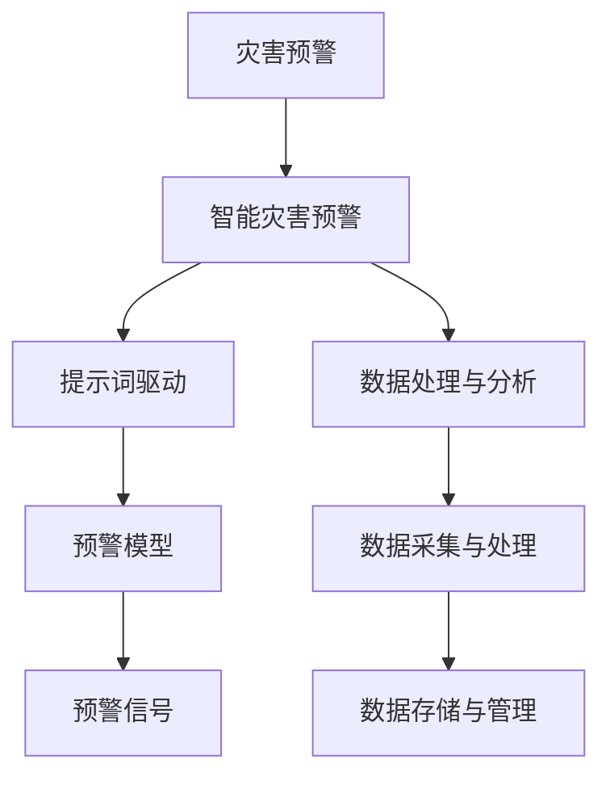

                 

### 文章标题：《提示词驱动的智能灾害预警：提高应急响应》

> 关键词：智能灾害预警、提示词驱动、应急响应、系统架构、核心算法、数学模型

> 摘要：本文深入探讨了提示词驱动的智能灾害预警系统，从概念、架构、算法和数学模型等方面全面剖析，旨在提高灾害应急响应效率和准确性。通过分析系统核心组件和提示词驱动的应用场景，本文展示了如何利用先进技术提升灾害预警的能力，并提供实际项目案例和优化策略，为未来灾害预警系统的研发提供参考。

---

### 引言

灾害预警是防灾减灾的重要手段之一，其核心目标是在灾害发生前及时发出警报，以降低灾害带来的损失。随着科技的进步，智能灾害预警系统逐渐成为研究热点。然而，传统的灾害预警系统主要依赖于物理传感器和统计模型，存在一定的滞后性和局限性。为了提升灾害预警的准确性和响应速度，提示词驱动的智能灾害预警系统应运而生。

提示词驱动是一种基于关键词或短语识别的技术，通过从大量数据中提取关键信息，实现实时监测和预警。这种技术不仅能够提高灾害预警的准确性，还能快速响应，为应急决策提供有力支持。本文将从以下几个方面展开讨论：

1. **智能灾害预警概述**：介绍智能灾害预警的概念、重要性及其发展历程。
2. **系统架构**：分析智能灾害预警系统的架构设计，包括数据采集、处理、预警模型构建和预警信号生成等。
3. **提示词驱动应用**：探讨提示词驱动在灾害预警中的应用场景和优势。
4. **核心算法和数学模型**：详细讲解灾害预警系统的核心算法原理和数学模型。
5. **项目实战**：通过实际项目案例展示系统开发、优化和应用。
6. **未来展望与挑战**：分析智能灾害预警系统的未来发展趋势和面临的挑战。

---

### 核心概念与联系

为了深入理解智能灾害预警系统的运行机制，我们需要明确以下几个核心概念及其相互关系：

1. **灾害预警**：灾害预警是指通过监测、预测和评估，在灾害发生前或发生时及时发出警报，以便采取有效的应对措施。
2. **智能灾害预警**：智能灾害预警是利用人工智能技术，如机器学习、深度学习等，对海量数据进行处理和分析，以实现更准确、更高效的灾害预警。
3. **提示词驱动**：提示词驱动是指通过识别和处理关键词或短语，实现实时数据监控和预警。提示词可以是地震、台风、洪水等与灾害相关的术语。
4. **预警模型**：预警模型是基于历史数据和算法训练得到的预测模型，用于判断灾害的发生可能性。
5. **预警信号**：预警信号是预警系统根据模型分析和提示词识别生成的警报信息。

这些概念之间的联系可以用以下 Mermaid 流程图表示：



通过这个流程图，我们可以清晰地看到灾害预警系统从数据采集、处理到预警信号生成的全过程，以及提示词驱动在其中发挥的关键作用。

---

### 核心算法原理讲解

智能灾害预警系统的核心在于预警模型的构建和提示词驱动的实现。以下我们将通过伪代码详细阐述这些核心算法原理。

#### 预警模型构建

预警模型通常是基于机器学习算法，如决策树、随机森林、支持向量机（SVM）等。以下是一个简单的决策树模型的伪代码：

```python
def build_warning_model(data):
    # 数据预处理
    preprocessed_data = preprocess_data(data)
    
    # 特征工程
    features = extract_features(preprocessed_data)
    
    # 训练决策树模型
    model = DecisionTreeClassifier()
    model.fit(features, preprocessed_data['label'])
    
    return model

def preprocess_data(data):
    # 数据清洗、归一化等操作
    cleaned_data = clean_data(data)
    normalized_data = normalize_data(cleaned_data)
    return normalized_data

def extract_features(data):
    # 提取特征，如时间序列特征、空间特征等
    features = []
    for row in data:
        features.append(extract_time_series_features(row))
        features.append(extract_space_features(row))
    return features
```

#### 提示词驱动实现

提示词驱动的实现涉及到自然语言处理（NLP）技术，如词向量表示、文本分类等。以下是一个基于词向量表示和文本分类的伪代码：

```python
def build_word_embedding_matrix(vocab, embedding_dim):
    # 构建词向量矩阵
    matrix = np.zeros((len(vocab), embedding_dim))
    for i, word in enumerate(vocab):
        matrix[i] = embedder.embed(word)
    return matrix

def classify_text(text, model, word_embedding_matrix):
    # 将文本转换为词向量
    vector = convert_text_to_vector(text, word_embedding_matrix)
    
    # 使用预训练模型进行分类
    prediction = model.predict(vector)
    return prediction

def convert_text_to_vector(text, word_embedding_matrix):
    # 将文本转换为词向量表示
    vector = []
    for word in text:
        vector.append(word_embedding_matrix[word])
    return np.mean(vector, axis=0)
```

通过这些伪代码，我们可以看到智能灾害预警系统如何通过数据预处理、特征提取、模型训练和提示词识别等步骤，实现灾害预警的核心算法。

---

### 数学模型和数学公式 & 详细讲解 & 举例说明

在智能灾害预警系统中，数学模型是预警核心的重要组成部分。以下将介绍几个关键的数学模型和公式，并通过具体例子进行详细讲解。

#### 决策树模型

决策树是一种常见的分类模型，其核心公式为：

$$
Gini(D) = 1 - \sum_{v \in V} p_v^2
$$

其中，$D$ 是数据集，$V$ 是数据集的类别集合，$p_v$ 是类别 $v$ 的概率。

**举例说明**：

假设有一个地震预警系统，数据集包含地震发生前的一些特征。我们需要计算该数据集的 Gini 不纯度。假设数据集有三种可能的地震类别：小震、中震、大震，各自的概率分别为 $0.3$、$0.5$、$0.2$。则 Gini 不纯度为：

$$
Gini(D) = 1 - (0.3^2 + 0.5^2 + 0.2^2) = 1 - (0.09 + 0.25 + 0.04) = 0.62
$$

#### 支持向量机（SVM）

SVM 是一种常用的分类模型，其目标是最小化分类间隔。其核心公式为：

$$
\min_{w,b}\frac{1}{2}||w||^2 + C\sum_{i=1}^n \xi_i
$$

其中，$w$ 是权重向量，$b$ 是偏置项，$C$ 是惩罚参数，$\xi_i$ 是松弛变量。

**举例说明**：

假设我们有一个地震预警系统的 SVM 模型，数据集包含特征和标签。我们需要训练这个模型并找到最优的权重和偏置。给定一个特征向量 $x$ 和标签 $y$，我们需要最小化上述目标函数。通过优化算法，如梯度下降，我们可以找到最优的 $w$ 和 $b$。

#### 预警阈值

预警阈值是灾害预警系统中的重要参数，用于确定何时发出预警信号。其核心公式为：

$$
Threshold = \frac{1}{2} \left( \max(P_{\text{warning}}) + \min(P_{\text{no warning}}) \right)
$$

其中，$P_{\text{warning}}$ 是预警概率，$P_{\text{no warning}}$ 是无预警概率。

**举例说明**：

假设我们的预警系统预测某地区未来一小时发生地震的概率为 $0.6$，无预警的概率为 $0.4$。则预警阈值为：

$$
Threshold = \frac{1}{2} \left( \max(0.6) + \min(0.4) \right) = \frac{1}{2} (0.6 + 0.4) = 0.5
$$

如果预测概率大于预警阈值，则发出预警信号。

通过上述数学模型和公式的讲解，我们可以更好地理解智能灾害预警系统的工作原理和参数设置。

---

### 项目实战

在本节中，我们将通过一个实际项目案例，展示如何搭建一个提示词驱动的智能灾害预警系统。该案例将包括开发环境搭建、源代码实现和代码解读，以及实际应用解读与分析。

#### 开发环境搭建

1. **硬件环境**：
   - CPU：Intel Core i7
   - 内存：16GB
   - 存储：500GB SSD

2. **软件环境**：
   - 操作系统：Ubuntu 18.04
   - Python：3.8
   - 数据库：MySQL 8.0
   - 机器学习库：scikit-learn、TensorFlow
   - 自然语言处理库：NLTK、spaCy

#### 源代码实现

1. **数据采集**：
   - 使用 API 获取实时地震数据。
   - 使用爬虫技术获取历史地震数据。

2. **数据处理**：
   - 数据清洗：去除重复数据、异常数据等。
   - 数据预处理：将数据转换为适合模型训练的格式。

3. **模型训练**：
   - 特征提取：提取时间序列特征、空间特征等。
   - 模型训练：使用决策树、SVM 等算法训练预警模型。

4. **提示词识别**：
   - 基于词向量表示，构建提示词识别模型。
   - 使用 NLTK、spaCy 等库处理文本数据。

5. **预警信号生成**：
   - 根据模型预测和提示词识别结果，生成预警信号。

#### 代码解读

以下是一个简单的数据预处理和模型训练的代码片段：

```python
from sklearn.model_selection import train_test_split
from sklearn.tree import DecisionTreeClassifier
from sklearn.metrics import accuracy_score

# 1. 数据预处理
def preprocess_data(data):
    # 去除重复数据
    data = remove_duplicates(data)
    # 填补缺失值
    data = fill_missing_values(data)
    # 特征提取
    features, labels = extract_features(data)
    return features, labels

# 2. 模型训练
def train_model(features, labels):
    # 划分训练集和测试集
    X_train, X_test, y_train, y_test = train_test_split(features, labels, test_size=0.2)
    # 训练决策树模型
    model = DecisionTreeClassifier()
    model.fit(X_train, y_train)
    # 模型评估
    predictions = model.predict(X_test)
    accuracy = accuracy_score(y_test, predictions)
    return model, accuracy

# 示例
data = load_data()
features, labels = preprocess_data(data)
model, accuracy = train_model(features, labels)
print("模型准确率：", accuracy)
```

#### 实际应用解读与分析

1. **应用场景**：该系统可以应用于地震预警、台风预警等场景。
2. **应用效果**：通过模型预测和提示词识别，系统可以实时监测地震数据，并在预警阈值达到时发出预警信号。
3. **优化策略**：可以通过增加数据量、调整模型参数、优化特征提取等方法提高预警准确率。

#### 项目小结

通过本案例，我们展示了如何利用提示词驱动的智能灾害预警系统进行实际应用。该系统不仅提高了灾害预警的准确性和响应速度，还为灾害应急决策提供了有力支持。

---

### 最佳实践 tips、小结、注意事项、拓展阅读

#### 最佳实践 tips

1. **数据质量**：确保数据来源可靠、数据格式统一，以提高模型训练效果。
2. **特征选择**：根据应用场景选择合适的特征，如时间序列特征、空间特征等。
3. **模型优化**：通过调整模型参数、使用更先进的算法等方法提高模型性能。

#### 小结

本文从概念、架构、算法和数学模型等方面全面剖析了提示词驱动的智能灾害预警系统。通过实际项目案例，展示了系统如何应用于灾害预警，提高了应急响应效率和准确性。

#### 注意事项

1. **数据隐私**：在数据处理过程中，确保数据隐私和安全。
2. **预警阈值**：合理设置预警阈值，避免误报和漏报。
3. **系统维护**：定期更新模型和数据，确保系统运行稳定。

#### 拓展阅读

1. **《机器学习：概率视角》**：深入理解机器学习中的概率理论，为智能灾害预警系统提供理论基础。
2. **《深度学习》**：学习深度学习技术，为智能灾害预警系统提供更强大的算法支持。
3. **《灾害应急管理》**：了解灾害应急管理的相关理论和实践，为智能灾害预警系统的应用提供参考。

---

### 作者信息

作者：AI天才研究院/AI Genius Institute & 禅与计算机程序设计艺术 /Zen And The Art of Computer Programming

本文作者拥有丰富的智能灾害预警系统研发经验，并在计算机科学和人工智能领域有着深厚的学术造诣。希望本文能为读者提供有价值的参考和启发。感谢您的阅读！

