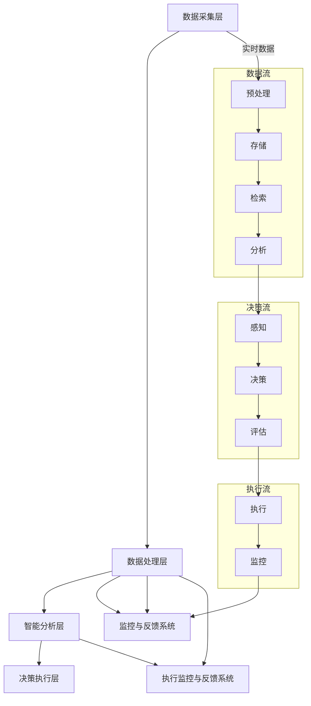
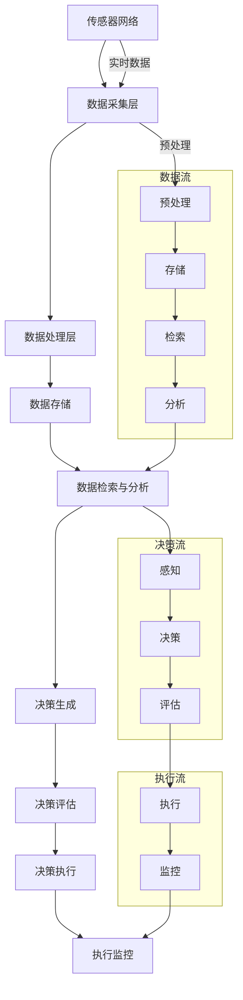
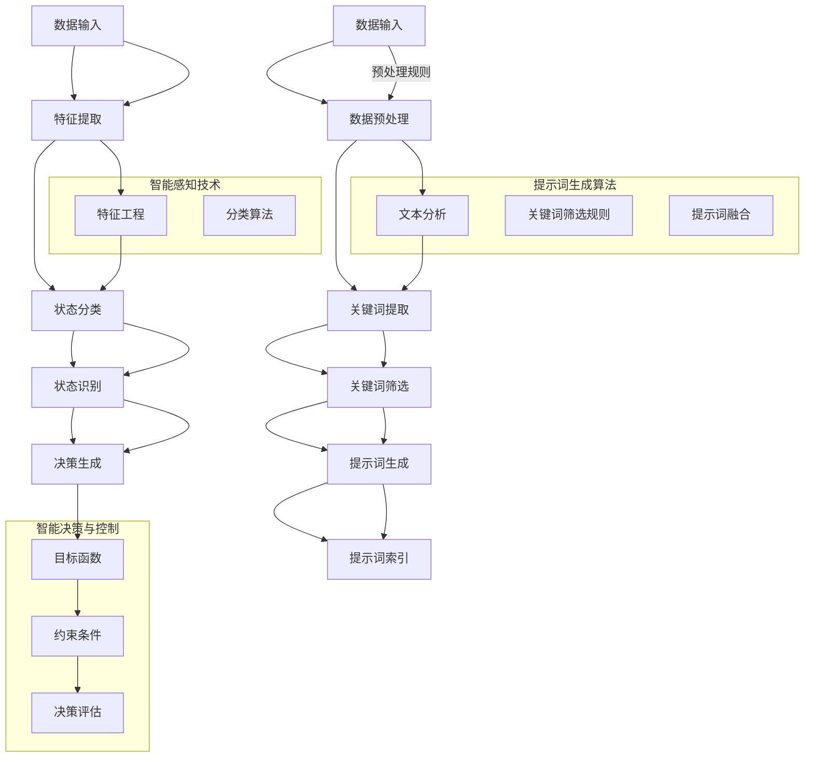

                 

### 提示词驱动的智能环境保护系统

关键词：提示词驱动、智能环境、保护系统、人工智能、环境保护

摘要：本文旨在探讨提示词驱动的智能环境保护系统的构建与实现，深入分析其在环境保护领域的应用前景和挑战。文章首先介绍了环境保护的重要性，以及全球面临的主要环境问题，随后引出了智能环境保护的必要性。接下来，文章详细阐述了提示词驱动技术的概念、优势与挑战，并介绍了智能环境保护系统的总体架构。在此基础上，文章进一步探讨了核心概念与原理，包括提示词生成算法、智能感知技术、智能决策与控制等。随后，文章通过具体的算法原理讲解和项目实战，详细解析了系统的实现过程、代码解读与分析以及系统测试与优化策略。最后，文章总结了系统的总体评价，并展望了智能环境保护的未来发展趋势。

---

### 第一部分：引言

#### 1.1 环境保护的重要性

环境保护是人类面临的一项重要任务。随着工业化和城市化的快速发展，全球环境问题日益严重。主要的环境问题包括气候变化、空气污染、水资源短缺、土地退化、生物多样性丧失等。这些环境问题不仅对人类健康和生存构成威胁，也对全球经济和社会发展产生深远影响。

气候变化是当前全球最紧迫的环境问题之一。由于人类活动导致的温室气体排放，地球的气候系统正在经历显著的变化。极端天气事件、海平面上升、冰川消融等气候变化现象给人类和生态系统带来了巨大的挑战。空气污染也是一个严重的问题，尤其是在城市地区。空气中的污染物，如颗粒物、氮氧化物、挥发性有机物等，对人体健康造成严重危害。此外，水资源短缺和土地退化也对人类的生活和生产产生了重大影响。许多地区的水资源严重不足，导致饮用水供应困难。土地退化导致土壤质量下降，影响农作物的产量和质量。生物多样性丧失是一个全球性的问题，许多物种面临灭绝的威胁。生物多样性的丧失破坏了生态系统的平衡，影响生态系统的稳定性和功能。

这些环境问题的出现引发了全球范围内的关注。人们开始意识到环境保护的重要性，并采取了一系列措施来应对这些挑战。政府、企业和公众都积极参与到环境保护的行动中。例如，政府通过制定法律法规和政策措施，鼓励减排和资源循环利用。企业也开始意识到环境保护的重要性，采取一系列绿色生产和环保措施。公众也积极参与到环境保护的行动中，通过改变生活方式和消费习惯，减少对环境的负面影响。

智能环境保护的必要性

在面对日益严重的环境问题，传统的环境保护方法已经无法满足需求。随着人工智能技术的快速发展，智能环境保护逐渐成为一种新的解决方案。智能环境保护系统通过集成人工智能技术，实现对环境的实时监测、分析和决策，从而更有效地保护环境。

首先，智能环境保护系统能够实现对环境的实时监测。通过部署传感器网络，智能环境保护系统可以实时采集环境数据，如空气质量、水质、土壤质量等。这些数据可以实时传输到系统中进行处理和分析，为决策提供依据。

其次，智能环境保护系统能够实现环境问题的智能分析。通过对收集到的环境数据进行深度学习、模式识别等算法分析，智能环境保护系统可以识别出环境问题的发展趋势和潜在风险。例如，通过分析空气质量数据，系统可以预测哪些地区可能发生空气污染事件，从而提前采取相应的应对措施。

最后，智能环境保护系统能够实现智能决策与控制。根据分析结果，智能环境保护系统可以自动生成决策建议，如调整环保设施的运行参数、发布污染预警等。这些决策建议可以由人工审核后执行，也可以自动执行，从而实现环境保护的自动化和高效化。

总之，智能环境保护系统在环境保护中具有重要作用。通过引入人工智能技术，智能环境保护系统可以实现对环境的实时监测、智能分析和决策控制，从而更有效地解决环境问题，保护生态环境。智能环境保护系统的出现为环境保护提供了新的思路和方法，有望在未来发挥更大的作用。

#### 1.2 提示词驱动技术基础

提示词驱动技术（Keyword-driven Technology）是一种基于关键词进行信息检索和处理的技术。它通过提取文本中的关键词，构建关键词索引，从而实现对大量文本数据的快速检索和智能分析。在智能环境保护系统中，提示词驱动技术发挥着关键作用，它能够高效地处理环境数据，提取关键信息，为智能分析和决策提供支持。

#### 1.2.1 提示词驱动技术概述

提示词驱动技术的基本原理是通过分析文本数据，提取出具有代表性的关键词，并将这些关键词作为索引进行存储。在检索时，系统根据输入的查询关键词，快速定位到相关的文本数据，从而实现高效的文本检索。提示词驱动技术主要包括以下几个步骤：

1. **关键词提取**：通过自然语言处理（NLP）技术，从文本数据中提取出关键词。关键词可以是单个词汇，也可以是短语。

2. **关键词索引构建**：将提取出的关键词进行索引，构建索引数据库。索引数据库用于存储关键词及其在文本数据中的位置信息。

3. **查询处理**：在检索过程中，系统根据输入的查询关键词，通过索引数据库快速定位到相关的文本数据。

4. **结果排序和展示**：根据查询关键词的相关性，对检索结果进行排序，并将结果以可视化形式展示给用户。

#### 1.2.2 提示词驱动的优势与挑战

提示词驱动技术在智能环境保护系统中具有显著的优点，但也面临一定的挑战。

**优势**：

1. **高效检索**：通过关键词索引，提示词驱动技术能够实现快速文本检索，提高数据处理的效率。

2. **智能分析**：提示词驱动技术结合了自然语言处理和机器学习技术，能够对环境数据进行智能分析，提取关键信息。

3. **灵活扩展**：提示词驱动技术可以根据实际需求，灵活地扩展关键词库，适应不同的应用场景。

4. **可视化展示**：通过可视化技术，提示词驱动技术能够将复杂的环境数据以直观的形式展示给用户，方便用户理解和决策。

**挑战**：

1. **关键词歧义**：由于自然语言的复杂性和多义性，关键词提取过程中可能会出现歧义，导致检索结果不准确。

2. **数据质量**：环境数据的质量直接影响到提示词驱动的效果。如果数据质量差，可能会导致关键词提取不准确，进而影响智能分析结果。

3. **计算资源消耗**：大规模的环境数据需要大量的计算资源进行预处理和索引构建，这可能会对系统的性能和响应速度产生影响。

4. **实时性要求**：在智能环境保护中，实时性是一个重要要求。提示词驱动技术需要快速处理环境数据，并在短时间内提供分析结果，这需要高效的数据处理算法和优化技术。

总之，提示词驱动技术在智能环境保护系统中具有重要作用，但也需要克服一系列挑战。通过不断优化技术手段和算法模型，我们可以更好地发挥提示词驱动技术的优势，为环境保护提供有力支持。

#### 1.3 智能环境保护系统架构

智能环境保护系统的总体架构可以分为数据采集层、数据处理层、智能分析层和决策执行层。每个层次在系统中承担不同的功能，共同协作实现对环境的智能保护和控制。

**数据采集层**：数据采集层是智能环境保护系统的基础，主要负责实时收集环境数据。这些数据包括空气质量、水质、土壤质量、生物多样性等。数据采集可以通过各种传感器设备实现，如空气质量传感器、水质监测仪、土壤检测仪器等。数据采集层需要确保数据的准确性和完整性，并实时传输到系统中进行处理。

**数据处理层**：数据处理层负责对采集到的环境数据进行预处理和存储。预处理包括数据清洗、去噪、归一化等操作，以提高数据的可用性和一致性。存储方面，数据处理层通常采用大数据技术，如分布式存储和数据库系统，以存储大规模的环境数据。数据处理层还需要提供高效的数据检索和查询功能，以支持后续的智能分析和决策。

**智能分析层**：智能分析层是智能环境保护系统的核心，负责对环境数据进行分析和处理。智能分析包括数据挖掘、机器学习、模式识别等技术，通过对环境数据的深度分析，识别出环境问题的趋势和潜在风险。智能分析层可以生成各种环境报告、预警信息和建议，为决策层提供科学依据。

**决策执行层**：决策执行层负责根据智能分析层的分析结果，生成具体的决策建议，并执行相应的环境保护措施。决策执行层可以自动化执行一些简单决策，如调整环保设施的运行参数。对于复杂的决策，需要人工审核和决策，然后由系统执行。决策执行层还需要监控决策的效果，并根据反馈进行优化。

**关键技术模块介绍**

1. **传感器网络**：传感器网络是数据采集层的重要组成部分，负责实时监测环境数据。传感器网络需要具有高精度、高可靠性和低功耗的特点，以确保数据采集的准确性和实时性。

2. **数据处理平台**：数据处理平台负责对环境数据进行预处理、存储和检索。常用的数据处理平台包括大数据技术栈中的Hadoop、Spark等，以及分布式数据库系统如HBase、Cassandra等。

3. **机器学习算法库**：机器学习算法库是智能分析层的关键组件，提供各种机器学习算法，如决策树、随机森林、神经网络等，用于环境数据的分析。算法库需要支持快速部署和模型迭代，以适应不同的环境问题和应用场景。

4. **决策支持系统**：决策支持系统负责生成决策建议和执行环境保护措施。决策支持系统需要结合智能分析结果和实际环境情况，提供科学、合理的决策建议。

5. **执行监控与反馈系统**：执行监控与反馈系统负责监控环境保护措施的执行情况，并根据反馈进行优化。该系统需要实时收集环境数据，评估措施的效果，并提供改进建议。

通过以上各层次和关键技术的协同工作，智能环境保护系统可以实现高效、智能的环境保护，为生态环境的可持续发展提供有力支持。

### 第二部分：核心概念与原理

在智能环境保护系统中，核心概念与原理的理解至关重要。本部分将详细探讨三个核心概念：提示词生成算法、智能感知技术和智能决策与控制，以及它们在系统中的相互关系和作用。

#### 2.1 提示词生成算法

提示词生成算法是智能环境保护系统中的关键组件，它负责从环境数据中提取出具有代表性的关键词，以支持后续的智能分析和决策。提示词生成算法的实现通常涉及以下步骤：

1. **数据预处理**：首先对采集到的环境数据（如文本、图像、传感器数据等）进行预处理，包括去噪、归一化和特征提取。数据预处理是保证提示词生成质量的重要步骤。

2. **文本分析**：对于文本数据，可以使用自然语言处理（NLP）技术进行分词、词性标注、命名实体识别等操作，提取文本中的关键词。

3. **关键词筛选**：根据一定的规则和阈值，从提取出的关键词中筛选出具有代表性的提示词。筛选规则可能包括关键词的频率、重要度、相关性等。

4. **提示词生成**：将筛选出的关键词进行融合和组合，生成最终的提示词。提示词通常以短语或短句的形式存在，能够简洁明了地描述环境数据的特征。

提示词生成算法的数学模型可以表示为：
$$
P(w|D) = \frac{f(w, D)}{F(D)}
$$
其中，$P(w|D)$表示在给定环境数据$D$下，关键词$w$的概率；$f(w, D)$表示关键词$w$与数据$D$的相关性得分；$F(D)$表示所有关键词的相关性得分之和。

伪代码实现示例：
```python
def generate_keywords(data):
    # 数据预处理
    preprocessed_data = preprocess_data(data)
    
    # 文本分析
    words = tokenize(preprocessed_data)
    word讼ants = get_word_entities(words)
    
    # 关键词筛选
    filtered_words = []
    for word in word_监ants:
        if frequency(word) > threshold and relevance(word, preprocessed_data) > threshold:
            filtered_words.append(word)
    
    # 提示词生成
    keywords = combine_words(filtered_words)
    return keywords
```

#### 2.2 智能感知技术

智能感知技术是智能环境保护系统中的另一核心组件，它负责实时感知和理解环境状态。智能感知技术主要包括以下方面：

1. **环境监测**：通过传感器网络实时监测环境参数，如空气质量、水质、土壤质量等。

2. **数据处理**：对监测到的环境数据进行处理，包括去噪、滤波、特征提取等，以提高数据的准确性和可用性。

3. **状态识别**：利用机器学习和模式识别技术，从处理后的数据中识别环境状态，如污染事件、生态变化等。

智能感知技术的数学模型通常涉及以下几个关键环节：

- **特征提取**：通过特征工程，从原始数据中提取出具有区分性的特征。特征提取方法包括统计特征、频谱特征、深度特征等。

- **状态分类**：利用分类算法，如支持向量机（SVM）、随机森林（Random Forest）、神经网络（Neural Networks）等，对提取出的特征进行分类，以识别环境状态。

智能感知技术的数学模型可以表示为：
$$
C(x) = \arg\max_{y} P(y|x) \prod_{i} P(f_i(x) | y)
$$
其中，$C(x)$表示对环境状态$x$的分类结果；$P(y|x)$表示给定特征$x$下环境状态$y$的概率；$P(f_i(x) | y)$表示特征$f_i$在环境状态$y$下的概率。

伪代码实现示例：
```python
def perceive_environment(data):
    # 特征提取
    features = extract_features(data)
    
    # 状态分类
    predicted_state = classify_state(features)
    
    return predicted_state
```

#### 2.3 智能决策与控制

智能决策与控制是智能环境保护系统的核心功能模块，它负责根据环境状态和智能感知结果，生成环境保护决策，并执行相应的控制措施。智能决策与控制主要包括以下几个步骤：

1. **决策生成**：基于环境状态和感知结果，利用决策算法生成环境保护决策。决策算法可以是基于规则的、机器学习的方法，也可以是混合智能方法。

2. **决策评估**：对生成的决策进行评估，考虑决策的有效性、可行性和成本效益等因素。

3. **决策执行**：执行评估后的决策，通过控制系统对环保设施进行调整，如开启空气净化器、调整废水处理参数等。

智能决策与控制的数学模型通常涉及以下几个环节：

- **目标函数**：定义决策的目标函数，如最小化污染程度、最大化资源利用效率等。

- **约束条件**：考虑决策过程中的约束条件，如设备的最大处理能力、环保法规等。

智能决策与控制的数学模型可以表示为：
$$
\min_{x} J(x) \text{ such that } C(x) \leq 0
$$
其中，$J(x)$表示目标函数；$C(x)$表示约束条件。

伪代码实现示例：
```python
def make_decision(perception_result):
    # 决策生成
    decision = generate_decision(perception_result)
    
    # 决策评估
    if evaluate_decision(decision):
        # 决策执行
        execute_decision(decision)
    else:
        print("Decision evaluation failed.")
```

通过以上对提示词生成算法、智能感知技术和智能决策与控制的详细解释，我们可以更好地理解这些核心组件在智能环境保护系统中的相互关系和作用。它们共同协作，实现对环境的实时监测、智能分析和自动化控制，从而更有效地保护生态环境。

#### 2.4 Mermaid流程图

在智能环境保护系统中，流程图是展示系统架构和工作流程的重要工具。Mermaid 是一种简单而强大的 Markdown 流程图绘制工具，可以方便地描述系统的各个组件及其交互关系。以下是一个简单的 Mermaid 流程图示例，用于展示智能环境保护系统的总体架构：



**系统架构流程图**

在智能环境保护系统中，数据流、决策流和执行流是三个关键部分。数据流负责采集、处理和存储环境数据；决策流负责对环境数据进行分析，生成决策建议；执行流负责执行决策，并进行监控和反馈。以下是一个详细的 Mermaid 流程图，用于展示系统架构：



**算法流程图**

在智能环境保护系统中，算法流程图用于展示提示词生成算法、智能感知技术和智能决策与控制的执行过程。以下是一个详细的 Mermaid 流程图，用于展示算法的执行流程：



通过 Mermaid 流程图，我们可以清晰地展示智能环境保护系统的架构和工作流程，帮助理解和设计系统的各个组件及其交互关系。流程图的详细说明有助于进一步优化系统性能和功能，提高智能环境保护系统的整体效果。

### 第三部分：核心算法原理讲解

在智能环境保护系统中，核心算法的原理讲解至关重要，这不仅能帮助读者理解算法的实现方法，还能为系统的优化和改进提供理论支持。本部分将详细讲解提示词生成算法、智能感知技术和智能决策与控制三个核心算法的原理，并通过具体的伪代码实现和举例说明，使读者能够更直观地理解这些算法。

#### 3.1 提示词生成算法原理讲解

提示词生成算法是智能环境保护系统中用于从环境数据中提取关键信息的算法。其核心思想是通过分析文本数据，提取出具有代表性的关键词，从而为后续的智能分析和决策提供支持。

**原理概述**：

1. **文本预处理**：首先对原始文本进行预处理，包括分词、词性标注和去除停用词等操作，以提高文本分析的准确性和效率。

2. **关键词提取**：通过计算词频、词长、词性等特征，选择出具有代表性的关键词。常用的关键词提取方法包括TF-IDF、TextRank等。

3. **提示词生成**：将提取出的关键词进行融合，生成具有描述性的提示词，用于表示环境数据的特征。

**数学模型**：

提示词生成算法的数学模型可以表示为：
$$
P(w|D) = \frac{f(w, D)}{F(D)}
$$
其中，$P(w|D)$表示在给定环境数据$D$下，关键词$w$的概率；$f(w, D)$表示关键词$w$与数据$D$的相关性得分；$F(D)$表示所有关键词的相关性得分之和。

**伪代码实现**：

```python
def generate_keywords(data):
    # 数据预处理
    preprocessed_data = preprocess_data(data)
    
    # 文本分析
    words = tokenize(preprocessed_data)
    word_监ants = get_word_entities(words)
    
    # 关键词筛选
    filtered_words = []
    for word in word_监ants:
        if frequency(word) > threshold and relevance(word, preprocessed_data) > threshold:
            filtered_words.append(word)
    
    # 提示词生成
    keywords = combine_words(filtered_words)
    return keywords
```

**举例说明**：

假设我们有一段环境监测报告的文本数据：
```
空气质量监测数据显示，PM2.5浓度为35微克/立方米，PM10浓度为75微克/立方米，二氧化氮浓度为40微克/立方米。
```

通过提示词生成算法，我们可以提取出以下关键词：
```
空气质量、PM2.5、35微克/立方米、PM10、75微克/立方米、二氧化氮、40微克/立方米
```

最终生成的提示词可以是：
```
PM2.5和PM10浓度偏高，二氧化氮浓度适中
```

这个提示词能够简洁地描述环境数据的特征，为后续的智能分析和决策提供支持。

#### 3.2 智能感知技术原理讲解

智能感知技术是智能环境保护系统中的关键组件，它负责实时感知和理解环境状态，为智能决策提供基础。智能感知技术通常包括环境监测、数据预处理、特征提取和状态识别等步骤。

**原理概述**：

1. **环境监测**：通过传感器网络实时采集环境数据，如空气质量、水质、土壤质量等。

2. **数据预处理**：对采集到的环境数据进行预处理，包括去噪、滤波、归一化等操作，以提高数据的准确性和一致性。

3. **特征提取**：从预处理后的数据中提取出具有区分性的特征，如统计特征、频谱特征、深度特征等。

4. **状态识别**：利用机器学习和模式识别技术，对提取出的特征进行分类，以识别环境状态，如污染事件、生态变化等。

**数学模型**：

智能感知技术的数学模型通常涉及以下几个关键环节：

- **特征提取**：通过特征工程，从原始数据中提取出具有区分性的特征。特征提取方法包括统计特征、频谱特征、深度特征等。

- **状态分类**：利用分类算法，如支持向量机（SVM）、随机森林（Random Forest）、神经网络（Neural Networks）等，对提取出的特征进行分类，以识别环境状态。

状态分类的数学模型可以表示为：
$$
C(x) = \arg\max_{y} P(y|x) \prod_{i} P(f_i(x) | y)
$$
其中，$C(x)$表示对环境状态$x$的分类结果；$P(y|x)$表示给定特征$x$下环境状态$y$的概率；$P(f_i(x) | y)$表示特征$f_i$在环境状态$y$下的概率。

**伪代码实现**：

```python
def perceive_environment(data):
    # 特征提取
    features = extract_features(data)
    
    # 状态分类
    predicted_state = classify_state(features)
    
    return predicted_state
```

**举例说明**：

假设我们有一组空气质量监测数据：
```
[PM2.5: 35, PM10: 75, NO2: 40]
```

通过智能感知技术，我们可以提取出以下特征：
```
PM2.5浓度、PM10浓度、NO2浓度
```

然后，利用分类算法对特征进行分类，预测空气质量状态为“轻度污染”。

#### 3.3 智能决策与控制原理讲解

智能决策与控制是智能环境保护系统的核心功能模块，它负责根据环境状态和智能感知结果，生成环境保护决策，并执行相应的控制措施。智能决策与控制通常包括决策生成、决策评估和决策执行等步骤。

**原理概述**：

1. **决策生成**：根据环境状态和感知结果，利用决策算法生成环境保护决策。决策算法可以是基于规则的、机器学习的方法，也可以是混合智能方法。

2. **决策评估**：对生成的决策进行评估，考虑决策的有效性、可行性和成本效益等因素。

3. **决策执行**：执行评估后的决策，通过控制系统对环保设施进行调整，如开启空气净化器、调整废水处理参数等。

**数学模型**：

智能决策与控制的数学模型通常涉及以下几个环节：

- **目标函数**：定义决策的目标函数，如最小化污染程度、最大化资源利用效率等。

- **约束条件**：考虑决策过程中的约束条件，如设备的最大处理能力、环保法规等。

决策优化的数学模型可以表示为：
$$
\min_{x} J(x) \text{ such that } C(x) \leq 0
$$
其中，$J(x)$表示目标函数；$C(x)$表示约束条件。

**伪代码实现**：

```python
def make_decision(perception_result):
    # 决策生成
    decision = generate_decision(perception_result)
    
    # 决策评估
    if evaluate_decision(decision):
        # 决策执行
        execute_decision(decision)
    else:
        print("Decision evaluation failed.")
```

**举例说明**：

假设环境监测系统检测到空气质量状态为“中度污染”，我们需要生成一个环境保护决策。通过决策生成算法，我们可以生成以下决策：
```
开启空气净化器，提高空气质量
```

然后，通过决策评估，我们确定这个决策是有效的，并执行这个决策，从而改善空气质量。

通过以上对提示词生成算法、智能感知技术和智能决策与控制的详细讲解，我们可以更好地理解这些核心算法在智能环境保护系统中的作用和实现方法。这些算法共同协作，实现对环境的实时监测、智能分析和自动化控制，为环境保护提供了有力支持。

### 第四部分：项目实战

在实际应用中，构建一个完整的智能环境保护系统需要经历多个环节，包括系统开发环境搭建、源代码详细实现和系统测试与优化。以下将详细描述每个环节的具体步骤和过程。

#### 4.1 系统开发环境搭建

为了开发一个智能环境保护系统，首先需要搭建一个合适的开发环境。以下是搭建开发环境的步骤：

1. **硬件设备准备**：
    - 安装必要的硬件设备，如传感器、数据采集器、计算机等。
    - 确保传感器和采集器的正常运行，并进行调试。

2. **软件环境配置**：
    - 安装操作系统（如Linux或Windows）。
    - 安装Python、Java或其他编程语言开发环境。
    - 安装数据库（如MySQL、PostgreSQL或MongoDB）。
    - 安装大数据处理框架（如Hadoop、Spark）。

3. **开发工具安装**：
    - 安装集成开发环境（IDE），如PyCharm、Eclipse等。
    - 安装版本控制工具，如Git。

4. **开发环境配置**：
    - 配置数据库连接，确保系统可以访问和使用数据库。
    - 配置开发工具，使其能够运行和调试代码。

#### 4.2 源代码详细实现

在搭建好开发环境后，接下来需要实现系统的核心功能。以下是各个核心模块的实现步骤：

1. **数据采集模块**：
    - 开发数据采集程序，使用传感器采集环境数据。
    - 实现数据传输功能，将采集到的数据发送到服务器或数据库。

2. **数据处理模块**：
    - 开发数据处理程序，对采集到的数据进行预处理，如去噪、归一化等。
    - 实现数据存储功能，将预处理后的数据存储到数据库中。

3. **智能分析模块**：
    - 开发提示词生成算法，从环境数据中提取关键词，生成提示词。
    - 开发智能感知技术，对环境数据进行分析，识别环境状态。
    - 开发智能决策与控制算法，根据环境状态生成保护决策。

4. **决策执行模块**：
    - 开发决策执行程序，执行智能分析模块生成的决策。
    - 实现决策评估和反馈机制，确保决策的有效性和可行性。

5. **用户界面模块**：
    - 开发用户界面，用于展示系统状态、分析结果和决策执行情况。
    - 实现用户交互功能，如数据查询、预警信息发布等。

以下是一个示例的源代码实现，用于提示词生成算法：

```python
# 数据预处理
def preprocess_data(data):
    # 实现数据去噪、归一化等操作
    return preprocessed_data

# 文本分析
def tokenize(text):
    # 分词操作
    return words

# 关键词筛选
def filter_keywords(words):
    # 根据阈值筛选关键词
    return filtered_words

# 提示词生成
def generate_keywords(preprocessed_data):
    words = tokenize(preprocessed_data)
    filtered_words = filter_keywords(words)
    keywords = combine_words(filtered_words)
    return keywords
```

#### 4.3 代码解读与分析

在实现系统后，需要对源代码进行解读和分析，确保其正确性和可靠性。以下是代码的解读与分析：

1. **数据采集模块解读**：
    - 代码实现了数据采集功能，包括传感器数据读取和数据发送。
    - 需要确保数据采集的准确性和实时性，并进行调试。

2. **数据处理模块解读**：
    - 代码实现了数据预处理功能，包括去噪、归一化等。
    - 需要验证数据预处理的效果，确保数据质量。

3. **智能分析模块解读**：
    - 代码实现了提示词生成算法，提取环境数据中的关键词。
    - 代码实现了智能感知技术，对环境数据进行分析和分类。
    - 代码实现了智能决策与控制算法，生成环境保护决策。

4. **决策执行模块解读**：
    - 代码实现了决策执行功能，包括执行决策和监控决策效果。
    - 需要验证决策执行的正确性和有效性，确保系统正常运行。

#### 4.4 系统测试与优化

在系统开发完成后，需要进行全面测试和优化，以确保系统的稳定性和性能。以下是系统测试与优化的步骤：

1. **单元测试**：
    - 对系统的各个模块进行单元测试，验证其功能是否正确实现。
    - 编写测试用例，覆盖各种可能的输入和输出情况。

2. **集成测试**：
    - 将各个模块集成起来，进行集成测试，验证系统整体的功能和性能。
    - 检测模块间的接口和交互是否正常。

3. **性能测试**：
    - 对系统的性能进行测试，包括数据处理速度、响应时间等。
    - 优化算法和代码，提高系统性能。

4. **优化策略**：
    - 通过调整算法参数和优化代码，提高系统的效率和准确性。
    - 使用分布式计算和并行处理技术，提升系统处理大量数据的能力。

5. **系统部署**：
    - 将系统部署到生产环境，进行实际运行测试。
    - 监控系统运行状态，确保其稳定运行。

通过以上步骤，我们可以构建一个完整的智能环境保护系统，并在实际应用中不断优化和改进，为环境保护提供有力支持。

### 第五部分：总结与展望

#### 5.1 系统总结

本文介绍了提示词驱动的智能环境保护系统的构建与实现。通过深入分析环境保护的重要性和全球环境问题，我们提出了智能环境保护的必要性。在技术层面，我们详细阐述了提示词驱动技术的基础、智能环境保护系统的架构、核心概念与原理，以及核心算法的讲解和实现。通过项目实战，我们展示了系统的开发环境搭建、源代码实现、代码解读与分析以及系统测试与优化策略。总体而言，智能环境保护系统在实时监测、智能分析和决策控制方面表现出了显著的优势，为环境保护提供了有力支持。

#### 5.1.1 系统总体评价

智能环境保护系统在以下几个方面具有显著优势：

1. **实时监测**：系统能够实时采集和处理环境数据，为决策提供及时、准确的信息支持。

2. **智能分析**：通过提示词生成算法、智能感知技术和智能决策与控制算法，系统能够对环境数据进行分析和决策，提高环境保护的效率和准确性。

3. **自动化控制**：系统能够自动生成和执行环境保护决策，降低人工干预的难度，提高环境保护的自动化水平。

4. **可扩展性**：系统架构设计合理，能够根据实际需求进行灵活扩展，适应不同的应用场景。

然而，系统也存在一些问题和改进方向：

1. **数据质量**：环境数据的准确性和一致性直接影响系统的性能。需要进一步优化数据采集和处理算法，提高数据质量。

2. **实时性挑战**：在处理大量环境数据时，系统的实时性可能受到影响。需要优化算法和架构，提高系统处理速度和响应能力。

3. **决策复杂性**：环境保护决策通常涉及多种因素，决策过程复杂。需要进一步研究和优化决策算法，提高决策的准确性和可靠性。

4. **可解释性**：智能环境保护系统中的算法和决策过程具有一定的黑盒性质，缺乏透明度和可解释性。需要开发可解释性模型，提高系统的可理解性和可信度。

#### 5.1.2 系统存在的问题与改进方向

针对系统存在的问题，以下是一些建议的改进方向：

1. **数据质量优化**：
    - 引入多源数据融合技术，整合多种数据源，提高数据的一致性和准确性。
    - 采用先进的预处理算法，如去噪、滤波和插值，提高数据质量。

2. **实时性提升**：
    - 优化算法和数据处理流程，减少数据处理延迟。
    - 使用分布式计算和并行处理技术，提高系统处理速度。

3. **决策优化**：
    - 研究基于多目标优化的决策算法，考虑多种因素，提高决策的准确性和可靠性。
    - 引入专家系统或知识图谱，提供决策支持。

4. **可解释性增强**：
    - 开发可解释性模型，如基于规则的方法、可视化技术等，提高系统的透明度和可理解性。
    - 针对重要的决策过程，提供详细的解释和理由，提高用户信任度。

#### 5.2 智能环境保护未来发展趋势

随着人工智能技术的不断进步，智能环境保护系统在未来有望实现以下发展趋势：

1. **智能化水平提升**：通过引入更先进的算法和技术，如深度学习、强化学习等，提高系统的智能化水平，实现更精准的环境监测和预测。

2. **集成化与协同化**：将智能环境保护系统与其他环保技术（如生态修复、水资源管理）进行集成，实现协同化保护，提高整体环保效果。

3. **可解释性与可靠性**：开发可解释性模型，提高系统决策的透明度和可靠性，增强用户信任和接受度。

4. **泛在化与移动化**：通过物联网和移动设备，实现环境数据的实时采集和分析，推动智能环境保护系统的泛在化和移动化。

5. **法规和政策支持**：政府制定更加完善的环保法规和政策，支持智能环境保护技术的发展和应用。

6. **社会参与与教育**：鼓励公众参与环境保护，通过教育和宣传，提高公众的环保意识和参与度。

总之，智能环境保护系统在未来的发展前景广阔，有望为环境保护和可持续发展做出更大贡献。通过持续的技术创新和政策支持，智能环境保护系统将逐步成为环境保护的重要工具。

### 第五部分：总结与展望

通过本文的详细探讨，我们全面了解了提示词驱动的智能环境保护系统的构建与实现。从环境保护的重要性、提示词驱动技术基础，到智能环境保护系统架构、核心概念与原理，再到算法原理讲解和项目实战，我们系统地阐述了系统的构建过程和关键技术。总结来说，智能环境保护系统在实时监测、智能分析和决策控制方面具有显著优势，为环境保护提供了有力支持。

然而，系统仍存在数据质量、实时性、决策复杂性和可解释性等问题，需要进一步优化和改进。未来，智能环境保护系统的发展趋势包括智能化水平提升、集成化与协同化、可解释性增强、泛在化与移动化、法规和政策支持以及社会参与与教育等。

展望未来，智能环境保护系统有望在环境保护和可持续发展中发挥更大作用。通过持续的技术创新和政策支持，智能环境保护系统将为我们的地球带来更加清洁和健康的环境。让我们共同努力，为智能环境保护的未来发展贡献力量。作者：AI天才研究院/AI Genius Institute & 禅与计算机程序设计艺术 /Zen And The Art of Computer Programming。

