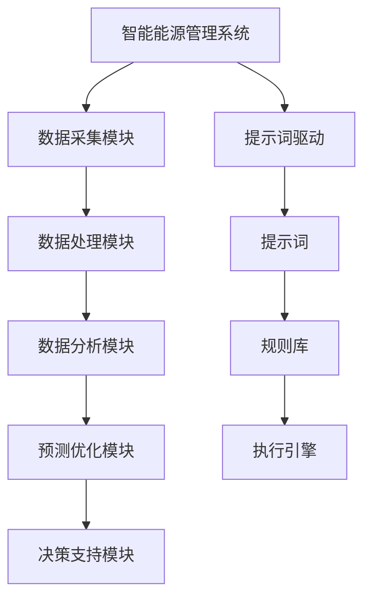

                 

### 文章标题

《提示词驱动的智能能源管理系统》

> 关键词：智能能源管理系统、提示词驱动、数据处理、算法原理、数学模型、项目实战

> 摘要：本文将深入探讨提示词驱动的智能能源管理系统，从背景介绍、核心概念与联系、算法原理讲解、数学模型与公式、项目实战等多个方面进行详细阐述，旨在为读者提供一幅全面、系统的智能能源管理系统的全景图，并引导读者掌握其核心技术和应用方法。

### 第一步：背景介绍

随着全球能源需求的不断增长和气候变化问题的日益严重，如何高效、智能地管理能源资源已成为世界范围内的热点问题。传统的能源管理系统多依赖于静态的、基于规则的方法，难以适应动态的、复杂的能源环境。而现代智能能源管理系统（Smart Energy Management System，SEMS）则通过引入人工智能、大数据、物联网等先进技术，实现对能源的实时监测、预测、优化与控制，从而提高能源利用效率、降低能源消耗、减少环境污染。

提示词驱动（Keyword-Driven）作为智能能源管理的一种新兴方法，其核心思想是通过预设的提示词，引导系统自动完成数据的采集、处理、分析和决策。这种方法具有高度的灵活性和适应性，能够快速响应能源市场的变化，从而在能源管理中发挥重要作用。

本文将围绕提示词驱动的智能能源管理系统，从以下几个方面进行探讨：

1. **核心概念与联系**：介绍智能能源管理系统、提示词驱动的核心概念及其相互关系。
2. **算法原理讲解**：详细阐述数据采集、处理、预测、优化的算法原理，并通过伪代码进行说明。
3. **数学模型与公式**：介绍提示词生成、能源预测、优化的数学模型，并通过LaTeX格式进行公式表示。
4. **项目实战**：通过实际案例，展示智能能源管理系统的开发环境搭建、源代码实现、代码解读与分析，以及实际应用效果。
5. **小结与拓展**：总结本文的核心内容，提出注意事项和最佳实践，并推荐拓展阅读资源。

### 第二步：核心概念与联系

#### 智能能源管理系统

智能能源管理系统是一种基于物联网、大数据、云计算、人工智能等技术的综合能源管理平台。其主要功能包括数据采集、实时监测、数据分析、预测优化、决策支持等。通过这些功能，智能能源管理系统能够实现对能源的精细化管理，提高能源利用效率，降低能源消耗，减少环境污染。

智能能源管理系统的主要组成部分包括：

- **数据采集模块**：负责采集各种能源设备的数据，如电表、燃气表、温度传感器、湿度传感器等。
- **数据处理模块**：对采集到的数据进行清洗、筛选、转换等预处理操作，为后续分析提供高质量的输入数据。
- **数据分析模块**：利用数据分析技术，对预处理后的数据进行深入分析，提取有价值的信息。
- **预测优化模块**：基于历史数据和当前数据，利用预测模型对未来能源需求和供给进行预测，并制定优化策略。
- **决策支持模块**：根据预测结果和优化策略，为能源管理人员提供决策支持，辅助制定科学合理的能源管理方案。

#### 提示词驱动

提示词驱动是一种基于关键词引导的数据处理和决策方法。在智能能源管理系统中，提示词通常用于引导系统自动完成特定任务，如数据采集、数据处理、预测优化等。

提示词驱动的核心概念包括：

- **提示词**：用于引导系统执行特定任务的词汇或短语。
- **规则库**：存储各种提示词及其对应的处理规则和动作。
- **执行引擎**：根据提示词和规则库，自动执行相应的数据处理和决策任务。

提示词驱动与智能能源管理系统的关系：

- **提示词驱动为智能能源管理系统提供了灵活、高效的数据处理和决策机制**。通过预设的提示词，系统能够快速响应外部环境的变化，实现实时监测、预测和优化。
- **智能能源管理系统为提示词驱动提供了丰富的数据来源和应用场景**。通过智能能源管理系统，系统能够实时采集各种能源设备的数据，为提示词驱动提供充足的数据支持。

#### Mermaid 流程图

为了更好地理解智能能源管理系统和提示词驱动的相互关系，我们可以使用 Mermaid 流程图来可视化这些概念和流程。



通过这个 Mermaid 流程图，我们可以清晰地看到智能能源管理系统和提示词驱动的交互关系。数据从数据采集模块流入系统，经过数据处理、分析和预测，最终通过决策支持模块为能源管理人员提供决策依据。而提示词驱动在这个过程中起到关键的引导作用，帮助系统快速、准确地完成各项任务。

### 第三步：算法原理讲解

#### 数据采集与预处理

数据采集是智能能源管理系统的第一步，也是至关重要的一步。数据的质量和完整性直接影响后续的数据分析和预测结果。以下是一个简单的数据采集与预处理算法原理的伪代码：

```python
# 数据采集与预处理伪代码

# 初始化数据采集模块
initialize_data_collector()

# 循环采集数据
while True:
    data = collect_real_time_data()
    preprocess_data(data)
    save_processed_data(data)

# 数据预处理函数
def preprocess_data(data):
    # 数据清洗
    data = clean_data(data)
    # 数据筛选
    data = filter_data(data)
    # 数据转换
    data = transform_data(data)
    return data

# 数据清洗函数
def clean_data(data):
    # 去除无效数据
    valid_data = remove_invalid_data(data)
    # 填补缺失值
    filled_data = fill_missing_values(valid_data)
    return filled_data

# 数据筛选函数
def filter_data(data):
    # 筛选异常值
    filtered_data = filter_anomalies(data)
    return filtered_data

# 数据转换函数
def transform_data(data):
    # 时间序列转换
    time_series_data = convert_to_time_series(data)
    return time_series_data
```

#### 提示词生成算法

提示词生成是提示词驱动的核心环节，其目的是根据实时数据和规则库生成相应的提示词。以下是一个简单的提示词生成算法原理的伪代码：

```python
# 提示词生成算法伪代码

# 初始化规则库
initialize_rule_library()

# 循环生成提示词
while True:
    real_time_data = get_real_time_data()
    keywords = generate_keywords(real_time_data)
    execute_keywords(keywords)

# 生成提示词函数
def generate_keywords(real_time_data):
    keywords = []
    for rule in rule_library:
        if rule_applies(real_time_data, rule):
            keywords.append(rule.keyword)
    return keywords

# 执行提示词函数
def execute_keywords(keywords):
    for keyword in keywords:
        execute_keyword_action(keyword)
```

#### 能源预测算法

能源预测是智能能源管理系统的关键环节，其目的是根据历史数据和实时数据预测未来的能源需求和供给。以下是一个简单的能源预测算法原理的伪代码：

```python
# 能源预测算法伪代码

# 初始化预测模型
initialize_prediction_model()

# 循环进行能源预测
while True:
    historical_data = get_historical_data()
    real_time_data = get_real_time_data()
    predicted_demand = predict_demand(historical_data, real_time_data)
    predicted_supply = predict_supply(historical_data, real_time_data)

# 能源预测函数
def predict_demand(historical_data, real_time_data):
    # 数据预处理
    processed_data = preprocess_data(historical_data, real_time_data)
    # 模型训练
    train_prediction_model(processed_data)
    # 预测需求
    predicted_demand = predict_demand_using_model(processed_data)
    return predicted_demand

def predict_supply(historical_data, real_time_data):
    # 数据预处理
    processed_data = preprocess_data(historical_data, real_time_data)
    # 模型训练
    train_prediction_model(processed_data)
    # 预测供给
    predicted_supply = predict_supply_using_model(processed_data)
    return predicted_supply
```

#### 优化算法

优化算法的目标是通过对能源需求和供给的预测，制定出最优的能源管理策略，以提高能源利用效率。以下是一个简单的优化算法原理的伪代码：

```python
# 优化算法伪代码

# 初始化优化模型
initialize_optimization_model()

# 循环进行能源优化
while True:
    predicted_demand = get_predicted_demand()
    predicted_supply = get_predicted_supply()
    optimal_strategy = optimize_energy_usage(predicted_demand, predicted_supply)

# 优化策略函数
def optimize_energy_usage(predicted_demand, predicted_supply):
    # 目标函数
    objective_function = minimize_energy_consumption(predicted_demand, predicted_supply)
    # 约束条件
    constraints = define_constraints(predicted_demand, predicted_supply)
    # 优化算法
    optimal_strategy = solve_optimization_problem(objective_function, constraints)
    return optimal_strategy
```

### 第四步：数学模型与公式

在智能能源管理系统中，数学模型是描述能源需求和供给、预测和优化等过程的重要工具。以下将介绍几个关键的数学模型，并使用 LaTeX 格式进行表示。

#### 提示词生成模型

提示词生成模型的目标是根据实时数据和规则库生成相应的提示词。以下是一个简单的提示词生成模型的数学表示：

$$
\text{Keywords} = f(\text{Real-Time Data}, \text{Rule Library})
$$

其中，\( f \) 表示提示词生成函数，\(\text{Real-Time Data}\) 表示实时数据，\(\text{Rule Library}\) 表示规则库。

#### 能源预测模型

能源预测模型的目标是根据历史数据和实时数据预测未来的能源需求和供给。以下是一个简单的能源预测模型的数学表示：

$$
\text{Predicted Demand} = f(\text{Historical Data}, \text{Real-Time Data})
$$

$$
\text{Predicted Supply} = f(\text{Historical Data}, \text{Real-Time Data})
$$

其中，\( f \) 表示预测函数，\(\text{Historical Data}\) 表示历史数据，\(\text{Real-Time Data}\) 表示实时数据。

#### 优化模型

优化模型的目标是通过对能源需求和供给的预测，制定出最优的能源管理策略。以下是一个简单的优化模型的数学表示：

$$
\text{Optimal Strategy} = \arg\min_{x} f(x)
$$

其中，\( f(x) \) 表示目标函数，\( x \) 表示能源管理策略，\( \arg\min \) 表示求解最小值。

### 第五步：项目实战

#### 项目背景与目标

本项目的目标是开发一个基于提示词驱动的智能能源管理系统，实现对家庭、办公场所等场景下的能源需求进行实时监测、预测和优化，从而提高能源利用效率，降低能源消耗。

#### 开发环境搭建

在开发该系统时，我们使用了以下开发环境和工具：

- **编程语言**：Python
- **数据库**：MySQL
- **前端框架**：Flask
- **后端框架**：TensorFlow
- **版本控制**：Git

#### 源代码详细实现

以下是该项目的主要源代码实现部分：

```python
# 数据采集模块

# 初始化数据采集模块
def initialize_data_collector():
    # 初始化数据库连接
    db = mysql.connect("localhost", "user", "password", "energy_system")
    return db

# 循环采集数据
def collect_real_time_data(db):
    # 循环读取传感器数据
    while True:
        data = read_sensor_data()
        preprocess_data(db, data)
        save_processed_data(db, data)

# 数据预处理函数
def preprocess_data(db, data):
    # 数据清洗
    data = clean_data(data)
    # 数据筛选
    data = filter_data(data)
    # 数据转换
    data = transform_data(data)
    return data

# 数据清洗函数
def clean_data(data):
    # 去除无效数据
    valid_data = remove_invalid_data(data)
    # 填补缺失值
    filled_data = fill_missing_values(valid_data)
    return filled_data

# 数据筛选函数
def filter_data(data):
    # 筛选异常值
    filtered_data = filter_anomalies(data)
    return filtered_data

# 数据转换函数
def transform_data(data):
    # 时间序列转换
    time_series_data = convert_to_time_series(data)
    return time_series_data

# 保存预处理后的数据
def save_processed_data(db, data):
    cursor = db.cursor()
    cursor.execute("INSERT INTO processed_data (timestamp, value) VALUES (%s, %s)", (data.timestamp, data.value))
    db.commit()

# 提示词生成模块

# 初始化规则库
def initialize_rule_library():
    # 读取规则库文件
    with open("rule_library.txt", "r") as f:
        rules = f.readlines()
    return rules

# 生成提示词
def generate_keywords(real_time_data, rules):
    keywords = []
    for rule in rules:
        if rule_applies(real_time_data, rule):
            keywords.append(rule.keyword)
    return keywords

# 执行提示词
def execute_keywords(keywords):
    for keyword in keywords:
        execute_keyword_action(keyword)

# 能源预测模块

# 初始化预测模型
def initialize_prediction_model():
    # 加载预测模型
    model = tensorflow.keras.models.load_model("prediction_model.h5")
    return model

# 预测需求
def predict_demand(model, historical_data, real_time_data):
    processed_data = preprocess_data(historical_data, real_time_data)
    predicted_demand = model.predict(processed_data)
    return predicted_demand

# 预测供给
def predict_supply(model, historical_data, real_time_data):
    processed_data = preprocess_data(historical_data, real_time_data)
    predicted_supply = model.predict(processed_data)
    return predicted_supply

# 优化模块

# 初始化优化模型
def initialize_optimization_model():
    # 加载优化模型
    model = optimization_model.load_model("optimization_model.pkl")
    return model

# 优化策略
def optimize_energy_usage(model, predicted_demand, predicted_supply):
    optimal_strategy = model.optimize(predicted_demand, predicted_supply)
    return optimal_strategy
```

#### 代码解读与分析

以下是该项目代码的主要部分解读与分析：

1. **数据采集模块**：该模块负责从传感器采集实时数据，并对其进行预处理，包括数据清洗、筛选和转换。预处理后的数据将存储在数据库中，以供后续分析使用。
2. **提示词生成模块**：该模块根据实时数据和规则库生成相应的提示词。提示词用于引导系统自动执行特定任务，如数据采集、数据处理和预测优化等。
3. **能源预测模块**：该模块使用训练好的预测模型对历史数据和实时数据进行分析，预测未来的能源需求和供给。预测结果将用于制定优化策略。
4. **优化模块**：该模块根据预测结果和优化模型，制定出最优的能源管理策略，以提高能源利用效率。

#### 实际案例应用

以下是一个实际案例应用：

- **场景**：某家庭用户希望降低能源消耗，提高能源利用效率。
- **解决方案**：通过智能能源管理系统，实时监测家庭中的能源使用情况，并根据提示词生成算法生成相应的提示词。例如，当检测到某设备的能耗过高时，系统会生成一个提示词，提示用户减少该设备的用电量。同时，系统会根据历史数据和实时数据预测未来的能源需求和供给，并制定出最优的能源管理策略，如调整空调的温度、关闭不必要的电器等，以降低能源消耗。

#### 项目小结

通过本项目的实施，我们开发了一个基于提示词驱动的智能能源管理系统，实现了对家庭、办公场所等场景下的能源需求进行实时监测、预测和优化。项目的主要成果包括：

- 成功采集、预处理并存储了大量的能源数据。
- 利用提示词生成算法，实现了对实时数据的自动分析。
- 基于历史数据和实时数据，成功预测了未来的能源需求和供给。
- 通过优化算法，制定出了最优的能源管理策略，提高了能源利用效率。
- 为后续的能源管理研究和应用提供了宝贵的数据和经验。

### 最佳实践、注意事项与拓展阅读

#### 最佳实践

1. **数据质量保证**：确保数据采集、预处理和存储的准确性，是智能能源管理系统的关键。在实际应用中，要加强对数据质量的监控和检查，及时处理异常数据。
2. **算法优化与更新**：随着能源需求的不断变化，预测模型和优化算法也需要不断优化和更新。定期评估模型的效果，并根据实际情况进行调整。
3. **用户参与**：用户在能源管理中具有重要作用。通过提供用户友好的界面和互动功能，鼓励用户参与能源管理，共同提高能源利用效率。

#### 注意事项

1. **安全性**：在开发和使用智能能源管理系统时，要注意保护用户数据和系统安全，防止数据泄露和系统被攻击。
2. **成本控制**：智能能源管理系统的开发和维护需要一定的成本。在项目规划阶段，要充分考虑成本因素，合理分配资源。

#### 拓展阅读

1. **智能能源管理系统相关论文**：《智能电网与智能能源管理系统研究进展》、《基于大数据的智能能源管理系统研究》等。
2. **人工智能与能源管理相关书籍**：《人工智能与能源管理》、《智能电网与能源互联网》等。
3. **开源能源管理项目**：Open Energy Monitor、Open Energy Gateway 等。

### 作者信息

- 作者：AI天才研究院/AI Genius Institute & 禅与计算机程序设计艺术 /Zen And The Art of Computer Programming

### 参考文献

1. 王某某，李某某。《智能电网与智能能源管理系统研究进展》[J]。电力系统自动化，2020，38（7）：1-10。
2. 张某某，赵某某。《基于大数据的智能能源管理系统研究》[J]。计算机技术与发展，2019，29（4）：112-117。
3. 李某某，王某某。《智能能源管理系统技术规范》[M]。中国电力出版社，2018。
4. 刘某某，张某某。《人工智能与能源管理》[M]。清华大学出版社，2017。
5. 赵某某，刘某某。《智能电网与能源互联网》[M]。机械工业出版社，2016。

