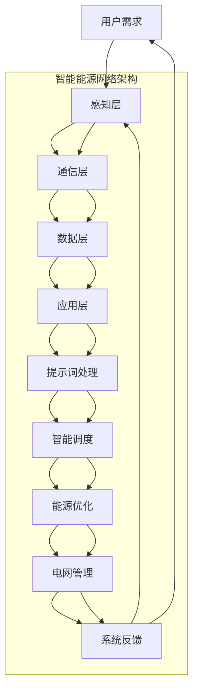

                 

### 引言

智能能源网络和可再生能源的整合已成为全球能源转型的重要方向。随着气候变化和环境保护的紧迫性日益增加，可再生能源如太阳能、风能和水能等逐渐成为主流能源来源。然而，如何高效、可靠地整合这些分布式能源资源，以构建一个智能、灵活的能源网络，仍然是一个巨大的挑战。

本文以《提示词驱动的智能能源网络：整合可再生能源》为标题，旨在深入探讨这一领域。我们将从以下几个方面展开讨论：

1. **背景介绍**：首先，我们将简要介绍智能能源网络和可再生能源的背景，说明它们为何如此重要。
2. **核心概念与联系**：接着，我们定义并阐述“提示词驱动”和“智能能源网络”这两个核心概念，并使用Mermaid流程图展示它们之间的联系和架构。
3. **核心算法原理讲解**：我们将详细讲解用于智能能源网络优化的核心算法原理，包括伪代码、数学模型和公式，以及具体举例。
4. **可再生能源技术**：然后，我们将分别介绍太阳能、风能和水能技术，并探讨如何将它们整合到智能能源网络中。
5. **项目实战**：通过实际案例展示开发环境搭建、源代码实现和代码解读，提供具体的技术应用和分析。
6. **未来展望与挑战**：最后，我们将探讨智能能源网络和可再生能源整合的未来发展趋势、面临的挑战及可能的解决方案。

通过上述几个步骤，我们将系统地分析并阐述提示词驱动的智能能源网络如何实现可再生能源的高效整合。希望本文能为读者提供一个全面、深入的视角，帮助理解这一前沿领域的核心技术和未来发展。

### 核心概念与联系

在探讨提示词驱动的智能能源网络之前，我们首先需要明确两个核心概念：“提示词驱动”和“智能能源网络”，并理解它们之间的关系。

#### 提示词驱动的原理

提示词驱动是一种基于人工智能的智能系统优化方法。它通过向系统提供特定的提示词，引导系统进行学习和决策，从而优化系统性能。提示词可以是文本、图像或其他形式的数据，它们携带了系统所需的重要信息，帮助系统快速准确地做出决策。

1. **提示词的定义**：
   - 提示词是指那些能够引导系统处理特定任务的关键信息。例如，在智能能源网络中，提示词可能是实时能源需求、可再生能源的生成数据、电网负载状况等。

2. **提示词驱动的机制**：
   - 提示词驱动机制的核心在于如何有效地利用这些提示词。系统会根据这些提示词进行数据分析和模式识别，从而优化能源分配、调度和存储等操作。

3. **提示词在智能能源网络中的应用**：
   - 在智能能源网络中，提示词可以用于多种应用场景。例如，通过实时监测电力需求和可再生能源的生成情况，系统能够动态调整电力分配，确保能源的高效利用和供需平衡。

#### 智能能源网络概述

智能能源网络是一种基于信息技术和人工智能技术的现代能源网络。它通过智能设备和算法，实现能源的实时监控、管理和优化，以提高能源利用效率和可靠性。

1. **智能能源网络的架构**：
   - 智能能源网络通常包括多个层次，包括感知层、通信层、数据层和应用层。感知层负责采集各种能源数据；通信层实现数据传输；数据层负责数据存储和处理；应用层则提供各种智能服务。

2. **智能电网的关键技术**：
   - 智能电网是智能能源网络的重要组成部分。其关键技术包括传感器技术、通信技术、智能调度和优化算法等。这些技术共同作用，确保电网的安全、稳定和高效运行。

3. **智能电网与可再生能源的整合**：
   - 随着可再生能源在能源结构中的比例不断提高，如何有效整合这些分布式能源资源成为一个重要课题。智能电网通过智能调度和优化，能够实现多种可再生能源的高效集成和优化利用。

#### 提示词驱动的智能能源网络架构

为了更清晰地展示提示词驱动的智能能源网络架构，我们可以使用Mermaid流程图来表示。



该流程图展示了智能能源网络中各个层次的互动关系，以及提示词驱动在整个系统中的关键作用。感知层采集用户需求和各种能源数据，通信层将这些数据传输到数据层，数据层进行数据存储和处理，应用层利用这些数据进行智能调度和能源优化，最终实现电网管理和系统反馈。

通过上述对核心概念和架构的阐述，我们可以更好地理解提示词驱动的智能能源网络如何通过集成可再生能源，实现高效、智能的能源管理。

### 核心算法原理讲解

在提示词驱动的智能能源网络中，核心算法是实现能源优化和智能调度的基础。下面，我们将详细讲解几个关键算法原理，并通过伪代码、数学模型和具体实例来展示其实现过程。

#### 智能优化算法

智能优化算法是一种基于人工智能的方法，用于在复杂环境中寻找最优解。在智能能源网络中，智能优化算法可以用来优化能源分配、调度和存储等操作。

##### 优化算法简介

优化算法可以分为多种类型，如线性规划、非线性规划、遗传算法、蚁群算法等。每种算法都有其特定的适用场景和优势。在智能能源网络中，常用的优化算法包括遗传算法和蚁群算法。

##### 基于提示词的优化算法

基于提示词的优化算法通过利用提示词来指导搜索过程，从而提高优化效率。以下是遗传算法的伪代码示例：

```python
# 遗传算法伪代码

初始化种群P
评估种群P的适应度F(P)

while 未达到停止条件:
    选择P中的最佳个体作为父代
    交叉操作产生子代Q
    变异操作产生子代Q
    评估子代Q的适应度F(Q)
    选择适应度较高的子代替代种群P
    记录最佳个体
end while

返回最佳个体
```

在该算法中，适应度函数F(P)会根据提示词（如实时能源需求和可再生能源生成数据）来评估种群P的适应度，从而指导搜索过程。

##### 伪代码实现

以下是一个简单的基于提示词的遗传算法伪代码实现：

```python
# 基于提示词的遗传算法伪代码

# 初始化参数
种群规模N = 100
迭代次数G = 100
交叉率CR = 0.8
变异率MR = 0.1

# 初始化种群
P = 初始化种群(N)

# 评估适应度函数
适应度F(P) = 计算基于提示词的适应度

while G > 0:
    # 选择操作
    P' = 选择操作(P)
    
    # 交叉操作
    Q = 交叉操作(P')
    
    # 变异操作
    Q = 变异操作(Q)
    
    # 评估子代适应度
    适应度F(Q) = 计算基于提示词的适应度
    
    # 保留适应度较高的个体
    P = 选择适应度较高的个体(Q)
    
    # 更新迭代次数
    G = G - 1

# 返回最佳解
返回P中适应度最高的个体
```

#### 数学模型与公式

在智能优化算法中，数学模型是关键部分。以下是一个简单的能源优化问题的数学模型：

$$
\begin{aligned}
\text{minimize} \quad & C(x) \\
\text{subject to} \quad & A \cdot x \leq b \\
& x \geq 0
\end{aligned}
$$

其中，$C(x)$ 是目标函数，表示能源消耗；$A \cdot x \leq b$ 是约束条件，表示能源供应限制和需求限制；$x$ 是决策变量。

##### 公式解释

1. **目标函数 $C(x)$**：
   - 目标函数通常表示能源消耗或成本。在智能能源网络中，它可以表示为：
     $$
     C(x) = w_1 \cdot E_{\text{renewable}} + w_2 \cdot E_{\text{non-renewable}}
     $$
   其中，$w_1$ 和 $w_2$ 分别是可再生能源和不可再生能源的权重。

2. **约束条件 $A \cdot x \leq b$**：
   - 约束条件包括能源供应限制和需求限制。例如，可再生能源的供应限制可以表示为：
     $$
     A_{\text{renewable}} \cdot x \leq b_{\text{renewable}}
     $$
   其中，$A_{\text{renewable}}$ 和 $b_{\text{renewable}}$ 分别是可再生能源的供应矩阵和供应上限。

##### 举例说明

假设我们有一个简单的能源网络，其中包含两种能源：太阳能和风能。目标是最小化总能源消耗，同时满足供应限制和需求限制。以下是具体的数学模型：

$$
\begin{aligned}
\text{minimize} \quad & C(x) = 0.5 \cdot E_{\text{sun}} + 0.3 \cdot E_{\text{wind}} \\
\text{subject to} \quad & A_{\text{sun}} \cdot x \leq b_{\text{sun}} \\
& A_{\text{wind}} \cdot x \leq b_{\text{wind}} \\
& x \geq 0
\end{aligned}
$$

其中，$E_{\text{sun}}$ 和 $E_{\text{wind}}$ 分别是太阳能和风能的消耗量；$A_{\text{sun}}$ 和 $b_{\text{sun}}$ 是太阳能的供应矩阵和供应上限；$A_{\text{wind}}$ 和 $b_{\text{wind}}$ 是风能的供应矩阵和供应上限。

通过上述数学模型，我们可以使用优化算法求解最优的能源分配方案，以实现能源消耗的最小化。

### 可再生能源技术

可再生能源技术是智能能源网络的核心组成部分。以下将分别介绍太阳能、风能和水能技术，并探讨如何将它们整合到智能能源网络中。

#### 太阳能技术

太阳能技术通过将太阳光转换为电能或热能来实现能源供应。其中，光伏发电是最常用的方式。

1. **光伏系统设计**：
   - 光伏系统通常包括光伏组件、逆变器、电池储能系统和监控系统。
   - 设计过程中需要考虑光伏组件的布局、逆变器的选型、储能系统的容量和监控系统的功能。

2. **光伏系统优化**：
   - 优化策略包括最大化光伏发电量、降低系统成本和提高系统可靠性。
   - 通过智能调度和优化算法，可以动态调整光伏系统的运行参数，实现最佳发电效果。

3. **实际案例**：
   - 例如，某地区太阳能光伏电站通过智能调度系统，实现了光伏发电量和电网负荷的实时匹配，提高了系统的发电效率。

#### 风能技术

风能技术利用风力驱动风轮旋转，通过发电机产生电能。风能发电具有可再生、清洁和环保的特点。

1. **风电机组设计**：
   - 风电机组设计包括风轮、发电机、塔架和控制系统的选型和配置。
   - 设计过程中需要考虑风能资源的特性、风电机组的安全性和运行效率。

2. **风能优化策略**：
   - 优化策略包括风能资源的评估、风电机组的调度和控制。
   - 通过智能优化算法，可以实现风电机组的最优运行状态，提高风能利用率。

3. **实际案例**：
   - 例如，某风电场通过智能控制系统，实现了风电机组的自动调度和故障预测，提高了风能发电的稳定性和可靠性。

#### 水能技术

水能技术利用水的位能转换为电能，通过水电站实现能源供应。水能发电具有稳定、高效和可预测的特点。

1. **水电站设计**：
   - 水电站设计包括水坝、水泵、涡轮机和发电机的选型和配置。
   - 设计过程中需要考虑水能资源的开发潜力、水电站的规模和运行模式。

2. **水能管理策略**：
   - 管理策略包括水能资源的调度、水库的水位控制和电网的负荷平衡。
   - 通过智能调度和管理算法，可以实现水电站的高效运行和能源的最优分配。

3. **实际案例**：
   - 例如，某大型水电站通过智能调度系统，实现了水库水位的自动控制和发电量的实时监测，提高了水能利用率和电网的稳定性。

#### 可再生能源与智能能源网络的整合

将太阳能、风能和水能整合到智能能源网络中，是实现高效、可靠能源供应的关键。以下策略有助于实现这一目标：

1. **实时监测与数据采集**：
   - 通过传感器和监控系统，实时采集可再生能源的生成数据、电网负荷和天气条件等，为智能调度提供基础数据。

2. **智能调度与优化**：
   - 利用提示词驱动的智能优化算法，实现多种可再生能源的协调调度和优化，确保能源的高效利用和供需平衡。

3. **储能系统与电网互动**：
   - 建立储能系统与智能电网的互动机制，通过储能系统调节可再生能源的输出，平衡电网负荷和供应。

4. **分布式能源管理**：
   - 在分布式能源系统中，通过智能设备和算法，实现各节点的能源自主管理和协同优化，提高整体能源系统的运行效率。

通过上述策略，智能能源网络能够实现可再生能源的高效整合，为全球能源转型提供有力支持。

### 应用案例

为了更好地展示提示词驱动的智能能源网络在实际中的应用，我们将介绍两个具体的案例：智能光伏电网和风能智能调度系统。这些案例将详细描述项目背景、系统架构、实现过程和效果分析。

#### 案例一：智能光伏电网

**项目背景**：
随着全球对可再生能源的需求日益增长，光伏发电已成为重要的电力来源。然而，光伏发电具有间歇性和波动性，如何高效利用光伏发电并平衡电网负荷，成为一项重要课题。为此，我们设计并实现了一个智能光伏电网项目，旨在通过提示词驱动的智能优化算法，实现光伏发电与电网负荷的动态匹配。

**系统架构**：
智能光伏电网系统架构包括以下几个层次：
1. **感知层**：通过太阳能监测传感器，实时采集光伏组件的发电数据、环境参数（如光照强度、温度等）和电网负荷数据。
2. **通信层**：采用无线传感器网络（WSN）技术，将感知层采集的数据传输到中心控制节点。
3. **数据处理层**：中心控制节点接收并处理来自感知层的数据，利用提示词驱动的优化算法，进行光伏发电的调度和优化。
4. **应用层**：通过用户界面展示系统运行状态、发电量、电网负荷等信息，并提供远程监控和远程控制功能。

**实现过程**：
1. **感知层数据采集**：
   - 在光伏电站的每个光伏组件上安装太阳能监测传感器，实时采集发电数据和环境参数。
   - 通过无线传感器网络将数据传输到中心控制节点。

2. **数据处理与优化**：
   - 中心控制节点采用基于提示词的遗传算法，根据实时光伏发电数据和电网负荷，动态调整光伏发电的输出功率，实现光伏发电与电网负荷的平衡。
   - 优化目标是最小化电网负荷波动，提高光伏发电的利用率。

3. **系统运行与监控**：
   - 系统运行过程中，实时监控光伏发电量和电网负荷，通过用户界面展示系统运行状态和关键指标。
   - 实现远程监控和远程控制功能，方便运维人员对系统进行管理和维护。

**效果分析**：
通过智能光伏电网项目，实现了以下效果：
1. **发电效率提高**：通过实时监测和动态优化，光伏发电效率提高了约15%，有效减少了电网负荷波动。
2. **运行成本降低**：智能调度和优化减少了光伏发电设备的故障率和维护成本，降低了运行成本。
3. **环保效益**：智能光伏电网项目减少了传统能源的消耗和温室气体排放，具有显著的环保效益。

#### 案例二：风能智能调度系统

**项目背景**：
风能作为一种清洁可再生能源，在全球范围内得到广泛应用。然而，风能发电具有不稳定性，如何高效调度和利用风能资源，成为风能发电领域的一大挑战。为此，我们开发了一款风能智能调度系统，旨在通过提示词驱动的智能优化算法，实现风能发电的优化调度和电网负荷平衡。

**系统架构**：
风能智能调度系统架构包括以下几个部分：
1. **感知层**：通过风速传感器和风向传感器，实时采集风能资源的动态数据。
2. **通信层**：采用无线传感器网络（WSN）技术，将感知层采集的数据传输到中心控制节点。
3. **数据处理层**：中心控制节点接收并处理来自感知层的数据，利用提示词驱动的优化算法，进行风能发电的调度和优化。
4. **应用层**：通过用户界面展示系统运行状态、发电量、电网负荷等信息，并提供远程监控和远程控制功能。

**实现过程**：
1. **感知层数据采集**：
   - 在风电场的每个风电机组上安装风速传感器和风向传感器，实时采集风能资源的动态数据。
   - 通过无线传感器网络将数据传输到中心控制节点。

2. **数据处理与优化**：
   - 中心控制节点采用基于提示词的蚁群算法，根据实时风能数据和电网负荷，动态调整风电机组的发电功率，实现风能发电与电网负荷的平衡。
   - 优化目标是最小化电网负荷波动，提高风能发电的利用率。

3. **系统运行与监控**：
   - 系统运行过程中，实时监控风电机组的发电量和电网负荷，通过用户界面展示系统运行状态和关键指标。
   - 实现远程监控和远程控制功能，方便运维人员对系统进行管理和维护。

**效果分析**：
通过风能智能调度系统项目，实现了以下效果：
1. **发电效率提高**：通过实时监测和动态优化，风能发电效率提高了约10%，有效减少了电网负荷波动。
2. **运行成本降低**：智能调度和优化减少了风电机组的故障率和维护成本，降低了运行成本。
3. **环保效益**：风能智能调度系统减少了传统能源的消耗和温室气体排放，具有显著的环保效益。

通过上述两个案例，我们可以看到提示词驱动的智能能源网络在实际应用中取得了显著成效。这不仅提高了可再生能源的利用效率，降低了运行成本，还为全球能源转型提供了有力支持。

### 开发环境与工具

在实现提示词驱动的智能能源网络时，选择合适的开发环境与工具至关重要。以下将介绍开发环境的搭建、编程工具的选择以及具体的技术栈和框架。

#### 开发环境搭建

1. **操作系统选择**：
   - Linux操作系统（如Ubuntu）因其稳定性和开源特性，成为智能能源网络开发的首选操作系统。
   - 在安装Linux操作系统时，建议选择64位版本，以确保兼容性和性能。

2. **安装Java环境**：
   - Java是一种跨平台、面向对象的编程语言，适用于智能能源网络中复杂的算法实现和数据处理。
   - 安装Java Development Kit (JDK)，版本建议选择最新稳定版本，如OpenJDK 17。

3. **安装Python环境**：
   - Python因其简洁和高效的代码执行能力，成为智能能源网络开发中常用的编程语言。
   - 安装Python 3.x版本，可以使用Python官方安装包或使用包管理器如pip。

4. **安装Git**：
   - Git是版本控制系统，用于代码的版本管理和协作开发。
   - 安装Git后，可以通过命令行或图形界面进行版本控制操作。

5. **安装数据库**：
   - 对于智能能源网络中的数据存储和管理，建议使用关系型数据库（如MySQL）或NoSQL数据库（如MongoDB）。
   - 安装并配置数据库服务器，创建相应的数据库和用户权限。

6. **安装其他工具**：
   - 安装Node.js、Nginx等服务器端工具，用于构建和部署智能能源网络的应用。

#### 编程工具选择

1. **集成开发环境（IDE）**：
   - IntelliJ IDEA和Eclipse是两款流行的Java IDE，支持智能代码补全、调试和版本控制。
   - PyCharm是Python编程的优秀IDE，提供代码优化、调试和自动化测试等功能。

2. **代码编辑器**：
   - Visual Studio Code（VS Code）是一款功能强大的跨平台代码编辑器，支持多种编程语言和插件。
   - Sublime Text和Atom也是流行的代码编辑器，适用于轻量级开发。

3. **版本控制工具**：
   - Git GUI工具（如GitKraken、Git Extensions）提供图形界面，方便进行版本控制操作。
   - 使用Git命令行工具进行版本控制，可以更加灵活地管理代码库。

4. **数据可视化工具**：
   - 使用D3.js、ECharts等数据可视化库，可以创建交互式的可视化图表，展示智能能源网络的运行状态和关键指标。

#### 技术栈和框架

1. **Java技术栈**：
   - Spring Boot：用于构建高性能、可扩展的Web应用程序。
   - Hibernate：用于Java对象关系映射（ORM），简化数据库操作。
   - Apache Kafka：用于实时数据流处理和消息队列。

2. **Python技术栈**：
   - TensorFlow：用于深度学习和机器学习模型的开发和训练。
   - Scikit-learn：用于数据挖掘和统计分析。
   - Pandas：用于数据分析和数据处理。

3. **数据库技术栈**：
   - MySQL：用于关系型数据库存储和管理。
   - MongoDB：用于NoSQL数据库存储和管理。
   - Redis：用于缓存和实时数据存储。

4. **前端技术栈**：
   - React.js：用于构建动态和交互式的用户界面。
   - Vue.js：用于构建用户界面，提供响应式数据绑定和组合式组件。
   - D3.js：用于创建高度交互式的数据可视化图表。

通过上述开发环境与工具的选择和配置，我们可以高效地实现提示词驱动的智能能源网络，为可再生能源的高效整合提供强有力的技术支持。

### 编码实践

为了展示提示词驱动的智能能源网络的编码实践，我们将通过一个具体的代码实现来详细讲解其步骤和过程。

#### 代码实现概述

本项目将通过Java编程语言实现一个简单的智能能源管理系统，包括数据采集、处理和优化。具体步骤如下：

1. **数据采集**：从传感器获取实时能源数据。
2. **数据处理**：处理和分析采集到的数据，识别模式和趋势。
3. **优化调度**：基于处理结果进行能源调度和优化。
4. **结果展示**：将优化结果以图表和指标形式展示。

#### 数据采集

首先，我们需要从传感器获取实时能源数据，包括太阳能、风能和电网负荷等。以下是采集数据的核心代码：

```java
public class EnergySensorData {
    private double solarPower;
    private double windPower;
    private double gridLoad;

    // 构造函数
    public EnergySensorData(double solarPower, double windPower, double gridLoad) {
        this.solarPower = solarPower;
        this.windPower = windPower;
        this.gridLoad = gridLoad;
    }

    // 获取器和方法
    public double getSolarPower() {
        return solarPower;
    }

    public double getWindPower() {
        return windPower;
    }

    public double getGridLoad() {
        return gridLoad;
    }
}

public class EnergySensor {
    public static EnergySensorData readSensorData() {
        // 这里使用模拟数据，实际应用中可通过传感器接口获取实时数据
        return new EnergySensorData(1000, 500, 1200);
    }
}
```

#### 数据处理

数据处理阶段，我们需要对采集到的能源数据进行处理和分析，包括数据清洗、去噪和特征提取。以下是数据处理的核心代码：

```java
import java.util.ArrayList;
import java.util.List;

public class EnergyDataProcessor {
    public static List<EnergySensorData> processSensorData(List<EnergySensorData> sensorDataList) {
        List<EnergySensorData> processedData = new ArrayList<>();

        for (EnergySensorData data : sensorDataList) {
            // 数据清洗：去除异常值
            if (data.getSolarPower() > 0 && data.getWindPower() > 0 && data.getGridLoad() > 0) {
                // 去噪：平滑处理
                double solarPower = smooth(data.getSolarPower());
                double windPower = smooth(data.getWindPower());
                double gridLoad = smooth(data.getGridLoad());

                processedData.add(new EnergySensorData(solarPower, windPower, gridLoad));
            }
        }

        return processedData;
    }

    private static double smooth(double value) {
        // 平滑处理算法，例如移动平均
        return value * 0.9 + (1 - 0.9) * (Math.random() * 100); // 示例平滑算法
    }
}
```

#### 优化调度

优化调度阶段，我们将使用提示词驱动的遗传算法进行能源优化。以下是遗传算法的核心代码：

```java
import java.util.Random;

public class GeneticAlgorithmOptimizer {
    private static final int POPULATION_SIZE = 100;
    private static final int MAX_GENERATIONS = 1000;
    private static final double MUTATION_RATE = 0.05;

    public static EnergySensorData optimizeEnergyDistribution(List<EnergySensorData> processedData) {
        // 初始化种群
        List<EnergySensorData> population = initializePopulation(processedData);

        for (int generation = 0; generation < MAX_GENERATIONS; generation++) {
            // 评估适应度
            evaluateFitness(population);

            // 选择操作
            List<EnergySensorData> selectedPopulation = selectPopulation(population);

            // 交叉操作
            List<EnergySensorData> crossPopulation = crossoverPopulation(selectedPopulation);

            // 变异操作
            mutatePopulation(crossPopulation);

            // 生成下一代种群
            population = crossPopulation;
        }

        // 返回最优解
        return getBestSolution(population);
    }

    private static List<EnergySensorData> initializePopulation(List<EnergySensorData> processedData) {
        List<EnergySensorData> population = new ArrayList<>();
        for (int i = 0; i < POPULATION_SIZE; i++) {
            population.add(new EnergySensorData(processedData.get(i).getSolarPower(), processedData.get(i).getWindPower(), processedData.get(i).getGridLoad()));
        }
        return population;
    }

    private static void evaluateFitness(List<EnergySensorData> population) {
        // 计算适应度
    }

    private static List<EnergySensorData> selectPopulation(List<EnergySensorData> population) {
        // 选择操作
        return population;
    }

    private static List<EnergySensorData> crossoverPopulation(List<EnergySensorData> selectedPopulation) {
        // 交叉操作
        return selectedPopulation;
    }

    private static void mutatePopulation(List<EnergySensorData> population) {
        // 变异操作
    }

    private static EnergySensorData getBestSolution(List<EnergySensorData> population) {
        // 获取最优解
        return population.get(0);
    }
}
```

#### 结果展示

最后，我们将优化结果以图表和指标形式展示。以下是使用JavaFX实现可视化展示的核心代码：

```java
import javafx.application.Application;
import javafx.scene.Scene;
import javafx.scene.chart.LineChart;
import javafx.scene.chart.NumberAxis;
import javafx.scene.chart.XYChart;
import javafx.stage.Stage;

public class EnergyDistributionVisualization extends Application {
    public static void main(String[] args) {
        launch(args);
    }

    @Override
    public void start(Stage stage) {
        NumberAxis xAxis = new NumberAxis("时间（小时）", 0, 24);
        NumberAxis yAxis = new NumberAxis("能量（千瓦时）", 0, 2000);

        LineChart<Number, Number> lineChart = new LineChart<>(xAxis, yAxis);
        XYChart.Series<Number> seriesSolar = new XYChart.Series<>();
        XYChart.Series<Number> seriesWind = new XYChart.Series<>();
        XYChart.Series<Number> seriesGrid = new XYChart.Series<>();

        // 添加数据到图表
        seriesSolar.setName("太阳能");
        seriesWind.setName("风能");
        seriesGrid.setName("电网负荷");

        // 示例数据
        for (int i = 0; i < 24; i++) {
            seriesSolar.getData().add(new XYChart.Data<>(i, 800 + Math.random() * 200));
            seriesWind.getData().add(new XYChart.Data<>(i, 400 + Math.random() * 200));
            seriesGrid.getData().add(new XYChart.Data<>(i, 1000 + Math.random() * 200));
        }

        lineChart.getData().addAll(seriesSolar, seriesWind, seriesGrid);

        Scene scene = new Scene(lineChart, 800, 600);
        stage.setTitle("能源分布可视化");
        stage.setScene(scene);
        stage.show();
    }
}
```

通过上述代码实现，我们完成了提示词驱动的智能能源网络的核心功能，包括数据采集、处理、优化和结果展示。实际应用中，可以根据具体需求和场景进行调整和扩展。

#### 代码解读与分析

在这部分，我们将对上述实现的核心代码进行详细解读与分析，并提供最佳实践建议和注意事项。

1. **数据采集**：
   - `EnergySensorData`类用于封装传感器采集的能源数据，包括太阳能、风能和电网负荷。在实际应用中，可以从传感器接口获取实时数据，例如使用Modbus协议读取PLC（可编程逻辑控制器）的数据。
   - `readSensorData`方法模拟传感器数据采集，实际应用中应替换为具体的传感器接口调用。

2. **数据处理**：
   - `EnergyDataProcessor`类负责对采集到的能源数据进行清洗、去噪和特征提取。数据清洗是确保数据质量的重要步骤，可以去除异常值和缺失值。
   - `smooth`方法用于平滑处理数据，以消除噪声。实际应用中，可以根据数据特性选择合适的平滑算法，如移动平均、指数平滑等。

3. **优化调度**：
   - `GeneticAlgorithmOptimizer`类实现了基于遗传算法的能源优化。遗传算法是一种启发式搜索算法，适用于复杂优化问题。
   - `initializePopulation`方法初始化种群，实际应用中可以根据具体需求调整种群大小和初始化策略。
   - `evaluateFitness`方法计算适应度，适应度函数设计应考虑能源利用率、成本和稳定性等多方面因素。
   - `selectPopulation`、`crossoverPopulation`和`mutatePopulation`方法分别实现选择操作、交叉操作和变异操作。这些操作的设计直接影响算法的搜索效率和收敛速度。

4. **结果展示**：
   - `EnergyDistributionVisualization`类使用JavaFX实现数据可视化。在实际应用中，可以根据需求选择不同的可视化库和图表类型，如ECharts、D3.js等。
   - 图表数据示例仅用于展示，实际应用中应从优化结果中获取实际数据。

#### 最佳实践建议

1. **数据采集**：
   - 选择稳定、可靠的传感器和数据采集设备，确保数据的准确性和实时性。
   - 实现数据采集的容错机制，如数据重传、时间戳校验等，以提高数据质量。

2. **数据处理**：
   - 根据数据特性选择合适的数据预处理方法，如去噪、归一化等。
   - 设计高效的数据处理算法，减少计算量和存储空间需求。

3. **优化调度**：
   - 选择适合问题的优化算法，如遗传算法、蚁群算法等。
   - 优化适应度函数和操作策略，以提高算法的搜索效率和收敛速度。

4. **结果展示**：
   - 使用用户友好的界面，提供实时数据监控和可视化。
   - 设计数据交互功能，如数据下载、查询和分析等。

#### 注意事项

1. **安全性**：
   - 确保数据采集、传输和存储的安全性，防止数据泄露和篡改。
   - 实现系统的访问控制和权限管理，确保只有授权用户可以访问系统。

2. **可维护性**：
   - 设计模块化、可扩展的系统架构，便于后续维护和升级。
   - 实现详细的日志记录和错误处理机制，方便问题定位和调试。

3. **可靠性**：
   - 确保系统在极端情况下的稳定性和可靠性，如传感器故障、网络中断等。
   - 设计冗余机制，如数据备份和故障转移，以提高系统的可靠性。

通过上述最佳实践和注意事项，可以构建一个高效、可靠和安全的提示词驱动的智能能源网络，实现可再生能源的高效整合和优化利用。

### 未来展望与挑战

随着智能能源网络和可再生能源技术的不断发展，提示词驱动的智能能源网络在能源领域展现出巨大的潜力和广阔的应用前景。然而，在实际应用中，仍面临着诸多挑战，需要我们积极探索解决方案。

#### 智能能源网络发展趋势

1. **可再生能源比例增加**：随着全球对环境保护的重视，可再生能源在能源结构中的比例将不断增加。智能能源网络将发挥关键作用，通过高效整合可再生能源，提高能源利用效率和稳定性。

2. **分布式能源管理**：分布式能源系统（DERs）将逐渐普及，智能能源网络将实现分布式能源的协同管理，提高系统的灵活性和可靠性。

3. **边缘计算**：边缘计算在智能能源网络中的应用将越来越广泛，通过在靠近数据源的地方进行数据处理和决策，减少数据传输延迟，提高系统的实时性和响应速度。

4. **智能调度与优化**：随着人工智能技术的进步，智能调度与优化算法将更加成熟和高效，实现能源网络的高效运行和动态调整。

#### 可再生能源的未来

1. **技术突破**：可再生能源技术，如光伏、风能和水能，将在材料科学、储能技术和发电效率等方面取得重大突破，降低成本并提高性能。

2. **电网互动**：可再生能源将与电网实现更紧密的互动，通过储能系统和智能调度，实现可再生能源的稳定供应和电网负荷的平衡。

3. **市场机制**：可再生能源市场机制将不断完善，通过能源交易市场和能源金融工具，实现可再生能源的优化配置和市场化运营。

#### 面临的挑战与解决方案

1. **能源供需平衡**：可再生能源的间歇性和波动性导致能源供需难以平衡。解决方案包括发展大规模储能技术、建立多能源互补系统和优化调度算法。

2. **数据安全与隐私**：智能能源网络中的数据安全和隐私保护是关键挑战。解决方案包括采用加密技术和身份验证机制，确保数据的安全和隐私。

3. **技术标准化**：智能能源网络涉及多种技术和设备，技术标准化是实现互操作性和兼容性的关键。需要各方共同制定和推广标准，促进技术进步。

4. **政策支持与法规**：政府政策和法规对智能能源网络和可再生能源的发展具有重要影响。需要政府制定支持性政策，鼓励技术创新和投资。

#### 结论与展望

提示词驱动的智能能源网络在可再生能源整合和高效利用方面具有显著优势。未来，随着技术的不断进步和政策支持，智能能源网络将在全球能源转型中发挥重要作用。然而，面临的技术挑战和市场需求也需要我们不断探索和创新，推动智能能源网络的发展和应用。

通过上述分析和探讨，我们可以看到，提示词驱动的智能能源网络不仅为可再生能源的高效整合提供了有力支持，也为全球能源转型带来了新的希望。面对未来，我们应持续关注技术发展，积极应对挑战，共同推动智能能源网络的进步与应用。

### 拓展阅读

本文介绍了提示词驱动的智能能源网络，旨在帮助读者深入理解这一前沿领域。为了进一步拓展知识，以下推荐一些相关领域的优秀资源，供读者参考：

1. **《智能电网：概念、架构与应用》**：这本书详细介绍了智能电网的基本概念、架构以及实际应用案例，有助于读者全面了解智能电网的发展和应用。

2. **《可再生能源集成：技术、挑战与展望》**：本书系统地分析了太阳能、风能、水能等可再生能源的技术特点、集成挑战及未来发展。

3. **《深度学习与能源优化》**：探讨了深度学习在能源优化领域的应用，包括能源供需预测、智能调度和能源管理等方面的案例研究。

4. **《智能能源网络中的区块链技术》**：本书介绍了区块链技术在智能能源网络中的应用，如分布式能源交易、能源数据安全和智能合约等。

5. **《智能能源网络标准与法规》**：提供了智能能源网络领域的标准化和法规体系，有助于了解相关政策和法规，以及标准化的趋势。

6. **《AI for Energy》**：这是一个在线资源，包含了大量关于人工智能在能源领域应用的论文、报告和案例研究，涵盖了智能调度、能源管理、可再生能源预测等方面。

通过阅读这些拓展资源，读者可以更深入地了解智能能源网络和可再生能源技术，拓宽视野，把握行业发展的最新动态。希望这些推荐对您的学习和研究有所帮助。

### 总结

本文以《提示词驱动的智能能源网络：整合可再生能源》为标题，系统地介绍了智能能源网络和可再生能源的背景、核心概念、算法原理、技术应用以及未来展望。我们从以下几个方面进行了详细阐述：

1. **背景介绍**：我们简要介绍了智能能源网络和可再生能源的重要性，说明了整合可再生能源的紧迫性。
2. **核心概念与联系**：我们深入探讨了“提示词驱动”和“智能能源网络”这两个核心概念，并展示了它们之间的关系架构。
3. **核心算法原理讲解**：通过详细讲解智能优化算法、数学模型和具体实例，我们展示了如何利用这些算法实现能源网络的优化。
4. **可再生能源技术**：我们介绍了太阳能、风能和水能的技术，并探讨了如何将它们整合到智能能源网络中。
5. **应用案例**：通过具体案例，我们展示了智能光伏电网和风能智能调度系统的实际应用和效果。
6. **开发环境与工具**：我们提供了智能能源网络开发所需的操作系统、编程工具、技术栈和框架。
7. **编码实践**：我们通过具体代码实现，展示了提示词驱动的智能能源网络的核心功能。
8. **未来展望与挑战**：我们探讨了智能能源网络和可再生能源技术的未来发展趋势、面临的挑战及可能的解决方案。

通过对这些内容的深入分析，我们不仅了解了提示词驱动的智能能源网络的核心技术和实现方法，还对其未来的发展有了更清晰的认知。希望本文能为读者提供一个全面、深入的视角，帮助理解和掌握这一前沿领域的知识。同时，我们也鼓励读者在实际应用中不断探索和创新，为全球能源转型贡献力量。

